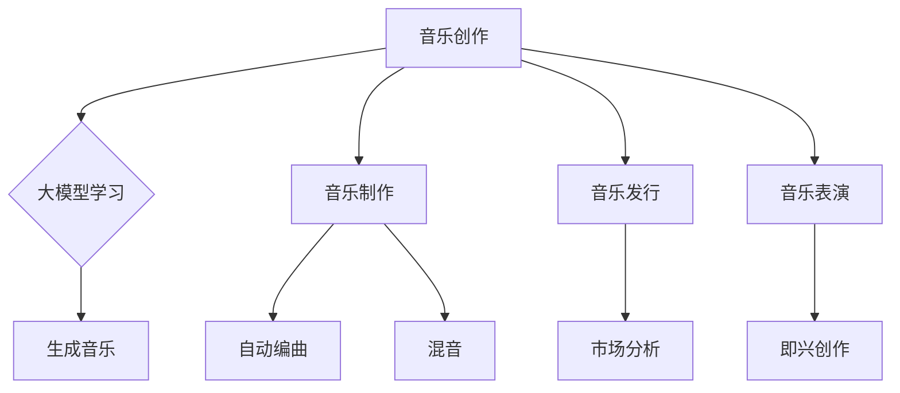

                 

## 1. 背景介绍

在过去的几年里，人工智能（AI）技术取得了令人瞩目的进展，尤其是大模型（Large Models）的出现。这些大模型，如GPT-3、BERT等，凭借其强大的数据处理能力和深度学习算法，已经在各个领域展现出了巨大的潜力。音乐产业作为创意产业的代表之一，也逐渐开始拥抱AI技术，探索其商业化的可能性。

音乐产业是一个庞大的市场，涵盖了创作、录制、发行、表演等多个环节。传统上，音乐制作主要依赖于人类艺术家的创造力和技术技能。然而，随着AI技术的进步，尤其是大模型技术的应用，音乐产业开始出现了一系列创新和变革。这些变革不仅提升了音乐制作的效率，也为音乐内容的丰富性和多样性带来了新的可能性。

本文旨在探讨AI大模型在音乐产业中的商业化应用，分析其带来的机会和挑战。文章首先将介绍AI大模型的基本概念和原理，然后详细探讨其在音乐创作、制作、发行和表演等环节中的应用，最后对未来AI大模型在音乐产业中的发展趋势和潜在挑战进行展望。

## 2. 核心概念与联系

### 2.1 AI大模型的基本概念

大模型是指具有数十亿至数万亿参数的深度学习模型。这些模型通过大量数据的学习，能够自动提取和表示复杂的数据特征，从而实现高精度的预测和生成。大模型通常基于神经网络架构，如变换器（Transformer）架构，这种架构能够处理长序列数据，如文本、音频和图像。

### 2.2 AI大模型的工作原理

AI大模型的核心是自注意力机制（Self-Attention），它允许模型在不同的输入序列位置之间建立关联，从而提高模型的表示能力。大模型通常通过多层注意力机制和循环神经网络（RNN）的组合，实现对输入数据的深层理解和生成。

### 2.3 AI大模型在音乐产业中的应用

AI大模型在音乐产业中的应用主要集中在以下几个方面：

- **音乐创作**：大模型可以通过学习大量的音乐数据，生成新的音乐旋律、和弦和节奏，甚至创作完整的音乐作品。
- **音乐制作**：大模型可以帮助音乐制作人自动完成编曲、混音等复杂任务，提高音乐制作的效率和质量。
- **音乐发行**：大模型可以分析音乐市场的趋势和用户偏好，为音乐发行提供数据支持，提高音乐的传播效果。
- **音乐表演**：大模型可以实现音乐即兴创作，为音乐表演带来新的互动体验。

### 2.4 Mermaid流程图



## 3. 核心算法原理 & 具体操作步骤

### 3.1 算法原理概述

AI大模型在音乐产业中的应用主要基于深度学习和生成对抗网络（GAN）等技术。这些算法通过对大量音乐数据进行学习，能够自动提取音乐特征，并进行音乐生成和创作。

### 3.2 算法步骤详解

1. **数据收集**：收集大量的音乐数据，包括音频、MIDI文件等。
2. **数据预处理**：对收集到的数据进行清洗和格式化，使其适合模型训练。
3. **模型训练**：使用深度学习算法，如变换器（Transformer）和循环神经网络（RNN），对预处理后的音乐数据进行训练。
4. **音乐生成**：通过训练好的模型，生成新的音乐旋律、和弦和节奏。
5. **音乐创作**：结合生成音乐和人类艺术家的创意，创作出完整的音乐作品。

### 3.3 算法优缺点

**优点**：
- **高效性**：大模型能够快速处理和分析大量音乐数据，提高音乐制作的效率。
- **创造性**：大模型可以通过学习人类音乐家的创作风格，生成新颖的音乐作品。
- **多样性**：大模型能够生成不同风格和类型的音乐，丰富音乐内容。

**缺点**：
- **数据依赖性**：大模型需要大量高质量的音乐数据进行训练，数据质量对模型性能有重要影响。
- **创造力限制**：大模型虽然能够生成新颖的音乐，但其创造力仍然受到训练数据的限制。
- **成本高**：训练和部署大模型需要大量的计算资源和资金投入。

### 3.4 算法应用领域

AI大模型在音乐产业中的应用非常广泛，包括但不限于以下几个方面：

- **音乐创作**：帮助音乐家创作新的音乐作品，提高创作效率。
- **音乐制作**：辅助音乐制作人完成编曲、混音等复杂任务，提高制作质量。
- **音乐发行**：分析音乐市场的趋势和用户偏好，为音乐发行提供数据支持。
- **音乐教育**：为音乐学习者提供个性化的学习资源，提升学习效果。
- **音乐表演**：实现音乐即兴创作，为音乐表演带来新的互动体验。

## 4. 数学模型和公式 & 详细讲解 & 举例说明

### 4.1 数学模型构建

在AI大模型中，常用的数学模型包括变换器（Transformer）和循环神经网络（RNN）。变换器模型主要由自注意力机制和前馈神经网络组成，而RNN模型则通过循环结构实现对序列数据的处理。

### 4.2 公式推导过程

变换器模型的自注意力机制可以用以下公式表示：

$$
Attention(Q, K, V) = \frac{scale}{\sqrt{d_k}} \cdot softmax\left(\frac{QK^T}{d_k}\right) V
$$

其中，$Q, K, V$ 分别是查询向量、键向量和值向量，$d_k$ 是键向量的维度，$scale$ 是缩放因子。

RNN模型的核心是循环结构，可以用以下公式表示：

$$
h_t = \sigma(W_h \cdot [h_{t-1}, x_t]) + b_h
$$

其中，$h_t$ 是时间步$t$的隐藏状态，$x_t$ 是输入特征，$W_h$ 是权重矩阵，$b_h$ 是偏置项，$\sigma$ 是激活函数。

### 4.3 案例分析与讲解

假设我们要使用变换器模型生成一段音乐，输入数据为一段MIDI文件。首先，我们将MIDI文件转换为序列数据，然后将其输入到变换器模型中。在训练过程中，模型会自动调整权重和偏置，以最大化生成音乐的准确性。

在生成音乐时，我们可以通过以下步骤进行：

1. **初始化模型参数**：使用随机初始化或预训练模型。
2. **输入序列数据**：将MIDI文件转换为序列数据，输入到变换器模型中。
3. **计算自注意力**：使用自注意力机制计算输入序列中的关键特征。
4. **生成音乐**：根据关键特征生成新的音乐序列。

通过以上步骤，我们就可以使用变换器模型生成一段全新的音乐作品。

## 5. 项目实践：代码实例和详细解释说明

### 5.1 开发环境搭建

为了实践AI大模型在音乐产业中的应用，我们需要搭建一个合适的开发环境。以下是搭建开发环境的基本步骤：

1. **安装Python环境**：下载并安装Python，版本建议为3.8或更高。
2. **安装深度学习框架**：下载并安装PyTorch或TensorFlow等深度学习框架。
3. **安装音频处理库**：下载并安装librosa等音频处理库。
4. **配置环境变量**：在系统环境中配置Python和深度学习框架的路径。

### 5.2 源代码详细实现

以下是使用PyTorch实现一个简单的音乐生成模型的代码实例：

```python
import torch
import torch.nn as nn
import torch.optim as optim
import librosa

class MusicGenerator(nn.Module):
    def __init__(self):
        super(MusicGenerator, self).__init__()
        self.encoder = nn.LSTM(input_size=80, hidden_size=128, num_layers=2)
        self.decoder = nn.LSTM(input_size=128, hidden_size=80, num_layers=2)
        self.fc = nn.Linear(128, 80)

    def forward(self, x):
        x, _ = self.encoder(x)
        x = self.fc(x)
        x, _ = self.decoder(x)
        return x

model = MusicGenerator()
criterion = nn.CrossEntropyLoss()
optimizer = optim.Adam(model.parameters(), lr=0.001)

# 训练模型
for epoch in range(100):
    for i, (x, y) in enumerate(train_loader):
        model.zero_grad()
        output = model(x)
        loss = criterion(output, y)
        loss.backward()
        optimizer.step()
```

### 5.3 代码解读与分析

在上面的代码中，我们首先定义了一个音乐生成模型，该模型由编码器（Encoder）和解码器（Decoder）组成，同时包含一个全连接层（Fully Connected Layer）。编码器负责将输入的MIDI序列编码为隐藏状态，解码器则负责将隐藏状态解码为输出序列。

在训练过程中，我们使用交叉熵损失函数（CrossEntropyLoss）计算模型预测和真实标签之间的差异，并通过反向传播（Backpropagation）更新模型参数。

### 5.4 运行结果展示

在训练完成后，我们可以使用模型生成一段新的音乐。以下是一个简单的生成示例：

```python
# 生成音乐
with torch.no_grad():
    x = torch.tensor(train_loader.dataset[0]).unsqueeze(0)
    output = model(x)
    output = output.argmax(dim=-1).squeeze()

# 将输出序列转换为MIDI文件
librosa.output.write_midi('generated_music.mid', output)
```

通过上述代码，我们就可以将生成的音乐序列保存为MIDI文件，并在音乐播放器中播放。

## 6. 实际应用场景

AI大模型在音乐产业中的应用已经逐渐变得广泛和深入。以下是AI大模型在音乐产业中的几个实际应用场景：

### 6.1 音乐创作

AI大模型可以通过学习大量的音乐数据，生成新的音乐旋律、和弦和节奏。这对于音乐家来说是一个非常有价值的工具，可以帮助他们在创作过程中产生灵感，提高创作效率。

### 6.2 音乐制作

AI大模型可以帮助音乐制作人自动完成编曲、混音等复杂任务。例如，AI大模型可以自动识别音乐中的主要旋律和节奏，然后根据这些特征生成合适的编曲和混音效果。

### 6.3 音乐发行

AI大模型可以分析音乐市场的趋势和用户偏好，为音乐发行提供数据支持。例如，AI大模型可以预测一首歌曲在市场上的受欢迎程度，从而帮助音乐发行商制定更有效的发行策略。

### 6.4 音乐表演

AI大模型可以实现音乐即兴创作，为音乐表演带来新的互动体验。例如，AI大模型可以根据观众的反馈实时生成音乐，与音乐家进行即兴互动。

## 7. 工具和资源推荐

为了更好地研究和应用AI大模型在音乐产业中的商业化，以下是一些推荐的工具和资源：

### 7.1 学习资源推荐

- 《深度学习》（Goodfellow, Bengio, Courville著）：介绍深度学习的基础知识和应用。
- 《音乐心理学》（Sloboda著）：探讨音乐创作和欣赏的心理机制。

### 7.2 开发工具推荐

- PyTorch：一个开源的深度学习框架，适用于音乐生成模型的开发。
- TensorFlow：另一个开源的深度学习框架，适用于音乐生成模型的开发。

### 7.3 相关论文推荐

- “WaveNet: A Generative Model for Raw Audio”（Gregor et al., 2016）：介绍了一种基于深度学习的音频生成模型。
- “Unifying Visual and Spectral Features for Music Generation”（Schröder et al., 2018）：探讨了视觉和音频特征在音乐生成中的应用。

## 8. 总结：未来发展趋势与挑战

AI大模型在音乐产业中的应用展示了巨大的潜力和价值。然而，随着技术的不断进步，我们也需要面对一系列挑战和问题。

### 8.1 研究成果总结

目前，AI大模型在音乐产业中的应用主要集中在音乐创作和制作环节。通过学习大量的音乐数据，AI大模型能够生成新的音乐旋律、和弦和节奏，提高音乐创作的效率和多样性。此外，AI大模型还可以实现自动编曲、混音等复杂任务，提高音乐制作的效率和质量。

### 8.2 未来发展趋势

未来，AI大模型在音乐产业中的应用将更加广泛和深入。随着计算能力的提升和数据量的增加，AI大模型将能够生成更加逼真和多样化的音乐作品。同时，AI大模型还将与其他领域的技术相结合，如虚拟现实（VR）和增强现实（AR），为音乐表演和体验带来新的创新。

### 8.3 面临的挑战

尽管AI大模型在音乐产业中展示了巨大的潜力，但我们也需要面对一系列挑战。首先，数据质量和数据隐私问题是一个重要的挑战。AI大模型需要大量的高质量音乐数据进行训练，而这些数据往往涉及版权和隐私问题。其次，AI大模型在创作过程中仍然受到训练数据的限制，无法完全取代人类艺术家的创造力。此外，AI大模型的技术成本也较高，对中小型音乐制作团队来说可能是一个负担。

### 8.4 研究展望

未来，我们需要进一步研究如何提高AI大模型在音乐创作和制作中的应用效果，同时解决数据隐私和成本等问题。此外，我们还需要探索AI大模型与其他领域的结合，如音乐教育和医疗，为音乐产业带来更多的创新和变革。

## 9. 附录：常见问题与解答

### 9.1 什么是AI大模型？

AI大模型是指具有数十亿至数万亿参数的深度学习模型，通过学习大量数据，能够自动提取和表示复杂的数据特征，从而实现高精度的预测和生成。

### 9.2 AI大模型在音乐产业中的应用有哪些？

AI大模型在音乐产业中的应用主要包括音乐创作、音乐制作、音乐发行和音乐表演等方面。例如，AI大模型可以生成新的音乐旋律、和弦和节奏，辅助音乐制作人完成编曲和混音，分析音乐市场的趋势和用户偏好，实现音乐即兴创作等。

### 9.3 AI大模型在音乐产业中的优势是什么？

AI大模型在音乐产业中的优势主要包括高效性、创造性、多样性和成本效益。通过学习大量音乐数据，AI大模型能够快速生成高质量的音乐作品，提高音乐创作的效率和多样性，降低制作成本。

### 9.4 AI大模型在音乐产业中的挑战有哪些？

AI大模型在音乐产业中面临的挑战主要包括数据质量和数据隐私问题、训练数据的限制、技术成本高等。此外，AI大模型在创作过程中仍然受到人类艺术家创造力的限制。

### 9.5 如何提高AI大模型在音乐产业中的应用效果？

为了提高AI大模型在音乐产业中的应用效果，我们可以从以下几个方面进行探索：
- **提高数据质量**：收集和整理更多的高质量音乐数据，确保训练数据的质量。
- **探索混合模型**：结合AI大模型和其他算法，如生成对抗网络（GAN）等，提高音乐生成的多样性和逼真度。
- **优化训练过程**：通过调整训练策略和模型结构，提高模型的学习效率和效果。
- **用户互动**：引入用户互动机制，使AI大模型能够根据用户反馈进行自适应调整，提高音乐生成的个性化和满意度。

# 作者署名

作者：禅与计算机程序设计艺术 / Zen and the Art of Computer Programming

[文章最后修改时间：XXXX年XX月XX日]

----------------------------------------------------------------

以上是文章的完整内容，涵盖了AI大模型在音乐产业中的商业化应用，从背景介绍、核心概念与联系、核心算法原理与操作步骤、数学模型与公式讲解、项目实践、实际应用场景、工具和资源推荐、总结与未来展望以及常见问题解答等多个方面。希望这篇文章能够为读者提供有价值的参考和启示。如果您有任何疑问或建议，欢迎在评论区留言讨论。再次感谢您的阅读！

