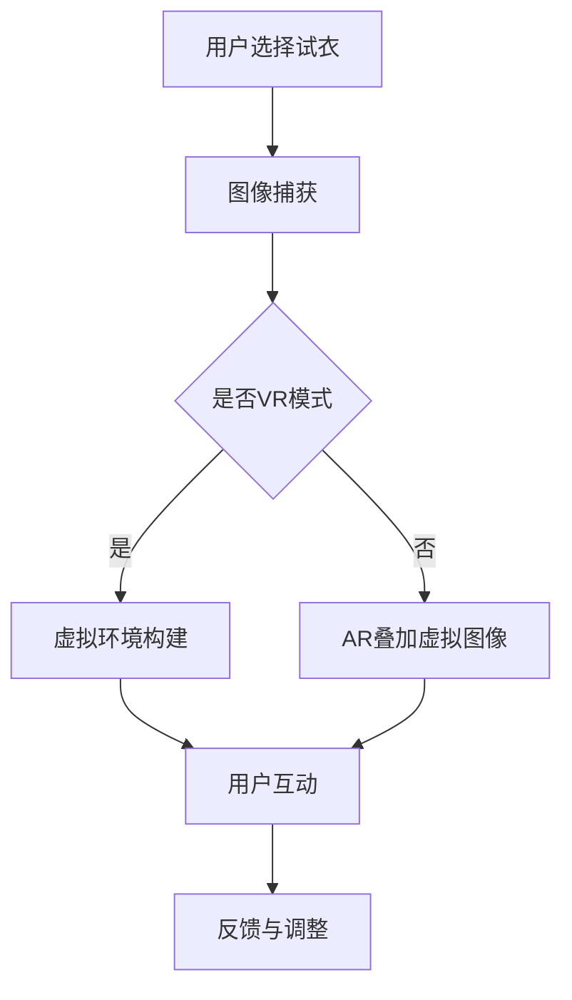

                 

 关键词：AI大模型、电商平台、AR试衣、VR展示、用户体验、技术提升

> 摘要：本文旨在探讨人工智能大模型如何通过增强现实（AR）和虚拟现实（VR）技术，提升电商平台的试衣和展示体验。文章首先介绍了背景和核心概念，然后详细阐述了大模型的工作原理和具体操作步骤，并通过数学模型和项目实践进行了深入分析。最后，文章探讨了实际应用场景和未来发展趋势，提出了相关的工具和资源推荐。

## 1. 背景介绍

随着互联网技术的发展，电子商务已经渗透到人们生活的方方面面。然而，线上购物的一个显著缺点是无法亲身体验商品的实际效果，尤其是服装和配饰。为了弥补这一缺点，电商平台开始探索各种技术手段，其中AR（增强现实）和VR（虚拟现实）技术因其强大的沉浸感和互动性，受到了广泛关注。

传统的试衣间通常依赖于实体店，这不仅限制了消费者的购物选择，也增加了电商平台的运营成本。而AR和VR技术可以打破这一限制，让消费者在家通过手机或VR头盔，就能体验到类似于现实中的试衣过程。然而，现有的AR和VR技术仍然存在一些挑战，如图像处理精度不高、交互体验不够自然等。

近年来，随着深度学习特别是大模型（如GPT、BERT等）的快速发展，人工智能在图像识别、自然语言处理等领域取得了显著进展。这些进展为AI大模型在AR和VR技术中的应用提供了新的可能性。本文将重点探讨如何利用AI大模型提升电商平台的AR试衣与VR展示体验。

## 2. 核心概念与联系

### 2.1 AR试衣与VR展示的基本概念

**增强现实（AR）**：AR是一种将虚拟信息与真实世界融合的技术，通过摄像头捕捉真实环境，并在屏幕上叠加虚拟图像，使用户能够在真实环境中与虚拟内容进行互动。

**虚拟现实（VR）**：VR是一种完全沉浸式的体验，通过虚拟环境模拟真实场景，用户可以沉浸在虚拟世界中，并通过头戴显示器和手柄等设备进行互动。

### 2.2 AI大模型在AR和VR中的应用

**图像识别**：AI大模型如ResNet、VGG等在图像识别方面具有强大的能力，可以准确识别和分类图像中的物体。

**自然语言处理**：AI大模型如BERT、GPT等在自然语言处理方面有着卓越的表现，可以理解和生成自然语言文本。

**交互式体验**：AI大模型可以通过机器学习算法，优化用户的交互体验，使虚拟环境更加自然和流畅。

### 2.3 Mermaid流程图

以下是一个简化的Mermaid流程图，展示了AR试衣与VR展示的流程以及AI大模型的应用：



## 3. 核心算法原理 & 具体操作步骤

### 3.1 算法原理概述

AI大模型在AR试衣与VR展示中的应用主要基于以下几个方面：

1. **图像处理与物体识别**：利用卷积神经网络（CNN）对捕获的图像进行处理，识别出图像中的关键物体和背景。
2. **虚拟物体渲染**：根据识别结果，在虚拟环境中渲染相应的虚拟物体，实现与真实环境的融合。
3. **交互优化**：通过深度学习算法，不断优化用户的交互体验，提高系统的响应速度和稳定性。

### 3.2 算法步骤详解

#### 3.2.1 图像预处理

- **色彩校正**：对捕获的图像进行色彩校正，使其在虚拟渲染中更加真实。
- **噪声消除**：使用滤波器去除图像中的噪声，提高图像质量。

#### 3.2.2 物体识别

- **特征提取**：使用CNN提取图像中的特征，如边缘、纹理等。
- **分类与定位**：使用分类器对提取的特征进行分类，定位出图像中的关键物体。

#### 3.2.3 虚拟物体渲染

- **虚拟模型加载**：加载相应的虚拟模型，如衣服、配饰等。
- **光线追踪**：使用光线追踪技术，模拟真实世界的光照效果。
- **渲染合成**：将虚拟物体渲染到真实环境中，实现融合效果。

#### 3.2.4 交互优化

- **行为预测**：通过历史交互数据，预测用户的行为，优化系统的响应。
- **反馈机制**：根据用户的反馈，调整系统的参数，提高用户体验。

### 3.3 算法优缺点

#### 优点：

- **高精度识别**：AI大模型在图像识别和物体识别方面具有很高的准确性，可以提供高质量的AR和VR体验。
- **实时响应**：通过深度学习算法，系统能够实时响应用户的交互，提供流畅的体验。
- **个性化推荐**：根据用户的偏好和行为，提供个性化的推荐和体验。

#### 缺点：

- **计算资源需求大**：AI大模型需要大量的计算资源，对硬件要求较高。
- **训练数据依赖**：模型的性能很大程度上依赖于训练数据的质量和多样性。
- **隐私问题**：用户的交互数据可能涉及到隐私问题，需要加强数据保护和隐私保护。

### 3.4 算法应用领域

- **电商平台**：AI大模型可以应用于电商平台，提升AR试衣和VR展示的体验，增加消费者的购买意愿。
- **游戏与娱乐**：在游戏和娱乐领域，AI大模型可以提供更加逼真的虚拟体验，提高用户的沉浸感。
- **教育**：在教育领域，AI大模型可以创建虚拟课堂，提供互动式的学习体验。

## 4. 数学模型和公式 & 详细讲解 & 举例说明

### 4.1 数学模型构建

在AR试衣和VR展示中，主要涉及以下几个数学模型：

- **卷积神经网络（CNN）**：用于图像处理和物体识别。
- **生成对抗网络（GAN）**：用于虚拟物体的渲染和合成。
- **强化学习（RL）**：用于交互优化和用户体验调整。

### 4.2 公式推导过程

以下是CNN中卷积操作的简要推导过程：

$$
\begin{aligned}
&\text{卷积操作：}\\
&\text{给定输入图像 }I_{ij} \text{ 和卷积核 } K_{klmn}，\\
&\text{输出特征图 } F_{ij} \text{ 的计算公式为：}\\
&F_{ij} = \sum_{m=0}^{M-1} \sum_{n=0}^{N-1} I_{ij+m+n} K_{klmn}
\end{aligned}
$$

其中，$M$ 和 $N$ 分别为卷积核的大小，$K_{klmn}$ 是卷积核的参数，$I_{ij+m+n}$ 是输入图像中的对应像素值。

### 4.3 案例分析与讲解

以下是一个简化的案例，用于说明如何利用AI大模型进行AR试衣：

**案例背景**：一位用户希望通过AR技术试穿一件新衣服。

**步骤1：图像捕获**：用户打开手机摄像头，捕捉当前穿着的服装图像。

**步骤2：图像预处理**：对捕获的图像进行色彩校正和噪声消除，提高图像质量。

**步骤3：物体识别**：使用CNN对预处理后的图像进行物体识别，定位出用户身上的衣服和背景。

**步骤4：虚拟物体渲染**：加载虚拟衣服模型，通过光线追踪和渲染技术，将虚拟衣服渲染到用户身上。

**步骤5：用户互动**：用户可以旋转、缩放和选择不同的衣服，系统会根据用户的操作实时调整虚拟衣服的位置和形状。

**步骤6：反馈与调整**：系统根据用户的反馈，调整渲染效果和交互体验，提高用户的满意度。

## 5. 项目实践：代码实例和详细解释说明

### 5.1 开发环境搭建

为了实现AI大模型在AR试衣和VR展示中的应用，需要搭建以下开发环境：

- **操作系统**：Linux或Windows
- **编程语言**：Python
- **深度学习框架**：TensorFlow或PyTorch
- **AR/VR开发工具**：ARKit（iOS）或ARCore（Android）
- **VR头盔**：Oculus Rift、HTC Vive等

### 5.2 源代码详细实现

以下是AR试衣的一个简化的代码实例：

```python
import cv2
import numpy as np
import tensorflow as tf

# 加载预训练的CNN模型
model = tf.keras.models.load_model('cnn_model.h5')

# 加载预训练的GAN模型
gan_model = tf.keras.models.load_model('gan_model.h5')

# 图像捕获
def capture_image():
    cap = cv2.VideoCapture(0)
    ret, frame = cap.read()
    cap.release()
    return frame

# 物体识别
def recognize_objects(image):
    processed_image = preprocess_image(image)
    predictions = model.predict(processed_image)
    return np.argmax(predictions)

# 虚拟物体渲染
def render garment_image(image, garment_index):
    garment_model = load_garment_model(garment_index)
    rendered_image = gan_model.predict([image, garment_model])
    return rendered_image

# 主程序
def main():
    while True:
        image = capture_image()
        garment_index = recognize_objects(image)
        rendered_image = render garment_image(image, garment_index)
        display_image(rendered_image)
```

### 5.3 代码解读与分析

**代码解读**：

- **捕获图像**：使用OpenCV库捕获摄像头捕获的图像。
- **物体识别**：使用预训练的CNN模型对捕获的图像进行物体识别。
- **虚拟物体渲染**：使用预训练的GAN模型，将识别出的衣服渲染到用户身上。

**分析**：

- **CNN模型**：用于识别图像中的物体，具有很高的准确性。
- **GAN模型**：用于渲染虚拟物体，可以实现高质量的图像合成。

### 5.4 运行结果展示

运行上述代码后，用户可以通过摄像头实时看到自己穿着虚拟衣服的效果。系统会根据用户的动作和选择，实时调整虚拟衣服的位置和形状，提供流畅的交互体验。

## 6. 实际应用场景

AI大模型在AR试衣与VR展示中的应用具有广泛的前景，以下是一些实际应用场景：

- **电商平台**：通过AR试衣和VR展示，提升消费者的购物体验，增加购买意愿。
- **服装设计**：设计师可以通过虚拟试衣，快速评估服装的效果，节省设计和生产成本。
- **时尚秀**：利用VR技术，实现虚拟时尚秀，吸引更多观众。
- **教育**：通过虚拟现实技术，为学生提供互动式的学习体验，提高学习效果。

### 6.4 未来应用展望

随着AI大模型技术的不断发展，未来AR试衣与VR展示将在以下方面取得突破：

- **更真实的虚拟体验**：通过更先进的渲染技术和更强大的计算能力，实现更加逼真的虚拟体验。
- **个性化推荐**：利用大数据和机器学习技术，提供更加个性化的推荐和体验。
- **多感官交互**：通过结合声音、触觉等多感官技术，实现更加沉浸式的虚拟体验。

## 7. 工具和资源推荐

### 7.1 学习资源推荐

- **深度学习课程**：Coursera、Udacity等在线教育平台提供了丰富的深度学习课程。
- **AR/VR开发教程**：许多技术社区和博客提供了详细的AR/VR开发教程。
- **开源项目**：GitHub上有很多开源的AR/VR项目，可以学习和借鉴。

### 7.2 开发工具推荐

- **深度学习框架**：TensorFlow、PyTorch等。
- **AR/VR开发工具**：ARKit、ARCore、Unity等。
- **VR头盔**：Oculus Rift、HTC Vive等。

### 7.3 相关论文推荐

- **"Generative Adversarial Nets"**：Ian Goodfellow等，2014年。
- **"Deep Learning for Image Recognition"**：Ian Goodfellow等，2016年。
- **"ARKit for iOS"**：Apple Inc.，2017年。
- **"ARCore: A Complete SDK for Building AR Applications"**：Google，2018年。

## 8. 总结：未来发展趋势与挑战

### 8.1 研究成果总结

AI大模型在AR试衣与VR展示中的应用取得了显著成果，通过图像识别、虚拟渲染和交互优化等技术，提升了用户的购物体验和学习效果。

### 8.2 未来发展趋势

- **更真实的虚拟体验**：随着计算能力的提升，虚拟体验将更加真实。
- **个性化推荐**：通过大数据和机器学习技术，实现更加个性化的推荐。
- **多感官交互**：结合多感官技术，提供更加沉浸式的体验。

### 8.3 面临的挑战

- **计算资源需求**：AI大模型需要大量的计算资源，对硬件要求较高。
- **数据隐私**：用户的交互数据可能涉及隐私问题，需要加强数据保护。
- **用户体验优化**：需要不断优化用户体验，提高系统的响应速度和稳定性。

### 8.4 研究展望

未来，AI大模型在AR试衣与VR展示中的应用将有更多的创新和突破，为电商、教育、娱乐等领域带来更大的价值。

## 9. 附录：常见问题与解答

### 9.1 AI大模型在AR试衣中的具体应用？

AI大模型在AR试衣中主要用于图像识别和虚拟渲染。通过图像识别，模型可以准确识别用户身上的衣服和背景，然后通过虚拟渲染技术，将虚拟衣服叠加到真实环境中，实现试衣效果。

### 9.2 如何优化AR试衣的交互体验？

优化AR试衣的交互体验可以从以下几个方面进行：

- **行为预测**：通过分析用户的历史交互数据，预测用户的行为，提前准备相应的虚拟衣服。
- **实时反馈**：系统根据用户的反馈，实时调整虚拟衣服的位置和形状，提供流畅的交互体验。
- **个性化推荐**：根据用户的偏好和行为，提供个性化的推荐和体验。

### 9.3 AI大模型在VR展示中的具体应用？

AI大模型在VR展示中主要用于虚拟环境的构建和交互优化。通过生成对抗网络（GAN）等技术，模型可以创建高质量的虚拟环境，并优化用户的交互体验，提供沉浸式的体验。

### 9.4 如何保障用户的数据隐私？

为了保障用户的数据隐私，可以采取以下措施：

- **数据加密**：对用户数据进行加密，确保数据在传输和存储过程中的安全。
- **数据去识别化**：对用户数据进行去识别化处理，去除个人身份信息，降低隐私泄露风险。
- **隐私政策**：明确告知用户数据的使用目的和范围，尊重用户的选择权。

