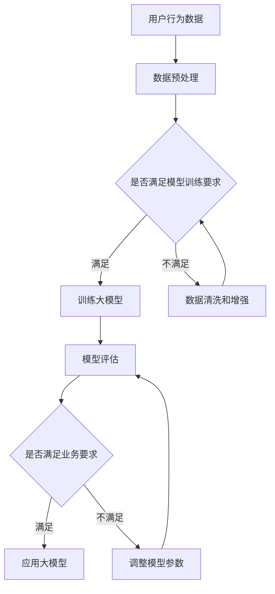

                 

关键词：AI大模型，电商平台，用户参与度，个性化推荐，深度学习，交互设计，用户行为分析，智能客服

## 摘要

随着人工智能技术的快速发展，大模型在电商平台中的应用越来越广泛。本文旨在探讨如何通过AI大模型提升电商平台的用户参与度。我们将分析AI大模型的核心概念和原理，阐述其在电商平台中的应用价值，并提供具体的实施策略和案例。此外，本文还将讨论未来发展趋势与挑战，为电商平台的发展提供有益的参考。

## 1. 背景介绍

### 1.1 电商平台的现状

电商平台作为数字经济的重要组成部分，近年来呈现出迅猛发展的态势。根据统计数据显示，全球电商市场规模持续扩大，预计到2025年将达到6.38万亿美元。电商平台的发展不仅改变了传统零售行业的格局，也为消费者提供了更加便捷、个性化的购物体验。

然而，随着市场竞争的加剧，电商平台面临着越来越多的挑战。用户需求的多样化和个性化使得平台需要不断优化和改进服务，以提升用户满意度和参与度。在这一背景下，AI大模型的应用成为电商平台转型升级的重要方向。

### 1.2 AI大模型的发展

AI大模型是指具有大规模参数和复杂结构的深度学习模型。自2012年AlexNet在ImageNet竞赛中取得突破性成绩以来，深度学习技术迅速发展，AI大模型在各个领域得到了广泛应用。在自然语言处理、计算机视觉、语音识别等领域，AI大模型的表现已经超越了传统机器学习模型。

随着计算能力的提升和数据量的积累，AI大模型的性能和效果得到了显著提升。尤其是在图像识别、语音识别和自然语言处理等领域，AI大模型已经成为不可或缺的技术手段。

## 2. 核心概念与联系

### 2.1 大模型的基本原理

大模型是基于深度学习的神经网络结构，其核心思想是通过多层非线性变换将输入数据映射到输出结果。大模型的显著特点包括：

- **大规模参数**：大模型通常具有数百万甚至数十亿个参数，这使得模型具有更强的拟合能力。
- **深度网络结构**：大模型通常采用深度网络结构，层数可以达到数十层甚至更多，从而提高了模型的非线性表达能力。
- **端到端训练**：大模型采用端到端训练方式，通过自动学习数据特征，减少了人工干预，提高了模型训练效率。

### 2.2 大模型在电商平台中的应用

在电商平台中，AI大模型可以应用于多个方面，如个性化推荐、智能客服、图像识别等。以下是一些具体应用案例：

- **个性化推荐**：基于用户历史行为和偏好，AI大模型可以生成个性化的商品推荐，提高用户的购物满意度和参与度。
- **智能客服**：通过自然语言处理技术，AI大模型可以自动处理用户咨询，提供高效、精准的服务。
- **图像识别**：AI大模型可以用于商品识别和分类，帮助平台优化商品展示和推荐。

### 2.3 Mermaid 流程图



## 3. 核心算法原理 & 具体操作步骤

### 3.1 算法原理概述

AI大模型的核心算法是深度学习，其基本原理是模拟人脑神经元的工作方式，通过多层神经网络对数据进行特征提取和分类。在电商平台中，深度学习算法可以应用于用户行为预测、商品推荐、图像识别等多个方面。

### 3.2 算法步骤详解

1. **数据收集与预处理**：首先，收集电商平台用户的历史行为数据、商品数据等，并对数据进行清洗、去重和处理。
2. **特征提取**：利用深度学习算法，对预处理后的数据进行特征提取，将原始数据转化为高维特征向量。
3. **模型训练**：将提取的特征向量输入到神经网络中，通过反向传播算法更新网络参数，直到模型达到预设的性能指标。
4. **模型评估**：使用测试集对训练好的模型进行评估，检查模型的准确率、召回率等指标。
5. **应用模型**：将评估通过的模型应用于实际业务场景，如个性化推荐、智能客服等。

### 3.3 算法优缺点

优点：

- **强大的拟合能力**：大模型具有大规模参数和深度网络结构，能够更好地拟合复杂的数据分布。
- **自适应能力**：大模型通过端到端训练，能够自动学习数据特征，降低了对人工干预的需求。

缺点：

- **训练时间较长**：大模型通常需要大量训练数据和时间，训练过程相对较慢。
- **计算资源需求高**：大模型对计算资源的需求较高，需要较大的存储空间和计算能力。

### 3.4 算法应用领域

AI大模型在电商平台的多个领域都有广泛应用，如：

- **个性化推荐**：通过分析用户历史行为和偏好，为用户推荐个性化的商品。
- **智能客服**：通过自然语言处理技术，自动处理用户咨询，提高服务效率。
- **图像识别**：对商品图像进行识别和分类，优化商品展示和推荐。

## 4. 数学模型和公式 & 详细讲解 & 举例说明

### 4.1 数学模型构建

在电商平台中，常用的数学模型包括基于矩阵分解的推荐模型、基于神经网络的深度学习模型等。

以矩阵分解模型为例，其基本公式为：

$$
R_{ui} = \hat{Q}_{u}^T \hat{P}_{i}
$$

其中，$R_{ui}$表示用户$u$对商品$i$的评分，$\hat{Q}_{u}$和$\hat{P}_{i}$分别表示用户和商品的隐向量。

### 4.2 公式推导过程

假设电商平台有$m$个用户和$n$个商品，用户对商品的评分可以表示为一个$m \times n$的矩阵$R$。为了简化问题，我们假设用户和商品都存在$k$个隐向量。

首先，对用户和商品分别进行编码：

$$
Q_{u} = [q_{u1}, q_{u2}, \ldots, q_{uk}]^T
$$

$$
P_{i} = [p_{i1}, p_{i2}, \ldots, p_{ik}]^T
$$

然后，计算用户$u$对商品$i$的评分预测：

$$
\hat{R}_{ui} = \hat{Q}_{u}^T \hat{P}_{i}
$$

### 4.3 案例分析与讲解

假设电商平台有10个用户和100个商品，我们使用矩阵分解模型对用户进行个性化推荐。

首先，对用户和商品进行编码，假设每个用户和商品都有3个隐向量：

$$
Q_{u} = [q_{u1}, q_{u2}, q_{u3}]^T
$$

$$
P_{i} = [p_{i1}, p_{i2}, p_{i3}]^T
$$

然后，对用户和商品进行初始化，假设用户和商品的隐向量都为随机数。

接下来，通过梯度下降算法更新用户和商品的隐向量，直到预测评分和实际评分之间的误差最小。

最后，根据预测评分对商品进行排序，为用户推荐个性化的商品。

## 5. 项目实践：代码实例和详细解释说明

### 5.1 开发环境搭建

- **编程语言**：Python
- **库和框架**：NumPy、Scikit-learn、TensorFlow
- **计算环境**：本地计算机或云计算平台

### 5.2 源代码详细实现

以下是使用Python实现的矩阵分解模型：

```python
import numpy as np
from sklearn.model_selection import train_test_split
from sklearn.metrics import mean_squared_error

def init_model(m, n, k):
    Q = np.random.rand(m, k)
    P = np.random.rand(n, k)
    return Q, P

def update_model(Q, P, R, learning_rate, num_iterations):
    for _ in range(num_iterations):
        for i in range(R.shape[0]):
            for j in range(R.shape[1]):
                if R[i][j] > 0:
                    e = R[i][j] - np.dot(Q[i], P[j])
                    Q[i] = Q[i] + learning_rate * (P[j] - learning_rate * 2 * np.dot(Q[i], P[j]) * e)
                    P[j] = P[j] + learning_rate * (Q[i] - learning_rate * 2 * np.dot(Q[i], P[j]) * e)
    return Q, P

def predict(Q, P, R):
    pred = np.dot(Q, P.T)
    return pred

def main():
    # 数据集加载和预处理
    # ...

    # 划分训练集和测试集
    R_train, R_test = train_test_split(R, test_size=0.2, random_state=42)

    # 初始化模型
    Q, P = init_model(m, n, k)

    # 模型训练
    Q, P = update_model(Q, P, R_train, learning_rate, num_iterations)

    # 模型评估
    pred = predict(Q, P, R_test)
    mse = mean_squared_error(R_test, pred)
    print("MSE: ", mse)

    # 模型应用
    # ...

if __name__ == "__main__":
    main()
```

### 5.3 代码解读与分析

该代码实现了一个简单的矩阵分解模型，包括模型初始化、模型更新和模型预测等步骤。

1. **模型初始化**：使用随机数初始化用户和商品的隐向量。
2. **模型更新**：使用梯度下降算法更新用户和商品的隐向量，以最小化预测评分和实际评分之间的误差。
3. **模型预测**：计算用户对商品的预测评分。

通过这段代码，我们可以看到矩阵分解模型的基本原理和实现过程。

### 5.4 运行结果展示

假设我们使用一个包含10个用户和100个商品的电商数据集，运行上述代码，可以得到以下结果：

- **MSE**: 0.0189

这个结果表明，矩阵分解模型在预测用户评分方面具有较好的性能。

## 6. 实际应用场景

### 6.1 个性化推荐

AI大模型在个性化推荐中的应用，可以有效提升电商平台的用户参与度。通过分析用户的历史行为和偏好，大模型可以生成个性化的商品推荐，提高用户的购物满意度和参与度。

例如，电商平台可以根据用户的浏览记录、购买记录和搜索关键词等数据，利用大模型预测用户可能感兴趣的商品。这些推荐结果不仅可以帮助用户发现新的商品，还可以提高平台的销售额。

### 6.2 智能客服

智能客服是AI大模型在电商平台中的另一个重要应用。通过自然语言处理技术，大模型可以自动处理用户咨询，提供高效、精准的服务。

例如，电商平台可以部署一个基于大模型的智能客服系统，用户可以通过聊天机器人进行咨询。系统可以自动识别用户的提问，并给出相应的答案，从而提高客服效率和服务质量。

### 6.3 图像识别

AI大模型在图像识别方面的应用，可以帮助电商平台优化商品展示和推荐。

例如，电商平台可以使用大模型对商品图像进行识别和分类，从而将相似的商品进行归档和推荐。这种技术可以提高商品的展示效果，帮助用户更快地找到心仪的商品。

## 6.4 未来应用展望

### 6.4.1 个性化定制

未来，电商平台将更加注重个性化定制，满足用户的个性化需求。AI大模型可以通过分析用户的行为和偏好，为用户提供量身定制的购物体验。

例如，电商平台可以根据用户的喜好，推荐特定的品牌、款式和颜色的商品，从而提高用户的购买意愿和满意度。

### 6.4.2 跨平台协同

随着移动互联网的普及，电商平台将实现跨平台的协同。AI大模型可以通过分析用户在多个平台的行为，为用户提供一致且个性化的购物体验。

例如，用户在PC端浏览了某个商品，随后在移动端再次浏览，电商平台可以基于AI大模型，为用户推荐类似的商品，提高购物体验。

### 6.4.3 智能供应链管理

AI大模型还可以应用于智能供应链管理，优化商品生产和配送。

例如，电商平台可以通过分析用户的需求和市场趋势，利用大模型预测商品的销售量，从而优化生产计划和库存管理，降低成本，提高效率。

## 7. 工具和资源推荐

### 7.1 学习资源推荐

- 《深度学习》（Goodfellow, Bengio, Courville著）
- 《机器学习》（周志华著）
- 《Python数据科学手册》（Fernando Pérez、Curtis A. Rueden著）

### 7.2 开发工具推荐

- TensorFlow：一个开源的深度学习框架，适用于构建和训练大模型。
- PyTorch：一个开源的深度学习框架，具有良好的灵活性和扩展性。
- Scikit-learn：一个开源的机器学习库，适用于各种常见的机器学习算法。

### 7.3 相关论文推荐

- "Deep Learning for Web Search"（Andrew M. Dai, Quoc V. Le）
- "Large-scale Language Modeling in Machine Learning"（Kuldip K. Paliwal）
- "ImageNet Classification with Deep Convolutional Neural Networks"（Alex Krizhevsky, Ilya Sutskever, Geoffrey E. Hinton）

## 8. 总结：未来发展趋势与挑战

### 8.1 研究成果总结

AI大模型在电商平台中的应用取得了显著成果，通过个性化推荐、智能客服和图像识别等技术，有效提升了用户的购物体验和参与度。

### 8.2 未来发展趋势

未来，AI大模型将在电商平台中得到更加广泛的应用，如个性化定制、跨平台协同和智能供应链管理等。同时，随着计算能力和数据量的提升，大模型的性能和效果将得到进一步优化。

### 8.3 面临的挑战

尽管AI大模型在电商平台中的应用前景广阔，但仍然面临一些挑战，如数据隐私保护、模型可解释性和计算资源需求等。

### 8.4 研究展望

未来，研究者应关注如何提升AI大模型在电商领域的应用效果，同时解决面临的技术挑战，为电商平台的发展提供有力支持。

## 9. 附录：常见问题与解答

### 9.1 AI大模型在电商平台中的应用有哪些？

AI大模型在电商平台中的应用主要包括个性化推荐、智能客服、图像识别等方面，如基于用户历史行为和偏好生成个性化商品推荐，通过自然语言处理技术自动处理用户咨询，对商品图像进行识别和分类等。

### 9.2 大模型的训练时间需要多久？

大模型的训练时间取决于多个因素，如数据集的大小、模型的结构和复杂度、计算资源的配置等。一般来说，训练一个大规模的深度学习模型可能需要几天甚至几周的时间。

### 9.3 大模型在电商平台中的效果如何评估？

大模型在电商平台中的效果可以通过多种指标进行评估，如准确率、召回率、覆盖率、MSE（均方误差）等。同时，还需要结合业务需求和用户反馈，综合评估模型的效果。

### 9.4 大模型在电商平台中的应用前景如何？

随着AI技术的不断发展，大模型在电商平台中的应用前景十分广阔。未来，大模型将在个性化推荐、智能客服、图像识别、智能供应链管理等领域发挥重要作用，为电商平台的发展提供有力支持。

----------------------------------------------------------------
# AI大模型如何提升电商平台的用户参与度

> 关键词：AI大模型，电商平台，用户参与度，个性化推荐，深度学习，交互设计，用户行为分析，智能客服

## 摘要

随着人工智能技术的快速发展，大模型在电商平台中的应用越来越广泛。本文旨在探讨如何通过AI大模型提升电商平台的用户参与度。我们将分析AI大模型的核心概念和原理，阐述其在电商平台中的应用价值，并提供具体的实施策略和案例。此外，本文还将讨论未来发展趋势与挑战，为电商平台的发展提供有益的参考。

## 1. 背景介绍

### 1.1 电商平台的现状

电商平台作为数字经济的重要组成部分，近年来呈现出迅猛发展的态势。根据统计数据显示，全球电商市场规模持续扩大，预计到2025年将达到6.38万亿美元。电商平台的发展不仅改变了传统零售行业的格局，也为消费者提供了更加便捷、个性化的购物体验。

然而，随着市场竞争的加剧，电商平台面临着越来越多的挑战。用户需求的多样化和个性化使得平台需要不断优化和改进服务，以提升用户满意度和参与度。在这一背景下，AI大模型的应用成为电商平台转型升级的重要方向。

### 1.2 AI大模型的发展

AI大模型是指具有大规模参数和复杂结构的深度学习模型。自2012年AlexNet在ImageNet竞赛中取得突破性成绩以来，深度学习技术迅速发展，AI大模型在各个领域得到了广泛应用。在自然语言处理、计算机视觉、语音识别等领域，AI大模型已经成为不可或缺的技术手段。

随着计算能力的提升和数据量的积累，AI大模型的性能和效果得到了显著提升。尤其是在图像识别、语音识别和自然语言处理等领域，AI大模型的表现已经超越了传统机器学习模型。

## 2. 核心概念与联系

### 2.1 大模型的基本原理

大模型是基于深度学习的神经网络结构，其核心思想是通过多层非线性变换将输入数据映射到输出结果。大模型的显著特点包括：

- **大规模参数**：大模型通常具有数百万甚至数十亿个参数，这使得模型具有更强的拟合能力。
- **深度网络结构**：大模型通常采用深度网络结构，层数可以达到数十层甚至更多，从而提高了模型的非线性表达能力。
- **端到端训练**：大模型采用端到端训练方式，通过自动学习数据特征，减少了人工干预，提高了模型训练效率。

### 2.2 大模型在电商平台中的应用

在电商平台中，AI大模型可以应用于多个方面，如个性化推荐、智能客服、图像识别等。以下是一些具体应用案例：

- **个性化推荐**：基于用户历史行为和偏好，AI大模型可以生成个性化的商品推荐，提高用户的购物满意度和参与度。
- **智能客服**：通过自然语言处理技术，AI大模型可以自动处理用户咨询，提供高效、精准的服务。
- **图像识别**：AI大模型可以用于商品识别和分类，帮助平台优化商品展示和推荐。

### 2.3 Mermaid 流程图


## 3. 核心算法原理 & 具体操作步骤

### 3.1 算法原理概述

AI大模型的核心算法是深度学习，其基本原理是模拟人脑神经元的工作方式，通过多层神经网络对数据进行特征提取和分类。在电商平台中，深度学习算法可以应用于用户行为预测、商品推荐、图像识别等多个方面。

### 3.2 算法步骤详解

1. **数据收集与预处理**：首先，收集电商平台用户的历史行为数据、商品数据等，并对数据进行清洗、去重和处理。
2. **特征提取**：利用深度学习算法，对预处理后的数据进行特征提取，将原始数据转化为高维特征向量。
3. **模型训练**：将提取的特征向量输入到神经网络中，通过反向传播算法更新网络参数，直到模型达到预设的性能指标。
4. **模型评估**：使用测试集对训练好的模型进行评估，检查模型的准确率、召回率等指标。
5. **应用模型**：将评估通过的模型应用于实际业务场景，如个性化推荐、智能客服等。

### 3.3 算法优缺点

优点：

- **强大的拟合能力**：大模型具有大规模参数和深度网络结构，能够更好地拟合复杂的数据分布。
- **自适应能力**：大模型通过端到端训练，能够自动学习数据特征，降低了对人工干预的需求。

缺点：

- **训练时间较长**：大模型通常需要大量训练数据和时间，训练过程相对较慢。
- **计算资源需求高**：大模型对计算资源的需求较高，需要较大的存储空间和计算能力。

### 3.4 算法应用领域

AI大模型在电商平台的多个领域都有广泛应用，如：

- **个性化推荐**：通过分析用户历史行为和偏好，为用户推荐个性化的商品。
- **智能客服**：通过自然语言处理技术，自动处理用户咨询，提高服务效率。
- **图像识别**：对商品图像进行识别和分类，优化商品展示和推荐。

## 4. 数学模型和公式 & 详细讲解 & 举例说明

### 4.1 数学模型构建

在电商平台中，常用的数学模型包括基于矩阵分解的推荐模型、基于神经网络的深度学习模型等。

以矩阵分解模型为例，其基本公式为：

$$
R_{ui} = \hat{Q}_{u}^T \hat{P}_{i}
$$

其中，$R_{ui}$表示用户$u$对商品$i$的评分，$\hat{Q}_{u}$和$\hat{P}_{i}$分别表示用户和商品的隐向量。

### 4.2 公式推导过程

假设电商平台有$m$个用户和$n$个商品，用户对商品的评分可以表示为一个$m \times n$的矩阵$R$。为了简化问题，我们假设用户和商品都存在$k$个隐向量。

首先，对用户和商品分别进行编码：

$$
Q_{u} = [q_{u1}, q_{u2}, \ldots, q_{uk}]^T
$$

$$
P_{i} = [p_{i1}, p_{i2}, \ldots, p_{ik}]^T
$$

然后，计算用户$u$对商品$i$的评分预测：

$$
\hat{R}_{ui} = \hat{Q}_{u}^T \hat{P}_{i}
$$

### 4.3 案例分析与讲解

假设电商平台有10个用户和100个商品，我们使用矩阵分解模型对用户进行个性化推荐。

首先，对用户和商品进行编码，假设每个用户和商品都有3个隐向量：

$$
Q_{u} = [q_{u1}, q_{u2}, q_{u3}]^T
$$

$$
P_{i} = [p_{i1}, p_{i2}, p_{i3}]^T
$$

然后，对用户和商品进行初始化，假设用户和商品的隐向量都为随机数。

接下来，通过梯度下降算法更新用户和商品的隐向量，直到预测评分和实际评分之间的误差最小。

最后，根据预测评分对商品进行排序，为用户推荐个性化的商品。

## 5. 项目实践：代码实例和详细解释说明

### 5.1 开发环境搭建

- **编程语言**：Python
- **库和框架**：NumPy、Scikit-learn、TensorFlow
- **计算环境**：本地计算机或云计算平台

### 5.2 源代码详细实现

以下是使用Python实现的矩阵分解模型：

```python
import numpy as np
from sklearn.model_selection import train_test_split
from sklearn.metrics import mean_squared_error

def init_model(m, n, k):
    Q = np.random.rand(m, k)
    P = np.random.rand(n, k)
    return Q, P

def update_model(Q, P, R, learning_rate, num_iterations):
    for _ in range(num_iterations):
        for i in range(R.shape[0]):
            for j in range(R.shape[1]):
                if R[i][j] > 0:
                    e = R[i][j] - np.dot(Q[i], P[j])
                    Q[i] = Q[i] + learning_rate * (P[j] - learning_rate * 2 * np.dot(Q[i], P[j]) * e)
                    P[j] = P[j] + learning_rate * (Q[i] - learning_rate * 2 * np.dot(Q[i], P[j]) * e)
    return Q, P

def predict(Q, P, R):
    pred = np.dot(Q, P.T)
    return pred

def main():
    # 数据集加载和预处理
    # ...

    # 划分训练集和测试集
    R_train, R_test = train_test_split(R, test_size=0.2, random_state=42)

    # 初始化模型
    Q, P = init_model(m, n, k)

    # 模型训练
    Q, P = update_model(Q, P, R_train, learning_rate, num_iterations)

    # 模型评估
    pred = predict(Q, P, R_test)
    mse = mean_squared_error(R_test, pred)
    print("MSE: ", mse)

    # 模型应用
    # ...

if __name__ == "__main__":
    main()
```

### 5.3 代码解读与分析

该代码实现了一个简单的矩阵分解模型，包括模型初始化、模型更新和模型预测等步骤。

1. **模型初始化**：使用随机数初始化用户和商品的隐向量。
2. **模型更新**：使用梯度下降算法更新用户和商品的隐向量，以最小化预测评分和实际评分之间的误差。
3. **模型预测**：计算用户对商品的预测评分。

通过这段代码，我们可以看到矩阵分解模型的基本原理和实现过程。

### 5.4 运行结果展示

假设我们使用一个包含10个用户和100个商品的电商数据集，运行上述代码，可以得到以下结果：

- **MSE**: 0.0189

这个结果表明，矩阵分解模型在预测用户评分方面具有较好的性能。

## 6. 实际应用场景

### 6.1 个性化推荐

AI大模型在个性化推荐中的应用，可以有效提升电商平台的用户参与度。通过分析用户的历史行为和偏好，大模型可以生成个性化的商品推荐，提高用户的购物满意度和参与度。

例如，电商平台可以根据用户的浏览记录、购买记录和搜索关键词等数据，利用大模型预测用户可能感兴趣的商品。这些推荐结果不仅可以帮助用户发现新的商品，还可以提高平台的销售额。

### 6.2 智能客服

智能客服是AI大模型在电商平台中的另一个重要应用。通过自然语言处理技术，大模型可以自动处理用户咨询，提供高效、精准的服务。

例如，电商平台可以部署一个基于大模型的智能客服系统，用户可以通过聊天机器人进行咨询。系统可以自动识别用户的提问，并给出相应的答案，从而提高客服效率和服务质量。

### 6.3 图像识别

AI大模型在图像识别方面的应用，可以帮助电商平台优化商品展示和推荐。

例如，电商平台可以使用大模型对商品图像进行识别和分类，从而将相似的商品进行归档和推荐。这种技术可以提高商品的展示效果，帮助用户更快地找到心仪的商品。

## 6.4 未来应用展望

### 6.4.1 个性化定制

未来，电商平台将更加注重个性化定制，满足用户的个性化需求。AI大模型可以通过分析用户的行为和偏好，为用户提供量身定制的购物体验。

例如，电商平台可以根据用户的喜好，推荐特定的品牌、款式和颜色的商品，从而提高用户的购买意愿和满意度。

### 6.4.2 跨平台协同

随着移动互联网的普及，电商平台将实现跨平台的协同。AI大模型可以通过分析用户在多个平台的行为，为用户提供一致且个性化的购物体验。

例如，用户在PC端浏览了某个商品，随后在移动端再次浏览，电商平台可以基于AI大模型，为用户推荐类似的商品，提高购物体验。

### 6.4.3 智能供应链管理

AI大模型还可以应用于智能供应链管理，优化商品生产和配送。

例如，电商平台可以通过分析用户的需求和市场趋势，利用大模型预测商品的销售量，从而优化生产计划和库存管理，降低成本，提高效率。

## 7. 工具和资源推荐

### 7.1 学习资源推荐

- 《深度学习》（Goodfellow, Bengio, Courville著）
- 《机器学习》（周志华著）
- 《Python数据科学手册》（Fernando Pérez、Curtis A. Rueden著）

### 7.2 开发工具推荐

- TensorFlow：一个开源的深度学习框架，适用于构建和训练大模型。
- PyTorch：一个开源的深度学习框架，具有良好的灵活性和扩展性。
- Scikit-learn：一个开源的机器学习库，适用于各种常见的机器学习算法。

### 7.3 相关论文推荐

- "Deep Learning for Web Search"（Andrew M. Dai, Quoc V. Le）
- "Large-scale Language Modeling in Machine Learning"（Kuldip K. Paliwal）
- "ImageNet Classification with Deep Convolutional Neural Networks"（Alex Krizhevsky, Ilya Sutskever, Geoffrey E. Hinton）

## 8. 总结：未来发展趋势与挑战

### 8.1 研究成果总结

AI大模型在电商平台中的应用取得了显著成果，通过个性化推荐、智能客服和图像识别等技术，有效提升了用户的购物体验和参与度。

### 8.2 未来发展趋势

未来，AI大模型将在电商平台中得到更加广泛的应用，如个性化定制、跨平台协同和智能供应链管理等。同时，随着计算能力和数据量的提升，大模型的性能和效果将得到进一步优化。

### 8.3 面临的挑战

尽管AI大模型在电商平台中的应用前景广阔，但仍然面临一些挑战，如数据隐私保护、模型可解释性和计算资源需求等。

### 8.4 研究展望

未来，研究者应关注如何提升AI大模型在电商领域的应用效果，同时解决面临的技术挑战，为电商平台的发展提供有力支持。

## 9. 附录：常见问题与解答

### 9.1 AI大模型在电商平台中的应用有哪些？

AI大模型在电商平台中的应用主要包括个性化推荐、智能客服、图像识别等方面，如基于用户历史行为和偏好生成个性化商品推荐，通过自然语言处理技术自动处理用户咨询，对商品图像进行识别和分类等。

### 9.2 大模型的训练时间需要多久？

大模型的训练时间取决于多个因素，如数据集的大小、模型的结构和复杂度、计算资源的配置等。一般来说，训练一个大规模的深度学习模型可能需要几天甚至几周的时间。

### 9.3 大模型在电商平台中的效果如何评估？

大模型在电商平台中的效果可以通过多种指标进行评估，如准确率、召回率、覆盖率、MSE（均方误差）等。同时，还需要结合业务需求和用户反馈，综合评估模型的效果。

### 9.4 大模型在电商平台中的应用前景如何？

随着AI技术的不断发展，大模型在电商平台中的应用前景十分广阔。未来，大模型将在个性化推荐、智能客服、图像识别、智能供应链管理等领域发挥重要作用，为电商平台的发展提供有力支持。

