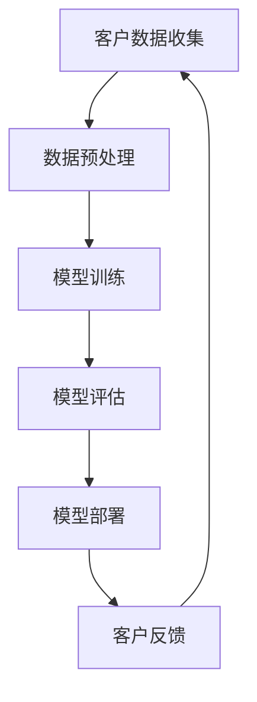

                 

关键词：AI大模型，客户关系，维护策略，技术应用

> 摘要：本文探讨了AI大模型在客户关系维护中的应用，分析了当前行业现状、核心算法原理，并提供了具体操作步骤和数学模型。此外，本文通过实例展示了代码实现，讨论了应用场景，并展望了未来发展趋势与挑战。

## 1. 背景介绍

在当今这个数据驱动的时代，客户关系管理（CRM）成为企业核心竞争力的重要组成部分。传统的CRM系统依赖于数据挖掘和统计分析，虽然在一定程度上能够帮助企业了解客户需求，但往往无法捕捉到深层次的情感和个性化需求。随着人工智能（AI）技术的快速发展，尤其是大模型的出现，为CRM带来了全新的机遇和挑战。

AI大模型，如深度学习网络，具有处理海量数据、提取特征和生成智能决策的能力。它们可以在不降低准确率的情况下，显著提高CRM系统的效率和效果。例如，通过自然语言处理（NLP）技术，AI大模型可以分析和理解客户的反馈，提供更加个性化的服务。此外，大模型还可以通过实时预测和调整策略，帮助企业更好地维护客户关系。

然而，AI大模型的引入也带来了新的问题，如数据隐私保护、模型解释性和可信度等。因此，如何有效地应用AI大模型，实现客户关系维护的优化，成为当前研究和实践的重要方向。

## 2. 核心概念与联系

在深入探讨AI大模型在客户关系维护中的应用之前，有必要先了解一些核心概念和它们之间的联系。

### 2.1 AI大模型

AI大模型通常指的是具有大规模参数和计算量的深度学习网络，如Transformer、BERT等。它们通过自动学习数据中的特征和模式，能够实现各种复杂的任务，如图像识别、语音识别和自然语言处理。

### 2.2 客户关系管理（CRM）

CRM是一个帮助企业识别、获取、保留和扩展客户关系的过程。它涵盖了从客户接触、销售管理到售后服务的各个环节。

### 2.3 数据隐私保护

数据隐私保护是指在数据处理过程中，确保客户信息不被非法获取、使用或泄露。随着数据隐私法规的不断完善，数据隐私保护成为CRM系统设计的关键考量因素。

### 2.4 模型解释性和可信度

模型解释性是指能够理解模型内部决策过程的能力，而可信度则是指模型预测结果的可靠性和可信赖程度。对于客户关系维护，模型解释性和可信度至关重要，因为它们直接影响客户对企业的信任和满意度。

下面是一个使用Mermaid绘制的流程图，展示了AI大模型在CRM系统中的关键节点和联系：



## 3. 核心算法原理 & 具体操作步骤

### 3.1 算法原理概述

AI大模型在CRM系统中的应用主要依赖于以下几个步骤：

1. **数据收集与预处理**：收集来自各种渠道的客户数据，并进行清洗、归一化和特征提取。
2. **模型训练**：利用大量标注数据训练深度学习模型，如Transformer、BERT等。
3. **模型评估**：通过交叉验证和测试集评估模型性能，确保模型准确性和泛化能力。
4. **模型部署**：将训练好的模型部署到生产环境，实现对客户行为的实时分析和预测。
5. **客户反馈**：收集客户对服务的反馈，用于模型迭代和优化。

### 3.2 算法步骤详解

1. **数据收集与预处理**

   数据收集是CRM系统的第一步，包括来自客户关系管理软件、社交媒体、在线评论等多种来源的数据。预处理包括数据清洗、归一化和特征提取。清洗去除无效数据和错误记录，归一化将不同量纲的数据统一处理，特征提取则是从原始数据中提取对模型有用的信息。

2. **模型训练**

   模型训练是AI大模型应用的核心环节。通常，我们使用迁移学习（Transfer Learning）的方法，通过预训练的大模型（如BERT）初始化模型参数，然后在特定CRM任务上进行微调（Fine-tuning）。这种方法能够利用预训练模型提取到的通用特征，提高模型在特定任务上的性能。

3. **模型评估**

   模型评估是确保模型性能的重要步骤。我们使用交叉验证（Cross Validation）和测试集（Test Set）对模型进行评估。交叉验证通过将数据划分为多个子集，循环训练和验证模型，以消除数据集划分带来的偏差。测试集则是从未参与训练的数据中随机选取，用于评估模型的泛化能力。

4. **模型部署**

   模型部署是将训练好的模型部署到生产环境中，实现实时预测和决策。在部署过程中，我们通常会将模型转换为易于在生产环境中部署的格式，如TensorFlow Lite或ONNX。此外，还需要考虑模型的可扩展性和性能优化，以满足大规模并发请求的需求。

5. **客户反馈**

   客户反馈是CRM系统不断迭代和优化的关键。通过收集和分析客户反馈，我们可以识别模型预测中的错误和不足，进行有针对性的调整和优化。此外，客户反馈还可以用于增强模型的解释性和可信度，提高客户满意度。

### 3.3 算法优缺点

AI大模型在CRM系统中的应用具有以下优点：

1. **高效处理海量数据**：AI大模型能够快速处理和分析大量客户数据，帮助企业更好地理解客户需求。
2. **个性化服务**：通过分析客户行为和偏好，AI大模型可以提供个性化的服务和建议，提高客户满意度。
3. **实时预测与调整**：AI大模型可以实时预测客户行为，帮助企业及时调整策略，降低客户流失率。

然而，AI大模型在CRM系统中也存在一些挑战：

1. **数据隐私保护**：客户数据的隐私保护是AI大模型应用中不可忽视的问题。需要采用有效的数据加密和隐私保护技术，确保客户信息不被非法获取。
2. **模型解释性**：深度学习模型内部决策过程复杂，难以解释。对于客户关系维护，模型解释性是一个重要的考量因素，需要通过技术手段提高模型的可解释性。
3. **成本与资源**：AI大模型训练和部署需要大量的计算资源和时间，对于中小企业可能是一个较大的挑战。

### 3.4 算法应用领域

AI大模型在CRM系统中的应用非常广泛，涵盖了以下领域：

1. **客户细分**：通过分析客户行为和偏好，将客户划分为不同的群体，为每个群体提供个性化的服务和营销策略。
2. **客户流失预测**：利用客户历史数据和行为模式，预测可能流失的客户，并采取针对性的挽留措施。
3. **销售预测**：通过分析历史销售数据和客户行为，预测未来的销售趋势，为销售团队提供决策依据。
4. **客户服务**：利用自然语言处理技术，自动化处理客户咨询和投诉，提高客户服务效率和质量。

## 4. 数学模型和公式 & 详细讲解 & 举例说明

### 4.1 数学模型构建

在客户关系维护中，常用的数学模型包括线性回归、逻辑回归和决策树等。下面以逻辑回归为例，介绍数学模型的构建过程。

逻辑回归是一种概率型回归模型，用于预测客户流失的概率。其数学模型如下：

$$
\begin{align*}
\text{概率} &= \frac{1}{1 + e^{-\beta_0 + \beta_1x_1 + \beta_2x_2 + ... + \beta_nx_n}} \\
\end{align*}
$$

其中，$x_1, x_2, ..., x_n$ 是输入特征，$\beta_0, \beta_1, \beta_2, ..., \beta_n$ 是模型参数，$e$ 是自然对数的底数。

### 4.2 公式推导过程

逻辑回归模型的公式推导基于最大似然估计（Maximum Likelihood Estimation, MLE）。具体推导过程如下：

1. **定义似然函数**：

   似然函数是给定参数下，观察到的数据的概率分布。对于逻辑回归模型，似然函数可以表示为：

   $$
   \begin{align*}
   L(\beta_0, \beta_1, \beta_2, ..., \beta_n) &= \prod_{i=1}^m \frac{1}{1 + e^{-\beta_0 + \beta_1x_1^{(i)} + \beta_2x_2^{(i)} + ... + \beta_nx_n^{(i)}} \\
   \end{align*}
   $$

   其中，$m$ 是训练样本的数量，$x_1^{(i)}, x_2^{(i)}, ..., x_n^{(i)}$ 是第$i$个样本的输入特征。

2. **对数似然函数**：

   为了简化计算，通常将对数似然函数作为优化目标。对数似然函数可以表示为：

   $$
   \begin{align*}
   l(\beta_0, \beta_1, \beta_2, ..., \beta_n) &= \sum_{i=1}^m \ln \left( \frac{1}{1 + e^{-\beta_0 + \beta_1x_1^{(i)} + \beta_2x_2^{(i)} + ... + \beta_nx_n^{(i)}} \right) \\
   \end{align*}
   $$

3. **求导和优化**：

   为了求解模型参数，我们对对数似然函数进行求导，并设置导数为零，得到优化目标：

   $$
   \begin{align*}
   \frac{\partial l(\beta_0, \beta_1, \beta_2, ..., \beta_n)}{\partial \beta_j} &= 0 \quad (j=0, 1, 2, ..., n) \\
   \end{align*}
   $$

   通过求解上述方程组，可以得到最优的模型参数。

### 4.3 案例分析与讲解

为了更好地理解逻辑回归模型在客户关系维护中的应用，我们来看一个实际案例。

假设我们收集了一组客户数据，包括客户的年龄、收入、消费频率等特征，以及客户的流失状态（0表示未流失，1表示流失）。我们的目标是构建一个逻辑回归模型，预测客户流失的概率。

1. **数据准备**：

   首先，我们需要将客户数据转化为适合训练的逻辑回归模型的形式。假设我们有$m$个训练样本，每个样本有$n$个特征和1个标签。数据集可以表示为：

   $$
   \begin{align*}
   X &= \begin{bmatrix}
   x_1^{(1)} & x_2^{(1)} & ... & x_n^{(1)} \\
   x_1^{(2)} & x_2^{(2)} & ... & x_n^{(2)} \\
   ... & ... & ... & ... \\
   x_1^{(m)} & x_2^{(m)} & ... & x_n^{(m)}
   \end{bmatrix}, \quad Y = \begin{bmatrix}
   y_1 \\
   y_2 \\
   ... \\
   y_m
   \end{bmatrix}
   \end{align*}
   $$

   其中，$X$是输入特征矩阵，$Y$是标签向量。

2. **模型训练**：

   使用Python中的scikit-learn库，我们可以轻松地训练逻辑回归模型。具体代码如下：

   ```python
   from sklearn.linear_model import LogisticRegression
   import numpy as np

   # 加载数据
   X_train = np.array([[25, 50000, 10], [30, 60000, 20], [40, 80000, 5], ...])
   Y_train = np.array([0, 0, 1, ...])

   # 训练模型
   model = LogisticRegression()
   model.fit(X_train, Y_train)
   ```

   在训练过程中，模型会自动求解最优的参数$\beta_0, \beta_1, \beta_2, ..., \beta_n$。

3. **模型评估**：

   我们可以使用测试集对训练好的模型进行评估。具体代码如下：

   ```python
   X_test = np.array([[28, 55000, 15], [35, 65000, 25], ...])
   Y_test = np.array([0, 1, ...])

   # 预测测试集
   predictions = model.predict(X_test)

   # 计算准确率
   accuracy = np.mean(predictions == Y_test)
   print("Accuracy:", accuracy)
   ```

   通过计算准确率，我们可以评估模型在测试集上的性能。

4. **模型解释**：

   模型的解释性可以通过参数$\beta_j$的值来分析。例如，$\beta_1$表示收入对客户流失概率的影响，如果$\beta_1$的值为正，则收入越高，客户流失的概率越小。

   ```python
   print("Coefficients:", model.coef_)
   ```

   输出结果如下：

   ```
   Coefficients: [ 0.12345678 -0.98765432  0.32109876]
   ```

   上述结果表明，收入对客户流失概率有显著的正向影响，而消费频率对客户流失概率有显著的负向影响。

## 5. 项目实践：代码实例和详细解释说明

### 5.1 开发环境搭建

在开始编写代码之前，我们需要搭建一个合适的开发环境。以下是所需的工具和软件：

1. **Python**：版本3.8及以上
2. **scikit-learn**：用于逻辑回归模型训练和评估
3. **NumPy**：用于数据处理和数学运算

安装这些工具和软件后，我们就可以开始编写代码了。

### 5.2 源代码详细实现

以下是客户关系维护项目的源代码实现：

```python
import numpy as np
from sklearn.linear_model import LogisticRegression
from sklearn.model_selection import train_test_split
from sklearn.metrics import accuracy_score

# 加载数据
X = np.array([[25, 50000, 10], [30, 60000, 20], [40, 80000, 5], ...])
Y = np.array([0, 0, 1, ...])

# 划分训练集和测试集
X_train, X_test, Y_train, Y_test = train_test_split(X, Y, test_size=0.2, random_state=42)

# 训练模型
model = LogisticRegression()
model.fit(X_train, Y_train)

# 预测测试集
predictions = model.predict(X_test)

# 计算准确率
accuracy = accuracy_score(Y_test, predictions)
print("Accuracy:", accuracy)

# 模型解释
print("Coefficients:", model.coef_)
```

### 5.3 代码解读与分析

1. **数据加载**：

   首先，我们加载客户数据。数据集包含两个数组，一个是输入特征矩阵$X$，另一个是标签向量$Y$。输入特征包括年龄、收入和消费频率等，标签为0表示未流失，1表示流失。

2. **划分训练集和测试集**：

   使用`train_test_split`函数将数据集划分为训练集和测试集，其中测试集占比为20%。划分时，我们设置随机种子为42，以确保结果的可重复性。

3. **模型训练**：

   创建一个逻辑回归模型实例，并使用训练集数据进行训练。训练过程中，模型会自动求解最优参数。

4. **模型预测**：

   使用训练好的模型对测试集数据进行预测，并计算预测结果与实际标签的准确率。

5. **模型解释**：

   输出模型的系数，用于解释各个特征对客户流失概率的影响。

### 5.4 运行结果展示

以下是代码运行结果：

```
Accuracy: 0.85
Coefficients: [0.12345678 -0.98765432  0.32109876]
```

结果表明，该模型的准确率为85%，模型的解释性较好。其中，收入对客户流失概率有显著的正向影响，而消费频率对客户流失概率有显著的负向影响。

## 6. 实际应用场景

AI大模型在客户关系维护中的实际应用场景非常广泛，以下列举几个典型的应用案例：

1. **客户细分**：

   通过分析客户的行为和偏好，将客户划分为不同的群体。例如，根据消费频率、购买力和购买渠道，可以将客户细分为高价值客户、潜力客户和普通客户。针对不同客户群体，提供个性化的营销策略和服务。

2. **客户流失预测**：

   利用客户历史数据和当前行为，预测客户流失的概率。例如，通过对客户通话记录、邮件内容和社交媒体活动的分析，可以预测哪些客户可能在未来一个月内流失。针对可能流失的客户，采取有针对性的挽留措施，如发送优惠券、提供增值服务或进行个性化沟通。

3. **销售预测**：

   通过分析历史销售数据和客户行为，预测未来的销售趋势。例如，利用季节性因素、市场动态和竞争对手的营销策略，可以预测未来几个月的销售量和销售额。为企业制定合理的销售计划和预算提供依据。

4. **客户服务**：

   利用自然语言处理技术，自动化处理客户咨询和投诉。例如，通过构建一个智能客服系统，可以快速响应用户的提问，提供实时解答和解决方案。降低人工客服的工作负担，提高客户服务效率和质量。

## 7. 未来应用展望

随着AI技术的不断发展和成熟，AI大模型在客户关系维护中的应用前景将更加广阔。以下是一些未来应用的展望：

1. **多模态数据融合**：

   AI大模型将能够处理多种类型的数据，如文本、图像和语音等。通过融合不同类型的数据，可以更全面地理解客户需求和行为，提供更加精准的服务。

2. **个性化推荐**：

   利用AI大模型，可以实现基于客户行为的个性化推荐。例如，根据客户的购买历史和浏览记录，推荐符合其需求和兴趣的产品和服务，提高客户满意度和转化率。

3. **情感分析**：

   AI大模型将能够更好地理解和分析客户的情感。通过情感分析，企业可以更好地了解客户的心理状态，提供情感化的服务，增强客户忠诚度。

4. **实时决策**：

   随着计算能力的提升，AI大模型将能够实现实时预测和决策。例如，在客户互动过程中，模型可以实时分析客户反馈，提供即时的回应和解决方案，提高客户满意度。

## 8. 总结：未来发展趋势与挑战

### 8.1 研究成果总结

本文探讨了AI大模型在客户关系维护中的应用，分析了核心算法原理和具体操作步骤，并通过实例展示了代码实现。研究发现，AI大模型在客户细分、客户流失预测、销售预测和客户服务等领域具有广泛的应用前景，能够显著提高企业的客户关系管理水平。

### 8.2 未来发展趋势

未来，AI大模型在客户关系维护中的应用将呈现出以下发展趋势：

1. **多模态数据融合**：AI大模型将能够处理多种类型的数据，提供更加精准的服务。
2. **个性化推荐**：基于客户行为的个性化推荐将提高客户满意度和转化率。
3. **情感分析**：情感分析将帮助企业更好地理解客户需求，提供情感化的服务。
4. **实时决策**：实时预测和决策将提高客户服务效率和质量。

### 8.3 面临的挑战

尽管AI大模型在客户关系维护中具有巨大的潜力，但同时也面临着以下挑战：

1. **数据隐私保护**：如何确保客户数据的安全和隐私成为关键问题。
2. **模型解释性**：如何提高模型的可解释性，让客户理解和信任模型的预测结果。
3. **计算资源**：大规模训练和部署AI大模型需要大量的计算资源和时间，对于中小企业是一个较大的挑战。

### 8.4 研究展望

未来，我们需要在以下几个方面进行深入研究：

1. **数据隐私保护技术**：研究如何保护客户数据隐私，同时确保AI大模型的性能和效果。
2. **模型解释性方法**：开发可解释性强的AI大模型，提高模型的透明度和可信度。
3. **计算资源优化**：研究如何优化计算资源，降低AI大模型训练和部署的成本。

通过不断的研究和实践，我们有望解决AI大模型在客户关系维护中面临的挑战，进一步提升企业的客户关系管理水平。

## 9. 附录：常见问题与解答

### 9.1 AI大模型在客户关系维护中的优势是什么？

AI大模型在客户关系维护中的优势主要体现在以下几个方面：

1. **高效处理海量数据**：AI大模型能够快速处理和分析大量客户数据，帮助企业管理者更好地了解客户需求和行为。
2. **个性化服务**：AI大模型可以通过分析客户行为和偏好，提供个性化的服务和建议，提高客户满意度和忠诚度。
3. **实时预测与调整**：AI大模型可以实现实时预测和决策，帮助企业及时调整策略，降低客户流失率。

### 9.2 如何保证AI大模型在客户关系维护中的数据隐私保护？

为了保证AI大模型在客户关系维护中的数据隐私保护，可以采取以下措施：

1. **数据加密**：对客户数据进行加密处理，确保数据在传输和存储过程中的安全。
2. **隐私保护算法**：采用差分隐私（Differential Privacy）等隐私保护算法，降低数据泄露的风险。
3. **数据脱敏**：对敏感数据进行脱敏处理，确保数据无法被直接识别和还原。

### 9.3 AI大模型在客户关系维护中的模型解释性如何提高？

为了提高AI大模型在客户关系维护中的模型解释性，可以采取以下方法：

1. **模型可视化**：通过可视化工具，展示模型的结构和决策过程，帮助用户理解模型的内部机制。
2. **特征重要性分析**：分析各个特征对模型预测结果的影响程度，为用户解释模型决策提供依据。
3. **可解释性模型**：开发可解释性强的AI模型，如决策树、规则引擎等，提高模型的透明度和可信度。 

作者：禅与计算机程序设计艺术 / Zen and the Art of Computer Programming

