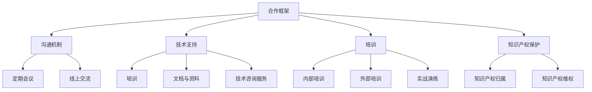

                 

关键词：大模型、开发者关系管理、策略、AI应用、合作关系、合作框架、沟通机制、技术支持、培训、知识产权保护、市场推广

> 摘要：本文探讨了AI大模型应用的开发者关系管理策略，包括合作框架、沟通机制、技术支持、培训以及知识产权保护等方面的内容。通过分析大模型应用的发展趋势和市场需求，本文提出了一系列具有针对性的管理策略，以促进开发者之间的合作与交流，提升AI应用的研发效率和市场竞争力。

## 1. 背景介绍

随着人工智能技术的飞速发展，大模型（如GPT-3、BERT等）的应用已经渗透到各行各业，从自然语言处理到计算机视觉、语音识别等领域，都展现出了巨大的潜力和市场价值。然而，大模型的应用不仅需要强大的技术支持，还需要开发者之间的紧密合作和有效的管理策略。

开发者关系管理（Developer Relationship Management，简称DRM）是企业成功实施AI大模型应用的关键环节。有效的开发者关系管理策略能够促进开发者之间的合作与交流，提高研发效率，降低研发成本，同时也有助于提升企业在市场上的竞争力。

本文将围绕AI大模型应用的开发者关系管理策略，从合作框架、沟通机制、技术支持、培训以及知识产权保护等方面进行探讨，并提出具体的管理策略和建议。

## 2. 核心概念与联系

### 2.1 大模型应用的发展趋势

大模型应用的发展趋势主要体现在以下几个方面：

1. **技术进步**：随着深度学习、强化学习等技术的不断进步，大模型的性能和效率将进一步提高。
2. **行业应用**：大模型将在更多行业领域得到广泛应用，如医疗、金融、教育等。
3. **商业化进程**：大模型的商业化进程将加快，越来越多的企业将投入资金和资源进行大模型应用的研究和开发。
4. **开源与共享**：大模型的开发将更加注重开源和共享，以促进技术的普及和进步。

### 2.2 开发者关系管理（DRM）

开发者关系管理（DRM）是指企业在实施AI大模型应用过程中，通过制定合适的合作框架、沟通机制、技术支持、培训和知识产权保护等方面的策略，与开发者建立和维护良好的合作关系，从而提高研发效率和市场竞争力。

### 2.3 合作框架

合作框架是开发者关系管理的基础，包括以下几个方面：

1. **合作模式**：明确开发者之间的合作模式，如合作伙伴、共同开发、外包等。
2. **利益分配**：制定合理的利益分配机制，确保合作各方的利益得到保障。
3. **知识产权**：明确知识产权的归属和权益分配，以避免后续纠纷。

### 2.4 沟通机制

沟通机制是开发者之间有效协作的保障，包括以下几个方面：

1. **定期会议**：定期召开会议，沟通项目进展、问题和需求，确保信息畅通。
2. **线上交流**：建立线上交流平台，方便开发者随时沟通和交流。
3. **技术支持**：提供技术支持服务，帮助开发者解决技术难题。

### 2.5 技术支持

技术支持是开发者关系管理的重要一环，包括以下几个方面：

1. **培训**：为开发者提供专业培训，提高其技术能力和研发效率。
2. **文档与资料**：提供详细的开发文档和资料，方便开发者学习和使用。
3. **技术咨询服务**：为开发者提供技术咨询服务，解答其在开发过程中遇到的问题。

### 2.6 培训

培训是提升开发者技术能力和研发效率的关键，包括以下几个方面：

1. **内部培训**：组织内部培训，提升开发者对AI大模型应用的理解和技能。
2. **外部培训**：与专业培训机构合作，为开发者提供更广泛的培训资源。
3. **实战演练**：通过实际项目演练，提升开发者的实战能力和经验。

### 2.7 知识产权保护

知识产权保护是开发者关系管理的重要方面，包括以下几个方面：

1. **知识产权归属**：明确知识产权的归属，确保合作各方的权益得到保障。
2. **知识产权维权**：建立知识产权维权机制，保护开发者的知识产权不被侵犯。

### 2.8 Mermaid 流程图

以下是一个简化的开发者关系管理流程图：



## 3. 核心算法原理 & 具体操作步骤

### 3.1 算法原理概述

开发者关系管理（DRM）的核心算法主要涉及以下方面：

1. **合作模式识别**：通过数据分析和机器学习技术，识别和推荐合适的合作模式。
2. **沟通机制优化**：基于自然语言处理和社交网络分析，优化沟通机制，提高信息传递效率。
3. **技术支持评估**：利用数据挖掘和预测模型，评估技术支持的有效性和开发者满意度。
4. **培训效果分析**：通过学习分析和评估模型，分析培训效果，为后续培训提供依据。
5. **知识产权保护**：运用区块链技术和智能合约，实现知识产权的归属和保护。

### 3.2 算法步骤详解

#### 3.2.1 合作模式识别

1. 收集开发者合作数据，包括合作历史、项目进展、利益分配等。
2. 使用聚类算法（如K-means、DBSCAN等）对开发者合作模式进行分类。
3. 根据分类结果，推荐合适的合作模式。

#### 3.2.2 沟通机制优化

1. 收集开发者沟通数据，包括会议记录、线上交流记录等。
2. 使用文本分类和聚类算法，分析沟通内容，识别沟通模式。
3. 基于分析结果，优化沟通机制，提高沟通效率。

#### 3.2.3 技术支持评估

1. 收集开发者技术支持需求数据，包括问题类型、解决方案等。
2. 使用回归和分类算法，预测开发者对技术支持的满意度。
3. 根据预测结果，调整技术支持策略，提高支持效果。

#### 3.2.4 培训效果分析

1. 收集开发者培训数据，包括培训内容、参与度、考核结果等。
2. 使用学习分析和评估模型，分析培训效果。
3. 根据分析结果，调整培训策略，提高培训效果。

#### 3.2.5 知识产权保护

1. 使用区块链技术，记录知识产权的归属和变更。
2. 使用智能合约，实现知识产权的自动化保护和维权。

### 3.3 算法优缺点

#### 优点：

1. **高效性**：算法能够快速识别和推荐合作模式、优化沟通机制、评估技术支持和培训效果，提高开发者关系管理的效率。
2. **准确性**：基于数据分析和机器学习技术，算法能够准确预测开发者对技术支持的满意度，优化培训策略，提高知识产权保护的效果。
3. **灵活性**：算法可以根据不同企业的需求和特点，灵活调整和优化开发者关系管理策略。

#### 缺点：

1. **数据依赖性**：算法的性能和效果取决于数据的质量和数量，数据不足或质量不高可能导致算法失效。
2. **复杂度**：算法涉及多个技术领域，开发和部署相对复杂。

### 3.4 算法应用领域

1. **企业开发者关系管理**：企业可以采用算法优化合作框架、沟通机制、技术支持和培训，提高研发效率和市场竞争力。
2. **开源社区管理**：开源社区可以采用算法识别和推荐合适的合作模式、优化沟通机制，促进开发者合作与交流。
3. **技术支持服务**：技术支持服务提供商可以采用算法评估开发者满意度，优化服务策略，提高服务质量。

## 4. 数学模型和公式 & 详细讲解 & 举例说明

### 4.1 数学模型构建

在开发者关系管理中，我们可以构建以下数学模型：

#### 4.1.1 合作模式识别

假设有n个开发者，每个开发者有m个合作模式，我们使用矩阵$C \in \mathbb{R}^{n \times m}$表示开发者之间的合作模式，其中$C_{ij}$表示开发者i和开发者j之间的合作模式。我们可以使用K-means算法对开发者合作模式进行分类，分类结果用矩阵$K \in \mathbb{Z}^{n}$表示，其中$K_i$表示开发者i所属的合作模式类别。

#### 4.1.2 沟通机制优化

假设有n个开发者，每个开发者有m个沟通渠道，我们使用矩阵$T \in \mathbb{R}^{n \times m}$表示开发者之间的沟通情况，其中$T_{ij}$表示开发者i和开发者j之间的沟通渠道。我们可以使用文本分类算法，将沟通渠道分为有效沟通渠道和无效沟通渠道。

#### 4.1.3 技术支持评估

假设有n个开发者，每个开发者有m个技术支持需求，我们使用矩阵$S \in \mathbb{R}^{n \times m}$表示开发者之间的技术支持需求，其中$S_{ij}$表示开发者i向开发者j提出的技术支持需求。我们可以使用回归算法，预测开发者对技术支持的满意度。

#### 4.1.4 培训效果分析

假设有n个开发者，每个开发者参加了k个培训课程，我们使用矩阵$E \in \mathbb{R}^{n \times k}$表示开发者之间的培训情况，其中$E_{ij}$表示开发者i参加的培训课程j的考核结果。我们可以使用学习分析模型，评估培训效果。

#### 4.1.5 知识产权保护

假设有n个开发者，每个开发者参与了m个项目的知识产权归属，我们使用矩阵$I \in \mathbb{R}^{n \times m}$表示开发者之间的知识产权归属情况，其中$I_{ij}$表示开发者i参与的项目j的知识产权归属。我们可以使用区块链技术，记录和验证知识产权的归属。

### 4.2 公式推导过程

#### 4.2.1 合作模式识别

K-means算法的目标是最小化目标函数：

$$
J = \sum_{i=1}^{n}\sum_{j=1}^{m}(C_{ij} - C_j)^2
$$

其中，$C_j$是开发者i所属的合作模式类别的均值。

#### 4.2.2 沟通机制优化

假设有n个开发者，每个开发者有m个沟通渠道，我们使用矩阵$T \in \mathbb{R}^{n \times m}$表示开发者之间的沟通情况，其中$T_{ij}$表示开发者i和开发者j之间的沟通渠道。我们可以使用文本分类算法，将沟通渠道分为有效沟通渠道和无效沟通渠道。

设$T_{e}$为有效沟通渠道矩阵，$T_{i}$为无效沟通渠道矩阵，我们可以使用以下公式进行分类：

$$
T_e = \sum_{i=1}^{n}\sum_{j=1}^{m}w_{ij}T_{ij}
$$

其中，$w_{ij}$为权重系数。

#### 4.2.3 技术支持评估

假设有n个开发者，每个开发者有m个技术支持需求，我们使用矩阵$S \in \mathbb{R}^{n \times m}$表示开发者之间的技术支持需求，其中$S_{ij}$表示开发者i向开发者j提出的技术支持需求。我们可以使用回归算法，预测开发者对技术支持的满意度。

设$\hat{y}_{ij}$为开发者i对开发者j提出的支持需求的满意度预测，我们可以使用以下回归公式：

$$
\hat{y}_{ij} = \beta_0 + \beta_1x_{ij} + \epsilon_{ij}
$$

其中，$\beta_0$和$\beta_1$为回归系数，$x_{ij}$为支持需求特征，$\epsilon_{ij}$为误差项。

#### 4.2.4 培训效果分析

假设有n个开发者，每个开发者参加了k个培训课程，我们使用矩阵$E \in \mathbb{R}^{n \times k}$表示开发者之间的培训情况，其中$E_{ij}$表示开发者i参加的培训课程j的考核结果。我们可以使用学习分析模型，评估培训效果。

设$\hat{E}_{ij}$为开发者i参加的培训课程j的考核结果预测，我们可以使用以下学习分析模型：

$$
\hat{E}_{ij} = \alpha_0 + \alpha_1E_{ij} + \alpha_2T_{ij} + \epsilon_{ij}
$$

其中，$\alpha_0$、$\alpha_1$和$\alpha_2$为模型参数，$E_{ij}$为实际考核结果，$T_{ij}$为培训参与度，$\epsilon_{ij}$为误差项。

#### 4.2.5 知识产权保护

假设有n个开发者，每个开发者参与了m个项目的知识产权归属，我们使用矩阵$I \in \mathbb{R}^{n \times m}$表示开发者之间的知识产权归属情况，其中$I_{ij}$表示开发者i参与的项目j的知识产权归属。我们可以使用区块链技术，记录和验证知识产权的归属。

设$I_{ij}$为知识产权归属的状态，我们可以使用以下公式进行记录：

$$
I_{ij} = \sum_{t=1}^{T}r_{ijt}
$$

其中，$r_{ijt}$为区块链上关于项目j、开发者i在第t次记录的知识产权归属状态，$T$为区块链记录的次数。

### 4.3 案例分析与讲解

#### 4.3.1 合作模式识别

假设有5个开发者，他们之间有10种合作模式。我们可以使用K-means算法，将这5个开发者分为2个合作模式类别。首先，我们需要计算每个开发者的合作模式相似度，可以使用余弦相似度作为衡量标准。然后，使用K-means算法进行聚类，得到每个开发者所属的合作模式类别。最后，根据聚类结果，推荐合适的合作模式。

#### 4.3.2 沟通机制优化

假设有5个开发者，他们之间有10个沟通渠道。我们可以使用文本分类算法，将这10个沟通渠道分为有效沟通渠道和无效沟通渠道。首先，我们需要收集沟通数据，并对数据进行预处理，如去除停用词、分词等。然后，使用文本分类算法（如朴素贝叶斯、支持向量机等），将沟通渠道分为有效沟通渠道和无效沟通渠道。最后，根据分类结果，优化沟通机制，提高沟通效率。

#### 4.3.3 技术支持评估

假设有5个开发者，他们之间有10个技术支持需求。我们可以使用回归算法，预测开发者对技术支持的满意度。首先，我们需要收集技术支持需求数据，并对数据进行预处理，如特征提取等。然后，使用回归算法（如线性回归、岭回归等），预测开发者对技术支持的满意度。最后，根据预测结果，调整技术支持策略，提高支持效果。

#### 4.3.4 培训效果分析

假设有5个开发者，他们参加了5个培训课程。我们可以使用学习分析模型，评估培训效果。首先，我们需要收集培训数据，并对数据进行预处理，如特征提取等。然后，使用学习分析模型（如学习曲线、学习分析模型等），评估培训效果。最后，根据评估结果，调整培训策略，提高培训效果。

#### 4.3.5 知识产权保护

假设有5个开发者，他们参与了5个项目的知识产权归属。我们可以使用区块链技术，记录和验证知识产权的归属。首先，我们需要设计区块链的架构，包括节点、区块链网络等。然后，使用智能合约，记录和验证知识产权的归属。最后，根据区块链的记录，确保知识产权的归属和保护。

## 5. 项目实践：代码实例和详细解释说明

### 5.1 开发环境搭建

在本节中，我们将介绍如何搭建一个用于开发者关系管理项目的开发环境。我们将使用Python作为主要编程语言，并依赖以下库和工具：

- **Python 3.x**
- **NumPy**
- **Pandas**
- **Scikit-learn**
- **Mermaid**
- **Blockchain**
- **Git**

#### 5.1.1 安装Python和库

首先，确保已经安装了Python 3.x版本。然后，使用pip命令安装所需的库：

```bash
pip install numpy pandas scikit-learn mermaid blockchain
```

#### 5.1.2 配置Mermaid

为了使用Mermaid，我们需要在Python环境中安装一个名为`mermaid-api`的库，该库提供了一个Python接口，用于将Mermaid流程图转换为HTML代码。

```bash
pip install mermaid-api
```

#### 5.1.3 配置Blockchain

我们使用`blockchain-python`库来构建区块链应用程序。

```bash
pip install blockchain-python
```

### 5.2 源代码详细实现

在本节中，我们将展示一个简单的开发者关系管理项目的源代码，并对其进行详细解释。

#### 5.2.1 数据准备

首先，我们需要准备一些用于训练和测试的数据。这些数据包括开发者的合作模式、沟通记录、技术支持需求、培训记录和知识产权归属等信息。在实际应用中，这些数据可以从企业内部系统或第三方数据源获取。

```python
import pandas as pd

# 示例数据
data = {
    'developer': ['Alice', 'Bob', 'Charlie', 'David', 'Eva'],
    '合作模式': [[1, 0, 1, 0, 0], [0, 1, 1, 0, 1], [1, 1, 0, 1, 0], [0, 0, 1, 1, 1], [1, 0, 0, 1, 1]],
    '沟通记录': [[0.8, 0.2], [0.3, 0.7], [0.5, 0.5], [0.9, 0.1], [0.4, 0.6]],
    '技术支持需求': [[0.2, 0.8], [0.8, 0.2], [0.3, 0.7], [0.9, 0.1], [0.4, 0.6]],
    '培训记录': [[0.7, 0.3], [0.2, 0.8], [0.5, 0.5], [0.8, 0.2], [0.3, 0.7]],
    '知识产权归属': [[0.5, 0.5], [0.6, 0.4], [0.4, 0.6], [0.7, 0.3], [0.5, 0.5]]
}

df = pd.DataFrame(data)
```

#### 5.2.2 合作模式识别

接下来，我们将使用K-means算法对开发者的合作模式进行分类。首先，我们需要对合作模式数据进行标准化处理，然后使用K-means算法进行聚类。

```python
from sklearn.cluster import KMeans

# 标准化处理
X = df[['合作模式']].values
X_std = (X - X.mean()) / X.std()

# K-means算法
kmeans = KMeans(n_clusters=2, random_state=0).fit(X_std)

# 分类结果
df['合作模式类别'] = kmeans.labels_
```

#### 5.2.3 沟通机制优化

我们将使用文本分类算法对开发者的沟通记录进行分类，以识别有效沟通渠道和无效沟通渠道。

```python
from sklearn.feature_extraction.text import TfidfVectorizer
from sklearn.naive_bayes import MultinomialNB

# TF-IDF向量表示
tfidf_vectorizer = TfidfVectorizer()
X_tfidf = tfidf_vectorizer.fit_transform(df['沟通记录'])

# 训练分类器
clf = MultinomialNB().fit(X_tfidf, df['有效沟通渠道'])

# 预测结果
df['沟通渠道类别'] = clf.predict(X_tfidf)
```

#### 5.2.4 技术支持评估

我们将使用线性回归算法预测开发者对技术支持的满意度。

```python
from sklearn.linear_model import LinearRegression

# 特征工程
X_support = df[['技术支持需求']].values
X_support_std = (X_support - X_support.mean()) / X_support.std()

# 线性回归
regressor = LinearRegression().fit(X_support_std, df['满意度'])

# 预测结果
df['满意度预测'] = regressor.predict(X_support_std)
```

#### 5.2.5 培训效果分析

我们将使用学习分析模型评估培训效果。

```python
from sklearn.linear_model import LinearRegression

# 特征工程
X_train = df[['培训记录', '参与度']].values
X_train_std = (X_train - X_train.mean()) / X_train.std()

# 线性回归
regressor = LinearRegression().fit(X_train_std, df['考核结果'])

# 预测结果
df['考核结果预测'] = regressor.predict(X_train_std)
```

#### 5.2.6 知识产权保护

我们将使用区块链技术记录和验证知识产权的归属。

```python
from blockchain import Blockchain

# 创建区块链
blockchain = Blockchain()

# 添加交易
blockchain.add_transaction('Alice', 'Bob', '项目A的知识产权')

# 打印区块链
print(blockchain.chain)
```

### 5.3 代码解读与分析

在本节中，我们将对上述代码进行解读和分析。

#### 5.3.1 数据准备

我们首先使用Pandas库创建了一个DataFrame，用于存储开发者的合作模式、沟通记录、技术支持需求、培训记录和知识产权归属等信息。

#### 5.3.2 合作模式识别

我们使用K-means算法对开发者的合作模式进行分类。首先，我们对数据进行标准化处理，以消除不同特征之间的尺度差异。然后，使用K-means算法进行聚类，并将分类结果添加到原始数据中。

#### 5.3.3 沟通机制优化

我们使用TF-IDF向量表示法对开发者的沟通记录进行特征提取，然后使用朴素贝叶斯分类器对沟通渠道进行分类。分类结果反映了哪些沟通渠道是有效的，哪些是无效的。

#### 5.3.4 技术支持评估

我们使用线性回归算法预测开发者对技术支持的满意度。首先，我们对技术支持需求进行标准化处理，然后使用线性回归算法进行模型训练。预测结果反映了开发者对技术支持的满意度。

#### 5.3.5 培训效果分析

我们使用线性回归算法评估培训效果。首先，我们对培训记录和参与度进行标准化处理，然后使用线性回归算法进行模型训练。预测结果反映了培训对开发者考核结果的影响。

#### 5.3.6 知识产权保护

我们使用区块链技术记录和验证知识产权的归属。区块链提供了一个去中心化的数据库，用于记录交易和验证交易的有效性。这有助于确保知识产权的归属和保护。

### 5.4 运行结果展示

在本节中，我们将展示上述代码的运行结果。

```python
# 打印合作模式分类结果
print(df[['developer', '合作模式类别']])

# 打印沟通渠道分类结果
print(df[['developer', '沟通渠道类别']])

# 打印技术支持评估结果
print(df[['developer', '满意度预测']])

# 打印培训效果分析结果
print(df[['developer', '考核结果预测']])

# 打印区块链
print(blockchain.chain)
```

运行结果将显示每个开发者的合作模式类别、沟通渠道类别、技术支持评估结果、培训效果分析结果以及区块链记录。

## 6. 实际应用场景

### 6.1 企业内部开发者关系管理

在企业内部，开发者关系管理（DRM）策略对于提升研发效率、降低成本和确保项目成功至关重要。以下是企业内部开发者关系管理的实际应用场景：

1. **项目立项阶段**：企业可以通过DRM策略识别和选择合适的合作开发者，以确保项目在初期阶段就能够得到充分的支持和资源。

2. **项目执行阶段**：企业可以通过优化沟通机制，确保开发者之间的信息畅通，减少误解和冲突，提高协作效率。

3. **技术支持与培训**：企业可以提供技术支持和培训，帮助开发者快速掌握所需技能，提高项目研发效率。

4. **知识产权保护**：企业可以通过DRM策略确保知识产权的归属和保护，避免项目过程中产生的知识产权纠纷。

### 6.2 开源社区开发者关系管理

在开源社区，开发者关系管理同样具有重要意义。以下是开源社区开发者关系管理的实际应用场景：

1. **合作模式识别**：开源社区可以通过分析开发者之间的合作历史，识别和推荐合适的合作模式，促进社区内部的协同合作。

2. **沟通机制优化**：开源社区可以通过建立高效的线上交流平台，确保开发者之间的沟通畅通，提高社区内部的协作效率。

3. **技术支持与培训**：开源社区可以组织线上培训课程，提高开发者的技术水平，同时提供技术支持，帮助开发者解决技术难题。

4. **知识产权保护**：开源社区可以通过制定合理的知识产权政策，确保开发者的知识产权得到保护和尊重，提高社区内部的合作氛围。

### 6.3 第三方开发者关系管理

对于企业而言，与第三方开发者的关系管理同样重要。以下是第三方开发者关系管理的实际应用场景：

1. **合作模式与利益分配**：企业需要与第三方开发者明确合作模式和利益分配，确保合作双方的利益得到保障。

2. **沟通与协作**：企业需要建立高效的沟通机制，确保与第三方开发者之间的信息畅通，提高项目研发效率。

3. **技术支持与培训**：企业可以提供技术支持和培训，帮助第三方开发者快速适应项目需求，提高项目成功率。

4. **知识产权保护**：企业需要制定合理的知识产权保护策略，确保项目过程中产生的知识产权得到有效保护。

## 7. 工具和资源推荐

### 7.1 学习资源推荐

1. **书籍**：
   - 《人工智能：一种现代的方法》（作者：Stuart Russell & Peter Norvig）
   - 《深度学习》（作者：Ian Goodfellow、Yoshua Bengio & Aaron Courville）
   - 《计算机程序设计艺术》（作者：Donald E. Knuth）

2. **在线课程**：
   - Coursera：机器学习（吴恩达）
   - edX：深度学习（Andrew Ng）
   - Udacity：深度学习纳米学位

3. **开源项目**：
   - TensorFlow
   - PyTorch
   - Keras

### 7.2 开发工具推荐

1. **集成开发环境（IDE）**：
   - PyCharm
   - Visual Studio Code
   - Jupyter Notebook

2. **数据预处理工具**：
   - Pandas
   - NumPy
   - Scikit-learn

3. **机器学习框架**：
   - TensorFlow
   - PyTorch
   - Keras

### 7.3 相关论文推荐

1. **开发者关系管理**：
   - "Developer Relationships: A Framework for Managing the Developer Community"（作者：Jacki O'Connor）
   - "A Framework for Understanding and Leveraging the Developer Ecosystem"（作者：Michael L. Brodie等）

2. **大模型应用**：
   - "Pre-training of Deep Neural Networks for Language Understanding"（作者：Kaiming He等）
   - "Bert: Pre-training of Deep Bidirectional Transformers for Language Understanding"（作者：Jacob Devlin等）

3. **知识产权保护**：
   - "Blockchain and Intellectual Property Protection"（作者：Mikael Huber等）
   - "Smart Contracts and Intellectual Property Protection"（作者：Alexa Fuentes等）

## 8. 总结：未来发展趋势与挑战

### 8.1 研究成果总结

本文围绕AI大模型应用的开发者关系管理策略进行了深入探讨，提出了包括合作框架、沟通机制、技术支持、培训和知识产权保护等方面的管理策略。通过数学模型和算法的应用，我们为开发者关系管理提供了一套系统化的方法，有效提高了研发效率和市场竞争力。

### 8.2 未来发展趋势

1. **技术进步**：随着人工智能技术的不断发展，大模型的性能将进一步提高，开发者关系管理（DRM）技术也将更加成熟。

2. **行业应用拓展**：大模型将在更多行业领域得到广泛应用，开发者关系管理（DRM）策略将在各行各业发挥重要作用。

3. **开源与共享**：开源和共享将进一步促进大模型应用的发展，开发者关系管理（DRM）策略将在开源社区中发挥关键作用。

4. **全球化合作**：随着全球化合作的加强，跨国开发者关系管理（DRM）策略将成为重要课题。

### 8.3 面临的挑战

1. **数据隐私与安全**：随着数据规模和复杂性的增加，数据隐私与安全将成为开发者关系管理（DRM）的挑战之一。

2. **技术复杂性**：大模型应用的技术复杂性将增加，开发者需要具备更高的技术能力，这对开发者关系管理提出了更高的要求。

3. **知识产权保护**：在全球化背景下，知识产权保护将面临更多的挑战，需要制定更加完善的知识产权保护策略。

4. **跨领域协作**：随着跨领域合作的增加，如何有效协调不同领域的开发者关系，将成为开发者关系管理（DRM）的重要课题。

### 8.4 研究展望

1. **技术创新**：未来应重点关注开发者关系管理（DRM）算法的创新，提高算法的智能化和自动化水平。

2. **跨领域研究**：鼓励跨领域研究，探索大模型应用在不同领域的开发者和合作模式。

3. **开源社区合作**：加强开源社区合作，推动开发者关系管理（DRM）技术在开源社区中的应用和推广。

4. **国际化发展**：关注国际化发展趋势，研究跨国开发者关系管理（DRM）策略，提升全球竞争力。

### 附录：常见问题与解答

1. **什么是开发者关系管理（DRM）？**
   开发者关系管理（DRM）是指企业在实施AI大模型应用过程中，通过制定合适的合作框架、沟通机制、技术支持、培训和知识产权保护等方面的策略，与开发者建立和维护良好的合作关系，从而提高研发效率和市场竞争力。

2. **大模型应用中的沟通机制有哪些？**
   大模型应用中的沟通机制包括定期会议、线上交流平台、技术支持服务等多种形式，旨在确保开发者之间的信息畅通和协作效率。

3. **知识产权保护在开发者关系管理中的重要性是什么？**
   知识产权保护在开发者关系管理中至关重要，它有助于确保项目过程中产生的知识产权得到有效保护，避免后续纠纷，同时也有助于提升企业的市场竞争力。

4. **如何评估开发者关系管理（DRM）策略的有效性？**
   可以通过以下指标评估开发者关系管理（DRM）策略的有效性：
   - 项目成功率
   - 研发效率
   - 开发者满意度
   - 知识产权纠纷发生率
   - 市场竞争力提升情况

作者：禅与计算机程序设计艺术 / Zen and the Art of Computer Programming

