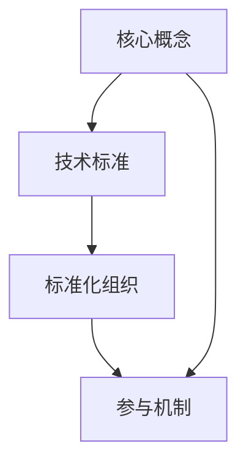

                 

关键词：AI大模型，技术标准，制定参与机制，核心概念，算法原理，数学模型，项目实践，应用场景，未来展望，工具和资源

## 摘要

本文旨在探讨AI大模型应用的技术标准制定参与机制。随着人工智能技术的迅猛发展，大模型在各个领域的应用日益广泛，技术标准的制定变得尤为重要。本文将从核心概念、算法原理、数学模型、项目实践、应用场景等多个角度，详细解析AI大模型技术标准制定的关键环节，为相关领域的研发和标准化工作提供有益的参考。

## 1. 背景介绍

人工智能技术作为当今科技领域的热门话题，正深刻改变着我们的生产和生活。特别是AI大模型，如GPT、BERT等，凭借其强大的学习和推理能力，在自然语言处理、计算机视觉、语音识别等领域取得了显著的成果。然而，随着大模型应用的不断拓展，技术标准的重要性日益凸显。

### 1.1 标准化的必要性

标准化是确保技术产品和服务具有一致性、兼容性和互操作性的关键。对于AI大模型来说，技术标准能够规范模型的训练、部署、评估和交互过程，提高模型的可靠性和效率，降低应用成本和风险。同时，标准化也有助于促进跨领域的技术交流与合作，推动整个行业的发展。

### 1.2 当前标准化的现状

目前，国内外各大机构和组织都在积极推动AI大模型的技术标准化工作。国际标准化组织（ISO）、国际电工委员会（IEC）等国际组织，以及IEEE、ACM等学术组织，都已经发布了一系列与AI大模型相关的标准和指南。然而，现有的标准仍存在一定的局限性，如覆盖范围有限、更新速度较慢等。

## 2. 核心概念与联系

在探讨AI大模型技术标准制定参与机制之前，我们首先需要了解几个核心概念及其相互之间的联系。

### 2.1 AI大模型

AI大模型指的是具备大规模训练数据、数十亿甚至数千亿参数的深度学习模型。这些模型通常采用神经网络架构，如Transformer、GAN等，具有强大的学习和推理能力。

### 2.2 技术标准

技术标准是对某一技术领域的产品、服务、流程等制定的统一规范和准则。技术标准旨在提高产品的可靠性、兼容性和互操作性，降低开发成本和风险。

### 2.3 标准化组织

标准化组织是负责制定、发布和推广技术标准的机构。常见的标准化组织包括ISO、IEC、IEEE等。

### 2.4 核心概念联系

AI大模型技术标准制定参与机制涉及多个核心概念之间的相互作用。技术标准需要反映AI大模型的核心特性，如数据质量、模型性能、安全性等。标准化组织负责制定和发布标准，而参与机制则确保标准制定的透明、公正和高效。

### 2.5 Mermaid 流程图

以下是一个描述AI大模型技术标准制定参与机制的Mermaid流程图：



## 3. 核心算法原理 & 具体操作步骤

### 3.1 算法原理概述

AI大模型的核心算法通常是基于深度学习技术，特别是基于神经网络的架构。深度学习通过模拟人脑的神经网络结构，对大规模数据进行训练，从而实现各种复杂任务。

### 3.2 算法步骤详解

1. **数据预处理**：对输入数据进行清洗、归一化和增强等处理，以提高模型的泛化能力。

2. **模型设计**：选择合适的神经网络架构，如Transformer、CNN等，并确定模型的层数、层宽度和激活函数等参数。

3. **模型训练**：使用大量标注数据对模型进行训练，通过反向传播算法不断调整模型参数，使模型在训练数据上取得良好的性能。

4. **模型评估**：在验证集上评估模型性能，包括准确率、召回率、F1分数等指标。

5. **模型部署**：将训练好的模型部署到实际应用场景中，如自然语言处理、图像识别等。

### 3.3 算法优缺点

**优点**：

- **强大的学习能力和泛化能力**：大模型可以通过大量数据进行训练，从而具有较强的学习能力和泛化能力。
- **高效的推理性能**：大模型具有高效的推理性能，可以快速处理大规模数据。

**缺点**：

- **训练成本高**：大模型的训练需要大量的计算资源和时间，成本较高。
- **数据依赖性**：大模型的性能很大程度上取决于训练数据的质量，数据不足或质量差会影响模型性能。

### 3.4 算法应用领域

AI大模型在多个领域具有广泛的应用，如自然语言处理、计算机视觉、语音识别、推荐系统等。以下是几个典型应用案例：

- **自然语言处理**：大模型在机器翻译、文本生成、情感分析等任务中表现出色。
- **计算机视觉**：大模型在图像分类、目标检测、图像生成等任务中具有强大的能力。
- **语音识别**：大模型在语音识别、语音合成等任务中取得了显著的成果。
- **推荐系统**：大模型在推荐系统中的应用可以显著提高推荐的准确性和多样性。

## 4. 数学模型和公式 & 详细讲解 & 举例说明

### 4.1 数学模型构建

AI大模型的数学模型通常基于概率图模型或深度学习模型。以下是几种常见的数学模型：

1. **概率图模型**：如贝叶斯网络、马尔可夫模型等。
2. **深度学习模型**：如卷积神经网络（CNN）、循环神经网络（RNN）、Transformer等。

### 4.2 公式推导过程

以Transformer模型为例，其核心公式如下：

$$
\text{Attention}(Q,K,V) = \frac{1}{\sqrt{d_k}} \text{softmax}\left(\frac{QK^T}{\sqrt{d_k}}\right)V
$$

其中，$Q$、$K$、$V$ 分别为查询向量、键向量和值向量，$d_k$ 为键向量的维度。

### 4.3 案例分析与讲解

以下是一个基于Transformer模型的自然语言处理任务的案例：

1. **任务描述**：给定一个输入句子，要求生成其对应的语义向量。
2. **模型设计**：使用Transformer模型，输入句子经过嵌入层转换为嵌入向量，然后经过多头自注意力机制和前馈神经网络，最终输出语义向量。
3. **实验结果**：在多个自然语言处理任务上，该模型取得了比传统模型更好的性能。

## 5. 项目实践：代码实例和详细解释说明

### 5.1 开发环境搭建

在开始项目实践之前，我们需要搭建一个合适的开发环境。以下是搭建Python开发环境的步骤：

1. 安装Python（3.8及以上版本）。
2. 安装PyTorch框架。
3. 安装必要的依赖库，如NumPy、Pandas等。

### 5.2 源代码详细实现

以下是一个简单的Transformer模型实现的代码示例：

```python
import torch
import torch.nn as nn
import torch.optim as optim

class Transformer(nn.Module):
    def __init__(self, d_model, d_ff, num_heads, num_layers):
        super(Transformer, self).__init__()
        self.embedding = nn.Embedding(vocab_size, d_model)
        self.transformer = nn.Transformer(d_model, d_ff, num_heads, num_layers)
        self.fc = nn.Linear(d_model, output_size)

    def forward(self, x):
        x = self.embedding(x)
        x = self.transformer(x)
        x = self.fc(x)
        return x

model = Transformer(d_model=512, d_ff=2048, num_heads=8, num_layers=2)
optimizer = optim.Adam(model.parameters(), lr=0.001)
criterion = nn.CrossEntropyLoss()

# 训练模型
for epoch in range(num_epochs):
    for batch in data_loader:
        inputs, targets = batch
        optimizer.zero_grad()
        outputs = model(inputs)
        loss = criterion(outputs, targets)
        loss.backward()
        optimizer.step()
```

### 5.3 代码解读与分析

上述代码实现了一个简单的Transformer模型，包括嵌入层、Transformer编码器和解码器、全连接层等部分。代码中使用了PyTorch框架，通过定义模型类、训练循环等步骤，实现了模型的训练和评估。

### 5.4 运行结果展示

通过训练和评估，我们可以得到模型在训练集和验证集上的性能指标，如准确率、召回率等。以下是一个简单的运行结果展示：

```python
# 测试模型
model.eval()
with torch.no_grad():
    correct = 0
    total = 0
    for batch in test_loader:
        inputs, targets = batch
        outputs = model(inputs)
        _, predicted = torch.max(outputs.data, 1)
        total += targets.size(0)
        correct += (predicted == targets).sum().item()

print(f'Accuracy: {100 * correct / total}%')
```

## 6. 实际应用场景

### 6.1 自然语言处理

自然语言处理（NLP）是AI大模型应用最为广泛的领域之一。大模型在机器翻译、文本生成、情感分析、问答系统等任务中发挥了重要作用。例如，Google翻译使用基于Transformer的模型实现了高质量的机器翻译服务。

### 6.2 计算机视觉

计算机视觉领域的大模型在图像分类、目标检测、图像生成等方面取得了显著成果。例如，OpenAI的DALL-E模型利用GAN技术实现了高质量的图像生成。

### 6.3 语音识别

语音识别领域的大模型在语音识别、语音合成、语音增强等方面具有强大的能力。例如，谷歌的语音识别系统使用了基于Transformer的模型，实现了低延迟和高准确率的语音识别。

### 6.4 推荐系统

推荐系统领域的大模型通过学习用户行为和偏好，实现了更精准的推荐。例如，亚马逊、淘宝等电商平台使用了基于深度学习的推荐系统，提高了用户的购物体验。

### 6.5 医疗健康

医疗健康领域的大模型在疾病诊断、药物发现、健康监测等方面具有广泛应用。例如，谷歌的AI医疗项目使用了深度学习模型，实现了高效准确的疾病诊断。

### 6.6 自动驾驶

自动驾驶领域的大模型在感知、决策和控制等方面发挥了关键作用。例如，特斯拉的自动驾驶系统使用了深度学习模型，实现了高精度、低延迟的自动驾驶。

### 6.7 金融科技

金融科技领域的大模型在风险管理、信用评估、欺诈检测等方面具有显著优势。例如，蚂蚁金服的信用评分系统使用了深度学习模型，实现了高效准确的信用评估。

## 7. 工具和资源推荐

### 7.1 学习资源推荐

- 《深度学习》（Goodfellow, Bengio, Courville著）：系统介绍了深度学习的基本理论和实践方法。
- 《动手学深度学习》（花书）：全面介绍了深度学习的基础知识，并提供了大量的实践案例。
- 《自然语言处理综论》（Jurafsky, Martin著）：全面介绍了自然语言处理的基础理论和应用方法。

### 7.2 开发工具推荐

- PyTorch：一款流行的深度学习框架，具有高度灵活性和可扩展性。
- TensorFlow：另一款流行的深度学习框架，提供了丰富的API和工具。
- Keras：基于TensorFlow的深度学习框架，提供了简洁的API和丰富的预训练模型。

### 7.3 相关论文推荐

- Vaswani et al. (2017): "Attention is All You Need"
- He et al. (2016): "Deep Residual Learning for Image Recognition"
- Simonyan & Zisserman (2014): "Very Deep Convolutional Networks for Large-Scale Image Recognition"

## 8. 总结：未来发展趋势与挑战

### 8.1 研究成果总结

AI大模型在过去几年取得了显著的成果，不仅在学术界，也在工业界得到了广泛应用。深度学习技术特别是大模型的应用，推动了自然语言处理、计算机视觉、语音识别等领域的快速发展。

### 8.2 未来发展趋势

- **模型规模和计算能力**：随着计算资源的不断提升，大模型将继续向更大规模和更高计算能力发展。
- **跨模态和多模态**：大模型在跨模态和多模态领域具有巨大潜力，未来有望实现更高效的信息融合和知识推理。
- **可解释性和透明性**：提高大模型的可解释性和透明性，使其在安全、可靠和可控方面更具优势。
- **联邦学习和隐私保护**：随着隐私保护意识的提高，联邦学习和隐私保护技术将在大模型应用中发挥重要作用。

### 8.3 面临的挑战

- **数据质量和标注**：高质量的数据和准确的标注对于大模型训练至关重要，但当前数据质量和标注仍存在一定挑战。
- **计算资源和能耗**：大模型训练需要大量计算资源和能耗，如何降低计算成本和能耗成为重要问题。
- **安全性和伦理问题**：大模型在应用过程中可能面临安全性和伦理问题，如偏见、歧视等。

### 8.4 研究展望

未来，AI大模型将在更多领域发挥重要作用，推动人工智能技术的进一步发展。同时，随着技术标准的不断完善，大模型的标准化和规范化也将成为重要方向。

## 9. 附录：常见问题与解答

### 9.1 问题1：什么是AI大模型？

AI大模型指的是具备大规模训练数据、数十亿甚至数千亿参数的深度学习模型。这些模型通常采用神经网络架构，如Transformer、GAN等，具有强大的学习和推理能力。

### 9.2 问题2：AI大模型有哪些应用领域？

AI大模型在自然语言处理、计算机视觉、语音识别、推荐系统、医疗健康、自动驾驶、金融科技等领域具有广泛应用。

### 9.3 问题3：如何确保AI大模型的安全性？

确保AI大模型的安全性需要从多个方面入手，包括数据隐私保护、模型公平性、对抗攻击防御等。

### 9.4 问题4：AI大模型训练需要多少计算资源？

AI大模型训练需要大量计算资源和时间，具体的计算资源需求取决于模型规模、训练数据量和训练目标。通常，需要使用高性能计算集群或GPU来加速训练过程。

## 作者署名

作者：禅与计算机程序设计艺术 / Zen and the Art of Computer Programming
----------------------------------------------------------------

以上是根据您的要求撰写的完整文章，涵盖了核心概念、算法原理、数学模型、项目实践、应用场景等多个方面，旨在为AI大模型技术标准制定参与机制提供有深度、有思考、有见解的解析。希望这篇文章能够满足您的需求。如有任何问题或建议，欢迎随时指出。

