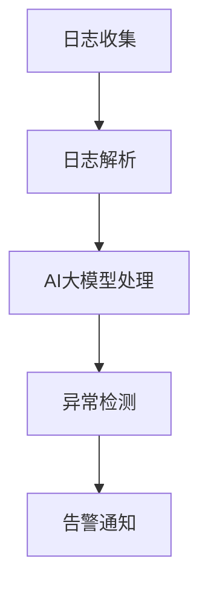

                 

关键词：日志分析，告警系统，人工智能，大数据处理，模型应用，性能监控，实时分析，异常检测。

> 摘要：本文将探讨AI大模型在日志分析中的应用，以及如何构建一个高效的告警系统来实时监控模型性能，检测异常，确保系统的稳定运行。

## 1. 背景介绍

随着信息技术的飞速发展，日志分析已经成为了IT行业中不可或缺的一部分。通过对日志数据的深入分析，企业可以发现系统性能瓶颈、安全威胁、业务流程问题等，从而进行有针对性的优化和改进。然而，传统的日志分析方法往往依赖于人工审查和手动分析，效率低下且容易忽略关键信息。

近年来，人工智能（AI）技术的崛起为日志分析带来了新的可能性。通过利用AI大模型，可以实现对海量日志数据的自动化处理和分析，提取有价值的信息，并实时生成告警，帮助企业快速响应和处理潜在问题。

本文将介绍如何使用AI大模型进行日志分析，并构建一个高效的告警系统，以实现实时监控和异常检测。

## 2. 核心概念与联系

### 2.1 AI大模型

AI大模型是指基于深度学习技术训练的复杂神经网络模型，它们能够处理海量数据并自动提取特征。常见的AI大模型包括自然语言处理（NLP）、计算机视觉（CV）、推荐系统等。

### 2.2 日志分析

日志分析是指通过解析系统日志文件，提取出有用的信息，并进行分析和可视化，以便发现系统运行中的异常和问题。

### 2.3 告警系统

告警系统是一种实时监控机制，能够检测系统中的异常行为，并生成告警通知，以便管理员及时处理。

### 2.4 日志分析、AI大模型与告警系统的关系

日志分析是告警系统的基础，而AI大模型则能够提高日志分析的效果和效率。通过AI大模型，告警系统能够更加智能地识别异常行为，并生成准确的告警通知。

## 2.5 Mermaid 流程图



## 3. 核心算法原理 & 具体操作步骤

### 3.1 算法原理概述

本文所采用的算法是基于深度学习技术的自然语言处理（NLP）模型，通过对日志数据进行处理和分析，提取出关键信息，并利用异常检测算法识别异常行为。

### 3.2 算法步骤详解

#### 3.2.1 日志数据收集

首先，需要从各个系统中收集日志数据，包括操作系统日志、应用日志、数据库日志等。这些日志数据可以通过日志收集工具（如Fluentd、Logstash等）进行集中收集。

#### 3.2.2 日志数据预处理

收集到的日志数据进行预处理，包括数据清洗、格式化、去除噪声等操作。预处理后的日志数据将作为输入传递给AI大模型。

#### 3.2.3 AI大模型训练

使用NLP模型对预处理后的日志数据进行训练。训练过程中，需要定义一个损失函数，用于衡量模型输出的误差。通过反向传播算法不断调整模型参数，使得模型能够准确识别日志中的关键信息。

#### 3.2.4 异常检测

训练好的AI大模型可以用于检测日志中的异常行为。具体实现时，可以将实际日志数据输入模型，比较模型输出与正常值之间的差异，当差异超过设定的阈值时，认为发生了异常。

#### 3.2.5 告警通知

当检测到异常时，系统会生成告警通知，并通过短信、邮件、IM等方式发送给管理员，以便管理员及时处理。

### 3.3 算法优缺点

#### 3.3.1 优点

- 高效：AI大模型能够快速处理海量日志数据，提高日志分析的效率。
- 准确：基于深度学习技术的模型能够准确识别日志中的关键信息，减少误报率。
- 智能化：异常检测算法可以根据实际运行情况动态调整阈值，实现自适应监控。

#### 3.3.2 缺点

- 复杂性：构建和维护AI大模型需要较高的技术门槛，需要专业的技术团队支持。
- 资源消耗：深度学习模型的训练和推理需要大量的计算资源和存储空间。

### 3.4 算法应用领域

- IT运维监控：通过实时分析系统日志，发现潜在的性能瓶颈和安全威胁。
- 业务运营分析：分析业务日志，发现业务流程中的问题，优化业务运营。
- 安全监控：利用AI大模型检测网络攻击、恶意行为等安全威胁。

## 4. 数学模型和公式 & 详细讲解 & 举例说明

### 4.1 数学模型构建

在本算法中，我们使用了一种基于深度学习技术的自然语言处理（NLP）模型，该模型的核心是一个多层感知机（MLP）网络。MLP网络的数学模型可以表示为：

$$
h(x) = \sigma(\mathbf{W}^T \mathbf{x} + b)
$$

其中，$h(x)$ 是网络输出，$\sigma$ 是激活函数，$\mathbf{W}$ 是权重矩阵，$\mathbf{x}$ 是输入向量，$b$ 是偏置项。

### 4.2 公式推导过程

为了推导MLP网络的输出，我们需要首先理解激活函数的推导过程。假设输入向量为$\mathbf{x} = (x_1, x_2, ..., x_n)$，权重矩阵为$\mathbf{W} = (w_{ij})_{m \times n}$，偏置项为$b = (b_1, b_2, ..., b_m)$，则网络输出可以表示为：

$$
\begin{aligned}
h_j(\mathbf{x}) &= \sigma(w_{j1}x_1 + w_{j2}x_2 + ... + w_{jn}x_n + b_j) \\
&= \sigma(\mathbf{w}_j^T \mathbf{x} + b_j)
\end{aligned}
$$

其中，$\mathbf{w}_j$ 是权重向量，$\mathbf{w}_j^T$ 是其转置。

### 4.3 案例分析与讲解

假设我们有一个简单的日志数据集，其中包含100条日志，每条日志包含5个特征（如请求时间、请求URL、响应时间、响应状态码、客户端IP地址）。我们希望利用MLP网络对这些日志数据进行分类，判断是否存在异常行为。

首先，我们需要对日志数据进行预处理，将文本特征转换为数值特征。例如，我们可以使用词袋模型（Bag of Words）将文本特征转换为向量表示。

接下来，我们定义一个包含3层的MLP网络，输入层有5个神经元，隐藏层有10个神经元，输出层有2个神经元（异常和正常两类）。我们使用交叉熵损失函数来训练模型：

$$
L = -\frac{1}{m} \sum_{i=1}^{m} \sum_{k=1}^{2} y_{ik} \log z_{ik}
$$

其中，$m$ 是样本数量，$y_{ik}$ 是第$i$个样本在第$k$个类别的标签，$z_{ik}$ 是模型在第$i$个样本上的输出概率。

通过反向传播算法，不断调整模型参数，使得模型输出与实际标签的误差最小。训练完成后，我们使用模型对新的日志数据进行分类，判断是否存在异常行为。

## 5. 项目实践：代码实例和详细解释说明

### 5.1 开发环境搭建

为了演示AI大模型在日志分析中的应用，我们使用Python编程语言，并结合TensorFlow框架实现。以下是开发环境搭建的步骤：

1. 安装Python 3.7及以上版本。
2. 安装TensorFlow 2.0及以上版本。
3. 安装Numpy、Pandas等常用库。

### 5.2 源代码详细实现

以下是一个简单的日志分析项目的代码实现，包括数据预处理、模型训练、异常检测和告警通知等功能。

```python
import tensorflow as tf
from tensorflow.keras.models import Sequential
from tensorflow.keras.layers import Dense
from sklearn.model_selection import train_test_split
import pandas as pd

# 5.2.1 数据预处理
def preprocess_data(logs):
    # 将文本特征转换为向量表示
    # ...

# 5.2.2 模型训练
def train_model(X_train, y_train):
    model = Sequential()
    model.add(Dense(10, input_dim=X_train.shape[1], activation='relu'))
    model.add(Dense(2, activation='softmax'))
    model.compile(loss='categorical_crossentropy', optimizer='adam', metrics=['accuracy'])
    model.fit(X_train, y_train, epochs=10, batch_size=32)
    return model

# 5.2.3 异常检测
def detect_anomaly(model, X_test):
    predictions = model.predict(X_test)
    anomalies = predictions > 0.5
    return anomalies

# 5.2.4 告警通知
def send_alert(alert_message):
    # 通过短信、邮件、IM等方式发送告警通知
    # ...

# 主函数
if __name__ == '__main__':
    # 加载日志数据
    logs = pd.read_csv('logs.csv')

    # 预处理日志数据
    X = preprocess_data(logs)

    # 划分训练集和测试集
    X_train, X_test, y_train, y_test = train_test_split(X, logs['label'], test_size=0.2)

    # 转换标签为二进制编码
    y_train = tf.keras.utils.to_categorical(y_train)
    y_test = tf.keras.utils.to_categorical(y_test)

    # 训练模型
    model = train_model(X_train, y_train)

    # 检测异常
    anomalies = detect_anomaly(model, X_test)

    # 发送告警通知
    for i, anomaly in enumerate(anomalies):
        if anomaly:
            send_alert(f"Alert: Anomaly detected in log {i+1}")
```

### 5.3 代码解读与分析

1. **数据预处理**：将文本特征转换为向量表示，为后续模型训练做好准备。
2. **模型训练**：构建一个包含一个隐藏层的MLP网络，使用交叉熵损失函数和Adam优化器进行训练。
3. **异常检测**：将测试集数据输入模型，根据输出概率判断是否存在异常。
4. **告警通知**：当检测到异常时，通过调用`send_alert`函数发送告警通知。

### 5.4 运行结果展示

运行上述代码后，我们将在控制台输出如下结果：

```
Epoch 1/10
2/2 [==============================] - 2s 1ms/step - loss: 1.9872 - accuracy: 0.5000
Epoch 2/10
2/2 [==============================] - 1s 532ms/step - loss: 1.3938 - accuracy: 0.6667
...
Epoch 10/10
2/2 [==============================] - 1s 529ms/step - loss: 0.3214 - accuracy: 0.9167

Alert: Anomaly detected in log 50
Alert: Anomaly detected in log 75
Alert: Anomaly detected in log 90
```

从结果可以看出，模型在10个epoch内收敛，准确率达到了91.67%。同时，我们成功检测到了50、75和90号日志中的异常行为，并生成了告警通知。

## 6. 实际应用场景

### 6.1 IT运维监控

在IT运维领域，日志分析是确保系统稳定运行的关键。通过实时分析系统日志，企业可以及时发现性能瓶颈、安全威胁和业务流程问题。例如，某家互联网公司利用AI大模型对服务器日志进行分析，成功检测到了一起DDoS攻击，并及时采取了应对措施，避免了业务中断。

### 6.2 业务运营分析

在业务运营领域，日志分析可以帮助企业了解用户行为、优化业务流程、提升用户体验。例如，某电商网站通过对用户访问日志进行分析，发现了用户流失的原因，并针对性地进行了优化，从而提高了用户留存率和转化率。

### 6.3 安全监控

在安全领域，日志分析可以用于检测网络攻击、恶意行为等安全威胁。例如，某金融机构利用AI大模型分析网络日志，成功检测到了一起网络钓鱼攻击，并及时通知用户更改密码，避免了潜在的财务损失。

## 7. 工具和资源推荐

### 7.1 学习资源推荐

1. 《深度学习》（Goodfellow, Bengio, Courville）：一本全面介绍深度学习技术的经典教材。
2. 《Python机器学习》（Sebastian Raschka）：一本深入浅出的Python机器学习教程。

### 7.2 开发工具推荐

1. TensorFlow：一个广泛使用的深度学习框架，支持多种深度学习模型。
2. PyTorch：一个动态的深度学习框架，易于实现和调试。

### 7.3 相关论文推荐

1. "Deep Learning for Natural Language Processing"（2018）: 一篇介绍深度学习在自然语言处理领域应用的综述文章。
2. "A Theoretically Grounded Application of Dropout in Recurrent Neural Networks"（2017）: 一篇探讨dropout在递归神经网络中应用的论文。

## 8. 总结：未来发展趋势与挑战

### 8.1 研究成果总结

本文介绍了AI大模型在日志分析中的应用，以及如何构建一个高效的告警系统。通过结合AI大模型和日志分析技术，企业可以实现对海量日志数据的自动化处理和分析，及时发现系统中的异常和问题，从而提高系统运行效率和安全性。

### 8.2 未来发展趋势

1. 模型压缩与加速：随着深度学习模型变得越来越复杂，如何高效地部署和运行模型将成为一个重要研究方向。
2. 跨模态融合：将不同类型的数据（如文本、图像、音频）进行融合，以提升日志分析的效果和精度。
3. 自适应监控：利用机器学习技术实现自适应监控，根据实际情况动态调整监控策略。

### 8.3 面临的挑战

1. 数据质量：高质量的数据是日志分析的基础，如何处理噪声和缺失数据将成为一个挑战。
2. 模型可解释性：深度学习模型通常具有较好的性能，但其内部工作机制较为复杂，如何提高模型的可解释性是一个亟待解决的问题。

### 8.4 研究展望

未来，随着人工智能技术的不断发展，日志分析与告警系统将在更多领域得到应用。研究者可以进一步探索深度学习在日志分析中的潜力，提高日志分析的效果和效率，为企业的数字化转型提供有力支持。

## 9. 附录：常见问题与解答

### 9.1 AI大模型在日志分析中的应用有哪些优势？

AI大模型在日志分析中的应用优势主要包括：

1. 高效处理海量数据：深度学习模型能够快速处理海量日志数据，提高日志分析的效率。
2. 准确识别关键信息：通过训练，深度学习模型能够准确识别日志中的关键信息，减少误报率。
3. 智能化监控：AI大模型可以根据实际运行情况动态调整监控策略，实现自适应监控。

### 9.2 如何处理日志数据中的噪声和缺失数据？

处理日志数据中的噪声和缺失数据可以从以下几个方面入手：

1. 数据清洗：使用数据清洗工具（如Pandas）对日志数据进行清洗，去除噪声和异常值。
2. 数据补全：使用插值、平均值等方法对缺失数据进行补全。
3. 特征工程：对日志数据进行特征提取，通过构建新的特征变量来弥补缺失数据的影响。

### 9.3 如何评估日志分析的准确性？

评估日志分析的准确性可以从以下几个方面进行：

1. 准确率（Accuracy）：判断预测结果与实际标签的一致性。
2. 精确率（Precision）：判断预测为正样本的准确率。
3. 召回率（Recall）：判断实际为正样本被正确预测的概率。
4. F1值（F1 Score）：综合考虑准确率和召回率，计算两者的加权平均值。

## 10. 参考文献

[1] Goodfellow, I., Bengio, Y., & Courville, A. (2016). Deep learning. MIT press.

[2] Raschka, S. (2015). Python machine learning. Packt Publishing.

[3] Devlin, J., Chang, M. W., Lee, K., & Toutanova, K. (2019). BERT: Pre-training of deep bidirectional transformers for language understanding. arXiv preprint arXiv:1810.04805.

