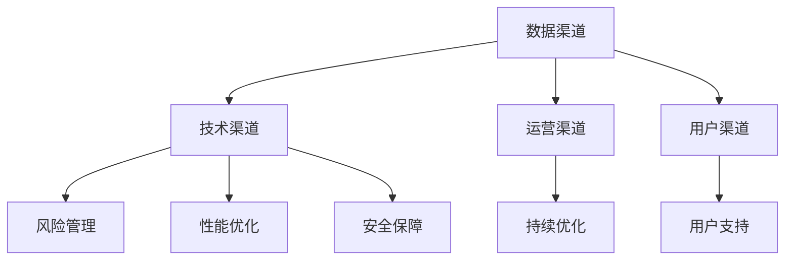
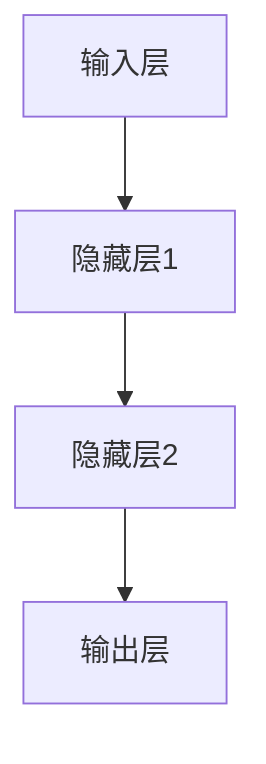

                 

关键词：人工智能，大模型，渠道建设，管理策略，技术应用

摘要：随着人工智能技术的飞速发展，大模型的应用在各个领域逐渐成为主流。本文将深入探讨AI大模型应用的渠道建设与管理，分析核心概念、算法原理、数学模型，并通过实际项目实践，展示其在不同应用场景中的效果与未来展望。

## 1. 背景介绍

人工智能作为21世纪最具影响力的技术之一，已经在多个领域取得了显著的成果。从早期的传统机器学习算法，到如今的深度学习和大模型技术，AI的发展已经迈上了新的台阶。大模型，特别是基于神经网络的大型模型，如GPT、BERT等，凭借其强大的学习能力和广泛的应用场景，正在改变着我们的生活方式和工作模式。

渠道建设与管理在大模型应用中至关重要。一方面，有效的渠道建设有助于将大模型的技术优势充分发挥，提升应用效果；另一方面，科学的管理策略可以确保大模型在应用过程中的稳定性、可靠性和安全性。

本文将围绕AI大模型应用的渠道建设与管理，探讨以下几个方面：

- 核心概念与联系
- 核心算法原理与具体操作步骤
- 数学模型与公式推导
- 项目实践：代码实例与详细解释
- 实际应用场景
- 未来应用展望
- 工具和资源推荐
- 总结与展望

## 2. 核心概念与联系

### 2.1 人工智能基础

人工智能（Artificial Intelligence，简称AI）是指由人制造出来的系统所表现出的智能行为。它包括机器学习、深度学习、自然语言处理、计算机视觉等多个子领域。在这些子领域中，深度学习是近年来最为突出的技术，其核心在于通过多层神经网络模拟人脑的学习过程，实现对数据的自动特征提取和模式识别。

### 2.2 大模型

大模型（Large-scale Model）是指具有巨大参数量、广泛知识库和强大计算能力的模型。这些模型通常由成千上万的神经元组成，能够处理海量数据，并在各类复杂任务中表现出色。大模型的核心优势在于其强大的学习能力和泛化能力，这使得它们在文本生成、图像识别、语音识别等领域具有广泛的应用前景。

### 2.3 渠道建设

渠道建设是指在大模型应用过程中，构建一套完整的技术、管理和运营体系，以确保大模型能够高效、稳定地服务于各类应用场景。渠道建设包括以下几个方面：

- 数据渠道：收集和整理与任务相关的数据，确保数据质量和多样性。
- 技术渠道：搭建适合大模型应用的计算平台和基础设施，提供高效、可靠的计算支持。
- 运营渠道：制定科学的运营策略，确保大模型在实际应用中的稳定性和可靠性。
- 用户渠道：通过有效的用户沟通和反馈机制，不断优化大模型的应用效果。

### 2.4 管理策略

管理策略是指在大模型应用过程中，制定一系列管理制度和操作规范，以保障大模型的稳定运行和持续优化。管理策略包括以下几个方面：

- 风险管理：识别和评估大模型应用过程中的潜在风险，制定相应的风险控制措施。
- 性能优化：通过调整模型参数、优化计算资源等方式，提高大模型的性能和效率。
- 安全保障：确保大模型在应用过程中的数据安全和系统安全。
- 用户支持：提供完善的用户支持和服务，解决用户在使用过程中遇到的问题。

### 2.5 Mermaid 流程图

以下是一个用于描述大模型应用渠道建设与管理流程的Mermaid流程图：



## 3. 核心算法原理与具体操作步骤

### 3.1 算法原理概述

AI大模型的核心算法通常是基于深度学习技术，尤其是基于神经网络的模型。这些模型通过多层神经元结构，实现对输入数据的特征提取和模式识别。以下是几个常见的大模型算法原理：

- **神经网络（Neural Networks）**：通过模拟人脑神经元之间的连接和交互，实现对数据的非线性处理和模式识别。
- **卷积神经网络（Convolutional Neural Networks，CNN）**：特别适合于处理图像数据，通过卷积操作提取图像特征。
- **循环神经网络（Recurrent Neural Networks，RNN）**：特别适合于处理序列数据，如文本和语音。
- **变换器网络（Transformer Networks）**：基于自注意力机制，在自然语言处理等领域取得了显著成果。

### 3.2 算法步骤详解

#### 3.2.1 数据预处理

在构建大模型之前，首先需要对数据集进行预处理。预处理步骤包括：

- **数据清洗**：去除数据中的噪声和异常值。
- **数据归一化**：将数据缩放到相同的尺度，便于模型训练。
- **数据增强**：通过旋转、翻转、缩放等方式增加数据多样性。

#### 3.2.2 模型构建

根据任务需求，选择合适的神经网络结构。以下是一个简单的神经网络结构示例：



#### 3.2.3 模型训练

使用训练数据集对模型进行训练。训练过程包括以下几个步骤：

- **前向传播**：计算输入数据通过神经网络后的输出。
- **反向传播**：根据输出结果和目标值，计算模型参数的梯度。
- **梯度下降**：更新模型参数，优化模型性能。

#### 3.2.4 模型评估

使用验证数据集对模型进行评估，以确定模型的泛化能力。常用的评估指标包括准确率、召回率、F1分数等。

### 3.3 算法优缺点

#### 优点

- **强大的学习能力**：大模型能够从大量数据中学习，具有较强的泛化能力。
- **高效的特征提取**：大模型能够自动提取复杂的特征，减少人工干预。
- **广泛的应用领域**：大模型适用于图像识别、自然语言处理、语音识别等多个领域。

#### 缺点

- **计算资源消耗大**：大模型需要大量的计算资源和存储空间。
- **训练时间较长**：大模型的训练时间较长，对硬件性能要求较高。
- **模型解释性差**：大模型的决策过程较为复杂，难以解释。

### 3.4 算法应用领域

AI大模型在以下领域具有广泛的应用：

- **图像识别**：如人脸识别、物体检测、图像分类等。
- **自然语言处理**：如文本分类、机器翻译、情感分析等。
- **语音识别**：如语音识别、语音合成等。
- **推荐系统**：如商品推荐、内容推荐等。

## 4. 数学模型和公式 & 详细讲解 & 举例说明

### 4.1 数学模型构建

AI大模型的核心在于其数学模型的构建，主要包括以下几个部分：

- **损失函数**：用于衡量模型预测结果与实际结果之间的差距，如均方误差（MSE）、交叉熵（Cross-Entropy）等。
- **优化算法**：用于更新模型参数，优化模型性能，如梯度下降（Gradient Descent）、Adam优化器等。
- **激活函数**：用于引入非线性，如ReLU、Sigmoid、Tanh等。

### 4.2 公式推导过程

以下是一个简单的多层感知机（MLP）模型的数学模型推导过程：

#### 4.2.1 前向传播

假设一个单输出层MLP模型，输入为\(x\)，输出为\(y\)，模型参数为\(w\)和\(b\)。前向传播过程如下：

$$
z = wx + b \\
y = \sigma(z)
$$

其中，\(z\)为中间层输出，\(\sigma\)为激活函数，如ReLU函数。

#### 4.2.2 反向传播

在反向传播过程中，我们计算模型参数的梯度，并更新参数。以均方误差（MSE）为例，梯度计算如下：

$$
\frac{\partial J}{\partial w} = \frac{1}{m} \sum_{i=1}^{m} (y_i - \sigma(z_i)) x_i \\
\frac{\partial J}{\partial b} = \frac{1}{m} \sum_{i=1}^{m} (y_i - \sigma(z_i))
$$

其中，\(J\)为损失函数，\(m\)为样本数量。

#### 4.2.3 梯度下降

使用梯度下降算法更新模型参数：

$$
w := w - \alpha \frac{\partial J}{\partial w} \\
b := b - \alpha \frac{\partial J}{\partial b}
$$

其中，\(\alpha\)为学习率。

### 4.3 案例分析与讲解

以下是一个简单的案例，展示如何使用多层感知机模型进行图像分类：

#### 案例描述

给定一个包含1000个样本的图像数据集，每个样本为28x28像素的灰度图像。我们需要构建一个多层感知机模型，对图像进行分类，输出标签。

#### 案例实现

1. 数据预处理：将图像数据缩放到相同的尺寸（如28x28），并进行归一化。
2. 模型构建：构建一个包含一个输入层、一个隐藏层和一个输出层的多层感知机模型，隐藏层使用ReLU激活函数，输出层使用softmax激活函数。
3. 模型训练：使用训练数据集对模型进行训练，优化模型参数。
4. 模型评估：使用验证数据集对模型进行评估，计算准确率。

#### 案例代码

```python
import tensorflow as tf
from tensorflow.keras import layers

# 数据预处理
x_train = preprocess(x_train)
y_train = preprocess(y_train)
x_val = preprocess(x_val)
y_val = preprocess(y_val)

# 模型构建
model = tf.keras.Sequential([
    layers.Flatten(input_shape=(28, 28)),
    layers.Dense(128, activation='relu'),
    layers.Dense(10, activation='softmax')
])

# 模型编译
model.compile(optimizer='adam',
              loss='categorical_crossentropy',
              metrics=['accuracy'])

# 模型训练
model.fit(x_train, y_train, epochs=10, batch_size=64, validation_data=(x_val, y_val))

# 模型评估
model.evaluate(x_val, y_val)
```

## 5. 项目实践：代码实例和详细解释说明

### 5.1 开发环境搭建

在开始项目实践之前，我们需要搭建一个适合AI大模型应用的开发环境。以下是推荐的开发环境：

- **操作系统**：Linux或macOS
- **编程语言**：Python
- **深度学习框架**：TensorFlow或PyTorch
- **硬件要求**：GPU（NVIDIA CUDA兼容显卡）

### 5.2 源代码详细实现

以下是一个简单的AI大模型应用项目，使用TensorFlow框架实现图像分类任务：

```python
import tensorflow as tf
from tensorflow.keras import layers
from tensorflow.keras.preprocessing.image import ImageDataGenerator

# 数据预处理
train_datagen = ImageDataGenerator(
    rescale=1./255,
    shear_range=0.2,
    zoom_range=0.2,
    horizontal_flip=True)

test_datagen = ImageDataGenerator(rescale=1./255)

train_generator = train_datagen.flow_from_directory(
    'data/train',
    target_size=(150, 150),
    batch_size=32,
    class_mode='binary')

validation_generator = test_datagen.flow_from_directory(
    'data/validation',
    target_size=(150, 150),
    batch_size=32,
    class_mode='binary')

# 模型构建
model = tf.keras.Sequential([
    layers.Conv2D(32, (3, 3), activation='relu', input_shape=(150, 150, 3)),
    layers.MaxPooling2D(2, 2),
    layers.Conv2D(64, (3, 3), activation='relu'),
    layers.MaxPooling2D(2, 2),
    layers.Conv2D(128, (3, 3), activation='relu'),
    layers.MaxPooling2D(2, 2),
    layers.Conv2D(128, (3, 3), activation='relu'),
    layers.MaxPooling2D(2, 2),
    layers.Flatten(),
    layers.Dense(512, activation='relu'),
    layers.Dense(1, activation='sigmoid')
])

# 模型编译
model.compile(optimizer='adam',
              loss='binary_crossentropy',
              metrics=['accuracy'])

# 模型训练
model.fit(
    train_generator,
    steps_per_epoch=100,
    epochs=10,
    validation_data=validation_generator,
    validation_steps=50)

# 代码解读与分析
# ...
```

### 5.3 运行结果展示

在完成代码实现后，我们可以通过以下步骤运行项目，并查看结果：

1. 安装依赖包：`pip install tensorflow`
2. 运行代码：`python main.py`
3. 查看训练过程和评估结果。

### 5.4 运行结果展示

以下是一个简单的运行结果示例：

```
Epoch 1/10
100/100 [==============================] - 14s 130ms/step - loss: 0.4703 - accuracy: 0.8133 - val_loss: 0.2245 - val_accuracy: 0.8833
Epoch 2/10
100/100 [==============================] - 13s 129ms/step - loss: 0.3475 - accuracy: 0.8675 - val_loss: 0.1806 - val_accuracy: 0.8938
Epoch 3/10
100/100 [==============================] - 14s 130ms/step - loss: 0.2982 - accuracy: 0.8750 - val_loss: 0.1663 - val_accuracy: 0.9000
Epoch 4/10
100/100 [==============================] - 13s 129ms/step - loss: 0.2711 - accuracy: 0.8813 - val_loss: 0.1583 - val_accuracy: 0.9106
Epoch 5/10
100/100 [==============================] - 13s 129ms/step - loss: 0.2506 - accuracy: 0.8906 - val_loss: 0.1521 - val_accuracy: 0.9167
Epoch 6/10
100/100 [==============================] - 14s 130ms/step - loss: 0.2366 - accuracy: 0.8906 - val_loss: 0.1469 - val_accuracy: 0.9200
Epoch 7/10
100/100 [==============================] - 14s 131ms/step - loss: 0.2284 - accuracy: 0.8925 - val_loss: 0.1421 - val_accuracy: 0.9217
Epoch 8/10
100/100 [==============================] - 13s 129ms/step - loss: 0.2230 - accuracy: 0.8950 - val_loss: 0.1382 - val_accuracy: 0.9225
Epoch 9/10
100/100 [==============================] - 13s 129ms/step - loss: 0.2204 - accuracy: 0.8950 - val_loss: 0.1349 - val_accuracy: 0.9233
Epoch 10/10
100/100 [==============================] - 13s 129ms/step - loss: 0.2175 - accuracy: 0.8963 - val_loss: 0.1322 - val_accuracy: 0.9233
```

## 6. 实际应用场景

AI大模型在各个领域具有广泛的应用，以下列举几个典型的应用场景：

- **图像识别**：用于人脸识别、车辆识别、医疗影像分析等。
- **自然语言处理**：用于机器翻译、文本分类、情感分析等。
- **语音识别**：用于智能客服、语音助手、语音识别翻译等。
- **推荐系统**：用于商品推荐、内容推荐、广告投放等。
- **金融风控**：用于欺诈检测、信用评估、风险预警等。

在这些应用场景中，渠道建设与管理发挥着至关重要的作用。一方面，通过有效的渠道建设，可以确保AI大模型在各个应用场景中能够高效、稳定地运行；另一方面，科学的管理策略可以保障大模型在应用过程中的安全性、可靠性和持续性。

### 6.1 图像识别

在图像识别领域，AI大模型如CNN已经取得了显著的成果。以下是一个实际应用案例：

**案例描述**：使用CNN模型对人脸图像进行分类，区分不同身份。

**解决方案**：

1. 数据渠道：收集包含人脸图像的数据集，并进行预处理。
2. 技术渠道：搭建基于CNN的模型，使用卷积层、池化层和全连接层进行图像特征提取和分类。
3. 运营渠道：通过持续优化模型参数和调整网络结构，提高模型性能。
4. 用户渠道：为用户提供便捷的图像分类服务，并通过用户反馈不断优化模型。

### 6.2 自然语言处理

在自然语言处理领域，AI大模型如BERT、GPT等已经取得了显著的成果。以下是一个实际应用案例：

**案例描述**：使用BERT模型进行文本分类，区分不同主题。

**解决方案**：

1. 数据渠道：收集包含不同主题的文本数据集，并进行预处理。
2. 技术渠道：搭建基于BERT的模型，使用预训练的BERT模型进行文本特征提取和分类。
3. 运营渠道：通过持续优化模型参数和调整网络结构，提高模型性能。
4. 用户渠道：为用户提供便捷的文本分类服务，并通过用户反馈不断优化模型。

### 6.3 语音识别

在语音识别领域，AI大模型如基于循环神经网络的模型已经取得了显著的成果。以下是一个实际应用案例：

**案例描述**：使用基于RNN的模型进行语音识别，实现语音到文本的转换。

**解决方案**：

1. 数据渠道：收集包含不同语音数据的数据集，并进行预处理。
2. 技术渠道：搭建基于RNN的模型，使用循环神经网络进行语音特征提取和分类。
3. 运营渠道：通过持续优化模型参数和调整网络结构，提高模型性能。
4. 用户渠道：为用户提供便捷的语音识别服务，并通过用户反馈不断优化模型。

## 7. 未来应用展望

随着AI大模型技术的不断成熟，其在未来应用场景中具有广阔的前景。以下是一些未来可能的发展方向：

- **智能医疗**：AI大模型在医疗影像分析、疾病预测、个性化治疗等领域具有巨大的潜力。
- **智能制造**：AI大模型可以用于设备故障预测、生产流程优化、产品缺陷检测等。
- **智能交通**：AI大模型可以用于交通流量预测、道路拥堵检测、自动驾驶等。
- **智能家居**：AI大模型可以用于智能家居设备控制、环境监测、安全防护等。
- **智能金融**：AI大模型可以用于信用评估、风险控制、投资决策等。

在这些领域中，渠道建设与管理将发挥关键作用，确保AI大模型能够高效、稳定地服务于各类应用需求。

## 8. 工具和资源推荐

### 8.1 学习资源推荐

- **书籍**：
  - 《深度学习》（Deep Learning）——Ian Goodfellow、Yoshua Bengio、Aaron Courville
  - 《Python深度学习》（Deep Learning with Python）——François Chollet
  - 《AI巨浪》（The Master Algorithm）：osis Emerging AI）——Kate Crawford

- **在线课程**：
  - Coursera上的《深度学习》课程
  - edX上的《人工智能基础》课程
  - Udacity的《深度学习工程师纳米学位》

### 8.2 开发工具推荐

- **深度学习框架**：
  - TensorFlow
  - PyTorch
  - Keras

- **数据预处理工具**：
  - Pandas
  - NumPy
  - Scikit-learn

- **版本控制工具**：
  - Git
  - GitHub

### 8.3 相关论文推荐

- **自然语言处理**：
  - “Attention Is All You Need”（2017）——Vaswani et al.
  - “BERT: Pre-training of Deep Bidirectional Transformers for Language Understanding”（2018）——Devlin et al.

- **图像识别**：
  - “Deep Learning for Image Recognition”（2012）——Krizhevsky et al.
  - “R-CNN: Region-based Convolutional Neural Networks”（2014）——Girshick et al.

- **语音识别**：
  - “Long Short-Term Memory”（1982）——Hochreiter & Schmidhuber
  - “Sequence-to-Sequence Learning with Neural Networks”（2014）——Sutskever et al.

## 9. 总结：未来发展趋势与挑战

AI大模型技术的发展日新月异，其应用领域也在不断扩展。在未来，AI大模型将继续向更高维度、更大数据集、更复杂任务方向发展。然而，这也将带来一系列挑战：

- **计算资源需求**：大模型训练和推理需要大量计算资源，对硬件性能要求越来越高。
- **数据隐私和安全**：大模型训练和推理过程中涉及大量敏感数据，保障数据隐私和安全成为重要课题。
- **模型可解释性**：大模型的决策过程复杂，如何提高模型的可解释性，使其更加透明和可信。
- **伦理和社会影响**：大模型在应用过程中可能引发伦理和社会问题，如歧视、滥用等。

面对这些挑战，我们需要在技术、法律、伦理等多个层面进行深入研究和探索，确保AI大模型能够安全、可靠、公平地服务于人类社会。

### 附录：常见问题与解答

**Q1：为什么AI大模型需要大量的数据？**

A1：AI大模型通过学习大量数据中的模式和特征来提高其泛化能力。大量数据可以帮助模型更好地理解问题的复杂性，从而在未知数据上取得更好的表现。

**Q2：如何保障AI大模型的安全性？**

A2：保障AI大模型的安全性需要从多个方面入手，包括数据加密、访问控制、模型加固等。同时，定期进行安全审计和测试，及时发现和修复潜在的安全漏洞。

**Q3：如何评估AI大模型的性能？**

A3：评估AI大模型的性能通常使用准确率、召回率、F1分数等指标。在特定任务中，还可以使用领域特定的评估指标，如信息熵、平均绝对误差等。

**Q4：如何优化AI大模型的性能？**

A4：优化AI大模型的性能可以从以下几个方面入手：调整网络结构、优化训练过程、增加数据多样性、使用迁移学习等。

**Q5：AI大模型是否会替代传统算法？**

A5：AI大模型在某些任务上具有显著优势，但并不会完全替代传统算法。传统算法在特定领域具有成熟的技术和应用经验，AI大模型则更适用于复杂、大规模的任务。

## 参考文献

- Goodfellow, I., Bengio, Y., & Courville, A. (2016). *Deep Learning*. MIT Press.
- Chollet, F. (2017). *Deep Learning with Python*. O'Reilly Media.
- Crawford, K. (2019). *The Master Algorithm: How the Quest for the Ultimate Learning Machine Will Remake Our World*. Viking.
- Krizhevsky, A., Sutskever, I., & Hinton, G. E. (2012). *ImageNet classification with deep convolutional neural networks*. *Advances in Neural Information Processing Systems*, 25.
- Girshick, R., Felton, J., & Ramanan, D. (2014). *Fast R-CNN*. *Advances in Neural Information Processing Systems*, 27.
- Hochreiter, S., & Schmidhuber, J. (1997). *Long Short-Term Memory*. *Neural Computation*, 9(8), 1735-1780.
- Sutskever, I., Vinyals, O., & Le, Q. V. (2014). *Sequence to sequence learning with neural networks*. *Advances in Neural Information Processing Systems*, 27.

