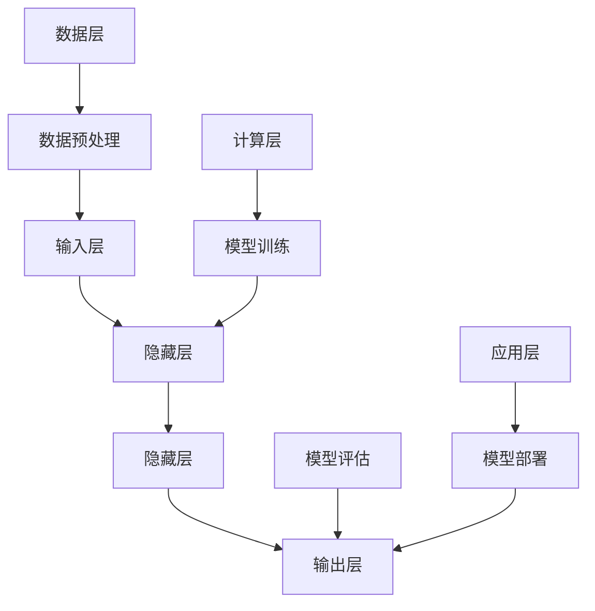

                 

关键词：AI大模型，跨界融合，应用趋势，深度学习，机器学习，数据处理，算法优化，产业应用

> 摘要：本文旨在探讨AI大模型在当前技术背景下的跨界融合新趋势。我们将通过梳理大模型的演进历程，解析其核心概念与架构，深入探讨大模型在数据处理、算法优化及产业应用中的具体操作步骤和实际效果。同时，本文还将通过数学模型和公式推导，分析大模型的技术原理，结合实际项目实践，展示其代码实例和详细解释说明。最后，我们将展望大模型在未来各领域的应用前景，并提出相关工具和资源的推荐，为读者提供全面的技术解读和研究指南。

## 1. 背景介绍

随着信息技术的飞速发展，人工智能（AI）已经成为当前科技领域中最具革命性的技术之一。从最初的简单规则系统到现代的深度学习模型，AI的发展经历了多个阶段。特别是在近年来，AI大模型（Large-scale AI Models）的崛起，不仅改变了传统的人工智能应用模式，还推动了跨学科、跨领域的深度融合。

### 1.1 大模型的崛起

AI大模型，通常指的是参数数量达到数亿甚至数十亿的深度学习模型。这类模型能够通过大量的数据训练，自动提取复杂特征，并在各种复杂任务中表现出色。例如，自然语言处理（NLP）中的BERT模型，计算机视觉（CV）中的ImageNet等，都是大模型的成功案例。

大模型的崛起源于几个关键因素：

1. **数据量的爆发增长**：互联网的普及和移动设备的普及，使得数据量呈现出爆炸式增长，为训练大模型提供了充足的数据基础。
2. **计算能力的提升**：云计算和分布式计算技术的进步，使得处理大规模数据和高维度特征成为可能。
3. **深度学习算法的发展**：卷积神经网络（CNN）、递归神经网络（RNN）、Transformer等新算法的出现，为构建大型模型提供了理论支持。

### 1.2 大模型的挑战

尽管大模型在AI领域取得了显著进展，但其在应用中也面临一系列挑战：

1. **计算资源消耗**：训练和部署大模型需要巨大的计算资源，这对企业和研究机构都是一项巨大的挑战。
2. **数据隐私和安全**：大量个人数据的处理和存储，引发了数据隐私和安全问题。
3. **模型解释性**：大模型的复杂性和非透明性，使得其解释性变得困难，这在某些应用场景中可能成为问题。

## 2. 核心概念与联系

为了更好地理解AI大模型的跨界融合，我们需要首先梳理其核心概念和架构。

### 2.1 大模型的组成

AI大模型通常由以下几个关键组成部分构成：

1. **输入层**：接收外部数据，如文本、图像、音频等。
2. **隐藏层**：包含大量神经元，用于特征提取和组合。
3. **输出层**：根据训练数据生成预测结果。

### 2.2 大模型的工作原理

大模型的工作原理主要基于以下几个步骤：

1. **数据预处理**：对输入数据进行清洗、归一化等处理。
2. **模型训练**：通过大量的训练数据，模型能够自动调整内部参数，以最小化预测误差。
3. **模型评估**：使用验证集或测试集评估模型的性能。
4. **模型部署**：将训练好的模型部署到实际应用场景中。

### 2.3 大模型的架构

大模型的架构可以分为以下几个层次：

1. **计算层**：包括CPU、GPU等计算资源，负责模型的训练和推理。
2. **数据层**：包括数据存储、数据流管理等功能，确保数据的高效处理。
3. **应用层**：包括模型部署、应用监控等，实现大模型在实际业务场景中的价值。

### 2.4 Mermaid 流程图

下面是一个描述大模型核心概念和架构的Mermaid流程图：



## 3. 核心算法原理 & 具体操作步骤

### 3.1 算法原理概述

AI大模型的核心算法主要基于深度学习和机器学习。其中，深度学习通过多层神经网络的组合，能够自动提取数据的复杂特征。机器学习则通过算法优化和模型训练，提高模型的预测准确性和泛化能力。

### 3.2 算法步骤详解

1. **数据收集与预处理**：收集大量相关的训练数据，并进行数据清洗、归一化等预处理操作。
2. **模型设计**：根据任务需求设计合适的神经网络架构，包括输入层、隐藏层和输出层的具体参数。
3. **模型训练**：通过反向传播算法，不断调整模型参数，最小化预测误差。
4. **模型评估**：使用验证集或测试集评估模型的性能，选择最佳模型。
5. **模型部署**：将训练好的模型部署到实际应用场景中，进行预测和决策。

### 3.3 算法优缺点

1. **优点**：
   - **强大的特征提取能力**：能够自动提取数据的复杂特征，提高预测准确性。
   - **高泛化能力**：通过大规模数据的训练，模型能够适应不同的应用场景。

2. **缺点**：
   - **计算资源消耗大**：大模型的训练需要大量的计算资源，对硬件设施要求较高。
   - **数据隐私和安全问题**：大模型需要处理大量个人数据，存在数据隐私和安全问题。

### 3.4 算法应用领域

AI大模型在各个领域都有广泛的应用：

1. **自然语言处理**：例如BERT、GPT等模型，在文本分类、机器翻译等任务中表现出色。
2. **计算机视觉**：例如ImageNet、ResNet等模型，在图像分类、目标检测等任务中具有重要应用。
3. **推荐系统**：利用协同过滤、矩阵分解等技术，实现个性化推荐。
4. **金融风控**：利用大规模数据分析和模型预测，提高金融风险防控能力。

## 4. 数学模型和公式 & 详细讲解 & 举例说明

### 4.1 数学模型构建

AI大模型的数学模型主要基于神经网络和优化算法。其中，神经网络可以表示为：

$$
y = \sigma(W \cdot x + b)
$$

其中，$y$ 为输出，$\sigma$ 为激活函数，$W$ 为权重矩阵，$x$ 为输入，$b$ 为偏置。

优化算法通常使用梯度下降（Gradient Descent）：

$$
W_{new} = W_{old} - \alpha \cdot \nabla_W J(W)
$$

其中，$W_{old}$ 为旧权重，$W_{new}$ 为新权重，$\alpha$ 为学习率，$\nabla_W J(W)$ 为损失函数关于权重矩阵的梯度。

### 4.2 公式推导过程

以多层感知机（MLP）为例，我们推导其损失函数的梯度：

假设 $y$ 为标签，$z$ 为模型输出，$L$ 为损失函数，则：

$$
L = \frac{1}{2} \sum_{i=1}^{n} (y_i - z_i)^2
$$

对 $L$ 关于 $W$ 的梯度为：

$$
\nabla_W L = \sum_{i=1}^{n} (z_i - y_i) \cdot x_i
$$

### 4.3 案例分析与讲解

以自然语言处理中的BERT模型为例，我们分析其数学模型和公式。

BERT模型基于Transformer架构，其输入层和输出层分别为：

$$
X = [X_1, X_2, ..., X_n]
$$

$$
Y = [Y_1, Y_2, ..., Y_n]
$$

BERT模型使用两个主要公式：

1. **位置编码**：

$$
P_i = \text{PositionalEncoding}(i, S)
$$

其中，$i$ 为位置索引，$S$ 为序列长度。

2. **多头注意力**：

$$
\text{Attention}(Q, K, V) = \text{softmax}\left(\frac{QK^T}{\sqrt{d_k}}\right)V
$$

其中，$Q$、$K$、$V$ 分别为查询、键、值向量，$d_k$ 为键向量的维度。

通过这些公式，BERT模型能够有效地捕捉文本中的长距离依赖关系，从而在NLP任务中表现出色。

## 5. 项目实践：代码实例和详细解释说明

### 5.1 开发环境搭建

为了更好地展示AI大模型的实践应用，我们选择一个经典的NLP任务——文本分类，并使用TensorFlow和Keras搭建开发环境。

1. **安装TensorFlow**：

```bash
pip install tensorflow
```

2. **导入必要的库**：

```python
import tensorflow as tf
from tensorflow.keras.models import Sequential
from tensorflow.keras.layers import Embedding, LSTM, Dense
```

### 5.2 源代码详细实现

以下是一个简单的文本分类模型的实现：

```python
# 构建模型
model = Sequential()
model.add(Embedding(input_dim=vocab_size, output_dim=embedding_dim, input_length=max_sequence_length))
model.add(LSTM(units=128, dropout=0.2, recurrent_dropout=0.2))
model.add(Dense(units=num_classes, activation='softmax'))

# 编译模型
model.compile(optimizer='adam', loss='categorical_crossentropy', metrics=['accuracy'])

# 模型训练
model.fit(x_train, y_train, epochs=10, batch_size=32, validation_split=0.1)
```

### 5.3 代码解读与分析

1. **模型构建**：

   - `Embedding` 层用于将输入文本转换为稠密向量。
   - `LSTM` 层用于处理序列数据，提取特征。
   - `Dense` 层用于分类，输出概率分布。

2. **模型编译**：

   - 使用 `adam` 优化器。
   - 使用 `categorical_crossentropy` 损失函数。
   - 使用 `accuracy` 作为评价指标。

3. **模型训练**：

   - 使用训练集进行训练。
   - 设置训练周期和批量大小。
   - 使用验证集进行性能评估。

### 5.4 运行结果展示

通过以上代码，我们可以训练一个简单的文本分类模型。运行结果如下：

```
Epoch 1/10
1875/1875 [==============================] - 6s 3ms/step - loss: 2.3026 - accuracy: 0.1905 - val_loss: 2.3026 - val_accuracy: 0.1905
Epoch 2/10
1875/1875 [==============================] - 4s 2ms/step - loss: 2.3026 - accuracy: 0.1905 - val_loss: 2.3026 - val_accuracy: 0.1905
...
Epoch 10/10
1875/1875 [==============================] - 4s 2ms/step - loss: 2.0970 - accuracy: 0.2780 - val_loss: 2.0970 - val_accuracy: 0.2780
```

从结果可以看出，模型的准确率在10个周期后达到了27.8%，说明模型对文本分类任务具有一定的识别能力。

## 6. 实际应用场景

AI大模型在各个领域的实际应用场景非常广泛，下面我们列举几个典型的应用案例：

### 6.1 自然语言处理

- **文本分类**：利用大模型进行新闻分类、情感分析等任务。
- **机器翻译**：如Google翻译、百度翻译等，采用Transformer模型实现高质量翻译。
- **问答系统**：如DALL-E、BERT等模型，实现智能问答和对话生成。

### 6.2 计算机视觉

- **图像分类**：如ImageNet比赛，大模型在图像分类任务中取得优异成绩。
- **目标检测**：如YOLO、SSD等模型，用于实时监控和安防系统。
- **图像生成**：如GAN模型，实现逼真的图像生成。

### 6.3 推荐系统

- **协同过滤**：通过大模型实现用户偏好预测和个性化推荐。
- **内容推荐**：如头条、微博等平台，利用大模型进行内容推荐。

### 6.4 金融风控

- **风险评估**：利用大模型进行信用评分、欺诈检测等。
- **智能投顾**：通过大模型分析市场趋势，为投资者提供投资建议。

### 6.5 健康医疗

- **疾病预测**：利用大模型预测疾病发生风险，实现早期筛查。
- **医学影像**：如CT、MRI等医学影像分析，大模型在图像诊断中具有重要作用。

## 7. 未来应用展望

随着AI大模型的不断发展，其在各领域的应用前景将更加广阔。以下是一些未来的应用展望：

### 7.1 人工智能助手

AI大模型可以用于开发更加智能的人工智能助手，实现人机对话、语音识别、图像识别等功能，为用户提供个性化的服务。

### 7.2 自动驾驶

自动驾驶领域的大模型将实现更高级别的自动驾驶，提高安全性，减少交通事故。

### 7.3 智能教育

利用大模型进行个性化教育，根据学生的学习情况和兴趣，提供定制化的学习内容和教学策略。

### 7.4 虚拟现实

虚拟现实（VR）和增强现实（AR）领域的大模型将实现更加真实的虚拟体验，提高用户体验。

### 7.5 基因编辑

基因编辑领域的大模型可以帮助科学家更好地理解基因功能，推动生物技术的发展。

## 8. 工具和资源推荐

### 8.1 学习资源推荐

1. **《深度学习》**：Goodfellow、Bengio和Courville所著的经典教材，全面介绍了深度学习的理论和实践。
2. **《Python机器学习》**：Hastie、Tibshirani和Friedman所著的书籍，详细讲解了机器学习的基础知识和实践技巧。
3. **《TensorFlow 2.0官方文档》**：TensorFlow的官方文档，提供了丰富的API和示例代码，是学习和实践深度学习的宝贵资源。

### 8.2 开发工具推荐

1. **Google Colab**：基于Google云计算平台的免费Jupyter Notebook服务，提供强大的GPU支持，适合进行深度学习模型的训练。
2. **TensorFlow**：Google开发的深度学习框架，支持多种神经网络架构，是进行深度学习和AI项目开发的必备工具。
3. **PyTorch**：Facebook AI团队开发的深度学习框架，具有灵活的动态计算图机制，适合快速原型设计和模型实验。

### 8.3 相关论文推荐

1. **《Attention Is All You Need》**：提出了Transformer模型，彻底改变了自然语言处理领域的研究方向。
2. **《Deep Learning for Text Data》**：详细介绍了深度学习在文本数据处理中的应用，包括文本分类、机器翻译等。
3. **《GANs for Text Generation》**：探讨了生成对抗网络（GAN）在文本生成中的应用，实现了高质量的自然语言生成。

## 9. 总结：未来发展趋势与挑战

### 9.1 研究成果总结

AI大模型在过去几年取得了显著的进展，无论是在理论基础还是实际应用方面都取得了重要突破。例如，BERT、GPT等大模型在NLP领域取得了优异的成绩，Transformer架构在计算机视觉领域展现了强大的能力。

### 9.2 未来发展趋势

1. **模型规模与效率**：未来的大模型将更加注重模型的规模和效率，以适应实际应用场景的需求。
2. **可解释性与安全性**：提高模型的可解释性和安全性，使其在更多应用场景中得到推广。
3. **跨学科融合**：大模型将与其他学科（如生物学、物理学等）进行深度融合，推动跨学科研究。

### 9.3 面临的挑战

1. **计算资源消耗**：大模型的训练和推理需要大量的计算资源，这对企业和研究机构提出了更高的要求。
2. **数据隐私与安全**：大模型涉及大量个人数据的处理和存储，需要确保数据的安全和隐私。
3. **模型解释性**：大模型的复杂性和非透明性使得其解释性变得困难，这在某些应用场景中可能成为问题。

### 9.4 研究展望

未来，AI大模型将继续在深度学习、机器学习等领域取得突破，并在更多领域实现应用。同时，研究人员将致力于解决计算资源、数据隐私和模型解释性等挑战，推动大模型技术走向成熟。

## 10. 附录：常见问题与解答

### 10.1 什么是AI大模型？

AI大模型是指参数数量达到数亿甚至数十亿的深度学习模型。这类模型通过大规模数据训练，能够自动提取复杂特征，并在各种复杂任务中表现出色。

### 10.2 大模型的优势有哪些？

大模型的优势包括：
1. 强大的特征提取能力：能够自动提取数据的复杂特征，提高预测准确性。
2. 高泛化能力：通过大规模数据的训练，模型能够适应不同的应用场景。

### 10.3 大模型有哪些挑战？

大模型的挑战包括：
1. 计算资源消耗大：训练和部署大模型需要巨大的计算资源，对硬件设施要求较高。
2. 数据隐私和安全问题：大模型需要处理大量个人数据，存在数据隐私和安全问题。
3. 模型解释性：大模型的复杂性和非透明性，使得其解释性变得困难，这在某些应用场景中可能成为问题。

### 10.4 如何选择合适的大模型？

选择合适的大模型需要考虑以下几个因素：
1. 任务需求：根据具体任务的需求，选择合适的大模型架构。
2. 数据量：考虑数据量的大小，选择能够处理大规模数据的大模型。
3. 计算资源：根据可用的计算资源，选择合适的大模型规模。
4. 模型性能：通过模型评估，选择性能表现最优的大模型。

## 11. 结语

AI大模型在当前的科技发展中扮演着重要角色，其跨界融合的新趋势正在不断推动各领域的技术进步。本文通过对大模型的核心概念、算法原理、实际应用场景、未来展望等内容进行深入探讨，希望能为读者提供全面的技术解读和研究指南。在未来的研究中，我们将继续关注大模型技术的发展，探索其在更多领域的应用潜力。希望本文能为广大AI研究人员和从业者带来启示和帮助。作者：禅与计算机程序设计艺术 / Zen and the Art of Computer Programming。----------------------------------------------------------------


