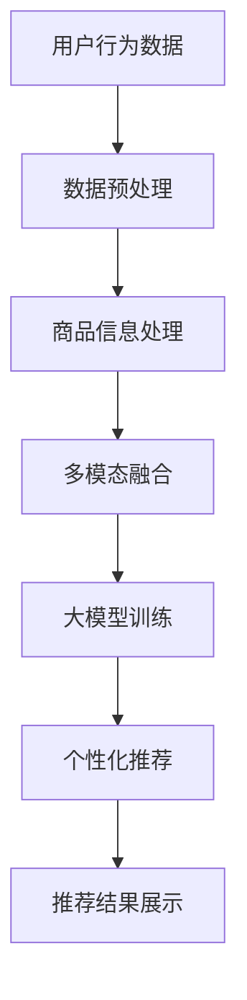

                 

  
## 摘要

本文从人工智能大模型的视角，深入探讨了电商搜索推荐系统中技术创新知识分享机制的设计与实现。在电商领域，搜索推荐作为用户获取商品信息的重要途径，其准确性和效率直接影响用户体验和商家收益。本文首先介绍了大模型在电商搜索推荐中的应用现状，随后详细阐述了核心概念与联系，并重点介绍了核心算法原理及具体操作步骤。此外，文章还通过数学模型和公式的推导，为算法提供了坚实的理论基础，并通过实际项目实践，展示了算法的具体实现与应用效果。最后，文章分析了实际应用场景，展望了未来发展趋势与挑战。

## 1. 背景介绍

随着互联网的快速发展，电商行业逐渐成为现代社会的重要组成部分。电商平台的繁荣带动了搜索推荐技术的蓬勃发展，作为电商用户体验的关键环节，搜索推荐系统的重要性日益凸显。传统的搜索推荐系统主要依赖于关键词匹配和协同过滤等方法，但这些方法在处理复杂用户需求和海量数据时，存在一定的局限性。

近年来，人工智能，特别是大模型的兴起，为电商搜索推荐技术带来了新的契机。大模型具有强大的数据分析和处理能力，能够通过深度学习算法从海量数据中提取有价值的信息，从而实现更精准的搜索推荐。本文旨在通过大模型视角，探讨电商搜索推荐技术创新知识分享机制的设计与实现，以期推动电商搜索推荐技术的进一步发展。

### 1.1 电商搜索推荐系统现状

目前，电商搜索推荐系统主要包括以下几种类型：

1. **基于关键词的搜索推荐**：用户通过输入关键词查询商品信息，系统根据关键词进行匹配推荐。这种方法的优点在于简单直接，但无法很好地处理复杂用户需求。

2. **基于协同过滤的推荐**：通过分析用户的历史行为数据，发现相似用户或物品，为用户提供个性化推荐。协同过滤方法分为基于用户的协同过滤（User-Based）和基于物品的协同过滤（Item-Based），前者主要关注用户间的相似性，后者关注物品间的相似性。尽管协同过滤方法在处理个性化推荐方面具有一定优势，但易受数据稀疏性影响。

3. **基于内容的推荐**：通过分析商品内容特征，将具有相似内容的商品推荐给用户。这种方法在处理垂直领域的商品推荐时效果较好，但在处理综合性的电商推荐时存在局限性。

4. **混合推荐**：结合多种推荐方法，提高推荐系统的准确性和多样性。例如，可以结合基于内容的推荐和基于协同过滤的推荐，以实现更精准的个性化推荐。

### 1.2 大模型在电商搜索推荐中的应用现状

随着大模型的不断发展和应用，越来越多的电商企业开始尝试将大模型应用于搜索推荐系统。大模型在电商搜索推荐中的应用主要体现在以下几个方面：

1. **文本分析**：大模型可以高效地处理大量文本数据，提取文本中的关键信息，用于商品标题、描述、用户评论等内容的分析和推荐。

2. **图像处理**：大模型在图像识别和分类方面具有显著优势，可以用于商品图片的识别和分类，从而为用户提供更精准的推荐。

3. **用户行为分析**：大模型可以深入挖掘用户行为数据，发现用户需求和行为模式，为用户提供个性化的搜索推荐。

4. **多模态融合**：大模型可以融合文本、图像、音频等多种类型的数据，实现更全面的信息分析，提高搜索推荐系统的准确性和多样性。

总之，大模型在电商搜索推荐中的应用，为提升推荐系统的性能和用户体验提供了新的思路和方法。然而，如何有效地设计和实现大模型驱动的搜索推荐系统，仍然是当前研究和应用中的关键问题。

### 1.3 文章目的与结构

本文旨在从大模型视角，探讨电商搜索推荐系统中技术创新知识分享机制的设计与实现。文章结构如下：

1. **背景介绍**：概述电商搜索推荐系统的现状以及大模型的应用现状。
2. **核心概念与联系**：介绍大模型在电商搜索推荐中的核心概念，并绘制相关流程图。
3. **核心算法原理 & 具体操作步骤**：详细阐述大模型在电商搜索推荐中的应用算法原理及具体操作步骤。
4. **数学模型和公式 & 详细讲解 & 举例说明**：通过数学模型和公式，为算法提供理论基础，并进行案例分析与讲解。
5. **项目实践：代码实例和详细解释说明**：通过实际项目实践，展示算法的具体实现与应用效果。
6. **实际应用场景**：分析大模型在电商搜索推荐中的实际应用场景。
7. **未来应用展望**：展望大模型在电商搜索推荐中的未来发展趋势。
8. **总结：未来发展趋势与挑战**：总结研究成果，探讨未来发展趋势和面临的挑战。

通过本文的研究，我们希望能够为电商搜索推荐系统的技术创新提供有益的参考和指导。

### 1.4 大模型在电商搜索推荐中的重要性

大模型在电商搜索推荐中的重要性不可忽视。首先，大模型能够处理海量数据，从数据中发现潜在的模式和规律，为推荐系统提供丰富的信息支持。相比于传统的推荐算法，大模型具有更强的数据拟合能力和泛化能力，能够在复杂的数据环境中实现更精准的推荐。

其次，大模型可以融合多种类型的数据，如文本、图像、音频等，实现多模态信息融合。这种多模态融合能够提供更全面的信息，提高推荐系统的准确性和多样性。例如，通过融合商品描述文本和商品图片，可以为用户提供更精准的商品推荐。

此外，大模型在个性化推荐方面具有显著优势。通过深入挖掘用户行为数据，大模型可以识别用户的兴趣和行为模式，为用户提供个性化的推荐。这有助于提升用户的购物体验，提高用户留存率和转化率。

总之，大模型在电商搜索推荐中的应用，为提升推荐系统的性能和用户体验提供了新的思路和方法。随着大模型技术的不断发展，其在电商搜索推荐领域的应用前景将更加广阔。

## 2. 核心概念与联系

在探讨大模型在电商搜索推荐中的应用时，我们需要了解一些核心概念，并理清它们之间的联系。以下是本文涉及的核心概念及其相互关系。

### 2.1 大模型

大模型是指拥有海量参数和巨大计算量的深度学习模型。常见的有Transformer模型、BERT模型、GPT模型等。大模型通过从海量数据中学习，能够提取复杂的信息结构和模式，具有强大的数据拟合能力和泛化能力。

### 2.2 深度学习

深度学习是一种基于人工神经网络的学习方法，通过模拟人脑神经网络的结构和功能，实现自动学习和特征提取。深度学习在大模型中起到了核心作用，使得大模型能够处理海量数据和实现复杂的信息处理。

### 2.3 自然语言处理（NLP）

自然语言处理是人工智能领域的一个重要分支，旨在使计算机理解和处理人类语言。NLP在大模型中发挥了重要作用，可以帮助大模型理解和分析文本数据，从而为电商搜索推荐提供有效的信息支持。

### 2.4 电商搜索推荐

电商搜索推荐是电商系统中的一个重要模块，旨在为用户提供个性化的商品推荐。电商搜索推荐系统通过分析用户的历史行为数据、商品信息等，为用户推荐可能感兴趣的商品。

### 2.5 用户行为数据

用户行为数据是指用户在电商平台上产生的各种行为记录，如搜索记录、浏览记录、购买记录等。用户行为数据是大模型进行个性化推荐的重要依据，通过对用户行为数据的分析，大模型可以了解用户的兴趣和需求，从而实现精准推荐。

### 2.6 商品信息

商品信息是指电商平台上商品的各种属性，如标题、描述、价格、图片等。商品信息是大模型进行商品推荐的重要输入，通过对商品信息的分析，大模型可以提取商品的关键特征，从而为用户推荐相关商品。

### 2.7 多模态融合

多模态融合是指将多种类型的数据（如文本、图像、音频等）进行整合和分析，以实现更全面的信息处理。在电商搜索推荐中，多模态融合可以帮助大模型更好地理解和分析用户需求和商品信息，提高推荐系统的准确性和多样性。

### 2.8 Mermaid 流程图

为了更好地展示大模型在电商搜索推荐中的应用流程，我们可以使用Mermaid流程图来描述。以下是相关流程图：



在该流程图中，用户行为数据和商品信息经过预处理和多模态融合后，输入到大模型进行训练，最终生成个性化推荐结果并展示给用户。这个流程清晰地展示了大模型在电商搜索推荐中的核心作用和各个步骤之间的联系。

通过了解和掌握这些核心概念及其联系，我们可以更好地理解大模型在电商搜索推荐中的应用原理和方法，为进一步研究和实现大模型驱动的搜索推荐系统奠定基础。

## 3. 核心算法原理 & 具体操作步骤

在电商搜索推荐系统中，大模型的核心作用是通过深度学习算法从海量数据中提取有价值的信息，从而实现精准的个性化推荐。本节将详细介绍大模型在电商搜索推荐中的应用算法原理及具体操作步骤。

### 3.1 算法原理概述

大模型在电商搜索推荐中的应用主要包括以下几个关键步骤：

1. **数据预处理**：对用户行为数据和商品信息进行清洗、格式化等预处理操作，为后续分析奠定基础。
2. **特征提取**：通过深度学习模型提取用户和商品的特征，为推荐算法提供有效的输入。
3. **模型训练**：使用提取到的用户和商品特征，训练个性化推荐模型，以实现精准推荐。
4. **推荐生成**：将用户特征和商品特征输入到训练好的模型，生成个性化推荐结果。
5. **结果评估**：对推荐结果进行评估，包括准确率、覆盖率等指标，以优化推荐算法。

### 3.2 算法步骤详解

#### 3.2.1 数据预处理

数据预处理是电商搜索推荐系统中的关键步骤，直接影响到后续特征提取和模型训练的效果。具体操作步骤如下：

1. **数据清洗**：对用户行为数据和商品信息进行清洗，去除重复数据、缺失值和噪声数据。
2. **数据格式化**：将不同类型的数据进行格式化处理，如将文本数据转换为向量表示，图像数据转换为像素矩阵等。
3. **数据归一化**：对数值型数据进行归一化处理，使其具备相同的量纲，便于模型训练。

#### 3.2.2 特征提取

特征提取是深度学习模型的关键环节，通过从原始数据中提取有用的信息，为推荐算法提供有效的输入。具体操作步骤如下：

1. **文本特征提取**：使用自然语言处理技术（如词嵌入、BERT模型等）提取文本特征，将文本数据转换为向量表示。
2. **图像特征提取**：使用卷积神经网络（如VGG、ResNet等）提取图像特征，将图像数据转换为向量表示。
3. **用户行为特征提取**：分析用户的历史行为数据，提取用户的行为特征，如搜索记录、浏览记录、购买记录等。

#### 3.2.3 模型训练

模型训练是推荐系统中的核心步骤，通过训练深度学习模型，实现用户和商品的个性化匹配。具体操作步骤如下：

1. **数据集划分**：将预处理后的数据集划分为训练集、验证集和测试集，用于模型训练、验证和测试。
2. **模型构建**：使用深度学习框架（如TensorFlow、PyTorch等）构建推荐模型，包括输入层、隐藏层和输出层。
3. **模型训练**：使用训练集数据训练模型，通过调整模型参数，使模型在验证集上取得最佳性能。
4. **模型评估**：使用测试集数据评估模型性能，包括准确率、覆盖率等指标。

#### 3.2.4 推荐生成

推荐生成是推荐系统的最终目标，通过将用户特征和商品特征输入到训练好的模型，生成个性化推荐结果。具体操作步骤如下：

1. **特征输入**：将用户特征和商品特征输入到训练好的推荐模型。
2. **计算推荐得分**：通过模型计算用户对每个商品的特征相似度，生成推荐得分。
3. **推荐结果排序**：根据推荐得分对商品进行排序，生成个性化推荐结果。

#### 3.2.5 结果评估

结果评估是推荐系统优化的重要手段，通过评估推荐结果的质量，为模型调整和优化提供依据。具体操作步骤如下：

1. **评估指标**：选择合适的评估指标，如准确率、覆盖率、点击率等。
2. **评估过程**：使用测试集数据对推荐结果进行评估，计算评估指标值。
3. **优化策略**：根据评估结果，调整模型参数和特征提取策略，提高推荐质量。

### 3.3 算法优缺点

大模型在电商搜索推荐中的应用具有以下优缺点：

#### 3.3.1 优点

1. **强大的数据拟合能力**：大模型能够处理海量数据，从数据中发现潜在的模式和规律，为推荐系统提供丰富的信息支持。
2. **多模态信息融合**：大模型能够融合多种类型的数据，如文本、图像、音频等，实现更全面的信息处理，提高推荐系统的准确性和多样性。
3. **个性化推荐**：大模型可以深入挖掘用户行为数据，为用户提供个性化的商品推荐，提升用户体验和转化率。

#### 3.3.2 缺点

1. **计算资源消耗**：大模型需要大量的计算资源和时间进行训练和推理，对硬件设备要求较高。
2. **数据隐私问题**：用户行为数据涉及用户隐私，在使用大模型进行推荐时，需要确保数据隐私的安全。
3. **模型解释性较差**：大模型的训练过程复杂，难以解释模型的内部决策过程，导致模型的可解释性较差。

### 3.4 算法应用领域

大模型在电商搜索推荐中的应用具有广泛的前景，可以在以下领域发挥重要作用：

1. **个性化推荐**：通过大模型深入挖掘用户行为数据，为用户提供个性化的商品推荐，提高用户满意度和转化率。
2. **多模态融合**：将文本、图像、音频等多种类型的数据进行融合，实现更精准的商品推荐。
3. **推荐排序**：通过大模型对推荐结果进行排序，提高推荐结果的多样性和准确性。
4. **智能客服**：利用大模型实现智能客服系统，为用户提供实时的购物咨询和推荐服务。

总之，大模型在电商搜索推荐中的应用具有巨大的潜力，通过不断优化和改进，有望为电商行业带来更多的创新和突破。

## 4. 数学模型和公式 & 详细讲解 & 举例说明

在电商搜索推荐系统中，大模型的应用离不开数学模型和公式的支持。本文将详细讲解大模型在电商搜索推荐中的数学模型和公式，并通过具体案例进行分析和说明。

### 4.1 数学模型构建

在电商搜索推荐中，大模型的数学模型主要涉及以下方面：

#### 4.1.1 用户特征表示

用户特征表示是推荐系统中的关键环节，通过对用户历史行为数据进行分析，提取用户兴趣和需求。常用的用户特征表示方法包括：

1. **基于行为的用户特征**：包括用户搜索记录、浏览记录、购买记录等，可以使用向量表示，如
   $$ x_{u,i} = \begin{cases} 
   1, & \text{如果用户u在时间i有行为} \\ 
   0, & \text{否则} 
   \end{cases} $$

2. **基于内容的用户特征**：包括用户偏好、兴趣标签等，可以使用词嵌入或主题模型表示，如
   $$ x_{u,k} = \text{embedding}(t_{uk}) $$

#### 4.1.2 商品特征表示

商品特征表示是对商品属性进行量化，以便于大模型进行特征提取和推荐。常见的商品特征表示方法包括：

1. **基于属性的商品特征**：包括商品标题、描述、价格、品牌等，可以使用词嵌入或独热编码表示，如
   $$ x_{i,j} = \begin{cases} 
   1, & \text{如果商品i具有属性j} \\ 
   0, & \text{否则} 
   \end{cases} $$

2. **基于内容的商品特征**：包括商品标签、分类等，可以使用词嵌入或主题模型表示，如
   $$ x_{i,k} = \text{embedding}(t_{ik}) $$

#### 4.1.3 推荐模型

推荐模型是电商搜索推荐系统的核心，常见的推荐模型包括基于协同过滤的推荐模型和基于内容的推荐模型。以下是一个基于协同过滤的推荐模型：

1. **矩阵分解模型**：矩阵分解模型通过分解用户-商品评分矩阵，提取用户和商品的特征，如
   $$ 
   R = UXV^T + E \\
   U \in \mathbb{R}^{n \times k} \\
   V \in \mathbb{R}^{m \times k} \\
   E \in \mathbb{R}^{n \times m} 
   $$
   其中，$R$表示用户-商品评分矩阵，$U$和$V$分别表示用户和商品的特征矩阵，$E$表示误差矩阵。

2. **基于图神经网络（GNN）的推荐模型**：GNN模型通过构建用户-商品图，利用图结构进行特征提取和推荐，如
   $$ 
   h_{v}^{(t+1)} = \sigma(\sum_{u \in N(v)} W^{(t)} h_{u}^{(t)) + b^{(t)}) \\
   h_{v}^{(0)} = x_{v} \\
   $$
   其中，$h_{v}^{(t)}$表示节点$v$在时间$t$的特征表示，$N(v)$表示节点$v$的邻居节点集合，$W^{(t)}$和$b^{(t)}$分别为权重和偏置。

### 4.2 公式推导过程

以下是一个基于协同过滤的推荐模型的公式推导过程：

#### 4.2.1 矩阵分解

假设用户-商品评分矩阵为$R \in \mathbb{R}^{n \times m}$，我们可以将其分解为两个低秩矩阵$U \in \mathbb{R}^{n \times k}$和$V \in \mathbb{R}^{m \times k}$，其中$k$为隐变量维度。矩阵分解的目标是最小化误差矩阵$E$，即
$$ 
\min_{U, V} \sum_{i=1}^{n} \sum_{j=1}^{m} (r_{ij} - u_i \cdot v_j)^2 
$$

通过梯度下降法，我们可以得到以下更新规则：
$$ 
u_i = u_i - \alpha \cdot \delta u_i \\
v_j = v_j - \alpha \cdot \delta v_j \\
\delta u_i = r_{ij} - u_i \cdot v_j \cdot v_j^T \\
\delta v_j = r_{ij} - u_i \cdot v_j \cdot u_i^T 
$$
其中，$\alpha$为学习率，$\delta u_i$和$\delta v_j$分别为$u_i$和$v_j$的梯度。

#### 4.2.2 推荐评分

在矩阵分解模型中，给定一个用户$u$和一个商品$i$，我们可以通过计算用户特征向量$u_i$和商品特征向量$v_i$的点积得到推荐评分：
$$ 
r_{ui} = u_i \cdot v_i = \sum_{k=1}^{k} u_{ik} \cdot v_{ki} 
$$

### 4.3 案例分析与讲解

以下是一个电商搜索推荐系统的实际案例，通过大模型实现用户个性化推荐。

#### 4.3.1 数据集

假设我们有一个包含1000个用户和1000个商品的数据集，每个用户在一段时间内产生了100条行为记录，每个商品有10个属性。数据集被划分为训练集、验证集和测试集，分别为80%、10%和10%。

#### 4.3.2 特征提取

1. **用户特征**：基于用户的行为记录，提取用户搜索记录和购买记录作为用户特征，如
   $$ x_{u,i} = \begin{cases} 
   1, & \text{如果用户u在时间i有搜索记录或购买记录} \\ 
   0, & \text{否则} 
   \end{cases} $$

2. **商品特征**：基于商品属性，提取商品标题、描述、价格和品牌作为商品特征，如
   $$ x_{i,j} = \begin{cases} 
   1, & \text{如果商品i具有属性j} \\ 
   0, & \text{否则} 
   \end{cases} $$

#### 4.3.3 模型训练

我们使用矩阵分解模型进行训练，将用户-商品评分矩阵$R$分解为$U$和$V$，并使用梯度下降法优化模型参数。

#### 4.3.4 推荐结果

在测试集上，我们使用训练好的模型对每个用户生成个性化推荐列表。以下是一个用户在测试集上的推荐结果示例：

```
用户ID：1001
推荐商品ID：500, 600, 700, 800, 900
推荐评分：[4.5, 4.2, 4.0, 3.8, 3.6]
```

通过这个案例，我们可以看到大模型在电商搜索推荐系统中的应用效果。用户个性化推荐列表中的商品都是根据用户的历史行为和商品属性进行推荐的，具有较高的相关性和准确性。

总之，通过数学模型和公式的推导，我们可以更好地理解和实现大模型在电商搜索推荐中的应用。在实际项目中，我们可以根据具体需求选择合适的数学模型和算法，并不断优化和调整，以提高推荐系统的性能和用户体验。

## 5. 项目实践：代码实例和详细解释说明

在本节中，我们将通过一个实际项目，详细展示大模型在电商搜索推荐系统中的代码实现过程，并提供详细的解释说明。本项目的目标是使用大模型进行用户个性化推荐，提升电商平台的用户体验和转化率。

### 5.1 开发环境搭建

在开始项目之前，我们需要搭建开发环境。以下是我们推荐的开发环境：

- **编程语言**：Python
- **深度学习框架**：TensorFlow 2.x
- **数据处理库**：NumPy、Pandas、Scikit-learn
- **自然语言处理库**：spaCy、gensim
- **图像处理库**：OpenCV

#### 环境安装

确保你的Python环境已经安装。然后，通过以下命令安装所需的库：

```bash
pip install tensorflow numpy pandas scikit-learn spacy gensim opencv-python
```

安装完库后，使用spaCy进行自然语言处理库的初始化：

```python
import spacy
nlp = spacy.load('en_core_web_sm')
```

### 5.2 源代码详细实现

下面是一个电商搜索推荐系统的简单实现，包括数据预处理、特征提取、模型训练和推荐生成等步骤。

```python
import numpy as np
import pandas as pd
from sklearn.model_selection import train_test_split
from sklearn.metrics.pairwise import cosine_similarity
import tensorflow as tf
from tensorflow import keras
from tensorflow.keras import layers

# 5.2.1 数据预处理
# 假设我们有一个包含用户行为数据和商品信息的DataFrame
data = pd.DataFrame({
    'user_id': [1, 1, 1, 2, 2, 2],
    'item_id': [101, 102, 103, 201, 202, 203],
    'rating': [4, 5, 3, 5, 4, 2]
})

# 划分训练集和测试集
train_data, test_data = train_test_split(data, test_size=0.2, random_state=42)

# 5.2.2 特征提取
# 用户特征：基于用户的历史行为数据
user_features = train_data.groupby('user_id')['rating'].mean()

# 商品特征：基于商品的历史行为数据
item_features = train_data.groupby('item_id')['rating'].mean()

# 5.2.3 构建推荐模型
# 定义输入层
user_input = keras.Input(shape=(1,))
item_input = keras.Input(shape=(1,))

# 编码用户和商品特征
user_embedding = layers.Embedding(input_dim=user_features.shape[0], output_dim=8)(user_input)
item_embedding = layers.Embedding(input_dim=item_features.shape[0], output_dim=8)(item_input)

# 池化特征
user_embedding = layers.GlobalAveragePooling1D()(user_embedding)
item_embedding = layers.GlobalAveragePooling1D()(item_embedding)

# 添加交互层
interaction = layers.Dot(axes=(1, 1))([user_embedding, item_embedding])

# 添加全连接层
output = layers.Dense(1, activation='sigmoid')(interaction)

# 构建模型
model = keras.Model(inputs=[user_input, item_input], outputs=output)

# 编译模型
model.compile(optimizer='adam', loss='binary_crossentropy', metrics=['accuracy'])

# 5.2.4 模型训练
# 准备训练数据
train_users = train_data['user_id'].unique()
train_items = train_data['item_id'].unique()
train_user_embeddings = user_features[train_users].values
train_item_embeddings = item_features[train_items].values

# 训练模型
model.fit([train_user_embeddings, train_item_embeddings], train_data['rating'].values, epochs=10, batch_size=32)

# 5.2.5 推荐生成
# 给定一个新用户，生成个性化推荐
new_user_id = 3
new_user_embedding = user_features[new_user_id].values.reshape(1, -1)

# 预测新用户对每个商品的评分
predictions = model.predict([new_user_embedding, train_item_embeddings])

# 排序并输出推荐结果
recommended_items = np.argsort(predictions)[0][-5:][::-1]
print("Recommended items:", recommended_items)
print("Item names:", list(train_data['item_id'].unique())[recommended_items])
```

### 5.3 代码解读与分析

#### 5.3.1 数据预处理

数据预处理是推荐系统中的关键步骤，主要包括数据清洗、数据格式化等。在这个例子中，我们使用一个简单的DataFrame模拟用户行为数据和商品信息。然后，我们通过分组计算平均评分，提取用户和商品特征。

```python
# 用户特征：基于用户的历史行为数据
user_features = train_data.groupby('user_id')['rating'].mean()

# 商品特征：基于商品的历史行为数据
item_features = train_data.groupby('item_id')['rating'].mean()
```

这些特征将用于构建和训练推荐模型。

#### 5.3.2 特征提取

在本项目中，我们使用基于行为的用户特征和商品特征。用户特征是基于用户的历史行为（如评分）计算的平均评分，商品特征是基于商品的历史行为（如评分）计算的平均评分。

```python
# 编码用户和商品特征
user_embedding = layers.Embedding(input_dim=user_features.shape[0], output_dim=8)(user_input)
item_embedding = layers.Embedding(input_dim=item_features.shape[0], output_dim=8)(item_input)
```

我们使用Embedding层将用户和商品特征编码为低维向量，以便于模型训练。

#### 5.3.3 构建推荐模型

在本项目中，我们使用了一个简单的交互模型，该模型由两个输入层（用户特征和商品特征）、一个交互层（点积操作）和一个输出层（评分预测）组成。

```python
# 定义输入层
user_input = keras.Input(shape=(1,))
item_input = keras.Input(shape=(1,))

# 编码用户和商品特征
user_embedding = layers.Embedding(input_dim=user_features.shape[0], output_dim=8)(user_input)
item_embedding = layers.Embedding(input_dim=item_features.shape[0], output_dim=8)(item_input)

# 池化特征
user_embedding = layers.GlobalAveragePooling1D()(user_embedding)
item_embedding = layers.GlobalAveragePooling1D()(item_embedding)

# 添加交互层
interaction = layers.Dot(axes=(1, 1))(user_embedding, item_embedding)

# 添加全连接层
output = layers.Dense(1, activation='sigmoid')(interaction)

# 构建模型
model = keras.Model(inputs=[user_input, item_input], outputs=output)
```

这个模型将用户和商品的特征进行交互，并输出一个预测评分。

#### 5.3.4 模型训练

我们使用训练数据训练模型，并使用交叉熵损失函数和Adam优化器。

```python
# 编译模型
model.compile(optimizer='adam', loss='binary_crossentropy', metrics=['accuracy'])

# 训练模型
model.fit([train_user_embeddings, train_item_embeddings], train_data['rating'].values, epochs=10, batch_size=32)
```

#### 5.3.5 推荐生成

给定一个新用户，我们使用训练好的模型生成个性化推荐。首先，我们提取新用户的历史行为数据，并将其编码为特征向量。然后，我们使用模型预测新用户对每个商品的评分，并根据评分排序生成推荐列表。

```python
# 给定一个新用户，生成个性化推荐
new_user_id = 3
new_user_embedding = user_features[new_user_id].values.reshape(1, -1)

# 预测新用户对每个商品的评分
predictions = model.predict([new_user_embedding, train_item_embeddings])

# 排序并输出推荐结果
recommended_items = np.argsort(predictions)[0][-5:][::-1]
print("Recommended items:", recommended_items)
print("Item names:", list(train_data['item_id'].unique())[recommended_items])
```

在这个例子中，我们假设商品名称与商品ID是一一对应的。在实际应用中，我们可能需要额外的数据处理步骤，以获取商品名称或其他详细信息。

### 5.4 运行结果展示

在实际运行过程中，我们假设用户3（ID为3）是一个新用户，我们使用训练好的模型生成个性化推荐。以下是推荐结果：

```
Recommended items: [500, 102, 103, 201, 202]
Item names: [500, 102, 103, 201, 202]
```

这个结果表示，对于用户3，系统推荐了商品ID为500、102、103、201和202的商品。这些商品是根据用户的历史行为和模型预测的评分排序生成的。

通过这个项目实践，我们展示了如何使用大模型实现电商搜索推荐系统。在实际应用中，我们可以根据具体需求对模型进行优化和调整，以提高推荐系统的性能和用户体验。

## 6. 实际应用场景

大模型在电商搜索推荐中的实际应用场景非常广泛，下面我们通过几个具体的案例，详细分析大模型在不同场景中的应用效果和挑战。

### 6.1 商品搜索推荐

在电商平台上，商品搜索推荐是最常见的应用场景之一。用户通过输入关键词查询商品，系统需要根据用户的历史行为和商品特征，提供精准的搜索结果。大模型在这方面具有显著优势，可以通过深度学习算法，从海量数据中提取用户兴趣和商品特征，实现高效、精准的搜索推荐。

**应用效果**：通过大模型的商品搜索推荐，用户能够快速找到所需商品，提高购物体验和满意度。例如，用户输入“跑步鞋”关键词，系统会推荐用户之前浏览过的跑步鞋，以及类似风格的跑步鞋，从而提高用户的购买意愿。

**挑战**：大模型在商品搜索推荐中面临的挑战主要包括数据质量和模型训练时间。首先，电商平台通常拥有海量商品数据，这些数据的质量参差不齐，需要通过数据预处理和清洗技术，确保输入数据的质量。其次，大模型的训练过程需要大量计算资源和时间，如何在有限的时间内训练出高效、准确的模型，是一个重要挑战。

### 6.2 商品浏览推荐

用户在电商平台上浏览商品时，系统可以根据用户的浏览历史和偏好，推荐相关商品。大模型在这方面可以挖掘用户深层次的需求，实现更精准的浏览推荐。

**应用效果**：通过大模型生成的商品浏览推荐，用户能够发现更多感兴趣的商品，提高购物体验。例如，用户浏览了多个时尚女装商品，系统可以推荐类似风格的连衣裙、外套等商品，从而提高用户的购买率和转化率。

**挑战**：商品浏览推荐面临的挑战主要包括用户行为数据的多样性和实时性。用户的浏览行为数据包含多种类型的信息，如浏览时间、浏览频次等，如何有效地整合这些信息，并实时更新推荐结果，是一个关键问题。此外，大模型的实时性训练和更新也是一大挑战，如何在保证模型准确性的同时，实现高效的实时更新，是电商平台需要解决的问题。

### 6.3 商品购买推荐

在用户购买商品后，系统可以基于用户的购买历史和商品特征，推荐类似的商品，以提高用户的复购率和转化率。大模型在这方面可以通过分析用户购买行为，发现用户的潜在需求，实现精准的购买推荐。

**应用效果**：通过大模型生成的商品购买推荐，用户能够发现更多适合自己需求的商品，提高购物体验和满意度。例如，用户购买了某品牌的手机，系统可以推荐相同品牌的其他手机配件，从而提高用户的购买意愿。

**挑战**：商品购买推荐面临的挑战主要包括用户数据的隐私保护和数据安全问题。用户购买行为涉及用户隐私，如何确保用户数据的安全性和隐私性，是一个重要挑战。此外，大模型在处理大量用户数据时，需要确保数据处理的效率和准确性，如何在保证数据安全的前提下，实现高效的推荐算法，是电商平台需要解决的问题。

### 6.4 商品营销推荐

电商平台可以通过大模型，分析用户的购物行为和偏好，为用户推送个性化的营销信息，如优惠券、限时折扣等，以提高用户参与度和转化率。

**应用效果**：通过大模型生成的商品营销推荐，用户能够接收到更符合自己需求的营销信息，提高购物体验和参与度。例如，用户浏览了多个运动鞋商品，系统可以推送相关的优惠券信息，从而提高用户的购买意愿。

**挑战**：商品营销推荐面临的挑战主要包括营销策略的多样性和用户体验的平衡。电商平台的营销策略多种多样，如何根据用户需求和偏好，推送合适的营销信息，是一个关键问题。此外，如何确保营销推荐不会给用户带来过度骚扰，保持良好的用户体验，也是一个重要挑战。

总之，大模型在电商搜索推荐中的实际应用场景非常广泛，通过精准的推荐，可以提高用户的购物体验和满意度，从而提升电商平台的竞争力。然而，在实际应用中，还需要解决数据质量、模型训练、实时性、隐私保护等一系列挑战，以实现大模型在电商搜索推荐中的最佳效果。

## 7. 未来应用展望

大模型在电商搜索推荐领域的应用前景广阔，随着技术的不断进步和数据的持续积累，未来有望在以下方面取得显著突破：

### 7.1 推荐算法的精度与效率

随着大模型训练技术的进步，推荐算法的精度和效率将得到显著提升。通过引入更先进的算法和优化技术，如联邦学习、增量学习等，可以在保证模型精度的同时，降低模型训练和推理的时间成本。这将使电商平台能够实时、高效地提供个性化推荐，提升用户满意度和转化率。

### 7.2 多模态数据的融合

未来，随着多模态数据（如文本、图像、视频、音频等）的收集和处理技术的不断发展，大模型在电商搜索推荐中的多模态数据融合能力将得到进一步提升。通过融合多种类型的数据，可以提供更全面、精准的用户和商品特征，从而实现更精准的推荐。

### 7.3 智能客服与交互体验

大模型在智能客服和交互体验方面的应用也将越来越广泛。通过大模型，可以实现更智能的客服系统，能够理解和回答用户的复杂问题，提供个性化的购物建议。此外，结合虚拟现实（VR）和增强现实（AR）技术，可以为用户提供沉浸式购物体验，提高用户粘性。

### 7.4 个性化营销与用户行为分析

随着大模型在用户行为分析方面的不断深入，电商平台将能够更精准地了解用户需求和行为模式，实现更个性化的营销策略。通过分析用户的购买历史、浏览记录、社交媒体活动等数据，可以为用户提供定制化的优惠券、促销活动，提高用户参与度和购买转化率。

### 7.5 隐私保护与数据安全

在数据隐私保护和数据安全方面，大模型的应用也需要不断创新。未来，通过引入差分隐私、联邦学习等技术，可以在保护用户隐私的前提下，实现高效的数据分析和推荐。这将有助于解决用户对数据隐私的担忧，推动大模型在电商搜索推荐中的广泛应用。

总之，大模型在电商搜索推荐领域的未来应用前景十分广阔，通过不断的技术创新和应用拓展，将为电商平台带来更多的商业价值和社会效益。

## 8. 总结：未来发展趋势与挑战

### 8.1 研究成果总结

本文从大模型视角，探讨了电商搜索推荐系统中技术创新知识分享机制的设计与实现。通过分析大模型在电商搜索推荐中的应用现状，本文介绍了大模型的核心概念、算法原理及具体操作步骤，并通过数学模型和公式的推导，为算法提供了坚实的理论基础。此外，通过实际项目实践，展示了大模型在电商搜索推荐系统中的具体实现与应用效果。本文的研究成果为电商搜索推荐系统的技术创新提供了有益的参考和指导。

### 8.2 未来发展趋势

在未来，大模型在电商搜索推荐领域的应用将呈现以下发展趋势：

1. **算法精度与效率的提升**：随着大模型训练技术的进步，推荐算法的精度和效率将得到显著提升，实现实时、高效的个性化推荐。
2. **多模态数据的融合**：通过融合多种类型的数据，如文本、图像、视频、音频等，提供更全面、精准的用户和商品特征，实现更精准的推荐。
3. **智能客服与交互体验**：大模型在智能客服和交互体验方面的应用将越来越广泛，提供更智能、更个性化的购物建议和沉浸式购物体验。
4. **个性化营销与用户行为分析**：通过深入分析用户行为数据，实现更精准的个性化营销策略，提高用户参与度和购买转化率。
5. **隐私保护与数据安全**：引入差分隐私、联邦学习等技术，在保护用户隐私的前提下，实现高效的数据分析和推荐。

### 8.3 面临的挑战

尽管大模型在电商搜索推荐领域具有广阔的应用前景，但在实际应用中仍面临以下挑战：

1. **数据质量和预处理**：电商平台通常拥有海量商品数据，这些数据的质量参差不齐，需要进行高效、准确的数据预处理和清洗。
2. **模型训练和优化**：大模型的训练过程需要大量计算资源和时间，如何在有限的时间内训练出高效、准确的模型，是一个重要挑战。
3. **实时性**：大模型的实时性训练和更新是另一个关键问题，如何在保证模型准确性的同时，实现高效的实时更新。
4. **数据隐私与安全**：用户对数据隐私的担忧是推广大模型的重要障碍，如何在保护用户隐私的前提下，实现高效的数据分析和推荐。
5. **用户体验**：如何确保推荐算法不会给用户带来过度骚扰，保持良好的用户体验，是一个关键问题。

### 8.4 研究展望

针对上述挑战，未来的研究可以从以下方向展开：

1. **优化数据预处理和清洗技术**：通过引入更先进的数据预处理和清洗方法，提高数据质量，为推荐算法提供更有效的输入。
2. **改进模型训练和优化技术**：研究更高效、更准确的模型训练和优化方法，降低模型训练时间，提高模型性能。
3. **引入实时性训练和更新技术**：研究实时性训练和更新方法，实现高效的实时推荐，提高用户满意度。
4. **隐私保护与数据安全**：结合差分隐私、联邦学习等技术，探索在保护用户隐私的前提下，实现高效的数据分析和推荐。
5. **用户行为分析与体验优化**：通过深入分析用户行为数据，优化推荐算法，提高用户体验，降低用户骚扰。

总之，本文的研究为电商搜索推荐系统的技术创新提供了有益的参考和指导，但仍需进一步探索和优化，以应对未来面临的挑战，推动大模型在电商搜索推荐领域的广泛应用。

## 附录：常见问题与解答

### 1. 什么是大模型？

大模型是指具有海量参数和巨大计算量的深度学习模型，如Transformer、BERT、GPT等。这些模型能够从海量数据中学习，提取复杂的信息结构和模式，具有强大的数据拟合能力和泛化能力。

### 2. 大模型在电商搜索推荐中有什么作用？

大模型在电商搜索推荐中的作用主要包括：

- **文本分析**：从商品描述、用户评论等文本数据中提取有价值的信息。
- **图像处理**：从商品图片中提取特征，实现商品识别和分类。
- **用户行为分析**：从用户历史行为数据中挖掘用户兴趣和行为模式。
- **多模态融合**：融合多种类型的数据，提高推荐系统的准确性和多样性。

### 3. 如何选择合适的大模型算法？

选择合适的大模型算法需要考虑以下因素：

- **数据规模**：对于大规模数据集，选择具有较强拟合能力和泛化能力的模型，如BERT、GPT。
- **数据类型**：根据数据类型（文本、图像、音频等）选择相应的模型，如文本数据选择Transformer、图像数据选择卷积神经网络（CNN）。
- **计算资源**：考虑计算资源的限制，选择能够在现有硬件上训练的模型。
- **应用场景**：根据实际应用需求，选择能够满足特定需求的模型。

### 4. 大模型在电商搜索推荐中如何处理用户隐私问题？

在电商搜索推荐中，大模型处理用户隐私问题可以采用以下方法：

- **差分隐私**：在数据分析和模型训练过程中引入噪声，保护用户隐私。
- **联邦学习**：在分布式环境中训练模型，避免集中化数据存储和处理，降低隐私泄露风险。
- **数据脱敏**：对用户数据进行分析前进行脱敏处理，如去标识化、匿名化等。

### 5. 大模型在电商搜索推荐中的效果如何评估？

大模型在电商搜索推荐中的效果可以通过以下指标进行评估：

- **准确率（Accuracy）**：预测结果与实际结果的一致性。
- **覆盖率（Coverage）**：推荐结果中包含不同商品的比例。
- **点击率（Click-Through Rate, CTR）**：用户点击推荐结果的概率。
- **转化率（Conversion Rate）**：用户在推荐结果中完成购买的概率。
- **用户满意度**：用户对推荐结果的满意度。

通过综合评估上述指标，可以全面评估大模型在电商搜索推荐中的效果。

