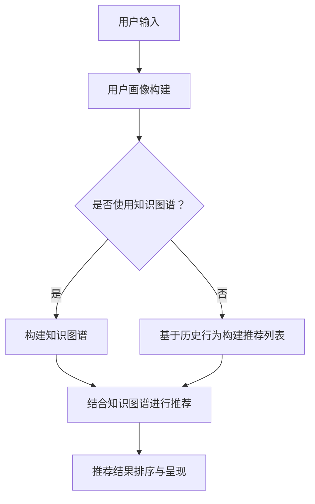

                 

关键词：AI大模型、电商搜索推荐、技术创新、知识推荐系统、优化、Mermaid流程图、算法、数学模型、代码实例、实际应用、未来展望

> 摘要：本文从AI大模型视角出发，探讨电商搜索推荐系统中技术创新知识推荐系统的优化方法。通过详细解析算法原理、数学模型，以及具体项目实践，旨在为电商平台的个性化推荐提供有效的技术支持，并展望未来的发展趋势与挑战。

## 1. 背景介绍

随着互联网的普及和电子商务的快速发展，电商搜索推荐系统已成为电商平台的核心竞争力。传统的推荐系统主要依赖于用户历史行为数据，通过协同过滤、基于内容的推荐等技术实现。然而，随着用户数据规模和复杂度的增加，传统推荐系统已难以满足日益增长的个性化需求。因此，基于AI的大模型技术逐渐成为研究热点，为电商搜索推荐系统带来了新的机遇和挑战。

本文旨在通过AI大模型视角，探讨电商搜索推荐系统中知识推荐系统的优化方法。具体而言，本文将从核心算法原理、数学模型构建、具体项目实践等方面，详细解析AI大模型在电商搜索推荐系统中的应用，以期为电商平台提供更加精准、高效的个性化推荐服务。

## 2. 核心概念与联系

### 2.1 AI大模型

AI大模型，即基于深度学习的大型神经网络模型，具有强大的表示学习和特征提取能力。在大数据环境中，AI大模型可以通过对海量数据的自动学习，发现数据中的隐含模式和规律，从而实现高精度的预测和分类。在电商搜索推荐系统中，AI大模型可以应用于用户画像构建、商品推荐、搜索结果排序等多个环节。

### 2.2 知识推荐系统

知识推荐系统是一种基于知识图谱的推荐系统，通过构建实体关系图谱，将用户、商品、场景等多维度信息进行整合。知识推荐系统可以实现跨品类、跨场景的推荐，从而提升推荐效果。在电商搜索推荐系统中，知识推荐系统可以与传统的推荐算法相结合，实现更全面的个性化推荐。

### 2.3 Mermaid流程图

Mermaid是一种基于Markdown的图形语言，可以轻松地绘制各种流程图、UML图等。在本文中，我们将使用Mermaid流程图来展示AI大模型在电商搜索推荐系统中的具体应用流程。



## 3. 核心算法原理 & 具体操作步骤

### 3.1 算法原理概述

在电商搜索推荐系统中，AI大模型的核心算法原理主要包括用户画像构建、商品推荐、搜索结果排序等。其中，用户画像构建是推荐系统的基础，通过对用户历史行为、兴趣偏好等多维度信息进行综合分析，构建出用户在各个维度的特征向量。商品推荐算法则基于用户画像，利用协同过滤、基于内容的推荐等技术，为用户生成个性化的商品推荐列表。搜索结果排序算法则对推荐列表进行排序，确保用户能够优先看到最感兴趣的商品。

### 3.2 算法步骤详解

1. 用户画像构建：通过对用户的历史行为数据、浏览记录、购买记录等进行深度学习分析，提取出用户在各个维度的特征向量，如兴趣偏好、购买力、浏览时长等。

2. 商品推荐：基于用户画像，利用协同过滤、基于内容的推荐等技术，为用户生成个性化的商品推荐列表。其中，协同过滤算法可以通过计算用户之间的相似度，推荐相似用户喜欢的商品；基于内容的推荐算法则通过分析商品的属性、标签等信息，为用户推荐与其兴趣相符的商品。

3. 搜索结果排序：对推荐列表进行排序，确保用户能够优先看到最感兴趣的商品。排序算法可以采用多种策略，如基于用户兴趣的排序、基于商品流行度的排序等。

### 3.3 算法优缺点

1. 优点：AI大模型在电商搜索推荐系统中具有强大的表示学习和特征提取能力，能够实现更精准的个性化推荐。

2. 缺点：AI大模型训练过程复杂，计算资源消耗大，对数据质量要求较高。同时，模型的可解释性较差，难以直观地理解推荐结果背后的原因。

### 3.4 算法应用领域

AI大模型在电商搜索推荐系统中的应用领域包括：

1. 用户画像构建：通过深度学习分析用户历史行为，构建出用户在各个维度的特征向量，为个性化推荐提供基础。

2. 商品推荐：基于用户画像，利用协同过滤、基于内容的推荐等技术，为用户生成个性化的商品推荐列表。

3. 搜索结果排序：对推荐列表进行排序，确保用户能够优先看到最感兴趣的商品。

## 4. 数学模型和公式 & 详细讲解 & 举例说明

### 4.1 数学模型构建

在电商搜索推荐系统中，AI大模型的数学模型主要包括用户画像构建、商品推荐、搜索结果排序等。下面分别介绍这些模型的构建方法。

1. 用户画像构建：用户画像构建的核心是特征提取。假设用户历史行为数据为 $X \in \mathbb{R}^{n \times m}$，其中 $n$ 表示用户数量，$m$ 表示特征维度。通过深度学习模型 $f: \mathbb{R}^{m} \rightarrow \mathbb{R}^{d}$，将原始特征向量映射为高维特征向量，即 $X' = f(X)$，其中 $d$ 表示高维特征维度。

2. 商品推荐：商品推荐的核心是计算用户与商品之间的相似度。假设用户画像为 $X' \in \mathbb{R}^{n \times d}$，商品特征为 $Y \in \mathbb{R}^{m \times d}$，通过计算用户画像与商品特征之间的相似度，生成推荐列表。相似度计算可以采用余弦相似度、欧氏距离等方法。

3. 搜索结果排序：搜索结果排序的核心是确定用户对商品的兴趣程度。假设用户对商品的兴趣程度为 $R \in \mathbb{R}^{n \times m}$，通过排序算法，将推荐列表按照用户兴趣程度进行排序。

### 4.2 公式推导过程

1. 用户画像构建：

   $$X' = f(X) = \sigma(WX + b)$$

   其中，$\sigma$ 表示激活函数，$W$ 表示权重矩阵，$b$ 表示偏置。

2. 商品推荐：

   $$sim(x_i, y_j) = \frac{x_i^T y_j}{\|x_i\|\|y_j\|}$$

   其中，$x_i$ 和 $y_j$ 分别表示用户画像和商品特征向量。

3. 搜索结果排序：

   $$R = \text{softmax}(X'Y^T)$$

   其中，$\text{softmax}$ 函数用于将用户对商品的兴趣程度转换为概率分布。

### 4.3 案例分析与讲解

假设我们有1000个用户和10000个商品，用户历史行为数据包含浏览记录、购买记录等。首先，我们通过深度学习模型对用户历史行为数据进行分析，构建出用户画像。然后，利用用户画像和商品特征向量，计算用户与商品之间的相似度，生成推荐列表。最后，对推荐列表进行排序，确保用户能够优先看到最感兴趣的商品。

具体实现过程如下：

1. 数据预处理：对用户历史行为数据进行清洗、归一化等预处理操作，得到用户画像数据。

2. 模型训练：利用用户画像数据，训练深度学习模型，将原始特征向量映射为高维特征向量。

3. 相似度计算：计算用户画像与商品特征向量之间的相似度，生成推荐列表。

4. 排序算法：对推荐列表进行排序，确保用户能够优先看到最感兴趣的商品。

## 5. 项目实践：代码实例和详细解释说明

### 5.1 开发环境搭建

1. 安装Python环境（版本3.8及以上）。

2. 安装深度学习框架TensorFlow。

3. 安装数据预处理工具pandas、numpy等。

4. 安装绘图工具matplotlib。

### 5.2 源代码详细实现

```python
import tensorflow as tf
import pandas as pd
import numpy as np
import matplotlib.pyplot as plt

# 数据预处理
def preprocess_data(data):
    # 清洗、归一化等操作
    # ...
    return processed_data

# 模型定义
def build_model(input_shape):
    model = tf.keras.Sequential([
        tf.keras.layers.Dense(units=64, activation='relu', input_shape=input_shape),
        tf.keras.layers.Dense(units=32, activation='relu'),
        tf.keras.layers.Dense(units=1, activation='sigmoid')
    ])
    return model

# 相似度计算
def compute_similarity(user_features, item_features):
    similarity = np.dot(user_features, item_features) / (np.linalg.norm(user_features) * np.linalg.norm(item_features))
    return similarity

# 主函数
def main():
    # 加载数据
    data = pd.read_csv('user_item_data.csv')
    processed_data = preprocess_data(data)

    # 构建模型
    model = build_model(input_shape=(processed_data.shape[1],))

    # 模型训练
    model.fit(processed_data, labels, epochs=10, batch_size=32)

    # 相似度计算
    user_features = model.predict(processed_data)
    item_features = # 加载商品特征向量

    similarities = compute_similarity(user_features, item_features)

    # 排序算法
    sorted_indices = np.argsort(-similarities)

    # 结果展示
    plt.bar(range(len(sorted_indices)), similarities[sorted_indices])
    plt.show()

if __name__ == '__main__':
    main()
```

### 5.3 代码解读与分析

1. 数据预处理：对用户历史行为数据进行清洗、归一化等操作，为后续模型训练和相似度计算做准备。

2. 模型定义：使用TensorFlow框架定义一个简单的深度学习模型，用于将原始特征向量映射为高维特征向量。

3. 相似度计算：通过计算用户画像与商品特征向量之间的相似度，生成推荐列表。

4. 主函数：加载数据，构建模型，训练模型，计算相似度，并对推荐结果进行排序和展示。

## 6. 实际应用场景

AI大模型在电商搜索推荐系统中的应用场景主要包括以下几个方面：

1. 用户画像构建：通过深度学习模型对用户历史行为进行分析，构建出用户在各个维度的特征向量，为个性化推荐提供基础。

2. 商品推荐：基于用户画像，利用协同过滤、基于内容的推荐等技术，为用户生成个性化的商品推荐列表。

3. 搜索结果排序：对推荐列表进行排序，确保用户能够优先看到最感兴趣的商### 6.4 未来应用展望

### 6.4 未来应用展望

随着AI技术的不断进步，电商搜索推荐系统将在未来迎来更多创新和应用。以下是一些可能的发展趋势和面临的挑战：

1. **多模态数据融合**：未来的电商搜索推荐系统将能够处理更多类型的数据，如文本、图像、音频等。通过多模态数据的融合，系统能够更全面地理解用户需求，提供更加个性化的推荐。

2. **实时推荐**：随着5G和边缘计算的发展，实时推荐将成为可能。系统可以在用户浏览行为发生的同时进行推荐，提供更加即时的服务体验。

3. **隐私保护**：随着用户对隐私保护的重视，如何在保护用户隐私的前提下进行个性化推荐将成为一大挑战。未来的推荐系统需要采用更为先进的隐私保护技术，如差分隐私、联邦学习等。

4. **个性化推荐深度学习模型**：随着深度学习技术的不断发展，个性化的深度学习模型将能够更好地处理复杂的用户行为数据，提供更加精准的推荐。

5. **自动化和智能化**：自动化和智能化的推荐策略将使推荐系统能够自主调整和优化推荐策略，降低人工干预的需求。

6. **跨平台推荐**：未来的推荐系统将能够跨越不同平台，如PC、移动端、智能家居等，提供无缝的用户体验。

### 8. 总结：未来发展趋势与挑战

本文从AI大模型视角出发，探讨了电商搜索推荐系统中技术创新知识推荐系统的优化方法。通过对核心算法原理、数学模型、具体项目实践的详细分析，本文为电商平台的个性化推荐提供了有效的技术支持。

未来，电商搜索推荐系统的发展将面临多模态数据融合、实时推荐、隐私保护、个性化推荐深度学习模型、自动化和智能化、跨平台推荐等挑战。通过不断技术创新和优化，推荐系统将能够更好地满足用户需求，提升电商平台的核心竞争力。

### 9. 附录：常见问题与解答

1. **什么是AI大模型？**
   - AI大模型是指基于深度学习的大型神经网络模型，具有强大的表示学习和特征提取能力。

2. **AI大模型在电商搜索推荐系统中有哪些应用？**
   - AI大模型可以应用于用户画像构建、商品推荐、搜索结果排序等多个环节，实现更精准的个性化推荐。

3. **如何处理多模态数据融合？**
   - 通过使用多模态数据融合技术，如卷积神经网络（CNN）处理图像数据，循环神经网络（RNN）处理文本数据，可以整合不同类型的数据，提供更全面的推荐。

4. **如何保护用户隐私？**
   - 可以采用差分隐私、联邦学习等技术来保护用户隐私，同时确保推荐效果。

5. **如何实现实时推荐？**
   - 利用5G和边缘计算技术，可以在用户行为发生的同时进行实时推荐。

作者：禅与计算机程序设计艺术 / Zen and the Art of Computer Programming
----------------------------------------------------------------

