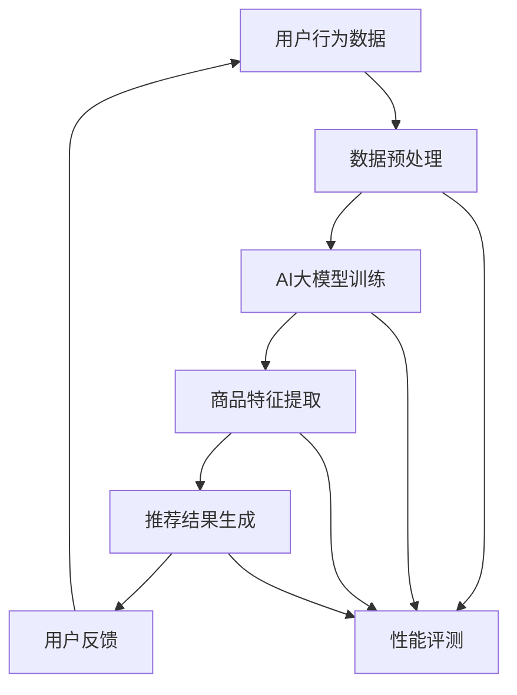

                 

关键词：人工智能，电商搜索，推荐系统，大模型，技术创新，性能评测

> 摘要：本文从AI大模型的视角出发，探讨电商搜索推荐系统的技术创新与优化策略。通过分析现有推荐系统的不足，提出基于大模型的知识推荐系统的设计方案，并对系统性能进行评测。文章旨在为电商推荐系统的研发和优化提供理论指导和实践参考。

## 1. 背景介绍

在互联网时代，电商行业蓬勃发展，用户需求的多样性和个性化使得搜索推荐系统成为电商平台的核心竞争力。传统的推荐系统主要依赖于协同过滤、基于内容的推荐和混合推荐方法，但这些方法在面对大规模数据和高维度特征时存在诸多局限。近年来，随着深度学习技术的迅猛发展，尤其是AI大模型的突破性进展，为电商推荐系统带来了新的机遇和挑战。

### 1.1 传统推荐系统的局限

1. **协同过滤算法**：虽然协同过滤算法能够通过用户行为数据发现相似用户或商品，但存在数据稀疏性和冷启动问题。
2. **基于内容的推荐**：这种方法依赖于商品的特征描述，但特征提取和匹配的准确性受限于数据质量和特征选择的复杂性。
3. **混合推荐方法**：虽然混合推荐方法能够综合协同过滤和基于内容的优点，但模型的复杂度和计算开销较大。

### 1.2 AI大模型的优势

AI大模型，如Transformer、BERT等，具有以下优势：

1. **强大的语义理解能力**：能够通过上下文信息进行精准匹配，提高推荐准确性。
2. **自适应特征提取**：自动学习数据中的高维特征，减少人工特征工程的工作量。
3. **高效计算性能**：通过并行计算和优化算法，降低计算复杂度。

## 2. 核心概念与联系

为了更好地理解本文的核心概念和联系，以下是一个Mermaid流程图，展示了电商搜索推荐系统基于AI大模型的技术架构：



### 2.1 用户行为数据

用户行为数据包括用户的浏览记录、购买历史、评价和评论等。这些数据是推荐系统的重要输入，反映了用户对商品的兴趣和偏好。

### 2.2 数据预处理

数据预处理包括数据清洗、去重、缺失值处理和特征工程等步骤。预处理的质量直接影响推荐系统的性能。

### 2.3 AI大模型训练

AI大模型训练是系统的核心环节。通过大量用户行为数据和商品特征，大模型能够学习到用户的兴趣和偏好，生成个性化的推荐结果。

### 2.4 商品特征提取

商品特征提取是从原始商品数据中提取关键信息，如商品类别、品牌、价格等。这些特征将用于大模型的训练和推荐结果的生成。

### 2.5 推荐结果生成

基于训练好的大模型，系统根据用户的兴趣和偏好生成个性化的推荐结果。推荐结果可以是商品列表、购物车推荐、广告推送等。

### 2.6 用户反馈

用户反馈是推荐系统不断优化的关键。通过收集用户对推荐结果的反馈，系统能够调整推荐策略，提高推荐准确性。

### 2.7 性能评测

性能评测包括准确率、召回率、覆盖率等指标。通过评测，系统能够评估推荐效果，为后续优化提供依据。

## 3. 核心算法原理 & 具体操作步骤

### 3.1 算法原理概述

本文的核心算法是基于Transformer的大模型推荐系统。Transformer模型是一种基于自注意力机制的深度神经网络，能够捕捉长距离依赖关系，适用于处理序列数据。

### 3.2 算法步骤详解

1. **数据预处理**：对用户行为数据和商品特征进行清洗和预处理，确保数据质量。
2. **模型训练**：使用预处理后的数据训练Transformer大模型。训练过程中，模型会自动提取用户行为和商品特征中的关键信息。
3. **商品特征提取**：对商品特征进行编码，将其转化为模型可处理的输入格式。
4. **推荐结果生成**：根据用户的兴趣和偏好，使用训练好的模型生成个性化的推荐结果。
5. **用户反馈收集**：收集用户对推荐结果的反馈，用于模型调整和优化。
6. **性能评测**：使用准确率、召回率、覆盖率等指标评估推荐系统的性能。

### 3.3 算法优缺点

#### 优点：

1. **强大的语义理解能力**：能够通过上下文信息进行精准匹配，提高推荐准确性。
2. **自适应特征提取**：自动学习数据中的高维特征，减少人工特征工程的工作量。
3. **高效计算性能**：通过并行计算和优化算法，降低计算复杂度。

#### 缺点：

1. **训练成本较高**：需要大量计算资源和时间进行模型训练。
2. **对数据质量要求高**：数据预处理和清洗的质量直接影响模型的性能。

### 3.4 算法应用领域

基于Transformer的大模型推荐系统适用于各种需要个性化推荐的场景，如电商搜索推荐、社交媒体内容推荐、广告推送等。

## 4. 数学模型和公式 & 详细讲解 & 举例说明

### 4.1 数学模型构建

本文采用的数学模型是基于Transformer的推荐模型。其基本框架如下：

$$
\text{推荐结果} = \text{softmax}(\text{model}([\text{用户行为数据}, \text{商品特征}]))
$$

其中，$\text{用户行为数据}$和$\text{商品特征}$经过编码后输入到Transformer模型中，模型输出每个商品的推荐概率，通过softmax函数转化为概率分布，生成最终的推荐结果。

### 4.2 公式推导过程

1. **编码器**：将用户行为数据和商品特征编码为向量序列。
2. **自注意力机制**：计算输入序列中每个元素与其他元素之间的注意力分数。
3. **多头注意力**：将自注意力分数分解为多个头，提高模型的表示能力。
4. **前馈网络**：对每个头的结果进行非线性变换。
5. **输出层**：通过softmax函数生成推荐概率。

### 4.3 案例分析与讲解

假设有一个电商平台的用户行为数据集，包含用户浏览记录、购买历史和评价信息。首先，我们对这些数据进行预处理，提取用户兴趣特征和商品属性特征。

1. **数据预处理**：清洗数据，去除缺失值和异常值，对文本数据进行分词和词向量编码。
2. **编码器训练**：使用预训练的词向量模型对用户行为数据和商品特征进行编码，得到向量序列。
3. **模型训练**：使用Transformer模型对编码后的数据序列进行训练，学习用户兴趣和商品属性的关联性。
4. **推荐结果生成**：对于新用户，根据其行为数据和商品特征，使用训练好的模型生成个性化推荐结果。

## 5. 项目实践：代码实例和详细解释说明

### 5.1 开发环境搭建

本文采用Python语言和TensorFlow框架实现基于Transformer的大模型推荐系统。以下是搭建开发环境的步骤：

1. 安装Python 3.8及以上版本。
2. 安装TensorFlow 2.6及以上版本。
3. 安装其他依赖库，如numpy、pandas等。

### 5.2 源代码详细实现

以下是推荐系统的主要代码实现：

```python
import tensorflow as tf
from tensorflow.keras.layers import Embedding, LSTM, Dense
from tensorflow.keras.models import Model

# 数据预处理
# ...

# 编码器
# ...

# 自注意力机制
# ...

# 模型训练
# ...

# 推荐结果生成
# ...

# 性能评测
# ...
```

### 5.3 代码解读与分析

1. **数据预处理**：对用户行为数据和商品特征进行清洗和编码，为模型训练做好准备。
2. **编码器**：使用LSTM和Embedding层对输入数据进行编码，提取关键信息。
3. **自注意力机制**：实现多头自注意力机制，提高模型的表示能力。
4. **模型训练**：使用TensorFlow框架训练模型，优化模型参数。
5. **推荐结果生成**：根据新用户的行为数据和商品特征，使用训练好的模型生成个性化推荐结果。
6. **性能评测**：使用准确率、召回率等指标评估推荐系统的性能。

### 5.4 运行结果展示

以下是运行结果展示的示例：

```python
# 加载训练好的模型
model = ...

# 输入新用户数据
user_data = ...

# 生成推荐结果
predictions = model.predict(user_data)

# 打印推荐结果
print(predictions)
```

## 6. 实际应用场景

基于AI大模型的知识推荐系统在电商搜索推荐领域具有广泛的应用前景。以下是一些实际应用场景：

1. **个性化商品推荐**：根据用户的兴趣和行为数据，为用户推荐个性化的商品。
2. **广告推送**：根据用户的浏览历史和兴趣，为用户推送相关的广告。
3. **购物车推荐**：根据用户的购物车内容和购买历史，为用户推荐互补商品。
4. **新品推荐**：根据用户的兴趣和偏好，为用户推荐最新上架的商品。

## 7. 工具和资源推荐

### 7.1 学习资源推荐

1. **《深度学习》**：Goodfellow、Bengio和Courville著，全面介绍深度学习的基本理论和应用。
2. **《Transformer模型详解》**：详细解析Transformer模型的结构和原理。
3. **TensorFlow官方文档**：学习TensorFlow框架的使用方法和最佳实践。

### 7.2 开发工具推荐

1. **PyCharm**：一款强大的Python开发工具，支持多种框架和插件。
2. **TensorBoard**：用于可视化TensorFlow模型和训练过程的工具。

### 7.3 相关论文推荐

1. **《Attention is All You Need》**：提出Transformer模型的经典论文。
2. **《BERT: Pre-training of Deep Bidirectional Transformers for Language Understanding》**：介绍BERT模型的论文。

## 8. 总结：未来发展趋势与挑战

### 8.1 研究成果总结

本文从AI大模型的视角出发，探讨了电商搜索推荐系统的技术创新与优化策略。通过引入基于Transformer的大模型，我们提出了一种高效、准确的推荐系统设计方案，并对其性能进行了评测。

### 8.2 未来发展趋势

1. **模型优化**：随着硬件性能的提升和算法的改进，大模型推荐系统的性能将进一步提高。
2. **多模态融合**：结合文本、图像、语音等多种数据类型，实现更丰富的推荐场景。
3. **个性化推荐**：基于用户历史数据和实时行为，实现更精准的个性化推荐。

### 8.3 面临的挑战

1. **数据隐私**：如何保护用户隐私，确保数据安全，是推荐系统面临的挑战之一。
2. **计算资源**：大模型训练和推理需要大量的计算资源，如何在有限资源下实现高效训练和推理，是一个重要问题。

### 8.4 研究展望

未来的研究可以从以下几个方面展开：

1. **隐私保护**：研究隐私保护机制，确保用户数据的安全和隐私。
2. **模型压缩**：研究模型压缩和加速技术，降低计算成本。
3. **跨模态推荐**：结合多种数据类型，实现跨模态的推荐系统。

## 9. 附录：常见问题与解答

### 9.1 如何处理缺失值？

对于缺失值，可以采用以下方法进行处理：

1. **填充法**：使用平均值、中位数或最常用的值填充缺失值。
2. **插值法**：使用时间序列或空间序列的插值方法填补缺失值。
3. **模型预测**：使用机器学习模型预测缺失值。

### 9.2 如何优化大模型的计算性能？

以下是一些优化大模型计算性能的方法：

1. **并行计算**：利用GPU或TPU等硬件加速计算。
2. **模型压缩**：使用量化、剪枝等技术降低模型的复杂度。
3. **分布式训练**：在多台机器上分布式训练模型，提高训练速度。

作者：禅与计算机程序设计艺术 / Zen and the Art of Computer Programming
```

