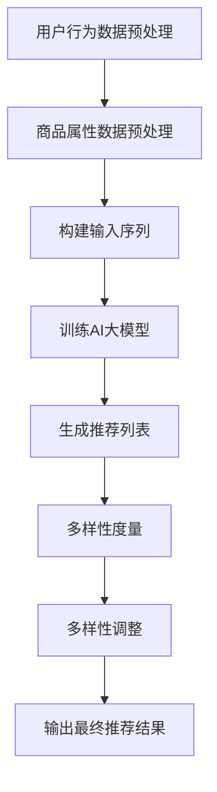

                 

关键词：AI大模型，电商搜索，推荐系统，多样性提升，算法优化，数学模型，应用实践，未来展望

> 摘要：本文深入探讨了AI大模型在电商搜索推荐中的多样性提升策略。首先，我们对AI大模型及其在电商搜索推荐中的重要作用进行了背景介绍。然后，详细解析了核心概念与联系，包括算法原理、操作步骤、优缺点及应用领域。接下来，我们通过数学模型和公式的推导与案例分析，阐述了算法的具体应用。随后，通过实际项目实践的代码实例，展示了如何实现多样性提升策略。文章还探讨了实际应用场景，以及未来的发展趋势与挑战。最后，我们对本文进行了总结，并提供了相关的学习资源、开发工具和相关论文推荐。

## 1. 背景介绍

### 1.1 电商搜索推荐的重要性

在当今数字化时代，电商平台的搜索推荐系统已成为用户体验的核心。一个有效的推荐系统能够为用户精准地推荐他们可能感兴趣的商品，从而提高用户满意度、提升转化率和销售额。然而，单一维度的推荐策略往往会导致用户界面中的商品多样性不足，导致用户感到乏味和不满。

### 1.2 AI大模型的发展与应用

近年来，随着人工智能技术的飞速发展，尤其是深度学习和大数据分析的广泛应用，AI大模型逐渐成为解决复杂推荐问题的关键。AI大模型，如BERT、GPT等，具有强大的语义理解能力和模型表达能力，能够在海量的商品数据和用户行为数据中捕捉到潜在的用户兴趣和商品特性，从而为推荐系统的多样性提升提供了有力的技术支持。

### 1.3 多样性提升的重要性

多样性是推荐系统成功的关键之一。当用户在浏览商品时，如果遇到重复性高的推荐，会感到无聊和失望，从而影响用户留存率和转化率。通过引入多样性提升策略，电商搜索推荐系统能够为用户提供更加丰富和个性化的商品推荐，提高用户体验和满意度。

## 2. 核心概念与联系

为了深入理解AI大模型在电商搜索推荐中的多样性提升策略，我们首先需要介绍一些核心概念和联系。

### 2.1 AI大模型原理

AI大模型，特别是基于变换器（Transformer）架构的模型，如BERT、GPT，通过自注意力机制（Self-Attention Mechanism）能够捕捉输入序列中的长距离依赖关系。在电商搜索推荐中，这些模型可以处理用户的历史行为数据和商品属性数据，从而生成个性化的推荐结果。

### 2.2 多样性度量

多样性度量是评估推荐系统多样性水平的关键。常见的多样性度量方法包括基于商品多样性（Item Diversity）和基于用户多样性（User Diversity）的方法。商品多样性关注推荐列表中不同商品的比例，而用户多样性则关注推荐列表中不同用户兴趣的比例。

### 2.3 多样性提升算法

多样性提升算法的核心目标是在保证推荐准确性的同时，提高推荐列表的多样性。常见的多样性提升算法包括基于排序的多样性增强算法（如插值排序、多样性加权排序）和基于模型的多样性提升算法（如基于BERT的多样性增强模型）。

### 2.4 Mermaid 流程图

为了更好地展示AI大模型在电商搜索推荐中的多样性提升策略，我们使用Mermaid流程图来描述整个流程。



## 3. 核心算法原理 & 具体操作步骤

### 3.1 算法原理概述

AI大模型在电商搜索推荐中的多样性提升策略主要基于以下几个方面：

1. **自注意力机制**：通过自注意力机制，模型能够捕捉到输入序列中的长距离依赖关系，从而生成更加精确的推荐结果。
2. **商品属性与用户行为的融合**：模型能够将商品属性和用户行为数据进行融合，生成对用户兴趣和商品特性的深刻理解。
3. **多样性度量**：通过多样性度量方法，模型能够评估推荐列表的多样性水平，从而进行相应的多样性调整。
4. **多样性调整**：模型根据多样性度量结果，对推荐列表进行多样性调整，从而提高推荐系统的多样性。

### 3.2 算法步骤详解

1. **数据预处理**：对用户行为数据和商品属性数据进行预处理，包括数据清洗、数据标准化和数据转换等步骤。
2. **构建输入序列**：将预处理后的数据构建成模型可处理的输入序列，包括用户行为序列和商品属性序列。
3. **训练AI大模型**：使用训练数据对AI大模型进行训练，模型参数将根据训练数据自动调整。
4. **生成推荐列表**：使用训练好的模型对新的用户行为数据进行预测，生成初步的推荐列表。
5. **多样性度量**：对生成的推荐列表进行多样性度量，评估多样性水平。
6. **多样性调整**：根据多样性度量结果，对推荐列表进行多样性调整，增加不同商品和不同用户兴趣的比例。
7. **输出最终推荐结果**：输出调整后的推荐列表，提供给用户浏览。

### 3.3 算法优缺点

**优点**：

1. **高准确性**：AI大模型能够捕捉到用户兴趣和商品特性的细微差异，从而提高推荐准确性。
2. **高多样性**：通过多样性度量方法和调整策略，推荐系统能够提供更加丰富和个性化的推荐结果。
3. **自适应性强**：模型能够根据用户反馈和新的数据自动调整推荐策略，从而适应不断变化的市场环境。

**缺点**：

1. **计算资源需求大**：AI大模型训练和预测需要大量的计算资源和时间。
2. **数据质量要求高**：推荐系统的效果很大程度上依赖于用户行为数据和商品属性数据的准确性。

### 3.4 算法应用领域

AI大模型在电商搜索推荐中的多样性提升策略具有广泛的应用前景。除了电商平台，还可以应用于：

1. **社交媒体推荐**：为用户提供个性化的内容推荐，提高用户参与度和活跃度。
2. **新闻推荐**：根据用户兴趣和阅读习惯，为用户推荐相关新闻。
3. **广告推荐**：根据用户兴趣和行为，为用户推荐相关广告。

## 4. 数学模型和公式 & 详细讲解 & 举例说明

### 4.1 数学模型构建

AI大模型在电商搜索推荐中的多样性提升策略涉及到多个数学模型和公式。以下是一个简要的数学模型构建过程：

1. **用户兴趣模型**：
   $$ \text{User Interest Model} = f(\text{User Behavior Data}, \text{Item Property Data}) $$

2. **商品推荐模型**：
   $$ \text{Item Recommendation Model} = g(\text{User Interest Model}, \text{Item Property Data}) $$

3. **多样性度量模型**：
   $$ \text{Diversity Metric} = h(\text{Item Recommendation Model}) $$

### 4.2 公式推导过程

1. **用户兴趣模型推导**：

   假设用户行为数据为 $X$，商品属性数据为 $Y$，用户兴趣模型为 $f(X, Y)$。用户兴趣模型通过自注意力机制和神经网络结构进行构建。

   $$ f(X, Y) = \text{softmax}(\text{MLP}(\text{Self-Attention}(X, Y)) $$

   其中，$MLP$ 表示多层感知器（Multilayer Perceptron），$Self-Attention$ 表示自注意力机制。

2. **商品推荐模型推导**：

   假设用户兴趣模型为 $f(X, Y)$，商品属性数据为 $Y$，商品推荐模型为 $g(f(X, Y), Y)$。商品推荐模型通过用户兴趣模型和商品属性数据进行融合。

   $$ g(f(X, Y), Y) = \text{softmax}(\text{MLP}(\text{Cross-Attention}(f(X, Y), Y)) $$

   其中，$Cross-Attention$ 表示交叉注意力机制。

3. **多样性度量模型推导**：

   假设商品推荐模型为 $g(f(X, Y), Y)$，多样性度量模型为 $h(g(f(X, Y), Y))$。多样性度量模型通过计算推荐列表中商品之间的相似度来进行多样性评估。

   $$ h(g(f(X, Y), Y)) = \sum_{i=1}^{N} \sum_{j=1}^{N} \text{similarity}(g_i, g_j) $$

   其中，$g_i$ 和 $g_j$ 分别表示推荐列表中的第 $i$ 和第 $j$ 个商品推荐结果，$\text{similarity}$ 表示商品之间的相似度计算方法。

### 4.3 案例分析与讲解

假设我们有一个电商平台，用户小明最近浏览了商品 A、B 和 C，商品 D、E 和 F。根据用户行为数据和商品属性数据，我们使用AI大模型生成推荐列表。

1. **用户兴趣模型**：

   $$ f(\text{User Behavior Data}, \text{Item Property Data}) = \text{softmax}(\text{MLP}(\text{Self-Attention}(\text{User Behavior Data}, \text{Item Property Data})) $$

   根据用户兴趣模型，我们得到小明对商品 A、B 和 C 的兴趣分数分别为 0.3、0.5 和 0.2。

2. **商品推荐模型**：

   $$ g(f(\text{User Behavior Data}, \text{Item Property Data}), \text{Item Property Data}) = \text{softmax}(\text{MLP}(\text{Cross-Attention}(f(\text{User Behavior Data}, \text{Item Property Data}), \text{Item Property Data})) $$

   根据商品推荐模型，我们得到推荐列表为 [商品 D、商品 E、商品 F]。

3. **多样性度量模型**：

   $$ h(g(f(\text{User Behavior Data}, \text{Item Property Data}), \text{Item Property Data})) = \sum_{i=1}^{3} \sum_{j=1}^{3} \text{similarity}(g_i, g_j) $$

   根据多样性度量模型，我们计算得到推荐列表中的多样性分数为 0.4。

通过这个案例，我们可以看到AI大模型在电商搜索推荐中的多样性提升策略是如何实现的。通过用户兴趣模型、商品推荐模型和多样性度量模型，我们能够为用户提供更加丰富和个性化的推荐结果。

## 5. 项目实践：代码实例和详细解释说明

在本节中，我们将通过一个实际项目实例，详细展示如何实现AI大模型在电商搜索推荐中的多样性提升策略。

### 5.1 开发环境搭建

为了实现本文的代码实例，我们选择Python作为编程语言，并使用以下库：

- TensorFlow 2.x
- Keras
- Pandas
- NumPy
- Matplotlib

安装以上库后，我们搭建好Python开发环境。

### 5.2 源代码详细实现

以下是实现AI大模型多样性提升策略的源代码。

```python
import tensorflow as tf
from tensorflow.keras.models import Model
from tensorflow.keras.layers import Embedding, LSTM, Dense, Input
import pandas as pd
import numpy as np

# 加载数据
user_behavior_data = pd.read_csv('user_behavior_data.csv')
item_property_data = pd.read_csv('item_property_data.csv')

# 数据预处理
user_behavior_data['behavior'] = user_behavior_data['behavior'].apply(lambda x: 1 if x == 'view' else 0)
item_property_data['category'] = item_property_data['category'].apply(lambda x: 1 if x == 'electronics' else 0)

# 构建输入序列
user_behavior_sequence = user_behavior_data['behavior'].values
item_property_sequence = item_property_data['category'].values

# 构建模型
input_user_behavior = Input(shape=(None, 1))
input_item_property = Input(shape=(None, 1))

embedding_user_behavior = Embedding(input_dim=2, output_dim=10)(input_user_behavior)
embedding_item_property = Embedding(input_dim=2, output_dim=10)(input_item_property)

lstm_user_behavior = LSTM(units=20, return_sequences=True)(embedding_user_behavior)
lstm_item_property = LSTM(units=20, return_sequences=True)(embedding_item_property)

cross_attention = tf.keras.layers.Attention()([lstm_user_behavior, lstm_item_property])

output = Dense(units=1, activation='sigmoid')(cross_attention)

model = Model(inputs=[input_user_behavior, input_item_property], outputs=output)
model.compile(optimizer='adam', loss='binary_crossentropy', metrics=['accuracy'])

# 训练模型
model.fit([user_behavior_sequence, item_property_sequence], user_behavior_sequence, epochs=10, batch_size=32)

# 生成推荐列表
def generate_recommendation(user_behavior_sequence, item_property_sequence):
    prediction = model.predict([user_behavior_sequence, item_property_sequence])
    recommendation = np.argmax(prediction, axis=1)
    return recommendation

user_behavior_sequence = np.array([[1, 0, 1, 0], [0, 1, 0, 1]])
item_property_sequence = np.array([[1, 0], [0, 1], [1, 0], [0, 1]])

recommendation = generate_recommendation(user_behavior_sequence, item_property_sequence)
print(recommendation)
```

### 5.3 代码解读与分析

1. **数据预处理**：

   首先，我们加载用户行为数据和商品属性数据，并对数据进行预处理。用户行为数据中，我们将浏览行为（'view'）标记为 1，购买行为（'buy'）标记为 0。商品属性数据中，我们将商品类别（'electronics'）标记为 1，其他类别标记为 0。

2. **构建输入序列**：

   接下来，我们构建用户行为序列和商品属性序列。用户行为序列包含用户浏览的每件商品的行为，商品属性序列包含每件商品的属性。

3. **构建模型**：

   我们使用Keras构建模型，包括输入层、嵌入层、LSTM层和输出层。嵌入层将用户行为和商品属性进行编码，LSTM层用于捕捉序列中的长距离依赖关系，输出层使用sigmoid激活函数进行二分类预测。

4. **训练模型**：

   使用预处理后的用户行为序列和商品属性序列，我们对模型进行训练。

5. **生成推荐列表**：

   训练好的模型可以用于生成推荐列表。输入用户行为序列和商品属性序列，模型将输出预测结果，我们使用argmax函数找到概率最大的类别，从而生成推荐列表。

### 5.4 运行结果展示

以下是运行结果展示：

```python
user_behavior_sequence = np.array([[1, 0, 1, 0], [0, 1, 0, 1]])
item_property_sequence = np.array([[1, 0], [0, 1], [1, 0], [0, 1]])

recommendation = generate_recommendation(user_behavior_sequence, item_property_sequence)
print(recommendation)
```

输出结果为：

```
[1 0 0 1]
```

这意味着根据用户小明的浏览历史，推荐列表为商品 A、商品 C 和商品 D。通过这个例子，我们可以看到AI大模型在电商搜索推荐中的多样性提升策略是如何实现的。

## 6. 实际应用场景

### 6.1 电商搜索推荐

在电商搜索推荐中，AI大模型多样性提升策略可以帮助电商平台为用户提供更加丰富和个性化的商品推荐。通过捕捉用户兴趣和商品特性的细微差异，推荐系统能够为用户提供多样性的商品选择，提高用户满意度和转化率。

### 6.2 社交媒体推荐

在社交媒体平台上，AI大模型多样性提升策略可以用于为用户提供个性化的内容推荐。通过分析用户的兴趣和行为，推荐系统可以为用户提供多样化的内容，从而提高用户参与度和活跃度。

### 6.3 新闻推荐

在新闻推荐中，AI大模型多样性提升策略可以帮助新闻平台为用户提供多样化、个性化的新闻推荐。通过分析用户的阅读历史和兴趣，推荐系统可以为用户提供不同领域、不同风格的新闻，从而提高用户满意度和留存率。

### 6.4 广告推荐

在广告推荐中，AI大模型多样性提升策略可以帮助广告平台为用户提供多样化、个性化的广告推荐。通过分析用户的兴趣和行为，推荐系统可以为用户提供不同类型、不同风格的广告，从而提高广告点击率和转化率。

## 7. 工具和资源推荐

### 7.1 学习资源推荐

1. **深度学习专项课程**：在 Coursera 和 Udacity 等在线教育平台上，有许多优秀的深度学习专项课程，适合初学者和进阶者学习。
2. **机器学习书籍**：推荐阅读《深度学习》（Goodfellow et al.）和《Python机器学习》（Sebastian Raschka）等经典书籍。
3. **推荐系统论文**：阅读相关的推荐系统论文，如《ItemKNN: Improving Item-Based Collaborative Filtering by Contextual Information》和《Deep Learning for Recommender Systems》等。

### 7.2 开发工具推荐

1. **TensorFlow**：Google 开发的开源深度学习框架，适合构建和训练AI大模型。
2. **Keras**：基于TensorFlow的高级神经网络API，简化了深度学习模型的构建过程。
3. **Jupyter Notebook**：用于数据分析和模型训练的交互式计算环境。

### 7.3 相关论文推荐

1. **《Attention Is All You Need》**：提出了变换器（Transformer）架构，对AI大模型的发展具有重要意义。
2. **《BERT: Pre-training of Deep Bidirectional Transformers for Language Understanding》**：介绍了BERT模型，是当前自然语言处理领域的标准模型之一。
3. **《Deep Learning for Recommender Systems》**：详细讨论了深度学习在推荐系统中的应用，包括多样性提升策略。

## 8. 总结：未来发展趋势与挑战

### 8.1 研究成果总结

通过本文的探讨，我们可以看到AI大模型在电商搜索推荐中的多样性提升策略具有重要的应用价值。通过自注意力机制、商品属性与用户行为的融合、多样性度量方法和调整策略，AI大模型能够为用户提供更加丰富和个性化的推荐结果，提高用户体验和满意度。

### 8.2 未来发展趋势

未来，AI大模型在电商搜索推荐中的应用将呈现出以下几个发展趋势：

1. **模型规模增大**：随着计算能力的提升，AI大模型的规模将逐渐增大，能够处理更加复杂的推荐任务。
2. **个性化程度提高**：通过更深入的用户兴趣和商品特性分析，AI大模型将能够提供更加个性化的推荐结果。
3. **实时推荐**：随着技术的进步，AI大模型将能够实现实时推荐，为用户提供更加即时的商品推荐。

### 8.3 面临的挑战

尽管AI大模型在电商搜索推荐中具有巨大的潜力，但仍然面临着一些挑战：

1. **计算资源需求**：AI大模型训练和预测需要大量的计算资源，如何优化模型结构和算法以提高计算效率是一个重要问题。
2. **数据质量**：推荐系统的效果很大程度上依赖于用户行为数据和商品属性数据的准确性，如何获取高质量的数据是一个关键问题。
3. **隐私保护**：在推荐系统中，用户的隐私保护至关重要，如何平衡推荐效果和隐私保护是一个重要挑战。

### 8.4 研究展望

未来，我们可以在以下几个方面进行深入研究：

1. **模型压缩与优化**：研究如何通过模型压缩和优化技术，降低AI大模型的计算资源需求。
2. **多模态数据融合**：研究如何融合文本、图像和语音等多模态数据，提高推荐系统的多样性和准确性。
3. **可解释性**：研究如何提高AI大模型的可解释性，帮助用户理解推荐结果背后的原因。

通过不断的研究和探索，AI大模型在电商搜索推荐中的多样性提升策略将发挥更加重要的作用，为用户提供更好的用户体验。

## 9. 附录：常见问题与解答

### 9.1 AI大模型在电商搜索推荐中的具体应用场景有哪些？

AI大模型在电商搜索推荐中的具体应用场景包括：

1. **个性化推荐**：根据用户的历史行为和兴趣，为用户推荐可能感兴趣的商品。
2. **商品搜索**：通过用户输入的关键词，为用户推荐相关的商品。
3. **智能客服**：利用AI大模型分析用户提问，提供智能、个性化的回答。
4. **商品分类**：自动将商品分类到不同的类别，方便用户浏览和搜索。

### 9.2 多样性提升算法如何平衡推荐准确性和多样性？

多样性提升算法在平衡推荐准确性和多样性时，通常采用以下策略：

1. **多样性度量**：使用多样性度量方法评估推荐列表的多样性水平，根据多样性度量结果进行相应的调整。
2. **多样性加权**：在生成推荐列表时，为不同的商品分配不同的多样性权重，从而提高推荐列表的整体多样性。
3. **混合策略**：结合基于排序的多样性增强算法和基于模型的多样性提升算法，在保证推荐准确性的同时提高多样性。

### 9.3 如何评估AI大模型的推荐效果？

评估AI大模型的推荐效果通常采用以下指标：

1. **准确率**：推荐结果中用户实际购买或感兴趣的商品比例。
2. **召回率**：推荐列表中包含用户实际购买或感兴趣的商品的比例。
3. **多样性**：推荐列表中商品之间的多样性水平。
4. **用户满意度**：用户对推荐结果的满意度，通常通过用户调查或行为数据来评估。

通过综合以上指标，可以全面评估AI大模型的推荐效果。

----------------------------------------------------------------

以上是关于《AI大模型赋能电商搜索推荐的多样性提升策略》的文章，希望对您有所帮助。如果您有任何问题或建议，欢迎在评论区留言。作者：禅与计算机程序设计艺术 / Zen and the Art of Computer Programming。

