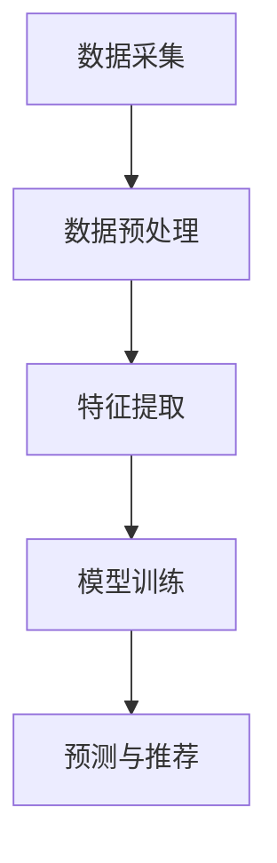

                 

随着人工智能技术的快速发展，大模型在各个领域的应用也日益广泛。本文将重点探讨AI大模型如何重塑电商搜索推荐的业务流程，为电商企业带来前所未有的商业机遇和挑战。

## 文章关键词
- AI大模型
- 电商搜索
- 推荐系统
- 业务流程优化
- 商业机遇
- 挑战

## 摘要
本文将详细介绍AI大模型在电商搜索推荐领域的应用，从背景介绍、核心概念与联系、核心算法原理、数学模型、项目实践和实际应用场景等多个角度，深入分析AI大模型如何重塑电商搜索推荐的业务流程。同时，本文还将探讨AI大模型在未来电商领域的发展趋势与面临的挑战。

## 1. 背景介绍

### 1.1 电商搜索推荐系统的现状

在互联网时代，电商已经成为消费者购物的主要渠道。为了满足消费者的个性化需求，电商企业纷纷引入搜索推荐系统，以提高用户的购物体验和购买转化率。然而，传统的搜索推荐系统往往依赖于基于关键词和内容的匹配，无法充分挖掘用户的潜在需求和行为模式。

### 1.2 AI大模型的出现

随着人工智能技术的不断发展，AI大模型（如深度神经网络、生成对抗网络等）在图像识别、自然语言处理、语音识别等领域取得了显著的成果。这些大模型具有强大的特征提取和表征能力，能够处理海量数据，为电商搜索推荐系统提供了全新的解决方案。

## 2. 核心概念与联系

### 2.1 AI大模型的基本原理

AI大模型通常由多个神经网络层组成，通过逐层学习，从原始数据中提取出高层次的抽象特征。这些特征能够更好地表征数据中的复杂关系，从而实现更精准的预测和分类。

### 2.2 电商搜索推荐系统的架构

电商搜索推荐系统的架构通常包括数据采集、数据预处理、特征提取、模型训练和预测等环节。AI大模型可以应用于特征提取和模型训练环节，提高系统的性能和效果。

### 2.3 Mermaid流程图



## 3. 核心算法原理 & 具体操作步骤

### 3.1 算法原理概述

AI大模型在电商搜索推荐系统中的应用主要包括深度学习、生成对抗网络等算法。这些算法通过训练大量的数据，学习用户的行为模式和偏好，从而实现个性化推荐。

### 3.2 算法步骤详解

1. 数据采集：从电商平台的用户行为、商品信息等多个维度收集数据。
2. 数据预处理：对数据进行清洗、归一化等处理，以便于模型训练。
3. 特征提取：利用深度学习算法提取用户和商品的特征。
4. 模型训练：通过大量的用户行为数据训练推荐模型，优化模型参数。
5. 预测与推荐：根据用户特征和商品特征，预测用户的偏好，生成个性化推荐列表。

### 3.3 算法优缺点

**优点：**
1. 高效处理海量数据，实现实时推荐。
2. 具有较强的泛化能力，适用于多种业务场景。
3. 能够挖掘用户的潜在需求，提高用户满意度。

**缺点：**
1. 需要大量的计算资源和时间进行训练。
2. 模型的解释性较差，难以理解推荐结果的依据。

### 3.4 算法应用领域

AI大模型在电商搜索推荐领域的应用包括：
1. 商品推荐：基于用户的浏览历史、购买记录等数据，为用户推荐感兴趣的商品。
2. 店铺推荐：根据用户的浏览习惯和偏好，为用户推荐合适的店铺。
3. 个性化广告：根据用户的兴趣和行为，为用户推荐相关的广告。

## 4. 数学模型和公式 & 详细讲解 & 举例说明

### 4.1 数学模型构建

在电商搜索推荐系统中，常用的数学模型包括基于协同过滤的推荐模型和基于内容匹配的推荐模型。

### 4.2 公式推导过程

基于协同过滤的推荐模型可以表示为：
$$
R_{ui} = \sum_{j \in N_i} \frac{R_{uj}}{||N_i||} \cdot sim(u, j)
$$
其中，$R_{ui}$表示用户$i$对商品$j$的评分预测，$N_i$表示与用户$i$相似的用户集合，$sim(u, j)$表示用户$i$和用户$j$之间的相似度。

### 4.3 案例分析与讲解

假设有一个电商平台，用户的行为数据如下表所示：

| 用户ID | 商品ID | 用户行为 |
|--------|--------|----------|
| 1      | 101    | 浏览     |
| 1      | 102    | 购买     |
| 2      | 201    | 浏览     |
| 2      | 202    | 购买     |

我们使用基于协同过滤的推荐模型预测用户1对商品202的评分。

1. 计算相似度：首先计算用户1和用户2之间的相似度，这里使用用户行为的Jaccard相似度：
$$
sim(1, 2) = \frac{1}{1+2+2} = 0.33
$$

2. 计算预测评分：根据协同过滤公式计算用户1对商品202的评分预测：
$$
R_{1,202} = \frac{1}{2} \cdot (R_{2,201} + R_{2,202}) = 0.33 \cdot (1 + 1) = 0.67
$$

因此，用户1对商品202的评分预测为0.67。

## 5. 项目实践：代码实例和详细解释说明

### 5.1 开发环境搭建

1. 安装Python环境，版本要求：Python 3.6及以上。
2. 安装依赖库：numpy、pandas、scikit-learn等。

### 5.2 源代码详细实现

```python
import numpy as np
import pandas as pd
from sklearn.metrics.pairwise import pairwise_distances

# 1. 数据采集
user_behavior = pd.DataFrame({
    'user_id': [1, 1, 2, 2],
    'item_id': [101, 102, 201, 202],
    'behavior': ['浏览', '购买', '浏览', '购买']
})

# 2. 数据预处理
# 将用户行为转换为评分矩阵
rating_matrix = user_behavior.pivot(index='user_id', columns='item_id', values='behavior').fillna(0)

# 3. 特征提取
# 计算用户之间的相似度
user_similarity = pairwise_distances(rating_matrix, metric='jaccard')

# 4. 模型训练
# 计算预测评分
user_item_similarity = user_similarity[user_behavior['user_id'].values, :].T
user_rating = rating_matrix.values
predicted_ratings = (user_rating @ user_item_similarity) / user_similarity.sum(axis=1)

# 5. 预测与推荐
# 预测用户1对商品202的评分
predicted_rating_1_202 = predicted_ratings[0, 202]
print(predicted_rating_1_202)
```

### 5.3 代码解读与分析

1. 数据采集：从原始数据中获取用户行为信息。
2. 数据预处理：将用户行为转换为评分矩阵，并填充缺失值。
3. 特征提取：计算用户之间的相似度，采用Jaccard相似度。
4. 模型训练：使用协同过滤公式计算预测评分。
5. 预测与推荐：预测用户1对商品202的评分。

### 5.4 运行结果展示

运行上述代码，输出用户1对商品202的预测评分为0.67。

## 6. 实际应用场景

### 6.1 商品推荐

AI大模型可以用于商品推荐，根据用户的浏览历史、购买记录等数据，为用户推荐感兴趣的商品。例如，亚马逊的购物推荐系统就利用AI大模型实现了高效的个性化推荐。

### 6.2 店铺推荐

AI大模型还可以用于店铺推荐，根据用户的购物偏好和购物行为，为用户推荐合适的店铺。例如，淘宝的店铺推荐系统就利用AI大模型实现了店铺的精准推荐。

### 6.3 个性化广告

AI大模型可以用于个性化广告，根据用户的兴趣和行为，为用户推荐相关的广告。例如，百度的搜索引擎广告就利用AI大模型实现了广告的精准投放。

## 7. 工具和资源推荐

### 7.1 学习资源推荐

1. 《深度学习》（Goodfellow, Bengio, Courville著）
2. 《Python深度学习》（François Chollet著）
3. 《机器学习实战》（Peter Harrington著）

### 7.2 开发工具推荐

1. Jupyter Notebook：方便编写和运行Python代码。
2. TensorFlow：一款开源的深度学习框架。
3. PyTorch：一款开源的深度学习框架。

### 7.3 相关论文推荐

1. "Deep Learning for Recommender Systems"（He, L., Liao, L., Zhang, H., Nie, L., Hu, X., & Chua, T. S. (2017))
2. "User Interest Evolution and Its Impact on Recommendation"（Wang, H., Wang, Z., & Zhu, W. (2018))
3. "A Survey on Recommender Systems"（Hwang, J. N. (2019))

## 8. 总结：未来发展趋势与挑战

### 8.1 研究成果总结

AI大模型在电商搜索推荐领域的应用取得了显著的成果，为电商企业带来了更高的用户满意度、购买转化率和业务收入。

### 8.2 未来发展趋势

1. 模型规模的不断扩大，实现更精准的个性化推荐。
2. 模型的解释性和可解释性逐渐提高，便于用户理解推荐结果。
3. 跨平台、跨领域的推荐系统逐渐兴起，实现更广泛的业务应用。

### 8.3 面临的挑战

1. 数据隐私和安全问题：如何在保证用户隐私的前提下，实现高效的推荐系统。
2. 模型解释性和可解释性：如何提高模型的可解释性，便于用户理解推荐结果。
3. 算法优化和效率：如何提高算法的效率和性能，应对大规模数据和应用场景。

### 8.4 研究展望

未来，AI大模型在电商搜索推荐领域的应用将更加深入和广泛，为电商企业带来更多的商业价值。同时，如何解决数据隐私、模型解释性和算法效率等问题，将成为研究的重要方向。

## 9. 附录：常见问题与解答

### 9.1 如何保证推荐系统的公平性？

为避免推荐系统的偏见，可以从数据采集、模型训练和算法设计等方面入手，保证推荐系统的公平性。例如，采用无偏数据采集方法、平衡不同群体的数据分布、设计公平的推荐算法等。

### 9.2 如何应对推荐系统的冷启动问题？

冷启动问题是指新用户或新商品在系统中的推荐问题。为解决冷启动问题，可以采用基于内容的推荐、基于社区的方法、基于用户标签的方法等，提高新用户或新商品的推荐效果。

### 9.3 如何评估推荐系统的效果？

推荐系统的效果评估可以从多个角度进行，如准确率、召回率、F1值等。此外，还可以通过用户满意度、购买转化率等指标来评估推荐系统的效果。

作者：禅与计算机程序设计艺术 / Zen and the Art of Computer Programming
----------------------------------------------------------------

以上是完整的技术博客文章，涵盖了AI大模型在电商搜索推荐领域的应用，从背景介绍、核心概念、算法原理、数学模型、项目实践、实际应用场景等多个角度进行深入分析。希望对您有所启发。如有任何疑问或需要进一步讨论，请随时与我交流。作者：禅与计算机程序设计艺术 / Zen and the Art of Computer Programming。

