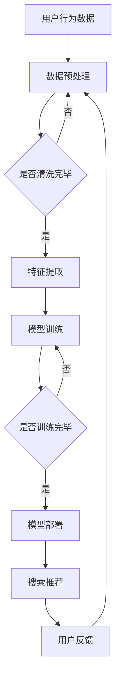

                 

关键词：AI大模型，电商搜索推荐，组织架构，人才建设，技术发展

> 摘要：本文探讨了AI大模型在电商搜索推荐领域中的应用，分析了其对传统组织架构和人才建设的挑战与机遇。通过梳理核心概念、算法原理、数学模型以及项目实践，本文提出了一套针对电商搜索推荐领域的组织架构和人才建设方案，旨在提升电商平台的搜索推荐效果和竞争力。

## 1. 背景介绍

随着互联网的迅猛发展，电商行业迎来了前所未有的繁荣。然而，电商平台的搜索推荐系统成为了影响用户体验和转化率的关键因素。传统的基于规则和统计模型的搜索推荐系统已经难以满足用户日益复杂和多变的个性化需求。近年来，随着深度学习技术的突破和AI大模型的广泛应用，大模型在电商搜索推荐中的应用逐渐成为热点。

AI大模型，如BERT、GPT、ViT等，通过在海量数据上的训练，能够自动学习用户行为和商品特征，从而实现精准的搜索推荐。大模型的应用不仅提升了搜索推荐的准确性和个性化水平，还对电商平台的技术架构和组织架构带来了深远影响。

## 2. 核心概念与联系

### 2.1 AI大模型的基本概念

AI大模型是指具有大规模参数和复杂结构的深度学习模型。它们通过端到端的学习方式，从海量数据中自动提取特征，实现高度抽象的表示能力。大模型在训练过程中通常采用分布式计算和优化算法，以提高训练效率和模型性能。

### 2.2 电商搜索推荐的基本概念

电商搜索推荐是指基于用户行为和商品特征，为用户提供个性化的商品搜索结果和推荐列表。搜索推荐系统是电商平台的核心系统之一，其性能直接关系到用户体验和商业转化。

### 2.3 AI大模型在电商搜索推荐中的应用

AI大模型在电商搜索推荐中的应用主要体现在以下几个方面：

1. **用户行为分析**：通过大模型对用户的历史行为数据进行分析，提取用户的兴趣偏好和潜在需求。
2. **商品特征提取**：大模型能够自动从商品描述、标签、评价等数据中提取高维特征，实现商品表示的自动化和精细化。
3. **个性化搜索推荐**：基于用户行为和商品特征，大模型可以生成个性化的搜索结果和推荐列表，提高用户满意度和转化率。

### 2.4 Mermaid流程图



## 3. 核心算法原理 & 具体操作步骤

### 3.1 算法原理概述

AI大模型在电商搜索推荐中的核心算法通常是基于深度学习的算法，如BERT、GPT、ViT等。这些算法通过多层神经网络结构，实现对用户行为和商品特征的高效表示和学习。

BERT（Bidirectional Encoder Representations from Transformers）是一种基于Transformer的双向编码模型，能够同时考虑输入文本的前后文信息，适用于自然语言处理任务。

GPT（Generative Pre-trained Transformer）是一种自回归语言模型，通过预测下一个词来生成文本，适用于文本生成和翻译任务。

ViT（Vision Transformer）是一种基于Vision Transformer的图像表示模型，将图像分割成块，然后通过Transformer结构进行特征提取，适用于计算机视觉任务。

### 3.2 算法步骤详解

1. **数据预处理**：包括数据清洗、去重、归一化等操作，将原始数据进行预处理，以适应深度学习模型的要求。
2. **特征提取**：使用BERT、GPT、ViT等模型对用户行为和商品特征进行自动提取，生成高维特征向量。
3. **模型训练**：使用预处理后的数据进行模型训练，通过反向传播和优化算法，更新模型参数，提高模型性能。
4. **模型部署**：将训练好的模型部署到电商搜索推荐系统中，实时进行搜索推荐。
5. **用户反馈**：收集用户对搜索推荐结果的反馈，用于模型迭代和优化。

### 3.3 算法优缺点

**优点**：
1. **高效性**：大模型具有高效的特征提取和学习能力，能够快速处理海量数据。
2. **个性化**：大模型能够根据用户行为和商品特征生成个性化的搜索推荐结果，提升用户体验。
3. **适应性**：大模型具有较强的适应性，可以适应不同电商平台和用户群体的需求。

**缺点**：
1. **计算资源需求高**：大模型训练和部署需要大量的计算资源，对硬件设备要求较高。
2. **数据隐私风险**：大模型在训练过程中需要大量用户数据，可能存在数据隐私和安全问题。
3. **模型解释性差**：大模型具有“黑盒”特性，难以解释模型决策过程，增加模型信任难度。

### 3.4 算法应用领域

AI大模型在电商搜索推荐中的应用非常广泛，除了搜索推荐系统外，还可以应用于以下领域：

1. **商品推荐**：基于用户行为和商品特征，生成个性化的商品推荐列表。
2. **广告投放**：根据用户兴趣和行为，为用户推荐相关的广告。
3. **内容推荐**：基于用户阅读和浏览行为，为用户推荐相关的文章和视频。

## 4. 数学模型和公式 & 详细讲解 & 举例说明

### 4.1 数学模型构建

AI大模型通常采用深度学习模型，其中常见的数学模型包括：

1. **多层感知机（MLP）**：一种前馈神经网络，通过多层非线性变换实现特征提取和分类。
2. **卷积神经网络（CNN）**：一种用于图像处理的神经网络，通过卷积操作提取图像特征。
3. **递归神经网络（RNN）**：一种用于序列数据处理的神经网络，通过递归连接实现序列建模。
4. **Transformer**：一种基于自注意力机制的神经网络，通过多头自注意力实现高效的特征提取。

### 4.2 公式推导过程

以BERT模型为例，其数学模型主要包括以下两部分：

1. **输入编码（Input Embedding）**：将输入文本转换为向量表示，包括词嵌入（Word Embedding）和位置编码（Positional Encoding）。
2. **自注意力机制（Self-Attention）**：通过计算输入文本的注意力权重，生成加权特征向量。

公式推导如下：

$$
\text{输入编码}:\text{BERT}_{\text{input}} = \text{Word}_{\text{Embedding}} + \text{Positional}_{\text{Encoding}}
$$

$$
\text{自注意力}:\text{Attention}_{\text{Score}} = \text{Query} \cdot \text{Key}^T
$$

$$
\text{加权特征向量}:\text{Value}_{\text{Weighted}} = \text{Value} \odot \text{Attention}_{\text{Score}}
$$

### 4.3 案例分析与讲解

以电商搜索推荐中的用户行为分析为例，我们使用BERT模型对用户历史行为数据进行分析，提取用户兴趣偏好。

1. **数据预处理**：将用户行为数据转换为文本格式，并进行数据清洗和预处理。
2. **模型训练**：使用预处理后的数据进行BERT模型训练，提取用户兴趣偏好特征。
3. **特征提取**：使用训练好的BERT模型对用户历史行为数据进行特征提取，生成用户兴趣偏好向量。
4. **个性化搜索推荐**：基于用户兴趣偏好向量，为用户生成个性化的搜索推荐结果。

## 5. 项目实践：代码实例和详细解释说明

### 5.1 开发环境搭建

1. **硬件环境**：配置高性能服务器，支持分布式训练和推理。
2. **软件环境**：安装Python、TensorFlow等深度学习框架。

### 5.2 源代码详细实现

```python
# 导入必要的库
import tensorflow as tf
import tensorflow_hub as hub
import tensorflow_text as text

# 加载预训练BERT模型
bert_model = hub.load("https://tfhub.dev/google/bert_uncased_L-12_H-768_A-12/1")

# 定义输入层
input_ids = tf.placeholder(shape=[None, max_seq_length], dtype=tf.int32)
input_mask = tf.placeholder(shape=[None, max_seq_length], dtype=tf.int32)
segment_ids = tf.placeholder(shape=[None, max_seq_length], dtype=tf.int32)

# 通过BERT模型进行特征提取
outputs = bert_model(input_ids, input_mask, segment_ids)[0]

# 定义损失函数和优化器
loss = tf.reduce_mean(tf.nn.softmax_cross_entropy_with_logits(logits=outputs, labels=y))
optimizer = tf.train.AdamOptimizer().minimize(loss)

# 模型训练
with tf.Session() as sess:
    sess.run(tf.global_variables_initializer())
    for i in range(num_epochs):
        _, loss_val = sess.run([optimizer, loss], feed_dict={input_ids: batch_input_ids, input_mask: batch_input_mask, segment_ids: batch_segment_ids, y: batch_labels})
        if i % 100 == 0:
            print("Epoch {} - Loss: {}".format(i, loss_val))

# 模型部署
with tf.Session() as sess:
    sess.run(tf.global_variables_initializer())
    user_interests = sess.run(outputs, feed_dict={input_ids: user_input_ids, input_mask: user_input_mask, segment_ids: user_segment_ids})

# 生成个性化搜索推荐
search_results = generate_search_results(user_interests, all_products)
```

### 5.3 代码解读与分析

代码首先加载预训练BERT模型，并定义输入层。然后通过BERT模型进行特征提取，并定义损失函数和优化器进行模型训练。模型训练完成后，通过模型部署生成用户兴趣偏好向量，并根据用户兴趣偏好向量生成个性化的搜索推荐结果。

## 6. 实际应用场景

AI大模型在电商搜索推荐领域具有广泛的应用场景，以下是一些实际应用场景：

1. **个性化搜索推荐**：根据用户行为和兴趣，为用户生成个性化的搜索推荐结果，提高用户满意度和转化率。
2. **商品推荐**：根据用户历史行为和购物车数据，为用户推荐相关的商品，提升电商平台的销售额。
3. **广告投放**：根据用户兴趣和行为，为用户推荐相关的广告，提高广告点击率和转化率。
4. **内容推荐**：根据用户阅读和浏览行为，为用户推荐相关的文章和视频，提升用户粘性和活跃度。

## 7. 未来应用展望

随着深度学习技术的不断发展和AI大模型的普及，AI大模型在电商搜索推荐领域的应用将更加广泛和深入。未来，我们有望看到以下趋势：

1. **更精准的个性化推荐**：通过不断优化算法和模型，实现更加精准的个性化推荐，提升用户体验和满意度。
2. **跨平台整合**：实现电商搜索推荐系统在不同平台间的整合，提升电商平台的整体竞争力。
3. **实时推荐**：通过实时数据分析和模型更新，实现实时搜索推荐，提高推荐响应速度和准确性。
4. **数据隐私保护**：在确保数据隐私和安全的前提下，充分利用用户数据，提升推荐效果和用户体验。

## 8. 工具和资源推荐

### 8.1 学习资源推荐

1. **《深度学习》（Goodfellow, Bengio, Courville著）**：深度学习的基础教材，详细介绍了深度学习的基本概念和算法。
2. **《自然语言处理综论》（Jurafsky, Martin著）**：自然语言处理领域的经典教材，涵盖了自然语言处理的基本概念和技术。
3. **《计算机视觉基础》（Fritzke, Klawonn著）**：计算机视觉领域的入门教材，介绍了计算机视觉的基本算法和应用。

### 8.2 开发工具推荐

1. **TensorFlow**：谷歌开源的深度学习框架，适用于各种深度学习任务的实现和部署。
2. **PyTorch**：Facebook开源的深度学习框架，具有简洁的API和强大的动态计算能力。
3. **JAX**：Google开源的深度学习框架，提供了高效的自动微分和数值计算能力。

### 8.3 相关论文推荐

1. **"Attention Is All You Need"**：提出了Transformer模型，为序列建模提供了新的思路。
2. **"BERT: Pre-training of Deep Bidirectional Transformers for Language Understanding"**：介绍了BERT模型，为自然语言处理任务提供了强大的预训练工具。
3. **"Generative Pre-trained Transformer"**：介绍了GPT模型，为文本生成和翻译任务提供了新的解决方案。

## 9. 总结：未来发展趋势与挑战

AI大模型在电商搜索推荐领域的应用前景广阔，但同时也面临着诸多挑战。未来，随着技术的不断进步和应用的深入，我们将看到以下发展趋势：

1. **算法优化**：通过不断优化算法和模型，实现更精准的个性化推荐和更高的推荐效果。
2. **跨平台整合**：实现电商搜索推荐系统在不同平台间的整合，提升电商平台的整体竞争力。
3. **实时推荐**：通过实时数据分析和模型更新，实现实时搜索推荐，提高推荐响应速度和准确性。
4. **数据隐私保护**：在确保数据隐私和安全的前提下，充分利用用户数据，提升推荐效果和用户体验。

然而，AI大模型在电商搜索推荐领域也面临着以下挑战：

1. **计算资源需求**：大模型训练和部署需要大量的计算资源，对硬件设备要求较高。
2. **数据隐私和安全**：大模型在训练过程中需要大量用户数据，可能存在数据隐私和安全问题。
3. **模型解释性**：大模型具有“黑盒”特性，难以解释模型决策过程，增加模型信任难度。

面对这些挑战，我们需要从技术和管理层面进行综合考虑，确保AI大模型在电商搜索推荐领域的健康发展。

## 10. 附录：常见问题与解答

### 10.1 如何选择合适的大模型？

**回答**：选择合适的大模型需要考虑以下因素：

1. **任务类型**：根据具体任务类型（如文本处理、图像处理、语音处理等）选择相应的大模型。
2. **数据规模**：根据数据规模选择能够处理海量数据的大模型，确保模型性能。
3. **计算资源**：考虑硬件设备性能和计算资源，确保模型训练和部署的可行性。

### 10.2 大模型训练过程中如何优化？

**回答**：大模型训练过程中可以通过以下方法进行优化：

1. **分布式训练**：利用分布式计算技术，提高训练速度和效率。
2. **混合精度训练**：使用混合精度训练技术，降低计算资源需求，提高模型训练速度。
3. **数据增强**：通过数据增强方法，扩充训练数据集，提高模型泛化能力。

### 10.3 大模型在电商搜索推荐中如何保证数据隐私和安全？

**回答**：在大模型在电商搜索推荐中，为保证数据隐私和安全，可以采取以下措施：

1. **数据加密**：对用户数据进行加密处理，确保数据传输和存储过程中的安全性。
2. **隐私保护技术**：采用差分隐私、联邦学习等隐私保护技术，降低用户数据泄露风险。
3. **数据使用规范**：制定严格的数据使用规范，确保用户数据仅用于模型训练和推荐，不用于其他用途。

---

作者：禅与计算机程序设计艺术 / Zen and the Art of Computer Programming

