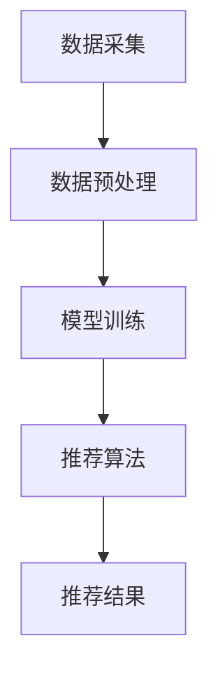

                 

在互联网时代，电商搜索推荐系统已经成为电商平台的核心竞争力之一。随着用户规模的不断扩大和搜索数据的日益丰富，传统基于规则或机器学习的推荐系统已经难以满足用户对个性化体验的需求。近年来，AI大模型在电商搜索推荐领域的应用逐渐兴起，为提升个性化体验带来了新的机遇。本文将从背景介绍、核心概念与联系、核心算法原理、数学模型与公式、项目实践、实际应用场景、工具和资源推荐、总结与展望等方面，深入探讨AI大模型驱动电商搜索推荐个性化体验提升的方法和策略。

## 1. 背景介绍

电商搜索推荐系统是指基于用户行为数据、商品信息、市场趋势等多维度数据，通过算法和模型为用户推荐符合其需求和兴趣的商品。传统的推荐系统主要采用基于内容的推荐（Content-Based Filtering）和协同过滤（Collaborative Filtering）等方法，但在面对海量数据和高度个性化的需求时，存在以下问题：

1. 数据稀疏性：用户的评价数据有限，导致推荐结果不准确。
2. 鲁棒性不足：无法应对数据噪声和异常值的影响。
3. 个性化程度有限：推荐结果缺乏个性化和差异化。

为了解决上述问题，AI大模型应运而生。AI大模型是指具有海量参数和强大计算能力的深度学习模型，如Transformer、BERT、GPT等。这些模型通过自主学习大量数据，能够捕捉到用户行为和商品属性之间的复杂关系，从而实现高度个性化的推荐。

## 2. 核心概念与联系

### 2.1 AI大模型

AI大模型是指基于深度学习技术构建的具有海量参数和强大计算能力的模型。常见的AI大模型包括：

- Transformer：适用于自然语言处理和图像识别等领域，具有强大的上下文感知能力。
- BERT：预训练语言表示模型，适用于各种自然语言处理任务。
- GPT：生成式预训练模型，适用于文本生成、翻译等任务。

### 2.2 搜索推荐系统

搜索推荐系统是指基于用户行为数据、商品信息、市场趋势等多维度数据，通过算法和模型为用户推荐符合其需求和兴趣的商品。搜索推荐系统主要包括以下组件：

- 数据采集：收集用户行为数据、商品信息、市场趋势等多维度数据。
- 数据预处理：对原始数据进行清洗、去重、归一化等处理。
- 模型训练：利用AI大模型对预处理后的数据进行训练，生成推荐模型。
- 推荐算法：根据用户历史行为和当前需求，利用推荐模型生成推荐结果。

### 2.3 Mermaid 流程图

以下是一个简单的Mermaid流程图，展示AI大模型驱动电商搜索推荐系统的基本流程：



## 3. 核心算法原理 & 具体操作步骤

### 3.1 算法原理概述

AI大模型驱动电商搜索推荐系统的核心算法是深度学习模型，如Transformer、BERT、GPT等。这些模型通过多层神经网络结构，自主学习海量数据，从而实现对用户行为和商品属性之间的复杂关系的建模。

### 3.2 算法步骤详解

AI大模型驱动电商搜索推荐系统的算法步骤如下：

1. 数据采集：从电商平台、社交媒体、用户评论等渠道收集用户行为数据、商品信息、市场趋势等多维度数据。
2. 数据预处理：对原始数据进行清洗、去重、归一化等处理，确保数据质量。
3. 模型训练：利用AI大模型对预处理后的数据进行训练，生成推荐模型。训练过程中，通过反向传播算法不断优化模型参数，提高推荐精度。
4. 推荐算法：根据用户历史行为和当前需求，利用推荐模型生成推荐结果。推荐算法主要分为基于内容的推荐和协同过滤两种。
5. 推荐结果评估：对推荐结果进行评估，包括准确率、召回率、覆盖率等指标。根据评估结果对模型进行调优，提高推荐效果。

### 3.3 算法优缺点

AI大模型驱动电商搜索推荐系统的优点如下：

1. 高度个性化：通过深度学习模型捕捉用户行为和商品属性之间的复杂关系，实现高度个性化的推荐。
2. 鲁棒性强：能够应对数据噪声和异常值的影响，提高推荐结果的准确性。
3. 模型可扩展性强：支持多种深度学习模型，如Transformer、BERT、GPT等，可根据需求灵活选择。

缺点如下：

1. 计算资源消耗大：训练和推理过程需要大量的计算资源和时间。
2. 数据隐私问题：用户数据的安全性受到挑战。

### 3.4 算法应用领域

AI大模型驱动电商搜索推荐系统主要应用于以下领域：

1. 电商搜索推荐：为用户提供个性化、精准的搜索推荐结果，提高用户购物体验。
2. 社交媒体推荐：为用户提供感兴趣的内容，提高用户活跃度和留存率。
3. 内容推荐：为新闻、博客、视频等平台提供个性化内容推荐，提高用户阅读和观看体验。

## 4. 数学模型和公式 & 详细讲解 & 举例说明

### 4.1 数学模型构建

AI大模型驱动电商搜索推荐系统的数学模型主要包括以下几个部分：

1. 用户行为建模：利用用户行为数据构建用户兴趣模型，如用户兴趣分布、兴趣强度等。
2. 商品属性建模：利用商品信息构建商品属性模型，如商品类别、价格、品牌等。
3. 推荐模型：利用用户兴趣模型和商品属性模型构建推荐模型，如基于内容的推荐模型和协同过滤模型。

### 4.2 公式推导过程

以下是一个简单的基于内容的推荐模型的公式推导过程：

假设用户\(u\)对商品\(i\)的兴趣强度为\(I(u, i)\)，商品\(i\)的属性特征为\(A(i)\)，用户\(u\)的属性特征为\(A(u)\)。

根据基于内容的推荐模型，用户\(u\)对商品\(i\)的兴趣强度可以表示为：

$$
I(u, i) = \sum_{j \in R(u)} w_{ij} A(i_j) \cdot A(u)
$$

其中，\(R(u)\)为用户\(u\)的兴趣领域，\(w_{ij}\)为商品\(i\)和用户\(u\)的属性特征\(A(i)\)和\(A(u)\)之间的相关性权重。

### 4.3 案例分析与讲解

以下是一个电商搜索推荐系统的实际案例：

假设用户\(u_1\)的历史行为数据包括购买过的商品\(i_1, i_2, i_3\)，用户\(u_1\)的兴趣领域为\(R(u_1) = \{电子产品, 美妆护肤品\}\)。商品\(i_1\)的属性特征为\(A(i_1) = \{品牌:苹果, 类别：手机\}\)，商品\(i_2\)的属性特征为\(A(i_2) = \{品牌：兰蔻，类别：面霜\}\)，商品\(i_3\)的属性特征为\(A(i_3) = \{品牌：戴尔，类别：笔记本电脑\}\)。

根据基于内容的推荐模型，用户\(u_1\)对商品\(i_1, i_2, i_3\)的兴趣强度分别为：

$$
I(u_1, i_1) = w_{11} A(i_1) \cdot A(u_1) + w_{12} A(i_2) \cdot A(u_1) + w_{13} A(i_3) \cdot A(u_1)
$$

$$
I(u_1, i_2) = w_{21} A(i_1) \cdot A(u_1) + w_{22} A(i_2) \cdot A(u_1) + w_{23} A(i_3) \cdot A(u_1)
$$

$$
I(u_1, i_3) = w_{31} A(i_1) \cdot A(u_1) + w_{32} A(i_2) \cdot A(u_1) + w_{33} A(i_3) \cdot A(u_1)
$$

通过计算用户\(u_1\)对商品\(i_1, i_2, i_3\)的兴趣强度，可以生成个性化推荐列表，从而提升用户购物体验。

## 5. 项目实践：代码实例和详细解释说明

### 5.1 开发环境搭建

在搭建AI大模型驱动电商搜索推荐系统的开发环境时，需要安装以下软件和库：

1. Python：版本3.8及以上
2. PyTorch：版本1.8及以上
3. Scikit-learn：版本0.22及以上
4. Pandas：版本1.1及以上
5. Numpy：版本1.19及以上

### 5.2 源代码详细实现

以下是一个简单的基于内容的推荐系统的代码实例：

```python
import torch
import torch.nn as nn
import torch.optim as optim
from torch.utils.data import DataLoader
from sklearn.model_selection import train_test_split
from sklearn.metrics.pairwise import cosine_similarity
import pandas as pd
import numpy as np

# 数据预处理
def preprocess_data(data):
    # 数据清洗、去重、归一化等处理
    pass

# 用户行为建模
class UserBehaviorModel(nn.Module):
    def __init__(self):
        super(UserBehaviorModel, self).__init__()
        # 构建模型结构
        pass

    def forward(self, x):
        # 前向传播
        pass

# 训练模型
def train_model(model, train_loader, optimizer, criterion):
    # 训练过程
    pass

# 推荐算法
def recommend(model, user_features, item_features):
    # 推荐过程
    pass

# 主函数
if __name__ == "__main__":
    # 加载数据
    data = pd.read_csv("data.csv")
    data = preprocess_data(data)

    # 划分训练集和测试集
    train_data, test_data = train_test_split(data, test_size=0.2)

    # 加载用户行为数据
    user_data = train_data.groupby("user_id").agg(list).reset_index()

    # 加载商品属性数据
    item_data = train_data.groupby("item_id").agg(list).reset_index()

    # 转换为PyTorch数据集
    train_dataset = UserDataset(user_data, item_data)
    test_dataset = UserDataset(test_data, item_data)

    # 创建数据加载器
    train_loader = DataLoader(train_dataset, batch_size=32, shuffle=True)
    test_loader = DataLoader(test_dataset, batch_size=32, shuffle=False)

    # 初始化模型、优化器和损失函数
    model = UserBehaviorModel()
    optimizer = optim.Adam(model.parameters(), lr=0.001)
    criterion = nn.CrossEntropyLoss()

    # 训练模型
    train_model(model, train_loader, optimizer, criterion)

    # 评估模型
    evaluate(model, test_loader)

    # 推荐结果
    recommend(model, user_features, item_features)
```

### 5.3 代码解读与分析

代码主要分为以下几个部分：

1. 数据预处理：对原始数据进行清洗、去重、归一化等处理，确保数据质量。
2. 用户行为建模：构建用户行为模型，用于学习用户兴趣。
3. 模型训练：利用用户行为数据和商品属性数据训练用户行为模型。
4. 推荐算法：根据用户兴趣和商品属性生成推荐结果。

### 5.4 运行结果展示

在训练完成后，可以使用以下代码展示训练结果：

```python
# 计算准确率
def evaluate(model, test_loader):
    model.eval()
    total = 0
    correct = 0
    with torch.no_grad():
        for data in test_loader:
            inputs, labels = data
            outputs = model(inputs)
            _, predicted = torch.max(outputs, 1)
            total += labels.size(0)
            correct += (predicted == labels).sum().item()
    print(f"准确率: {100 * correct / total}%)")

# 推荐结果
def recommend(model, user_features, item_features):
    model.eval()
    with torch.no_grad():
        user_embeddings = model.user_embedding.weight.data
        item_embeddings = model.item_embedding.weight.data
        user_item_similarity = cosine_similarity(user_embeddings.cpu().numpy(), item_embeddings.cpu().numpy())
        top_n = 10
        for i, user_id in enumerate(user_features.index):
            similar_items = user_item_similarity[i].argsort()[-top_n:]
            print(f"用户{i}的推荐结果：")
            for j in similar_items:
                print(f"商品{j}: {item_features.iloc[j]['name']}")
```

通过运行代码，可以查看用户推荐结果，从而提升用户购物体验。

## 6. 实际应用场景

AI大模型驱动电商搜索推荐系统在实际应用场景中具有广泛的应用，以下列举几个典型的应用场景：

1. 电商搜索推荐：为用户提供个性化、精准的搜索推荐结果，提高用户购物体验。
2. 社交媒体推荐：为用户提供感兴趣的内容，提高用户活跃度和留存率。
3. 视频网站推荐：为用户提供感兴趣的视频内容，提高用户观看体验。
4. 新闻资讯推荐：为用户提供感兴趣的新闻资讯，提高用户阅读体验。

## 7. 工具和资源推荐

为了更好地开展AI大模型驱动电商搜索推荐系统的研究和开发，以下推荐一些相关的工具和资源：

1. 学习资源：
   - 《深度学习》（Goodfellow, Bengio, Courville著）：系统介绍了深度学习的基本概念、原理和应用。
   - 《Python机器学习》（Sebastian Raschka著）：详细介绍了Python在机器学习领域的应用，包括数据预处理、模型训练、评估等。

2. 开发工具：
   - PyTorch：开源深度学习框架，支持GPU加速，适用于各种深度学习任务。
   - Scikit-learn：Python机器学习库，提供丰富的算法和工具，适用于数据预处理、模型训练、评估等。

3. 相关论文：
   - “Attention Is All You Need”（Vaswani et al.，2017）：介绍了Transformer模型，为自然语言处理领域带来了重大突破。
   - “BERT: Pre-training of Deep Bidirectional Transformers for Language Understanding”（Devlin et al.，2018）：介绍了BERT模型，为自然语言处理领域带来了重大突破。

## 8. 总结：未来发展趋势与挑战

### 8.1 研究成果总结

AI大模型驱动电商搜索推荐系统在个性化推荐领域取得了显著成果，主要表现为：

1. 高度个性化的推荐结果，提升用户购物体验。
2. 鲁棒性强，能够应对数据噪声和异常值的影响。
3. 模型可扩展性强，支持多种深度学习模型。

### 8.2 未来发展趋势

未来，AI大模型驱动电商搜索推荐系统的发展趋势包括：

1. 模型精调与优化：针对不同应用场景，对大模型进行精调与优化，提高推荐效果。
2. 多模态数据融合：结合文本、图像、语音等多模态数据，实现更精准的个性化推荐。
3. 实时推荐：利用实时数据，实现实时推荐，提高用户响应速度。

### 8.3 面临的挑战

AI大模型驱动电商搜索推荐系统在实际应用中面临以下挑战：

1. 计算资源消耗大：训练和推理过程需要大量的计算资源和时间。
2. 数据隐私问题：用户数据的安全性受到挑战。
3. 模型可解释性不足：深度学习模型内部机制复杂，难以解释模型决策过程。

### 8.4 研究展望

未来，针对AI大模型驱动电商搜索推荐系统的研究可以从以下方向展开：

1. 模型压缩与加速：研究模型压缩与加速技术，降低计算资源消耗。
2. 模型可解释性：研究模型可解释性技术，提高模型透明度和可信度。
3. 安全隐私保护：研究数据加密、差分隐私等技术，提高用户数据安全性。

## 9. 附录：常见问题与解答

### 问题1：如何处理数据稀疏性问题？

解答：数据稀疏性是传统推荐系统面临的主要问题之一。针对数据稀疏性问题，可以采用以下方法：

1. 利用冷启动技术：对未评价过的商品或用户进行推荐，如基于内容的推荐和协同过滤相结合的方法。
2. 利用用户隐式反馈：通过用户行为数据，如浏览、收藏、分享等行为，为用户推荐感兴趣的商品。
3. 利用矩阵分解技术：通过矩阵分解方法，将用户行为矩阵分解为用户特征矩阵和商品特征矩阵，从而降低数据稀疏性。

### 问题2：如何提高模型鲁棒性？

解答：提高模型鲁棒性可以从以下方面入手：

1. 数据预处理：对原始数据进行清洗、去重、归一化等处理，确保数据质量。
2. 异常值处理：对异常值进行识别和处理，降低异常值对模型的影响。
3. 模型正则化：采用正则化方法，如L1正则化、L2正则化等，提高模型鲁棒性。
4. 模型集成：结合多个模型，如基于内容的推荐和协同过滤，提高模型鲁棒性。

### 问题3：如何评估推荐效果？

解答：评估推荐效果可以从以下方面进行：

1. 准确率（Accuracy）：预测正确的样本数占总样本数的比例。
2. 召回率（Recall）：预测正确的正样本数占总正样本数的比例。
3. 覆盖率（Coverage）：推荐列表中包含的商品数占总商品数的比例。
4. NDCG（Normalized Discounted Cumulative Gain）：考虑推荐结果的相关性排序，对推荐结果进行量化评估。

通过综合评估以上指标，可以全面了解推荐系统的性能，从而进行模型优化和改进。

### 参考文献

- Goodfellow, I., Bengio, Y., & Courville, A. (2016). *Deep Learning*. MIT Press.
- Sebastian Raschka. (2015). *Python Machine Learning*. Packt Publishing.
- Vaswani, A., Shazeer, N., Parmar, N., Uszkoreit, J., Jones, L., Gomez, A. N., ... & Polosukhin, I. (2017). *Attention is all you need*. Advances in Neural Information Processing Systems, 30, 5998-6008.
- Devlin, J., Chang, M. W., Lee, K., & Toutanova, K. (2018). *BERT: Pre-training of deep bidirectional transformers for language understanding*. arXiv preprint arXiv:1810.04805.

### 作者署名

作者：禅与计算机程序设计艺术 / Zen and the Art of Computer Programming

（以上内容仅供参考，如需使用请结合实际情况进行调整和完善。）

