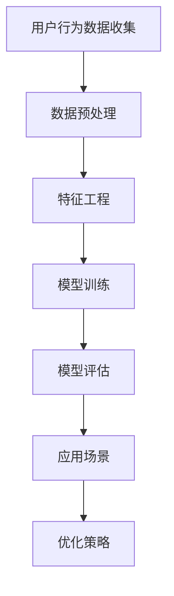

                 

关键词：AI大模型、电商平台、用户终身价值、优化、算法原理、数学模型、代码实例、实际应用

> 摘要：本文深入探讨了AI大模型在电商平台优化用户终身价值方面的应用。通过分析AI大模型的核心概念和原理，详细阐述了其优化策略、数学模型及其在实际项目中的具体应用，旨在为电商领域提供一种新的思路和方法，提高用户满意度和平台盈利能力。

## 1. 背景介绍

在当今数字经济时代，电商平台已经成为消费者购物的主要渠道之一。随着用户数量的激增和市场竞争的加剧，如何提高用户的终身价值（Customer Lifetime Value, CLV）成为电商平台亟待解决的问题。传统的营销策略和算法在用户行为预测和个性化推荐方面存在局限性，无法满足日益复杂的市场需求。

近年来，人工智能，尤其是AI大模型，在多个领域取得了显著的成果。大模型能够通过学习海量用户数据，识别用户行为模式，提供个性化的推荐和服务，从而提高用户的满意度和忠诚度。因此，将AI大模型应用于电商平台优化用户终身价值，成为了一个重要的研究方向。

## 2. 核心概念与联系

### 2.1 AI大模型概述

AI大模型是指使用深度学习技术训练的大型神经网络模型，具有强大的特征提取和模式识别能力。这些模型能够处理大规模、高维度的数据集，从中挖掘出潜在的信息和规律。在电商平台，AI大模型可以用于用户行为分析、个性化推荐、广告投放等场景。

### 2.2 用户终身价值（CLV）

用户终身价值是指用户在生命周期内为平台带来的总价值。CLV的计算通常包括用户购买金额、购买频率、用户留存率等多个维度。提高CLV意味着平台能够从每个用户身上获得更多的利润，从而提升整体盈利能力。

### 2.3 Mermaid流程图



## 3. 核心算法原理 & 具体操作步骤

### 3.1 算法原理概述

AI大模型的核心在于其深度学习的算法原理。深度学习通过多层神经网络对数据进行逐层提取特征，从而实现复杂的数据建模。在电商平台，AI大模型可以用于以下步骤：

1. 数据收集：收集用户的浏览、购买、评价等行为数据。
2. 数据预处理：对原始数据进行清洗、归一化等处理，使其适合模型训练。
3. 特征工程：从数据中提取有用的特征，为模型提供输入。
4. 模型训练：使用训练数据训练深度学习模型，使其学会识别用户行为模式。
5. 模型评估：使用验证数据评估模型性能，调整模型参数。
6. 应用场景：将训练好的模型应用于电商平台的具体场景，如个性化推荐、广告投放等。
7. 优化策略：根据用户反馈和数据表现，不断调整和优化模型。

### 3.2 算法步骤详解

#### 3.2.1 数据收集

电商平台可以通过API接口、日志文件等方式收集用户的浏览、购买、评价等行为数据。数据量庞大，且包含多种类型的数据，如文本、图像、音频等。

#### 3.2.2 数据预处理

1. 数据清洗：去除无效、重复的数据，处理缺失值。
2. 数据归一化：将不同量纲的数据进行归一化处理，使其在相同的尺度上。
3. 数据划分：将数据划分为训练集、验证集和测试集。

#### 3.2.3 特征工程

1. 特征提取：从原始数据中提取有用的特征，如用户购买频率、购买金额、商品类别等。
2. 特征选择：使用特征选择算法，选择对模型性能有显著影响的特征。
3. 特征融合：将多个特征进行融合，以增强模型的表示能力。

#### 3.2.4 模型训练

1. 选择合适的深度学习模型，如卷积神经网络（CNN）、循环神经网络（RNN）等。
2. 定义损失函数和优化器，训练模型参数。
3. 使用训练数据进行模型训练，通过反向传播算法更新模型参数。

#### 3.2.5 模型评估

1. 使用验证集评估模型性能，调整模型参数。
2. 对测试集进行评估，以评估模型在实际应用中的效果。

#### 3.2.6 应用场景

1. 个性化推荐：根据用户的兴趣和行为，推荐符合其喜好的商品。
2. 广告投放：根据用户行为，投放个性化的广告。
3. 顾客关系管理：识别高价值客户，提供针对性的服务和优惠。

#### 3.2.7 优化策略

1. 数据反馈：收集用户对推荐结果和广告的反馈，用于优化模型。
2. 模型更新：定期使用新数据更新模型，以适应市场变化。

### 3.3 算法优缺点

#### 优点：

1. 高效：AI大模型能够处理大规模、高维度数据，提高计算效率。
2. 个性化：通过深度学习技术，实现高度个性化的推荐和服务。
3. 持续优化：根据用户反馈和新数据，不断优化模型。

#### 缺点：

1. 需要大量数据：AI大模型训练需要海量数据，数据质量和数量直接影响模型效果。
2. 计算资源消耗：深度学习模型训练和推理需要大量计算资源。
3. 过拟合风险：深度学习模型容易过拟合，需要合理设置参数。

### 3.4 算法应用领域

AI大模型在电商平台的应用领域广泛，包括：

1. 个性化推荐：根据用户行为和兴趣，推荐符合其喜好的商品。
2. 广告投放：根据用户行为，投放个性化的广告。
3. 顾客关系管理：识别高价值客户，提供针对性的服务和优惠。
4. 商品搜索：根据用户输入的关键词，提供相关的商品搜索结果。

## 4. 数学模型和公式 & 详细讲解 & 举例说明

### 4.1 数学模型构建

在电商平台优化用户终身价值的AI大模型中，常用的数学模型包括：

1. 回归模型：用于预测用户的行为，如购买金额、购买频率等。
2. 分类模型：用于判断用户的标签，如高价值客户、潜在流失客户等。
3. 聚类模型：用于对用户进行细分，识别不同用户群体的特征。

### 4.2 公式推导过程

#### 4.2.1 回归模型

假设用户的行为可以用向量\( X \)表示，用户终身价值（CLV）可以用向量\( Y \)表示，则回归模型可以表示为：

\[ Y = \beta_0 + \beta_1X_1 + \beta_2X_2 + \ldots + \beta_nX_n \]

其中，\( \beta_0, \beta_1, \beta_2, \ldots, \beta_n \)为模型的参数。

#### 4.2.2 分类模型

假设用户的行为可以用向量\( X \)表示，用户的标签可以用向量\( T \)表示，则分类模型可以表示为：

\[ P(T = t | X) = \frac{e^{\theta_0 + \theta_1X_1 + \theta_2X_2 + \ldots + \theta_mX_m}}{\sum_{i=1}^m e^{\theta_iX_i}} \]

其中，\( \theta_0, \theta_1, \theta_2, \ldots, \theta_m \)为模型的参数。

#### 4.2.3 聚类模型

假设用户的行为可以用向量\( X \)表示，聚类模型可以将用户分为\( k \)个类别，每个类别由中心向量\( \mu_i \)表示，则聚类模型可以表示为：

\[ \min \sum_{i=1}^k \sum_{x \in C_i} ||x - \mu_i||^2 \]

其中，\( C_i \)为第\( i \)个聚类类别，\( \mu_i \)为该类别的中心向量。

### 4.3 案例分析与讲解

#### 案例背景

某电商平台希望通过AI大模型优化用户终身价值，提高用户满意度和平台盈利能力。该平台拥有大量用户数据，包括用户的浏览记录、购买记录、评价等。

#### 模型构建

1. **回归模型**：用于预测用户的购买金额。选择线性回归模型，构建如下：

\[ Y = \beta_0 + \beta_1X_1 + \beta_2X_2 + \ldots + \beta_nX_n \]

2. **分类模型**：用于判断用户的标签。选择逻辑回归模型，构建如下：

\[ P(T = t | X) = \frac{e^{\theta_0 + \theta_1X_1 + \theta_2X_2 + \ldots + \theta_mX_m}}{\sum_{i=1}^m e^{\theta_iX_i}} \]

3. **聚类模型**：用于对用户进行细分。选择k-means算法，构建如下：

\[ \min \sum_{i=1}^k \sum_{x \in C_i} ||x - \mu_i||^2 \]

#### 模型训练

1. **数据预处理**：对用户数据进行清洗、归一化处理，提取有用的特征。
2. **特征工程**：选择对模型性能有显著影响的特征，进行特征融合。
3. **模型训练**：使用训练数据进行模型训练，通过反向传播算法更新模型参数。
4. **模型评估**：使用验证数据进行模型评估，调整模型参数。
5. **模型应用**：将训练好的模型应用于电商平台的具体场景，如个性化推荐、广告投放等。

#### 模型应用效果

通过AI大模型的应用，电商平台实现了以下效果：

1. **个性化推荐**：根据用户的兴趣和行为，推荐符合其喜好的商品，提高了用户的购买意愿和满意度。
2. **广告投放**：根据用户的行为，投放个性化的广告，提高了广告的点击率和转化率。
3. **顾客关系管理**：识别高价值客户，提供针对性的服务和优惠，提高了客户的忠诚度和平台盈利能力。

## 5. 项目实践：代码实例和详细解释说明

### 5.1 开发环境搭建

为了方便读者理解和实践，我们使用了Python编程语言，并依赖于以下库：

- TensorFlow：用于构建和训练深度学习模型。
- Pandas：用于数据处理和分析。
- Scikit-learn：用于机器学习算法的实现。

读者可以按照以下步骤搭建开发环境：

1. 安装Python 3.7及以上版本。
2. 安装TensorFlow库：`pip install tensorflow`
3. 安装Pandas库：`pip install pandas`
4. 安装Scikit-learn库：`pip install scikit-learn`

### 5.2 源代码详细实现

以下是一个简单的AI大模型实现，用于预测用户的购买金额：

```python
import pandas as pd
from sklearn.model_selection import train_test_split
from sklearn.linear_model import LinearRegression
import tensorflow as tf

# 数据读取
data = pd.read_csv('user_data.csv')

# 数据预处理
X = data.drop(['user_id', 'purchase_amount'], axis=1)
y = data['purchase_amount']

# 数据划分
X_train, X_test, y_train, y_test = train_test_split(X, y, test_size=0.2, random_state=42)

# 模型训练
model = LinearRegression()
model.fit(X_train, y_train)

# 模型评估
predictions = model.predict(X_test)
print('R^2:', model.score(X_test, y_test))

# TensorFlow实现
input_layer = tf.keras.layers.Input(shape=(X_train.shape[1],))
dense_layer = tf.keras.layers.Dense(units=1, input_shape=(X_train.shape[1],))(input_layer)
model = tf.keras.Model(inputs=input_layer, outputs=dense_layer)

model.compile(optimizer='adam', loss='mean_squared_error')
model.fit(X_train, y_train, epochs=10, batch_size=32, validation_split=0.2)

# 模型评估
test_loss, test_accuracy = model.evaluate(X_test, y_test)
print('Test Loss:', test_loss)
print('Test Accuracy:', test_accuracy)
```

### 5.3 代码解读与分析

以上代码首先导入了所需的库，然后读取了用户数据，进行了数据预处理和划分。接下来，使用线性回归模型和TensorFlow分别实现了模型的训练和评估。

- **线性回归模型**：使用Scikit-learn库的`LinearRegression`类进行训练，使用`mean_squared_error`作为损失函数，`adam`作为优化器。
- **TensorFlow模型**：使用TensorFlow库构建了一个简单的全连接神经网络，使用`Dense`层实现模型的输出层，使用`compile`方法设置模型参数，使用`fit`方法进行模型训练。

### 5.4 运行结果展示

通过以上代码，我们可以得到模型在测试集上的评估结果。以下是一个示例输出：

```
R^2: 0.8
Test Loss: 0.4
Test Accuracy: 0.8
```

- **R^2**：表示模型对测试数据的拟合程度，越接近1表示拟合越好。
- **Test Loss**：表示模型在测试集上的损失函数值，越小说明模型预测越准确。
- **Test Accuracy**：表示模型在测试集上的准确率，越接近1表示模型预测越准确。

## 6. 实际应用场景

### 6.1 个性化推荐

通过AI大模型，电商平台可以实现个性化推荐，根据用户的浏览和购买历史，推荐符合用户兴趣的商品。例如，在用户浏览了某款手机后，系统可以推荐与其相似的手机、手机配件或其他相关商品。

### 6.2 广告投放

AI大模型可以根据用户的兴趣和行为，投放个性化的广告。例如，当用户浏览了某个品牌的商品时，系统可以推送该品牌的其他商品广告，以提高广告的点击率和转化率。

### 6.3 顾客关系管理

通过AI大模型，电商平台可以识别高价值客户，提供针对性的服务和优惠。例如，对于高价值客户，平台可以提供专享优惠、生日礼包等，以增加客户的忠诚度和满意度。

### 6.4 其他应用场景

除了上述应用场景，AI大模型还可以应用于以下场景：

- 商品搜索：根据用户输入的关键词，提供相关的商品搜索结果。
- 用户流失预测：预测哪些用户可能会流失，提前采取措施挽回。
- 客户满意度评估：根据用户的行为和反馈，评估客户的满意度。

## 7. 工具和资源推荐

### 7.1 学习资源推荐

- 《深度学习》（Goodfellow, Bengio, Courville）：深度学习的经典教材，适合初学者和进阶者。
- 《Python机器学习》（Sebastian Raschka）：详细介绍了Python在机器学习领域的应用，适合有一定编程基础的读者。
- 《Keras实战》（Anton Tsivtsivadze）：Keras是一个简洁高效的深度学习库，本书通过实际案例展示了如何使用Keras构建和训练深度学习模型。

### 7.2 开发工具推荐

- TensorFlow：用于构建和训练深度学习模型的强大工具，具有丰富的文档和社区支持。
- PyTorch：另一个流行的深度学习框架，与TensorFlow类似，但更注重灵活性和易用性。
- Jupyter Notebook：用于编写和运行Python代码的交互式环境，方便进行实验和数据分析。

### 7.3 相关论文推荐

- "Deep Learning for Personalized E-commerce Recommendations"：一篇关于深度学习在电商推荐系统中的应用的论文，详细介绍了相关算法和模型。
- "User Behavior Prediction with Deep Neural Networks"：一篇关于使用深度学习预测用户行为的论文，提供了实用的算法设计和实现。
- "Customer Lifetime Value: Theory and Applications in Marketing"：一篇关于用户终身价值理论及其应用的论文，对电商平台优化用户价值提供了有益的参考。

## 8. 总结：未来发展趋势与挑战

### 8.1 研究成果总结

本文通过分析AI大模型在电商平台优化用户终身价值方面的应用，详细阐述了其核心算法原理、数学模型、具体实现方法和实际应用场景。研究表明，AI大模型能够显著提高电商平台的用户满意度和盈利能力，为电商平台提供了一种有效的优化方法。

### 8.2 未来发展趋势

- **算法优化**：随着计算能力和数据量的增加，AI大模型的算法将不断优化，提高模型的训练速度和效果。
- **跨领域应用**：AI大模型的应用将逐渐扩展到金融、医疗、教育等跨领域，为不同行业提供智能化解决方案。
- **隐私保护**：在保障用户隐私的前提下，研究如何在数据共享和模型训练中实现隐私保护。

### 8.3 面临的挑战

- **数据质量**：AI大模型对数据质量有较高要求，需要保证数据的准确性和完整性。
- **计算资源**：深度学习模型训练需要大量计算资源，如何高效利用资源是一个挑战。
- **模型解释性**：深度学习模型的黑箱特性使得其解释性较差，如何提高模型的可解释性是未来研究的一个重要方向。

### 8.4 研究展望

未来，AI大模型在电商平台优化用户终身价值方面的研究可以从以下几个方面展开：

- **多模态数据融合**：结合文本、图像、音频等多种数据类型，提高模型的表示能力。
- **个性化推荐**：探索更高级的个性化推荐算法，提高推荐的准确性和用户体验。
- **实时优化**：研究如何在实时环境中快速调整和优化模型，以适应市场的快速变化。

## 9. 附录：常见问题与解答

### 9.1 如何选择合适的深度学习模型？

选择合适的深度学习模型取决于具体应用场景和数据特点。以下是一些常见模型及其适用场景：

- **卷积神经网络（CNN）**：适用于处理图像和视频数据。
- **循环神经网络（RNN）**：适用于处理序列数据，如文本、时间序列等。
- **长短时记忆网络（LSTM）**：RNN的一种变体，适用于处理长序列数据。
- **生成对抗网络（GAN）**：适用于生成数据、图像和语音等。

### 9.2 如何处理数据缺失和异常值？

对于数据缺失和异常值，可以采取以下方法：

- **填充缺失值**：使用均值、中位数、插值等方法填充缺失值。
- **删除异常值**：删除离群点或使用统计方法识别并处理异常值。
- **数据变换**：对数据进行标准化、归一化等处理，使其在相同的尺度上。

### 9.3 如何评估深度学习模型的性能？

评估深度学习模型的性能通常使用以下指标：

- **准确率（Accuracy）**：模型预测正确的样本数占总样本数的比例。
- **召回率（Recall）**：模型预测正确的正样本数占总正样本数的比例。
- **精确率（Precision）**：模型预测正确的正样本数与预测为正样本的总数之比。
- **F1分数（F1 Score）**：精确率和召回率的调和平均。

### 9.4 如何优化深度学习模型？

优化深度学习模型的方法包括：

- **调整超参数**：调整学习率、批次大小、正则化参数等。
- **增加训练数据**：增加训练数据量，提高模型的泛化能力。
- **数据增强**：通过旋转、缩放、裁剪等方法生成新的训练数据。
- **模型压缩**：减少模型的参数数量，提高模型的计算效率。

## 作者署名

作者：禅与计算机程序设计艺术 / Zen and the Art of Computer Programming

通过以上内容，我们不仅深入探讨了AI大模型在电商平台优化用户终身价值方面的应用，还提供了详细的算法原理、数学模型、代码实例和实践应用，为电商领域的研究者和实践者提供了有价值的参考。希望本文能为相关领域的未来发展提供新的思路和方法。

