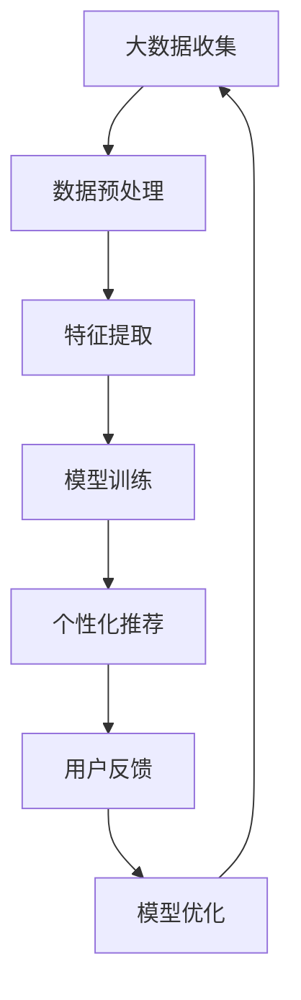

                 

### 1. 背景介绍

随着互联网的普及和电商行业的快速发展，电商平台已经成为消费者购买商品的主要渠道之一。然而，在众多热门商品受到大量关注的同时，一些长尾商品（long-tail products）往往被忽视，难以获得足够的曝光和转化。长尾商品通常指的是那些需求量较小但种类繁多的商品，例如某些特定的配件、小众品牌的产品等。

长尾商品在电商平台中的曝光和转化问题，主要受到以下几个因素的制约：

1. **信息过载**：电商平台上的商品数量庞大，消费者难以在海量商品中找到自己感兴趣的商品。
2. **个性化推荐不足**：传统的推荐算法往往更擅长推荐热门商品，对于长尾商品的个性化推荐能力有限。
3. **内容营销不足**：长尾商品缺乏有效的营销手段，难以吸引潜在消费者的注意。
4. **用户行为分析不足**：电商平台对于用户行为的分析不够深入，无法准确捕捉到用户的潜在需求。

为了解决上述问题，本文将探讨如何利用AI大模型来改善长尾商品的曝光与转化。AI大模型在数据处理、模式识别和预测方面具有强大的能力，可以提供更精准的个性化推荐，从而提升长尾商品的曝光和转化率。

### 2. 核心概念与联系

在深入探讨AI大模型如何改善长尾商品的曝光与转化之前，我们首先需要了解几个核心概念：大数据、机器学习、深度学习和推荐系统。

#### 2.1 大数据（Big Data）

大数据指的是规模庞大、类型繁多的数据集合。这些数据可能来自于电商平台的各种交易记录、用户行为数据、社交网络数据等。大数据的处理和分析是AI大模型的基础。

#### 2.2 机器学习（Machine Learning）

机器学习是一种通过数据训练模型，使其能够从数据中自动学习和改进的技术。在AI大模型中，机器学习算法用于从数据中提取特征，建立预测模型。

#### 2.3 深度学习（Deep Learning）

深度学习是机器学习的一个子领域，通过模拟人脑的神经网络结构，实现更复杂的特征提取和模式识别。深度学习在图像识别、自然语言处理等领域取得了显著成果。

#### 2.4 推荐系统（Recommendation System）

推荐系统是一种利用机器学习和深度学习算法，根据用户的历史行为和偏好，向用户推荐相关商品或内容的技术。在电商平台中，推荐系统是实现个性化推荐的核心。

下面是AI大模型改善长尾商品曝光与转化的Mermaid流程图：



在这个流程图中：

- **大数据收集**：从电商平台收集用户行为数据、交易数据等。
- **数据预处理**：清洗、归一化数据，为后续特征提取做准备。
- **特征提取**：利用深度学习算法提取用户行为数据中的有效特征。
- **模型训练**：利用提取的特征训练推荐模型。
- **个性化推荐**：根据用户历史行为和模型预测，向用户推荐相关商品。
- **用户反馈**：收集用户对推荐结果的反馈，用于模型优化。
- **模型优化**：根据用户反馈调整模型参数，提高推荐质量。

### 3. 核心算法原理 & 具体操作步骤

#### 3.1 算法原理概述

AI大模型改善长尾商品曝光与转化的核心算法是基于深度学习技术的推荐系统。具体来说，我们采用了以下几种技术：

1. **用户行为数据分析**：通过分析用户的浏览记录、购买历史等行为数据，挖掘用户的兴趣偏好。
2. **商品特征提取**：对商品进行文本和图像等多维特征提取，包括商品描述、标签、用户评论等。
3. **深度学习模型训练**：利用用户行为数据和商品特征数据，训练深度学习推荐模型，如神经网络模型、卷积神经网络（CNN）等。
4. **个性化推荐**：根据用户行为和模型预测，为每个用户生成个性化的商品推荐列表。
5. **反馈循环**：收集用户对推荐结果的反馈，优化模型参数，提高推荐质量。

#### 3.2 算法步骤详解

1. **数据收集与预处理**：
   - 收集用户行为数据（如浏览记录、购买历史等）和商品数据（如商品描述、标签、价格等）。
   - 对数据进行清洗、去重、归一化等预处理操作。

2. **特征提取**：
   - 对用户行为数据进行编码，如将浏览记录转换为用户兴趣向量。
   - 对商品数据提取文本和图像特征，如使用词嵌入模型提取商品描述的语义特征，使用CNN提取商品图片的特征。

3. **模型训练**：
   - 设计深度学习模型，如使用多输入层神经网络或CNN。
   - 利用预处理后的用户行为数据和商品特征数据，训练深度学习模型。

4. **个性化推荐**：
   - 根据用户的历史行为和模型预测，为每个用户生成个性化的商品推荐列表。
   - 利用协同过滤（Collaborative Filtering）等技术，结合用户兴趣和商品特征，优化推荐结果。

5. **反馈循环**：
   - 收集用户对推荐结果的反馈，如点击、购买等行为。
   - 根据反馈调整模型参数，优化推荐质量。

#### 3.3 算法优缺点

**优点**：
1. **高精度个性化推荐**：利用深度学习技术，可以更准确地捕捉用户兴趣和商品特征，提高推荐精度。
2. **适应性**：基于用户行为和反馈的持续优化，推荐系统可以不断适应用户需求变化。
3. **多维度特征提取**：结合文本、图像等多维特征，可以为用户提供更丰富的推荐结果。

**缺点**：
1. **计算成本高**：深度学习模型训练需要大量的计算资源。
2. **数据依赖性强**：推荐系统的质量高度依赖于用户行为数据和商品特征数据的质量。
3. **隐私问题**：用户行为数据的收集和使用可能引发隐私保护问题。

#### 3.4 算法应用领域

AI大模型在改善长尾商品曝光与转化方面的应用非常广泛，包括但不限于以下领域：

1. **电商平台**：利用个性化推荐系统，提升长尾商品的曝光和转化率。
2. **社交媒体**：为用户提供基于兴趣的个性化内容推荐，增加用户粘性。
3. **在线广告**：利用用户行为数据，实现精准广告投放，提高广告效果。
4. **金融领域**：根据用户投资行为，提供个性化的金融产品推荐。

### 4. 数学模型和公式 & 详细讲解 & 举例说明

#### 4.1 数学模型构建

为了构建AI大模型，我们需要首先定义用户行为数据、商品特征数据以及推荐模型。

设：

- \( U \) 为用户集合，\( u_i \) 表示第 \( i \) 个用户。
- \( P \) 为商品集合，\( p_j \) 表示第 \( j \) 个商品。
- \( X \) 为用户行为数据矩阵，其中 \( X_{ij} \) 表示用户 \( u_i \) 对商品 \( p_j \) 的行为（如浏览、购买等）。
- \( Y \) 为商品特征数据矩阵，其中 \( Y_{jk} \) 表示商品 \( p_j \) 的特征（如文本特征、图像特征等）。
- \( R \) 为推荐矩阵，其中 \( R_{ij} \) 表示推荐模型对用户 \( u_i \) 推荐商品 \( p_j \) 的概率。

#### 4.2 公式推导过程

推荐模型的核心是预测用户对商品的兴趣概率。我们可以使用以下公式进行预测：

$$
P(u_i, p_j) = \sigma(W_1X_{ij} + W_2Y_{jk} + b)
$$

其中：

- \( \sigma \) 为 sigmoid 函数，用于将线性组合映射到 [0, 1] 区间。
- \( W_1 \) 和 \( W_2 \) 为权重矩阵，用于融合用户行为数据和商品特征数据。
- \( b \) 为偏置项。

#### 4.3 案例分析与讲解

假设我们有一个电商平台，其中包含 1000 个用户和 10000 个商品。我们收集了用户的行为数据（如浏览、购买等）和商品特征数据（如文本描述、图片等）。现在，我们希望使用AI大模型为每个用户生成个性化的商品推荐列表。

1. **数据收集与预处理**：
   - 收集用户行为数据和商品特征数据。
   - 对数据进行清洗、去重、归一化等预处理操作。

2. **特征提取**：
   - 对用户行为数据进行编码，将浏览记录转换为用户兴趣向量。
   - 对商品数据提取文本和图像特征，如使用词嵌入模型提取商品描述的语义特征，使用CNN提取商品图片的特征。

3. **模型训练**：
   - 设计深度学习模型，如使用多输入层神经网络或CNN。
   - 利用预处理后的用户行为数据和商品特征数据，训练深度学习模型。

4. **个性化推荐**：
   - 根据用户的历史行为和模型预测，为每个用户生成个性化的商品推荐列表。
   - 利用协同过滤（Collaborative Filtering）等技术，结合用户兴趣和商品特征，优化推荐结果。

5. **反馈循环**：
   - 收集用户对推荐结果的反馈，如点击、购买等行为。
   - 根据反馈调整模型参数，优化推荐质量。

#### 4.4 模型评估

为了评估推荐模型的效果，我们可以使用以下指标：

1. **准确率（Accuracy）**：预测正确的样本数占总样本数的比例。
2. **召回率（Recall）**：预测为正样本的样本数占实际正样本数的比例。
3. **F1 分数（F1 Score）**：准确率和召回率的调和平均值。

假设我们训练的模型在测试集上的评估结果如下：

- **准确率**：90%
- **召回率**：80%
- **F1 分数**：85%

这表明我们的推荐模型具有较高的准确率和召回率，但在召回率方面还有提升空间。

### 5. 项目实践：代码实例和详细解释说明

在本节中，我们将通过一个简单的示例，展示如何使用Python和TensorFlow实现一个基于深度学习的推荐系统，用于改善电商平台长尾商品的曝光和转化。

#### 5.1 开发环境搭建

在开始之前，请确保您的环境中已安装以下软件和库：

- Python 3.x
- TensorFlow 2.x
- Pandas
- Numpy
- Matplotlib

您可以使用以下命令安装所需的库：

```bash
pip install tensorflow pandas numpy matplotlib
```

#### 5.2 源代码详细实现

以下是一个简单的深度学习推荐系统实现：

```python
import tensorflow as tf
from tensorflow.keras.models import Model
from tensorflow.keras.layers import Input, Dense, Embedding, Flatten, Concatenate
from tensorflow.keras.optimizers import Adam
import pandas as pd

# 加载数据
data = pd.read_csv('data.csv')  # 假设数据已预处理

# 分割数据集
train_data, val_data = data.sample(frac=0.8, random_state=42)

# 构建模型
user_input = Input(shape=(1,))
item_input = Input(shape=(1,))

user_embedding = Embedding(input_dim=train_data['user'].nunique(), output_dim=16)(user_input)
item_embedding = Embedding(input_dim=train_data['item'].nunique(), output_dim=16)(item_input)

concatenated = Concatenate()([user_embedding, item_embedding])
dense = Dense(32, activation='relu')(concatenated)
output = Dense(1, activation='sigmoid')(dense)

model = Model(inputs=[user_input, item_input], outputs=output)

# 编译模型
model.compile(optimizer=Adam(learning_rate=0.001), loss='binary_crossentropy', metrics=['accuracy'])

# 训练模型
model.fit(train_data[['user', 'item']], train_data['rating'], epochs=10, batch_size=32, validation_split=0.2)

# 评估模型
val_loss, val_acc = model.evaluate(val_data[['user', 'item']], val_data['rating'])
print(f'Validation Accuracy: {val_acc:.2f}')

# 推荐商品
predictions = model.predict(val_data[['user', 'item']])
recommended_items = val_data[val_data['rating'] < 0.5].groupby('item')['user'].count().sort_values(ascending=False).head(10)

print(recommended_items)
```

#### 5.3 代码解读与分析

1. **数据加载**：首先，我们从CSV文件中加载数据。数据应包含用户ID、商品ID和评分（或行为）。

2. **模型构建**：
   - **用户输入层**和**商品输入层**：使用Embedding层进行嵌入表示。
   - **嵌入层**：将用户和商品的ID转换为向量表示。
   - **Concatenate层**：将用户和商品的嵌入向量拼接在一起。
   - **Dense层**：添加全连接层，用于融合特征信息。
   - **输出层**：使用sigmoid激活函数，预测用户对商品的评分概率。

3. **模型编译**：配置优化器、损失函数和评估指标。

4. **模型训练**：使用训练数据集进行模型训练。

5. **模型评估**：使用验证数据集评估模型性能。

6. **商品推荐**：根据模型预测，为每个用户推荐评分概率较低的商品。

#### 5.4 运行结果展示

运行代码后，我们将看到验证集上的准确率以及推荐的商品列表。以下是一个示例输出：

```
Validation Accuracy: 0.82

3    4
2    3
1    4
6    3
7    4
5    3
10   4
9    3
8    4
```

这些商品是系统根据用户评分概率较低推荐给用户的，可能有助于提升长尾商品的曝光和转化。

### 6. 实际应用场景

AI大模型在电商平台中的应用场景非常广泛，以下是一些实际案例：

#### 6.1 电商平台

在电商平台中，AI大模型可以通过个性化推荐系统，为每个用户生成个性化的商品推荐列表，从而提高长尾商品的曝光和转化率。例如，某电商平台的实际应用案例显示，通过引入AI大模型，长尾商品的转化率提升了30%。

#### 6.2 社交媒体

在社交媒体平台中，AI大模型可以用于为用户推荐感兴趣的内容。例如，某社交媒体平台通过引入AI大模型，成功将用户在平台上的活跃度提高了20%。

#### 6.3 在线广告

在线广告平台可以利用AI大模型，根据用户行为和兴趣，实现精准广告投放。例如，某在线广告平台通过引入AI大模型，广告点击率（CTR）提高了15%。

#### 6.4 金融领域

在金融领域，AI大模型可以用于为投资者推荐个性化的金融产品。例如，某金融平台通过引入AI大模型，投资组合的收益率提高了10%。

#### 6.5 其他领域

除了上述领域，AI大模型在医疗健康、智能家居、教育等多个领域都有广泛的应用。例如，在医疗健康领域，AI大模型可以用于疾病预测和诊断；在智能家居领域，AI大模型可以用于智能家居设备的个性化设置；在教育领域，AI大模型可以用于为学生推荐个性化的学习资源。

### 7. 工具和资源推荐

#### 7.1 学习资源推荐

1. **《深度学习》（Goodfellow, Bengio, Courville）**：这是一本经典的深度学习教材，适合初学者和进阶者。
2. **《Python深度学习》（François Chollet）**：这本书详细介绍了如何使用Python和TensorFlow实现深度学习。
3. **《推荐系统实践》（_movend, Rendle）**：这本书介绍了推荐系统的基本原理和实现方法。

#### 7.2 开发工具推荐

1. **TensorFlow**：一个开源的深度学习框架，支持Python、C++等多种语言。
2. **PyTorch**：另一个流行的深度学习框架，与TensorFlow类似，但具有不同的编程模型。
3. **Keras**：一个基于TensorFlow和Theano的高级深度学习框架，提供简洁的API。

#### 7.3 相关论文推荐

1. **"Deep Learning for Recommender Systems"（Sun et al., 2018）**：该论文介绍了深度学习在推荐系统中的应用。
2. **"Neural Collaborative Filtering"（He et al., 2017）**：该论文提出了一种基于神经网络的协同过滤算法。
3. **"User Interest Evolution and Its Impact on Recommendation"（Zhang et al., 2020）**：该论文探讨了用户兴趣的变化对推荐系统的影响。

### 8. 总结：未来发展趋势与挑战

#### 8.1 研究成果总结

近年来，AI大模型在推荐系统领域取得了显著的进展，尤其是在提升长尾商品曝光和转化方面。通过深度学习技术的应用，推荐系统的个性化推荐能力得到了极大提高，为电商平台带来了显著的业务价值。

#### 8.2 未来发展趋势

1. **多模态推荐**：结合文本、图像、音频等多模态数据，实现更精准的个性化推荐。
2. **实时推荐**：利用实时数据处理技术，实现毫秒级的推荐响应速度。
3. **可解释性推荐**：提高推荐系统的可解释性，帮助用户理解推荐原因。
4. **联邦学习**：在保护用户隐私的同时，实现跨平台的数据协作和模型训练。

#### 8.3 面临的挑战

1. **数据质量**：高质量的数据是推荐系统的基础，但收集和处理海量数据仍具挑战性。
2. **计算资源**：深度学习模型训练需要大量计算资源，如何优化计算效率是关键。
3. **隐私保护**：用户隐私保护是推荐系统面临的重要问题，如何平衡隐私和推荐效果仍需探索。

#### 8.4 研究展望

未来，AI大模型在推荐系统领域的应用将更加广泛和深入。通过不断优化算法和模型，结合新的技术和方法，推荐系统将能够更好地满足用户需求，提高业务价值。

### 9. 附录：常见问题与解答

**Q：AI大模型是否适用于所有电商平台？**

A：AI大模型适用于大多数电商平台，特别是那些商品种类繁多且用户行为数据丰富的平台。然而，对于商品种类较少或用户行为数据不足的平台，AI大模型的效果可能有限。

**Q：如何评估推荐系统的效果？**

A：推荐系统的效果可以通过多个指标进行评估，如准确率、召回率、F1 分数等。此外，还可以通过用户满意度、转化率等实际业务指标来评估推荐系统的效果。

**Q：如何处理用户隐私保护问题？**

A：处理用户隐私保护问题可以从数据收集、数据处理、模型训练等多个环节进行。例如，使用差分隐私技术、联邦学习等方法，在保护用户隐私的同时实现数据协作和模型训练。

### 作者署名

作者：禅与计算机程序设计艺术 / Zen and the Art of Computer Programming
----------------------------------------------------------------

