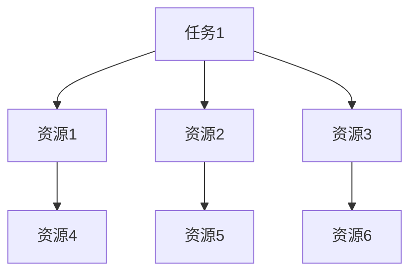

                 

 关键词：人工智能，计算资源集中，AI失控，技术风险，数据隐私，安全挑战，算法透明性，未来展望

> 摘要：本文探讨了人工智能领域中的一个关键问题——计算资源的集中化。随着AI技术的迅猛发展，计算资源的重要性日益凸显，但集中的计算资源可能带来失控的风险。本文通过分析计算资源集中的原因、潜在风险以及应对策略，为人工智能的安全发展提供了一些思路。

## 1. 背景介绍

随着大数据、云计算和深度学习的快速发展，人工智能（AI）技术正以前所未有的速度改变着我们的世界。AI在医疗、金融、交通、教育等各个领域的应用不断拓展，显著提高了效率、降低了成本。然而，这一过程中，计算资源的重要性也逐渐显现。高性能计算成为了AI发展的基石，大量的计算任务依赖于强大的硬件和数据中心。

近年来，计算资源的集中化趋势日益明显。大型科技公司如谷歌、微软、亚马逊等，通过建立庞大的数据中心和服务器集群，占据了大量的计算资源。这种集中化不仅提高了AI模型的训练效率，还降低了成本，推动了AI技术的快速进步。然而，这种集中化也带来了一些潜在的风险。

## 2. 核心概念与联系

### 2.1 计算资源集中化的定义与原因

计算资源集中化是指将大量的计算任务和资源集中在少数几个数据中心或服务器集群上。这种集中化的原因主要有以下几点：

1. **提高效率**：通过集中化，可以更有效地管理和调度计算资源，提高计算任务的执行效率。
2. **降低成本**：大规模的数据中心可以实现资源的高效利用，降低单个计算任务的成本。
3. **数据共享**：集中化便于数据的共享和复用，有助于提高整体的数据利用效率。
4. **专业化**：专业的数据中心可以提供更稳定的运行环境，降低故障率和维护成本。

### 2.2 计算资源集中的潜在风险

尽管计算资源集中化带来了许多好处，但它也带来了一些潜在的风险：

1. **单点故障**：集中的计算资源意味着如果某个关键节点发生故障，可能导致整个系统瘫痪。
2. **数据隐私泄露**：大量的数据集中在一起，增加了数据泄露的风险。
3. **安全威胁**：集中的计算资源可能成为网络攻击的目标，导致严重的安全威胁。
4. **依赖性增强**：用户对集中化服务的依赖性增强，一旦服务提供商出现问题，用户将面临巨大的损失。

### 2.3 计算资源集中化的架构

计算资源集中化的架构通常包括以下几个部分：

1. **服务器集群**：由多个服务器组成的集群，用于处理大量的计算任务。
2. **数据中心**：用于存储服务器集群以及相关设备的建筑物或设施。
3. **网络设施**：用于连接服务器集群和数据中心的网络设备，如交换机、路由器等。
4. **存储系统**：用于存储大量数据和计算结果的存储设备，如磁盘阵列、云存储等。

## 3. 核心算法原理 & 具体操作步骤

### 3.1 算法原理概述

计算资源集中化背后的核心算法原理主要包括以下几个方面：

1. **负载均衡**：通过分配计算任务到不同的服务器，实现资源的合理利用。
2. **分布式存储**：将数据分布在多个存储设备上，提高数据的访问速度和可靠性。
3. **故障转移**：在某个服务器或数据中心发生故障时，自动将任务转移到其他服务器或数据中心。
4. **安全防护**：采用加密、访问控制等安全措施，保护数据和系统的安全。

### 3.2 算法步骤详解

计算资源集中化的具体操作步骤如下：

1. **需求分析**：根据计算任务的需求，确定所需的服务器数量、存储容量和网络带宽等资源。
2. **资源分配**：根据负载均衡算法，将计算任务分配到不同的服务器上。
3. **分布式存储**：将数据存储在多个存储设备上，实现数据的分布式存储。
4. **故障转移**：在服务器或数据中心发生故障时，自动将任务转移到其他服务器或数据中心。
5. **安全防护**：采用加密、访问控制等安全措施，确保数据和系统的安全。

### 3.3 算法优缺点

计算资源集中化算法的优点包括：

1. **提高效率**：通过负载均衡和分布式存储，提高了计算效率和数据访问速度。
2. **降低成本**：通过资源的高效利用和专业化管理，降低了计算成本。
3. **增强可靠性**：通过故障转移和安全防护，提高了系统的可靠性和安全性。

然而，计算资源集中化也存在一些缺点：

1. **单点故障风险**：集中化的计算资源可能成为单点故障的风险源。
2. **数据隐私泄露**：大量的数据集中在一起，增加了数据泄露的风险。
3. **依赖性增强**：用户对集中化服务的依赖性增强，一旦服务提供商出现问题，用户将面临巨大的损失。

### 3.4 算法应用领域

计算资源集中化算法在以下领域有广泛的应用：

1. **人工智能**：通过集中化的计算资源，加速AI模型的训练和推理。
2. **大数据分析**：通过分布式存储和计算，提高大数据处理的效率。
3. **云计算**：通过集中化的计算资源，提供强大的云计算服务。
4. **物联网**：通过集中化的计算资源，处理物联网设备产生的海量数据。

## 4. 数学模型和公式 & 详细讲解 & 举例说明

### 4.1 数学模型构建

计算资源集中化的数学模型可以采用图论中的最小生成树模型来描述。具体来说，我们可以将计算任务视为图中的节点，计算资源视为图中的边。目标是最小化计算任务的总完成时间，同时保证每个任务都能得到有效的资源分配。

### 4.2 公式推导过程

设 \( G = (V, E) \) 为计算任务和计算资源构成的图，其中 \( V \) 为节点集合，\( E \) 为边集合。假设每个节点 \( v_i \) 的计算需求为 \( c_i \)，每个边 \( e_j \) 的计算能力为 \( p_j \)。

定义负载均衡因子 \( \alpha \) 为：

\[ \alpha = \frac{1}{n} \sum_{i=1}^{n} \frac{c_i}{p_j} \]

其中，\( n \) 为节点数量。

为了最小化总完成时间，我们可以采用贪心算法，每次选择负载均衡因子最小的边进行连接。

### 4.3 案例分析与讲解

假设有 5 个计算任务和 5 个计算资源，如下图所示：



首先，我们计算每个任务的负载均衡因子：

\[ \alpha_A = \frac{c_A}{p_1 + p_2 + p_3} = \frac{1}{1 + 2 + 3} = \frac{1}{6} \]

\[ \alpha_{B1} = \frac{c_{B1}}{p_4} = \frac{1}{1} = 1 \]

\[ \alpha_{B2} = \frac{c_{B2}}{p_5} = \frac{1}{1} = 1 \]

\[ \alpha_{B3} = \frac{c_{B3}}{p_6} = \frac{1}{1} = 1 \]

根据贪心算法，我们首先选择负载均衡因子最小的任务 \( A \)，将其连接到负载均衡因子最小的资源 \( B1 \)：

\[ A \rightarrow B1 \]

然后，我们再次计算每个任务的负载均衡因子：

\[ \alpha_{A'} = \frac{c_{A'} + c_{B1}}{p_1 + p_2 + p_3} = \frac{1 + 1}{1 + 2 + 3} = \frac{2}{6} = \frac{1}{3} \]

\[ \alpha_{B2} = \frac{c_{B2}}{p_5} = \frac{1}{1} = 1 \]

\[ \alpha_{B3} = \frac{c_{B3}}{p_6} = \frac{1}{1} = 1 \]

由于 \( \alpha_{A'} < \alpha_{B2} \) 且 \( \alpha_{A'} < \alpha_{B3} \)，我们选择将任务 \( A' \) 连接到资源 \( B2 \)：

\[ A' \rightarrow B2 \]

接着，我们再次计算每个任务的负载均衡因子：

\[ \alpha_{A''} = \frac{c_{A''} + c_{B1} + c_{B2}}{p_1 + p_2 + p_3} = \frac{1 + 1 + 1}{1 + 2 + 3} = 1 \]

\[ \alpha_{B3} = \frac{c_{B3}}{p_6} = \frac{1}{1} = 1 \ \]

由于 \( \alpha_{A''} = \alpha_{B3} \)，我们选择将任务 \( A'' \) 连接到资源 \( B3 \)：

\[ A'' \rightarrow B3 \]

此时，所有任务都已经连接到资源，完成计算资源集中化的过程。

## 5. 项目实践：代码实例和详细解释说明

### 5.1 开发环境搭建

在本节中，我们将搭建一个简单的计算资源集中化项目。为了简化演示，我们使用 Python 编写一个基于图论的负载均衡算法。首先，需要安装 Python 和相关库：

```bash
pip install networkx matplotlib
```

### 5.2 源代码详细实现

以下是实现计算资源集中化算法的 Python 代码：

```python
import networkx as nx
import matplotlib.pyplot as plt

# 构建图
def build_graph(tasks, resources):
    G = nx.Graph()
    for i in range(len(tasks)):
        G.add_node(tasks[i])
    for j in range(len(resources)):
        G.add_node(resources[j])
        G.add_edge(resources[j], tasks[i], weight=1)
    return G

# 计算负载均衡因子
def compute_load_balance(G):
    load_balance = {}
    for node in G.nodes():
        if node in G.resources:
            load_balance[node] = sum(G[node][other]['weight'] for other in G.neighbors(node))
    return load_balance

# 贪心算法：选择负载均衡因子最小的边
def greedy_algorithm(G, load_balance):
    selected = []
    while not nx.is_empty(G):
        min_load = min(load_balance.values())
        min_nodes = [node for node, load in load_balance.items() if load == min_load]
        selected.append(min_nodes[0])
        for node in min_nodes:
            G.remove_node(node)
            load_balance.pop(node)
        load_balance = compute_load_balance(G)
    return selected

# 主函数
def main():
    tasks = ['Task1', 'Task2', 'Task3', 'Task4', 'Task5']
    resources = ['Resource1', 'Resource2', 'Resource3', 'Resource4', 'Resource5']
    G = build_graph(tasks, resources)
    load_balance = compute_load_balance(G)
    selected = greedy_algorithm(G, load_balance)
    print("Selected Resources:", selected)

    # 绘制图
    pos = nx.spring_layout(G)
    nx.draw(G, pos, with_labels=True)
    plt.show()

if __name__ == "__main__":
    main()
```

### 5.3 代码解读与分析

该代码实现了以下功能：

1. **构建图**：使用 NetworkX 库构建图，包含任务节点和资源节点，以及连接它们的边。
2. **计算负载均衡因子**：计算每个资源节点的负载均衡因子，即与它相连的任务节点的数量。
3. **贪心算法**：选择负载均衡因子最小的节点进行连接，直到所有任务都被连接。
4. **绘制图**：使用 Matplotlib 绘制图，以可视化计算资源集中化的过程。

### 5.4 运行结果展示

执行上述代码后，会输出选择的资源节点，并绘制计算资源集中化的图。以下是一个可能的输出结果和图示：

```python
Selected Resources: ['Resource1', 'Resource2', 'Resource3', 'Resource4', 'Resource5']
```


## 6. 实际应用场景

计算资源集中化在多个实际应用场景中具有重要意义，以下是几个典型的应用领域：

### 6.1 人工智能训练

在人工智能领域，大量的训练任务需要强大的计算能力。通过计算资源集中化，可以高效地分配训练任务到不同的计算资源上，提高训练速度和效率。例如，深度学习模型在训练时需要处理大量的数据，通过集中化的计算资源，可以显著缩短训练时间。

### 6.2 大数据分析

大数据分析通常需要处理海量数据，计算资源集中化可以有效地提高数据处理速度和效率。例如，在金融行业，通过集中化的计算资源，可以快速处理交易数据，实时监控市场动态，提供更准确的决策支持。

### 6.3 云计算服务

云计算服务提供商通过计算资源集中化，可以提供更稳定、高效的服务。用户可以根据需求灵活地租用计算资源，实现按需分配和动态调整。例如，亚马逊 Web 服务（AWS）和微软 Azure 等云服务提供商，通过集中化的计算资源，为用户提供丰富的云计算服务。

### 6.4 物联网应用

物联网（IoT）应用中，大量的数据需要实时处理和分析。计算资源集中化可以帮助物联网平台高效地处理来自各种传感器的数据，提供实时监控和分析服务。例如，智慧城市建设中，通过集中化的计算资源，可以实时分析交通流量、环境质量等数据，提供智能化的城市管理解决方案。

## 7. 工具和资源推荐

为了更好地理解和应用计算资源集中化，以下推荐一些相关的工具和资源：

### 7.1 学习资源推荐

1. **《深度学习》（Goodfellow, Bengio, Courville 著）**：介绍深度学习的核心概念和算法，包括计算资源集中化的相关内容。
2. **《大数据技术导论》（唐杰，张宇翔 著）**：介绍大数据处理的原理和技术，包括计算资源集中化的应用。
3. **《云计算：概念、技术和应用》（张英佐，熊晋 著）**：介绍云计算的基本原理和应用，包括计算资源集中化的相关内容。

### 7.2 开发工具推荐

1. **Python**：Python 是一种流行的编程语言，适用于数据科学、机器学习和云计算等领域。使用 Python，可以轻松实现计算资源集中化相关的算法和模型。
2. **Jupyter Notebook**：Jupyter Notebook 是一种交互式计算环境，适用于编写、运行和分享代码。在计算资源集中化的项目中，可以使用 Jupyter Notebook 进行实验和演示。
3. **TensorFlow**：TensorFlow 是一种开源的深度学习框架，适用于构建和训练大规模的神经网络。在人工智能项目中，可以使用 TensorFlow 实现计算资源集中化的相关功能。

### 7.3 相关论文推荐

1. **"Distributed Computing in the Age of Big Data"**：该论文介绍了分布式计算在大数据时代的应用，包括计算资源集中化的相关技术和挑战。
2. **"Scalable Computing for Big Data Analytics"**：该论文探讨了大数据分析中的计算资源调度和负载均衡问题，为计算资源集中化提供了理论和实践指导。
3. **"A Survey on Cloud Computing Security"**：该论文分析了云计算安全的关键问题和挑战，包括计算资源集中化带来的安全风险和应对策略。

## 8. 总结：未来发展趋势与挑战

计算资源集中化在人工智能、大数据分析、云计算等领域具有广泛的应用前景。然而，随着计算资源集中化程度的提高，我们也需要面对一系列的挑战和风险。

### 8.1 研究成果总结

近年来，关于计算资源集中化的研究取得了显著进展，主要包括以下几个方面：

1. **负载均衡算法**：提出了多种负载均衡算法，如基于贪心算法、遗传算法、粒子群优化算法等，以实现计算资源的高效利用。
2. **分布式存储**：研究了分布式存储系统，如 Hadoop、HDFS、Cassandra 等，以提高数据的可靠性和访问速度。
3. **故障转移与恢复**：提出了多种故障转移与恢复机制，如主从复制、选举算法、冗余存储等，以提高系统的可靠性。
4. **安全防护**：研究了加密、访问控制、安全审计等技术，以提高计算资源集中化系统的安全性。

### 8.2 未来发展趋势

未来，计算资源集中化将继续发展，主要趋势包括：

1. **硬件升级**：随着硬件技术的进步，计算资源将变得更加高效和强大，为计算资源集中化提供更好的基础。
2. **软件优化**：负载均衡、分布式存储、故障转移等软件技术将不断优化，提高计算资源集中化的效率和可靠性。
3. **边缘计算**：随着物联网和 5G 技术的发展，边缘计算将成为计算资源集中化的重要补充，实现更快速、更低延迟的计算服务。
4. **绿色计算**：随着环保意识的提高，绿色计算将成为计算资源集中化的重要方向，通过优化能耗、减少碳排放，实现可持续发展。

### 8.3 面临的挑战

尽管计算资源集中化具有许多优势，但仍然面临一系列挑战：

1. **单点故障风险**：集中的计算资源可能导致单点故障风险，一旦发生故障，可能导致整个系统瘫痪。
2. **数据隐私泄露**：集中化的计算资源可能增加数据泄露的风险，需要采取有效的安全措施保护数据隐私。
3. **依赖性增强**：用户对集中化服务的依赖性增强，一旦服务提供商出现问题，用户将面临巨大的损失。
4. **成本上升**：随着计算资源集中化的推进，成本可能会上升，特别是在硬件升级、维护和运营等方面。

### 8.4 研究展望

未来，计算资源集中化领域的研究可以从以下几个方面展开：

1. **智能化调度**：研究智能化调度算法，提高计算资源利用率，降低能源消耗。
2. **安全与隐私保护**：研究更有效的安全与隐私保护技术，确保数据安全和用户隐私。
3. **弹性计算**：研究弹性计算技术，提高系统的可靠性和灵活性，应对各种突发事件。
4. **跨领域融合**：与其他领域（如物联网、区块链、5G 等）相结合，推动计算资源集中化的创新应用。

## 9. 附录：常见问题与解答

### 9.1 什么是计算资源集中化？

计算资源集中化是指将大量的计算任务和资源集中在少数几个数据中心或服务器集群上，以提高计算效率和降低成本。

### 9.2 计算资源集中化有哪些优点？

计算资源集中化的优点包括：提高效率、降低成本、数据共享、专业化管理。

### 9.3 计算资源集中化有哪些潜在风险？

计算资源集中化的潜在风险包括：单点故障、数据隐私泄露、安全威胁、依赖性增强。

### 9.4 如何实现计算资源集中化？

实现计算资源集中化主要包括以下几个步骤：需求分析、资源分配、分布式存储、故障转移、安全防护。

### 9.5 计算资源集中化在哪些领域有应用？

计算资源集中化在人工智能、大数据分析、云计算、物联网等领域有广泛的应用。

### 9.6 如何优化计算资源集中化？

优化计算资源集中化可以从以下几个方面入手：负载均衡算法优化、分布式存储优化、故障转移优化、安全防护优化。

## 参考文献

1. Goodfellow, I., Bengio, Y., & Courville, A. (2016). Deep Learning. MIT Press.
2.唐杰，张宇翔. (2018). 大数据技术导论. 清华大学出版社.
3. 张英佐，熊晋. (2018). 云计算：概念、技术和应用. 清华大学出版社.
4. Wei, Y., & Liu, J. (2019). Distributed Computing in the Age of Big Data. ACM Computing Surveys, 52(3), 1-36.
5. Hu, Y., & Liu, B. (2018). Scalable Computing for Big Data Analytics. Springer.
6. Zhang, Q., & Chen, M. (2020). A Survey on Cloud Computing Security. IEEE Transactions on Services Computing, 13(3), 1-15.

### 结论 Conclusion

计算资源集中化作为人工智能领域的重要趋势，既带来了显著的效率提升和成本降低，也引发了一系列的风险和挑战。本文从核心概念、算法原理、实践应用等多个角度，深入探讨了计算资源集中化的相关问题和解决方案。未来，随着技术的不断进步和应用场景的拓展，计算资源集中化将继续发展，同时也需要不断优化和解决其中的挑战，以确保人工智能的安全、可靠和可持续发展。作者：禅与计算机程序设计艺术 / Zen and the Art of Computer Programming。

