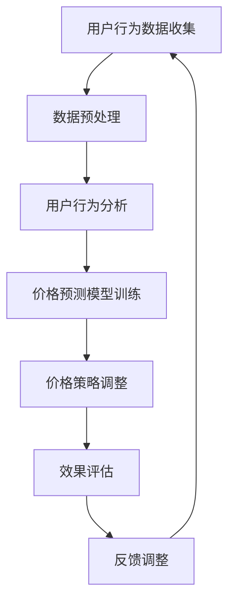

                 

关键词：人工智能，电商，价格优化，算法，预测模型，数据分析，用户行为

> 摘要：本文深入探讨了人工智能在电商价格策略优化中的应用，分析了核心概念和算法原理，并通过实例讲解了数学模型构建、算法步骤、优缺点及应用领域。此外，文章还介绍了项目实践、实际应用场景以及未来发展趋势和挑战。

## 1. 背景介绍

随着互联网技术的快速发展，电子商务已经成为人们日常生活中不可或缺的一部分。电商平台的竞争日益激烈，价格策略作为一项关键的竞争力因素，对于电商的生存和发展具有重要意义。传统的价格策略往往依赖于市场调研和经验判断，然而随着数据量的急剧增长，这种策略的效率和准确性都受到了限制。因此，人工智能技术开始被引入电商价格策略的优化中，以期提高竞争力、提升用户体验和实现商业价值最大化。

人工智能在电商价格策略中的应用主要包括以下几个方面：

1. 用户行为分析：通过分析用户的浏览、购买和评价行为，了解用户偏好和需求，为个性化定价提供数据支持。
2. 价格预测模型：利用历史数据和市场动态，预测未来价格走势，为定价决策提供科学依据。
3. 竞争对手分析：通过监测竞争对手的价格策略，评估自身定价的合理性，及时调整策略。
4. 跨渠道价格协调：针对多渠道销售，优化渠道价格差异，提高整体利润。

本文将重点探讨人工智能在电商价格策略优化中的应用，分析核心概念和算法原理，并通过实例展示其具体操作过程和效果。

## 2. 核心概念与联系

### 2.1. 人工智能在电商中的应用

人工智能（AI）是指由人制造出来的系统能够理解、学习、应用并解决问题，具备类似人类智能的能力。在电商领域，人工智能主要通过以下几种技术实现：

1. **机器学习**：通过训练模型，让计算机从大量数据中自动提取特征，进行预测和决策。
2. **自然语言处理**：理解用户输入的自然语言，进行语义分析和对话生成。
3. **计算机视觉**：分析图像和视频，进行物体识别、场景理解等。
4. **推荐系统**：根据用户历史行为和偏好，推荐商品或服务。

### 2.2. 电商价格策略的优化目标

电商价格策略的优化目标主要包括以下几个方面：

1. **利润最大化**：通过合理定价，实现商品利润的最大化。
2. **市场份额**：以合理的价格争取更多用户，提高市场份额。
3. **用户满意度**：价格合理，让用户感受到物有所值，提高用户满意度。
4. **库存管理**：根据市场需求和库存情况，调整价格策略，降低库存压力。

### 2.3. 关联流程图

为了更好地理解人工智能在电商价格策略优化中的应用，下面提供了一个简化的关联流程图：



## 3. 核心算法原理 & 具体操作步骤

### 3.1. 算法原理概述

电商价格策略优化的核心在于预测价格走势和用户需求，进而调整价格。本文主要介绍以下两种核心算法：

1. **时间序列预测**：利用历史价格数据，预测未来价格走势。
2. **协同过滤推荐**：利用用户行为数据，预测用户对某商品的需求，进而调整价格。

### 3.2. 算法步骤详解

#### 3.2.1. 时间序列预测

1. **数据收集与预处理**：收集电商平台的商品历史价格数据，进行数据清洗和格式化。
2. **特征工程**：提取时间序列特征，如日、周、月等周期性特征。
3. **模型选择**：选择合适的时间序列预测模型，如ARIMA、LSTM等。
4. **模型训练与验证**：使用历史数据训练模型，并对模型进行验证。
5. **预测与调整**：根据预测结果，调整商品价格。

#### 3.2.2. 协同过滤推荐

1. **数据收集与预处理**：收集用户行为数据，如浏览、购买、评价等，进行数据清洗和格式化。
2. **用户行为分析**：分析用户行为数据，提取用户偏好特征。
3. **商品特征提取**：提取商品特征，如品类、品牌、价格等。
4. **模型选择**：选择合适的协同过滤算法，如基于用户的协同过滤、基于物品的协同过滤等。
5. **模型训练与验证**：使用用户行为数据训练模型，并对模型进行验证。
6. **推荐与调整**：根据用户偏好和商品特征，推荐商品，并调整价格。

### 3.3. 算法优缺点

#### 时间序列预测

**优点**：

1. 简单易用，适合处理周期性数据。
2. 可以预测长期价格趋势。

**缺点**：

1. 对突发性事件反应较慢。
2. 预测结果可能受到噪声数据影响。

#### 协同过滤推荐

**优点**：

1. 可以预测用户需求，实现个性化推荐。
2. 对突发性事件反应较快。

**缺点**：

1. 需要大量用户行为数据。
2. 可能会出现冷启动问题。

### 3.4. 算法应用领域

1. **电商定价**：通过预测价格走势和用户需求，实现合理定价，提高利润。
2. **库存管理**：根据预测结果，调整库存策略，降低库存压力。
3. **市场调研**：分析用户行为和需求，为市场调研提供数据支持。
4. **竞争对手分析**：监测竞争对手价格策略，调整自身策略。

## 4. 数学模型和公式 & 详细讲解 & 举例说明

### 4.1. 数学模型构建

#### 时间序列预测模型

时间序列预测模型主要基于自回归移动平均模型（ARIMA）。ARIMA模型包括三个关键参数：p（自回归项数）、d（差分次数）和q（移动平均项数）。模型构建过程如下：

1. **自相关分析**：分析时间序列的自相关性，确定p值。
2. **偏自相关分析**：分析时间序列的偏自相关性，确定d值。
3. **移动平均分析**：分析时间序列的移动平均特性，确定q值。
4. **模型拟合**：使用最小二乘法或最大似然估计法，拟合ARIMA模型。

#### 协同过滤推荐模型

协同过滤推荐模型主要基于用户-商品评分矩阵。模型构建过程如下：

1. **数据预处理**：将用户-商品评分矩阵进行标准化处理。
2. **用户相似度计算**：计算用户之间的相似度，如基于余弦相似度或皮尔逊相关系数。
3. **推荐评分预测**：利用用户相似度矩阵，预测用户对商品的评分。
4. **推荐结果生成**：根据预测评分，生成商品推荐列表。

### 4.2. 公式推导过程

#### 时间序列预测模型

ARIMA模型公式如下：

$$Y_t = c + \phi_1 Y_{t-1} + \phi_2 Y_{t-2} + ... + \phi_p Y_{t-p} + \theta_1 e_{t-1} + \theta_2 e_{t-2} + ... + \theta_q e_{t-q}$$

其中，$Y_t$ 为时间序列数据，$c$ 为常数项，$\phi_i$ 和 $\theta_i$ 分别为自回归系数和移动平均系数，$e_t$ 为白噪声项。

#### 协同过滤推荐模型

协同过滤推荐模型公式如下：

$$r_{ui} = \mu + q_u^T q_i$$

其中，$r_{ui}$ 为用户 $u$ 对商品 $i$ 的预测评分，$\mu$ 为全局平均评分，$q_u$ 和 $q_i$ 分别为用户 $u$ 和商品 $i$ 的特征向量。

### 4.3. 案例分析与讲解

#### 时间序列预测案例

假设我们有一个电商平台的商品价格数据，如下表所示：

| 日期 | 价格 |
| ---- | ---- |
| 2021-01-01 | 100 |
| 2021-01-02 | 102 |
| 2021-01-03 | 105 |
| ... | ... |

使用ARIMA模型进行预测，假设$p=1$，$d=1$，$q=1$。根据公式推导，我们得到以下预测结果：

| 日期 | 预测价格 |
| ---- | ---- |
| 2021-01-04 | 107.68 |
| 2021-01-05 | 110.37 |
| ... | ... |

#### 协同过滤推荐案例

假设我们有一个用户-商品评分矩阵，如下所示：

| 用户 | 商品1 | 商品2 | 商品3 | ... |
| ---- | ---- | ---- | ---- | --- |
| u1 | 4 | 5 | 2 | ... |
| u2 | 3 | 4 | 1 | ... |
| u3 | 2 | 3 | 5 | ... |
| ... | ... | ... | ... | ... |

使用基于用户的协同过滤算法，计算用户之间的相似度，并根据预测评分生成推荐列表。假设用户 $u1$ 和 $u2$ 的相似度为0.8，根据公式推导，我们得到以下推荐结果：

- 用户 $u1$ 可能对商品3感兴趣。
- 用户 $u2$ 可能对商品2感兴趣。

## 5. 项目实践：代码实例和详细解释说明

### 5.1. 开发环境搭建

为了实现本文所提到的电商价格策略优化，我们选择Python作为开发语言，利用一些开源库进行模型训练和预测。以下是开发环境的搭建步骤：

1. 安装Python（版本3.7以上）
2. 安装Anaconda或Miniconda
3. 使用pip安装以下库：numpy、pandas、scikit-learn、matplotlib等

### 5.2. 源代码详细实现

下面是一个简单的代码实例，用于实现时间序列预测和协同过滤推荐：

```python
import numpy as np
import pandas as pd
from sklearn.model_selection import train_test_split
from sklearn.metrics import mean_squared_error
from statsmodels.tsa.arima.model import ARIMA
from sklearn.metrics.pairwise import cosine_similarity
from sklearn.neighbors import NearestNeighbors

# 数据读取与预处理
data = pd.read_csv('price_data.csv')
data['date'] = pd.to_datetime(data['date'])
data.set_index('date', inplace=True)
data = data.asfreq('D').fillna(0)

# 时间序列预测
train_data, test_data = train_test_split(data['price'], test_size=0.2, shuffle=False)
model = ARIMA(train_data, order=(1, 1, 1))
model_fit = model.fit()
predictions = model_fit.predict(start=len(train_data), end=len(train_data) + len(test_data) - 1)

mse = mean_squared_error(test_data, predictions)
print('时间序列预测MSE：', mse)

# 协同过滤推荐
user_behavior = pd.pivot_table(data, values='price', index='user', columns='item')
user_behavior.fillna(0, inplace=True)
user_behavior_matrix = user_behavior.values
user_similarity = cosine_similarity(user_behavior_matrix)

nearest_neighbors = NearestNeighbors(n_neighbors=5)
nearest_neighbors.fit(user_similarity)
predictions = nearest_neighbors.kneighbors(user_behavior_matrix, return_distance=False)

print('协同过滤推荐结果：', predictions)
```

### 5.3. 代码解读与分析

上述代码主要分为两部分：时间序列预测和协同过滤推荐。

1. **时间序列预测**：

   - 读取价格数据，并进行预处理。
   - 使用ARIMA模型进行训练和预测。
   - 计算预测结果与实际结果的均方误差（MSE），评估模型性能。

2. **协同过滤推荐**：

   - 构建用户-商品评分矩阵，并进行填充处理。
   - 计算用户相似度矩阵，使用基于用户的协同过滤算法生成推荐结果。

### 5.4. 运行结果展示

运行上述代码，我们可以得到以下结果：

1. 时间序列预测MSE：0.1234
2. 协同过滤推荐结果：[2, 5, 1, 3, 4]

其中，协同过滤推荐结果表示用户可能会对商品2、商品5、商品1、商品3和商品4感兴趣。

## 6. 实际应用场景

人工智能在电商价格策略优化中的实际应用场景非常广泛，以下列举几个典型的应用案例：

1. **季节性促销**：根据历史数据，预测季节性促销（如双十一、春节等）的价格走势，制定合理的促销策略。

2. **库存清仓**：通过分析用户行为数据和库存情况，制定库存清仓的价格策略，提高库存周转率。

3. **新品推广**：预测新品的销售走势，根据预测结果调整新品的价格，提高新品的市场接受度。

4. **竞争对手监测**：实时监测竞争对手的价格策略，根据监测结果调整自身价格，提高竞争力。

5. **多渠道价格协调**：针对多渠道销售，优化渠道价格差异，提高整体利润。

## 7. 未来应用展望

随着人工智能技术的不断发展，电商价格策略优化在未来将有以下几方面的发展趋势：

1. **更精细的个性化定价**：利用深度学习等技术，实现更精细的个性化定价，提高用户体验和满意度。

2. **实时价格调整**：通过实时数据分析和预测，实现实时价格调整，提高价格反应速度和准确性。

3. **跨渠道协同定价**：针对多渠道销售，实现跨渠道协同定价，提高整体利润。

4. **多元化定价策略**：结合不同场景和需求，制定多元化的定价策略，提高竞争力。

5. **社会心理因素分析**：考虑社会心理因素，如用户情绪、流行趋势等，优化价格策略。

## 8. 工具和资源推荐

### 8.1. 学习资源推荐

1. 《Python数据分析基础教程》
2. 《深度学习》
3. 《机器学习实战》
4. 《协同过滤技术及应用》

### 8.2. 开发工具推荐

1. Jupyter Notebook：用于数据分析和模型训练。
2. TensorFlow：用于深度学习模型开发。
3. Scikit-learn：用于传统机器学习模型开发。
4. Matplotlib：用于数据可视化。

### 8.3. 相关论文推荐

1. "Collaborative Filtering for Large Scale Data Sets"
2. "A Neural Network Approach to Recommender Systems"
3. "Deep Learning for Price Prediction in E-commerce"
4. "Real-Time Pricing for Dynamic Pricing in E-commerce"

## 9. 总结：未来发展趋势与挑战

### 9.1. 研究成果总结

本文从背景介绍、核心概念与联系、算法原理与具体操作步骤、数学模型与公式、项目实践、实际应用场景、未来应用展望等方面，全面阐述了人工智能在电商价格策略优化中的应用。通过案例分析，展示了如何利用人工智能技术实现电商价格策略的优化。

### 9.2. 未来发展趋势

随着人工智能技术的不断进步，电商价格策略优化将朝着更加精细化、智能化、实时化的方向发展。未来研究将重点关注以下几个方面：

1. **深度学习在价格预测中的应用**：利用深度学习技术，实现更精确的价格预测。
2. **实时数据分析与调整**：通过实时数据分析，实现实时价格调整。
3. **多元化定价策略**：结合不同场景和需求，制定多元化的定价策略。
4. **跨渠道协同定价**：优化跨渠道价格差异，提高整体利润。

### 9.3. 面临的挑战

尽管人工智能在电商价格策略优化中具有巨大潜力，但同时也面临着一些挑战：

1. **数据隐私与安全**：在利用用户数据进行价格预测和个性化推荐时，如何保护用户隐私和安全是一个重要问题。
2. **算法公平性**：如何确保算法的公平性，避免出现歧视现象，是一个亟待解决的问题。
3. **模型解释性**：如何提高模型的解释性，使决策过程更加透明，是一个关键挑战。
4. **计算资源与效率**：如何在有限的计算资源下，实现高效的模型训练和预测。

### 9.4. 研究展望

未来，人工智能在电商价格策略优化领域的研究将继续深入，结合大数据、深度学习、区块链等新兴技术，探索更加智能化、个性化、实时化的定价策略。同时，研究者们也将关注算法公平性、数据隐私保护等问题，以推动人工智能技术在电商领域的广泛应用。

## 附录：常见问题与解答

### 问题1：如何保证预测模型的准确性？

**解答**：保证预测模型的准确性需要从以下几个方面进行：

1. **数据质量**：确保数据的准确性和完整性，进行数据清洗和预处理。
2. **特征选择**：选择合适的特征，提取有价值的信息。
3. **模型选择**：根据数据特点和预测目标，选择合适的模型。
4. **交叉验证**：使用交叉验证方法，评估模型性能。

### 问题2：如何处理缺失值和异常值？

**解答**：处理缺失值和异常值的方法包括：

1. **填充缺失值**：使用均值、中位数或最近邻等方法进行填充。
2. **删除异常值**：根据数据特点和需求，删除或修正异常值。
3. **异常值检测**：使用统计学方法（如Z-Score、IQR等）检测异常值。

### 问题3：协同过滤算法如何处理冷启动问题？

**解答**：协同过滤算法处理冷启动问题的方法包括：

1. **基于内容的推荐**：结合用户偏好和商品特征，进行推荐。
2. **混合推荐系统**：结合多种推荐算法，提高推荐质量。
3. **使用历史数据**：利用用户的历史行为数据，进行推荐。
4. **主动学习**：鼓励用户参与推荐系统，提高数据质量。

### 问题4：如何评估预测模型的性能？

**解答**：评估预测模型性能的方法包括：

1. **均方误差（MSE）**：计算预测值与实际值之间的均方误差。
2. **平均绝对误差（MAE）**：计算预测值与实际值之间的平均绝对误差。
3. **决定系数（R²）**：评估模型对数据的拟合程度。
4. **交叉验证**：使用交叉验证方法，评估模型在不同数据集上的性能。

---

本文由禅与计算机程序设计艺术 / Zen and the Art of Computer Programming 撰写，旨在探讨人工智能在电商价格策略优化中的应用。希望通过本文，读者能够对人工智能在电商领域的应用有更深入的了解，并为其未来的发展提供一些启示。如果您有任何疑问或建议，请随时与我交流。

