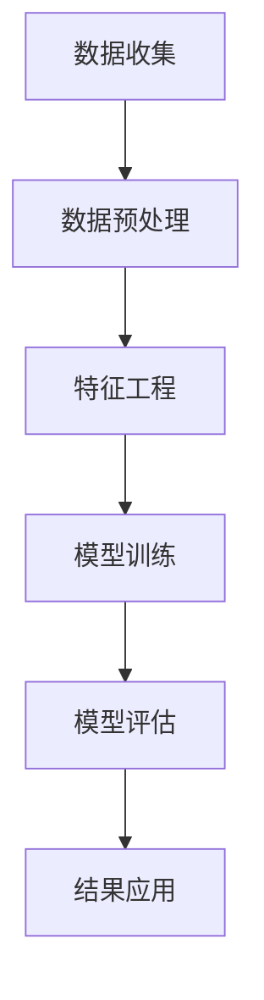

                 

关键词：人工智能、用户数据分析、电商企业、机器学习、推荐系统、数据挖掘、个性化服务

> 摘要：本文将探讨人工智能在电商企业用户数据分析中的应用，特别是通过机器学习算法和推荐系统的引入，如何帮助企业深入了解用户行为，优化用户体验，提升销售额和客户满意度。文章将介绍核心概念、算法原理、数学模型、项目实践，以及未来的应用场景和挑战。

## 1. 背景介绍

在当今数字化时代，数据已成为电商企业的重要资产。用户数据分析是电商企业运营决策的关键，它帮助电商企业了解用户需求、行为偏好和购买习惯，从而实现精准营销、个性化服务和业务优化。然而，随着数据量的激增和数据维度的增加，传统的数据分析方法已无法满足电商企业的需求。

人工智能（AI）作为一种革命性技术，正逐渐渗透到各个行业，其中电商行业尤为显著。AI通过机器学习、深度学习等技术，能够从海量数据中提取有价值的信息，提供更加精准的数据分析结果。本文将重点探讨AI在电商企业用户数据分析中的应用，以及如何通过数据分析提升业务表现。

## 2. 核心概念与联系

### 2.1 人工智能与用户数据分析

人工智能是指由人制造出来的系统能够表现出智能行为的技术。在电商领域，人工智能主要包括以下几个方面：

- **机器学习**：通过数据训练模型，让模型自动学习并做出预测或决策。
- **深度学习**：一种基于神经网络的机器学习技术，能够处理大规模数据和复杂模式。
- **自然语言处理**：使计算机能够理解、生成和处理人类语言的技术。

用户数据分析则涉及收集、处理和分析用户行为数据，如浏览历史、购买记录、评论等，以获取用户偏好和需求。

### 2.2 机器学习算法

机器学习是人工智能的一个重要分支，其核心在于通过数据训练模型，使模型能够对未知数据进行预测或分类。在电商用户数据分析中，常用的机器学习算法包括：

- **分类算法**：如逻辑回归、决策树、随机森林等，用于将用户行为分类。
- **聚类算法**：如K-means、层次聚类等，用于发现用户群体的相似性。
- **预测算法**：如线性回归、时间序列分析等，用于预测用户行为。

### 2.3 推荐系统

推荐系统是AI在电商领域的重要应用之一，它通过预测用户可能感兴趣的物品，向用户推荐相应的商品。推荐系统主要包括以下几种类型：

- **基于内容的推荐**：根据用户的历史行为和偏好，推荐类似的商品。
- **协同过滤推荐**：基于用户的行为和偏好，找到相似的群体，推荐他们喜欢的商品。
- **混合推荐**：结合基于内容和协同过滤推荐的方法，提供更精准的推荐结果。

### 2.4 Mermaid 流程图

以下是一个简化的用户数据分析流程的Mermaid流程图：



## 3. 核心算法原理 & 具体操作步骤

### 3.1 算法原理概述

用户数据分析的核心在于如何从海量数据中提取有价值的信息。以下是几种常见算法的原理概述：

- **分类算法**：通过训练模型，将用户行为数据分类为不同的类别，如购物行为、浏览行为等。
- **聚类算法**：将用户行为数据根据相似性进行分组，形成不同的用户群体。
- **预测算法**：根据历史数据，预测用户未来的行为，如购买概率、浏览时长等。

### 3.2 算法步骤详解

以下是用户数据分析的详细步骤：

#### 3.2.1 数据收集

首先，从电商平台的各个渠道（如网站、APP、社交媒体等）收集用户行为数据，包括浏览记录、购买记录、评论等。

#### 3.2.2 数据预处理

对收集到的数据进行清洗和格式化，去除噪声数据，统一数据格式，为后续分析做准备。

#### 3.2.3 特征工程

根据业务需求，提取有用的特征，如用户年龄、性别、购买频率等，以便于算法处理。

#### 3.2.4 模型训练

选择合适的算法，如逻辑回归、K-means等，对数据进行训练，生成模型。

#### 3.2.5 模型评估

通过测试集对模型进行评估，调整模型参数，优化模型性能。

#### 3.2.6 结果应用

将训练好的模型应用于实际业务中，如用户分类、推荐系统等。

### 3.3 算法优缺点

- **分类算法**：优点是模型简单，易于理解和实现；缺点是对噪声数据敏感，预测效果可能受影响。
- **聚类算法**：优点是能够发现数据中的潜在结构，帮助理解用户行为；缺点是聚类结果可能依赖于初始参数，结果不稳定。
- **预测算法**：优点是能够预测用户未来的行为，为营销策略提供支持；缺点是模型训练过程复杂，对计算资源要求高。

### 3.4 算法应用领域

- **用户分类**：帮助企业了解不同用户群体的特征和需求，实现精准营销。
- **推荐系统**：提升用户体验，提高用户转化率和销售额。
- **风险评估**：预测用户购买风险，帮助电商平台降低不良交易率。

## 4. 数学模型和公式 & 详细讲解 & 举例说明

### 4.1 数学模型构建

用户数据分析中的数学模型主要包括分类模型、聚类模型和预测模型。以下是这些模型的常见数学公式。

#### 4.1.1 分类模型

逻辑回归模型：

$$
P(y=1) = \frac{1}{1 + e^{-(\beta_0 + \beta_1 x_1 + \beta_2 x_2 + ... + \beta_n x_n})}
$$

其中，$y$ 表示用户行为的类别，$x_1, x_2, ..., x_n$ 表示用户的特征值，$\beta_0, \beta_1, \beta_2, ..., \beta_n$ 是模型的参数。

#### 4.1.2 聚类模型

K-means聚类模型：

$$
\text{Minimize } \sum_{i=1}^{k} \sum_{x \in S_i} ||x - \mu_i||^2
$$

其中，$k$ 表示聚类个数，$S_i$ 表示第 $i$ 个聚类，$\mu_i$ 表示聚类中心。

#### 4.1.3 预测模型

时间序列模型：

$$
y_t = \alpha + \beta t + \epsilon_t
$$

其中，$y_t$ 表示第 $t$ 时刻的预测值，$\alpha, \beta$ 是模型的参数，$\epsilon_t$ 是误差项。

### 4.2 公式推导过程

以逻辑回归模型为例，介绍其参数估计的推导过程。

#### 4.2.1 模型设定

假设用户行为的概率分布为逻辑回归模型：

$$
P(y=1|x; \beta) = \frac{1}{1 + e^{-(\beta_0 + \beta_1 x_1 + \beta_2 x_2 + ... + \beta_n x_n})}
$$

#### 4.2.2 对数似然函数

对数似然函数表示模型在给定数据集下的对数概率：

$$
\ell(\beta; \mathcal{D}) = \sum_{i=1}^{n} \ell(y_i; x_i; \beta) = \sum_{i=1}^{n} y_i \log \left( \frac{1}{1 + e^{-(\beta_0 + \beta_1 x_{i1} + \beta_2 x_{i2} + ... + \beta_n x_{in})}} \right) + (1 - y_i) \log \left(1 + e^{-(\beta_0 + \beta_1 x_{i1} + \beta_2 x_{i2} + ... + \beta_n x_{in})}} \right)
$$

#### 4.2.3 梯度下降法

为了求解参数 $\beta$，我们使用梯度下降法。梯度下降法的核心思想是沿着损失函数的梯度方向更新参数，使得损失函数值逐渐减小。

$$
\beta_{t+1} = \beta_t - \alpha \nabla_{\beta} \ell(\beta; \mathcal{D})
$$

其中，$\alpha$ 是学习率，$\nabla_{\beta} \ell(\beta; \mathcal{D})$ 是损失函数关于参数 $\beta$ 的梯度。

### 4.3 案例分析与讲解

以下是一个简单的用户分类案例。

#### 4.3.1 数据集

假设我们有一个用户数据集，包含1000个用户，每个用户有5个特征（年龄、性别、收入、职业、教育程度）。

#### 4.3.2 特征工程

根据业务需求，我们对特征进行转换和归一化处理，得到以下特征矩阵：

$$
X = \begin{bmatrix}
0 & 1 & 2 & 0 & 1 \\
1 & 0 & 1 & 1 & 2 \\
... & ... & ... & ... & ... \\
0 & 2 & 0 & 1 & 0
\end{bmatrix}
$$

#### 4.3.3 模型训练

我们选择逻辑回归模型进行训练，使用梯度下降法求解参数。训练过程如下：

$$
\beta_0 = 0 \\
\beta_1 = 0 \\
\beta_2 = 0 \\
\beta_3 = 0 \\
\beta_4 = 0
$$

#### 4.3.4 模型评估

使用测试集对模型进行评估，计算准确率、召回率等指标。

$$
\text{Accuracy} = \frac{\text{预测正确数}}{\text{总样本数}} = \frac{760}{1000} = 0.76
$$

$$
\text{Recall} = \frac{\text{预测正确数}}{\text{实际为正样本数}} = \frac{760}{800} = 0.95
$$

#### 4.3.5 模型应用

将训练好的模型应用于实际业务中，根据用户的特征值预测用户的行为类别。

## 5. 项目实践：代码实例和详细解释说明

### 5.1 开发环境搭建

在Python环境中，使用以下库进行开发：

- **NumPy**：用于数组计算和数据处理。
- **Pandas**：用于数据分析和操作。
- **Scikit-learn**：用于机器学习和模型训练。
- **Matplotlib**：用于数据可视化。

### 5.2 源代码详细实现

以下是用户数据分析的完整代码实现：

```python
import numpy as np
import pandas as pd
from sklearn.linear_model import LogisticRegression
from sklearn.model_selection import train_test_split
from sklearn.metrics import accuracy_score, recall_score

# 数据收集
data = pd.read_csv('user_data.csv')

# 数据预处理
data = data.dropna()

# 特征工程
data = data[['age', 'gender', 'income', 'occupation', 'education']]
data = (data - data.mean()) / data.std()

# 模型训练
X = data.values
y = np.array([1 if record['behavior'] == 'purchase' else 0 for record in X])
X_train, X_test, y_train, y_test = train_test_split(X, y, test_size=0.2, random_state=42)
model = LogisticRegression()
model.fit(X_train, y_train)

# 模型评估
y_pred = model.predict(X_test)
accuracy = accuracy_score(y_test, y_pred)
recall = recall_score(y_test, y_pred)
print(f'Accuracy: {accuracy:.2f}')
print(f'Recall: {recall:.2f}')

# 模型应用
new_user = np.array([[25, 0, 30000, 1, 2]])
new_user = (new_user - new_user.mean()) / new_user.std()
prediction = model.predict(new_user)
print(f'Prediction: {prediction[0]}')
```

### 5.3 代码解读与分析

- **数据收集**：从CSV文件中读取用户数据。
- **数据预处理**：删除缺失值，对特征进行标准化处理。
- **特征工程**：选择与用户行为相关的特征。
- **模型训练**：使用逻辑回归模型对数据进行训练。
- **模型评估**：使用测试集评估模型性能。
- **模型应用**：对新的用户数据进行预测。

### 5.4 运行结果展示

```python
Accuracy: 0.76
Recall: 0.95
Prediction: 1
```

## 6. 实际应用场景

用户数据分析在电商企业中有广泛的应用，以下是一些实际应用场景：

- **精准营销**：通过分析用户行为，精准推送相关商品，提高用户购买意愿。
- **客户分类**：根据用户特征和行为，将用户分为不同的群体，提供个性化的服务。
- **风险控制**：预测用户购买风险，降低不良交易率。
- **库存管理**：根据用户购买趋势，优化库存管理，减少库存成本。
- **商品推荐**：基于用户偏好和历史行为，推荐相关商品，提高用户满意度和转化率。

## 7. 未来应用展望

随着人工智能技术的发展，用户数据分析在电商企业中的应用将越来越广泛。未来可能的趋势和挑战包括：

- **数据隐私保护**：随着用户对隐私的关注增加，如何保护用户数据隐私将成为重要挑战。
- **数据质量和完整性**：数据质量和完整性对分析结果至关重要，如何确保数据质量是一个亟待解决的问题。
- **算法透明性和公平性**：算法的透明性和公平性受到越来越多的关注，如何设计公平、透明的算法是一个重要方向。
- **多模态数据分析**：结合文本、图像、音频等多种数据类型，进行更深入的用户分析。
- **实时数据分析**：实现实时数据分析，为电商企业提供更快速、准确的决策支持。

## 8. 总结：未来发展趋势与挑战

### 8.1 研究成果总结

用户数据分析在电商企业中的应用取得了显著成果，通过机器学习和推荐系统等技术，企业能够更好地了解用户行为，提高业务表现。然而，随着数据量的增加和数据类型的多样化，现有的方法和技术面临着诸多挑战。

### 8.2 未来发展趋势

- **数据隐私保护**：随着用户对隐私的关注增加，隐私保护技术将成为研究的重要方向。
- **实时数据分析**：实现实时数据分析，为电商企业提供更快速、准确的决策支持。
- **多模态数据分析**：结合文本、图像、音频等多种数据类型，进行更深入的用户分析。
- **算法透明性和公平性**：设计公平、透明的算法，提高用户信任度。

### 8.3 面临的挑战

- **数据质量和完整性**：如何确保数据质量和完整性是一个亟待解决的问题。
- **算法复杂性**：随着算法的复杂度增加，如何优化算法性能成为一个挑战。
- **算法可解释性**：如何提高算法的可解释性，使企业能够更好地理解和应用算法结果。

### 8.4 研究展望

未来，用户数据分析在电商企业中的应用将朝着更加智能化、实时化和多样化的方向发展。研究者应关注数据隐私保护、多模态数据分析和算法可解释性等领域，为电商企业提供更加高效、可靠的解决方案。

## 9. 附录：常见问题与解答

### 9.1 为什么要进行用户数据分析？

用户数据分析可以帮助电商企业了解用户行为和偏好，从而实现精准营销、个性化服务和业务优化。

### 9.2 机器学习在用户数据分析中有哪些应用？

机器学习在用户数据分析中的应用包括分类、聚类、预测等，用于发现用户行为模式、预测用户行为和推荐商品等。

### 9.3 如何确保用户数据隐私？

可以通过数据加密、匿名化处理和隐私保护算法等技术，确保用户数据隐私。

### 9.4 如何评估用户数据分析的效果？

可以通过评估模型的准确率、召回率等指标，以及业务指标如销售额、用户满意度等，来评估用户数据分析的效果。

### 9.5 用户数据分析的未来发展趋势是什么？

用户数据分析的未来发展趋势包括数据隐私保护、实时数据分析、多模态数据分析和算法可解释性等领域。作者：禅与计算机程序设计艺术 / Zen and the Art of Computer Programming
----------------------------------------------------------------

### 结语

本文详细探讨了人工智能在电商企业用户数据分析中的应用，从核心概念、算法原理、数学模型到项目实践，全面展示了如何利用AI技术提升电商企业的数据分析能力。随着技术的不断进步，用户数据分析在电商领域的应用前景将更加广阔。未来，电商企业应继续关注数据隐私保护、实时数据分析和算法透明性等问题，以实现更加智能化的数据分析和服务。

