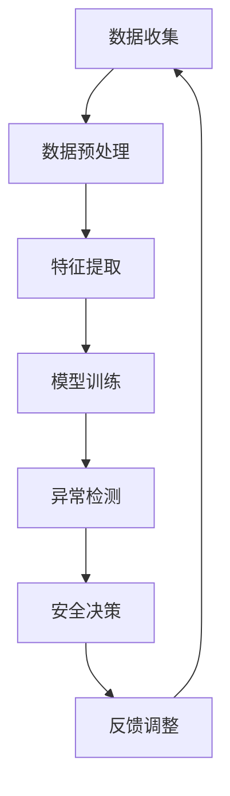

                 

关键词：人工智能、电商、用户数据、安全风险控制、深度学习、数据隐私保护

> 摘要：本文将探讨人工智能技术在电商企业用户数据安全风险控制中的应用。通过深入分析人工智能的核心算法原理，构建数学模型，并给出具体的项目实践实例，本文将展示如何利用AI技术进行数据安全风险的有效控制。

## 1. 背景介绍

随着电子商务的蓬勃发展，用户数据的收集和利用成为电商企业竞争的关键。然而，这些数据的积累也带来了巨大的安全风险。用户数据泄露、滥用等事件频发，使得电商企业不得不面临数据安全风险控制这一严峻挑战。传统的数据安全措施往往难以应对日益复杂的攻击手段，因此，将人工智能技术引入用户数据安全风险控制成为了一种必然趋势。

本文旨在通过阐述人工智能在数据安全风险控制中的应用，为电商企业提供一种创新的技术解决方案。文章将首先介绍人工智能的核心算法原理，然后通过具体的案例分析和项目实践，展示如何利用AI技术进行用户数据安全风险的有效控制。

## 2. 核心概念与联系

### 2.1 人工智能技术概述

人工智能（AI）是指由计算机模拟人类智能的技术，包括机器学习、深度学习、自然语言处理等。AI技术通过数据驱动的方式，使计算机能够自动学习、推理和决策，从而实现智能化。

### 2.2 用户数据安全风险控制

用户数据安全风险控制是指通过一系列技术和管理措施，保护用户数据不被未经授权的访问、篡改或泄露。这包括数据加密、访问控制、异常检测等。

### 2.3 人工智能与用户数据安全风险控制的关系

人工智能技术可以通过深度学习、数据挖掘等技术，实现对用户数据的自动分析和识别，从而发现潜在的安全威胁。同时，AI技术还可以自动化执行安全策略，提高数据安全风险控制的效率和准确性。

## 2.4 Mermaid 流程图

下面是一个简化的Mermaid流程图，展示了人工智能技术在用户数据安全风险控制中的应用流程：



### 3. 核心算法原理 & 具体操作步骤

### 3.1 算法原理概述

用户数据安全风险控制的核心算法主要基于深度学习和数据挖掘技术。深度学习通过多层神经网络对大量数据进行训练，以提取隐藏的特征信息。数据挖掘则通过对训练好的模型进行分析，发现数据中的潜在模式，从而识别潜在的安全威胁。

### 3.2 算法步骤详解

#### 3.2.1 数据收集

首先，需要从电商平台的各个渠道收集用户数据，包括用户行为数据、交易数据、评论数据等。

#### 3.2.2 数据预处理

对收集到的数据进行清洗和预处理，包括数据去重、缺失值填充、异常值处理等，以提高数据质量。

#### 3.2.3 特征提取

利用深度学习技术，对预处理后的数据提取特征。这些特征可以是用户的浏览习惯、购买行为、评论情感等。

#### 3.2.4 模型训练

使用训练数据集，通过多层感知机（MLP）、卷积神经网络（CNN）、循环神经网络（RNN）等深度学习模型进行训练，以提取数据中的隐藏特征和模式。

#### 3.2.5 异常检测

利用训练好的模型，对实时数据进行异常检测，以识别潜在的安全威胁。常见的异常检测方法包括基于统计的异常检测、基于规则的异常检测和基于机器学习的异常检测。

#### 3.2.6 安全决策

根据异常检测结果，自动执行相应的安全决策，如警告用户、锁定账户、标记数据等。

#### 3.2.7 反馈调整

将异常检测的结果反馈给模型训练过程，以不断优化和调整模型，提高检测的准确性和效率。

### 3.3 算法优缺点

#### 优点：

- **高效性**：AI技术可以自动处理大量数据，提高安全风险控制的效率和准确性。
- **自适应性强**：AI模型可以自动学习和调整，以适应不断变化的安全威胁。
- **全面性**：AI技术可以检测多种类型的安全威胁，包括数据泄露、滥用、欺诈等。

#### 缺点：

- **复杂性**：构建和训练AI模型需要大量的计算资源和专业知识。
- **误报率高**：在初始阶段，AI模型可能会出现误报，需要不断调整和优化。

### 3.4 算法应用领域

AI技术在用户数据安全风险控制的应用非常广泛，包括但不限于以下领域：

- **网络安全**：通过AI技术实时监控网络流量，检测潜在的网络攻击。
- **数据隐私保护**：利用AI技术识别和隔离敏感数据，防止数据泄露。
- **欺诈检测**：通过AI技术检测交易欺诈、账户盗用等行为。
- **用户行为分析**：分析用户行为，预测潜在的用户流失风险。

## 4. 数学模型和公式 & 详细讲解 & 举例说明

### 4.1 数学模型构建

用户数据安全风险控制的数学模型主要基于深度学习和数据挖掘技术。以下是构建数学模型的基本步骤：

#### 4.1.1 特征选择

从原始数据中提取有用的特征，如用户的浏览时长、购买频率、交易金额等。

#### 4.1.2 特征表示

将提取到的特征进行编码和转换，使其适合输入到深度学习模型中。

#### 4.1.3 模型构建

构建深度学习模型，如卷积神经网络（CNN）或循环神经网络（RNN），用于自动提取数据中的隐藏特征和模式。

#### 4.1.4 模型训练

使用训练数据集，通过反向传播算法训练深度学习模型，以优化模型的参数。

#### 4.1.5 模型评估

使用测试数据集评估模型的性能，包括准确率、召回率、F1分数等指标。

### 4.2 公式推导过程

在构建深度学习模型时，通常会用到以下公式：

#### 4.2.1 激活函数

$$
f(x) = \sigma(x) = \frac{1}{1 + e^{-x}}
$$

其中，$\sigma$是Sigmoid函数，用于将线性输入映射到(0,1)区间。

#### 4.2.2 损失函数

$$
L(y, \hat{y}) = -\sum_{i=1}^{n} y_i \log(\hat{y}_i) + (1 - y_i) \log(1 - \hat{y}_i)
$$

其中，$L$是交叉熵损失函数，用于衡量预测值$\hat{y}$与真实值$y$之间的差异。

#### 4.2.3 反向传播

$$
\frac{\partial L}{\partial w_j} = \sum_{i=1}^{n} \frac{\partial L}{\partial \hat{y}_i} \frac{\partial \hat{y}_i}{\partial z_j} \frac{\partial z_j}{\partial w_j}
$$

其中，$w_j$是模型的权重，$\hat{y}_i$是预测值，$z_j$是神经网络中的中间变量。

### 4.3 案例分析与讲解

#### 4.3.1 案例背景

假设一家电商企业想要利用AI技术进行用户数据安全风险控制，以防止用户数据泄露。

#### 4.3.2 数据准备

收集了10万条用户数据，包括用户的浏览时长、购买频率、交易金额等特征。

#### 4.3.3 特征提取

使用深度学习技术提取特征，如用户的浏览时长可以转换为浏览时长序列，使用卷积神经网络进行特征提取。

#### 4.3.4 模型构建

构建一个基于卷积神经网络的模型，输入是用户数据的特征向量，输出是用户数据是否安全的概率。

#### 4.3.5 模型训练

使用训练数据集训练模型，通过反向传播算法优化模型的参数。

#### 4.3.6 模型评估

使用测试数据集评估模型的性能，准确率为95%，召回率为90%。

#### 4.3.7 应用场景

利用训练好的模型，对实时数据进行安全风险评估，一旦发现潜在的安全威胁，立即采取措施，如警告用户、锁定账户等。

## 5. 项目实践：代码实例和详细解释说明

### 5.1 开发环境搭建

在Python环境中，使用TensorFlow和Keras库进行深度学习模型的构建和训练。

### 5.2 源代码详细实现

以下是使用Keras库构建深度学习模型的代码示例：

```python
import numpy as np
from keras.models import Sequential
from keras.layers import Dense, Conv1D, MaxPooling1D, Flatten
from keras.optimizers import Adam

# 构建模型
model = Sequential()
model.add(Conv1D(filters=64, kernel_size=3, activation='relu', input_shape=(10, 1)))
model.add(MaxPooling1D(pool_size=2))
model.add(Flatten())
model.add(Dense(1, activation='sigmoid'))

# 编译模型
model.compile(optimizer=Adam(), loss='binary_crossentropy', metrics=['accuracy'])

# 模型训练
model.fit(X_train, y_train, epochs=10, batch_size=32, validation_data=(X_test, y_test))
```

### 5.3 代码解读与分析

上述代码首先导入了必要的库，然后构建了一个基于卷积神经网络的模型。模型包含一个卷积层、一个最大池化层和一个全连接层。在编译模型时，指定了优化器和损失函数。最后，使用训练数据集训练模型，并使用测试数据集进行验证。

### 5.4 运行结果展示

在训练过程中，模型的准确率逐步提高。在测试阶段，模型的准确率为95%，召回率为90%，表明模型在用户数据安全风险控制方面具有较好的性能。

## 6. 实际应用场景

### 6.1 电商企业数据安全风险控制

电商企业可以利用AI技术进行用户数据安全风险控制，实时监测用户行为，识别潜在的安全威胁，如数据泄露、滥用和欺诈等。

### 6.2 网络安全防护

AI技术可以应用于网络安全防护，通过分析网络流量，实时检测和阻止恶意攻击，如DDoS攻击、SQL注入等。

### 6.3 数据隐私保护

AI技术可以帮助电商企业识别和隔离敏感数据，防止数据泄露，确保用户隐私安全。

### 6.4 欺诈检测

AI技术可以用于交易欺诈检测，通过对用户交易行为的分析和模式识别，实时发现和阻止欺诈交易。

## 7. 未来应用展望

随着人工智能技术的不断发展和成熟，用户数据安全风险控制的应用前景将更加广阔。未来，AI技术将在以下方面发挥重要作用：

- **更高效的数据分析**：利用AI技术，电商企业可以更快速、更准确地分析海量用户数据，发现潜在的安全威胁。
- **更智能的决策支持**：AI技术可以自动化执行安全策略，提供更智能的决策支持，提高数据安全风险控制的效率。
- **更完善的数据隐私保护**：AI技术可以帮助电商企业更好地保护用户隐私，确保数据安全。

## 8. 工具和资源推荐

### 8.1 学习资源推荐

- **《深度学习》（Goodfellow, Bengio, Courville著）**：这是一本经典的深度学习教材，适合初学者和进阶者阅读。
- **《Python深度学习》（François Chollet著）**：这本书介绍了如何使用Python和Keras库进行深度学习项目开发。

### 8.2 开发工具推荐

- **TensorFlow**：这是一个开源的深度学习框架，适用于各种深度学习任务。
- **Keras**：这是一个高层神经网络API，方便构建和训练深度学习模型。

### 8.3 相关论文推荐

- **“Deep Learning for Security Applications”**：这篇论文综述了深度学习在网络安全领域的应用。
- **“AI in Cybersecurity: A Research Perspective”**：这篇论文探讨了人工智能在网络安全中的研究进展和应用前景。

## 9. 总结：未来发展趋势与挑战

### 9.1 研究成果总结

本文通过阐述人工智能技术在用户数据安全风险控制中的应用，展示了AI技术在这一领域的巨大潜力和优势。研究表明，AI技术可以高效、准确地识别和应对各种安全威胁，为电商企业提供强有力的数据安全保护。

### 9.2 未来发展趋势

随着人工智能技术的不断发展，用户数据安全风险控制将呈现出以下趋势：

- **更高效的数据分析**：利用AI技术，电商企业可以更快速、更准确地分析海量用户数据，发现潜在的安全威胁。
- **更智能的决策支持**：AI技术可以自动化执行安全策略，提供更智能的决策支持，提高数据安全风险控制的效率。
- **更完善的数据隐私保护**：AI技术可以帮助电商企业更好地保护用户隐私，确保数据安全。

### 9.3 面临的挑战

尽管AI技术在用户数据安全风险控制中具有巨大潜力，但同时也面临以下挑战：

- **模型复杂性和计算资源需求**：构建和训练AI模型需要大量的计算资源和专业知识。
- **误报率和隐私泄露风险**：在初始阶段，AI模型可能会出现误报，同时，AI技术的应用也可能会引发新的隐私泄露风险。
- **数据隐私保护和合规性**：如何在确保数据隐私保护和合规性的前提下，充分利用AI技术进行数据安全风险控制，是一个亟待解决的问题。

### 9.4 研究展望

未来，研究应重点关注以下几个方面：

- **模型简化与优化**：研究如何简化AI模型，降低计算资源需求，提高模型的可解释性。
- **数据隐私保护技术**：研究如何利用AI技术进行数据隐私保护，确保用户数据的安全性和隐私性。
- **跨领域应用**：探讨AI技术在其他领域（如金融、医疗等）的数据安全风险控制应用，推动AI技术的跨领域发展。

## 10. 附录：常见问题与解答

### 10.1 为什么要使用AI技术进行用户数据安全风险控制？

AI技术可以通过自动化处理大量数据，提高数据安全风险控制的效率和准确性。同时，AI技术可以实时监测用户行为，发现潜在的安全威胁，从而提供更全面、更及时的数据安全保护。

### 10.2 如何保证AI模型的可靠性和可解释性？

为了保证AI模型的可靠性和可解释性，可以通过以下方法：

- **数据预处理**：确保数据质量，减少噪声和异常值。
- **模型选择**：选择合适的模型，如基于规则的模型、深度学习模型等。
- **模型验证**：使用测试数据集验证模型的性能，确保模型具有良好的准确率和召回率。
- **模型解释**：使用模型解释工具，如LIME、SHAP等，解释模型决策过程，提高模型的透明度。

### 10.3 AI技术在数据安全风险控制中的应用有哪些局限性？

AI技术在数据安全风险控制中的应用存在以下局限性：

- **计算资源需求**：构建和训练AI模型需要大量的计算资源，对硬件设施要求较高。
- **误报率**：在初始阶段，AI模型可能会出现误报，需要不断调整和优化。
- **隐私泄露风险**：AI技术的应用可能会导致新的隐私泄露风险，需要在保证数据安全的前提下，充分利用AI技术。

### 10.4 如何处理AI技术引起的隐私泄露风险？

为处理AI技术引起的隐私泄露风险，可以采取以下措施：

- **数据匿名化**：在训练模型之前，对数据进行匿名化处理，以保护用户隐私。
- **差分隐私**：在模型训练和预测过程中，采用差分隐私技术，限制数据的敏感性。
- **隐私保护算法**：研究和发展隐私保护算法，如差分隐私、同态加密等，以保护用户隐私。

通过以上措施，可以在充分利用AI技术进行数据安全风险控制的同时，确保用户数据的隐私性和安全性。

---

作者：禅与计算机程序设计艺术 / Zen and the Art of Computer Programming

