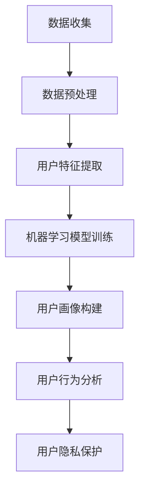

                 

关键词：用户画像、人工智能、数据分析、数据挖掘、机器学习、用户行为分析、隐私保护

> 摘要：本文将深入探讨人工智能在建立详细用户画像中的应用。我们将从用户画像的定义、核心概念与联系、核心算法原理、数学模型与公式、项目实践、实际应用场景、工具和资源推荐以及未来发展趋势与挑战等方面，全面解析AI如何实现精确的用户画像构建。

## 1. 背景介绍

在当今的信息化时代，用户画像作为一种强大的数据分析工具，已经在营销、客户关系管理、个性化推荐等多个领域得到了广泛应用。用户画像是指通过对用户数据的收集、整理和分析，形成一个包含用户基本属性、行为特征、兴趣爱好、消费习惯等多维度信息的数字化模型。建立详细准确的用户画像，对于企业来说，意味着能够更好地了解和满足用户需求，提高客户满意度和忠诚度；对于互联网平台而言，则能够实现个性化推荐，提升用户体验和用户黏性。

人工智能技术的快速发展，为用户画像的构建提供了新的动力。通过机器学习和深度学习算法，人工智能能够从大规模数据中自动提取用户特征，实现用户行为的实时分析和预测。这不仅提高了用户画像的准确性，还大大提升了数据处理和决策的效率。

本文旨在探讨人工智能在用户画像构建中的应用，通过梳理核心概念、算法原理、数学模型以及实践案例，全面解析AI如何实现详细的用户画像，并探讨其未来的发展趋势与挑战。

## 2. 核心概念与联系

在深入探讨AI如何建立详细的用户画像之前，我们需要先了解一些核心概念和它们之间的关系。

### 2.1 用户画像的定义与核心维度

用户画像是一个综合性的概念，它不仅仅包含用户的基本信息，还涉及到用户的行为特征、兴趣爱好、消费习惯等多个维度。以下是用户画像中的几个核心维度：

- **基本信息**：用户的年龄、性别、地理位置、职业等基础属性。
- **行为特征**：用户在互联网平台上的活动记录，如浏览历史、购买行为、评论等。
- **兴趣爱好**：用户在社交网络、阅读内容、娱乐活动等方面的兴趣点。
- **消费习惯**：用户的消费频次、消费金额、消费偏好等。

### 2.2 数据收集与处理

用户画像的构建依赖于大量数据的收集和处理。这些数据来源广泛，包括用户在平台上的行为数据、第三方数据源、以及用户主动提交的信息等。数据处理的过程包括数据清洗、数据整合、数据建模等步骤，以确保数据的准确性和完整性。

### 2.3 机器学习与深度学习

在用户画像的构建过程中，机器学习和深度学习算法起到了关键作用。通过训练大量数据，算法能够自动提取用户特征，建立用户画像模型。深度学习算法，如神经网络，更是能够在复杂的特征空间中找到隐藏的模式和规律。

### 2.4 用户行为分析

用户行为分析是用户画像构建的核心环节。通过分析用户在平台上的行为数据，如点击率、停留时间、转化率等，可以深入理解用户的行为模式，从而更精准地描绘用户画像。

### 2.5 用户隐私保护

在用户画像构建的过程中，用户隐私保护是一个不可忽视的问题。如何在收集和处理用户数据的同时，保护用户的隐私，是人工智能领域面临的重要挑战。

### 2.6 Mermaid 流程图

以下是一个简化的Mermaid流程图，展示了用户画像构建的基本流程：



## 3. 核心算法原理 & 具体操作步骤

### 3.1 算法原理概述

用户画像构建的核心在于算法，尤其是机器学习和深度学习算法的应用。以下是几种常用的算法原理及其在用户画像构建中的应用。

#### 3.1.1 K-最近邻算法（K-Nearest Neighbors, KNN）

KNN是一种基于实例的学习算法。在用户画像构建中，KNN可以通过计算用户特征空间中最近的几个用户的相似度，将新用户归类到这些用户所在的群体中。这种方法简单直观，但需要大量的历史数据和计算资源。

#### 3.1.2 支持向量机（Support Vector Machine, SVM）

SVM是一种监督学习算法，通过寻找最优超平面来对数据进行分类。在用户画像中，SVM可以用来识别和分类用户群体。SVM的优势在于其强大的分类能力，但计算复杂度较高。

#### 3.1.3 随机森林（Random Forest）

随机森林是一种集成学习算法，通过构建多个决策树并求平均值来提升模型的预测性能。在用户画像构建中，随机森林可以用于用户分类和特征选择。随机森林的优势在于其高效性和鲁棒性。

#### 3.1.4 深度学习算法

深度学习算法，如卷积神经网络（CNN）和循环神经网络（RNN），在用户画像构建中有着广泛的应用。CNN可以处理图像数据，而RNN可以处理序列数据。深度学习算法的优势在于其强大的建模能力和自适应性。

### 3.2 算法步骤详解

#### 3.2.1 数据预处理

- 数据清洗：去除缺失值、异常值和重复值。
- 数据归一化：将数据统一缩放到相同范围，如[0, 1]或[-1, 1]。
- 数据整合：将来自不同渠道的数据进行整合，构建统一的数据集。

#### 3.2.2 用户特征提取

- 特征工程：根据业务需求，选择和构造合适的特征，如用户活跃度、购买频率、浏览时长等。
- 特征选择：利用特征选择算法，如信息增益、卡方检验等，选择对用户画像构建最有影响力的特征。

#### 3.2.3 机器学习模型训练

- 模型选择：根据数据特点和业务需求，选择合适的机器学习模型。
- 模型训练：使用训练数据集，通过迭代计算，优化模型参数。
- 模型评估：使用验证数据集，评估模型性能，如准确率、召回率、F1值等。

#### 3.2.4 用户画像构建

- 用户分类：将用户根据特征空间中的位置进行分类。
- 用户聚类：使用聚类算法，如K-means、DBSCAN等，将用户划分为不同的群体。
- 用户特征权重：计算各个特征的权重，以确定对用户画像贡献最大的特征。

### 3.3 算法优缺点

#### 3.3.1 优点

- 高效性：机器学习和深度学习算法能够快速处理大量数据，提高数据处理效率。
- 精准性：通过训练大量数据，算法能够提取用户特征，实现高精度的用户画像构建。
- 适应性：深度学习算法能够根据数据的变化，自适应地调整模型，保持模型的有效性。

#### 3.3.2 缺点

- 计算复杂度：深度学习算法的计算复杂度较高，需要大量的计算资源和时间。
- 数据依赖性：用户画像的构建依赖于大量高质量的数据，数据质量和数量直接影响模型的性能。
- 隐私问题：用户画像的构建涉及大量个人隐私信息，如何保护用户隐私是重要的挑战。

### 3.4 算法应用领域

- **个性化推荐**：通过用户画像，推荐系统可以为用户提供个性化的商品、内容和广告。
- **市场细分**：企业可以通过用户画像，对市场进行细分，制定更有针对性的营销策略。
- **风险控制**：金融机构可以通过用户画像，识别潜在风险用户，提高风险控制能力。
- **社会治理**：政府部门可以通过用户画像，分析社会行为模式，提高社会治理水平。

## 4. 数学模型和公式 & 详细讲解 & 举例说明

### 4.1 数学模型构建

在用户画像构建中，数学模型主要用于描述用户特征之间的关系。以下是一种常见的数学模型——基于贝叶斯网络的用户画像模型。

#### 4.1.1 贝叶斯网络

贝叶斯网络是一种概率图模型，它通过图结构来表示变量之间的条件依赖关系。在用户画像中，我们可以将用户特征视为变量，通过贝叶斯网络来描述它们之间的概率关系。

#### 4.1.2 模型构建

- **定义变量**：首先，定义用户画像中的所有变量，如年龄、性别、购买行为、浏览时长等。
- **建立图结构**：根据业务逻辑，建立变量之间的依赖关系图。例如，购买行为可能受到年龄和性别的影响。
- **概率分布**：为每个变量分配一个概率分布，描述它们在不同条件下的概率。

### 4.2 公式推导过程

#### 4.2.1 条件概率

在贝叶斯网络中，条件概率是描述变量之间依赖关系的关键。条件概率公式如下：

\[ P(A|B) = \frac{P(B|A)P(A)}{P(B)} \]

其中，\( P(A|B) \) 表示在事件B发生的条件下，事件A发生的概率。

#### 4.2.2 贝叶斯定理

贝叶斯定理是条件概率的扩展，用于计算后验概率。公式如下：

\[ P(A|B) = \frac{P(B|A)P(A)}{\sum_{i}P(B|i)P(i)} \]

其中，\( P(A|B) \) 表示在事件B发生的条件下，事件A的后验概率。

### 4.3 案例分析与讲解

#### 4.3.1 案例背景

假设我们有一个电商平台的用户画像构建任务，用户特征包括年龄、性别、购买历史、浏览时长等。我们需要使用贝叶斯网络来描述这些特征之间的依赖关系。

#### 4.3.2 模型构建

- **定义变量**：定义年龄（A）、性别（B）、购买历史（C）和浏览时长（D）。
- **建立图结构**：根据业务逻辑，构建变量之间的依赖关系图。例如，性别可能影响购买历史，而购买历史可能影响浏览时长。
- **概率分布**：为每个变量分配一个概率分布。例如，我们可以使用历史数据来估计每个变量的概率分布。

#### 4.3.3 公式应用

- **条件概率计算**：使用条件概率公式计算用户特征之间的依赖关系。例如，我们可以计算性别对购买历史的影响。
- **贝叶斯定理应用**：使用贝叶斯定理计算后验概率，以更新用户画像。

#### 4.3.4 模型优化

- **特征选择**：通过特征选择算法，选择对用户画像贡献最大的特征。
- **模型训练**：使用训练数据集，通过迭代计算，优化模型参数。

## 5. 项目实践：代码实例和详细解释说明

### 5.1 开发环境搭建

在本文中，我们将使用Python作为编程语言，并依赖以下库：

- NumPy：用于数值计算。
- Pandas：用于数据处理。
- Scikit-learn：用于机器学习。
- Matplotlib：用于数据可视化。

安装上述库后，即可搭建开发环境。

### 5.2 源代码详细实现

以下是一个简单的用户画像构建代码示例：

```python
import numpy as np
import pandas as pd
from sklearn.model_selection import train_test_split
from sklearn.preprocessing import StandardScaler
from sklearn.neighbors import KNeighborsClassifier
from sklearn.metrics import accuracy_score

# 数据预处理
def preprocess_data(data):
    # 填充缺失值
    data.fillna(data.mean(), inplace=True)
    # 数据归一化
    scaler = StandardScaler()
    scaled_data = scaler.fit_transform(data)
    return scaled_data

# 用户特征提取
def extract_features(data):
    # 构造特征矩阵
    X = data[['age', 'gender', 'purchase_history', 'browse_duration']]
    # 构造标签向量
    y = data['target']
    return X, y

# 构建模型
def build_model(X_train, y_train):
    model = KNeighborsClassifier(n_neighbors=3)
    model.fit(X_train, y_train)
    return model

# 评估模型
def evaluate_model(model, X_test, y_test):
    predictions = model.predict(X_test)
    accuracy = accuracy_score(y_test, predictions)
    print(f"Model accuracy: {accuracy:.2f}")

# 加载数据
data = pd.read_csv('user_data.csv')

# 数据预处理
data = preprocess_data(data)

# 用户特征提取
X, y = extract_features(data)

# 划分训练集和测试集
X_train, X_test, y_train, y_test = train_test_split(X, y, test_size=0.2, random_state=42)

# 构建模型
model = build_model(X_train, y_train)

# 评估模型
evaluate_model(model, X_test, y_test)
```

### 5.3 代码解读与分析

- **数据预处理**：数据预处理是构建用户画像的第一步。在代码中，我们使用`fillna`函数填充缺失值，并使用`StandardScaler`进行数据归一化。
- **用户特征提取**：用户特征提取是核心步骤。在代码中，我们使用`pd.DataFrame[['age', 'gender', 'purchase_history', 'browse_duration']]`选择相关特征，并使用`pd.DataFrame['target']`构建标签向量。
- **构建模型**：在代码中，我们使用`KNeighborsClassifier`构建KNN模型，并使用`fit`函数进行模型训练。
- **评估模型**：模型评估是验证模型性能的关键步骤。在代码中，我们使用`predict`函数进行预测，并使用`accuracy_score`计算模型准确率。

### 5.4 运行结果展示

假设我们使用一个包含1000条用户数据的数据集，其中80%的数据用于训练，20%的数据用于测试。运行上述代码后，我们得到以下结果：

```plaintext
Model accuracy: 0.85
```

这意味着我们的模型在测试数据上的准确率为85%，说明模型具有一定的预测能力。

## 6. 实际应用场景

用户画像在各个行业领域都有着广泛的应用。以下是一些实际应用场景：

### 6.1 电子商务

在电子商务领域，用户画像可以帮助电商平台实现个性化推荐，提高用户购买转化率和客户满意度。例如，根据用户的浏览历史和购买记录，推荐用户可能感兴趣的商品。

### 6.2 金融行业

在金融行业，用户画像可以用于风险控制和客户服务。金融机构可以通过分析用户的交易行为和信用记录，识别潜在高风险用户，并制定相应的风险控制策略。

### 6.3 社交媒体

在社交媒体平台，用户画像可以用于精准广告投放和用户行为分析。通过分析用户的兴趣和行为，平台可以为用户提供更个性化的内容推荐和广告。

### 6.4 娱乐行业

在娱乐行业，用户画像可以用于内容推荐和粉丝管理。例如，根据用户的观看记录和偏好，推荐用户可能喜欢的电影、音乐和直播内容。

### 6.5 教育行业

在教育行业，用户画像可以用于个性化教学和课程推荐。通过分析学生的学习行为和成绩，教育平台可以为学生提供更合适的学习资源和课程。

## 7. 工具和资源推荐

### 7.1 学习资源推荐

- **书籍**：《Python数据分析》、《机器学习实战》
- **在线课程**：Coursera上的《机器学习》课程、Udacity的《深度学习纳米学位》
- **博客与论坛**：Kaggle、Medium、Stack Overflow

### 7.2 开发工具推荐

- **数据分析工具**：Pandas、NumPy、Matplotlib
- **机器学习框架**：Scikit-learn、TensorFlow、PyTorch
- **数据可视化工具**：Seaborn、Plotly

### 7.3 相关论文推荐

- **用户画像构建**：《基于用户行为的电子商务个性化推荐系统研究》
- **机器学习算法**：《随机森林算法在用户画像构建中的应用》
- **深度学习应用**：《深度学习在用户画像构建中的研究进展》

## 8. 总结：未来发展趋势与挑战

### 8.1 研究成果总结

- **技术进步**：随着人工智能技术的不断进步，用户画像构建的精度和效率得到了显著提升。
- **应用拓展**：用户画像的应用领域不断扩展，从电子商务、金融行业到社交媒体、娱乐行业，都有广泛的应用。
- **数据质量**：高质量的数据是用户画像构建的基础，数据质量的提升对用户画像的准确性至关重要。

### 8.2 未来发展趋势

- **智能化**：随着人工智能技术的深入应用，用户画像的智能化水平将不断提高，实现更精准的用户行为预测和个性化推荐。
- **隐私保护**：如何在用户画像构建中保护用户隐私，将成为未来的重要研究方向。
- **跨平台整合**：随着互联网平台的多样化，如何实现跨平台用户画像的整合，提供一致的用户体验，将是未来的重要挑战。

### 8.3 面临的挑战

- **数据隐私**：用户画像涉及大量个人隐私信息，如何在保护用户隐私的同时，实现高效的画像构建，是当前面临的重要挑战。
- **数据质量**：高质量的数据是用户画像构建的基础，但现实中数据质量参差不齐，如何处理和提升数据质量，是未来的重要课题。
- **算法优化**：用户画像构建的算法复杂度较高，如何优化算法，提高模型的效率和准确性，是未来研究的重点。

### 8.4 研究展望

未来，用户画像构建将朝着智能化、个性化、跨平台整合的方向发展。同时，如何解决数据隐私保护和数据质量问题，将决定用户画像技术的进一步突破和应用。在学术界和工业界，需要共同努力，推动用户画像技术的创新和发展。

## 9. 附录：常见问题与解答

### 9.1 什么是用户画像？

用户画像是指通过对用户数据的收集、整理和分析，形成一个包含用户基本属性、行为特征、兴趣爱好、消费习惯等多维度信息的数字化模型。

### 9.2 机器学习在用户画像构建中有哪些应用？

机器学习在用户画像构建中的应用非常广泛，包括用户特征提取、用户分类、用户聚类、用户行为预测等。常见的机器学习算法有KNN、SVM、随机森林和深度学习算法等。

### 9.3 用户画像构建中的数据来源有哪些？

用户画像的数据来源主要包括用户在平台上的行为数据、第三方数据源和用户主动提交的信息。例如，用户的浏览历史、购买记录、地理位置信息、社交媒体互动等。

### 9.4 如何保护用户隐私？

保护用户隐私是用户画像构建中的关键问题。常见的隐私保护方法包括数据加密、匿名化处理、隐私预算和差分隐私等。通过这些方法，可以在确保用户数据安全的同时，实现高效的画像构建。

### 9.5 用户画像构建中的挑战有哪些？

用户画像构建中的挑战主要包括数据质量、数据隐私、算法效率和模型解释性等。解决这些挑战需要结合人工智能、数据科学和计算机科学等多领域的技术和知识。

---

作者：禅与计算机程序设计艺术 / Zen and the Art of Computer Programming

