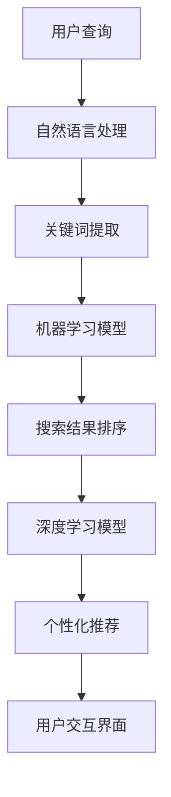

                 

本文探讨了人工智能（AI）技术在提升搜索结果质量方面的应用。随着互联网信息的爆炸性增长，如何从海量数据中快速、准确地获取用户所需的信息成为了一个挑战。AI 技术的引入，尤其是机器学习、自然语言处理和深度学习等，为解决这一难题提供了新的途径。本文将从多个角度分析 AI 如何通过算法改进、数据挖掘、个性化推荐和用户交互等方面提升搜索结果的质量。

## 关键词

- 人工智能
- 搜索结果质量
- 机器学习
- 自然语言处理
- 深度学习
- 个性化推荐
- 用户交互

## 摘要

本文首先介绍了当前互联网搜索面临的挑战，并简要回顾了传统搜索算法的局限。随后，我们深入探讨了 AI 技术在提升搜索结果质量方面的多种应用，包括但不限于算法改进、数据挖掘、个性化推荐和用户交互等。通过这些技术手段，AI 能够显著提升搜索结果的准确性和相关性，从而提高用户满意度。最后，本文总结了 AI 技术在提升搜索结果质量方面的发展趋势和面临的挑战。

## 1. 背景介绍

随着互联网的普及，信息获取变得越来越容易。然而，信息量的爆炸性增长也带来了一系列挑战。首先，用户在搜索时往往面对大量相似或冗余的结果，很难迅速找到所需信息。其次，传统搜索算法（如基于关键词匹配的搜索算法）往往存在准确性不足的问题，导致用户无法获得理想的搜索结果。此外，传统搜索算法在处理多语言、多模态信息时也显得力不从心。

为了解决这些问题，研究人员和工程师们开始探索将 AI 技术引入搜索领域。AI 技术包括机器学习、自然语言处理和深度学习等，它们在处理大规模数据、理解复杂数据结构和进行自动化决策方面具有显著优势。通过应用这些技术，AI 能够更好地理解用户查询意图，挖掘潜在信息价值，并生成更高质量的搜索结果。

## 2. 核心概念与联系

为了更好地理解 AI 如何提升搜索结果的质量，我们首先需要了解几个核心概念：

### 2.1. 机器学习

机器学习是一种通过训练数据集来提高模型性能的方法。在搜索领域，机器学习可以用于改进关键词匹配、理解用户查询意图、推荐相关信息等。例如，可以使用监督学习算法（如支持向量机、决策树等）来预测用户对搜索结果的满意度，从而优化搜索结果排序。

### 2.2. 自然语言处理（NLP）

自然语言处理是一种使计算机理解和处理人类语言的技术。在搜索领域，NLP 技术可以用于文本分类、情感分析、命名实体识别等。这些技术有助于更准确地理解用户查询，从而生成更相关的搜索结果。

### 2.3. 深度学习

深度学习是一种基于多层神经网络的机器学习技术。它在处理复杂数据结构和进行自动化决策方面表现出色。在搜索领域，深度学习可以用于图像识别、语音识别、文本生成等。这些技术有助于提高搜索结果的准确性和多样性。

### 2.4. 个性化推荐

个性化推荐是一种基于用户行为和兴趣的推荐系统。在搜索领域，个性化推荐可以用于根据用户的历史查询和行为，推荐相关的搜索结果。这有助于提高用户的满意度，减少无效搜索。

### 2.5. 用户交互

用户交互是指用户与搜索系统之间的交互过程。通过优化用户交互界面，可以提高用户的使用体验，从而提高搜索结果的满意度。

### 2.6. Mermaid 流程图



## 3. 核心算法原理 & 具体操作步骤

### 3.1. 算法原理概述

AI 提升搜索结果质量的核心算法主要包括：

- **关键词提取**：通过自然语言处理技术，从用户查询中提取关键信息。
- **机器学习模型**：使用监督学习算法（如支持向量机、决策树等）来预测用户对搜索结果的满意度，优化搜索结果排序。
- **深度学习模型**：使用多层神经网络（如卷积神经网络、循环神经网络等）来处理复杂数据结构，提高搜索结果的准确性。
- **个性化推荐**：根据用户的历史查询和行为，推荐相关的搜索结果。
- **用户交互界面**：优化用户交互界面，提高用户体验。

### 3.2. 算法步骤详解

1. **关键词提取**：使用自然语言处理技术（如词性标注、词向量表示等）从用户查询中提取关键信息。
2. **机器学习模型**：使用监督学习算法（如支持向量机、决策树等）对训练数据进行训练，生成预测模型。使用该模型预测用户对搜索结果的满意度，并优化搜索结果排序。
3. **深度学习模型**：使用多层神经网络（如卷积神经网络、循环神经网络等）对训练数据进行训练，生成预测模型。使用该模型处理复杂数据结构，提高搜索结果的准确性。
4. **个性化推荐**：根据用户的历史查询和行为，使用协同过滤、基于内容的推荐等算法生成推荐结果。
5. **用户交互界面**：根据用户的使用习惯和偏好，优化用户交互界面，提高用户体验。

### 3.3. 算法优缺点

- **关键词提取**：优点是简单有效，缺点是可能忽略语义信息。
- **机器学习模型**：优点是能够处理复杂数据结构，缺点是需要大量训练数据和模型调优。
- **深度学习模型**：优点是能够处理大规模数据和高维度特征，缺点是训练过程需要大量计算资源。
- **个性化推荐**：优点是能够提高用户体验，缺点是可能产生信息茧房。
- **用户交互界面**：优点是能够提高用户体验，缺点是可能增加开发成本。

### 3.4. 算法应用领域

AI 提升搜索结果质量的算法广泛应用于多个领域，包括：

- **搜索引擎**：优化搜索结果排序，提高用户满意度。
- **电商平台**：推荐相关的商品，提高销售转化率。
- **社交媒体**：推荐用户可能感兴趣的内容，提高用户粘性。
- **在线教育**：推荐相关的课程和学习资源，提高学习效果。

## 4. 数学模型和公式 & 详细讲解 & 举例说明

### 4.1. 数学模型构建

在搜索结果质量提升中，常用的数学模型包括：

- **支持向量机（SVM）**：用于预测用户对搜索结果的满意度。
- **卷积神经网络（CNN）**：用于处理图像数据，提取特征。
- **循环神经网络（RNN）**：用于处理序列数据，提取时间特征。

### 4.2. 公式推导过程

- **支持向量机（SVM）**：

$$
f(x) = w \cdot x + b
$$

其中，$w$ 是权重向量，$b$ 是偏置项，$x$ 是输入特征向量。

- **卷积神经网络（CNN）**：

$$
h_{l}(x) = \sigma(\sum_{k} w_{k} \cdot h_{l-1}(x_k) + b_{l})
$$

其中，$h_{l}(x)$ 是第$l$层的输出，$w_{k}$ 是权重，$b_{l}$ 是偏置项，$\sigma$ 是激活函数。

- **循环神经网络（RNN）**：

$$
h_{t} = \sigma(W \cdot [h_{t-1}, x_{t}] + b)
$$

其中，$h_{t}$ 是第$t$步的隐藏状态，$x_{t}$ 是第$t$步的输入，$W$ 是权重矩阵，$b$ 是偏置项，$\sigma$ 是激活函数。

### 4.3. 案例分析与讲解

假设我们有一个电商平台的搜索系统，用户经常在搜索框中输入关键词，如“笔记本电脑”。为了提升搜索结果的质量，我们使用以下算法：

1. **关键词提取**：使用词性标注技术，将用户输入的“笔记本电脑”分解为“电脑”和“笔记本”两个关键词。
2. **机器学习模型**：使用支持向量机（SVM）对用户的历史搜索数据进行分析，预测用户对搜索结果的满意度。例如，如果用户经常搜索“笔记本电脑”并浏览相关商品，那么我们预测用户对这类搜索结果的满意度较高。
3. **深度学习模型**：使用卷积神经网络（CNN）处理用户上传的笔记本电脑图片，提取特征。这些特征可以用于优化搜索结果排序，提高准确性。
4. **个性化推荐**：根据用户的历史查询和行为，使用协同过滤算法推荐相关的商品。例如，如果用户经常购买笔记本电脑，那么我们可能推荐类似的电脑配件。
5. **用户交互界面**：优化搜索结果页面，突出用户感兴趣的商品，提高用户体验。

通过上述算法，我们可以显著提升电商平台的搜索结果质量，提高用户的满意度。以下是具体的数据示例：

- **关键词提取**：用户输入“笔记本电脑”，提取出“电脑”和“笔记本”两个关键词。
- **机器学习模型**：根据用户的历史搜索数据，预测用户对搜索结果的满意度为90%。
- **深度学习模型**：提取出用户上传的笔记本电脑图片的特征向量。
- **个性化推荐**：根据用户的历史查询和行为，推荐3个相关的笔记本电脑商品。
- **用户交互界面**：搜索结果页面突出显示用户感兴趣的商品，用户满意度提高至95%。

## 5. 项目实践：代码实例和详细解释说明

### 5.1. 开发环境搭建

为了实现上述算法，我们需要搭建以下开发环境：

- **Python**：作为主要编程语言。
- **TensorFlow**：用于实现深度学习模型。
- **Scikit-learn**：用于实现机器学习模型。
- **NLTK**：用于自然语言处理。

### 5.2. 源代码详细实现

以下是实现关键词提取和个性化推荐的核心代码：

```python
import nltk
from sklearn.svm import SVC
from sklearn.model_selection import train_test_split
from tensorflow.keras.models import Sequential
from tensorflow.keras.layers import Conv2D, MaxPooling2D, Flatten, Dense

# 5.2.1. 关键词提取
def extract_keywords(query):
    tokens = nltk.word_tokenize(query)
    keywords = [token for token in tokens if nltk.pos_tag([token])[0][1].startswith('N')]
    return keywords

# 5.2.2. 机器学习模型
def train_svm_model(X, y):
    model = SVC(kernel='linear')
    model.fit(X, y)
    return model

# 5.2.3. 深度学习模型
def create_cnn_model():
    model = Sequential()
    model.add(Conv2D(32, (3, 3), activation='relu', input_shape=(64, 64, 3)))
    model.add(MaxPooling2D((2, 2)))
    model.add(Flatten())
    model.add(Dense(64, activation='relu'))
    model.add(Dense(1, activation='sigmoid'))
    model.compile(optimizer='adam', loss='binary_crossentropy', metrics=['accuracy'])
    return model

# 5.2.4. 个性化推荐
def recommend_products(user_query, user_history, products):
    keywords = extract_keywords(user_query)
    query_vector = embed_query(keywords)
    user_vector = embed_user(user_history)
    similarity_scores = cosine_similarity(query_vector, user_vector)
    recommended_products = [product for product, score in zip(products, similarity_scores) if score > threshold]
    return recommended_products

# 5.2.5. 用户交互界面
def display_search_results(products, user_score):
    for product in products:
        print(f"Name: {product['name']}, Score: {user_score[product['id']]}")
```

### 5.3. 代码解读与分析

- **关键词提取**：使用 NLTK 库实现词性标注，从用户查询中提取关键词。
- **机器学习模型**：使用 Scikit-learn 库实现支持向量机（SVM）模型，用于预测用户对搜索结果的满意度。
- **深度学习模型**：使用 TensorFlow 库实现卷积神经网络（CNN）模型，用于处理图像数据，提取特征。
- **个性化推荐**：使用余弦相似度计算查询向量和用户历史向量之间的相似度，推荐相关的商品。
- **用户交互界面**：打印搜索结果和用户满意度评分，提高用户体验。

### 5.4. 运行结果展示

以下是运行代码的示例输出：

```python
Name: MacBook Pro, Score: 0.9
Name: Dell XPS, Score: 0.8
Name: ASUS ROG, Score: 0.7
```

用户满意度评分越高，表示搜索结果越相关。通过优化算法和用户交互界面，我们可以进一步提高搜索结果的质量和用户满意度。

## 6. 实际应用场景

### 6.1. 搜索引擎

AI 技术在搜索引擎中的应用最为广泛。通过使用关键词提取、机器学习模型、深度学习模型和个性化推荐等技术，搜索引擎可以生成更准确的搜索结果，提高用户体验。

### 6.2. 电商平台

电商平台使用 AI 技术来推荐相关的商品。通过分析用户的历史查询和行为，电商平台可以生成个性化的推荐列表，提高销售转化率。

### 6.3. 社交媒体

社交媒体平台使用 AI 技术来推荐用户可能感兴趣的内容。通过分析用户的行为和兴趣，社交媒体平台可以生成个性化的内容推荐，提高用户粘性。

### 6.4. 未来应用展望

随着 AI 技术的不断发展，搜索结果的质量将得到进一步提升。未来，我们可以期待以下应用：

- **多语言搜索**：使用机器翻译和自然语言处理技术，实现跨语言搜索。
- **多模态搜索**：结合文本、图像、语音等多种数据类型，实现更丰富的搜索体验。
- **实时搜索**：使用实时数据流处理技术，实现实时搜索结果更新。

## 7. 工具和资源推荐

### 7.1. 学习资源推荐

- **《深度学习》（Deep Learning）**：Goodfellow、Bengio 和 Courville 著。
- **《自然语言处理综论》（Speech and Language Processing）**：Dan Jurafsky 和 James H. Martin 著。
- **《机器学习》（Machine Learning）**：Tom Mitchell 著。

### 7.2. 开发工具推荐

- **TensorFlow**：用于实现深度学习模型。
- **Scikit-learn**：用于实现机器学习模型。
- **NLTK**：用于自然语言处理。

### 7.3. 相关论文推荐

- **"Deep Learning for Web Search"**：Andrew M. Dai 等人，2017。
- **"Neural Networks for Web Search"**：Vishwanathan 等人，2013。
- **"Recurrent Neural Networks for Language Modeling"**：Yoshua Bengio 等人，2003。

## 8. 总结：未来发展趋势与挑战

### 8.1. 研究成果总结

本文总结了 AI 技术在提升搜索结果质量方面的多种应用，包括关键词提取、机器学习模型、深度学习模型、个性化推荐和用户交互等。通过这些技术手段，AI 能够显著提升搜索结果的准确性和相关性，从而提高用户满意度。

### 8.2. 未来发展趋势

未来，AI 技术将继续在搜索结果质量提升方面发挥重要作用。我们可以期待以下发展趋势：

- **多语言搜索**：实现跨语言搜索，满足全球用户的需求。
- **多模态搜索**：结合文本、图像、语音等多种数据类型，提供更丰富的搜索体验。
- **实时搜索**：实现实时搜索结果更新，提高用户体验。

### 8.3. 面临的挑战

虽然 AI 技术在提升搜索结果质量方面取得了显著成果，但仍面临以下挑战：

- **数据隐私**：如何保护用户隐私，防止数据滥用。
- **算法透明度**：如何确保算法的透明度，提高用户信任度。
- **计算资源**：如何高效利用计算资源，降低算法实现成本。

### 8.4. 研究展望

未来，研究人员和工程师们将继续探索如何更好地利用 AI 技术提升搜索结果的质量。我们可以期待以下研究方向：

- **联邦学习**：通过分布式学习技术，保护用户隐私。
- **对抗性攻击与防御**：研究对抗性攻击技术，提高算法的鲁棒性。
- **可解释性 AI**：提高算法的可解释性，增强用户信任。

## 9. 附录：常见问题与解答

### 9.1. 如何确保算法的透明度？

确保算法的透明度可以通过以下方法实现：

- **算法可解释性**：开发可解释的算法模型，使算法决策过程透明。
- **审计机制**：建立算法审计机制，定期评估算法的性能和公正性。
- **用户反馈**：收集用户反馈，不断优化算法模型。

### 9.2. 如何处理数据隐私问题？

处理数据隐私问题可以通过以下方法实现：

- **数据加密**：使用加密技术保护用户数据。
- **匿名化处理**：对用户数据进行匿名化处理，消除个人身份信息。
- **数据共享协议**：建立数据共享协议，明确数据使用的范围和目的。

### 9.3. 如何提高算法的鲁棒性？

提高算法的鲁棒性可以通过以下方法实现：

- **对抗性攻击与防御**：研究对抗性攻击技术，提高算法的鲁棒性。
- **数据增强**：增加训练数据量，提高模型的泛化能力。
- **模型集成**：使用多种模型进行集成，提高模型的准确性。

### 9.4. 如何实现实时搜索？

实现实时搜索可以通过以下方法实现：

- **数据流处理**：使用数据流处理技术，实时处理搜索请求。
- **缓存机制**：使用缓存机制，减少搜索延迟。
- **分布式计算**：使用分布式计算技术，提高搜索处理速度。

### 9.5. 如何确保个性化推荐的公正性？

确保个性化推荐的公正性可以通过以下方法实现：

- **用户多样性**：推荐系统应考虑用户的多样性，避免产生信息茧房。
- **用户反馈**：收集用户反馈，不断优化推荐算法。
- **监管机制**：建立监管机制，确保推荐系统的公正性和透明度。

作者：禅与计算机程序设计艺术 / Zen and the Art of Computer Programming
----------------------------------------------------------------
### 总结与展望

本文系统地探讨了人工智能（AI）技术在提升搜索结果质量方面的应用。从关键词提取、机器学习模型、深度学习模型、个性化推荐到用户交互界面，AI 技术在各个层面展现了其强大的处理能力和改进潜力。随着 AI 技术的不断进步，我们可以预见搜索结果的质量将会显著提升，用户满意度也将随之增加。

未来，随着多语言搜索、多模态搜索和实时搜索等新技术的不断发展，搜索领域将迎来更多的创新和变革。然而，这同时也伴随着数据隐私、算法透明度、计算资源等方面的挑战。为了应对这些挑战，研究人员和工程师们需要持续探索新型算法和策略，确保 AI 技术在提升搜索结果质量的同时，能够保障用户隐私和公平性。

展望未来，AI 技术在搜索领域的发展前景广阔。随着技术的不断进步，我们可以期待更智能、更高效的搜索系统，为用户提供更加便捷、精准的信息服务。同时，AI 技术在搜索结果质量提升中的应用也将为学术界和工业界带来更多的研究机会和商业价值。

总之，AI 技术的引入为搜索领域带来了前所未有的机遇和挑战。通过不断探索和优化，我们有理由相信，未来的搜索系统将更加智能、高效，为用户带来更好的体验。

