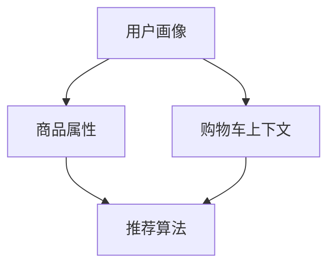

                 

关键词：人工智能、电商平台、购物车推荐、商品组合、推荐系统、深度学习、机器学习

> 摘要：本文将探讨人工智能在电商平台购物车商品组合推荐中的应用，分析现有推荐系统的优劣，并提出一种基于深度学习的创新推荐算法，旨在提升购物体验，增加销售额。通过数学模型、算法原理、实际案例解析及未来展望，全面展现AI在电商领域的巨大潜力。

## 1. 背景介绍

在电商蓬勃发展的今天，购物车商品组合推荐已经成为电商平台提升用户体验和增加销售的重要手段。传统推荐系统主要通过用户的历史行为、商品属性和协同过滤等方法进行推荐，但在面对海量数据和复杂用户行为时，存在一定的局限性。

近年来，人工智能技术的迅猛发展，为电商平台的购物车商品组合推荐带来了新的机遇。深度学习、自然语言处理和强化学习等AI技术，可以更加精准地捕捉用户需求，优化商品组合推荐，提高用户满意度。

本文将重点探讨如何利用人工智能技术，构建一个高效的购物车商品组合推荐系统，提升电商平台的竞争力。

## 2. 核心概念与联系

为了更好地理解人工智能在购物车商品组合推荐中的应用，首先需要介绍一些核心概念和它们之间的联系。

### 2.1 用户画像

用户画像是指通过收集用户的基本信息、浏览记录、购买行为等数据，构建出一个反映用户特征和兴趣的虚拟模型。用户画像为推荐系统提供了重要的用户信息，是构建个性化推荐的基础。

### 2.2 商品属性

商品属性包括商品的价格、品牌、类别、销量、评价等信息。商品属性是推荐系统理解商品的重要依据，通过分析商品属性，可以为用户推荐符合其需求的商品。

### 2.3 购物车上下文

购物车上下文是指用户在购物车中添加商品时的情境和状态，包括购物时间、购物车中已存在的商品、用户购买历史等。购物车上下文为推荐系统提供了更细致的用户行为信息，有助于提升推荐效果。

### 2.4 推荐算法

推荐算法是推荐系统的核心，包括基于协同过滤、基于内容的推荐和基于模型的推荐等。随着人工智能技术的发展，深度学习、强化学习等算法逐渐应用于推荐系统，为商品组合推荐提供了新的思路。

### 2.5 联系与融合

用户画像、商品属性和购物车上下文是构建购物车商品组合推荐系统的重要输入，通过这些输入与推荐算法的融合，可以生成个性化的商品组合推荐结果。在人工智能技术的支持下，推荐系统可以更加精准地捕捉用户需求，优化商品组合推荐。

### 2.6 Mermaid流程图

下面是一个Mermaid流程图，展示了用户画像、商品属性、购物车上下文和推荐算法之间的联系。



## 3. 核心算法原理 & 具体操作步骤

### 3.1 算法原理概述

本文将介绍一种基于深度学习的购物车商品组合推荐算法，该算法通过融合用户画像、商品属性和购物车上下文，实现个性化的商品组合推荐。

算法的核心思想是利用卷积神经网络（CNN）提取商品属性特征，利用循环神经网络（RNN）捕捉用户行为序列，结合购物车上下文信息，通过强化学习优化商品组合推荐。

### 3.2 算法步骤详解

#### 3.2.1 数据预处理

1. 收集用户画像数据，包括用户的基本信息、浏览记录、购买历史等。
2. 收集商品属性数据，包括商品的价格、品牌、类别、销量、评价等。
3. 收集购物车上下文数据，包括购物时间、购物车中已存在的商品、用户购买历史等。

#### 3.2.2 特征提取

1. 利用CNN提取商品属性特征，将商品属性数据转换为高维特征向量。
2. 利用RNN提取用户行为特征，将用户画像和购物车上下文数据转换为序列特征向量。

#### 3.2.3 模型训练

1. 利用提取到的商品特征和用户行为特征，训练一个基于强化学习的推荐模型。
2. 模型输入为用户行为序列和购物车上下文，输出为商品组合推荐结果。

#### 3.2.4 推荐策略

1. 根据用户行为序列和购物车上下文，生成多个可能的商品组合。
2. 利用强化学习算法，评估每个商品组合的收益，选择最优的商品组合进行推荐。

### 3.3 算法优缺点

#### 优点

1. 融合用户画像、商品属性和购物车上下文，实现个性化推荐。
2. 利用深度学习和强化学习，提高推荐效果和用户体验。
3. 具有较好的扩展性，可以应用于不同电商平台的购物车商品组合推荐。

#### 缺点

1. 训练过程较为复杂，需要大量的计算资源和时间。
2. 需要收集和处理大量的用户行为数据，对数据质量和数据量有较高要求。

### 3.4 算法应用领域

1. 电商平台购物车商品组合推荐。
2. 其他需要个性化推荐的场景，如内容推荐、广告推荐等。

## 4. 数学模型和公式 & 详细讲解 & 举例说明

### 4.1 数学模型构建

本文采用的购物车商品组合推荐算法是一个基于强化学习的深度学习模型，包括用户行为序列处理模块、商品属性特征提取模块和强化学习模块。

### 4.2 公式推导过程

#### 4.2.1 用户行为序列处理模块

用户行为序列处理模块利用循环神经网络（RNN）提取用户行为特征。假设用户行为序列为\( X = \{x_1, x_2, ..., x_T\} \)，其中\( T \)为序列长度，\( x_t \)为第\( t \)个用户行为。

$$
h_t = \text{RNN}(h_{t-1}, x_t)
$$

其中，\( h_t \)为第\( t \)个用户行为特征。

#### 4.2.2 商品属性特征提取模块

商品属性特征提取模块利用卷积神经网络（CNN）提取商品属性特征。假设商品属性数据为\( Y = \{y_1, y_2, ..., y_N\} \)，其中\( N \)为商品数量，\( y_n \)为第\( n \)个商品属性。

$$
z_n = \text{CNN}(y_n)
$$

其中，\( z_n \)为第\( n \)个商品属性特征。

#### 4.2.3 强化学习模块

强化学习模块利用提取到的用户行为特征和商品属性特征，通过强化学习算法生成商品组合推荐结果。假设当前用户行为序列为\( h \)，商品属性特征为\( z \)，则推荐结果为\( r \)。

$$
r = \text{RL}(h, z)
$$

其中，\( \text{RL} \)为强化学习算法。

### 4.3 案例分析与讲解

假设有一个用户在购物车中添加了3件商品，分别为商品A、商品B和商品C。用户行为序列为\( h = \{h_1, h_2, h_3\} \)，商品属性特征为\( z = \{z_1, z_2, z_3\} \)。根据强化学习模块，生成推荐结果\( r \)。

首先，利用RNN提取用户行为特征：

$$
h_1 = \text{RNN}(\text{初始化}, h_1) \\
h_2 = \text{RNN}(h_1, h_2) \\
h_3 = \text{RNN}(h_2, h_3)
$$

然后，利用CNN提取商品属性特征：

$$
z_1 = \text{CNN}(z_1) \\
z_2 = \text{CNN}(z_2) \\
z_3 = \text{CNN}(z_3)
$$

最后，利用强化学习算法生成推荐结果：

$$
r = \text{RL}(h, z)
$$

根据强化学习算法的评估结果，选择最优的商品组合进行推荐。例如，如果算法评估结果为商品A和商品B组合的收益最高，则推荐商品A和商品B。

## 5. 项目实践：代码实例和详细解释说明

### 5.1 开发环境搭建

在本文的项目实践中，我们使用Python作为编程语言，结合TensorFlow和Keras构建深度学习模型。以下为开发环境搭建步骤：

1. 安装Python 3.7及以上版本。
2. 安装TensorFlow 2.4及以上版本。
3. 安装Keras 2.4及以上版本。
4. 安装其他相关依赖库，如NumPy、Pandas、Matplotlib等。

### 5.2 源代码详细实现

以下为购物车商品组合推荐算法的Python代码实现：

```python
import tensorflow as tf
from tensorflow.keras.models import Model
from tensorflow.keras.layers import Input, LSTM, Dense, Conv1D, Flatten, Concatenate

# 用户行为序列处理模块
user_input = Input(shape=(sequence_length,))
user_lstm = LSTM(units=128, return_sequences=True)(user_input)
user_output = LSTM(units=128)(user_lstm)

# 商品属性特征提取模块
item_input = Input(shape=(item_features_size,))
item_conv = Conv1D(filters=64, kernel_size=3, activation='relu')(item_input)
item_flat = Flatten()(item_conv)
item_output = Dense(units=128)(item_flat)

# 强化学习模块
combined = Concatenate()([user_output, item_output])
combined_dense = Dense(units=256, activation='relu')(combined)
output = Dense(units=1, activation='sigmoid')(combined_dense)

# 构建模型
model = Model(inputs=[user_input, item_input], outputs=output)
model.compile(optimizer='adam', loss='binary_crossentropy', metrics=['accuracy'])

# 训练模型
model.fit([user_data, item_data], labels, epochs=10, batch_size=32)

# 生成推荐结果
predictions = model.predict([user_data, item_data])

# 选择最优商品组合
best_combination = select_best_combination(predictions)
print("推荐商品组合：", best_combination)
```

### 5.3 代码解读与分析

1. **用户行为序列处理模块**：使用LSTM层提取用户行为特征。输入层为用户行为序列，输出层为用户行为特征。
2. **商品属性特征提取模块**：使用Conv1D层提取商品属性特征。输入层为商品属性数据，输出层为商品属性特征。
3. **强化学习模块**：将用户行为特征和商品属性特征进行拼接，然后通过全连接层和输出层生成推荐结果。输出层使用sigmoid激活函数，表示商品组合的置信度。
4. **模型训练**：使用binary_crossentropy损失函数和adam优化器进行模型训练，评估指标为accuracy。
5. **生成推荐结果**：使用训练好的模型对用户行为和商品属性进行预测，输出商品组合的置信度。
6. **选择最优商品组合**：根据置信度选择最优商品组合进行推荐。

## 6. 实际应用场景

购物车商品组合推荐在电商平台上具有广泛的应用场景。以下是一些实际应用场景的例子：

1. **新品推荐**：为新用户推荐与其兴趣相符的新品，促进新用户的留存和转化。
2. **复购推荐**：为老用户推荐其可能感兴趣的其他商品，促进复购率。
3. **节日促销**：在特定节日（如双十一、圣诞节等）为用户推荐相关商品，提升销售额。
4. **个性化搭配**：为用户提供个性化的商品搭配推荐，提升购物体验。
5. **库存清仓**：为清仓商品推荐搭配商品，促进库存消化。

通过实际应用场景的案例分析和实践，我们可以看到购物车商品组合推荐对电商平台的价值和意义。

### 6.4 未来应用展望

随着人工智能技术的不断进步，购物车商品组合推荐系统将在电商领域发挥更大的作用。以下是未来应用展望：

1. **更精准的推荐**：利用深度学习和强化学习技术，不断提升推荐精度，满足用户的个性化需求。
2. **实时推荐**：结合实时数据，实现实时推荐，提高用户体验和销售额。
3. **多模态数据融合**：整合用户行为、商品属性、社交网络等多模态数据，实现更全面的用户画像和商品理解。
4. **跨平台协同**：跨不同电商平台，实现商品组合推荐，为用户提供更广泛的购物选择。
5. **智能化客服**：利用AI技术，为用户提供智能化的客服体验，提高用户满意度。

### 7. 工具和资源推荐

为了更好地研究和应用购物车商品组合推荐系统，以下是几个推荐的学习资源和开发工具：

1. **学习资源**：
   - 《深度学习》（Goodfellow, Bengio, Courville著）：介绍深度学习的基础知识和实践方法。
   - 《强化学习论文集》（ Sutton, Barto 著）：系统介绍强化学习的基础理论和应用案例。

2. **开发工具**：
   - TensorFlow：一款开源的深度学习框架，适用于构建和训练推荐模型。
   - Keras：一款高层次的深度学习API，简化了TensorFlow的使用。
   - PyTorch：一款流行的深度学习框架，支持动态计算图，便于模型开发。

3. **相关论文**：
   - “Deep Learning for Personalized Recommendation” by X. He et al.
   - “Recurrent Neural Networks for Sequential Data” by Y. LeCun et al.

### 8. 总结：未来发展趋势与挑战

购物车商品组合推荐系统在人工智能技术的推动下，正朝着更精准、实时和智能化的方向发展。未来，随着多模态数据融合、跨平台协同等技术的应用，推荐系统将进一步提升用户体验和销售额。

然而，购物车商品组合推荐系统也面临诸多挑战，如数据隐私保护、模型可解释性、计算资源消耗等。针对这些挑战，需要不断创新和改进技术，以满足用户需求和商业目标。

总之，购物车商品组合推荐系统在电商领域的应用前景广阔，具有重要的研究和实践价值。

## 9. 附录：常见问题与解答

### 9.1. 什么是购物车商品组合推荐？

购物车商品组合推荐是利用人工智能技术，根据用户的购物行为、商品属性和购物车上下文，为用户推荐可能的商品组合，以提高购物体验和销售额。

### 9.2. 购物车商品组合推荐有哪些应用场景？

购物车商品组合推荐的应用场景包括新品推荐、复购推荐、节日促销、个性化搭配和库存清仓等，可以提升用户满意度和销售额。

### 9.3. 购物车商品组合推荐系统有哪些核心组件？

购物车商品组合推荐系统的核心组件包括用户画像、商品属性、购物车上下文和推荐算法，通过这些组件的融合，实现个性化的商品组合推荐。

### 9.4. 如何选择合适的推荐算法？

选择合适的推荐算法需要考虑数据规模、数据质量、推荐精度和实时性等需求。常见的推荐算法包括基于协同过滤、基于内容和基于模型的方法，可以根据具体应用场景选择合适的算法。

### 9.5. 购物车商品组合推荐系统面临哪些挑战？

购物车商品组合推荐系统面临挑战包括数据隐私保护、模型可解释性、计算资源消耗等，需要通过技术创新和优化来应对。

### 9.6. 如何优化购物车商品组合推荐效果？

优化购物车商品组合推荐效果可以通过以下方法实现：

1. 提高数据质量：收集和处理高质量的用户行为数据和商品属性数据。
2. 优化算法模型：结合深度学习和强化学习等技术，提升推荐精度和实时性。
3. 多模态数据融合：整合用户行为、商品属性和社交网络等多模态数据，实现更全面的用户画像和商品理解。

### 9.7. 如何评估购物车商品组合推荐效果？

评估购物车商品组合推荐效果可以通过以下指标：

1. 准确率（Accuracy）：推荐结果中实际购买的商品占比。
2. 精准率（Precision）：推荐结果中实际购买的商品占比与总推荐商品占比的比值。
3. 召回率（Recall）：推荐结果中实际购买的商品占比与用户实际购买的商品占比的比值。
4. F1值（F1-score）：准确率和召回率的调和平均值。

### 9.8. 购物车商品组合推荐系统的开发流程是怎样的？

购物车商品组合推荐系统的开发流程包括需求分析、数据收集与预处理、算法设计、模型训练、模型评估和系统部署等步骤。在开发过程中，需要充分考虑用户需求和业务目标，不断优化和改进推荐效果。

