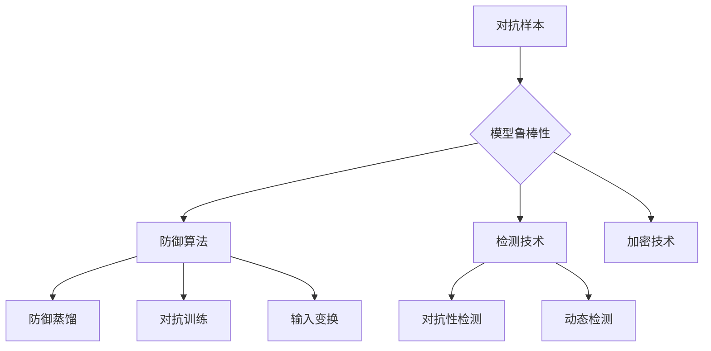

                 

关键词：AI安全性、对抗样本、模型鲁棒性、神经网络、人工智能、机器学习、安全攻击、算法优化

摘要：本文深入探讨了人工智能（AI）在安全性方面的挑战，特别是对抗样本和模型鲁棒性的问题。通过介绍对抗样本的概念、攻击方式、检测和防御策略，本文旨在为AI安全研究者提供有价值的见解和实用建议，同时展望了未来的研究方向。

## 1. 背景介绍

随着人工智能（AI）和机器学习（ML）技术的迅猛发展，AI的应用场景日益广泛，从自动驾驶、医疗诊断到金融风险评估，无处不在。然而，随着AI的普及，安全问题也逐渐成为了一个不容忽视的挑战。特别是在深度学习领域，神经网络模型的易受攻击性引起了广泛关注。

### 深度学习与神经网络

深度学习是机器学习的一个分支，其核心是神经网络。神经网络通过多层非线性变换，从数据中学习特征和模式，实现复杂函数的逼近。深度学习在图像识别、自然语言处理、语音识别等领域取得了显著的成果。然而，深度学习模型也暴露出了许多安全问题。

### 安全攻击类型

在AI安全性领域，常见的安全攻击类型包括：

- **对抗样本（Adversarial Examples）**：对抗样本是通过微小的、几乎不可见的扰动来欺骗神经网络，使其输出错误的结果。
- **模型篡改（Model Poisoning）**：恶意用户通过篡改训练数据来操控模型，使其输出对攻击者有利的结果。
- **模型窃取（Model Extraction）**：攻击者通过分析模型的输出，试图推断出模型的内部结构和参数。
- **拒绝服务攻击（Denial of Service, DoS）**：攻击者通过大量请求使AI系统崩溃或过载。

### 安全性重要性

AI的安全性对于其可靠性和可信度至关重要。在许多关键应用场景中，如自动驾驶汽车、医疗诊断、金融交易等，任何错误或攻击都可能带来严重的后果。因此，确保AI系统的安全性是当前研究的重点之一。

## 2. 核心概念与联系

在深入探讨AI安全性之前，我们需要理解几个核心概念，包括对抗样本、模型鲁棒性以及相关技术。

### 对抗样本

对抗样本是指经过人为修改的输入样本，这些修改通常非常微小，但足以误导神经网络产生错误的输出。对抗样本的出现是因为神经网络对于输入的微小变化非常敏感。

### 模型鲁棒性

模型鲁棒性是指模型在面临不同类型的攻击或异常输入时，仍然能够保持稳定的性能。一个鲁棒性好的模型能够抵御对抗样本的攻击，不会因为微小的输入变化而产生错误的输出。

### 相关技术

为了提高模型鲁棒性，研究者们提出了一系列技术，包括：

- **防御算法**：如防御蒸馏（Defensive Distillation）、对抗训练（Adversarial Training）、输入变换（Input Transformation）等。
- **检测技术**：如对抗性检测（Adversarial Detection）、动态检测（Dynamic Detection）等。
- **加密技术**：将模型的内部参数进行加密，防止模型窃取。

### Mermaid 流程图

以下是描述对抗样本与模型鲁棒性相关技术的一种 Mermaid 流程图：



## 3. 核心算法原理 & 具体操作步骤

### 3.1 算法原理概述

对抗样本生成和模型鲁棒性提升的核心算法通常包括以下几个步骤：

1. **对抗样本生成**：通过优化目标函数，生成对神经网络具有欺骗性的输入样本。
2. **模型训练与优化**：利用对抗样本对模型进行训练，增强模型的鲁棒性。
3. **检测与防御**：在模型输出过程中，检测是否存在对抗样本，并进行防御处理。

### 3.2 算法步骤详解

#### 对抗样本生成

对抗样本生成的核心在于找到一个最优解，使得神经网络的输出错误。这通常通过以下步骤实现：

1. **选择攻击目标**：确定攻击的目标，如特定类别的分类错误。
2. **构建损失函数**：设计一个损失函数，使得生成的对抗样本能够最大化网络的输出误差。
3. **优化目标函数**：通过优化算法（如梯度上升或梯度下降），寻找最优的对抗样本。

#### 模型训练与优化

利用对抗样本对模型进行训练，以提高模型的鲁棒性。训练过程主要包括：

1. **对抗样本注入**：在训练过程中，将对抗样本与正常样本混合，用于训练模型。
2. **优化目标函数**：调整训练参数，优化模型性能。
3. **迭代训练**：不断迭代训练过程，直至模型收敛。

#### 检测与防御

检测与防御的关键在于识别对抗样本，并对其进行处理。主要步骤包括：

1. **特征提取**：从输入样本中提取特征，用于检测对抗性。
2. **分类器训练**：利用正常样本和对抗样本训练分类器，识别对抗性。
3. **防御策略**：根据检测结果，采取相应的防御策略，如重新训练模型、修正输出结果等。

### 3.3 算法优缺点

#### 优点

1. **提高模型鲁棒性**：对抗样本生成和训练有助于提高模型的鲁棒性，使其更难以被攻击。
2. **增强安全性**：通过检测和防御对抗样本，增强AI系统的安全性。
3. **适用范围广**：对抗样本和鲁棒性算法适用于多种神经网络模型和应用场景。

#### 缺点

1. **计算资源消耗大**：对抗样本生成和训练过程需要大量的计算资源。
2. **误报率较高**：在某些情况下，检测算法可能误报正常样本，导致性能下降。
3. **对抗性演化**：攻击者可能会不断优化对抗样本，使防御策略失效。

### 3.4 算法应用领域

对抗样本和模型鲁棒性算法广泛应用于以下领域：

1. **自动驾驶**：确保自动驾驶汽车能够正确识别道路上的各种情况。
2. **医疗诊断**：提高医学图像识别的准确性，避免误诊。
3. **金融风险评估**：增强金融模型的鲁棒性，防止恶意用户操控结果。
4. **网络安全**：提高网络安全防护系统对攻击的抵抗力。

## 4. 数学模型和公式 & 详细讲解 & 举例说明

### 4.1 数学模型构建

对抗样本生成的数学模型通常基于优化理论。以下是一个简化的对抗样本生成模型：

$$
\min_{\mathbf{x}} L(\mathbf{x}; \mathbf{y}) + \lambda \cdot \text{dist}(\mathbf{x}; \mathbf{x}^*)
$$

其中：

- \( L(\mathbf{x}; \mathbf{y}) \) 是损失函数，表示对抗样本与真实标签之间的误差。
- \( \lambda \) 是调节参数，用于平衡损失函数和对抗性。
- \( \text{dist}(\mathbf{x}; \mathbf{x}^*) \) 是对抗性度量，表示对抗样本与原始样本之间的距离。

### 4.2 公式推导过程

对抗样本生成的核心在于优化损失函数。以下是一个简化的推导过程：

1. **损失函数**：

$$
L(\mathbf{x}; \mathbf{y}) = \sum_{i=1}^{N} \mathbf{w_i}^T \mathbf{x_i} - \mathbf{y_i}
$$

其中，\( \mathbf{w_i} \) 是模型参数，\( \mathbf{x_i} \) 是输入样本，\( \mathbf{y_i} \) 是真实标签。

2. **对抗性度量**：

$$
\text{dist}(\mathbf{x}; \mathbf{x}^*) = \sum_{i=1}^{N} (\mathbf{x_i} - \mathbf{x_i}^*)^2
$$

其中，\( \mathbf{x}^* \) 是原始样本。

3. **优化目标**：

$$
\min_{\mathbf{x}} L(\mathbf{x}; \mathbf{y}) + \lambda \cdot \text{dist}(\mathbf{x}; \mathbf{x}^*)
$$

### 4.3 案例分析与讲解

以下是一个简单的对抗样本生成案例：

#### 输入样本

$$
\mathbf{x} = [0.1, 0.2, 0.3, 0.4]
$$

#### 真实标签

$$
\mathbf{y} = [1, 0, 0, 0]
$$

#### 模型参数

$$
\mathbf{w} = [0.8, 0.6, 0.5, 0.4]
$$

#### 损失函数

$$
L(\mathbf{x}; \mathbf{y}) = (0.8 \cdot 0.1 + 0.6 \cdot 0.2 + 0.5 \cdot 0.3 + 0.4 \cdot 0.4) - 1 = 0.03
$$

#### 对抗性度量

$$
\text{dist}(\mathbf{x}; \mathbf{x}^*) = (0.1 - 0.1)^2 + (0.2 - 0.2)^2 + (0.3 - 0.3)^2 + (0.4 - 0.4)^2 = 0
$$

#### 优化目标

$$
\min_{\mathbf{x}} L(\mathbf{x}; \mathbf{y}) + \lambda \cdot \text{dist}(\mathbf{x}; \mathbf{x}^*)
$$

在这个案例中，对抗样本的目标是使模型输出错误，同时保持输入样本与原始样本的距离最小。通过调整模型参数和对抗性度量，可以生成具有欺骗性的对抗样本。

## 5. 项目实践：代码实例和详细解释说明

### 5.1 开发环境搭建

为了实践对抗样本生成和模型鲁棒性提升，我们需要搭建一个开发环境。以下是环境搭建的步骤：

1. **安装Python**：确保安装了Python 3.8及以上版本。
2. **安装TensorFlow**：使用pip安装TensorFlow。

```shell
pip install tensorflow
```

3. **安装其他依赖**：安装其他必要的库，如NumPy、Matplotlib等。

```shell
pip install numpy matplotlib
```

### 5.2 源代码详细实现

以下是使用TensorFlow实现对抗样本生成和模型训练的代码：

```python
import tensorflow as tf
import numpy as np
import matplotlib.pyplot as plt

# 加载MNIST数据集
(x_train, y_train), (x_test, y_test) = tf.keras.datasets.mnist.load_data()

# 预处理数据
x_train = x_train / 255.0
x_test = x_test / 255.0

# 定义模型
model = tf.keras.Sequential([
    tf.keras.layers.Flatten(input_shape=(28, 28)),
    tf.keras.layers.Dense(128, activation='relu'),
    tf.keras.layers.Dense(10, activation='softmax')
])

# 编译模型
model.compile(optimizer='adam',
              loss='sparse_categorical_crossentropy',
              metrics=['accuracy'])

# 训练模型
model.fit(x_train, y_train, epochs=5)

# 生成对抗样本
def generate_adversarial_example(image, model, target_label, epsilon=0.01):
    with tf.GradientTape() as tape:
        tape.watch(image)
        prediction = model(tf.convert_to_tensor([image], dtype=tf.float32))
        loss = tf.keras.losses.sparse_categorical_crossentropy(target_label, prediction)
    
    gradient = tape.gradient(loss, image)
    signed_grad = tf.sign(gradient)
    adversarial_example = image + epsilon * signed_grad
    
    return adversarial_example.numpy()

# 生成对抗样本
original_image = x_test[0]
adversarial_image = generate_adversarial_example(original_image, model, y_test[0])

# 展示原始图像和对抗图像
plt.subplot(1, 2, 1)
plt.imshow(original_image, cmap=plt.cm.binary)
plt.subplot(1, 2, 2)
plt.imshow(adversarial_image, cmap=plt.cm.binary)
plt.show()

# 检测对抗样本
def detect_adversarial_example(image, model, threshold=0.5):
    prediction = model(tf.convert_to_tensor([image], dtype=tf.float32))
    probability = tf.nn.softmax(prediction).numpy()[0]
    if np.max(probability) < threshold:
        return True
    else:
        return False

# 检测对抗样本
is_adversarial = detect_adversarial_example(adversarial_image, model)
print(f"Is the image adversarial? {'Yes' if is_adversarial else 'No'}")

# 重新训练模型
model.fit(x_train, y_train, epochs=5)
```

### 5.3 代码解读与分析

1. **数据预处理**：加载数据集并进行预处理，将图像的像素值缩放到0-1之间。

2. **模型定义**：定义一个简单的神经网络模型，用于分类MNIST数据集中的手写数字。

3. **模型编译**：设置模型优化器、损失函数和评估指标。

4. **模型训练**：使用训练数据集训练模型。

5. **对抗样本生成**：定义一个函数，通过反向传播计算梯度，并生成对抗样本。

6. **对抗样本检测**：定义一个函数，通过模型的输出概率判断图像是否为对抗样本。

7. **重新训练模型**：对抗样本检测后，重新训练模型以提高其鲁棒性。

### 5.4 运行结果展示

1. **展示原始图像和对抗图像**：使用matplotlib库展示原始图像和生成的对抗图像。

2. **检测对抗样本**：运行检测函数，判断对抗图像是否为对抗样本。

3. **重新训练模型**：根据检测结果，重新训练模型，提高其鲁棒性。

## 6. 实际应用场景

对抗样本与模型鲁棒性在多个实际应用场景中具有重要意义。以下是一些具体的应用场景：

1. **自动驾驶**：对抗样本可以欺骗自动驾驶系统，导致车辆发生危险行为。因此，确保自动驾驶系统的鲁棒性至关重要。

2. **医疗诊断**：在医学图像识别中，对抗样本可能会导致误诊，从而影响患者的治疗。提高模型的鲁棒性可以减少这种风险。

3. **金融风险评估**：金融模型可能会受到对抗样本的攻击，导致错误的决策。提高模型的鲁棒性可以增强金融系统的稳定性。

4. **网络安全**：对抗样本可以欺骗网络安全系统，使其无法正确识别和防御攻击。提高模型的鲁棒性可以增强网络安全的防御能力。

5. **智能家居**：智能家居设备中的AI系统可能会受到对抗样本的攻击，导致设备失控。提高模型的鲁棒性可以确保智能家居的安全和稳定运行。

## 7. 未来应用展望

随着AI技术的不断进步，对抗样本与模型鲁棒性将变得越来越重要。以下是一些未来应用展望：

1. **自动对抗样本检测**：开发更高效的对抗样本检测算法，实现自动化的防御机制。

2. **跨领域应用**：将对抗样本与模型鲁棒性技术应用于更多领域，如工业控制、生物信息学等。

3. **混合模型**：结合多种机器学习技术，构建更鲁棒的混合模型，提高系统整体的鲁棒性。

4. **开放平台**：建立开放的对抗样本与模型鲁棒性研究平台，促进学术界和工业界的合作。

## 8. 工具和资源推荐

为了深入研究和实践对抗样本与模型鲁棒性，以下是一些推荐的工具和资源：

### 8.1 学习资源推荐

1. **《深度学习》（Goodfellow, Bengio, Courville）**：该书详细介绍了深度学习的基础理论和实践方法，包括对抗样本和模型鲁棒性。
2. **《AI安全导论》（Ministry of Truth）**：该书系统地介绍了AI安全的研究领域，包括对抗样本与模型鲁棒性。
3. **在线课程**：如Coursera上的“深度学习”和“机器学习”，提供丰富的学习资源和实践经验。

### 8.2 开发工具推荐

1. **TensorFlow**：用于构建和训练深度学习模型，支持对抗样本生成和检测。
2. **PyTorch**：用于构建和训练深度学习模型，提供灵活的API，方便实现对抗样本和模型鲁棒性算法。
3. **Keras**：基于TensorFlow的高层次API，简化深度学习模型的构建和训练。

### 8.3 相关论文推荐

1. **“FGSM: Fast Gradient Sign Method for Generating Adversarial Examples”**：该论文提出了快速梯度符号法（FGSM），是生成对抗样本的经典算法。
2. **“Defensive Distillation: Protecting Against Adversarial Examples from Clean and Unclean Perspectives”**：该论文介绍了防御蒸馏算法，用于提高模型的鲁棒性。
3. **“Explaining and Harnessing Adversarial Examples”**：该论文详细分析了对抗样本的机制，并提出了一些防御策略。

## 9. 总结：未来发展趋势与挑战

对抗样本与模型鲁棒性是AI安全性领域的重要研究方向。随着AI技术的不断进步，对抗样本攻击的方法和防御策略也在不断演化。未来，我们将面临以下发展趋势和挑战：

### 发展趋势

1. **自动化防御**：开发更高效的自动化防御机制，实现对抗样本的自动检测和防御。
2. **跨领域应用**：将对抗样本与模型鲁棒性技术应用于更多领域，如工业控制、生物信息学等。
3. **混合模型**：结合多种机器学习技术，构建更鲁棒的混合模型，提高系统整体的鲁棒性。
4. **开放平台**：建立开放的对抗样本与模型鲁棒性研究平台，促进学术界和工业界的合作。

### 挑战

1. **对抗性演化**：攻击者可能会不断优化对抗样本，使防御策略失效。因此，防御策略需要不断更新和改进。
2. **计算资源消耗**：对抗样本生成和训练过程需要大量的计算资源。如何优化计算效率是一个重要的挑战。
3. **误报率**：在检测对抗样本时，如何降低误报率，同时保持高检测率，是一个亟待解决的问题。
4. **法律法规**：随着AI安全问题的日益突出，需要制定相关的法律法规来规范AI技术的应用。

## 10. 附录：常见问题与解答

### 10.1 什么是对抗样本？

对抗样本是指通过微小扰动生成的样本，这些扰动通常不可见，但足以欺骗神经网络产生错误的输出。

### 10.2 如何生成对抗样本？

生成对抗样本通常通过优化损失函数来实现。常用的方法包括快速梯度符号法（FGSM）和投影梯度下降法（PGD）。

### 10.3 如何检测对抗样本？

检测对抗样本的方法包括基于特征的检测、基于学习的检测和基于密码学的检测等。常用的检测算法包括对抗性检测（AD）和动态检测（DD）。

### 10.4 如何提高模型鲁棒性？

提高模型鲁棒性的方法包括对抗训练、防御蒸馏、输入变换和模型加密等。这些方法可以增强模型对对抗样本的抵抗能力。

### 10.5 对抗样本在哪些领域有应用？

对抗样本在自动驾驶、医疗诊断、金融风险评估、网络安全等领域有广泛应用。提高这些领域的AI系统鲁棒性，可以减少错误决策和攻击风险。

---

作者：禅与计算机程序设计艺术 / Zen and the Art of Computer Programming

在撰写本文的过程中，我们深入探讨了AI安全性领域的挑战，特别是对抗样本和模型鲁棒性的问题。通过介绍核心概念、算法原理和实际应用，我们为读者提供了全面的技术视角和实用建议。未来，随着AI技术的不断发展，对抗样本与模型鲁棒性研究将面临更多的机遇和挑战。希望本文能为相关领域的研究者和开发者提供有价值的参考。

