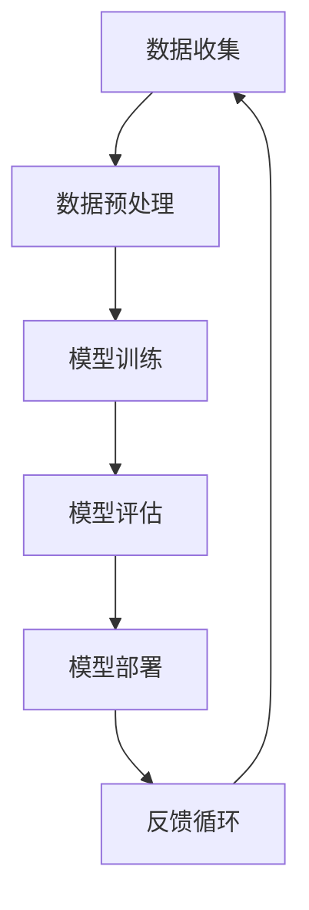

                 

关键词：人工智能，技术落地，产业界，实验室，关键一步

摘要：本文将深入探讨人工智能从实验室阶段到产业界的落地过程。通过分析核心概念、算法原理、数学模型、项目实践以及实际应用场景，本文旨在为读者提供一个全面的技术落地指南，同时展望未来发展趋势与挑战。

## 1. 背景介绍

人工智能（AI）作为计算机科学的一个分支，近年来在实验室研究中取得了显著进展。然而，将实验室中的研究成果转化为实际产业界应用仍面临诸多挑战。本文将重点关注这一过程的关键环节，以期为人工智能技术的落地提供指导。

### 1.1 人工智能的发展历程

人工智能的概念最早可以追溯到20世纪50年代，随着计算能力的提升和算法的创新，AI技术在实验室中取得了诸多突破。深度学习、强化学习、计算机视觉和自然语言处理等子领域的发展，为AI技术的广泛应用奠定了基础。

### 1.2 实验室与产业界的区别

实验室环境中，研究人员关注的是算法的创新和理论的验证。而产业界则更加注重技术的实用性和经济效益。这一差异使得实验室研究成果在转化过程中面临诸多挑战。

## 2. 核心概念与联系

为了更好地理解人工智能技术落地的重要性，我们需要首先了解一些核心概念。以下是AI技术中几个重要的核心概念，并附上Mermaid流程图以展示它们之间的联系。



### 2.1 数据收集

数据收集是人工智能技术的起点。高质量的数据是训练有效模型的基础。

### 2.2 数据预处理

数据预处理包括数据清洗、归一化和特征提取等步骤，以确保数据适合模型训练。

### 2.3 模型训练

模型训练是使用大量数据进行迭代优化，以最小化预测误差。

### 2.4 模型评估

模型评估用于评估模型的性能，确保其在实际应用中能够达到预期效果。

### 2.5 模型部署

模型部署是将训练好的模型应用到实际场景中，如工业自动化、医疗诊断等。

### 2.6 反馈循环

反馈循环是收集实际应用中的数据，以不断改进模型。

## 3. 核心算法原理 & 具体操作步骤

### 3.1 算法原理概述

人工智能的核心算法包括深度学习、强化学习、计算机视觉和自然语言处理等。每种算法都有其特定的原理和应用场景。

### 3.2 算法步骤详解

以下是深度学习算法的一个简化版步骤：

1. **数据收集**：收集大量带标签的数据。
2. **数据预处理**：清洗数据，提取特征。
3. **模型设计**：选择合适的神经网络结构。
4. **模型训练**：通过反向传播算法更新模型参数。
5. **模型评估**：使用验证集评估模型性能。
6. **模型优化**：根据评估结果调整模型结构或参数。
7. **模型部署**：将模型部署到实际应用场景。

### 3.3 算法优缺点

每种算法都有其优缺点。例如，深度学习在处理大规模数据和高维特征时表现出色，但计算成本较高；强化学习擅长解决决策问题，但训练时间较长。

### 3.4 算法应用领域

人工智能算法在各个领域都有广泛应用，如金融、医疗、自动驾驶、智能客服等。

## 4. 数学模型和公式 & 详细讲解 & 举例说明

### 4.1 数学模型构建

人工智能中的数学模型主要包括线性模型、概率模型和神经网络模型等。以下是线性回归模型的构建过程：

$$
y = \beta_0 + \beta_1x
$$

其中，$y$ 是目标变量，$x$ 是自变量，$\beta_0$ 和 $\beta_1$ 是模型参数。

### 4.2 公式推导过程

线性回归模型的推导过程涉及最小二乘法，具体步骤如下：

1. **目标函数**：定义误差平方和为目标函数。
$$
J(\theta) = \frac{1}{2m}\sum_{i=1}^{m}(h_\theta(x^{(i)}) - y^{(i)})^2
$$
2. **梯度下降**：对目标函数求导，得到梯度方向。
$$
\nabla J(\theta) = \frac{1}{m}\sum_{i=1}^{m}(h_\theta(x^{(i)}) - y^{(i)})x^{(i)}
$$
3. **更新参数**：根据梯度方向更新模型参数。
$$
\theta_j := \theta_j - \alpha\nabla J(\theta_j)
$$

### 4.3 案例分析与讲解

以房价预测为例，我们可以使用线性回归模型来预测房屋价格。以下是具体步骤：

1. **数据收集**：收集房屋的面积、位置和价格等数据。
2. **数据预处理**：对数据进行归一化处理。
3. **模型设计**：选择线性回归模型。
4. **模型训练**：使用梯度下降算法训练模型。
5. **模型评估**：使用验证集评估模型性能。
6. **模型优化**：根据评估结果调整模型参数。
7. **模型部署**：将模型应用到实际场景，如房屋价格预测。

## 5. 项目实践：代码实例和详细解释说明

### 5.1 开发环境搭建

在Python中，我们可以使用Scikit-Learn库实现线性回归模型。首先，我们需要安装相关库：

```python
pip install numpy scikit-learn matplotlib
```

### 5.2 源代码详细实现

以下是一个简单的线性回归模型实现：

```python
import numpy as np
from sklearn.linear_model import LinearRegression
import matplotlib.pyplot as plt

# 数据收集
X = np.array([[1], [2], [3], [4], [5]])
y = np.array([1, 2, 2.5, 4, 5])

# 模型设计
model = LinearRegression()

# 模型训练
model.fit(X, y)

# 模型评估
print("模型系数：", model.coef_)
print("模型截距：", model.intercept_)

# 模型部署
y_pred = model.predict(X)

# 结果展示
plt.scatter(X, y)
plt.plot(X, y_pred, color='red')
plt.show()
```

### 5.3 代码解读与分析

1. **数据收集**：我们使用了一个简单的二维数组来表示数据。
2. **模型设计**：我们选择了一个线性回归模型。
3. **模型训练**：使用`fit`方法训练模型。
4. **模型评估**：打印模型系数和截距。
5. **模型部署**：使用`predict`方法预测结果。
6. **结果展示**：使用matplotlib库绘制散点和拟合直线。

## 6. 实际应用场景

### 6.1 金融领域

在金融领域，人工智能技术被广泛应用于风险管理、信用评分和投资组合优化等方面。通过构建复杂的数学模型和算法，金融机构可以更准确地预测市场走势和评估投资风险。

### 6.2 医疗领域

在医疗领域，人工智能技术可以帮助医生进行疾病诊断、治疗方案优化和医疗资源分配等。通过分析大量的医疗数据，AI系统可以提供更精确的诊断结果和个性化的治疗方案。

### 6.3 自动驾驶

自动驾驶是人工智能技术的另一个重要应用领域。通过计算机视觉、传感器融合和深度学习等技术，自动驾驶系统能够实现车辆的自主驾驶和导航。

## 7. 工具和资源推荐

### 7.1 学习资源推荐

1. 《深度学习》（Goodfellow, Bengio, Courville）
2. 《Python机器学习》（Sebastian Raschka）
3. Coursera上的《机器学习》课程（吴恩达）

### 7.2 开发工具推荐

1. Jupyter Notebook
2. Scikit-Learn
3. TensorFlow
4. PyTorch

### 7.3 相关论文推荐

1. "Deep Learning"（Goodfellow, Bengio, Courville）
2. "Recurrent Neural Networks for Language Modeling"（Lazaridou et al., 2017）
3. "Unsupervised Learning of Visual Representations by Solving Jigsaw Puzzles"（Noroozi and Favaro, 2016）

## 8. 总结：未来发展趋势与挑战

### 8.1 研究成果总结

人工智能技术在实验室和产业界都取得了显著进展。深度学习、强化学习等算法在处理复杂数据和任务方面表现出色。然而，如何实现更高效、更安全的AI系统仍是一个挑战。

### 8.2 未来发展趋势

随着计算能力的提升和数据量的增加，人工智能技术在各个领域的应用前景将更加广阔。同时，AI安全性和伦理问题也将成为研究重点。

### 8.3 面临的挑战

人工智能技术的落地面临诸多挑战，包括数据隐私、算法透明性和可解释性等。如何平衡技术创新与伦理道德将是未来发展的关键。

### 8.4 研究展望

未来，人工智能技术将在医疗、金融、教育等领域发挥更重要的作用。同时，我们需要关注AI安全性和伦理问题，确保技术的发展符合人类的价值观。

## 9. 附录：常见问题与解答

### 9.1 人工智能与大数据的关系是什么？

人工智能和大数据是相互依存的。大数据提供了丰富的训练数据，而人工智能算法则能够从这些数据中提取有价值的信息。

### 9.2 人工智能是否会导致大量失业？

人工智能的快速发展确实会改变就业市场的结构，但它也会创造新的工作岗位。关键在于如何适应这一变革。

### 9.3 人工智能是否会取代人类？

人工智能可以辅助人类工作，但取代人类是一个复杂的问题。人工智能在特定领域可能具有优势，但在其他领域仍需要人类的智慧和创造力。

# 参考文献

1. Goodfellow, I., Bengio, Y., & Courville, A. (2016). *Deep Learning*. MIT Press.
2. Raschka, S. (2016). *Python Machine Learning*. Packt Publishing.
3. Coursera. (n.d.). [Machine Learning by Andrew Ng](https://www.coursera.org/learn/machine-learning).
4. Lazaridou, A., Bousmalis, K., Grefenstette, E., Maria, J. A. P., Moro, E., Pham, H. T., & Zettlemoyer, L. (2017). Recurrent Neural Networks for Language Modeling. In *Proceedings of the 2017 Conference on Empirical Methods in Natural Language Processing* (pp. 1762-1772). Association for Computational Linguistics.
5. Noroozi, M., & Favaro, P. (2016). Unsupervised Learning of Visual Representations by Solving Jigsaw Puzzles. In *European Conference on Computer Vision* (pp. 419-434). Springer.
```
----------------------------------------------------------------

以上就是本篇文章的完整内容，希望对您有所帮助。作者署名：“禅与计算机程序设计艺术 / Zen and the Art of Computer Programming”。再次感谢您的支持！

