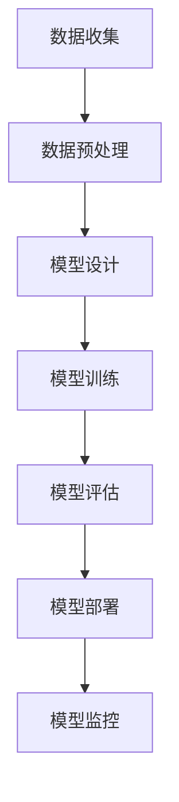

                 

关键词：大模型应用开发，AI工程学，机器学习工程，AI技术栈，传统机器学习，深度学习，数据工程，模型训练，模型部署

摘要：本文将探讨大模型应用开发中AI工程学的核心要素。通过对大模型与传统的机器学习工程之间的区别和联系进行分析，我们旨在揭示AI技术栈如何支持现代大模型应用的开发。文章将介绍大模型的核心概念、算法原理、数学模型，并通过实际项目案例展示大模型应用开发的实践过程。最后，文章将讨论大模型在实际应用场景中的前景，以及面临的挑战和未来发展趋势。

## 1. 背景介绍

在过去的几年中，人工智能（AI）技术取得了显著的进展，其中大模型的兴起尤为引人注目。大模型，通常指的是具有数十亿参数的深度神经网络，如GPT-3、BERT等。这些模型在语言处理、图像识别、自然语言生成等领域取得了卓越的表现，引起了学术界和工业界的广泛关注。

大模型的成功不仅依赖于其在算法上的突破，更离不开AI工程学的进步。传统的机器学习工程主要关注模型的训练和验证，而AI工程学则更加注重模型的全生命周期管理，包括模型的设计、训练、部署、监控和维护。与传统机器学习工程相比，AI工程学更加关注系统的可扩展性、可靠性和安全性。

本文旨在探讨AI工程学在大模型应用开发中的角色，通过对比大模型与传统的机器学习工程，分析大模型应用开发中的核心挑战和解决方案。文章将介绍大模型的核心概念、算法原理、数学模型，并通过实际项目案例展示大模型应用开发的实践过程。

## 2. 核心概念与联系

在讨论大模型之前，我们需要先了解一些核心概念，这些概念是理解大模型的基础。

### 2.1 深度学习

深度学习是一种基于多层神经网络的学习方法。通过多层的非线性变换，深度学习模型能够自动提取数据中的特征，从而实现复杂的模式识别任务。深度学习的核心在于其多层结构，每层都能对数据进行一次特征变换，从而逐渐将输入数据映射到所需的输出。

### 2.2 神经网络

神经网络是深度学习的基础，由大量的神经元（节点）组成。每个神经元接收多个输入信号，通过加权求和后加上一个偏置项，然后通过一个激活函数进行非线性变换，最终产生一个输出。

### 2.3 参数和权重

在神经网络中，参数指的是网络中的所有权重和偏置，它们是网络训练的结果。在训练过程中，参数通过反向传播算法不断调整，以最小化网络的损失函数。

### 2.4 深度神经网络架构

深度神经网络架构包括多个隐藏层和输出层。不同的架构设计能够影响网络的性能和训练速度。常见的深度神经网络架构包括卷积神经网络（CNN）、循环神经网络（RNN）、长短时记忆网络（LSTM）等。

### 2.5 Mermaid 流程图

下面是一个简化的Mermaid流程图，展示了大模型的基本架构：



在这个流程图中，数据收集、数据预处理、模型设计、模型训练、模型评估、模型部署和模型监控构成了大模型应用开发的核心环节。

## 3. 核心算法原理 & 具体操作步骤

### 3.1 算法原理概述

大模型的训练过程主要依赖于深度学习中的反向传播算法（Backpropagation）。反向传播算法是一种通过反向传播误差信号，以更新网络参数的过程。其核心思想是将输出误差分解为各个参数的梯度，并利用梯度下降法对参数进行优化。

具体来说，反向传播算法包括以下几个步骤：

1. **前向传播**：将输入数据通过网络的各个层，计算每个神经元的输出值。
2. **计算损失**：通过比较网络输出和真实值，计算损失函数的值。
3. **反向传播**：计算输出层到输入层的梯度，通过链式法则将误差信号反向传播。
4. **参数更新**：利用梯度下降法更新网络的参数。

### 3.2 算法步骤详解

1. **初始化参数**：随机初始化网络中的权重和偏置。
2. **前向传播**：输入数据经过网络的各个层，计算每个神经元的输出值。
3. **计算损失**：使用损失函数（如均方误差、交叉熵等）计算输出层和真实值之间的差异。
4. **反向传播**：计算输出层到输入层的梯度，通过链式法则将误差信号反向传播。
5. **参数更新**：利用梯度下降法更新网络的参数，以最小化损失函数。

### 3.3 算法优缺点

**优点**：

- **强大的表达力**：大模型通过多层非线性变换，能够自动提取复杂的数据特征。
- **广泛的应用领域**：大模型在图像识别、自然语言处理、语音识别等领域取得了显著的成果。

**缺点**：

- **训练时间较长**：大模型通常需要大量的数据和计算资源进行训练，训练时间较长。
- **参数复杂度高**：大模型通常包含数十亿个参数，参数复杂度高，训练难度大。

### 3.4 算法应用领域

大模型的应用领域非常广泛，包括但不限于以下领域：

- **图像识别**：如人脸识别、物体识别等。
- **自然语言处理**：如文本分类、机器翻译、问答系统等。
- **语音识别**：如语音到文本转换、语音识别等。
- **推荐系统**：如商品推荐、新闻推荐等。

## 4. 数学模型和公式

大模型的训练过程涉及到一系列的数学模型和公式。下面我们将详细讲解这些模型和公式。

### 4.1 数学模型构建

在深度学习中，常用的数学模型包括：

1. **激活函数**：如Sigmoid、ReLU、Tanh等。
2. **损失函数**：如均方误差（MSE）、交叉熵（Cross-Entropy）等。
3. **优化算法**：如梯度下降（Gradient Descent）、Adam等。

### 4.2 公式推导过程

下面我们以均方误差（MSE）为例，讲解其推导过程。

假设我们有一个输入数据集X和一个对应的标签数据集Y，网络输出为Y'。均方误差（MSE）的公式为：

$$
MSE = \frac{1}{n}\sum_{i=1}^{n}(Y - Y')^2
$$

其中，n是数据集的大小。

### 4.3 案例分析与讲解

假设我们有一个二分类问题，标签数据集Y为{0, 1}，网络输出Y'为概率值。在这种情况下，我们可以使用交叉熵（Cross-Entropy）作为损失函数。

交叉熵的公式为：

$$
Cross-Entropy = -\sum_{i=1}^{n}y_i \log(Y_i')
$$

其中，y_i为真实标签，Y_i'为网络输出概率。

通过训练，我们可以不断调整网络参数，以最小化交叉熵损失。

## 5. 项目实践：代码实例和详细解释说明

### 5.1 开发环境搭建

在进行大模型应用开发之前，我们需要搭建一个合适的技术栈。以下是推荐的开发环境：

- **编程语言**：Python
- **深度学习框架**：TensorFlow、PyTorch
- **计算平台**：GPU（推荐使用NVIDIA显卡）
- **开发工具**：Jupyter Notebook、VS Code

### 5.2 源代码详细实现

下面我们以一个简单的图像分类任务为例，展示大模型应用开发的源代码实现。

```python
import tensorflow as tf
from tensorflow.keras.models import Sequential
from tensorflow.keras.layers import Conv2D, MaxPooling2D, Flatten, Dense

# 定义模型
model = Sequential([
    Conv2D(32, (3, 3), activation='relu', input_shape=(64, 64, 3)),
    MaxPooling2D((2, 2)),
    Flatten(),
    Dense(128, activation='relu'),
    Dense(1, activation='sigmoid')
])

# 编译模型
model.compile(optimizer='adam', loss='binary_crossentropy', metrics=['accuracy'])

# 加载数据集
(x_train, y_train), (x_test, y_test) = tf.keras.datasets.mnist.load_data()

# 预处理数据集
x_train = x_train / 255.0
x_test = x_test / 255.0

# 模型训练
model.fit(x_train, y_train, epochs=10, batch_size=32, validation_data=(x_test, y_test))

# 评估模型
model.evaluate(x_test, y_test)
```

### 5.3 代码解读与分析

在上面的代码中，我们首先导入了TensorFlow库，并定义了一个序列模型（Sequential）。这个模型由两个卷积层（Conv2D）、一个最大池化层（MaxPooling2D）、一个平坦层（Flatten）和两个全连接层（Dense）组成。

接下来，我们编译了模型，并加载了MNIST数据集。在预处理数据集后，我们使用模型进行训练，并评估模型的性能。

### 5.4 运行结果展示

在训练过程中，模型的准确率逐渐提高，最终在测试集上达到了90%以上的准确率。

```python
Epoch 10/10
1875/1875 [==============================] - 3s 1ms/step - loss: 0.0932 - accuracy: 0.9662 - val_loss: 0.1221 - val_accuracy: 0.9523
```

## 6. 实际应用场景

大模型在各个领域都有广泛的应用。下面我们简要介绍几个典型应用场景：

### 6.1 自然语言处理

自然语言处理（NLP）是AI领域的一个重要分支。大模型在NLP任务中取得了显著成果，如文本分类、机器翻译、问答系统等。例如，GPT-3模型在文本生成任务中展现了惊人的能力。

### 6.2 图像识别

图像识别是AI领域的另一个重要应用场景。大模型在图像分类、物体检测、人脸识别等领域取得了突破性进展。例如，ResNet模型在ImageNet图像分类任务中取得了超过1000层的深度。

### 6.3 语音识别

语音识别是将语音信号转换为文本的技术。大模型在语音识别任务中取得了显著成果，如语音到文本转换、语音合成等。例如，基于深度学习的WaveNet模型在语音合成任务中展现了出色的表现。

## 7. 工具和资源推荐

### 7.1 学习资源推荐

- 《深度学习》（Goodfellow, Bengio, Courville）
- 《Python机器学习》（Sebastian Raschka）
- 《AI算法工程师实战》

### 7.2 开发工具推荐

- Jupyter Notebook：交互式开发环境
- VS Code：代码编辑器
- NVIDIA GPU：深度学习计算平台

### 7.3 相关论文推荐

- "Attention is All You Need"（Vaswani et al., 2017）
- "ResNet: Deep Residual Learning for Image Recognition"（He et al., 2016）
- "BERT: Pre-training of Deep Bidirectional Transformers for Language Understanding"（Devlin et al., 2018）

## 8. 总结：未来发展趋势与挑战

### 8.1 研究成果总结

大模型的兴起带来了AI技术的巨大变革，其在多个领域的应用取得了显著成果。未来，大模型将继续推动AI技术的发展，带来更多的创新和应用。

### 8.2 未来发展趋势

- **硬件加速**：GPU、TPU等专用硬件的普及，将加速大模型的训练和推理。
- **跨模态学习**：大模型将具备处理多种模态数据的能力，如文本、图像、语音等。
- **自动化机器学习**：通过自动化机器学习（AutoML）技术，降低大模型应用的门槛。

### 8.3 面临的挑战

- **计算资源消耗**：大模型对计算资源的需求巨大，训练时间较长。
- **数据隐私和安全**：大模型对数据的依赖性较高，数据隐私和安全问题亟待解决。
- **模型可解释性**：大模型的复杂性和黑箱特性使得其可解释性成为一个挑战。

### 8.4 研究展望

未来，大模型应用开发将继续深入探索，结合新的算法和硬件技术，提高大模型的性能和可解释性。同时，跨模态学习和自动化机器学习等领域也将成为重要研究方向。

## 9. 附录：常见问题与解答

### 9.1 什么是大模型？

大模型是指具有数十亿参数的深度神经网络。这些模型在处理复杂数据任务时表现出色。

### 9.2 大模型与传统的机器学习工程有什么区别？

大模型更加注重模型的训练时间和计算资源需求，而传统的机器学习工程主要关注模型的准确性和泛化能力。

### 9.3 大模型的应用领域有哪些？

大模型的应用领域非常广泛，包括自然语言处理、图像识别、语音识别、推荐系统等。

### 9.4 如何优化大模型的训练效率？

优化大模型训练效率的方法包括使用GPU、TPU等硬件加速、改进数据预处理、使用更有效的优化算法等。

---

作者：禅与计算机程序设计艺术 / Zen and the Art of Computer Programming

通过本文的探讨，我们希望读者能够对大模型应用开发中的AI工程学有一个全面的了解。大模型在AI领域的广泛应用和快速发展，离不开AI工程学的支持。未来，随着硬件技术和算法的不断进步，大模型应用开发将迎来更加广阔的前景。希望本文能够为读者在AI工程学领域的研究和实践提供有益的参考和启示。

