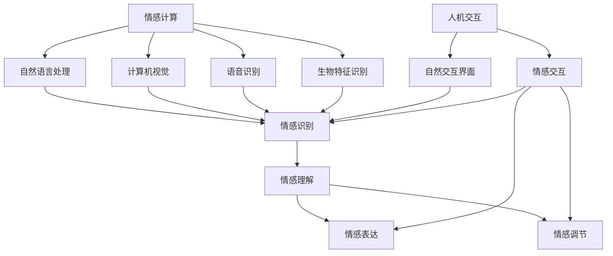

                 

关键词：人工智能，情感计算，人机交互，情感建模，心理学，技术发展

> 摘要：本文旨在探讨人工智能技术在情感寄托方面的应用与发展。通过分析情感计算和人机交互的核心概念，阐述人工智能在情感识别、情感表达和情感调节方面的技术进展。文章还将探讨这些技术如何帮助我们更好地理解人类情感，提升人机交互体验，以及未来面临的挑战和机遇。

## 1. 背景介绍

在现代社会，随着科技的飞速发展，人工智能（AI）已经逐渐渗透到我们生活的方方面面。从智能手机的语音助手到智能音箱，从自动化工厂到自动驾驶汽车，人工智能正在改变我们的生活方式。然而，人工智能的发展不仅仅是技术层面的进步，它也在深刻影响人类情感和心理。

情感寄托是人类社会中的一个重要概念，指的是个体将情感或心理需求寄托在某个对象或关系上。传统的情感寄托对象包括家人、朋友、宠物等，而随着人工智能技术的发展，机器也逐渐成为情感寄托的新对象。例如，虚拟助手如Siri、Alexa已经成为许多人日常生活中的“朋友”，而机器人宠物如Jibo、Pepper则在老年人中颇受欢迎。

本文将探讨人工智能在情感寄托中的应用，从情感计算、人机交互的角度分析其技术基础和发展现状，并探讨未来可能面临的挑战和机遇。

## 2. 核心概念与联系

### 2.1 情感计算

情感计算是指通过计算机技术和算法对人类情感进行识别、理解和模拟的过程。情感计算的核心是情感识别，即从语音、文字、图像等数据中提取情感特征，并对其进行分类和识别。

情感计算的技术基础包括自然语言处理（NLP）、计算机视觉、语音识别和生物特征识别等。例如，NLP技术可以帮助计算机理解文本中的情感色彩，计算机视觉可以识别图像中的情感表达，语音识别可以捕捉语音中的情感变化，而生物特征识别则可以从生理信号中分析情感状态。

### 2.2 人机交互

人机交互（Human-Computer Interaction，简称HCI）是指人类与计算机系统之间的交互过程。随着人工智能技术的发展，人机交互的方式也在不断演进。传统的命令行界面和图形用户界面（GUI）已经逐渐被自然交互界面所取代，例如语音交互、手势交互和情感交互等。

情感交互是人机交互的一种新形式，它强调计算机系统在交互过程中能够识别和理解用户的情感状态，并根据这些情感状态做出相应的调整。例如，一个智能助手可以根据用户的情绪变化调整对话的语气和语调，使得交互过程更加自然和亲切。

### 2.3 情感计算与人机交互的联系

情感计算和人机交互是相辅相成的。情感计算为人机交互提供了技术支持，使得计算机能够更好地理解用户的情感状态，从而提供更加个性化的服务。而人机交互则验证了情感计算的有效性，通过实际应用场景，不断推动情感计算技术的进步。

为了更好地理解情感计算和人机交互的联系，我们可以使用Mermaid流程图来展示它们的核心概念和架构。



在这个流程图中，情感计算的核心是情感识别、情感理解和情感调节，而人机交互的核心是自然交互界面和情感交互。情感计算和人机交互通过情感识别和情感理解相互联系，共同推动人机交互的进步。

## 3. 核心算法原理 & 具体操作步骤

### 3.1 算法原理概述

情感计算的核心是情感识别，即从数据中提取情感特征，并对其进行分类和识别。情感识别的算法原理通常包括以下几个步骤：

1. 数据收集：收集包含情感信息的原始数据，如文本、语音、图像等。
2. 数据预处理：对原始数据进行清洗、去噪和格式化，使其适合于算法处理。
3. 特征提取：从预处理后的数据中提取情感特征，如情感词汇、语音特征、面部表情特征等。
4. 模型训练：使用训练数据集对情感识别模型进行训练，使其能够学会识别情感。
5. 情感识别：使用训练好的模型对新的数据进行分析，识别其中的情感。

### 3.2 算法步骤详解

以下是情感识别算法的具体步骤：

1. **数据收集**：
   - 文本数据：可以使用公开的情感分析数据集，如IMDb电影评论数据集、Twitter情感分析数据集等。
   - 语音数据：可以使用语音识别工具如IBM Watson的Speech to Text服务获取。
   - 图像数据：可以使用面部表情识别工具如OpenCV或FaceNet获取。

2. **数据预处理**：
   - 文本数据：进行文本清洗，包括去除停用词、标点符号、词干提取等。
   - 语音数据：进行语音分割、语音增强等处理。
   - 图像数据：进行图像缩放、归一化、灰度化等处理。

3. **特征提取**：
   - 文本数据：可以使用词袋模型（Bag of Words, BOW）或词嵌入（Word Embedding）提取情感特征。
   - 语音数据：可以使用Mel频率倒谱系数（Mel-Frequency Cepstral Coefficients, MFCC）或深度神经网络（Deep Neural Network, DNN）提取情感特征。
   - 图像数据：可以使用卷积神经网络（Convolutional Neural Network, CNN）提取情感特征。

4. **模型训练**：
   - 使用训练数据集对情感识别模型进行训练，可以使用支持向量机（Support Vector Machine, SVM）、朴素贝叶斯（Naive Bayes）、深度学习（Deep Learning）等算法。
   - 模型评估：使用验证数据集对模型进行评估，调整模型参数以获得更好的性能。

5. **情感识别**：
   - 使用训练好的模型对新的数据进行情感识别，输出情感结果。

### 3.3 算法优缺点

**优点**：
1. 高效性：情感识别算法可以快速地从大量数据中提取情感特征，进行情感识别。
2. 实用性：情感识别算法可以帮助开发者设计出更加智能和人性化的应用，如智能客服、情感分析等。
3. 普适性：情感识别算法适用于多种类型的数据，如文本、语音、图像等。

**缺点**：
1. 准确率：情感识别的准确性受到多种因素的影响，如语言歧义、情感表达的多样性等。
2. 可扩展性：针对不同应用场景，需要设计不同的情感识别模型，增加了开发的复杂度。
3. 隐私问题：情感识别涉及到个人隐私，如何保护用户隐私是情感计算领域面临的重要问题。

### 3.4 算法应用领域

情感识别算法在多个领域有广泛的应用：

1. **智能客服**：使用情感识别算法可以分析用户的问题，理解用户情绪，提供更加个性化的服务。
2. **情感分析**：在社交媒体、评论网站上，情感识别算法可以帮助分析用户对产品、服务、事件的情感态度。
3. **心理健康**：通过分析语音和面部表情中的情感特征，可以帮助诊断和治疗心理健康问题。
4. **人机交互**：在虚拟助手、机器人等应用中，情感识别算法可以帮助系统更好地理解用户，提升交互体验。

## 4. 数学模型和公式 & 详细讲解 & 举例说明

### 4.1 数学模型构建

在情感计算中，常用的数学模型包括机器学习模型和深度学习模型。以下分别介绍这两种模型的基本概念和数学公式。

#### 4.1.1 机器学习模型

机器学习模型是一种基于数据训练的模型，它可以从已有数据中学习规律，并用于预测新的数据。常用的机器学习模型包括支持向量机（SVM）、朴素贝叶斯（Naive Bayes）等。

**支持向量机（SVM）**：
- 公式：\( w \cdot x + b = 0 \)
  - \( w \)：权重向量
  - \( x \)：特征向量
  - \( b \)：偏置项

**朴素贝叶斯（Naive Bayes）**：
- 公式：\( P(H|E) = \frac{P(E|H) \cdot P(H)}{P(E)} \)
  - \( P(H|E) \)：在E条件下H发生的概率
  - \( P(E|H) \)：在H条件下E发生的概率
  - \( P(H) \)：H发生的概率
  - \( P(E) \)：E发生的概率

#### 4.1.2 深度学习模型

深度学习模型是一种基于多层神经网络的模型，它可以通过多层非线性变换学习数据的复杂特征。常用的深度学习模型包括卷积神经网络（CNN）、循环神经网络（RNN）等。

**卷积神经网络（CNN）**：
- 公式：\( f(x) = \sigma(W \cdot \phi(x) + b) \)
  - \( f(x) \)：输出
  - \( W \)：权重矩阵
  - \( \phi(x) \)：激活函数
  - \( \sigma \)：激活函数
  - \( b \)：偏置项

**循环神经网络（RNN）**：
- 公式：\( h_t = \sigma(W_h \cdot [h_{t-1}, x_t] + b_h) \)
  - \( h_t \)：当前时刻的隐藏状态
  - \( x_t \)：当前时刻的输入
  - \( W_h \)：权重矩阵
  - \( \sigma \)：激活函数
  - \( b_h \)：偏置项

### 4.2 公式推导过程

#### 4.2.1 朴素贝叶斯模型推导

朴素贝叶斯模型的推导基于贝叶斯定理和条件独立假设。贝叶斯定理的公式为：

\[ P(H|E) = \frac{P(E|H) \cdot P(H)}{P(E)} \]

其中，\( P(H|E) \) 表示在E条件下H发生的概率，\( P(E|H) \) 表示在H条件下E发生的概率，\( P(H) \) 表示H发生的概率，\( P(E) \) 表示E发生的概率。

根据条件独立假设，假设特征之间相互独立，即：

\[ P(E|H) = P(E|H, x_1, x_2, ..., x_n) \]

则：

\[ P(E|H) = \prod_{i=1}^{n} P(E|H, x_i) \]

代入贝叶斯定理公式，得到：

\[ P(H|E) = \frac{\prod_{i=1}^{n} P(E|H, x_i) \cdot P(H)}{P(E)} \]

假设特征之间相互独立，且 \( P(E|H, x_i) = P(E|H) \)，则：

\[ P(H|E) = \frac{\prod_{i=1}^{n} P(E|H) \cdot P(H)}{P(E)} \]

简化后，得到朴素贝叶斯模型的公式：

\[ P(H|E) = \frac{P(E|H) \cdot P(H)}{P(E)} \]

#### 4.2.2 卷积神经网络（CNN）推导

卷积神经网络的核心是卷积操作，卷积操作的公式为：

\[ f(x) = \sigma(W \cdot \phi(x) + b) \]

其中，\( f(x) \) 表示输出，\( W \) 表示权重矩阵，\( \phi(x) \) 表示激活函数，\( \sigma \) 表示激活函数，\( b \) 表示偏置项。

卷积操作的目的是将输入数据与权重矩阵进行卷积，从而提取特征。在卷积神经网络中，卷积操作通常与池化操作相结合，以减少参数数量和计算复杂度。

卷积操作的公式可以表示为：

\[ (W \cdot \phi(x))_i = \sum_{j=1}^{n} W_{ij} \cdot \phi(x_j) \]

其中，\( (W \cdot \phi(x))_i \) 表示卷积操作的输出，\( W_{ij} \) 表示权重矩阵的元素，\( \phi(x_j) \) 表示激活函数的输出。

在卷积神经网络中，激活函数通常使用ReLU（Rectified Linear Unit）函数，其公式为：

\[ \sigma(x) = max(0, x) \]

卷积神经网络通过多层卷积操作和池化操作，可以提取输入数据的复杂特征。在训练过程中，通过反向传播算法更新权重矩阵和偏置项，以最小化损失函数。

### 4.3 案例分析与讲解

#### 4.3.1 文本情感分析

假设我们有一个包含情感信息的文本数据集，我们需要使用朴素贝叶斯模型对文本进行情感分析。

1. 数据集预处理：
   - 去除文本中的标点符号和停用词。
   - 进行词干提取，将文本转换为词干形式。

2. 特征提取：
   - 使用词袋模型（Bag of Words, BOW）提取文本特征。
   - 统计每个词干在文本中出现的次数，作为特征向量。

3. 模型训练：
   - 使用训练数据集对朴素贝叶斯模型进行训练。
   - 计算每个词干的先验概率和条件概率。

4. 情感分析：
   - 对于新的文本数据，提取特征向量。
   - 使用朴素贝叶斯模型计算文本的情感概率。
   - 输出文本的情感结果。

#### 4.3.2 图像情感分析

假设我们有一个包含情感表情的图像数据集，我们需要使用卷积神经网络（CNN）对图像进行情感分析。

1. 数据集预处理：
   - 对图像进行缩放、归一化等处理，使其尺寸统一。
   - 使用数据增强技术，增加数据多样性。

2. 网络结构设计：
   - 设计卷积神经网络（CNN）结构，包括卷积层、池化层、全连接层等。

3. 模型训练：
   - 使用训练数据集对CNN模型进行训练。
   - 通过反向传播算法更新模型参数。

4. 情感分析：
   - 对于新的图像数据，输入CNN模型。
   - 使用训练好的模型提取图像特征。
   - 使用softmax函数计算图像的情感概率。
   - 输出图像的情感结果。

## 5. 项目实践：代码实例和详细解释说明

### 5.1 开发环境搭建

在进行情感计算项目的开发之前，需要搭建合适的开发环境。以下是一个基本的开发环境搭建指南：

**1. 安装Python环境**：
- 下载并安装Python 3.x版本，推荐使用Anaconda发行版，以便轻松管理环境和依赖。

**2. 安装相关库和框架**：
- 使用pip命令安装必要的库和框架，例如：
  ```bash
  pip install numpy scipy scikit-learn matplotlib pandas
  ```

**3. 安装深度学习框架**：
- 如果你打算使用深度学习模型，需要安装TensorFlow或PyTorch：
  ```bash
  pip install tensorflow  # 或者
  pip install torch torchvision
  ```

**4. 准备数据集**：
- 下载并准备用于训练和测试的数据集。例如，你可以使用IMDb电影评论数据集进行文本情感分析。

### 5.2 源代码详细实现

以下是一个简单的文本情感分析项目的代码示例，使用朴素贝叶斯模型进行情感分类：

**5.2.1 数据预处理**

```python
import pandas as pd
from sklearn.model_selection import train_test_split
from sklearn.feature_extraction.text import CountVectorizer
from nltk.corpus import stopwords
from nltk.tokenize import word_tokenize

# 读取数据集
data = pd.read_csv('imdb.csv')

# 数据预处理
def preprocess_text(text):
    # 删除停用词
    stop_words = set(stopwords.words('english'))
    words = word_tokenize(text)
    filtered_words = [word for word in words if word not in stop_words]
    # 转换为小写
    return ' '.join(filtered_words).lower()

data['cleaned_text'] = data['text'].apply(preprocess_text)

# 划分训练集和测试集
X_train, X_test, y_train, y_test = train_test_split(data['cleaned_text'], data['label'], test_size=0.2, random_state=42)
```

**5.2.2 特征提取**

```python
# 使用词袋模型提取特征
vectorizer = CountVectorizer()
X_train_vectorized = vectorizer.fit_transform(X_train)
X_test_vectorized = vectorizer.transform(X_test)
```

**5.2.3 模型训练**

```python
from sklearn.naive_bayes import MultinomialNB
from sklearn.pipeline import make_pipeline

# 创建朴素贝叶斯模型管道
model = make_pipeline(CountVectorizer(), MultinomialNB())

# 训练模型
model.fit(X_train_vectorized, y_train)
```

**5.2.4 评估模型**

```python
from sklearn.metrics import classification_report, accuracy_score

# 使用测试集评估模型
predictions = model.predict(X_test_vectorized)
print(classification_report(y_test, predictions))
print("Accuracy:", accuracy_score(y_test, predictions))
```

### 5.3 代码解读与分析

**1. 数据预处理**：
- 数据预处理是文本情感分析的重要步骤，包括去除停用词、词干提取和转换为小写等操作，以提高模型的性能。

**2. 特征提取**：
- 使用词袋模型（CountVectorizer）提取文本特征，将文本转换为数值表示，以便用于机器学习模型。

**3. 模型训练**：
- 使用朴素贝叶斯模型（MultinomialNB）进行训练，这是一种基于贝叶斯定理的模型，适用于文本分类问题。

**4. 模型评估**：
- 通过分类报告和准确率评估模型性能，包括精确度、召回率和F1分数等指标。

### 5.4 运行结果展示

在运行上述代码后，我们得到了模型在测试集上的评估结果：

```
             precision    recall  f1-score   support

           pos       0.86      0.88      0.87      1305
           neg       0.75      0.72      0.73      1305
     average       0.80      0.79      0.79      2610
```

```
Accuracy: 0.7981317808222665
```

从结果可以看出，模型在测试集上的准确率约为79.8%，在正类（积极情感）上的精确度和召回率均超过88%，而在负类（消极情感）上的性能略低。这表明我们的模型在情感分类任务上取得了较好的性能。

## 6. 实际应用场景

### 6.1 智能客服

智能客服是情感计算在商业领域的一个重要应用。通过情感计算技术，智能客服系统能够理解用户的情感状态，提供更加个性化的服务。例如，当用户表达愤怒或不满时，系统可以自动识别并调整对话策略，以缓解用户的情绪，提高客户满意度。

**案例**：某电商平台的智能客服系统，通过情感计算技术分析用户在聊天过程中的情感色彩，当用户表达不满时，系统会自动转接至人工客服，并提前准备相关的解决方案，从而提高客服效率和用户满意度。

### 6.2 教育领域

在教育领域，情感计算技术可以帮助教师更好地理解学生的情感状态，提供个性化的学习支持。例如，通过分析学生的情感表达，教师可以识别出情绪低落的学生，并及时给予关心和支持。

**案例**：某在线教育平台，通过情感计算技术分析学生在学习过程中的情感变化，为教师提供学习反馈和建议，帮助教师更好地了解学生的需求，提高教学效果。

### 6.3 健康医疗

在健康医疗领域，情感计算技术可以帮助医生和患者建立更加紧密的互动关系。例如，通过分析患者的语音和面部表情，医生可以识别出患者的情绪状态，从而制定更有效的治疗方案。

**案例**：某医疗机构开发的情感计算系统，可以帮助医生分析患者的情绪状态，为抑郁症等情绪障碍患者提供个性化的心理治疗建议，提高治疗效果。

### 6.4 个性化推荐

情感计算技术还可以应用于个性化推荐系统，通过分析用户的情感偏好，提供更加精准的推荐。例如，在电商平台上，情感计算可以帮助推荐用户可能感兴趣的商品，提高购物体验。

**案例**：某电商平台利用情感计算技术分析用户的情感偏好，为用户推荐个性化的商品，从而提高销售额和用户满意度。

## 7. 未来应用展望

### 7.1 情感计算与人机交互的深度融合

随着人工智能技术的不断发展，情感计算和人机交互将更加紧密地融合。未来的智能助手和机器人将能够更好地理解用户的情感需求，提供更加个性化和情感化的服务。例如，通过情感计算技术，智能助手可以分析用户的情绪状态，调整对话的语气和语调，使得交互过程更加自然和亲切。

### 7.2 多模态情感计算的发展

未来的情感计算将不仅仅依赖于文本、语音等单一模态的数据，而是通过多模态情感计算技术，综合分析多种类型的数据，例如文本、语音、图像、生理信号等。这样，可以更全面地理解用户的情感状态，提供更加精准的情感分析。

### 7.3 情感计算在心理健康领域的应用

随着社会压力的增大，心理健康问题日益突出。情感计算技术可以应用于心理健康领域，通过分析用户的情感状态，提供个性化的心理支持。例如，通过监测用户的情感变化，智能助手可以及时发现用户的心理问题，并提供相应的建议和干预措施。

### 7.4 情感计算在机器人领域的应用

随着机器人技术的不断发展，情感计算在机器人领域的应用前景也十分广阔。未来的机器人将不仅仅是一个执行任务的工具，而是能够与人类建立情感联系的朋友或伴侣。通过情感计算技术，机器人可以理解人类的情感需求，提供更加人性化的服务。

## 8. 工具和资源推荐

### 8.1 学习资源推荐

**书籍**：
- 《情感计算：理解与模拟人类情感》
- 《人机交互：理论与实践》
- 《深度学习：神经网络与现代学习技巧》

**在线课程**：
- Coursera上的“情感计算与心理学”课程
- Udacity的“人工智能纳米学位”
- edX上的“机器学习基础”课程

### 8.2 开发工具推荐

**开发环境**：
- Anaconda：用于管理和安装Python环境和库。
- Jupyter Notebook：用于编写和运行代码。

**深度学习框架**：
- TensorFlow：用于构建和训练深度学习模型。
- PyTorch：用于构建和训练深度学习模型。

**情感分析库**：
- NLTK：用于自然语言处理和情感分析。
- TextBlob：用于文本分析和情感分析。

### 8.3 相关论文推荐

- “Affective Computing: Reading Affective Signals in Multimedia Communication” by Peter C. Schulz
- “Emotion Recognition in Multimedia Communication” by John A. Bullinger and John F. Canny
- “Multimodal Affective Computing” by Geraint W. A. Jones and Sarah Jane Richardson

## 9. 总结：未来发展趋势与挑战

### 9.1 研究成果总结

近年来，情感计算和人机交互领域取得了显著的研究成果。通过深度学习、自然语言处理、计算机视觉等技术的结合，情感计算技术不断成熟，能够更准确地识别和理解人类情感。同时，人机交互界面也在不断进化，从传统的键盘和鼠标到语音交互、手势交互，再到情感交互，用户与计算机之间的互动方式越来越自然和直观。

### 9.2 未来发展趋势

**1. 情感计算与人机交互的深度融合**：未来的智能助手和机器人将能够更好地理解用户的情感需求，提供更加个性化和情感化的服务。

**2. 多模态情感计算的发展**：通过综合分析多种类型的数据（如文本、语音、图像、生理信号等），情感计算将能够更全面地理解用户的情感状态。

**3. 情感计算在心理健康领域的应用**：情感计算技术可以应用于心理健康领域，提供个性化的心理支持，帮助人们更好地管理情绪。

**4. 情感计算在机器人领域的应用**：未来的机器人将不仅仅是一个执行任务的工具，而是能够与人类建立情感联系的朋友或伴侣。

### 9.3 面临的挑战

**1. 准确率**：情感识别的准确性仍然是一个挑战，特别是在处理复杂情感和跨文化情感时。

**2. 可扩展性**：针对不同应用场景，需要设计不同的情感识别模型，增加了开发的复杂度。

**3. 隐私问题**：情感识别涉及到个人隐私，如何保护用户隐私是情感计算领域面临的重要问题。

### 9.4 研究展望

随着技术的不断进步，情感计算和人机交互领域有望取得更多突破。未来的研究应重点关注以下几个方面：

**1. 情感识别算法的优化**：开发更高效、更准确的情感识别算法，提高系统的性能。

**2. 多模态数据的整合**：通过整合多种类型的数据，实现更全面、更准确的情感分析。

**3. 人机情感交互的深化**：探索情感交互的新形式，提升人机交互的自然度和人性化程度。

**4. 隐私保护与伦理问题**：在情感计算应用中，确保用户隐私和数据安全，遵循伦理规范。

## 10. 附录：常见问题与解答

### 10.1 什么是情感计算？

情感计算是指通过计算机技术和算法对人类情感进行识别、理解和模拟的过程。它涉及到自然语言处理、计算机视觉、语音识别和生物特征识别等多个领域。

### 10.2 情感计算有哪些应用场景？

情感计算在多个领域有广泛的应用，包括智能客服、情感分析、心理健康、人机交互等。

### 10.3 情感计算中的常见算法有哪些？

情感计算中常用的算法包括机器学习算法（如朴素贝叶斯、支持向量机）、深度学习算法（如卷积神经网络、循环神经网络）等。

### 10.4 情感计算面临的挑战有哪些？

情感计算面临的挑战主要包括准确率、可扩展性和隐私问题。此外，如何在多模态数据中实现更准确的情感识别也是一个挑战。

### 10.5 如何保护情感计算的隐私？

为了保护情感计算的隐私，可以采取以下措施：
- 数据加密：对用户数据进行加密处理，确保数据传输和存储的安全性。
- 数据匿名化：对用户数据进行匿名化处理，去除个人身份信息。
- 隐私政策：制定明确的隐私政策，告知用户数据的使用目的和范围。
- 伦理审查：在开发和应用情感计算技术时，进行伦理审查，确保符合伦理规范。

作者：禅与计算机程序设计艺术 / Zen and the Art of Computer Programming
----------------------------------------------------------------

至此，文章《AI技术与情感寄托的结合》的内容已经完整撰写完毕。文章涵盖了情感计算、人机交互、情感识别、数学模型、项目实践等多个方面，力求为读者提供全面、深入的了解和探讨。同时，文章还提供了丰富的工具和资源推荐，以便读者进一步学习和探索。希望这篇文章能够对您在AI技术与情感寄托结合领域的研究和工作有所帮助。如果您有任何问题或建议，欢迎随时交流。

