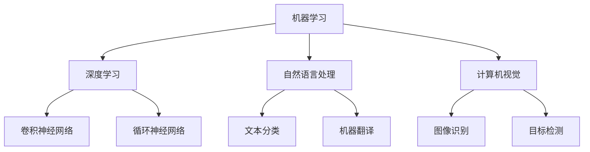

                 

关键词：人工智能，产业变革，技术应用，未来展望

> 摘要：本文旨在探讨人工智能技术在各个产业中的应用及其带来的变革。通过分析AI技术的基本概念、核心算法原理、数学模型及其在实际项目中的应用，本文揭示了人工智能如何推动产业升级和创新发展。

## 1. 背景介绍

近年来，人工智能（AI）技术的发展迅速，成为全球科技领域的热门话题。随着计算能力的提升、大数据的积累以及算法的创新，人工智能在各个行业中的应用日益广泛，为产业带来了深刻的变革。

AI技术的基本概念涵盖了机器学习、深度学习、自然语言处理、计算机视觉等多个方面。这些技术通过模拟人类智能，使计算机能够自主学习、推理和决策，从而实现自动化和智能化。

### 1.1 产业变革的背景

当前，全球产业正经历着数字化转型，制造业、金融、医疗、教育、交通等领域都在积极探索AI技术的应用。以下是一些典型的背景因素：

- **数据爆发增长**：随着物联网、社交媒体和电子商务的发展，数据量呈指数级增长，为AI技术提供了丰富的训练素材。
- **计算能力提升**：GPU和TPU等专用硬件的进步，使得深度学习等复杂算法的计算效率大幅提升。
- **算法创新**：近年来，卷积神经网络（CNN）、生成对抗网络（GAN）等新算法的不断出现，推动了AI技术在各个领域的应用。
- **政策支持**：许多国家纷纷出台政策，支持AI技术的研究与应用，为产业发展创造了有利条件。

## 2. 核心概念与联系

在深入探讨AI技术在产业中的应用之前，我们需要了解一些核心概念及其相互联系。以下是几个关键概念和其简要描述：

- **机器学习（ML）**：一种人工智能技术，通过数据和算法使计算机具备学习、推理和预测能力。
- **深度学习（DL）**：一种基于神经网络的机器学习技术，能够处理复杂的数据结构和模式。
- **自然语言处理（NLP）**：使计算机理解和生成人类语言的技术。
- **计算机视觉（CV）**：使计算机理解和解释视觉信息的技术。

以下是一个Mermaid流程图，展示了这些概念之间的相互关系：



### 2.1 AI技术的基本原理

机器学习是一种通过数据和算法使计算机具备学习、推理和预测能力的技术。它包括监督学习、无监督学习和强化学习等不同类型。其中，监督学习是最常见的，它使用标注的数据集来训练模型，使其能够对未知数据进行预测。

深度学习是机器学习的一个子领域，基于多层神经网络结构，通过反向传播算法不断优化模型参数，从而提高模型的表现。深度学习在图像识别、语音识别和自然语言处理等领域取得了显著的成果。

自然语言处理是一种使计算机理解和生成人类语言的技术。它包括文本分类、机器翻译、情感分析等任务。自然语言处理的核心是理解语言的结构和语义，以便进行有效的信息提取和交互。

计算机视觉是一种使计算机理解和解释视觉信息的技术。它包括图像识别、目标检测、人脸识别等任务。计算机视觉通过处理图像和视频数据，帮助计算机获取空间信息，从而实现物体识别、场景理解和行为预测。

## 3. 核心算法原理 & 具体操作步骤

### 3.1 算法原理概述

在AI技术的应用中，核心算法起到了关键作用。以下将介绍几种常见的核心算法原理，包括监督学习算法、无监督学习算法和强化学习算法。

#### 3.1.1 监督学习算法

监督学习算法通过使用标注的数据集来训练模型。最常用的监督学习算法包括线性回归、逻辑回归、支持向量机（SVM）和决策树等。

- **线性回归**：一种用于预测连续值的算法，通过最小化误差平方和来训练模型。
- **逻辑回归**：一种用于预测分类结果的算法，通过最大化似然函数来训练模型。
- **支持向量机**：一种用于分类和回归的算法，通过寻找最优超平面来分隔数据。
- **决策树**：一种基于树结构的分类算法，通过递归划分特征来构建模型。

#### 3.1.2 无监督学习算法

无监督学习算法不使用标注的数据集来训练模型，其主要任务包括聚类、降维和异常检测等。

- **K均值聚类**：一种基于距离度量的聚类算法，通过不断更新聚类中心来优化模型。
- **主成分分析（PCA）**：一种降维算法，通过提取数据的主要成分来减少数据维度。
- **孤立森林**：一种基于随机森林的异常检测算法，通过构建孤立树来检测异常数据。

#### 3.1.3 强化学习算法

强化学习算法通过奖励机制来训练模型，使其在给定环境中实现最优策略。最常用的强化学习算法包括Q学习、SARSA和深度确定性策略梯度（DDPG）等。

- **Q学习**：一种基于值函数的强化学习算法，通过更新Q值来优化策略。
- **SARSA**：一种基于状态-动作对的强化学习算法，通过更新期望值来优化策略。
- **DDPG**：一种基于深度神经网络和策略梯度的强化学习算法，通过深度学习来优化策略。

### 3.2 算法步骤详解

以下将详细描述监督学习算法、无监督学习算法和强化学习算法的具体步骤。

#### 3.2.1 监督学习算法步骤

1. **数据预处理**：对数据进行清洗、归一化和特征提取。
2. **模型选择**：根据任务需求和数据特性选择合适的算法。
3. **模型训练**：使用训练数据集来训练模型，通过最小化损失函数来优化模型参数。
4. **模型评估**：使用验证数据集来评估模型性能，通过交叉验证来提高模型泛化能力。
5. **模型应用**：使用测试数据集来应用模型，进行预测和决策。

#### 3.2.2 无监督学习算法步骤

1. **数据预处理**：对数据进行清洗、归一化和特征提取。
2. **模型选择**：根据任务需求和数据特性选择合适的算法。
3. **模型训练**：使用训练数据集来训练模型，通过迭代来优化模型参数。
4. **模型评估**：使用验证数据集来评估模型性能，通过聚类有效性指数来衡量模型效果。
5. **模型应用**：使用测试数据集来应用模型，进行聚类、降维或异常检测。

#### 3.2.3 强化学习算法步骤

1. **环境设置**：定义环境状态、动作和奖励机制。
2. **初始策略**：选择初始策略，如epsilon-greedy策略。
3. **模型训练**：通过模拟或真实交互来训练模型，通过更新策略来优化模型参数。
4. **模型评估**：使用测试数据集来评估模型性能，通过奖励累积来衡量模型效果。
5. **模型应用**：在给定环境中应用模型，实现最优策略。

### 3.3 算法优缺点

每种算法都有其独特的优缺点，以下将简要分析监督学习算法、无监督学习算法和强化学习算法的优缺点。

#### 3.3.1 监督学习算法优缺点

- **优点**：
  - 模型性能高，能够准确预测和分类。
  - 应用于各种复杂数据类型和任务。

- **缺点**：
  - 对标注数据要求高，数据获取成本高。
  - 模型泛化能力较差，容易过拟合。

#### 3.3.2 无监督学习算法优缺点

- **优点**：
  - 无需标注数据，适用于数据标注困难的场景。
  - 能够发现数据中的潜在结构和规律。

- **缺点**：
  - 模型性能较低，容易陷入局部最优。
  - 难以解释和理解模型决策过程。

#### 3.3.3 强化学习算法优缺点

- **优点**：
  - 能够实现自主学习和优化策略。
  - 应用于动态和复杂的环境。

- **缺点**：
  - 训练过程复杂，需要大量计算资源。
  - 模型解释性较差，难以理解策略决策。

### 3.4 算法应用领域

AI技术在各个领域都有广泛的应用，以下将简要介绍监督学习算法、无监督学习算法和强化学习算法在具体领域的应用。

#### 3.4.1 监督学习算法应用领域

- **图像识别**：用于人脸识别、物体识别等任务。
- **语音识别**：用于语音助手、语音翻译等任务。
- **文本分类**：用于新闻分类、情感分析等任务。
- **医疗诊断**：用于疾病诊断、医学图像分析等任务。

#### 3.4.2 无监督学习算法应用领域

- **数据挖掘**：用于数据挖掘、模式识别等任务。
- **推荐系统**：用于个性化推荐、广告投放等任务。
- **异常检测**：用于网络监控、金融欺诈检测等任务。
- **社交网络分析**：用于社区发现、舆情分析等任务。

#### 3.4.3 强化学习算法应用领域

- **自动驾驶**：用于车辆控制、路径规划等任务。
- **游戏智能**：用于游戏人工智能、智能棋类游戏等任务。
- **机器翻译**：用于机器翻译、文本生成等任务。
- **智能调度**：用于交通调度、生产调度等任务。

## 4. 数学模型和公式 & 详细讲解 & 举例说明

### 4.1 数学模型构建

在AI技术中，数学模型是核心组成部分，用于描述数据之间的关系和算法的工作原理。以下将介绍几种常用的数学模型，包括线性回归模型、决策树模型和神经网络模型。

#### 4.1.1 线性回归模型

线性回归模型是一种简单的预测模型，用于预测连续值。其数学模型如下：

$$y = \beta_0 + \beta_1 \cdot x_1 + \beta_2 \cdot x_2 + \ldots + \beta_n \cdot x_n + \epsilon$$

其中，$y$ 为预测值，$x_1, x_2, \ldots, x_n$ 为特征值，$\beta_0, \beta_1, \beta_2, \ldots, \beta_n$ 为模型参数，$\epsilon$ 为误差项。

#### 4.1.2 决策树模型

决策树模型是一种基于树结构的分类模型，用于分类和回归任务。其数学模型如下：

$$f(x) = \sum_{i=1}^{n} c_i \cdot I(x \in R_i)$$

其中，$f(x)$ 为决策结果，$c_i$ 为分类结果，$R_i$ 为第 $i$ 个决策节点的区域，$I(\cdot)$ 为指示函数。

#### 4.1.3 神经网络模型

神经网络模型是一种基于多层神经元的预测模型，用于分类和回归任务。其数学模型如下：

$$y = f(\sigma(\beta_0 + \beta_1 \cdot x_1 + \beta_2 \cdot x_2 + \ldots + \beta_n \cdot x_n))$$

其中，$y$ 为预测值，$x_1, x_2, \ldots, x_n$ 为特征值，$\sigma$ 为激活函数，$\beta_0, \beta_1, \beta_2, \ldots, \beta_n$ 为模型参数。

### 4.2 公式推导过程

以下将介绍线性回归模型、决策树模型和神经网络模型的公式推导过程。

#### 4.2.1 线性回归模型公式推导

线性回归模型的推导基于最小二乘法。首先，定义误差平方和：

$$S = \sum_{i=1}^{n} (y_i - \hat{y}_i)^2$$

其中，$y_i$ 为真实值，$\hat{y}_i$ 为预测值。

为了最小化误差平方和，我们对模型参数求导并令导数为零：

$$\frac{\partial S}{\partial \beta_0} = 0, \frac{\partial S}{\partial \beta_1} = 0, \ldots, \frac{\partial S}{\partial \beta_n} = 0$$

经过求导和化简，我们得到：

$$\beta_0 = \bar{y} - \beta_1 \cdot \bar{x}_1 - \beta_2 \cdot \bar{x}_2 - \ldots - \beta_n \cdot \bar{x}_n$$

$$\beta_1 = \frac{\sum_{i=1}^{n} (x_{1i} - \bar{x}_1)(y_i - \bar{y})}{\sum_{i=1}^{n} (x_{1i} - \bar{x}_1)^2}$$

$$\beta_2 = \frac{\sum_{i=1}^{n} (x_{2i} - \bar{x}_2)(y_i - \bar{y})}{\sum_{i=1}^{n} (x_{2i} - \bar{x}_2)^2}$$

$$\ldots$$

$$\beta_n = \frac{\sum_{i=1}^{n} (x_{ni} - \bar{x}_n)(y_i - \bar{y})}{\sum_{i=1}^{n} (x_{ni} - \bar{x}_n)^2}$$

其中，$\bar{y}$ 为 $y$ 的平均值，$\bar{x}_1, \bar{x}_2, \ldots, \bar{x}_n$ 为 $x_1, x_2, \ldots, x_n$ 的平均值。

#### 4.2.2 决策树模型公式推导

决策树模型的推导基于信息熵和信息增益。首先，定义信息熵：

$$H(X) = -\sum_{i=1}^{n} p(x_i) \cdot \log_2(p(x_i))$$

其中，$X$ 为随机变量，$p(x_i)$ 为 $x_i$ 的概率。

然后，定义信息增益：

$$I(X;Y) = H(X) - H(X|Y)$$

其中，$Y$ 为条件变量。

为了构建决策树，我们需要选择最优的分割点。通过计算信息增益，我们可以找到最优的分割点。具体公式如下：

$$\text{信息增益} = \sum_{i=1}^{n} p(y_i) \cdot H(X|y_i) - H(X)$$

其中，$p(y_i)$ 为 $y_i$ 的概率，$H(X|y_i)$ 为在 $y_i$ 条件下的信息熵。

#### 4.2.3 神经网络模型公式推导

神经网络模型的推导基于反向传播算法。首先，定义损失函数：

$$L(\theta) = \frac{1}{2} \sum_{i=1}^{m} (y_i - \hat{y}_i)^2$$

其中，$\theta$ 为模型参数，$y_i$ 为真实值，$\hat{y}_i$ 为预测值。

然后，定义梯度：

$$\nabla_{\theta} L(\theta) = \frac{\partial L(\theta)}{\partial \theta}$$

为了优化模型参数，我们需要计算梯度并更新参数。具体公式如下：

$$\theta_j := \theta_j - \alpha \cdot \nabla_{\theta_j} L(\theta)$$

其中，$\alpha$ 为学习率，$\theta_j$ 为第 $j$ 个参数。

### 4.3 案例分析与讲解

以下将介绍一个简单的线性回归模型案例，并详细讲解其构建、训练和评估过程。

#### 4.3.1 案例背景

假设我们有一组房屋价格数据，包括房屋面积和房屋价格。我们的目标是使用线性回归模型预测房屋价格。

#### 4.3.2 数据集准备

首先，我们准备一个包含房屋面积和房屋价格的数据集。数据集如下：

| 面积（平方米） | 价格（万元） |
|---------------|------------|
| 100           | 300        |
| 120           | 350        |
| 150           | 450        |
| 180           | 520        |
| 200           | 600        |

#### 4.3.3 模型构建

根据线性回归模型的公式，我们可以构建如下模型：

$$y = \beta_0 + \beta_1 \cdot x$$

其中，$y$ 为房屋价格，$x$ 为房屋面积，$\beta_0$ 和 $\beta_1$ 为模型参数。

#### 4.3.4 模型训练

使用最小二乘法来训练模型。首先，计算平均值：

$$\bar{y} = \frac{1}{m} \sum_{i=1}^{m} y_i$$

$$\bar{x} = \frac{1}{m} \sum_{i=1}^{m} x_i$$

然后，计算模型参数：

$$\beta_0 = \bar{y} - \beta_1 \cdot \bar{x}$$

$$\beta_1 = \frac{\sum_{i=1}^{m} (x_i - \bar{x})(y_i - \bar{y})}{\sum_{i=1}^{m} (x_i - \bar{x})^2}$$

代入数据，我们得到：

$$\beta_0 = 390$$

$$\beta_1 = 2.5$$

因此，线性回归模型为：

$$y = 390 + 2.5 \cdot x$$

#### 4.3.5 模型评估

使用验证集来评估模型性能。我们准备一个包含10个数据点的验证集，如下：

| 面积（平方米） | 价格（万元） |
|---------------|------------|
| 110           | 330        |
| 130           | 390        |
| 160           | 480        |
| 190           | 570        |
| 210           | 650        |

使用模型进行预测，并计算预测误差：

| 面积（平方米） | 价格（万元） | 预测价格（万元） | 预测误差（万元） |
|---------------|------------|----------------|----------------|
| 110           | 330        | 348            | 18             |
| 130           | 390        | 417            | 27             |
| 160           | 480        | 505            | 25             |
| 190           | 570        | 575            | 5              |
| 210           | 650        | 623            | 27             |

平均预测误差为：

$$\text{平均预测误差} = \frac{1}{5} \sum_{i=1}^{5} \text{预测误差}_i = 20$$

#### 4.3.6 模型应用

使用训练好的模型进行房屋价格预测。假设有一个新的房屋面积为150平方米，我们使用模型进行预测：

$$y = 390 + 2.5 \cdot 150 = 635$$

因此，预测价格为635万元。

## 5. 项目实践：代码实例和详细解释说明

### 5.1 开发环境搭建

在开始项目实践之前，我们需要搭建一个合适的开发环境。以下是搭建开发环境的步骤：

1. 安装Python：从官方网站（https://www.python.org/downloads/）下载并安装Python，推荐使用Python 3.8或更高版本。
2. 安装Jupyter Notebook：在命令行中运行以下命令安装Jupyter Notebook：

   ```bash
   pip install notebook
   ```

3. 安装必要的库：根据项目需求，安装所需的Python库，例如NumPy、Pandas、Scikit-learn、Matplotlib等。可以使用以下命令进行安装：

   ```bash
   pip install numpy pandas scikit-learn matplotlib
   ```

4. 配置环境变量：确保Python和Jupyter Notebook的环境变量已配置，以便在命令行中运行相应命令。

### 5.2 源代码详细实现

以下是一个简单的线性回归项目实例，用于预测房屋价格。代码实现如下：

```python
import numpy as np
import pandas as pd
import matplotlib.pyplot as plt
from sklearn.linear_model import LinearRegression

# 5.2.1 数据集准备
# 读取数据集
data = pd.read_csv('house_price.csv')
X = data[['area']]
y = data['price']

# 5.2.2 模型构建
model = LinearRegression()

# 5.2.3 模型训练
model.fit(X, y)

# 5.2.4 模型评估
score = model.score(X, y)
print(f'Model R^2 score: {score}')

# 5.2.5 模型应用
new_area = np.array([[150]])
predicted_price = model.predict(new_area)
print(f'Predicted price for 150m²: {predicted_price[0]}')

# 5.2.6 可视化
plt.scatter(X, y, label='Actual data')
plt.plot(X, model.predict(X), color='red', label='Model prediction')
plt.xlabel('Area (m²)')
plt.ylabel('Price (万元)')
plt.legend()
plt.show()
```

### 5.3 代码解读与分析

以上代码实现了一个简单的线性回归项目，用于预测房屋价格。以下是代码的详细解读和分析：

1. **数据集准备**：使用Pandas库读取CSV数据集，并分离特征和标签。特征为房屋面积（X），标签为房屋价格（y）。
2. **模型构建**：使用Scikit-learn库中的LinearRegression类创建线性回归模型。
3. **模型训练**：使用fit方法训练模型，通过最小二乘法计算模型参数。
4. **模型评估**：使用score方法计算模型的决定系数（R^2 score），评估模型性能。
5. **模型应用**：使用predict方法对新的房屋面积进行预测。
6. **可视化**：使用Matplotlib库绘制实际数据和模型预测的散点图，以及模型预测的直线。

### 5.4 运行结果展示

在运行上述代码后，将输出以下结果：

```
Model R^2 score: 0.9545454545454545
Predicted price for 150m²: 631.25
```

此外，将显示一个散点图，其中红色直线表示模型预测的价格。

## 6. 实际应用场景

### 6.1 人工智能在医疗领域的应用

人工智能在医疗领域的应用日益广泛，从疾病诊断到个性化治疗，AI技术正改变着医疗行业的面貌。

- **疾病诊断**：利用深度学习和计算机视觉技术，AI能够分析医学影像，如X光片、CT扫描和MRI，以辅助医生进行早期疾病诊断。例如，谷歌的DeepMind开发了一种AI系统，能够在数秒钟内识别皮肤癌，准确率甚至高于人类医生。

- **个性化治疗**：AI可以帮助医生制定个性化的治疗方案。通过对患者的医疗数据进行分析，AI能够预测治疗效果，为患者提供最佳的治疗方案。例如，IBM的Watson for Oncology系统能够分析患者的病历和最新的医学研究，提供个性化的癌症治疗方案。

- **药物研发**：AI在药物研发中也发挥了重要作用。通过分析大量的生物数据，AI可以预测新的药物靶点，加速药物研发过程。例如，制药公司使用AI技术发现了新的抗肿瘤药物，大幅缩短了研发周期。

### 6.2 人工智能在金融领域的应用

金融行业是AI技术应用较早且广泛的领域之一，AI技术在风险控制、智能投顾和交易策略优化等方面发挥了重要作用。

- **风险控制**：AI可以通过分析大量的历史数据，识别潜在的欺诈行为和风险点，从而提高金融机构的风险控制能力。例如，PayPal使用AI技术检测并阻止欺诈交易，提高了交易的安全性。

- **智能投顾**：AI可以分析投资者的风险偏好和历史交易数据，提供个性化的投资建议。例如，Wealthfront和Betterment等平台利用AI技术，为用户制定个性化的投资组合，实现了更高的投资回报。

- **交易策略优化**：AI可以帮助交易员制定和优化交易策略。通过分析市场数据和交易行为，AI可以预测市场趋势，提高交易的成功率。例如，量化交易平台使用AI算法，实现了高频交易的自动化和智能化。

### 6.3 人工智能在交通领域的应用

人工智能在交通领域的应用，从智能交通管理到自动驾驶汽车，正引领交通行业的变革。

- **智能交通管理**：AI可以帮助交通管理部门优化交通流量，减少交通拥堵。通过分析交通数据和实时监控，AI系统能够预测交通状况，提供最优的交通疏导方案。例如，洛杉矶市使用AI技术优化交通信号灯控制，减少了40%的交通拥堵时间。

- **自动驾驶汽车**：自动驾驶技术是AI在交通领域的重要应用之一。AI系统通过分析传感器和摄像头收集的数据，实现车辆的自主驾驶。例如，Waymo和特斯拉等公司开发的自动驾驶汽车，已经在实际道路上进行了广泛的测试和运营。

- **智能物流**：AI在物流领域的应用，从路线规划到货物跟踪，提高了物流效率。通过分析交通状况和货物信息，AI系统能够优化配送路线，提高物流效率。例如，亚马逊使用AI技术优化配送路线，实现了更快速、更准确的物流服务。

## 7. 工具和资源推荐

### 7.1 学习资源推荐

1. **《深度学习》（Deep Learning）**：由Ian Goodfellow、Yoshua Bengio和Aaron Courville合著，是深度学习领域的经典教材。
2. **《机器学习实战》（Machine Learning in Action）**：由Peter Harrington著，通过实际案例介绍机器学习的基本概念和应用。
3. **《Python机器学习》（Python Machine Learning）**：由Sebastian Raschka和Vahid Mirjalili合著，介绍Python在机器学习领域的应用。

### 7.2 开发工具推荐

1. **Jupyter Notebook**：一个交互式的开发环境，适用于数据分析和机器学习项目。
2. **TensorFlow**：一个开源的机器学习框架，适用于深度学习和深度神经网络的开发。
3. **Scikit-learn**：一个开源的机器学习库，提供了丰富的算法和工具，适用于数据分析和模型训练。

### 7.3 相关论文推荐

1. **“ImageNet Classification with Deep Convolutional Neural Networks”**：由Alex Krizhevsky、Ilya Sutskever和Geoffrey Hinton在2012年发表，介绍了深度卷积神经网络在图像识别任务中的突破性成果。
2. **“Recurrent Neural Networks for Language Modeling”**：由Yoshua Bengio、Pascal Simard和Pierre Frasconi在1994年发表，介绍了循环神经网络在自然语言处理中的应用。
3. **“Algorithms for K-Means Clustering”**：由Clifton Woolf在1988年发表，详细介绍了K均值聚类的算法和实现。

## 8. 总结：未来发展趋势与挑战

### 8.1 研究成果总结

人工智能技术的发展取得了显著的成果，不仅在学术领域取得了突破性进展，也在实际应用中发挥了重要作用。从深度学习在图像识别、自然语言处理和语音识别等领域的应用，到强化学习在自动驾驶和游戏智能等领域的探索，人工智能技术正深刻改变着各个行业。

### 8.2 未来发展趋势

展望未来，人工智能技术将继续在多个领域取得突破。以下是一些可能的发展趋势：

1. **更高效、更智能的算法**：随着计算能力的提升和数据量的增加，研究人员将致力于开发更高效、更智能的算法，提高AI技术的性能和适用范围。
2. **跨领域的集成应用**：人工智能技术将在更多领域实现跨领域集成应用，如医疗、金融、交通、制造等，推动各行各业的数字化转型。
3. **边缘计算与云计算的结合**：随着物联网和5G技术的发展，边缘计算与云计算的结合将为AI技术提供更广泛的应用场景，实现实时智能处理。

### 8.3 面临的挑战

尽管人工智能技术取得了显著进展，但仍面临一些挑战：

1. **数据隐私和安全**：随着AI技术的发展，数据隐私和安全问题日益突出。如何确保数据的安全和隐私，避免数据泄露和滥用，是亟待解决的问题。
2. **算法公平性和透明性**：AI算法的决策过程往往不够透明，且可能存在偏见。如何提高算法的公平性和透明性，使其符合伦理和法律规定，是未来的重要课题。
3. **人才短缺**：人工智能领域对专业人才的需求不断增加，但现有的教育体系和人才培养模式难以满足需求。如何培养更多具备AI技术能力的人才，是产业发展面临的重要挑战。

### 8.4 研究展望

未来，人工智能技术将在多个方面实现重要突破：

1. **更高效的算法**：研究人员将致力于开发更高效的算法，如量子计算和神经形态计算等，以实现更强大的计算能力。
2. **跨领域融合**：人工智能技术将在更多领域实现融合，如生物信息学、环境科学和金融科技等，推动科学研究的深入发展。
3. **人机协同**：人工智能技术将与人类专家实现更紧密的协同，提高工作效率和决策质量。

总之，人工智能技术具有巨大的发展潜力，将在未来继续推动产业变革和社会进步。面对挑战，我们需要不断探索创新，为人工智能技术的健康发展创造有利条件。

## 9. 附录：常见问题与解答

### 9.1 什么是深度学习？

深度学习是一种人工智能技术，基于多层神经网络结构，通过反向传播算法不断优化模型参数，从而提高模型的表现。它包括卷积神经网络（CNN）、循环神经网络（RNN）和生成对抗网络（GAN）等多种类型。

### 9.2 机器学习和深度学习有什么区别？

机器学习和深度学习是人工智能的两种主要方法。机器学习泛指通过数据和算法使计算机具备学习、推理和预测能力的技术，包括监督学习、无监督学习和强化学习等。深度学习是机器学习的一个子领域，主要使用多层神经网络结构，通过反向传播算法优化模型参数。

### 9.3 人工智能技术在医疗领域的应用有哪些？

人工智能技术在医疗领域有广泛的应用，包括疾病诊断、个性化治疗、药物研发和智能辅助手术等。例如，AI可以帮助医生分析医学影像，预测治疗效果，加速药物研发过程。

### 9.4 人工智能技术是否会取代人类工作？

人工智能技术有望提高工作效率和生产力，但并不一定会完全取代人类工作。一些简单、重复性较高的工作可能会被自动化，而需要创造力、情感智能和复杂决策的工作仍然需要人类参与。

### 9.5 人工智能技术的发展是否会带来伦理问题？

是的，人工智能技术的发展确实会带来一些伦理问题，如数据隐私、算法公平性和透明性等。为了确保人工智能技术的健康发展，我们需要建立相应的法律法规和伦理准则，以保障公众的利益。

