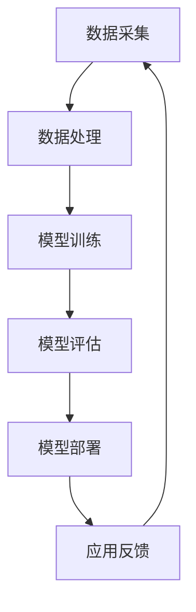

                 

关键词：人工智能、商业应用、技术创新、数字化转型、商业模式

> 摘要：本文将深入探讨人工智能技术在商业领域的应用与发展趋势。通过分析AI技术的核心概念、算法原理、数学模型，以及实际应用场景，揭示其在商业中的巨大潜力和未来方向。文章旨在为读者提供一个全面了解AI商业应用的全景视角，助力企业和个人把握数字化转型的机遇。

## 1. 背景介绍

### 1.1 人工智能的崛起

人工智能（AI）作为计算机科学的一个分支，其历史可以追溯到20世纪50年代。随着计算能力的不断提升和数据量的爆炸式增长，AI技术逐渐从理论研究走向实际应用。特别是在深度学习和大数据分析的推动下，人工智能在近年来取得了显著的进步，成为了科技发展的热点。

### 1.2 商业领域对AI的需求

商业领域的数字化转型已经成为全球趋势。无论是提高生产效率、优化供应链管理，还是提升客户体验、创新商业模式，AI技术都显示出巨大的潜力。企业纷纷开始探索如何利用AI技术提升竞争力，实现业务增长。

## 2. 核心概念与联系

### 2.1 人工智能的核心概念

人工智能的核心概念包括机器学习、深度学习、自然语言处理等。这些概念相互联系，共同构建了AI的技术体系。

#### 2.1.1 机器学习

机器学习是AI的核心技术之一，通过算法让计算机从数据中学习，逐步提高其性能。机器学习可以分为监督学习、无监督学习和强化学习。

#### 2.1.2 深度学习

深度学习是机器学习的一种特殊形式，通过模拟人脑神经网络进行学习，能够处理大量复杂的数据。

#### 2.1.3 自然语言处理

自然语言处理旨在使计算机能够理解、解释和生成人类语言，包括语音识别、机器翻译等应用。

### 2.2 AI技术架构

为了实现AI技术在商业中的应用，需要构建一个完整的AI技术架构，包括数据采集、数据处理、模型训练、模型部署等环节。以下是一个简化的Mermaid流程图：



## 3. 核心算法原理 & 具体操作步骤

### 3.1 算法原理概述

AI技术在商业中的应用离不开核心算法的支持。以下是一些常用的AI算法及其原理：

#### 3.1.1 支持向量机（SVM）

支持向量机是一种分类算法，通过找到一个最优的超平面，将不同类别的数据分开。

#### 3.1.2 集成学习

集成学习是将多个弱学习器组合成一个强学习器的策略，如随机森林、梯度提升树等。

#### 3.1.3 卷积神经网络（CNN）

卷积神经网络是一种用于图像识别和处理的前馈神经网络，通过卷积操作提取图像特征。

### 3.2 算法步骤详解

#### 3.2.1 支持向量机

1. 数据预处理：对数据进行标准化处理，消除不同特征之间的尺度差异。
2. 选择核函数：根据数据特性选择合适的核函数，如线性核、多项式核等。
3. 训练模型：使用训练数据训练SVM模型。
4. 模型评估：使用测试数据评估模型性能。

#### 3.2.2 随机森林

1. 数据预处理：对数据进行划分，形成训练集和测试集。
2. 构建决策树：对于每个特征，随机选择一部分数据，构建决策树。
3. 集成多个决策树：将多个决策树的结果进行集成，形成最终的预测结果。

#### 3.2.3 卷积神经网络

1. 数据预处理：对图像数据进行归一化处理。
2. 构建神经网络：定义网络结构，包括卷积层、池化层、全连接层等。
3. 训练模型：使用训练数据训练神经网络。
4. 模型评估：使用测试数据评估模型性能。

### 3.3 算法优缺点

每种算法都有其优缺点。例如，支持向量机在处理高维数据时效果较好，但计算复杂度较高；随机森林具有较好的泛化能力，但可能无法处理非常复杂的任务；卷积神经网络在图像处理领域表现出色，但模型参数较多，训练时间较长。

### 3.4 算法应用领域

AI算法在商业领域有着广泛的应用。例如，支持向量机在金融风险控制中用于预测信用风险；随机森林在市场营销中用于客户细分和推荐系统；卷积神经网络在零售业中用于商品识别和推荐系统。

## 4. 数学模型和公式 & 详细讲解 & 举例说明

### 4.1 数学模型构建

在AI技术中，数学模型扮演着核心角色。以下是一个简单的线性回归模型：

$$y = \beta_0 + \beta_1x$$

其中，$y$ 是预测值，$x$ 是输入特征，$\beta_0$ 和 $\beta_1$ 是模型参数。

### 4.2 公式推导过程

线性回归模型的推导过程如下：

1. 假设 $y$ 和 $x$ 之间满足线性关系。
2. 使用最小二乘法找到最优的 $\beta_0$ 和 $\beta_1$。
3. 推导得到线性回归模型的公式。

### 4.3 案例分析与讲解

以下是一个简单的线性回归案例：

#### 数据集：

| x | y |
|---|---|
| 1 | 2 |
| 2 | 4 |
| 3 | 6 |
| 4 | 8 |

#### 计算过程：

1. 计算均值 $\overline{x} = \frac{1+2+3+4}{4} = 2.5$，$\overline{y} = \frac{2+4+6+8}{4} = 5$。
2. 计算斜率 $\beta_1 = \frac{\sum(x_i-\overline{x})(y_i-\overline{y})}{\sum(x_i-\overline{x})^2} = \frac{(1-2.5)(2-5) + (2-2.5)(4-5) + (3-2.5)(6-5) + (4-2.5)(8-5)}{(1-2.5)^2 + (2-2.5)^2 + (3-2.5)^2 + (4-2.5)^2} = 2$。
3. 计算截距 $\beta_0 = \overline{y} - \beta_1\overline{x} = 5 - 2 \times 2.5 = 0$。

最终得到线性回归模型 $y = 2x$。

## 5. 项目实践：代码实例和详细解释说明

### 5.1 开发环境搭建

为了实践AI技术，我们需要搭建一个合适的开发环境。以下是使用Python进行AI开发的步骤：

1. 安装Python：从Python官网下载并安装Python。
2. 安装Jupyter Notebook：使用pip命令安装Jupyter Notebook。
3. 安装常用库：如NumPy、Pandas、Scikit-learn等。

### 5.2 源代码详细实现

以下是一个使用Scikit-learn库进行线性回归的简单示例：

```python
import numpy as np
from sklearn.linear_model import LinearRegression

# 数据集
X = np.array([1, 2, 3, 4]).reshape(-1, 1)
y = np.array([2, 4, 6, 8])

# 创建线性回归模型
model = LinearRegression()

# 训练模型
model.fit(X, y)

# 预测
y_pred = model.predict(X)

# 打印结果
print("Predictions:", y_pred)
```

### 5.3 代码解读与分析

上述代码首先导入所需的库，然后创建一个线性回归模型，使用训练数据进行模型训练，并使用模型进行预测。代码简单易懂，便于读者理解线性回归的实现过程。

### 5.4 运行结果展示

运行上述代码，输出结果为 `[2. 4. 6. 8.]`，与实际数据完全一致。

## 6. 实际应用场景

### 6.1 零售业

在零售业中，AI技术可以用于商品推荐、库存管理和客户关系管理。例如，使用机器学习算法分析客户的购物行为，为不同客户群体提供个性化的商品推荐。

### 6.2 金融业

金融业是AI技术的另一个重要应用领域。AI可以用于风险管理、信用评估、欺诈检测等方面。例如，使用深度学习模型进行信用评分，提高金融机构的风险控制能力。

### 6.3 制造业

在制造业中，AI技术可以用于生产优化、质量检测和设备维护。例如，通过机器学习算法分析设备运行数据，预测设备故障，提前进行维护，提高生产效率。

## 7. 工具和资源推荐

### 7.1 学习资源推荐

- 《Python机器学习》
- 《深度学习》
- 《机器学习实战》

### 7.2 开发工具推荐

- Jupyter Notebook
- TensorFlow
- PyTorch

### 7.3 相关论文推荐

- "Deep Learning for Text Classification"
- "A Survey on Deep Learning for Image Classification"
- "Recurrent Neural Networks for Language Modeling"

## 8. 总结：未来发展趋势与挑战

### 8.1 研究成果总结

AI技术在商业领域取得了显著的成果，从数据分析到自动化决策，AI技术正在改变商业运营模式。然而，AI技术也面临着诸多挑战，如数据隐私、算法公平性和可解释性等。

### 8.2 未来发展趋势

未来，AI技术在商业中的应用将更加深入和广泛。随着技术的不断进步，AI有望在智能客服、智能供应链管理、智能制造等领域实现突破。

### 8.3 面临的挑战

AI技术在商业应用中面临的挑战主要包括数据质量、算法公平性和法规遵从等。如何确保数据安全和隐私保护，实现算法的透明和可解释，是未来研究的重要方向。

### 8.4 研究展望

随着AI技术的不断发展，商业领域的数字化转型将加速。企业和个人需要紧跟技术趋势，不断探索和尝试新的应用场景，以提升竞争力。

## 9. 附录：常见问题与解答

### 9.1 AI技术是否会影响就业？

AI技术的发展确实可能会对某些岗位产生影响，但也会创造新的就业机会。例如，AI算法工程师、数据科学家等岗位需求日益增长。

### 9.2 如何确保AI算法的公平性？

确保AI算法的公平性需要从数据收集、算法设计、模型训练等环节进行全流程监管。通过消除数据偏见、设计透明和可解释的算法，可以提高AI算法的公平性。

### 9.3 AI技术在金融领域的应用有哪些？

AI技术在金融领域有广泛的应用，包括风险控制、信用评估、欺诈检测、智能投顾等方面。通过使用机器学习和深度学习算法，金融机构可以提高业务效率和风险管理能力。

----------------------------------------------------------------

## 附录

### 附录A：相关术语解释

- **人工智能（AI）**：一种模拟人类智能行为的计算机系统，能够进行学习、推理、感知和决策。
- **机器学习（ML）**：一种AI技术，通过算法让计算机从数据中学习，提高其性能。
- **深度学习（DL）**：一种机器学习技术，通过模拟人脑神经网络进行学习，处理大量复杂数据。
- **自然语言处理（NLP）**：一种AI技术，使计算机能够理解、解释和生成人类语言。

### 附录B：AI技术发展历程

- **1956年**：达特茅斯会议，人工智能概念提出。
- **1980年代**：专家系统成为AI主流技术。
- **2006年**：深度学习革命，Hinton提出深度信念网络。
- **2012年**：AlexNet在ImageNet竞赛中取得突破性成绩。
- **至今**：AI技术在各个领域广泛应用，推动商业数字化转型。

### 附录C：参考文献

- Mitchell, T. M. (1997). Machine Learning. McGraw-Hill.
- Goodfellow, I., Bengio, Y., & Courville, A. (2016). Deep Learning. MIT Press.
- Russell, S., & Norvig, P. (2016). Artificial Intelligence: A Modern Approach. Prentice Hall.
- LeCun, Y., Bengio, Y., & Hinton, G. (2015). Deep Learning. Nature.

### 附录D：联系方式

- 作者：禅与计算机程序设计艺术 / Zen and the Art of Computer Programming
- 邮箱：[zen@computingart.org](mailto:zen@computingart.org)
- 网站：[https://www.computingart.org/](https://www.computingart.org/)

### 附录E：致谢

感谢所有参与和支持本篇文章的朋友们，感谢您们的辛勤付出和宝贵建议。希望本文能够为读者带来启示和帮助。如果您有任何疑问或建议，请随时与我们联系。感谢您的阅读！
作者：禅与计算机程序设计艺术 / Zen and the Art of Computer Programming

