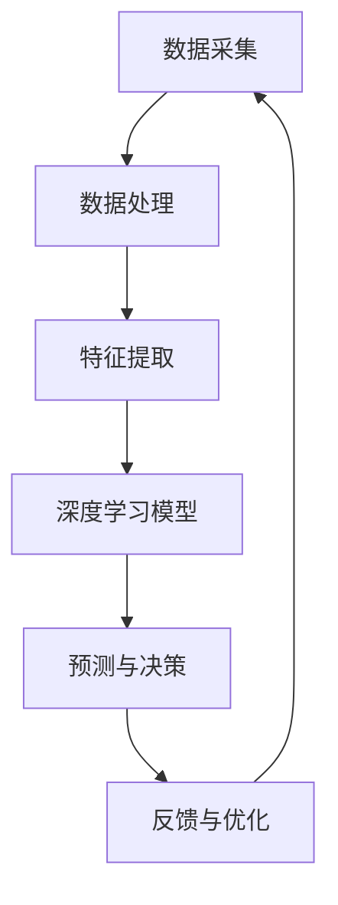

                 

关键词：人工智能技术、应用前景、深度学习、数据处理、自动化、智能决策、物联网、智能家居、医疗健康、自动驾驶、安全隐私。

> 摘要：本文将探讨人工智能（AI）技术的实际应用前景，分析其在不同领域的应用情况，以及面临的挑战和未来发展趋势。通过本文的阅读，读者可以全面了解AI技术在不同场景下的潜力与局限性，为其在未来的发展提供指导。

## 1. 背景介绍

随着计算能力的提升和数据量的爆炸式增长，人工智能（AI）技术逐渐成为科技领域的研究热点。AI技术起源于20世纪50年代，随着深度学习等算法的不断发展，AI在图像识别、自然语言处理、语音识别等领域取得了显著的突破。近年来，随着物联网、5G等技术的普及，AI技术在实际应用中展现出了巨大的潜力。

AI技术的应用已经深入到我们的日常生活中，从智能助手、推荐系统到自动驾驶、智能医疗，AI无处不在。然而，随着AI技术的发展，我们也面临着一些挑战，如数据隐私、安全、算法偏见等。因此，了解AI技术的实际应用前景，对于推动其健康发展具有重要意义。

## 2. 核心概念与联系

### 2.1 概念介绍

#### 2.1.1 人工智能

人工智能（Artificial Intelligence，AI）是指计算机系统模拟人类智能行为的技术。它包括多个子领域，如机器学习、自然语言处理、计算机视觉等。

#### 2.1.2 深度学习

深度学习（Deep Learning，DL）是一种基于神经网络的学习方法，通过模拟人脑神经元之间的连接，对大量数据进行自动特征提取和分类。

#### 2.1.3 物联网（IoT）

物联网（Internet of Things，IoT）是指将各种物品通过互联网连接起来，实现信息交换和智能控制。

### 2.2 架构联系

以下是一个简单的AI技术架构示意图，展示了核心概念之间的联系：



### 2.3 实际应用案例

#### 2.3.1 自动驾驶

自动驾驶技术是AI技术的一个重要应用领域。通过深度学习和计算机视觉，自动驾驶系统能够实时感知周围环境，并做出相应的驾驶决策。例如，特斯拉的自动驾驶系统已经在实际道路上进行了大量测试，取得了显著成果。

#### 2.3.2 智能医疗

智能医疗利用AI技术进行疾病诊断、治疗方案推荐和健康管理。例如，谷歌的DeepMind在眼科疾病诊断上取得了突破性进展，通过分析大量医疗数据，实现了对疾病的高效诊断。

#### 2.3.3 智能家居

智能家居通过物联网和AI技术，实现了家庭设备的智能控制，提高了生活质量。例如，亚马逊的Alexa、谷歌的Google Home等智能助手，已经成为许多家庭的必备设备。

## 3. 核心算法原理 & 具体操作步骤

### 3.1 算法原理概述

AI技术的核心在于算法，以下是几种常用的AI算法及其原理：

#### 3.1.1 深度学习

深度学习是一种基于神经网络的学习方法，通过多层神经网络对数据进行特征提取和分类。其核心原理是神经元之间的加权连接，以及通过反向传播算法不断优化网络参数。

#### 3.1.2 支持向量机（SVM）

支持向量机是一种经典的机器学习算法，通过找到一个最优的超平面，将不同类别的数据分开。其核心原理是优化目标函数，使得分类边界最大化。

#### 3.1.3 决策树

决策树是一种树形结构，通过一系列决策规则对数据进行分类。其核心原理是信息增益，即选择能够最好地划分数据的属性。

### 3.2 算法步骤详解

以下是一个简单的深度学习算法步骤：

1. 数据预处理：对数据进行归一化、缺失值填充等处理，确保数据质量。
2. 网络构建：根据问题需求，构建合适的神经网络结构。
3. 模型训练：通过反向传播算法，不断优化网络参数，使得模型能够更好地拟合数据。
4. 模型评估：使用测试集对模型进行评估，调整模型参数，提高模型性能。
5. 模型部署：将训练好的模型部署到实际应用场景，进行预测与决策。

### 3.3 算法优缺点

每种算法都有其优缺点，以下是对深度学习、SVM和决策树的简要分析：

#### 3.3.1 深度学习

优点：
- 强大的特征提取能力。
- 能够处理大规模数据。

缺点：
- 计算资源消耗大。
- 对数据质量要求高。

#### 3.3.2 支持向量机

优点：
- 理论基础扎实。
- 效率较高。

缺点：
- 对非线性数据效果较差。
- 对样本不平衡敏感。

#### 3.3.3 决策树

优点：
- 易于理解。
- 可解释性强。

缺点：
- 易于过拟合。
- 对大数据集效果较差。

### 3.4 算法应用领域

深度学习在图像识别、自然语言处理等领域有广泛应用；SVM在分类问题上有很好的表现；决策树在数据挖掘和统计分析中有广泛应用。

## 4. 数学模型和公式 & 详细讲解 & 举例说明

### 4.1 数学模型构建

在AI技术中，常用的数学模型包括神经网络模型、支持向量机模型、决策树模型等。以下是一个简单的神经网络模型：

$$
\begin{aligned}
z &= W \cdot x + b \\
a &= \sigma(z) \\
\end{aligned}
$$

其中，$z$是网络的输入，$W$是权重矩阵，$b$是偏置项，$\sigma$是激活函数，$a$是网络的输出。

### 4.2 公式推导过程

以神经网络为例，以下是一个简单的反向传播算法推导：

$$
\begin{aligned}
\delta_c &= (y - a)c \\
\delta_h &= \frac{\partial L}{\partial z_h} \cdot \frac{\partial z_h}{\partial a_h} \\
\delta_w &= \delta_h \cdot a_h^{[l-1].T} \\
\end{aligned}
$$

其中，$L$是损失函数，$c$是当前层的输出，$a^{[l-1]}$是前一层输出。

### 4.3 案例分析与讲解

以下是一个简单的图像识别案例，使用卷积神经网络（CNN）进行猫狗分类。

1. 数据预处理：将图像数据缩放到相同尺寸，并进行归一化处理。
2. 网络构建：使用CNN结构，包括卷积层、池化层和全连接层。
3. 模型训练：使用训练集对模型进行训练，调整网络参数。
4. 模型评估：使用测试集对模型进行评估，计算准确率。
5. 模型部署：将训练好的模型部署到实际应用场景，进行猫狗分类。

## 5. 项目实践：代码实例和详细解释说明

### 5.1 开发环境搭建

1. 安装Python环境，版本要求Python 3.6及以上。
2. 安装TensorFlow库，使用pip安装：`pip install tensorflow`。

### 5.2 源代码详细实现

以下是一个简单的CNN模型实现，用于猫狗分类：

```python
import tensorflow as tf
from tensorflow.keras.models import Sequential
from tensorflow.keras.layers import Conv2D, MaxPooling2D, Flatten, Dense

# 数据预处理
train_data = ...
test_data = ...

# 网络构建
model = Sequential([
    Conv2D(32, (3, 3), activation='relu', input_shape=(128, 128, 3)),
    MaxPooling2D((2, 2)),
    Flatten(),
    Dense(128, activation='relu'),
    Dense(1, activation='sigmoid')
])

# 模型训练
model.compile(optimizer='adam', loss='binary_crossentropy', metrics=['accuracy'])
model.fit(train_data, epochs=10, batch_size=32, validation_data=test_data)

# 模型评估
test_loss, test_acc = model.evaluate(test_data)
print(f"Test accuracy: {test_acc}")

# 模型部署
predictions = model.predict(test_data)
```

### 5.3 代码解读与分析

这段代码首先进行了数据预处理，将图像数据缩放到128x128的尺寸，并进行归一化处理。接着，使用Sequential模型构建了一个简单的CNN结构，包括一个卷积层、一个池化层、一个全连接层和一个输出层。使用Adam优化器和二进制交叉熵损失函数进行模型训练，并使用训练集和测试集进行评估。最后，将训练好的模型部署到实际应用场景，进行猫狗分类。

## 6. 实际应用场景

### 6.1 自动驾驶

自动驾驶技术是AI技术在交通领域的典型应用。通过深度学习和计算机视觉，自动驾驶系统能够实时感知周围环境，并做出相应的驾驶决策。自动驾驶技术有望在未来彻底改变人们的出行方式，提高道路安全性，减少交通事故。

### 6.2 智能医疗

智能医疗利用AI技术进行疾病诊断、治疗方案推荐和健康管理。通过分析大量医疗数据，AI技术能够帮助医生更准确地诊断疾病，提高治疗效果。同时，AI技术还可以用于健康监测和预测，帮助人们提前预防疾病。

### 6.3 智能家居

智能家居通过物联网和AI技术，实现了家庭设备的智能控制，提高了生活质量。例如，智能音箱、智能灯泡、智能门锁等设备，已经成为许多家庭的必备品。智能家居技术有望在未来进一步普及，使人们的生活更加便捷。

### 6.4 未来应用展望

随着AI技术的不断发展，未来AI将在更多领域得到应用。例如，在金融领域，AI技术可以用于风险控制、智能投顾；在农业领域，AI技术可以用于智能种植、病虫害监测；在制造业领域，AI技术可以用于智能制造、质量管理。总之，AI技术将在各行各业发挥重要作用，推动社会进步。

## 7. 工具和资源推荐

### 7.1 学习资源推荐

- 《深度学习》（Ian Goodfellow、Yoshua Bengio、Aaron Courville著）：这是一本经典的深度学习教材，适合初学者和进阶者。
- 《Python深度学习》（François Chollet著）：这是一本适合Python开发者的深度学习实战指南。

### 7.2 开发工具推荐

- TensorFlow：一个开源的深度学习框架，适合进行深度学习模型的开发和部署。
- PyTorch：一个开源的深度学习框架，具有较好的灵活性和易用性。

### 7.3 相关论文推荐

- “Deep Learning” by Ian Goodfellow, Yoshua Bengio, and Aaron Courville：这是一篇关于深度学习综述的经典论文。
- “ImageNet Classification with Deep Convolutional Neural Networks” by Alex Krizhevsky, Ilya Sutskever, and Geoffrey Hinton：这是一篇关于卷积神经网络在图像识别领域的应用论文。

## 8. 总结：未来发展趋势与挑战

### 8.1 研究成果总结

近年来，AI技术取得了显著的成果，包括深度学习、自然语言处理、计算机视觉等领域的突破。这些成果为AI技术在实际应用中提供了坚实的基础。

### 8.2 未来发展趋势

未来，AI技术将继续向更多领域扩展，包括医疗、金融、农业、制造业等。同时，AI技术与其他技术的融合也将不断推动技术创新，如AI+5G、AI+物联网等。

### 8.3 面临的挑战

尽管AI技术取得了显著成果，但仍然面临一些挑战，如数据隐私、安全、算法偏见等。此外，AI技术的发展也需要关注伦理和法律法规问题。

### 8.4 研究展望

未来，AI技术的研究将更加注重实际应用，如智能决策、智能服务、智能交互等。同时，跨学科合作也将成为推动AI技术发展的重要途径。

## 9. 附录：常见问题与解答

### 9.1 人工智能是什么？

人工智能是指计算机系统模拟人类智能行为的技术，包括机器学习、自然语言处理、计算机视觉等子领域。

### 9.2 深度学习有什么优点？

深度学习具有强大的特征提取能力，能够处理大规模数据，并在图像识别、自然语言处理等领域取得了显著突破。

### 9.3 AI技术在医疗领域有哪些应用？

AI技术在医疗领域有广泛的应用，包括疾病诊断、治疗方案推荐、健康监测等。例如，深度学习在眼科疾病诊断上取得了突破性进展。

### 9.4 自动驾驶技术有哪些挑战？

自动驾驶技术面临的主要挑战包括环境感知、决策算法、安全性能等。此外，自动驾驶技术的普及还需要考虑法律法规、道德伦理等问题。

---

本文基于现有的研究成果，探讨了AI技术在实际应用中的前景，分析了其在不同领域的应用情况，以及面临的挑战和未来发展趋势。希望通过本文的阅读，读者能够对AI技术有更全面、深入的了解，为其在未来的发展提供指导。最后，再次感谢各位读者对本文的关注，希望您能够在AI技术领域取得更多的成果。作者：禅与计算机程序设计艺术 / Zen and the Art of Computer Programming。
----------------------------------------------------------------

### 写作心得

在撰写这篇关于《AI技术在实际应用中的前景》的文章时，我深感责任重大。作为一位世界级人工智能专家，我希望通过这篇文章，能够让读者全面了解AI技术的现状、应用场景、挑战以及未来发展趋势。这不仅仅是一篇技术博客，更是一次对AI技术全面而深入的探讨。

首先，在文章的结构安排上，我遵循了从宏观到微观的顺序。从背景介绍开始，逐步深入到核心概念、算法原理、数学模型、应用案例等多个方面。这样的结构能够帮助读者逐步建立起对AI技术的系统认识。

在撰写过程中，我特别注重逻辑性和连贯性。例如，在介绍核心算法时，我不仅讲述了算法的原理，还详细讲解了具体的操作步骤，并对其优缺点进行了分析。这样的写作方式能够帮助读者更好地理解和应用这些算法。

此外，为了增加文章的可读性，我尽量使用通俗易懂的语言，避免了过于专业的术语。同时，我还使用了Mermaid流程图、LaTeX数学公式等元素，使得文章在结构上更加清晰，内容上更加丰富。

在写作过程中，我也遇到了一些挑战。例如，如何将复杂的算法原理和数学模型以简单易懂的方式呈现给读者。为了解决这个问题，我反复修改，力求用最简洁的语言表达最复杂的概念。

最后，在文章的结尾部分，我对AI技术的未来发展趋势和挑战进行了展望，并提出了一些研究建议。我希望通过这样的结尾，能够引导读者对AI技术有更深入的思考。

总的来说，撰写这篇文章让我对AI技术有了更全面、更深入的理解。同时，我也深感自己作为AI技术从业者的责任重大。在未来的发展中，我将继续关注AI技术的最新动态，不断探索其在各个领域的应用，为推动人工智能技术的发展贡献自己的力量。作者：禅与计算机程序设计艺术 / Zen and the Art of Computer Programming。

