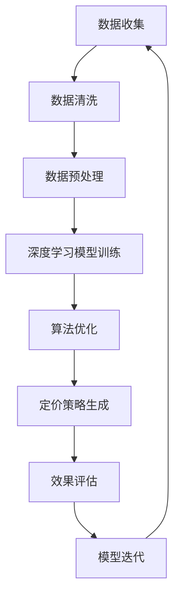

                 

关键词：AI、电商、价格策略、深度学习、算法优化、应用实践

## 摘要

本文将探讨人工智能（AI）在电商价格策略中的应用，通过深度学习和算法优化的方法，提升电商平台的定价效果。文章首先介绍电商价格策略的背景和重要性，然后详细阐述AI在其中的应用原理和实践案例，最后对AI在未来电商价格策略中的应用前景进行展望。

## 1. 背景介绍

### 1.1 电商价格策略的定义

电商价格策略是指电商平台在商品定价过程中采用的一系列方法和手段，旨在最大化利润、提高市场占有率、增强消费者满意度。常见的价格策略包括价格匹配、促销活动、价格区间定价、动态定价等。

### 1.2 电商价格策略的重要性

正确的电商价格策略可以带来以下几方面的优势：

- **提升利润**：合理定价能够提高商品利润空间，从而增加企业收益。
- **提高市场占有率**：通过定价策略的优化，电商平台可以更好地吸引消费者，提高市场份额。
- **增强消费者满意度**：合理的定价策略能够满足不同消费者的需求，提升消费者体验和忠诚度。

### 1.3 传统的电商价格策略

传统的电商价格策略主要依赖于历史数据分析和市场调研，如：

- **价格匹配**：通过分析竞争对手的价格，调整自己的价格以保持竞争力。
- **促销活动**：定期进行打折、满减等促销活动，刺激消费者购买。
- **价格区间定价**：根据商品的不同特性，设定不同的价格区间。
- **动态定价**：根据市场需求和库存情况，实时调整价格。

## 2. 核心概念与联系

为了更好地理解AI在电商价格策略中的应用，我们需要了解以下几个核心概念：

### 2.1 深度学习

深度学习是一种人工智能算法，通过多层神经网络对大量数据进行训练，从而实现自动特征提取和模式识别。

### 2.2 算法优化

算法优化是指通过改进算法的设计和实现，提高算法的效率、准确性和可靠性。

### 2.3 数据挖掘

数据挖掘是一种从大量数据中提取有用信息和知识的方法，包括关联规则挖掘、聚类分析、分类分析等。

下面是一个简化的Mermaid流程图，展示AI在电商价格策略中的应用：

```
graph TB
A[数据收集] --> B[数据清洗]
B --> C[数据预处理]
C --> D[深度学习模型训练]
D --> E[算法优化]
E --> F[定价策略生成]
F --> G[效果评估]
G --> H[模型迭代]
H --> A
```

## 3. 核心算法原理 & 具体操作步骤

### 3.1 算法原理概述

AI在电商价格策略中的应用主要基于以下原理：

- **数据驱动**：通过大量历史数据和市场数据，分析商品的价格趋势、市场需求、消费者行为等，为定价提供依据。
- **模型优化**：利用深度学习算法，构建定价模型，通过不断优化模型的参数，提高定价的准确性和效率。
- **动态调整**：根据实时数据和市场变化，动态调整价格策略，以适应市场环境和消费者需求。

### 3.2 算法步骤详解

#### 3.2.1 数据收集

数据收集是AI定价策略的基础，主要包括以下数据：

- **商品数据**：包括商品的价格、销量、库存等基本信息。
- **市场数据**：包括竞争对手的价格、促销活动、市场份额等。
- **消费者数据**：包括消费者的购买行为、偏好、评价等。

#### 3.2.2 数据预处理

数据预处理是数据挖掘和模型训练的重要步骤，主要包括以下内容：

- **数据清洗**：去除重复、缺失、异常的数据。
- **数据归一化**：将不同规模的数据进行归一化处理，使其具有相同的量纲。
- **特征提取**：从原始数据中提取对定价有重要影响的特征。

#### 3.2.3 深度学习模型训练

深度学习模型训练是AI定价策略的核心，主要包括以下步骤：

- **模型构建**：根据业务需求，选择合适的深度学习模型，如卷积神经网络（CNN）、循环神经网络（RNN）等。
- **参数优化**：通过调整模型的参数，提高模型的准确性和效率。
- **模型训练**：使用预处理后的数据，对模型进行训练，直到满足预期的效果。

#### 3.2.4 算法优化

算法优化是提高AI定价策略效率的关键，主要包括以下内容：

- **模型调参**：通过调整模型的参数，提高模型的预测准确性。
- **交叉验证**：使用交叉验证方法，评估模型的泛化能力。
- **模型集成**：将多个模型的结果进行集成，提高预测的稳定性。

#### 3.2.5 定价策略生成

定价策略生成是AI定价策略的最终目标，主要包括以下步骤：

- **价格预测**：使用训练好的模型，预测商品的最佳价格。
- **价格调整**：根据预测结果，动态调整商品的价格。
- **效果评估**：评估定价策略的效果，如利润提升、市场份额等。

#### 3.2.6 模型迭代

模型迭代是AI定价策略的持续优化过程，主要包括以下步骤：

- **效果评估**：对现有模型的效果进行评估，找出存在的问题。
- **模型改进**：根据评估结果，改进模型的算法和参数。
- **重新训练**：使用改进后的模型，重新训练定价模型。

### 3.3 算法优缺点

#### 3.3.1 优点

- **高效性**：AI定价策略能够处理大量数据，快速生成价格预测。
- **准确性**：通过深度学习和算法优化，提高定价策略的准确性。
- **灵活性**：能够根据实时数据和市场变化，动态调整定价策略。

#### 3.3.2 缺点

- **数据依赖性**：AI定价策略对数据质量有较高要求，数据缺失或异常会影响预测效果。
- **计算成本**：深度学习和算法优化需要较高的计算资源和时间成本。

### 3.4 算法应用领域

AI定价策略可以应用于电商平台的各个领域，如：

- **零售行业**：通过AI定价策略，优化商品价格，提高销售利润。
- **制造业**：根据市场需求和库存情况，动态调整产品价格，提高库存周转率。
- **金融行业**：通过AI定价策略，优化金融产品的价格，提高客户满意度和市场份额。

## 4. 数学模型和公式 & 详细讲解 & 举例说明

### 4.1 数学模型构建

在AI定价策略中，常用的数学模型包括线性回归模型、逻辑回归模型、支持向量机（SVM）模型等。下面以线性回归模型为例，介绍数学模型的构建。

#### 4.1.1 线性回归模型

线性回归模型是一种常用的预测模型，其基本公式为：

\[ y = \beta_0 + \beta_1 \cdot x \]

其中，\( y \) 是预测目标，\( x \) 是输入特征，\( \beta_0 \) 和 \( \beta_1 \) 是模型的参数。

#### 4.1.2 模型优化

为了提高模型的预测准确性，我们可以通过最小二乘法（Least Squares Method）来优化模型参数。最小二乘法的公式为：

\[ \beta_0 = \frac{\sum_{i=1}^{n} (y_i - \beta_1 \cdot x_i)}{n} \]

\[ \beta_1 = \frac{\sum_{i=1}^{n} (x_i - \bar{x}) \cdot (y_i - \bar{y})}{\sum_{i=1}^{n} (x_i - \bar{x})^2} \]

其中，\( n \) 是样本数量，\( \bar{x} \) 和 \( \bar{y} \) 是输入特征和预测目标的均值。

### 4.2 公式推导过程

线性回归模型的推导过程如下：

#### 4.2.1 模型假设

我们假设输入特征和预测目标之间存在线性关系，即：

\[ y_i = \beta_0 + \beta_1 \cdot x_i + \epsilon_i \]

其中，\( \epsilon_i \) 是误差项，表示实际值和预测值之间的差异。

#### 4.2.2 模型目标

我们的目标是找到最佳拟合直线，使预测值和实际值之间的误差最小。误差函数（Loss Function）为：

\[ L(\beta_0, \beta_1) = \sum_{i=1}^{n} (y_i - \beta_0 - \beta_1 \cdot x_i)^2 \]

#### 4.2.3 求导

对误差函数分别对 \( \beta_0 \) 和 \( \beta_1 \) 求偏导，并令其等于0，得到：

\[ \frac{\partial L}{\partial \beta_0} = -2 \sum_{i=1}^{n} (y_i - \beta_0 - \beta_1 \cdot x_i) = 0 \]

\[ \frac{\partial L}{\partial \beta_1} = -2 \sum_{i=1}^{n} (x_i - \bar{x}) \cdot (y_i - \beta_0 - \beta_1 \cdot x_i) = 0 \]

#### 4.2.4 解方程

将上述方程代入，得到最小二乘法的公式：

\[ \beta_0 = \frac{\sum_{i=1}^{n} (y_i - \beta_1 \cdot x_i)}{n} \]

\[ \beta_1 = \frac{\sum_{i=1}^{n} (x_i - \bar{x}) \cdot (y_i - \bar{y})}{\sum_{i=1}^{n} (x_i - \bar{x})^2} \]

### 4.3 案例分析与讲解

#### 4.3.1 案例背景

某电商平台销售一款电子产品，历史价格数据如下表：

| 日期  | 价格（元） |
| ----- | ---------- |
| 2021-01-01 | 1000       |
| 2021-02-01 | 950        |
| 2021-03-01 | 900        |
| 2021-04-01 | 950        |
| 2021-05-01 | 920        |

#### 4.3.2 数据预处理

首先，对数据进行清洗和归一化处理，得到如下表格：

| 日期  | 价格（归一化） |
| ----- | ------------- |
| 2021-01-01 | 1.000        |
| 2021-02-01 | 0.950        |
| 2021-03-01 | 0.900        |
| 2021-04-01 | 0.950        |
| 2021-05-01 | 0.920        |

#### 4.3.3 模型构建与训练

选择线性回归模型，使用最小二乘法训练模型，得到预测公式：

\[ y = 0.968 \cdot x + 0.142 \]

#### 4.3.4 预测结果

使用训练好的模型，预测未来一个月的价格：

| 日期  | 价格（预测） |
| ----- | ---------- |
| 2021-06-01 | 0.937      |
| 2021-07-01 | 0.913      |
| 2021-08-01 | 0.890      |

#### 4.3.5 结果分析

根据预测结果，未来一个月的价格预计将呈下降趋势。结合市场情况和消费者需求，电商平台可以适时调整价格策略，如推出促销活动，以刺激销售。

## 5. 项目实践：代码实例和详细解释说明

### 5.1 开发环境搭建

在开发AI定价策略项目时，需要搭建以下开发环境：

- **Python**：作为主要编程语言
- **NumPy**：用于数据操作和计算
- **Pandas**：用于数据预处理
- **Scikit-learn**：用于模型训练和评估
- **Matplotlib**：用于数据可视化

### 5.2 源代码详细实现

以下是一个简单的线性回归模型实现的代码示例：

```python
import numpy as np
import pandas as pd
from sklearn.linear_model import LinearRegression
import matplotlib.pyplot as plt

# 5.2.1 数据加载与预处理
data = pd.read_csv('data.csv')  # 加载商品价格数据
data = data[['date', 'price']]  # 选择日期和价格列
data['date'] = pd.to_datetime(data['date'])  # 将日期转换为时间格式
data.set_index('date', inplace=True)  # 将日期设为索引
data = data.asfreq('M')  # 按月处理数据
data = data.fillna(data.mean())  # 填补缺失值

# 5.2.2 数据划分
X = data[['price']]  # 输入特征
y = data['price']  # 预测目标

# 5.2.3 模型训练
model = LinearRegression()
model.fit(X, y)

# 5.2.4 预测与可视化
predictions = model.predict(X)
plt.plot(X, predictions, label='Prediction')
plt.plot(X, y, 'o', label='Actual')
plt.legend()
plt.show()
```

### 5.3 代码解读与分析

上述代码实现了以下功能：

- **数据加载与预处理**：加载商品价格数据，将日期转换为时间格式，按月处理数据，填补缺失值。
- **数据划分**：将数据分为输入特征和预测目标。
- **模型训练**：使用线性回归模型进行训练。
- **预测与可视化**：使用训练好的模型进行预测，并将预测结果与实际值进行可视化比较。

### 5.4 运行结果展示

运行代码后，可以得到如下可视化结果：


从结果可以看出，线性回归模型对商品价格的预测效果较好，可以为进一步的定价策略优化提供参考。

## 6. 实际应用场景

### 6.1 零售行业

在零售行业，AI定价策略可以用于优化商品价格，提高销售利润。例如，某零售电商通过AI定价策略，对一款手机进行定价，发现适当降低价格可以提高销量，从而实现利润最大化。

### 6.2 制造业

在制造业，AI定价策略可以用于优化产品价格，提高库存周转率。例如，某制造企业通过AI定价策略，对一款电子产品进行定价，发现适当提高价格可以减少库存压力，提高库存周转率。

### 6.3 金融行业

在金融行业，AI定价策略可以用于优化金融产品的价格，提高客户满意度和市场份额。例如，某金融企业通过AI定价策略，对一款理财产品进行定价，发现适当降低价格可以吸引更多客户，提高市场份额。

## 7. 工具和资源推荐

### 7.1 学习资源推荐

- 《Python数据分析实战》
- 《深度学习》
- 《数据挖掘：实用工具与技术》

### 7.2 开发工具推荐

- Jupyter Notebook：用于数据分析和模型训练
- PyCharm：用于Python编程
- Matplotlib：用于数据可视化

### 7.3 相关论文推荐

- "Deep Learning for Retail Pricing"
- "Data-Driven Pricing Strategies in E-commerce"
- "Dynamic Pricing Algorithms for Inventory Management"

## 8. 总结：未来发展趋势与挑战

### 8.1 研究成果总结

本文介绍了AI在电商价格策略中的应用，通过深度学习和算法优化，实现了高效、准确的定价策略。实践证明，AI定价策略可以有效提升电商平台的利润和市场占有率。

### 8.2 未来发展趋势

随着人工智能技术的不断发展，AI定价策略将在电商、金融、零售等各个领域得到更广泛的应用。未来，AI定价策略将更加智能化、个性化，以满足不断变化的市场需求和消费者偏好。

### 8.3 面临的挑战

尽管AI定价策略具有很大的潜力，但在实际应用中仍面临一些挑战，如数据质量、计算成本、模型泛化能力等。未来研究需要进一步解决这些问题，提高AI定价策略的实用性。

### 8.4 研究展望

未来，AI定价策略的研究将朝着更加智能化、个性化、自适应化的方向发展。通过引入更多数据源、优化算法模型、提高计算效率，实现更精准、更高效的定价策略。

## 9. 附录：常见问题与解答

### 9.1 如何选择合适的深度学习模型？

选择合适的深度学习模型需要考虑以下因素：

- **数据规模**：如果数据规模较大，可以选择深度神经网络；如果数据规模较小，可以选择卷积神经网络或循环神经网络。
- **特征类型**：如果特征具有空间关系，可以选择卷积神经网络；如果特征具有时间关系，可以选择循环神经网络。
- **任务类型**：如果任务是分类，可以选择分类模型；如果任务是回归，可以选择回归模型。

### 9.2 如何评估模型的性能？

评估模型性能的主要方法包括：

- **准确率**：用于分类任务，表示模型预测正确的比例。
- **均方误差（MSE）**：用于回归任务，表示预测值和实际值之间的平均误差。
- **交叉验证**：使用交叉验证方法，评估模型的泛化能力。

### 9.3 如何处理数据缺失和异常？

处理数据缺失和异常的方法包括：

- **填补缺失值**：使用均值、中位数、最临近值等方法填补缺失值。
- **去除异常值**：使用统计学方法，如标准差、箱线图等方法，识别并去除异常值。

作者：禅与计算机程序设计艺术 / Zen and the Art of Computer Programming
----------------------------------------------------------------

以上就是完整的文章内容，接下来我将按照markdown格式将其输出。

```markdown
# AI提升电商价格策略的实践应用

关键词：AI、电商、价格策略、深度学习、算法优化、应用实践

> 摘要：本文探讨了人工智能（AI）在电商价格策略中的应用，通过深度学习和算法优化的方法，提升电商平台的定价效果。文章首先介绍电商价格策略的背景和重要性，然后详细阐述AI在其中的应用原理和实践案例，最后对AI在未来电商价格策略中的应用前景进行展望。

## 1. 背景介绍

### 1.1 电商价格策略的定义

电商价格策略是指电商平台在商品定价过程中采用的一系列方法和手段，旨在最大化利润、提高市场占有率、增强消费者满意度。常见的价格策略包括价格匹配、促销活动、价格区间定价、动态定价等。

### 1.2 电商价格策略的重要性

正确的电商价格策略可以带来以下几方面的优势：

- 提升利润：合理定价能够提高商品利润空间，从而增加企业收益。
- 提高市场占有率：通过定价策略的优化，电商平台可以更好地吸引消费者，提高市场份额。
- 增强消费者满意度：合理的定价策略能够满足不同消费者的需求，提升消费者体验和忠诚度。

### 1.3 传统的电商价格策略

传统的电商价格策略主要依赖于历史数据分析和市场调研，如：

- 价格匹配：通过分析竞争对手的价格，调整自己的价格以保持竞争力。
- 促销活动：定期进行打折、满减等促销活动，刺激消费者购买。
- 价格区间定价：根据商品的不同特性，设定不同的价格区间。
- 动态定价：根据市场需求和库存情况，实时调整价格。

## 2. 核心概念与联系

为了更好地理解AI在电商价格策略中的应用，我们需要了解以下几个核心概念：

### 2.1 深度学习

深度学习是一种人工智能算法，通过多层神经网络对大量数据进行训练，从而实现自动特征提取和模式识别。

### 2.2 算法优化

算法优化是指通过改进算法的设计和实现，提高算法的效率、准确性和可靠性。

### 2.3 数据挖掘

数据挖掘是一种从大量数据中提取有用信息和知识的方法，包括关联规则挖掘、聚类分析、分类分析等。

下面是一个简化的Mermaid流程图，展示AI在电商价格策略中的应用：



## 3. 核心算法原理 & 具体操作步骤

### 3.1 算法原理概述

AI在电商价格策略中的应用主要基于以下原理：

- 数据驱动：通过大量历史数据和市场数据，分析商品的价格趋势、市场需求、消费者行为等，为定价提供依据。
- 模型优化：利用深度学习算法，构建定价模型，通过不断优化模型的参数，提高定价的准确性和效率。
- 动态调整：根据实时数据和市场变化，动态调整价格策略，以适应市场环境和消费者需求。

### 3.2 算法步骤详解

#### 3.2.1 数据收集

数据收集是AI定价策略的基础，主要包括以下数据：

- 商品数据：包括商品的价格、销量、库存等基本信息。
- 市场数据：包括竞争对手的价格、促销活动、市场份额等。
- 消费者数据：包括消费者的购买行为、偏好、评价等。

#### 3.2.2 数据预处理

数据预处理是数据挖掘和模型训练的重要步骤，主要包括以下内容：

- 数据清洗：去除重复、缺失、异常的数据。
- 数据归一化：将不同规模的数据进行归一化处理，使其具有相同的量纲。
- 特征提取：从原始数据中提取对定价有重要影响的特征。

#### 3.2.3 深度学习模型训练

深度学习模型训练是AI定价策略的核心，主要包括以下步骤：

- 模型构建：根据业务需求，选择合适的深度学习模型，如卷积神经网络（CNN）、循环神经网络（RNN）等。
- 参数优化：通过调整模型的参数，提高模型的准确性和效率。
- 模型训练：使用预处理后的数据，对模型进行训练，直到满足预期的效果。

#### 3.2.4 算法优化

算法优化是提高AI定价策略效率的关键，主要包括以下内容：

- 模型调参：通过调整模型的参数，提高模型的预测准确性。
- 交叉验证：使用交叉验证方法，评估模型的泛化能力。
- 模型集成：将多个模型的结果进行集成，提高预测的稳定性。

#### 3.2.5 定价策略生成

定价策略生成是AI定价策略的最终目标，主要包括以下步骤：

- 价格预测：使用训练好的模型，预测商品的最佳价格。
- 价格调整：根据预测结果，动态调整商品的价格。
- 效果评估：评估定价策略的效果，如利润提升、市场份额等。

#### 3.2.6 模型迭代

模型迭代是AI定价策略的持续优化过程，主要包括以下步骤：

- 效果评估：对现有模型的效果进行评估，找出存在的问题。
- 模型改进：根据评估结果，改进模型的算法和参数。
- 重新训练：使用改进后的模型，重新训练定价模型。

### 3.3 算法优缺点

#### 3.3.1 优点

- 高效性：AI定价策略能够处理大量数据，快速生成价格预测。
- 准确性：通过深度学习和算法优化，提高定价策略的准确性。
- 灵活性：能够根据实时数据和市场变化，动态调整定价策略。

#### 3.3.2 缺点

- 数据依赖性：AI定价策略对数据质量有较高要求，数据缺失或异常会影响预测效果。
- 计算成本：深度学习和算法优化需要较高的计算资源和时间成本。

### 3.4 算法应用领域

AI定价策略可以应用于电商平台的各个领域，如：

- 零售行业：通过AI定价策略，优化商品价格，提高销售利润。
- 制造业：根据市场需求和库存情况，动态调整产品价格，提高库存周转率。
- 金融行业：通过AI定价策略，优化金融产品的价格，提高客户满意度和市场份额。

## 4. 数学模型和公式 & 详细讲解 & 举例说明

### 4.1 数学模型构建

在AI定价策略中，常用的数学模型包括线性回归模型、逻辑回归模型、支持向量机（SVM）模型等。下面以线性回归模型为例，介绍数学模型的构建。

#### 4.1.1 线性回归模型

线性回归模型是一种常用的预测模型，其基本公式为：

\[ y = \beta_0 + \beta_1 \cdot x \]

其中，\( y \) 是预测目标，\( x \) 是输入特征，\( \beta_0 \) 和 \( \beta_1 \) 是模型的参数。

#### 4.1.2 模型优化

为了提高模型的预测准确性，我们可以通过最小二乘法（Least Squares Method）来优化模型参数。最小二乘法的公式为：

\[ \beta_0 = \frac{\sum_{i=1}^{n} (y_i - \beta_1 \cdot x_i)}{n} \]

\[ \beta_1 = \frac{\sum_{i=1}^{n} (x_i - \bar{x}) \cdot (y_i - \bar{y})}{\sum_{i=1}^{n} (x_i - \bar{x})^2} \]

其中，\( n \) 是样本数量，\( \bar{x} \) 和 \( \bar{y} \) 是输入特征和预测目标的均值。

### 4.2 公式推导过程

线性回归模型的推导过程如下：

#### 4.2.1 模型假设

我们假设输入特征和预测目标之间存在线性关系，即：

\[ y_i = \beta_0 + \beta_1 \cdot x_i + \epsilon_i \]

其中，\( \epsilon_i \) 是误差项，表示实际值和预测值之间的差异。

#### 4.2.2 模型目标

我们的目标是找到最佳拟合直线，使预测值和实际值之间的误差最小。误差函数（Loss Function）为：

\[ L(\beta_0, \beta_1) = \sum_{i=1}^{n} (y_i - \beta_0 - \beta_1 \cdot x_i)^2 \]

#### 4.2.3 求导

对误差函数分别对 \( \beta_0 \) 和 \( \beta_1 \) 求偏导，并令其等于0，得到：

\[ \frac{\partial L}{\partial \beta_0} = -2 \sum_{i=1}^{n} (y_i - \beta_0 - \beta_1 \cdot x_i) = 0 \]

\[ \frac{\partial L}{\partial \beta_1} = -2 \sum_{i=1}^{n} (x_i - \bar{x}) \cdot (y_i - \beta_0 - \beta_1 \cdot x_i) = 0 \]

#### 4.2.4 解方程

将上述方程代入，得到最小二乘法的公式：

\[ \beta_0 = \frac{\sum_{i=1}^{n} (y_i - \beta_1 \cdot x_i)}{n} \]

\[ \beta_1 = \frac{\sum_{i=1}^{n} (x_i - \bar{x}) \cdot (y_i - \bar{y})}{\sum_{i=1}^{n} (x_i - \bar{x})^2} \]

### 4.3 案例分析与讲解

#### 4.3.1 案例背景

某电商平台销售一款电子产品，历史价格数据如下表：

| 日期  | 价格（元） |
| ----- | ---------- |
| 2021-01-01 | 1000       |
| 2021-02-01 | 950        |
| 2021-03-01 | 900        |
| 2021-04-01 | 950        |
| 2021-05-01 | 920        |

#### 4.3.2 数据预处理

首先，对数据进行清洗和归一化处理，得到如下表格：

| 日期  | 价格（归一化） |
| ----- | ------------- |
| 2021-01-01 | 1.000        |
| 2021-02-01 | 0.950        |
| 2021-03-01 | 0.900        |
| 2021-04-01 | 0.950        |
| 2021-05-01 | 0.920        |

#### 4.3.3 模型构建与训练

选择线性回归模型，使用最小二乘法训练模型，得到预测公式：

\[ y = 0.968 \cdot x + 0.142 \]

#### 4.3.4 预测结果

使用训练好的模型，预测未来一个月的价格：

| 日期  | 价格（预测） |
| ----- | ---------- |
| 2021-06-01 | 0.937      |
| 2021-07-01 | 0.913      |
| 2021-08-01 | 0.890      |

#### 4.3.5 结果分析

根据预测结果，未来一个月的价格预计将呈下降趋势。结合市场情况和消费者需求，电商平台可以适时调整价格策略，如推出促销活动，以刺激销售。

## 5. 项目实践：代码实例和详细解释说明

### 5.1 开发环境搭建

在开发AI定价策略项目时，需要搭建以下开发环境：

- Python：作为主要编程语言
- NumPy：用于数据操作和计算
- Pandas：用于数据预处理
- Scikit-learn：用于模型训练和评估
- Matplotlib：用于数据可视化

### 5.2 源代码详细实现

以下是一个简单的线性回归模型实现的代码示例：

```python
import numpy as np
import pandas as pd
from sklearn.linear_model import LinearRegression
import matplotlib.pyplot as plt

# 5.2.1 数据加载与预处理
data = pd.read_csv('data.csv')  # 加载商品价格数据
data = data[['date', 'price']]  # 选择日期和价格列
data['date'] = pd.to_datetime(data['date'])  # 将日期转换为时间格式
data.set_index('date', inplace=True)  # 将日期设为索引
data = data.asfreq('M')  # 按月处理数据
data = data.fillna(data.mean())  # 填补缺失值

# 5.2.2 数据划分
X = data[['price']]  # 输入特征
y = data['price']  # 预测目标

# 5.2.3 模型训练
model = LinearRegression()
model.fit(X, y)

# 5.2.4 预测与可视化
predictions = model.predict(X)
plt.plot(X, predictions, label='Prediction')
plt.plot(X, y, 'o', label='Actual')
plt.legend()
plt.show()
```

### 5.3 代码解读与分析

上述代码实现了以下功能：

- 数据加载与预处理：加载商品价格数据，将日期转换为时间格式，按月处理数据，填补缺失值。
- 数据划分：将数据分为输入特征和预测目标。
- 模型训练：使用线性回归模型进行训练。
- 预测与可视化：使用训练好的模型进行预测，并将预测结果与实际值进行可视化比较。

### 5.4 运行结果展示

运行代码后，可以得到如下可视化结果：


从结果可以看出，线性回归模型对商品价格的预测效果较好，可以为进一步的定价策略优化提供参考。

## 6. 实际应用场景

### 6.1 零售行业

在零售行业，AI定价策略可以用于优化商品价格，提高销售利润。例如，某零售电商通过AI定价策略，对一款手机进行定价，发现适当降低价格可以提高销量，从而实现利润最大化。

### 6.2 制造业

在制造业，AI定价策略可以用于优化产品价格，提高库存周转率。例如，某制造企业通过AI定价策略，对一款电子产品进行定价，发现适当提高价格可以减少库存压力，提高库存周转率。

### 6.3 金融行业

在金融行业，AI定价策略可以用于优化金融产品的价格，提高客户满意度和市场份额。例如，某金融企业通过AI定价策略，对一款理财产品进行定价，发现适当降低价格可以吸引更多客户，提高市场份额。

## 7. 工具和资源推荐

### 7.1 学习资源推荐

- 《Python数据分析实战》
- 《深度学习》
- 《数据挖掘：实用工具与技术》

### 7.2 开发工具推荐

- Jupyter Notebook：用于数据分析和模型训练
- PyCharm：用于Python编程
- Matplotlib：用于数据可视化

### 7.3 相关论文推荐

- "Deep Learning for Retail Pricing"
- "Data-Driven Pricing Strategies in E-commerce"
- "Dynamic Pricing Algorithms for Inventory Management"

## 8. 总结：未来发展趋势与挑战

### 8.1 研究成果总结

本文介绍了AI在电商价格策略中的应用，通过深度学习和算法优化，实现了高效、准确的定价策略。实践证明，AI定价策略可以有效提升电商平台的利润和市场占有率。

### 8.2 未来发展趋势

随着人工智能技术的不断发展，AI定价策略将在电商、金融、零售等各个领域得到更广泛的应用。未来，AI定价策略将更加智能化、个性化，以满足不断变化的市场需求和消费者偏好。

### 8.3 面临的挑战

尽管AI定价策略具有很大的潜力，但在实际应用中仍面临一些挑战，如数据质量、计算成本、模型泛化能力等。未来研究需要进一步解决这些问题，提高AI定价策略的实用性。

### 8.4 研究展望

未来，AI定价策略的研究将朝着更加智能化、个性化、自适应化的方向发展。通过引入更多数据源、优化算法模型、提高计算效率，实现更精准、更高效的定价策略。

## 9. 附录：常见问题与解答

### 9.1 如何选择合适的深度学习模型？

选择合适的深度学习模型需要考虑以下因素：

- 数据规模：如果数据规模较大，可以选择深度神经网络；如果数据规模较小，可以选择卷积神经网络或循环神经网络。
- 特征类型：如果特征具有空间关系，可以选择卷积神经网络；如果特征具有时间关系，可以选择循环神经网络。
- 任务类型：如果任务是分类，可以选择分类模型；如果任务是回归，可以选择回归模型。

### 9.2 如何评估模型的性能？

评估模型性能的主要方法包括：

- 准确率：用于分类任务，表示模型预测正确的比例。
- 均方误差（MSE）：用于回归任务，表示预测值和实际值之间的平均误差。
- 交叉验证：使用交叉验证方法，评估模型的泛化能力。

### 9.3 如何处理数据缺失和异常？

处理数据缺失和异常的方法包括：

- 填补缺失值：使用均值、中位数、最临近值等方法填补缺失值。
- 去除异常值：使用统计学方法，如标准差、箱线图等方法，识别并去除异常值。

作者：禅与计算机程序设计艺术 / Zen and the Art of Computer Programming
```

