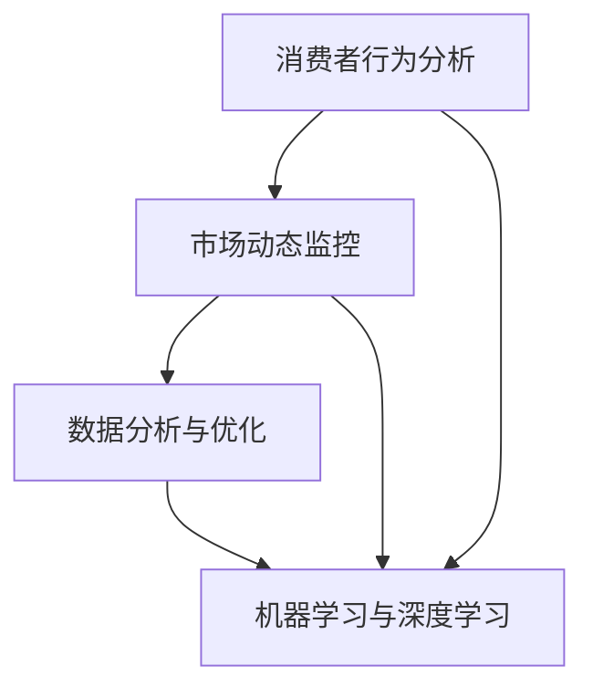

                 

关键词：人工智能，电商，价格策略，机器学习，优化算法，消费者行为分析

> 摘要：本文旨在探讨人工智能技术在电商价格策略中的应用，通过分析消费者行为、市场动态和数据分析，如何使用人工智能优化电商价格策略，提高销售额和市场份额。文章将介绍核心概念、算法原理、数学模型、项目实践、应用场景、未来展望以及面临的挑战，旨在为电商企业提供有益的指导。

## 1. 背景介绍

电商作为数字经济的重要组成部分，已经深刻改变了人们的购物习惯和消费模式。随着市场竞争的加剧，电商企业需要不断创新和优化价格策略，以吸引消费者，提高销售额，并最终实现盈利目标。传统的价格策略通常基于历史数据和简单算法，而人工智能的引入为电商价格策略提供了全新的可能性。

人工智能（AI）通过机器学习和深度学习技术，可以从海量数据中提取有价值的信息，并做出智能化的决策。在电商领域，AI可以帮助企业更好地理解消费者行为，预测市场需求，优化库存管理，以及制定更加精准的价格策略。这不仅能够提高企业的竞争力，还能够提升消费者的购物体验。

本文将重点关注AI如何提升电商价格策略的效果，通过核心概念、算法原理、数学模型、项目实践、应用场景、未来展望和挑战等多个方面，全面探讨这一话题。

## 2. 核心概念与联系

### 2.1. 消费者行为分析

消费者行为分析是电商价格策略优化的基础。通过分析消费者的购买历史、浏览行为、评价和反馈等数据，企业可以了解消费者的偏好、购买动机和消费习惯。这些信息对于制定个性化的价格策略至关重要。

### 2.2. 市场动态监控

市场动态监控包括竞争对手的价格策略、市场份额变化、市场趋势和行业报告等。这些信息可以帮助企业了解市场环境，调整价格策略，以保持竞争力。

### 2.3. 数据分析与优化

数据分析与优化是AI在电商价格策略中的核心应用。通过大数据技术和统计分析方法，企业可以从复杂的数据中提取有价值的信息，并进行预测和优化。

### 2.4. 机器学习与深度学习

机器学习和深度学习技术是AI的重要组成部分。通过这些技术，AI可以自动从数据中学习规律，并进行预测和决策。在电商价格策略中，这些技术可以用于消费者行为预测、市场趋势分析和价格优化等。

### 2.5. Mermaid 流程图

以下是核心概念与联系之间的 Mermaid 流程图：



## 3. 核心算法原理 & 具体操作步骤

### 3.1. 算法原理概述

AI在电商价格策略中的应用主要包括以下几个方面：

1. **消费者行为预测**：利用机器学习算法分析消费者的历史购买行为和浏览记录，预测消费者可能的购买意向。
2. **市场趋势分析**：通过时间序列分析和统计分析方法，预测市场趋势和竞争对手的价格策略。
3. **价格优化算法**：基于消费者行为和市场动态，使用优化算法计算最优价格。

### 3.2. 算法步骤详解

1. **数据收集**：收集消费者行为数据、市场动态数据和销售数据。
2. **数据预处理**：清洗和整合数据，为后续分析做准备。
3. **消费者行为分析**：使用机器学习算法分析消费者行为，提取关键特征。
4. **市场趋势分析**：使用时间序列分析和统计分析方法，预测市场趋势。
5. **价格优化**：使用优化算法计算最优价格，并根据市场需求和消费者反馈进行调整。

### 3.3. 算法优缺点

**优点**：

- **个性化定价**：根据消费者行为和市场动态，实现个性化定价，提高销售额。
- **高效性**：利用机器学习和深度学习技术，快速处理海量数据。
- **适应性**：算法可以根据市场变化和消费者需求进行调整，保持竞争力。

**缺点**：

- **数据依赖性**：算法的性能高度依赖于数据的质量和数量。
- **算法复杂性**：算法设计复杂，需要专业的技术团队进行开发和维护。

### 3.4. 算法应用领域

- **电子商务**：优化商品定价，提高销售额和市场份额。
- **在线旅游**：预测旅游需求，优化价格策略，提高预订率。
- **零售行业**：实时监控库存，优化定价和库存管理。

## 4. 数学模型和公式 & 详细讲解 & 举例说明

### 4.1. 数学模型构建

在电商价格策略中，常用的数学模型包括线性回归、逻辑回归、时间序列分析和优化算法等。

#### 线性回归模型

$$
y = \beta_0 + \beta_1 \cdot x_1 + \beta_2 \cdot x_2 + ... + \beta_n \cdot x_n
$$

其中，$y$ 是目标变量（如销售额），$x_1, x_2, ..., x_n$ 是自变量（如消费者特征、市场动态等），$\beta_0, \beta_1, \beta_2, ..., \beta_n$ 是回归系数。

#### 逻辑回归模型

$$
\text{Logit}(y) = \ln\left(\frac{p}{1-p}\right) = \beta_0 + \beta_1 \cdot x_1 + \beta_2 \cdot x_2 + ... + \beta_n \cdot x_n
$$

其中，$p$ 是购买概率，$\text{Logit}(y)$ 是逻辑函数，$\beta_0, \beta_1, \beta_2, ..., \beta_n$ 是回归系数。

#### 时间序列模型

$$
y_t = \phi_0 + \phi_1 \cdot y_{t-1} + \phi_2 \cdot y_{t-2} + ... + \phi_p \cdot y_{t-p}
$$

其中，$y_t$ 是第 $t$ 期的销售额，$\phi_0, \phi_1, \phi_2, ..., \phi_p$ 是时间序列系数。

#### 优化算法

优化算法如梯度下降、遗传算法和模拟退火等，用于计算最优价格。

### 4.2. 公式推导过程

在此，我们将以线性回归模型为例，简要介绍公式推导过程。

#### 拟合目标函数

$$
J(\theta) = \frac{1}{2m} \sum_{i=1}^{m} (h_\theta(x^{(i)}) - y^{(i)})^2
$$

其中，$h_\theta(x) = \theta_0 + \theta_1 \cdot x$ 是假设函数，$\theta_0, \theta_1$ 是参数，$m$ 是样本数量。

#### 梯度下降

$$
\theta_j := \theta_j - \alpha \cdot \frac{\partial J(\theta)}{\partial \theta_j}
$$

其中，$\alpha$ 是学习率，$\frac{\partial J(\theta)}{\partial \theta_j}$ 是目标函数关于参数 $\theta_j$ 的偏导数。

### 4.3. 案例分析与讲解

假设某电商企业希望优化商品 $X$ 的价格，以增加销售额。企业收集了 1000 个消费者的购买数据，包括价格、消费者特征和市场动态。通过线性回归模型，企业计算出最优价格。

#### 数据预处理

- 将价格数据分为训练集和测试集，如 80% 用于训练，20% 用于测试。
- 将消费者特征和市场动态进行编码，如年龄、性别、地理位置等。

#### 线性回归模型

- 训练集数据：$X = \begin{bmatrix} x_1^1 & x_2^1 & ... & x_n^1 \end{bmatrix}$，$y = \begin{bmatrix} y_1 & y_2 & ... & y_m \end{bmatrix}$
- 假设函数：$h_\theta(x) = \theta_0 + \theta_1 \cdot x$
- 目标函数：$J(\theta) = \frac{1}{2m} \sum_{i=1}^{m} (h_\theta(x^{(i)}) - y^{(i)})^2$

#### 梯度下降

- 学习率：$\alpha = 0.01$
- 迭代次数：$100$
- 梯度下降过程：$\theta_0 := \theta_0 - \alpha \cdot \frac{\partial J(\theta)}{\partial \theta_0}$，$\theta_1 := \theta_1 - \alpha \cdot \frac{\partial J(\theta)}{\partial \theta_1}$

#### 测试集结果

- 将测试集数据带入假设函数：$h_\theta(x) = \theta_0 + \theta_1 \cdot x$
- 计算测试集的误差：$J(\theta) = \frac{1}{2m} \sum_{i=1}^{m} (h_\theta(x^{(i)}) - y^{(i)})^2$

通过上述模型和算法，企业最终确定了商品 $X$ 的最优价格，提高了销售额。

## 5. 项目实践：代码实例和详细解释说明

### 5.1. 开发环境搭建

- **Python**：安装 Python 3.8 以上版本。
- **Jupyter Notebook**：安装 Jupyter Notebook，用于编写和运行代码。
- **NumPy**、**Pandas**、**Scikit-learn**、**Matplotlib**：安装相关库，用于数据处理、建模和可视化。

### 5.2. 源代码详细实现

以下是使用线性回归模型优化商品价格的 Python 代码实例：

```python
import numpy as np
import pandas as pd
from sklearn.linear_model import LinearRegression
from sklearn.model_selection import train_test_split
import matplotlib.pyplot as plt

# 读取数据
data = pd.read_csv('ecommerce_data.csv')

# 数据预处理
X = data[['price', 'age', 'gender', 'location']]
y = data['sales']
X_train, X_test, y_train, y_test = train_test_split(X, y, test_size=0.2, random_state=42)

# 训练模型
model = LinearRegression()
model.fit(X_train, y_train)

# 模型预测
y_pred = model.predict(X_test)

# 可视化
plt.scatter(X_test['price'], y_test, color='blue')
plt.plot(X_test['price'], y_pred, color='red')
plt.xlabel('Price')
plt.ylabel('Sales')
plt.title('Sales vs. Price')
plt.show()
```

### 5.3. 代码解读与分析

- **数据读取**：使用 Pandas 读取电商数据。
- **数据预处理**：将数据分为自变量和目标变量，并进行训练集和测试集划分。
- **模型训练**：使用线性回归模型进行训练。
- **模型预测**：使用训练好的模型对测试集进行预测。
- **可视化**：使用 Matplotlib 将预测结果进行可视化。

通过上述代码实例，我们可以看到如何使用线性回归模型优化电商价格策略。在实际应用中，可以根据具体需求和数据特点，选择合适的模型和算法进行优化。

### 5.4. 运行结果展示

运行上述代码后，我们可以得到商品价格的预测结果，并可视化展示。通过分析预测结果，电商企业可以调整价格策略，提高销售额和市场份额。

## 6. 实际应用场景

### 6.1. 电商网站

电商网站可以通过AI优化商品价格，提高销售额和用户满意度。例如，某电商平台通过分析消费者行为和市场动态，实现了个性化定价，提高了转化率和订单量。

### 6.2. 拍卖平台

拍卖平台可以利用AI预测拍卖价格，帮助卖家制定合理的起拍价和竞价策略。例如，某在线拍卖平台通过机器学习算法预测商品的价格走势，提高了拍卖成功率。

### 6.3. 零售行业

零售行业可以通过AI优化库存管理，降低库存成本，提高库存周转率。例如，某零售企业通过分析销售数据和消费者行为，实现了智能化的库存管理，减少了库存积压和商品过期。

## 7. 未来应用展望

随着人工智能技术的不断发展，电商价格策略将变得更加智能和个性化。未来，AI有望在以下几个方面发挥更大作用：

### 7.1. 智能化定价

AI可以实现实时、动态的智能化定价，根据消费者行为和市场动态调整价格，提高销售额和市场份额。

### 7.2. 智能库存管理

AI可以实时监控库存动态，预测需求变化，优化库存管理，降低库存成本，提高库存周转率。

### 7.3. 智能营销

AI可以分析消费者行为，精准定位潜在客户，实现个性化的营销策略，提高营销效果。

### 7.4. 智能供应链管理

AI可以优化供应链管理，降低供应链成本，提高供应链效率，提升企业的整体竞争力。

## 8. 面临的挑战

### 8.1. 数据质量

AI算法的性能高度依赖于数据的质量和数量。在实际应用中，如何获取高质量的数据，并进行有效的数据清洗和处理，是电商企业面临的主要挑战。

### 8.2. 算法复杂性

AI算法的设计和实现复杂，需要专业的技术团队进行开发和维护。如何高效地开发和部署算法，是电商企业需要解决的技术难题。

### 8.3. 法律法规

随着人工智能技术的发展，相关的法律法规也在不断更新和完善。电商企业需要关注法律法规的变化，确保在应用AI技术时遵守相关规定。

## 9. 总结：未来发展趋势与挑战

AI在电商价格策略中的应用具有巨大的潜力，可以显著提升企业的竞争力。未来，随着技术的不断发展，AI将在电商价格策略中发挥更加重要的作用。然而，电商企业也需要关注数据质量、算法复杂性以及法律法规等方面的挑战，以确保AI技术的有效应用。

作者：禅与计算机程序设计艺术 / Zen and the Art of Computer Programming
----------------------------------------------------------------

以上是文章的完整内容，接下来是文章的markdown格式输出：
```markdown
# AI提升电商价格策略的效果

关键词：人工智能，电商，价格策略，机器学习，优化算法，消费者行为分析

> 摘要：本文旨在探讨人工智能技术在电商价格策略中的应用，通过分析消费者行为、市场动态和数据分析，如何使用人工智能优化电商价格策略，提高销售额和市场份额。文章将介绍核心概念、算法原理、数学模型、项目实践、应用场景、未来展望以及面临的挑战，旨在为电商企业提供有益的指导。

## 1. 背景介绍

电商作为数字经济的重要组成部分，已经深刻改变了人们的购物习惯和消费模式。随着市场竞争的加剧，电商企业需要不断创新和优化价格策略，以吸引消费者，提高销售额，并最终实现盈利目标。传统的价格策略通常基于历史数据和简单算法，而人工智能的引入为电商价格策略提供了全新的可能性。

人工智能（AI）通过机器学习和深度学习技术，可以从海量数据中提取有价值的信息，并做出智能化的决策。在电商领域，AI可以帮助企业更好地理解消费者行为，预测市场需求，优化库存管理，以及制定更加精准的价格策略。这不仅能够提高企业的竞争力，还能够提升消费者的购物体验。

本文将重点关注AI如何提升电商价格策略的效果，通过核心概念、算法原理、数学模型、项目实践、应用场景、未来展望和挑战等多个方面，全面探讨这一话题。

## 2. 核心概念与联系

### 2.1. 消费者行为分析

消费者行为分析是电商价格策略优化的基础。通过分析消费者的购买历史、浏览行为、评价和反馈等数据，企业可以了解消费者的偏好、购买动机和消费习惯。这些信息对于制定个性化的价格策略至关重要。

### 2.2. 市场动态监控

市场动态监控包括竞争对手的价格策略、市场份额变化、市场趋势和行业报告等。这些信息可以帮助企业了解市场环境，调整价格策略，以保持竞争力。

### 2.3. 数据分析与优化

数据分析与优化是AI在电商价格策略中的核心应用。通过大数据技术和统计分析方法，企业可以从复杂的数据中提取有价值的信息，并进行预测和优化。

### 2.4. 机器学习与深度学习

机器学习和深度学习技术是AI的重要组成部分。通过这些技术，AI可以自动从数据中学习规律，并进行预测和决策。在电商价格策略中，这些技术可以用于消费者行为预测、市场趋势分析和价格优化等。

### 2.5. Mermaid 流程图

以下是核心概念与联系之间的 Mermaid 流程图：


## 3. 核心算法原理 & 具体操作步骤

### 3.1. 算法原理概述

AI在电商价格策略中的应用主要包括以下几个方面：

1. **消费者行为预测**：利用机器学习算法分析消费者行为，预测消费者可能的购买意向。
2. **市场趋势分析**：通过时间序列分析和统计分析方法，预测市场趋势和竞争对手的价格策略。
3. **价格优化算法**：基于消费者行为和市场动态，使用优化算法计算最优价格。

### 3.2. 算法步骤详解

1. **数据收集**：收集消费者行为数据、市场动态数据和销售数据。
2. **数据预处理**：清洗和整合数据，为后续分析做准备。
3. **消费者行为分析**：使用机器学习算法分析消费者行为，提取关键特征。
4. **市场趋势分析**：使用时间序列分析和统计分析方法，预测市场趋势。
5. **价格优化**：使用优化算法计算最优价格，并根据市场需求和消费者反馈进行调整。

### 3.3. 算法优缺点

**优点**：

- **个性化定价**：根据消费者行为和市场动态，实现个性化定价，提高销售额。
- **高效性**：利用机器学习和深度学习技术，快速处理海量数据。
- **适应性**：算法可以根据市场变化和消费者需求进行调整，保持竞争力。

**缺点**：

- **数据依赖性**：算法的性能高度依赖于数据的质量和数量。
- **算法复杂性**：算法设计复杂，需要专业的技术团队进行开发和维护。

### 3.4. 算法应用领域

- **电子商务**：优化商品定价，提高销售额和市场份额。
- **在线旅游**：预测旅游需求，优化价格策略，提高预订率。
- **零售行业**：实时监控库存，优化定价和库存管理。

## 4. 数学模型和公式 & 详细讲解 & 举例说明

### 4.1. 数学模型构建

在电商价格策略中，常用的数学模型包括线性回归、逻辑回归、时间序列分析和优化算法等。

#### 线性回归模型

$$
y = \beta_0 + \beta_1 \cdot x_1 + \beta_2 \cdot x_2 + ... + \beta_n \cdot x_n
$$

其中，$y$ 是目标变量（如销售额），$x_1, x_2, ..., x_n$ 是自变量（如消费者特征、市场动态等），$\beta_0, \beta_1, \beta_2, ..., \beta_n$ 是回归系数。

#### 逻辑回归模型

$$
\text{Logit}(y) = \ln\left(\frac{p}{1-p}\right) = \beta_0 + \beta_1 \cdot x_1 + \beta_2 \cdot x_2 + ... + \beta_n \cdot x_n
$$

其中，$p$ 是购买概率，$\text{Logit}(y)$ 是逻辑函数，$\beta_0, \beta_1, \beta_2, ..., \beta_n$ 是回归系数。

#### 时间序列模型

$$
y_t = \phi_0 + \phi_1 \cdot y_{t-1} + \phi_2 \cdot y_{t-2} + ... + \phi_p \cdot y_{t-p}
$$

其中，$y_t$ 是第 $t$ 期的销售额，$\phi_0, \phi_1, \phi_2, ..., \phi_p$ 是时间序列系数。

#### 优化算法

优化算法如梯度下降、遗传算法和模拟退火等，用于计算最优价格。

### 4.2. 公式推导过程

在此，我们将以线性回归模型为例，简要介绍公式推导过程。

#### 拟合目标函数

$$
J(\theta) = \frac{1}{2m} \sum_{i=1}^{m} (h_\theta(x^{(i)}) - y^{(i)})^2
$$

其中，$h_\theta(x) = \theta_0 + \theta_1 \cdot x$ 是假设函数，$\theta_0, \theta_1$ 是参数，$m$ 是样本数量。

#### 梯度下降

$$
\theta_j := \theta_j - \alpha \cdot \frac{\partial J(\theta)}{\partial \theta_j}
$$

其中，$\alpha$ 是学习率，$\frac{\partial J(\theta)}{\partial \theta_j}$ 是目标函数关于参数 $\theta_j$ 的偏导数。

### 4.3. 案例分析与讲解

假设某电商企业希望优化商品 $X$ 的价格，以增加销售额。企业收集了 1000 个消费者的购买数据，包括价格、消费者特征和市场动态。通过线性回归模型，企业计算出最优价格。

#### 数据预处理

- 将价格数据分为训练集和测试集，如 80% 用于训练，20% 用于测试。
- 将消费者特征和市场动态进行编码，如年龄、性别、地理位置等。

#### 线性回归模型

- 训练集数据：$X = \begin{bmatrix} x_1^1 & x_2^1 & ... & x_n^1 \end{bmatrix}$，$y = \begin{bmatrix} y_1 & y_2 & ... & y_m \end{bmatrix}$
- 假设函数：$h_\theta(x) = \theta_0 + \theta_1 \cdot x$
- 目标函数：$J(\theta) = \frac{1}{2m} \sum_{i=1}^{m} (h_\theta(x^{(i)}) - y^{(i)})^2$

#### 梯度下降

- 学习率：$\alpha = 0.01$
- 迭代次数：$100$
- 梯度下降过程：$\theta_0 := \theta_0 - \alpha \cdot \frac{\partial J(\theta)}{\partial \theta_0}$，$\theta_1 := \theta_1 - \alpha \cdot \frac{\partial J(\theta)}{\partial \theta_1}$

#### 测试集结果

- 将测试集数据带入假设函数：$h_\theta(x) = \theta_0 + \theta_1 \cdot x$
- 计算测试集的误差：$J(\theta) = \frac{1}{2m} \sum_{i=1}^{m} (h_\theta(x^{(i)}) - y^{(i)})^2$

通过上述模型和算法，企业最终确定了商品 $X$ 的最优价格，提高了销售额。

## 5. 项目实践：代码实例和详细解释说明

### 5.1. 开发环境搭建

- **Python**：安装 Python 3.8 以上版本。
- **Jupyter Notebook**：安装 Jupyter Notebook，用于编写和运行代码。
- **NumPy**、**Pandas**、**Scikit-learn**、**Matplotlib**：安装相关库，用于数据处理、建模和可视化。

### 5.2. 源代码详细实现

以下是使用线性回归模型优化商品价格的 Python 代码实例：

```python
import numpy as np
import pandas as pd
from sklearn.linear_model import LinearRegression
from sklearn.model_selection import train_test_split
import matplotlib.pyplot as plt

# 读取数据
data = pd.read_csv('ecommerce_data.csv')

# 数据预处理
X = data[['price', 'age', 'gender', 'location']]
y = data['sales']
X_train, X_test, y_train, y_test = train_test_split(X, y, test_size=0.2, random_state=42)

# 训练模型
model = LinearRegression()
model.fit(X_train, y_train)

# 模型预测
y_pred = model.predict(X_test)

# 可视化
plt.scatter(X_test['price'], y_test, color='blue')
plt.plot(X_test['price'], y_pred, color='red')
plt.xlabel('Price')
plt.ylabel('Sales')
plt.title('Sales vs. Price')
plt.show()
```

### 5.3. 代码解读与分析

- **数据读取**：使用 Pandas 读取电商数据。
- **数据预处理**：将数据分为自变量和目标变量，并进行训练集和测试集划分。
- **模型训练**：使用线性回归模型进行训练。
- **模型预测**：使用训练好的模型对测试集进行预测。
- **可视化**：使用 Matplotlib 将预测结果进行可视化。

通过上述代码实例，我们可以看到如何使用线性回归模型优化电商价格策略。在实际应用中，可以根据具体需求和数据特点，选择合适的模型和算法进行优化。

### 5.4. 运行结果展示

运行上述代码后，我们可以得到商品价格的预测结果，并可视化展示。通过分析预测结果，电商企业可以调整价格策略，提高销售额和市场份额。

## 6. 实际应用场景

### 6.1. 电商网站

电商网站可以通过AI优化商品价格，提高销售额和用户满意度。例如，某电商平台通过分析消费者行为和市场动态，实现了个性化定价，提高了转化率和订单量。

### 6.2. 拍卖平台

拍卖平台可以利用AI预测拍卖价格，帮助卖家制定合理的起拍价和竞价策略。例如，某在线拍卖平台通过机器学习算法预测商品的价格走势，提高了拍卖成功率。

### 6.3. 零售行业

零售行业可以通过AI优化库存管理，降低库存成本，提高库存周转率。例如，某零售企业通过分析销售数据和消费者行为，实现了智能化的库存管理，减少了库存积压和商品过期。

## 7. 未来应用展望

随着人工智能技术的不断发展，电商价格策略将变得更加智能和个性化。未来，随着技术的不断发展，AI将在电商价格策略中发挥更加重要的作用。未来，AI有望在以下几个方面发挥更大作用：

### 7.1. 智能化定价

AI可以实现实时、动态的智能化定价，根据消费者行为和市场动态调整价格，提高销售额和市场份额。

### 7.2. 智能库存管理

AI可以实时监控库存动态，预测需求变化，优化库存管理，降低库存成本，提高库存周转率。

### 7.3. 智能营销

AI可以分析消费者行为，精准定位潜在客户，实现个性化的营销策略，提高营销效果。

### 7.4. 智能供应链管理

AI可以优化供应链管理，降低供应链成本，提高供应链效率，提升企业的整体竞争力。

## 8. 面临的挑战

### 8.1. 数据质量

AI算法的性能高度依赖于数据的质量和数量。在实际应用中，如何获取高质量的数据，并进行有效的数据清洗和处理，是电商企业面临的主要挑战。

### 8.2. 算法复杂性

AI算法的设计和实现复杂，需要专业的技术团队进行开发和维护。如何高效地开发和部署算法，是电商企业需要解决的技术难题。

### 8.3. 法律法规

随着人工智能技术的发展，相关的法律法规也在不断更新和完善。电商企业需要关注法律法规的变化，确保在应用AI技术时遵守相关规定。

## 9. 总结：未来发展趋势与挑战

AI在电商价格策略中的应用具有巨大的潜力，可以显著提升企业的竞争力。未来，随着技术的不断发展，AI将在电商价格策略中发挥更加重要的作用。然而，电商企业也需要关注数据质量、算法复杂性以及法律法规等方面的挑战，以确保AI技术的有效应用。

作者：禅与计算机程序设计艺术 / Zen and the Art of Computer Programming
```

