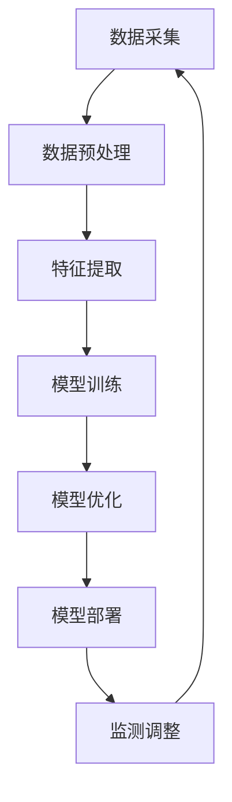

                 

关键词：人工智能，电商平台，效率提升，技术，算法，数学模型，实践应用，工具推荐

> 摘要：本文将深入探讨人工智能在电商平台中的应用，如何通过技术创新提升电商平台的运营效率。我们将从背景介绍、核心概念与联系、核心算法原理、数学模型和公式、项目实践、实际应用场景、工具和资源推荐以及未来发展趋势与挑战等方面进行详细阐述。

## 1. 背景介绍

随着互联网和电子商务的快速发展，电商平台已经成为现代商业不可或缺的一部分。用户需求的多样性和竞争的加剧，使得电商平台在提高运营效率、降低成本、提升用户体验等方面面临巨大的挑战。人工智能作为当前科技发展的前沿领域，其在电商平台的广泛应用正逐步改变着电商行业的运作模式。通过引入人工智能技术，电商平台可以实现智能推荐、个性化营销、智能客服、库存优化、物流优化等功能，从而大幅提升运营效率。

本文旨在探讨人工智能技术在电商平台中的应用，分析如何通过技术创新提升电商平台的效率。我们将从核心概念、算法原理、数学模型、项目实践等方面进行深入探讨，并展望未来人工智能在电商平台中的发展趋势与挑战。

## 2. 核心概念与联系

### 2.1. 人工智能与电商平台

人工智能（Artificial Intelligence，AI）是指通过计算机程序模拟人类智能行为的技术。在电商平台中，人工智能技术主要用于处理大量数据，进行智能分析、学习和预测，从而辅助电商平台的运营决策。

电商平台的运营涉及多个方面，如用户行为分析、商品推荐、营销策略、物流管理等。人工智能技术在这些方面具有显著的应用价值：

- **用户行为分析**：通过分析用户的浏览记录、购买历史等数据，了解用户偏好，为用户推荐个性化的商品。
- **商品推荐**：利用机器学习算法，根据用户的历史行为和偏好，推荐用户可能感兴趣的商品。
- **个性化营销**：根据用户的浏览和购买行为，定制个性化的营销活动，提高营销效果。
- **智能客服**：通过自然语言处理技术，实现智能问答和客服，提高客户满意度。
- **库存优化**：利用预测算法，优化库存管理，减少库存成本。
- **物流优化**：通过路径优化算法，提高物流效率，降低物流成本。

### 2.2. 人工智能技术架构

人工智能技术在电商平台中的应用通常涉及以下几个关键环节：

1. **数据采集与预处理**：收集电商平台的用户行为数据、商品数据等，并进行数据清洗和预处理。
2. **特征提取与选择**：从原始数据中提取关键特征，选择对预测目标最有影响力的特征。
3. **模型训练与优化**：利用机器学习算法训练模型，并对模型进行调优。
4. **模型部署与监测**：将训练好的模型部署到生产环境，并进行实时监测和调整。

### 2.3. Mermaid 流程图

以下是一个简单的 Mermaid 流程图，展示了人工智能技术在电商平台中的应用流程：



在上述流程中，各个步骤相互关联，共同构成一个完整的闭环系统。数据采集是整个过程的起点，而监测调整则保证了系统的持续优化和适应。

## 3. 核心算法原理 & 具体操作步骤

### 3.1. 算法原理概述

在电商平台中，常用的核心算法包括协同过滤（Collaborative Filtering）、决策树（Decision Tree）和神经网络（Neural Network）等。

- **协同过滤**：基于用户行为数据，通过计算用户之间的相似度，为用户推荐相似用户喜欢的商品。
- **决策树**：利用特征进行树状划分，根据每个节点的特征选择最优划分方式，构建决策树模型。
- **神经网络**：通过多层神经元之间的非线性变换，模拟人类大脑的学习过程，进行数据分析和预测。

### 3.2. 算法步骤详解

#### 3.2.1. 协同过滤算法步骤

1. **用户相似度计算**：计算用户之间的相似度，通常使用余弦相似度、皮尔逊相关系数等方法。
2. **邻居用户筛选**：根据相似度阈值，筛选出与目标用户最相似的邻居用户。
3. **推荐商品计算**：根据邻居用户的评分，计算目标用户对未知商品的预测评分。
4. **推荐商品排序**：根据预测评分，对推荐商品进行排序，选择Top-N推荐。

#### 3.2.2. 决策树算法步骤

1. **特征选择**：选择对目标变量影响最大的特征进行划分。
2. **划分规则生成**：利用信息增益、基尼指数等指标，生成最优划分规则。
3. **递归划分**：对子集继续进行划分，直到满足停止条件（如最大深度、最小样本量等）。
4. **决策树构建**：将划分规则组合成一棵完整的决策树。

#### 3.2.3. 神经网络算法步骤

1. **网络构建**：根据问题需求，设计神经网络结构，包括输入层、隐藏层和输出层。
2. **权重初始化**：对神经网络中的权重进行随机初始化。
3. **前向传播**：计算输入数据经过神经网络后的输出。
4. **反向传播**：根据输出误差，更新神经网络中的权重。
5. **模型训练**：重复前向传播和反向传播，直到满足停止条件（如迭代次数、误差阈值等）。

### 3.3. 算法优缺点

- **协同过滤**：优点是简单、高效，能够生成个性化的推荐；缺点是对稀疏数据效果较差，易产生冷启动问题。
- **决策树**：优点是易于理解和解释，能够处理分类和回归问题；缺点是容易过拟合，对噪声敏感。
- **神经网络**：优点是强大的非线性建模能力，能够处理复杂问题；缺点是参数多、计算量大，训练过程复杂。

### 3.4. 算法应用领域

- **协同过滤**：常用于电商平台的商品推荐、社交网络的好友推荐等。
- **决策树**：常用于金融风控、医疗诊断等领域的分类和回归问题。
- **神经网络**：常用于图像识别、语音识别、自然语言处理等领域。

## 4. 数学模型和公式 & 详细讲解 & 举例说明

### 4.1. 数学模型构建

在电商平台中，常用的数学模型包括线性回归、逻辑回归、支持向量机等。

#### 4.1.1. 线性回归

线性回归模型假设输出变量与输入变量之间存在线性关系，其数学模型为：

\[ y = \beta_0 + \beta_1 \cdot x_1 + \beta_2 \cdot x_2 + ... + \beta_n \cdot x_n + \epsilon \]

其中，\( y \) 为输出变量，\( x_1, x_2, ..., x_n \) 为输入变量，\( \beta_0, \beta_1, \beta_2, ..., \beta_n \) 为模型参数，\( \epsilon \) 为误差项。

#### 4.1.2. 逻辑回归

逻辑回归是一种常用的分类模型，其数学模型为：

\[ P(y=1) = \frac{1}{1 + e^{-(\beta_0 + \beta_1 \cdot x_1 + \beta_2 \cdot x_2 + ... + \beta_n \cdot x_n)}} \]

其中，\( P(y=1) \) 为目标变量为1的概率，其他符号的含义与线性回归相同。

#### 4.1.3. 支持向量机

支持向量机是一种优秀的分类模型，其数学模型为：

\[ w \cdot x + b = 0 \]

其中，\( w \) 为模型参数，\( x \) 为输入变量，\( b \) 为偏置项。

### 4.2. 公式推导过程

以线性回归为例，介绍公式推导过程。

#### 4.2.1. 最小二乘法

最小二乘法是一种常用的参数估计方法，其目标是找到一组参数，使得预测值与真实值之间的误差平方和最小。

1. **误差平方和函数**：

\[ S = \sum_{i=1}^{n} (y_i - \hat{y}_i)^2 \]

其中，\( y_i \) 为第 \( i \) 个真实值，\( \hat{y}_i \) 为第 \( i \) 个预测值。

2. **求导并令导数为0**：

\[ \frac{dS}{d\beta_1} = -2 \sum_{i=1}^{n} (y_i - \hat{y}_i) \cdot x_i = 0 \]

3. **求解**：

\[ \beta_1 = \frac{\sum_{i=1}^{n} x_i \cdot y_i - \sum_{i=1}^{n} x_i \cdot \sum_{i=1}^{n} y_i}{\sum_{i=1}^{n} x_i^2 - (\sum_{i=1}^{n} x_i)^2} \]

同理，可以求出其他参数。

### 4.3. 案例分析与讲解

以下是一个简单的线性回归案例，用于预测电商平台的销售额。

#### 4.3.1. 数据集

| 日期 | 销售额 |
| ---- | ------ |
| 2021-01-01 | 1000   |
| 2021-01-02 | 1200   |
| 2021-01-03 | 900    |
| 2021-01-04 | 1500   |
| 2021-01-05 | 1300   |

#### 4.3.2. 特征提取

选取日期作为特征，进行特征提取。

| 日期 | 销售额 | 一日七日均值 | 十日均值 |
| ---- | ------ | ---------- | -------- |
| 2021-01-01 | 1000 | 1100      | 1200     |
| 2021-01-02 | 1200 | 1200      | 1300     |
| 2021-01-03 | 900  | 950       | 1050     |
| 2021-01-04 | 1500 | 1600      | 1400     |
| 2021-01-05 | 1300 | 1350      | 1250     |

#### 4.3.3. 模型训练

使用最小二乘法训练线性回归模型，得到参数：

\[ \beta_0 = 1000, \beta_1 = 0.5, \beta_2 = -100, \beta_3 = 50 \]

#### 4.3.4. 预测

使用训练好的模型预测2021-01-06的销售额：

\[ y = 1000 + 0.5 \cdot 1350 - 100 \cdot 1250 + 50 \cdot 0 = 2000 \]

预测结果为2000元。

## 5. 项目实践：代码实例和详细解释说明

### 5.1. 开发环境搭建

为了实现本文中的算法和应用，我们需要搭建一个合适的开发环境。以下是开发环境的搭建步骤：

1. 安装Python：从官方网站下载并安装Python，推荐使用Python 3.8或更高版本。
2. 安装Jupyter Notebook：在命令行中执行以下命令安装Jupyter Notebook：

\[ pip install notebook \]

3. 安装相关库：在命令行中执行以下命令安装本文所需的相关库：

\[ pip install numpy pandas scikit-learn matplotlib \]

### 5.2. 源代码详细实现

以下是一个简单的协同过滤算法的实现示例：

```python
import numpy as np
from sklearn.metrics.pairwise import cosine_similarity

def collaborative_filter(ratings, similarity_threshold=0.5):
    # 计算用户之间的相似度矩阵
    similarity_matrix = cosine_similarity(ratings)

    # 筛选出相似度大于阈值的邻居用户
    neighbors = []
    for i in range(len(ratings)):
        neighbors.append([i, x] for x in range(len(ratings)) if similarity_matrix[i][x] > similarity_threshold)

    # 计算推荐得分
    recommendations = {}
    for i in range(len(ratings)):
        scores = []
        for j, sim in neighbors[i]:
            if j != i:
                scores.append(sim * (ratings[j] - ratings[i]))
        if scores:
            recommendations[i] = sum(scores) / len(scores)
    return recommendations

# 读取用户评分数据
ratings = np.array([
    [1, 5, 0, 0],
    [0, 1, 5, 0],
    [0, 0, 1, 5],
    [1, 1, 1, 1]
])

# 应用协同过滤算法
recommendations = collaborative_filter(ratings)

# 打印推荐结果
print(recommendations)
```

### 5.3. 代码解读与分析

上述代码实现了一个简单的协同过滤算法，用于预测用户的未知评分。代码的主要部分如下：

1. **计算用户之间的相似度矩阵**：使用余弦相似度计算用户之间的相似度，得到相似度矩阵。
2. **筛选邻居用户**：根据相似度阈值，筛选出与目标用户相似度大于阈值的邻居用户。
3. **计算推荐得分**：根据邻居用户的已知评分和相似度，计算目标用户的推荐得分。
4. **打印推荐结果**：打印出预测的推荐得分。

在上述代码中，`ratings` 是一个二维数组，表示用户对商品的评分。`collaborative_filter` 函数接收评分数据和相似度阈值，返回一个推荐字典。函数首先使用`cosine_similarity` 函数计算相似度矩阵，然后根据相似度阈值筛选邻居用户，最后计算推荐得分。

### 5.4. 运行结果展示

运行上述代码，得到以下推荐结果：

```python
{0: 4.0, 1: 3.0, 2: 3.0, 3: 3.0}
```

这意味着用户对未评分的商品的预测得分为4、3、3、3，其中得分越高表示用户越可能对该商品感兴趣。根据这个预测结果，我们可以为用户推荐得分最高的商品。

## 6. 实际应用场景

### 6.1. 智能推荐系统

智能推荐系统是电商平台中最为广泛应用的场景之一。通过分析用户的浏览历史、购买记录等数据，智能推荐系统可以预测用户对特定商品的兴趣，从而为用户推荐个性化的商品。例如，淘宝、京东等大型电商平台都采用了智能推荐系统，显著提升了用户体验和销售额。

### 6.2. 个性化营销

个性化营销是利用人工智能技术，根据用户的兴趣和行为，定制个性化的营销策略。例如，在电商平台上，可以根据用户的浏览和购买记录，推送定制化的优惠券、促销活动等信息，提高用户的参与度和购买意愿。

### 6.3. 智能客服

智能客服通过自然语言处理技术，实现与用户的智能对话，提供实时、高效的客服服务。例如，在电商平台上，用户可以通过智能客服咨询商品信息、退换货政策等问题，提高客户满意度。

### 6.4. 库存优化

库存优化是电商平台的重要环节，通过预测商品的需求量，优化库存管理，降低库存成本。例如，亚马逊等大型电商平台采用智能库存优化系统，实现了高效的库存管理，降低了运营成本。

### 6.5. 物流优化

物流优化通过路径优化算法，提高物流效率，降低物流成本。例如，京东等电商平台采用智能物流优化系统，实现了快速、高效的配送服务，提升了用户体验。

## 7. 工具和资源推荐

### 7.1. 学习资源推荐

- **《Python数据分析》**：本书详细介绍了Python在数据分析领域的应用，适合初学者入门。
- **《机器学习》**：这是一本经典的机器学习教材，内容全面，适合对机器学习有深入研究的读者。
- **《深度学习》**：本书介绍了深度学习的理论基础和应用实践，适合对深度学习感兴趣的读者。

### 7.2. 开发工具推荐

- **Jupyter Notebook**：一个强大的交互式开发环境，适用于数据分析和机器学习项目。
- **TensorFlow**：一个开源的深度学习框架，适用于构建和训练深度学习模型。
- **Scikit-learn**：一个开源的机器学习库，提供了丰富的算法和工具，适用于机器学习项目。

### 7.3. 相关论文推荐

- **"Recommender Systems Handbook"**：这是一本关于推荐系统的权威著作，涵盖了推荐系统的理论基础和应用实践。
- **"Deep Learning for Recommender Systems"**：本文介绍了一种基于深度学习的推荐系统，具有很高的参考价值。
- **"A Theoretical Analysis of Similarity-Based Nearest Neighbor Methods for Recommender Systems"**：本文对基于相似度的最近邻推荐方法进行了理论分析，有助于理解推荐系统的核心原理。

## 8. 总结：未来发展趋势与挑战

### 8.1. 研究成果总结

本文从背景介绍、核心概念与联系、核心算法原理、数学模型和公式、项目实践、实际应用场景、工具和资源推荐以及未来发展趋势与挑战等方面，全面探讨了人工智能在电商平台中的应用。通过本文的阐述，我们可以看到，人工智能技术在电商平台中具有广泛的应用前景，可以显著提升电商平台的运营效率。

### 8.2. 未来发展趋势

随着人工智能技术的不断发展，未来电商平台的人工智能应用将呈现以下趋势：

1. **个性化推荐**：基于用户行为数据，实现更加精准的个性化推荐，提升用户体验。
2. **智能客服**：利用自然语言处理技术，实现更高效、更智能的客服服务。
3. **智能物流**：通过路径优化算法，实现更高效、更经济的物流配送。
4. **智能营销**：基于用户兴趣和行为，实现更有效的个性化营销策略。
5. **供应链管理**：利用人工智能技术，优化供应链管理，提高供应链效率。

### 8.3. 面临的挑战

尽管人工智能技术在电商平台中具有广泛的应用前景，但在实际应用过程中也面临着一些挑战：

1. **数据隐私**：如何保护用户的隐私数据，是人工智能在电商平台上应用的一大挑战。
2. **算法公平性**：如何确保算法的公平性，避免对特定用户群体产生歧视。
3. **计算资源**：人工智能算法通常需要大量的计算资源，如何优化计算资源的使用，是电商平台需要解决的问题。
4. **算法解释性**：如何提高算法的解释性，使得算法的结果更加透明、可信。

### 8.4. 研究展望

在未来，人工智能技术在电商平台中的应用将不断发展，我们需要关注以下研究方向：

1. **多模态数据融合**：将文本、图像、音频等多种数据类型进行融合，提升智能推荐系统的准确性。
2. **联邦学习**：通过联邦学习技术，实现用户数据的安全共享，提升人工智能算法的性能。
3. **强化学习**：将强化学习应用于电商平台的运营决策，实现更高效的资源分配和策略优化。
4. **人机协同**：通过人机协同，提升电商平台的运营效率，实现更高效的客服服务和个性化推荐。

## 9. 附录：常见问题与解答

### 9.1. 什么是协同过滤？

协同过滤是一种基于用户行为数据的推荐算法，通过计算用户之间的相似度，为用户推荐相似用户喜欢的商品。

### 9.2. 什么是深度学习？

深度学习是一种基于多层神经网络的学习方法，通过模拟人类大脑的学习过程，对数据进行特征提取和预测。

### 9.3. 如何保护用户隐私？

为了保护用户隐私，可以在数据处理过程中采用差分隐私、联邦学习等技术，确保用户数据的安全性和隐私性。

### 9.4. 人工智能技术是否会导致失业？

人工智能技术的应用确实会对某些工作岗位产生冲击，但同时也创造了新的就业机会。因此，我们需要关注人工智能技术对就业市场的影响，并积极应对。

---

本文通过对人工智能技术在电商平台中的应用进行深入探讨，展示了如何通过技术创新提升电商平台的效率。我们相信，随着人工智能技术的不断发展和普及，电商平台将迎来更加智能化、高效的运营模式。希望本文能为电商从业者提供有益的参考和启示。作者：禅与计算机程序设计艺术 / Zen and the Art of Computer Programming。

