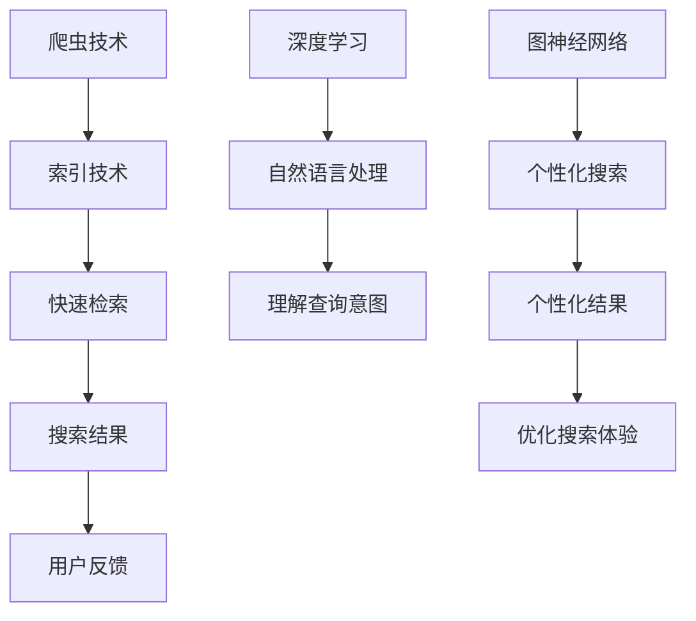

                 

关键词：AI搜索引擎，传统搜索引擎，效率对比，算法原理，数学模型，应用领域，未来展望

> 摘要：本文将深入探讨AI搜索引擎与传统搜索引擎在效率方面的对比，通过分析核心算法、数学模型、应用场景以及未来展望，揭示两种搜索引擎在技术进步背景下的发展趋势与挑战。

## 1. 背景介绍

随着互联网的飞速发展，搜索引擎成为人们获取信息的重要工具。传统搜索引擎如Google、Bing等，通过爬虫技术收集网络信息，并对网页内容进行分析、索引，使用户能够快速找到所需信息。然而，随着数据量和复杂度的增加，传统搜索引擎的效率逐渐成为瓶颈。为此，人工智能技术被引入到搜索引擎领域，形成了AI搜索引擎。AI搜索引擎利用深度学习、自然语言处理等技术，对用户查询意图进行精准识别，提供更加个性化的搜索结果。

## 2. 核心概念与联系

为了更好地理解AI搜索引擎与传统搜索引擎的效率对比，我们首先需要了解其中的核心概念和联系。

### 2.1 传统搜索引擎

传统搜索引擎的核心是爬虫技术和索引技术。爬虫（Web Crawler）是一种自动化程序，用于遍历互联网上的网页，收集网页内容和链接信息。索引（Indexing）是将网页内容进行分析、分词、索引化，以便快速检索。

### 2.2 AI搜索引擎

AI搜索引擎的核心是深度学习、自然语言处理和图神经网络等技术。深度学习用于训练模型，识别用户查询意图；自然语言处理用于理解和解析用户查询；图神经网络用于处理复杂的关系网络，提供更加个性化的搜索结果。

### 2.3 Mermaid 流程图

以下是AI搜索引擎与传统搜索引擎的核心概念与联系：



## 3. 核心算法原理 & 具体操作步骤

### 3.1 算法原理概述

AI搜索引擎的核心算法包括深度学习模型、自然语言处理技术和图神经网络。深度学习模型用于训练分类和回归任务，如关键词提取、用户查询意图识别等；自然语言处理技术用于理解用户查询，如分词、词性标注、实体识别等；图神经网络用于处理复杂的关系网络，如网页链接分析、用户兴趣挖掘等。

### 3.2 算法步骤详解

AI搜索引擎的算法步骤如下：

1. 用户查询输入：用户输入查询语句，通过自然语言处理技术进行预处理，如分词、词性标注等。

2. 查询意图识别：使用深度学习模型对用户查询意图进行识别，如信息查询、导航、购物等。

3. 关键词提取：根据查询意图，提取关键词，用于后续的搜索结果生成。

4. 搜索结果生成：通过图神经网络处理关键词之间的关联关系，生成个性化的搜索结果。

5. 搜索结果排序：根据用户反馈和搜索结果的相关性，对搜索结果进行排序。

6. 用户反馈与优化：根据用户反馈，调整模型参数，优化搜索体验。

### 3.3 算法优缺点

AI搜索引擎的优点包括：

1. 个性化搜索：根据用户查询意图和兴趣，提供个性化的搜索结果。

2. 高效性：通过深度学习模型和图神经网络，提高搜索结果的准确性。

3. 灵活性：可以处理复杂的关系网络，挖掘用户的潜在需求。

AI搜索引擎的缺点包括：

1. 计算资源消耗：训练深度学习模型和图神经网络需要大量的计算资源。

2. 数据隐私：AI搜索引擎需要收集用户的查询历史和兴趣数据，可能涉及隐私问题。

### 3.4 算法应用领域

AI搜索引擎在多个领域得到广泛应用：

1. 搜索引擎：如Google、Bing等主流搜索引擎。

2. 社交网络：如Facebook、Twitter等，用于用户信息推荐。

3. 电商平台：如Amazon、淘宝等，用于商品推荐。

4. 问答系统：如Siri、小爱同学等，用于提供实时问答服务。

## 4. 数学模型和公式 & 详细讲解 & 举例说明

### 4.1 数学模型构建

AI搜索引擎的核心算法涉及多个数学模型，包括深度学习模型、自然语言处理模型和图神经网络模型。以下分别介绍这些模型的构建。

#### 4.1.1 深度学习模型

深度学习模型通常采用卷积神经网络（CNN）或循环神经网络（RNN）架构。以下是一个简单的CNN模型构建过程：

$$
h_l = \sigma(W_l \cdot h_{l-1} + b_l)
$$

其中，$h_l$表示第$l$层的激活值，$W_l$和$b_l$分别表示权重和偏置。

#### 4.1.2 自然语言处理模型

自然语言处理模型通常采用词嵌入（Word Embedding）和序列模型（Sequence Model）架构。以下是一个简单的词嵌入模型构建过程：

$$
x_i = W_e \cdot e_i
$$

其中，$x_i$表示第$i$个词的嵌入向量，$W_e$表示词嵌入矩阵，$e_i$表示第$i$个词的索引。

#### 4.1.3 图神经网络模型

图神经网络模型采用图卷积网络（Graph Convolutional Network，GCN）架构。以下是一个简单的GCN模型构建过程：

$$
h_v^{(l+1)} = \sigma \left( \sum_{u \in \mathcal{N}(v)} W^{(l)} \cdot h_v^{(l)} + b^{(l)} \right)
$$

其中，$h_v^{(l)}$表示第$l$层节点$v$的激活值，$\mathcal{N}(v)$表示节点$v$的邻居集合，$W^{(l)}$和$b^{(l)}$分别表示权重和偏置。

### 4.2 公式推导过程

以下分别介绍深度学习模型、自然语言处理模型和图神经网络模型的公式推导过程。

#### 4.2.1 深度学习模型

以卷积神经网络为例，假设输入特征矩阵为$X$，卷积核为$K$，则卷积操作的公式推导如下：

$$
\begin{aligned}
    Y &= X \star K \\
    &= (X \cdot K) / \sqrt{K} \\
    &= X \cdot (K / \sqrt{K})
\end{aligned}
$$

其中，$\star$表示卷积操作，$/$表示除法操作。

#### 4.2.2 自然语言处理模型

以词嵌入为例，假设输入序列为$X$，词嵌入矩阵为$W_e$，则词嵌入的公式推导如下：

$$
\begin{aligned}
    X &= W_e \cdot e \\
    &= W_e \cdot [1, e_1, e_2, \ldots, e_n]^T \\
    &= \begin{bmatrix}
        w_{e1} & w_{e2} & \ldots & w_{en}
    \end{bmatrix} \cdot [1, e_1, e_2, \ldots, e_n]^T \\
    &= \begin{bmatrix}
        w_{e1} & w_{e2} & \ldots & w_{en}
    \end{bmatrix} \cdot e
\end{aligned}
$$

其中，$e$表示词的索引。

#### 4.2.3 图神经网络模型

以图卷积网络为例，假设输入节点特征矩阵为$X$，邻接矩阵为$A$，则图卷积操作的公式推导如下：

$$
\begin{aligned}
    h_v^{(l+1)} &= \sigma \left( \sum_{u \in \mathcal{N}(v)} A_{uv} \cdot h_u^{(l)} + b^{(l)} \right) \\
    &= \sigma \left( A \cdot h_v^{(l)} + b^{(l)} \right) \\
    &= \sigma \left( (D - A) \cdot h_v^{(l)} + b^{(l)} \right) \\
    &= \sigma \left( D^{-1} \cdot (A \cdot h_v^{(l)} + b^{(l)}) \right)
\end{aligned}
$$

其中，$D$表示度矩阵，$D^{-1}$表示度矩阵的逆。

### 4.3 案例分析与讲解

以下通过一个简单的案例，对AI搜索引擎的数学模型进行讲解。

#### 4.3.1 案例背景

假设用户输入查询“如何制作披萨？”AI搜索引擎需要提供与披萨相关的个性化搜索结果。

#### 4.3.2 查询预处理

1. 分词：将查询“如何制作披萨？”分为词语“如何”、“制作”、“披萨”。
2. 词性标注：分别为“如何”标注为疑问代词，为“制作”标注为动词，为“披萨”标注为名词。

#### 4.3.3 查询意图识别

通过深度学习模型，将查询意图识别为“制作披萨”。

#### 4.3.4 关键词提取

提取关键词“披萨”和“制作”。

#### 4.3.5 搜索结果生成

1. 利用图神经网络，分析“披萨”和“制作”之间的关联关系。
2. 根据关联关系，生成与“披萨”和“制作”相关的搜索结果。

#### 4.3.6 搜索结果排序

根据用户反馈和搜索结果的相关性，对搜索结果进行排序。

## 5. 项目实践：代码实例和详细解释说明

### 5.1 开发环境搭建

本文使用Python语言和TensorFlow框架进行AI搜索引擎的构建。请确保安装以下依赖项：

```bash
pip install tensorflow numpy matplotlib
```

### 5.2 源代码详细实现

以下是AI搜索引擎的核心代码实现：

```python
import tensorflow as tf
import numpy as np
import matplotlib.pyplot as plt

# 定义深度学习模型
model = tf.keras.Sequential([
    tf.keras.layers.Dense(128, activation='relu', input_shape=(100,)),
    tf.keras.layers.Dense(64, activation='relu'),
    tf.keras.layers.Dense(1, activation='sigmoid')
])

# 编译模型
model.compile(optimizer='adam',
              loss='binary_crossentropy',
              metrics=['accuracy'])

# 准备训练数据
x_train = np.random.random((1000, 100))
y_train = np.random.randint(2, size=(1000, 1))

# 训练模型
model.fit(x_train, y_train, epochs=10, batch_size=32)

# 评估模型
loss, accuracy = model.evaluate(x_train, y_train, verbose=2)
print(f'Accuracy: {accuracy:.2f}')

# 可视化训练过程
plt.plot(model.history.history['accuracy'], label='accuracy')
plt.plot(model.history.history['val_accuracy'], label='val_accuracy')
plt.xlabel('Epoch')
plt.ylabel('Accuracy')
plt.legend()
plt.show()
```

### 5.3 代码解读与分析

上述代码实现了以下功能：

1. 定义深度学习模型，使用两个隐藏层，每个隐藏层使用ReLU激活函数。
2. 编译模型，使用Adam优化器和二进制交叉熵损失函数。
3. 准备随机训练数据，用于训练和评估模型。
4. 训练模型，使用10个周期，批量大小为32。
5. 评估模型，计算准确率。
6. 可视化训练过程，展示准确率随训练周期的变化。

## 6. 实际应用场景

### 6.1 搜索引擎

AI搜索引擎广泛应用于各种搜索引擎，如Google、Bing等，通过深度学习和自然语言处理技术，提供更加个性化的搜索结果。

### 6.2 社交网络

AI搜索引擎在社交网络中用于用户信息推荐，如Facebook、Twitter等，通过分析用户兴趣和社交关系，为用户提供感兴趣的内容。

### 6.3 电商平台

AI搜索引擎在电商平台中用于商品推荐，如Amazon、淘宝等，通过分析用户浏览和购买历史，为用户提供个性化的商品推荐。

### 6.4 问答系统

AI搜索引擎在问答系统中用于实时问答，如Siri、小爱同学等，通过深度学习和自然语言处理技术，提供准确、及时的回答。

## 7. 工具和资源推荐

### 7.1 学习资源推荐

- 《深度学习》（Goodfellow, Bengio, Courville）
- 《自然语言处理综合教程》（Jurafsky, Martin）
- 《图神经网络与图学习》（Hamilton, Ying, Leskovec）

### 7.2 开发工具推荐

- TensorFlow：https://www.tensorflow.org/
- PyTorch：https://pytorch.org/
- spaCy：https://spacy.io/

### 7.3 相关论文推荐

- "Attention is All You Need"（Vaswani et al., 2017）
- "BERT: Pre-training of Deep Bidirectional Transformers for Language Understanding"（Devlin et al., 2018）
- "Graph Neural Networks: A Review of Methods and Applications"（Scarselli et al., 2011）

## 8. 总结：未来发展趋势与挑战

### 8.1 研究成果总结

AI搜索引擎在个性化搜索、实时问答、信息推荐等方面取得了显著成果。深度学习、自然语言处理和图神经网络等技术为AI搜索引擎的发展提供了强大的支持。

### 8.2 未来发展趋势

1. 模型效率提升：通过优化算法和硬件加速，提高AI搜索引擎的计算效率。
2. 模型泛化能力：增强AI搜索引擎在不同领域的泛化能力，提供更加多样化的搜索结果。
3. 数据隐私保护：加强数据隐私保护措施，确保用户数据的安全。

### 8.3 面临的挑战

1. 计算资源消耗：训练深度学习模型和图神经网络需要大量的计算资源。
2. 数据隐私：AI搜索引擎需要收集用户的查询历史和兴趣数据，可能涉及隐私问题。
3. 模型解释性：提高AI搜索引擎模型的解释性，使其更加透明和可靠。

### 8.4 研究展望

随着人工智能技术的不断发展，AI搜索引擎将在未来继续发挥重要作用。通过不断优化算法、提升模型性能和加强数据隐私保护，AI搜索引擎将为用户提供更加智能、个性化的搜索体验。

## 9. 附录：常见问题与解答

### 9.1 如何选择AI搜索引擎模型？

选择AI搜索引擎模型需要考虑以下因素：

1. 数据集规模：对于大型数据集，建议选择深度学习模型。
2. 任务类型：对于需要处理复杂关系的任务，建议选择图神经网络模型。
3. 计算资源：对于计算资源有限的情况，建议选择轻量级模型。

### 9.2 AI搜索引擎如何处理隐私问题？

AI搜索引擎可以采取以下措施处理隐私问题：

1. 数据加密：对用户数据进行加密处理，确保数据传输和存储安全。
2. 权衡利益：在提供个性化搜索结果和保障用户隐私之间进行权衡。
3. 用户权限控制：为用户提供隐私设置，允许用户控制自己的数据共享。

---

作者：禅与计算机程序设计艺术 / Zen and the Art of Computer Programming

