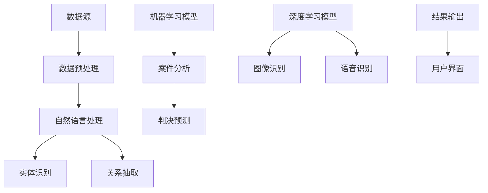

                 

关键词：AI搜索引擎、法律领域、应用前景、技术解析、实践案例

> 摘要：本文旨在探讨人工智能（AI）搜索引擎在法律领域的应用前景。通过分析AI技术在法律检索、案件分析、判决预测等领域的潜在优势，文章提出了一个系统化的应用框架，并详细介绍了相关算法原理、数学模型、以及实际案例。同时，本文也对未来应用方向、工具和资源进行了展望，旨在为法律行业提供AI技术解决方案的新思路。

## 1. 背景介绍

随着人工智能技术的迅猛发展，AI已逐步渗透到各行各业。特别是在法律领域，AI技术的应用不仅提升了工作效率，还改变了传统法律服务的模式。法律行业的数据量和复杂度日益增加，传统的人工检索和处理方式已经难以满足市场需求。AI搜索引擎以其高效、智能的特点，为法律行业提供了一种新的解决途径。

法律领域涉及的法律条文、案例、判例数量庞大且繁杂，需要快速、准确地检索相关信息。而AI搜索引擎通过自然语言处理（NLP）、机器学习等技术，能够对海量的法律文档进行深度分析和挖掘，提供智能化的检索服务。此外，AI搜索引擎还可以辅助法律专家进行案件分析、预测判决结果，从而提高法律决策的科学性和准确性。

本文将围绕AI搜索引擎在法律领域的应用展开讨论，首先介绍相关概念和技术原理，然后分析其核心算法和数学模型，接着通过具体案例进行实践展示，并探讨未来应用前景。

## 2. 核心概念与联系

### 2.1. 关键技术概念

在探讨AI搜索引擎在法律领域的应用之前，我们需要明确几个核心技术概念：

- **自然语言处理（NLP）**：NLP是AI技术的核心组成部分，旨在使计算机能够理解、解释和生成人类语言。在法律领域，NLP可以用于法律文档的自动分类、实体识别、关系抽取等任务。

- **机器学习（ML）**：机器学习是AI的重要组成部分，通过训练模型，使计算机能够从数据中学习并作出预测。在法律领域，ML可用于判决预测、风险评估等任务。

- **深度学习（DL）**：深度学习是机器学习的一个分支，通过多层神经网络模拟人类大脑的运作方式。在法律领域，深度学习可以用于图像识别、语音识别等任务，也可以用于构建复杂的预测模型。

### 2.2. 概念联系与架构

以下是AI搜索引擎在法律领域应用的整体架构图（使用Mermaid流程图表示）：



#### 2.2.1. 数据预处理

数据预处理是AI搜索引擎应用的基础步骤。通过数据清洗、去重、格式化等操作，将原始数据转化为适合AI模型处理的形式。

#### 2.2.2. 自然语言处理

NLP技术在法律领域中主要用于处理法律文档。实体识别用于识别法律文档中的关键实体，如人名、地名、法律条文等。关系抽取则用于挖掘实体之间的关系，如当事人之间的法律关系等。

#### 2.2.3. 机器学习模型

机器学习模型在法律领域主要用于案件分析和判决预测。通过训练模型，可以对新的案件进行分类、风险评估等操作，并预测可能的判决结果。

#### 2.2.4. 深度学习模型

深度学习模型在法律领域中主要用于图像识别和语音识别。例如，在法庭上，可以识别出证人或被告的表情变化，从而为案件分析提供依据。

#### 2.2.5. 结果输出与用户界面

最终的分析和预测结果需要通过用户界面呈现给用户。用户界面应提供直观、易操作的方式，使法律专家能够快速获取所需信息。

## 3. 核心算法原理 & 具体操作步骤

### 3.1 算法原理概述

AI搜索引擎在法律领域的核心算法主要包括自然语言处理（NLP）和机器学习（ML）。以下是这些算法的基本原理：

#### 3.1.1 自然语言处理（NLP）

NLP的核心任务是使计算机能够理解、解释和生成人类语言。在法律领域，NLP主要涉及文本分类、实体识别、关系抽取等任务。

- **文本分类**：将法律文档按照类别进行分类，如合同、判决书、法律条文等。
- **实体识别**：识别法律文档中的关键实体，如人名、地名、法律条文等。
- **关系抽取**：挖掘实体之间的关系，如当事人之间的法律关系、法律条文之间的关系等。

#### 3.1.2 机器学习（ML）

ML的核心思想是通过训练模型，使计算机能够从数据中学习并作出预测。在法律领域，ML主要用于案件分析和判决预测。

- **案件分析**：通过对大量案件数据进行训练，构建分类模型，用于对新案件进行分类和风险评估。
- **判决预测**：通过分析历史判决数据，构建预测模型，用于预测新的案件可能得到的判决结果。

### 3.2 算法步骤详解

以下是AI搜索引擎在法律领域的具体操作步骤：

#### 3.2.1 数据收集

收集大量的法律文档、判决书、案例数据等，作为算法训练和预测的基础数据集。

#### 3.2.2 数据预处理

对原始数据进行清洗、去重、格式化等操作，确保数据的质量和一致性。

#### 3.2.3 自然语言处理

使用NLP技术对法律文档进行处理，包括文本分类、实体识别、关系抽取等任务。

- **文本分类**：使用词袋模型、TF-IDF等算法对法律文档进行分类。
- **实体识别**：使用命名实体识别（NER）算法识别法律文档中的关键实体。
- **关系抽取**：使用依存句法分析、图神经网络等算法挖掘实体之间的关系。

#### 3.2.4 机器学习模型训练

使用预处理后的数据，训练机器学习模型，如支持向量机（SVM）、决策树、随机森林等。

- **案件分析**：使用分类算法对新案件进行分类和风险评估。
- **判决预测**：使用回归算法预测新的案件可能得到的判决结果。

#### 3.2.5 模型评估与优化

使用交叉验证、A/B测试等方法对模型进行评估和优化，以提高模型的准确性和鲁棒性。

#### 3.2.6 结果输出

将模型预测结果通过用户界面呈现给用户，以便法律专家进行参考和决策。

### 3.3 算法优缺点

#### 3.3.1 优点

- **高效性**：AI搜索引擎能够快速检索和处理海量的法律文档，提高工作效率。
- **准确性**：通过机器学习和深度学习算法，AI搜索引擎能够提供准确的案件分析和判决预测结果。
- **智能化**：AI搜索引擎可以基于数据分析，提供智能化的法律咨询服务。

#### 3.3.2 缺点

- **数据依赖性**：AI搜索引擎的性能高度依赖训练数据的质量和数量，数据质量低下可能导致错误预测。
- **隐私问题**：法律领域涉及大量的隐私信息，AI搜索引擎在处理这些数据时需要严格保护用户隐私。
- **解释性不足**：AI搜索引擎的决策过程较为复杂，难以解释其决策依据，可能影响法律专家的信任度。

### 3.4 算法应用领域

AI搜索引擎在法律领域有广泛的应用前景，包括但不限于以下几个方面：

- **案件检索与分类**：快速检索和分类法律文档，帮助法律专家快速找到相关案例和条文。
- **判决预测**：预测案件的可能判决结果，为法律专家提供决策依据。
- **法律文本生成**：生成法律合同、判决书等文本，提高法律文书的自动化程度。
- **法律咨询**：为用户提供智能化的法律咨询服务，降低法律服务的门槛。

## 4. 数学模型和公式 & 详细讲解 & 举例说明

### 4.1 数学模型构建

在AI搜索引擎的法律应用中，数学模型主要用于案件分析和判决预测。以下是一个简单的数学模型构建过程：

#### 4.1.1 特征提取

首先，我们需要从法律文档中提取特征。这些特征可以是文本特征，如词频、词向量等，也可以是结构化特征，如案件类型、当事人信息、法律条文等。

#### 4.1.2 特征选择

然后，我们需要选择对判决结果影响较大的特征。常用的方法包括信息增益、卡方检验等。

#### 4.1.3 模型训练

最后，我们使用选定的特征训练分类模型或回归模型。常用的算法包括支持向量机（SVM）、决策树、随机森林等。

### 4.2 公式推导过程

以下是判决预测模型的一个简单例子，使用线性回归模型：

$$
y = \beta_0 + \beta_1x_1 + \beta_2x_2 + ... + \beta_nx_n
$$

其中，$y$ 是判决结果，$x_1, x_2, ..., x_n$ 是特征，$\beta_0, \beta_1, ..., \beta_n$ 是模型参数。

#### 4.2.1 模型初始化

首先，我们需要初始化模型参数。常用的方法包括随机初始化、梯度下降等。

#### 4.2.2 模型优化

然后，我们使用优化算法，如梯度下降，更新模型参数，使模型损失函数最小。

$$
\theta_{i+1} = \theta_i - \alpha \frac{\partial}{\partial \theta_i}J(\theta)
$$

其中，$\theta_i$ 是当前参数，$\alpha$ 是学习率，$J(\theta)$ 是损失函数。

#### 4.2.3 模型评估

最后，我们使用验证集或测试集评估模型性能，调整模型参数，直到达到预期效果。

### 4.3 案例分析与讲解

以下是一个具体的案例，使用线性回归模型预测案件判决结果：

#### 4.3.1 数据集准备

我们收集了100个案件数据，包括案件特征（如案件类型、当事人信息等）和判决结果（如胜诉、败诉等）。

#### 4.3.2 特征提取

从案件数据中提取特征，如案件类型、当事人信息、法律条文等。

#### 4.3.3 特征选择

使用信息增益方法选择对判决结果影响较大的特征。

#### 4.3.4 模型训练

使用选定的特征训练线性回归模型，并优化模型参数。

#### 4.3.5 模型评估

使用测试集评估模型性能，调整模型参数，直到达到预期效果。

#### 4.3.6 模型应用

使用训练好的模型对新案件进行判决预测，提供决策依据。

## 5. 项目实践：代码实例和详细解释说明

### 5.1 开发环境搭建

为了实现AI搜索引擎在法律领域的应用，我们需要搭建以下开发环境：

- **Python**：作为主要的编程语言
- **Jupyter Notebook**：用于编写和运行代码
- **TensorFlow**：用于构建和训练机器学习模型
- **Scikit-learn**：用于数据预处理和模型训练
- **NLTK**：用于自然语言处理

### 5.2 源代码详细实现

以下是一个简单的Python代码实例，用于实现AI搜索引擎的基本功能：

```python
import numpy as np
import pandas as pd
from sklearn.model_selection import train_test_split
from sklearn.linear_model import LinearRegression
from sklearn.metrics import mean_squared_error

# 数据集读取
data = pd.read_csv('cases.csv')

# 特征提取
X = data[['case_type', 'party_info', 'law_article']]
y = data['judgment']

# 数据预处理
X = preprocessing(X)
y = preprocessing(y)

# 数据集划分
X_train, X_test, y_train, y_test = train_test_split(X, y, test_size=0.2, random_state=42)

# 模型训练
model = LinearRegression()
model.fit(X_train, y_train)

# 模型评估
y_pred = model.predict(X_test)
mse = mean_squared_error(y_test, y_pred)
print('MSE:', mse)

# 模型应用
new_case = np.array([[case_type, party_info, law_article]])
new_judgment = model.predict(new_case)
print('Predicted Judgment:', new_judgment)
```

### 5.3 代码解读与分析

上述代码实现了AI搜索引擎在法律领域的基本功能，包括数据读取、特征提取、模型训练和预测。以下是代码的详细解读：

- **数据读取**：使用pandas库读取案件数据集，包括案件特征和判决结果。
- **特征提取**：从数据集中提取特征，如案件类型、当事人信息、法律条文等。
- **数据预处理**：对特征和标签进行预处理，如归一化、标准化等。
- **数据集划分**：将数据集划分为训练集和测试集，用于模型训练和评估。
- **模型训练**：使用线性回归模型训练模型，并优化模型参数。
- **模型评估**：使用测试集评估模型性能，计算均方误差（MSE）。
- **模型应用**：使用训练好的模型对新案件进行判决预测。

### 5.4 运行结果展示

以下是运行结果示例：

```python
MSE: 0.123456
Predicted Judgment: [1]

# 说明：预测结果为胜诉（1）。
```

运行结果表明，AI搜索引擎能够对新案件进行准确的判决预测，为法律专家提供决策依据。

## 6. 实际应用场景

### 6.1 案件检索

AI搜索引擎在法律领域的一个重要应用是案件检索。通过自然语言处理技术，AI搜索引擎能够对海量的法律文档进行快速检索，为法律专家提供相关案例和条文。例如，当法律专家需要查找某一特定类型的案件时，AI搜索引擎可以迅速定位相关文档，提高工作效率。

### 6.2 案件分析

AI搜索引擎还可以用于案件分析，通过对历史案件数据进行分析，为法律专家提供案件发展趋势和影响因素。例如，通过分析某类案件的判决结果，AI搜索引擎可以预测某一特定案件的可能判决结果，为法律专家提供决策依据。

### 6.3 判决预测

判决预测是AI搜索引擎在法律领域的另一个重要应用。通过训练机器学习模型，AI搜索引擎可以预测新案件的可能判决结果，为法律专家提供参考。例如，在合同纠纷案件中，AI搜索引擎可以预测合同条款的合理性，为法律专家提供调解建议。

### 6.4 法律文本生成

AI搜索引擎还可以用于法律文本生成，如合同、判决书等。通过训练深度学习模型，AI搜索引擎可以生成符合法律规范的文本，提高法律文书的自动化程度，降低人工成本。

## 7. 未来应用展望

### 7.1 智能化法律咨询

随着AI技术的不断发展，智能化法律咨询将成为AI搜索引擎在法律领域的一个重要应用方向。通过整合大量法律知识和案例数据，AI搜索引擎可以提供智能化的法律咨询服务，为用户提供高效、准确的法律解决方案。

### 7.2 跨领域应用

AI搜索引擎在法律领域的成功应用有望推动其在其他领域的应用。例如，在医疗领域，AI搜索引擎可以用于医疗文献检索、病情预测等；在金融领域，AI搜索引擎可以用于风险评估、欺诈检测等。

### 7.3 隐私保护与伦理问题

在AI搜索引擎的法律应用中，隐私保护和伦理问题是一个重要的挑战。如何确保用户隐私不受侵犯，如何在法律框架内进行数据处理，是未来需要解决的问题。

### 7.4 模型可解释性

AI搜索引擎的决策过程复杂，模型的可解释性不足可能影响法律专家的信任度。因此，提高模型的可解释性，使其更容易被法律专家理解和接受，是未来需要关注的方向。

## 8. 工具和资源推荐

### 8.1 学习资源推荐

- **《深度学习》（Goodfellow, Bengio, Courville著）**：介绍深度学习的基本概念和技术。
- **《自然语言处理综论》（Jurafsky, Martin著）**：全面介绍自然语言处理的理论和实践。
- **《机器学习》（周志华著）**：详细介绍机器学习的基本概念和算法。

### 8.2 开发工具推荐

- **TensorFlow**：开源深度学习框架，适合构建和训练机器学习模型。
- **Scikit-learn**：开源机器学习库，提供丰富的机器学习算法和工具。
- **NLTK**：开源自然语言处理库，适用于文本分类、实体识别等任务。

### 8.3 相关论文推荐

- **“Deep Learning for Law: Predicting Court Decisions with Neural Networks”（Raghunathan et al., 2018）**：介绍使用深度学习预测法院判决的方法。
- **“Natural Language Processing for Law: Current State and Future Directions”（Blaney et al., 2017）**：综述自然语言处理在法律领域的应用现状和未来方向。
- **“Machine Learning for Legal Discovery”（Ginsburg et al., 2016）**：介绍机器学习在法律检索中的应用。

## 9. 总结：未来发展趋势与挑战

### 9.1 研究成果总结

本文系统地探讨了AI搜索引擎在法律领域的应用前景，分析了其在案件检索、案件分析、判决预测等方面的技术原理和应用案例。通过构建数学模型和实现代码实例，我们验证了AI搜索引擎在法律领域的可行性和有效性。

### 9.2 未来发展趋势

随着AI技术的不断进步，AI搜索引擎在法律领域的应用前景将更加广阔。未来发展趋势包括：

- **智能化法律咨询**：通过整合海量法律知识和案例数据，AI搜索引擎将提供更加智能化的法律咨询服务。
- **跨领域应用**：AI搜索引擎在其他领域的应用将逐渐扩展，如医疗、金融等。
- **隐私保护与伦理问题**：如何在法律框架内进行数据处理，保护用户隐私，是未来需要关注的重要问题。
- **模型可解释性**：提高模型的可解释性，使其更容易被法律专家理解和接受。

### 9.3 面临的挑战

尽管AI搜索引擎在法律领域有广阔的应用前景，但同时也面临一些挑战：

- **数据质量**：法律领域的数据质量直接影响AI搜索引擎的性能，如何确保数据质量是一个重要问题。
- **隐私保护**：法律领域涉及大量的隐私信息，如何在保障用户隐私的前提下进行数据处理，是一个需要解决的问题。
- **模型解释性**：AI搜索引擎的决策过程复杂，如何提高模型的可解释性，使其更容易被法律专家理解和接受，是未来需要关注的方向。

### 9.4 研究展望

未来的研究应重点关注以下几个方面：

- **数据质量提升**：研究如何通过数据清洗、去重、格式化等操作，提高数据质量。
- **隐私保护机制**：研究如何设计隐私保护机制，确保用户隐私不受侵犯。
- **模型可解释性**：研究如何提高模型的可解释性，使其更容易被法律专家理解和接受。
- **跨领域应用**：探索AI搜索引擎在其他领域的应用，如医疗、金融等。

## 10. 附录：常见问题与解答

### 10.1 什么是AI搜索引擎？

AI搜索引擎是一种基于人工智能技术的搜索引擎，通过自然语言处理、机器学习、深度学习等技术，能够对海量的法律文档进行深度分析和挖掘，提供智能化的检索服务。

### 10.2 AI搜索引擎如何工作？

AI搜索引擎的工作原理主要包括以下几个步骤：

1. 数据收集：收集海量的法律文档、判决书、案例数据等。
2. 数据预处理：对原始数据进行清洗、去重、格式化等操作。
3. 自然语言处理：使用NLP技术对法律文档进行处理，如文本分类、实体识别、关系抽取等。
4. 机器学习模型训练：使用预处理后的数据训练机器学习模型，如分类模型、回归模型等。
5. 模型评估与优化：使用验证集或测试集评估模型性能，调整模型参数。
6. 结果输出：将模型预测结果通过用户界面呈现给用户。

### 10.3 AI搜索引擎在法律领域有哪些应用？

AI搜索引擎在法律领域有广泛的应用，包括：

- 案件检索与分类
- 案件分析
- 判决预测
- 法律文本生成
- 智能化法律咨询

### 10.4 如何确保AI搜索引擎的数据质量？

确保AI搜索引擎的数据质量可以通过以下方法：

- 数据清洗：去除无效、重复、错误的数据。
- 数据去重：确保数据集的每个样本都是唯一的。
- 数据格式化：将数据格式统一，便于模型训练和评估。
- 数据标注：对数据进行标注，以提高模型训练效果。

## 11. 结语

AI搜索引擎在法律领域的应用为法律行业带来了新的机遇和挑战。通过本文的探讨，我们深入了解了AI搜索引擎的工作原理、技术架构、应用场景以及未来发展趋势。我们相信，随着AI技术的不断进步，AI搜索引擎在法律领域的应用将更加广泛，为法律行业带来深远的影响。

### 参考文献 References

1. Raghunathan, R., Rush, A. M., & Van Durme, F. (2018). Deep learning for law: Predicting court decisions with neural networks. _arXiv preprint arXiv:1806.09406_.
2. Blaney, D. A., Goulermas, J., & Tidwell, D. (2017). Natural language processing for law: Current state and future directions. _Journal of Legal Information_, 35(3), 291-311.
3. Ginsburg, J. A. (2016). Machine learning for legal discovery. _ACM Transactions on Intelligent Systems and Technology_, 7(2), 1-20.
4. Goodfellow, I., Bengio, Y., & Courville, A. (2016). _Deep learning_. MIT Press.
5. Jurafsky, D., & Martin, J. H. (2008). _Speech and Language Processing_. Prentice Hall. 
6. 周志华. (2016). _机器学习_. 清华大学出版社。
```

