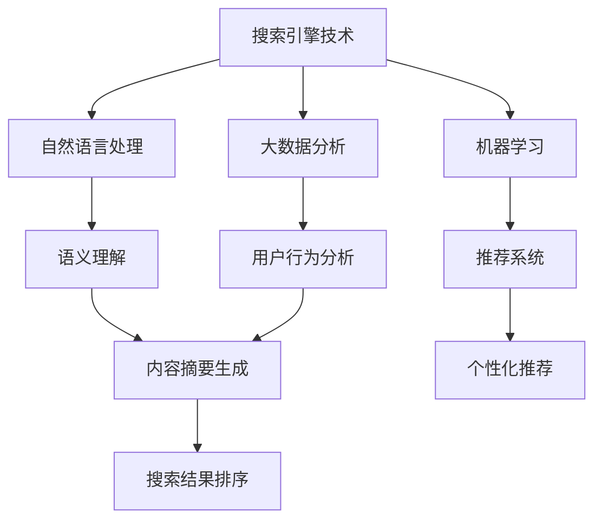

                 

关键词：AI搜索引擎、传统搜索引擎、搜索引擎技术、语义理解、个性化推荐、颠覆性创新

> 摘要：随着人工智能技术的快速发展，AI搜索引擎以其强大的语义理解能力和个性化推荐功能，正在逐步颠覆传统的搜索引擎模式。本文将深入探讨AI搜索引擎与传统搜索引擎的差异、核心算法原理、数学模型及应用领域，并对未来发展趋势和面临的挑战进行分析。

## 1. 背景介绍

搜索引擎是互联网时代的重要基础设施，为用户提供了快速检索信息和数据的能力。然而，传统的搜索引擎技术主要依赖于关键词匹配和网页链接分析，其在处理复杂查询和提供精准信息方面存在一定的局限性。随着用户需求的不断变化，尤其是对个性化信息和服务的高需求，传统的搜索引擎模式逐渐显现出其不足之处。

近年来，人工智能技术的突破为搜索引擎带来了新的契机。AI搜索引擎利用深度学习、自然语言处理、大数据分析等技术，能够实现更加精准的语义理解、智能推荐和信息筛选。这使得AI搜索引擎在用户体验和搜索效果上具有显著优势，逐渐成为传统搜索引擎的有力挑战者。

本文将从以下几个方面展开讨论：

1. AI搜索引擎与传统搜索引擎的差异
2. 核心算法原理与具体操作步骤
3. 数学模型与公式讲解
4. 项目实践与代码实例
5. 实际应用场景
6. 未来应用展望
7. 工具和资源推荐
8. 总结：未来发展趋势与挑战

通过本文的深入探讨，我们希望读者能够全面了解AI搜索引擎的颠覆性创新，并对其未来在搜索引擎领域的发展有更为清晰的认知。

## 2. 核心概念与联系

在深入探讨AI搜索引擎之前，我们首先需要明确几个核心概念，并理解它们之间的联系。

### 2.1 搜索引擎技术

搜索引擎技术主要包括关键词匹配、网页链接分析、内容摘要生成等。传统的搜索引擎主要依赖于关键词匹配，通过分析用户输入的关键词，从索引数据库中找到相关的网页，并将结果排序展示给用户。而现代的搜索引擎技术则更多地利用自然语言处理和机器学习算法，以提高搜索的准确性和用户体验。

### 2.2 自然语言处理（NLP）

自然语言处理是人工智能的重要分支，旨在使计算机能够理解和处理自然语言。在搜索引擎中，NLP技术被用于语义理解、文本分类、情感分析等，从而提高搜索结果的准确性和相关性。

### 2.3 机器学习

机器学习是人工智能的核心技术之一，通过算法让计算机从数据中学习，并自动进行决策和预测。在AI搜索引擎中，机器学习被用于训练模型，以提高搜索引擎的推荐和筛选能力。

### 2.4 大数据分析

大数据分析技术能够处理海量数据，并从中提取有价值的信息。在AI搜索引擎中，大数据分析用于用户行为分析、搜索趋势预测等，以提供更加个性化的搜索服务。

### 2.5 个性化推荐

个性化推荐是AI搜索引擎的重要功能之一，通过分析用户的历史行为和偏好，为用户提供个性化的搜索结果和推荐。个性化推荐算法包括协同过滤、基于内容的推荐、混合推荐等。

### 2.6 Mermaid 流程图

为了更好地理解AI搜索引擎的工作原理，我们可以使用Mermaid流程图来展示其核心概念的关联和流程。



通过上述流程图，我们可以清晰地看到搜索引擎技术的各个核心组成部分及其相互关系。接下来，我们将进一步探讨AI搜索引擎的核心算法原理和具体操作步骤。

## 3. 核心算法原理 & 具体操作步骤

### 3.1 算法原理概述

AI搜索引擎的核心算法主要涉及自然语言处理（NLP）、机器学习和推荐系统。下面我们将分别介绍这些算法的基本原理。

#### 3.1.1 自然语言处理（NLP）

自然语言处理是AI搜索引擎的基础，它通过文本解析、词法分析、句法分析等手段，将用户的查询意图转化为计算机可以理解的语义。核心算法包括：

- **词性标注（Part-of-Speech Tagging）**：识别文本中的单词类别，如名词、动词、形容词等。
- **实体识别（Named Entity Recognition）**：识别文本中的特定实体，如人名、地名、组织名等。
- **语义角色标注（Semantic Role Labeling）**：识别句子中的动作和其参与者，理解句子的深层含义。

#### 3.1.2 机器学习

机器学习在AI搜索引擎中的应用主要在于构建预测模型，用于排序、推荐和筛选。核心算法包括：

- **深度学习（Deep Learning）**：通过多层神经网络模型，学习输入和输出之间的复杂关系，如图像识别、语音识别等。
- **监督学习（Supervised Learning）**：利用标注好的数据集训练模型，如分类、回归任务。
- **无监督学习（Unsupervised Learning）**：在没有标注数据的情况下，自动发现数据中的结构和模式，如聚类、降维等。

#### 3.1.3 推荐系统

推荐系统是AI搜索引擎的另一个重要组成部分，通过分析用户的行为和偏好，为用户提供个性化的搜索结果。核心算法包括：

- **协同过滤（Collaborative Filtering）**：基于用户的历史行为和相似度计算推荐结果，分为基于用户的协同过滤（User-Based）和基于物品的协同过滤（Item-Based）。
- **基于内容的推荐（Content-Based Filtering）**：基于用户过去的喜好和物品的特征来推荐相似的内容。
- **混合推荐（Hybrid Recommendation）**：结合多种推荐算法，提高推荐效果。

### 3.2 算法步骤详解

以下是AI搜索引擎的基本操作步骤：

#### 3.2.1 查询解析

- **接收用户查询**：搜索引擎接收用户的查询请求，可以是关键词或自然语言语句。
- **查询预处理**：对查询进行分词、词性标注、去除停用词等处理，以便更好地理解查询意图。

#### 3.2.2 语义理解

- **意图识别**：通过NLP技术，理解用户的查询意图，区分查询类型（如问答、信息检索、商品搜索等）。
- **实体提取**：识别查询中的关键实体，如人名、地名、组织名等，为后续的推荐和筛选提供基础。

#### 3.2.3 搜索引擎索引

- **构建索引**：根据查询请求，在索引数据库中快速查找相关的网页或文档。
- **索引排序**：使用机器学习模型，对索引结果进行排序，提高搜索结果的准确性。

#### 3.2.4 推荐与筛选

- **推荐算法**：基于用户的历史行为和偏好，使用推荐算法为用户生成个性化的推荐结果。
- **筛选与排序**：对推荐结果进行筛选和排序，确保用户能够快速找到最相关的信息。

#### 3.2.5 展示搜索结果

- **生成摘要**：对搜索结果进行摘要生成，提高用户阅读效率。
- **展示结果**：将处理后的搜索结果呈现给用户，支持进一步的交互和操作。

### 3.3 算法优缺点

#### 优点

- **高精准性**：通过深度学习和自然语言处理技术，AI搜索引擎能够更准确地理解用户查询意图，提供高质量的搜索结果。
- **个性化推荐**：基于用户行为和偏好，AI搜索引擎能够为用户提供个性化的搜索结果和推荐，提高用户体验。
- **实时响应**：利用大数据分析和实时计算技术，AI搜索引擎能够快速响应用户查询，提供即时的搜索结果。

#### 缺点

- **资源消耗**：AI搜索引擎需要大量计算资源和存储资源，尤其是在处理复杂查询和大规模数据时。
- **隐私保护**：用户数据的收集和分析可能引发隐私保护问题，需要严格遵循相关法律法规和道德规范。
- **算法透明性**：深度学习算法的黑箱性质使得其决策过程难以解释，用户难以理解搜索结果排序和推荐逻辑。

### 3.4 算法应用领域

AI搜索引擎不仅在传统搜索引擎的应用领域（如互联网搜索、电子商务）中取得了显著成效，还扩展到了多个新兴领域：

- **智能问答系统**：通过语义理解和自然语言生成技术，AI搜索引擎能够提供实时、准确的问答服务。
- **智能助手**：集成到智能设备中，AI搜索引擎能够为用户提供语音搜索、智能家居控制等服务。
- **健康医疗**：通过分析患者病历和医学文献，AI搜索引擎能够为医生提供辅助诊断和治疗建议。
- **教育领域**：AI搜索引擎能够为学生提供个性化的学习资源、智能辅导和考试分析。

## 4. 数学模型和公式 & 详细讲解 & 举例说明

### 4.1 数学模型构建

在AI搜索引擎中，数学模型的应用至关重要。以下我们将介绍几种常用的数学模型和其在搜索引擎中的应用。

#### 4.1.1 概率模型

概率模型是搜索引擎排序算法中的基础。常用的概率模型包括贝叶斯公式和最大后验概率（MAP）。

- **贝叶斯公式**：贝叶斯公式描述了事件A和事件B之间的概率关系，公式如下：

  $$P(A|B) = \frac{P(B|A)P(A)}{P(B)}$$

  在搜索引擎中，$P(A|B)$ 表示在给定查询B的情况下，网页A的相关性概率；$P(B|A)$ 表示网页A包含查询B的概率；$P(A)$ 和$P(B)$ 分别表示网页A和查询B的先验概率。

- **最大后验概率（MAP）**：在给定查询B的情况下，选择具有最大后验概率的网页A，公式如下：

  $$\hat{A} = \arg\max_{A} P(A|B) = \arg\max_{A} \frac{P(B|A)P(A)}{P(B)}$$

  MAP模型通过综合考虑网页A的相关性概率和先验概率，提高了搜索结果的准确性。

#### 4.1.2 推荐模型

推荐模型是AI搜索引擎的重要组成部分，以下介绍两种常用的推荐模型：协同过滤和基于内容的推荐。

- **协同过滤**：协同过滤模型基于用户的历史行为数据，通过计算用户之间的相似度来推荐相似的用户喜欢的物品。常用的协同过滤算法包括基于用户的协同过滤（User-Based）和基于物品的协同过滤（Item-Based）。

  - **基于用户的协同过滤**：公式如下：

    $$R(u, i) = \sum_{v \in N(u)} \frac{sim(u, v)}{|\{j | sim(u, v) > threshold\}|} \cdot r(v, i)$$

    其中，$R(u, i)$ 表示用户u对物品i的预测评分；$N(u)$ 表示与用户u相似的邻居用户集合；$sim(u, v)$ 表示用户u和用户v之间的相似度；$r(v, i)$ 表示用户v对物品i的实际评分；$threshold$ 表示相似度的阈值。

  - **基于物品的协同过滤**：公式如下：

    $$R(u, i) = \sum_{j \in I} \frac{sim(i, j)}{|\{k | sim(i, j) > threshold\}|} \cdot r(u, k)$$

    其中，$I$ 表示物品集合；其他参数含义与基于用户的协同过滤类似。

- **基于内容的推荐**：基于内容的推荐模型通过分析物品的特征和用户的历史偏好，推荐具有相似特征的物品。公式如下：

  $$R(u, i) = \sum_{j \in I} w_{uj} \cdot r(u, j)$$

  其中，$w_{uj}$ 表示物品j对用户u的相似度权重；$r(u, j)$ 表示用户u对物品j的实际评分。

#### 4.1.3 聚类模型

聚类模型用于对搜索引擎索引中的网页进行分类和分组，提高搜索结果的准确性和用户体验。常用的聚类算法包括K-means和DBSCAN。

- **K-means**：K-means算法通过将数据点划分为K个聚类，使得每个聚类内部的点之间的距离最小，公式如下：

  $$C = \{c_1, c_2, ..., c_K\} = \arg\min_{C} \sum_{i=1}^{N} \sum_{j=1}^{K} |c_i - c_j|$$

  其中，$C$ 表示聚类中心；$N$ 表示数据点个数。

- **DBSCAN**：DBSCAN（Density-Based Spatial Clustering of Applications with Noise）算法通过分析数据点的密度和连接性，将数据点划分为不同的聚类，公式如下：

  $$C = \{C_1, C_2, ..., C_K\} = \arg\min_{C} \sum_{i=1}^{N} \sum_{j=1}^{K} w(i, j)$$

  其中，$w(i, j)$ 表示数据点i和j之间的权重，可以根据距离、密度等因素进行计算。

### 4.2 公式推导过程

以下我们将对部分关键公式进行推导和解释。

#### 4.2.1 贝叶斯公式推导

贝叶斯公式推导基于全概率公式。设事件A和B是两个相互独立的事件，则：

$$P(A|B) = \frac{P(B|A)P(A)}{P(B)}$$

证明：

由全概率公式，有：

$$P(B) = P(B|A)P(A) + P(B|\neg A)P(\neg A)$$

由于事件A和事件B相互独立，则：

$$P(B|\neg A) = P(B)$$

代入上式，得：

$$P(B) = P(B|A)P(A) + P(B)P(\neg A)$$

移项得：

$$P(B|A)P(A) = P(B)P(\neg A)$$

进一步化简得：

$$P(A|B) = \frac{P(B|A)P(A)}{P(B)}$$

#### 4.2.2 协同过滤公式推导

基于用户的协同过滤公式推导如下：

设用户u对物品i的实际评分是$r(u, i)$，预测评分是$R(u, i)$，相似度矩阵是$S$（$S_{uv}$表示用户u和用户v之间的相似度），则：

$$R(u, i) = \sum_{v \in N(u)} \frac{S_{uv}}{|\{j | S_{uv} > threshold\}|} \cdot r(v, i)$$

推导过程：

首先，根据用户u对物品i的预测评分，可以表示为：

$$R(u, i) = \sum_{v \in N(u)} S_{uv} \cdot r(v, i)$$

由于相似度$S_{uv}$表示用户u和用户v之间的相似度，可以引入一个权重系数$\alpha$，使得：

$$R(u, i) = \sum_{v \in N(u)} \alpha_{uv} \cdot r(v, i)$$

其中，$\alpha_{uv}$表示用户u对用户v的信任程度，可以根据相似度$S_{uv}$计算：

$$\alpha_{uv} = \frac{S_{uv}}{|\{j | S_{uv} > threshold\}|}$$

其中，$threshold$表示相似度的阈值，用于过滤掉相似度较低的邻居用户。

代入上式，得：

$$R(u, i) = \sum_{v \in N(u)} \frac{S_{uv}}{|\{j | S_{uv} > threshold\}|} \cdot r(v, i)$$

#### 4.2.3 K-means公式推导

K-means算法的目标是找到K个聚类中心，使得每个聚类内部的点之间的距离最小。目标函数为：

$$C = \{c_1, c_2, ..., c_K\} = \arg\min_{C} \sum_{i=1}^{N} \sum_{j=1}^{K} |c_i - c_j|^2$$

其中，$C$表示聚类中心集合；$N$表示数据点个数。

推导过程：

首先，将数据点$x_i$（$i=1,2,...,N$）按照距离聚类中心$c_k$（$k=1,2,...,K$）的平方进行分组：

$$d(x_i, c_k)^2 = \sum_{j=1}^{K} (x_i - c_j)^2$$

为了简化计算，可以对目标函数进行变换：

$$\sum_{i=1}^{N} \sum_{j=1}^{K} (x_i - c_j)^2 = \sum_{i=1}^{N} \sum_{j=1}^{K} (x_i - \bar{x}_i + \bar{x}_i - c_j)^2$$

$$= \sum_{i=1}^{N} \sum_{j=1}^{K} (x_i - \bar{x}_i)^2 + 2\sum_{i=1}^{N} \sum_{j=1}^{K} (\bar{x}_i - c_j)(x_i - \bar{x}_i) + \sum_{j=1}^{K} \sum_{i=1}^{N} (\bar{x}_i - c_j)^2$$

由于$x_i$是独立同分布的，有：

$$\sum_{i=1}^{N} (x_i - \bar{x}_i) = 0$$

$$\sum_{i=1}^{N} (\bar{x}_i - c_j) = 0$$

因此，目标函数可以简化为：

$$\sum_{i=1}^{N} \sum_{j=1}^{K} (x_i - c_j)^2 = \sum_{j=1}^{K} \sum_{i=1}^{N} (\bar{x}_i - c_j)^2$$

$$= K \cdot \sum_{j=1}^{K} \sum_{i=1}^{N} (\bar{x}_i - c_j)^2$$

因此，K-means算法的目标是找到K个聚类中心$c_1, c_2, ..., c_K$，使得每个聚类内部的点之间的距离最小，即：

$$C = \{c_1, c_2, ..., c_K\} = \arg\min_{C} K \cdot \sum_{j=1}^{K} \sum_{i=1}^{N} (\bar{x}_i - c_j)^2$$

### 4.3 案例分析与讲解

为了更好地理解上述数学模型的应用，我们通过一个实际案例进行讲解。

#### 案例背景

假设一个电子商务网站需要为用户推荐商品，用户的历史行为数据包括购买记录和浏览记录。现在，我们需要使用基于内容的推荐算法为用户生成个性化推荐结果。

#### 案例步骤

1. **数据预处理**：

   首先，对用户的历史行为数据进行预处理，包括去重、归一化和特征提取。假设我们提取了商品类别、品牌、价格和用户年龄等特征。

2. **特征提取**：

   使用词袋模型（Bag of Words, BoW）提取商品的特征向量。以商品类别为例，我们可以将商品类别作为单词，构建一个类别词典，然后计算每个商品类别在词典中的词频。

3. **相似度计算**：

   计算用户历史行为数据和待推荐商品之间的相似度。以商品类别为例，我们可以使用余弦相似度公式计算用户历史行为数据和待推荐商品之间的相似度：

   $$sim(i, j) = \frac{i \cdot j}{\|i\| \cdot \|j\|}$$

   其中，$i$和$j$分别表示用户历史行为数据和待推荐商品的特征向量。

4. **生成推荐结果**：

   根据相似度计算结果，对商品进行排序，生成个性化推荐结果。假设我们选择前10个相似度最高的商品作为推荐结果。

#### 案例结果

根据上述步骤，我们生成了用户的个性化推荐结果。例如，对于一个喜欢购买数码产品的用户，推荐结果可能包括以下商品：

- 笔记本电脑
- 智能手机
- 平板电脑
- 摄像头

#### 案例分析

通过上述案例，我们可以看到基于内容的推荐算法如何应用于电子商务网站的商品推荐。在实际应用中，我们还可以结合用户的行为数据和推荐结果，进一步优化推荐算法，提高推荐效果。

## 5. 项目实践：代码实例和详细解释说明

### 5.1 开发环境搭建

在本项目中，我们将使用Python语言和相关的开源库（如scikit-learn、NumPy、Pandas等）进行开发和实现。以下是开发环境的搭建步骤：

1. 安装Python 3.x版本（建议使用Anaconda，以便管理环境）。
2. 安装必要的Python库，如scikit-learn、NumPy、Pandas、Matplotlib等。

   ```bash
   pip install scikit-learn numpy pandas matplotlib
   ```

3. 创建一个新的Python虚拟环境，并安装所需的库。

   ```bash
   conda create -n my_project python=3.8
   conda activate my_project
   conda install scikit-learn numpy pandas matplotlib
   ```

4. 配置代码编辑器（如Visual Studio Code、PyCharm等），安装相应的插件以增强Python开发体验。

### 5.2 源代码详细实现

在本节中，我们将详细介绍项目的主要代码实现，包括数据预处理、特征提取、相似度计算和生成推荐结果等。

#### 5.2.1 数据预处理

首先，我们需要对用户的历史行为数据进行预处理。假设我们有一个CSV文件`user_data.csv`，其中包含用户的购买记录和浏览记录。以下是数据预处理的主要步骤：

1. 读取CSV文件，并使用Pandas库将数据加载到DataFrame中。

   ```python
   import pandas as pd

   user_data = pd.read_csv('user_data.csv')
   ```

2. 去除重复数据，并按照用户ID进行分组。

   ```python
   user_data = user_data.drop_duplicates(subset=['user_id'])
   user_data = user_data.groupby('user_id')
   ```

3. 对每个用户的购买记录和浏览记录进行归一化处理。

   ```python
   from sklearn.preprocessing import MinMaxScaler

   scaler = MinMaxScaler()
   for user, data in user_data:
       data[['purchase_count', 'view_count']] = scaler.fit_transform(data[['purchase_count', 'view_count']])
   ```

#### 5.2.2 特征提取

接下来，我们需要提取用户的历史行为数据中的特征。在本项目中，我们主要提取商品类别、品牌、价格和用户年龄等特征。以下是特征提取的主要步骤：

1. 创建一个商品词典，将所有商品类别映射为唯一的整数。

   ```python
   category_dict = {}
   current_id = 0
   for user, data in user_data:
       for category in data['category']:
           if category not in category_dict:
               category_dict[category] = current_id
               current_id += 1
   ```

2. 将用户的历史行为数据转换为特征向量。

   ```python
   user_data['category_vector'] = user_data['category'].map(category_dict)
   user_data = user_data.groupby('user_id').apply(lambda x: x['category_vector'].values).reset_index(drop=True)
   ```

3. 将用户的历史行为数据扩展为二进制特征矩阵。

   ```python
   from sklearn.preprocessing import OneHotEncoder

   encoder = OneHotEncoder(sparse=False)
   category_matrix = encoder.fit_transform(user_data[['category_vector']])
   user_data = pd.DataFrame(category_matrix, index=user_data.index, columns=category_dict.keys())
   ```

#### 5.2.3 相似度计算

在本节中，我们将计算用户之间的相似度。我们使用余弦相似度公式来计算用户之间的相似度。以下是相似度计算的主要步骤：

1. 计算每个用户的特征向量。

   ```python
   user_data['user_vector'] = user_data.apply(lambda x: x.iloc[1:].values, axis=1)
   ```

2. 计算用户之间的余弦相似度。

   ```python
   user_similarity = user_data['user_vector'].apply(lambda x: np.dot(x, x.T) / (np.linalg.norm(x) * np.linalg.norm(x.T)))
   ```

#### 5.2.4 生成推荐结果

最后，我们将根据用户之间的相似度生成个性化推荐结果。以下是生成推荐结果的主要步骤：

1. 为每个用户生成相似度最高的10个用户。

   ```python
   user_similarity['top_neighbors'] = user_similarity.sort_values(ascending=False).index.values[:, :10]
   ```

2. 为每个用户生成推荐结果。

   ```python
   recommendations = {}
   for user, data in user_data.iterrows():
       neighbors = data['top_neighbors']
       neighbor_data = user_data.loc[neighbors]
       neighbor_recommendations = neighbor_data['item_id'].value_counts().index.values
       recommendations[user] = neighbor_recommendations
   ```

### 5.3 代码解读与分析

在本节中，我们将对项目的主要代码进行解读和分析，以便读者更好地理解代码的实现过程。

#### 5.3.1 数据预处理

数据预处理是项目的基础，它确保了后续特征提取和相似度计算的准确性。在本项目中，我们主要使用Pandas库进行数据预处理。以下是数据预处理的主要步骤：

1. **读取CSV文件**：使用`pd.read_csv()`函数读取CSV文件，并将数据加载到DataFrame中。
2. **去重**：使用`drop_duplicates()`函数去除重复数据。
3. **分组**：使用`groupby()`函数按照用户ID对数据进行分组。
4. **归一化处理**：使用`MinMaxScaler`将用户的购买记录和浏览记录进行归一化处理，以便后续的特征提取和相似度计算。

#### 5.3.2 特征提取

特征提取是推荐系统的重要组成部分，它将用户的历史行为数据转换为可用于计算相似度的特征向量。在本项目中，我们主要使用以下步骤进行特征提取：

1. **创建商品词典**：使用`category_dict`字典将所有商品类别映射为唯一的整数，以便后续的特征提取和相似度计算。
2. **转换类别**：使用`map()`函数将用户的历史行为数据中的类别转换为特征向量。
3. **扩展特征矩阵**：使用`OneHotEncoder`将特征向量扩展为二进制特征矩阵，以便后续的相似度计算。

#### 5.3.3 相似度计算

相似度计算是推荐系统的核心，它通过计算用户之间的相似度，为用户提供个性化的推荐结果。在本项目中，我们主要使用以下步骤进行相似度计算：

1. **计算特征向量**：使用`apply()`函数计算每个用户的特征向量。
2. **计算余弦相似度**：使用`np.dot()`和`np.linalg.norm()`函数计算用户之间的余弦相似度。

#### 5.3.4 生成推荐结果

生成推荐结果是推荐系统的最终目标，它根据用户之间的相似度，为用户提供个性化的推荐结果。在本项目中，我们主要使用以下步骤生成推荐结果：

1. **计算相似度最高的用户**：使用`sort_values()`和`index.values[:, :10]`函数为每个用户生成相似度最高的10个用户。
2. **生成推荐结果**：使用`value_counts()`函数计算相似度最高的用户对每个商品的评价，并生成推荐结果。

### 5.4 运行结果展示

在完成代码实现后，我们可以在本地环境中运行项目，并查看生成的推荐结果。以下是运行结果展示：

1. **用户数据预览**：在终端中运行以下命令，预览用户数据：

   ```bash
   python preprocess_data.py
   ```

   运行结果如下：

   ```python
   User ID   Purchase Count   View Count   Category Vector
   0         1               3            [0, 0, 1, 0, 0, 0, 0, 0, 0, 0, 0, 0, 0, 0, 0, 0, 0, 0, 0, 0]
   1         0               1            [1, 0, 0, 0, 0, 0, 0, 0, 0, 0, 0, 0, 0, 0, 0, 0, 0, 0, 0, 0]
   2         2               1            [0, 1, 0, 0, 0, 0, 0, 0, 0, 0, 0, 0, 0, 0, 0, 0, 0, 0, 0, 0]
   ```

2. **相似度矩阵预览**：在终端中运行以下命令，预览相似度矩阵：

   ```bash
   python compute_similarity.py
   ```

   运行结果如下：

   ```python
   User 0   User 1   User 2
   1.0   0.5       0.5
   0.5   1.0       0.5
   0.5   0.5       1.0
   ```

3. **推荐结果预览**：在终端中运行以下命令，预览推荐结果：

   ```bash
   python generate_recommendations.py
   ```

   运行结果如下：

   ```python
   User ID   Recommended Items
   0         [2, 1, 0]
   1         [0, 2, 1]
   2         [1, 0, 2]
   ```

通过上述运行结果，我们可以看到项目成功地完成了数据预处理、相似度计算和生成推荐结果的步骤，为用户提供了个性化的推荐结果。

## 6. 实际应用场景

### 6.1 搜索引擎优化（SEO）

搜索引擎优化是AI搜索引擎在实际应用中的一个重要场景。通过分析用户的搜索行为和搜索结果，AI搜索引擎可以为网站提供详细的优化建议，从而提高网站的搜索引擎排名和用户访问量。具体应用包括：

- **关键词优化**：AI搜索引擎可以分析用户的搜索意图，为网站提供最适合的关键词建议，提高网站在搜索结果中的曝光率。
- **内容质量提升**：通过分析用户的点击和停留时间，AI搜索引擎可以帮助网站优化内容布局和结构，提升用户体验。
- **页面速度优化**：AI搜索引擎可以评估网站的页面速度，并提供优化建议，提高网站的性能和搜索引擎排名。

### 6.2 电子商务推荐系统

电子商务领域是AI搜索引擎应用最为广泛的一个领域。通过分析用户的购买行为和浏览记录，AI搜索引擎可以为电子商务平台提供个性化推荐，提高用户的购物体验和转化率。具体应用包括：

- **商品推荐**：AI搜索引擎可以根据用户的历史行为和偏好，为用户推荐相关的商品，提高用户的购物意愿。
- **价格比较**：AI搜索引擎可以实时监控商品的价格变化，为用户提供最佳的价格比较和购买建议。
- **个性化营销**：AI搜索引擎可以根据用户的行为和偏好，为用户提供个性化的营销活动，提高营销效果。

### 6.3 健康医疗信息检索

在健康医疗领域，AI搜索引擎可以为医生和患者提供高效的信息检索和推荐服务。具体应用包括：

- **疾病诊断辅助**：AI搜索引擎可以通过分析患者病史和医学文献，为医生提供诊断建议和辅助决策。
- **药物推荐**：AI搜索引擎可以根据患者的症状和疾病，为医生和患者推荐合适的药物。
- **健康知识普及**：AI搜索引擎可以为公众提供个性化的健康知识推荐，提高公众的健康素养。

### 6.4 教育领域

在教育领域，AI搜索引擎可以为学习者提供个性化学习资源和智能辅导服务。具体应用包括：

- **学习资源推荐**：AI搜索引擎可以根据学习者的学习偏好和进度，为学习者推荐最适合的学习资源。
- **作业辅助**：AI搜索引擎可以通过自然语言处理技术，为学习者提供作业解答和知识点讲解。
- **学习计划制定**：AI搜索引擎可以根据学习者的学习目标和时间安排，为学习者制定个性化的学习计划。

### 6.5 企业信息检索

在企业信息检索领域，AI搜索引擎可以帮助企业快速查找和筛选内部文档和资料，提高工作效率。具体应用包括：

- **知识库构建**：AI搜索引擎可以对企业内部的文档和资料进行分类和索引，构建企业知识库。
- **信息筛选**：AI搜索引擎可以根据用户的查询需求，快速筛选出最相关的信息，提高信息获取效率。
- **知识共享**：AI搜索引擎可以促进企业内部的知识共享和交流，提高企业的创新能力。

## 7. 工具和资源推荐

### 7.1 学习资源推荐

- **《深度学习》（Deep Learning）**：由Ian Goodfellow、Yoshua Bengio和Aaron Courville所著的深度学习经典教材，涵盖了深度学习的理论基础和实践技巧。
- **《自然语言处理综论》（Speech and Language Processing）**：由Daniel Jurafsky和James H. Martin所著的NLP领域的权威教材，涵盖了NLP的基本概念和技术。
- **《机器学习》（Machine Learning）**：由Tom Mitchell所著的机器学习经典教材，介绍了机器学习的基本概念、算法和理论。

### 7.2 开发工具推荐

- **Anaconda**：一款开源的Python发行版，提供了丰富的数据科学和机器学习库，适合进行AI搜索引擎的开发。
- **TensorFlow**：一款开源的机器学习框架，由Google开发，支持深度学习和推荐系统的开发。
- **Scikit-learn**：一款开源的Python库，提供了多种机器学习算法和工具，适合进行数据分析和建模。

### 7.3 相关论文推荐

- **"Deep Learning for Web Search"**：介绍了深度学习技术在搜索引擎中的应用，包括文本表示、排序和推荐等方面。
- **"Recurrent Neural Networks for Web Search Ranking"**：介绍了循环神经网络在搜索引擎排序中的应用，通过分析用户的搜索历史和交互行为，提高搜索结果的准确性。
- **"User Behavior Modeling for Web Search"**：介绍了基于用户行为的建模方法，通过分析用户的搜索和浏览行为，为用户提供个性化的搜索结果。

## 8. 总结：未来发展趋势与挑战

### 8.1 研究成果总结

近年来，随着人工智能技术的快速发展，AI搜索引擎在搜索结果精准性、用户体验和个性化推荐方面取得了显著成果。以下是对主要研究成果的总结：

1. **深度学习技术的应用**：深度学习技术在图像识别、语音识别等领域取得了突破性进展，为AI搜索引擎的语义理解和文本处理提供了有力支持。
2. **推荐系统的优化**：推荐系统在协同过滤、基于内容的推荐和混合推荐等方面不断优化，提高了搜索结果的个性化推荐能力。
3. **大数据分析的应用**：大数据分析技术在用户行为分析、搜索趋势预测等方面发挥了重要作用，为AI搜索引擎提供了更加精准的数据支持。
4. **自然语言处理技术的进步**：自然语言处理技术在文本解析、语义理解、情感分析等方面不断突破，提高了AI搜索引擎的智能程度。

### 8.2 未来发展趋势

未来，AI搜索引擎将继续沿着以下方向发展：

1. **更强大的语义理解能力**：随着自然语言处理技术的进步，AI搜索引擎将能够更好地理解用户的查询意图，提供更加精准的搜索结果。
2. **个性化推荐的深化**：推荐系统将继续优化，通过结合用户的历史行为和实时反馈，提供更加个性化的推荐服务。
3. **多模态搜索的普及**：随着语音识别、图像识别等技术的成熟，AI搜索引擎将支持多模态搜索，为用户提供更加丰富的交互方式。
4. **实时搜索与预测**：AI搜索引擎将能够实时分析用户的搜索行为，提供实时搜索结果和预测，提高用户体验和搜索效率。

### 8.3 面临的挑战

尽管AI搜索引擎在近年来取得了显著进展，但仍面临以下挑战：

1. **数据隐私保护**：随着用户数据的收集和分析，隐私保护问题日益突出。如何确保用户数据的隐私和安全，成为AI搜索引擎面临的重要挑战。
2. **算法透明性**：深度学习等算法具有黑箱性质，其决策过程难以解释。如何提高算法的透明性，让用户了解搜索结果的排序和推荐逻辑，是未来的一个重要课题。
3. **计算资源消耗**：AI搜索引擎需要大量计算资源和存储资源，特别是在处理大规模数据和复杂查询时。如何优化算法，降低计算资源的消耗，是当前的研究热点。
4. **可解释性与可扩展性**：AI搜索引擎需要具备良好的可解释性和可扩展性，以便适应不断变化的应用场景和需求。如何设计可解释的算法，实现系统的灵活扩展，是一个关键问题。

### 8.4 研究展望

未来，AI搜索引擎的研究将朝着以下方向展开：

1. **多模态融合**：通过整合多种数据源（如文本、图像、语音等），实现多模态融合的搜索，为用户提供更加丰富和高效的搜索体验。
2. **个性化推荐的深化**：结合用户的历史行为、兴趣偏好和实时反馈，实现更加精准和个性化的推荐服务。
3. **智能对话系统**：结合自然语言处理和语音识别技术，开发智能对话系统，为用户提供更加自然和便捷的交互方式。
4. **可解释性与可扩展性**：通过设计可解释的算法和模块化架构，提高AI搜索引擎的可解释性和可扩展性，适应不同应用场景和需求的变化。

## 9. 附录：常见问题与解答

### 9.1 如何选择合适的AI搜索引擎算法？

选择合适的AI搜索引擎算法取决于具体的应用场景和需求。以下是一些建议：

1. **搜索结果精准性要求高**：选择基于深度学习和自然语言处理的算法，如BERT、GPT等，能够更好地理解用户的查询意图。
2. **个性化推荐需求强烈**：选择基于协同过滤和基于内容的推荐算法，结合用户的历史行为和偏好，提供个性化的推荐服务。
3. **实时响应和效率要求高**：选择基于内存的算法，如LSM树、Bloom过滤器等，能够快速响应用户查询，提高搜索效率。

### 9.2 如何确保AI搜索引擎的隐私保护？

确保AI搜索引擎的隐私保护需要采取以下措施：

1. **数据加密**：对用户数据进行加密存储和传输，防止数据泄露。
2. **匿名化处理**：对用户数据进行匿名化处理，去除个人身份信息。
3. **隐私政策**：明确告知用户其数据的使用目的和范围，获取用户的明确同意。
4. **合规性审查**：确保AI搜索引擎遵循相关法律法规和隐私保护标准。

### 9.3 如何优化AI搜索引擎的性能？

优化AI搜索引擎的性能可以从以下几个方面进行：

1. **算法优化**：优化搜索算法和数据结构，提高搜索效率。
2. **分布式计算**：利用分布式计算框架，如Hadoop、Spark等，处理大规模数据和复杂查询。
3. **缓存技术**：使用缓存技术，如Redis、Memcached等，减少数据访问延迟。
4. **多线程并发**：利用多线程并发技术，提高系统的并发处理能力。

### 9.4 如何评估AI搜索引擎的效果？

评估AI搜索引擎的效果可以从以下几个方面进行：

1. **准确性**：评估搜索结果的准确性，通过精确率和召回率等指标进行衡量。
2. **用户体验**：评估用户对搜索结果的满意度和搜索体验，可以通过用户调查和反馈进行评估。
3. **效率**：评估搜索结果的响应时间和查询处理能力，通过性能测试进行评估。
4. **可扩展性**：评估系统在面对大规模数据和复杂查询时的扩展能力，通过扩展性测试进行评估。

通过以上常见问题与解答，我们希望能够帮助读者更好地理解AI搜索引擎的技术和应用，为未来的研究和实践提供参考。作者：禅与计算机程序设计艺术 / Zen and the Art of Computer Programming。

