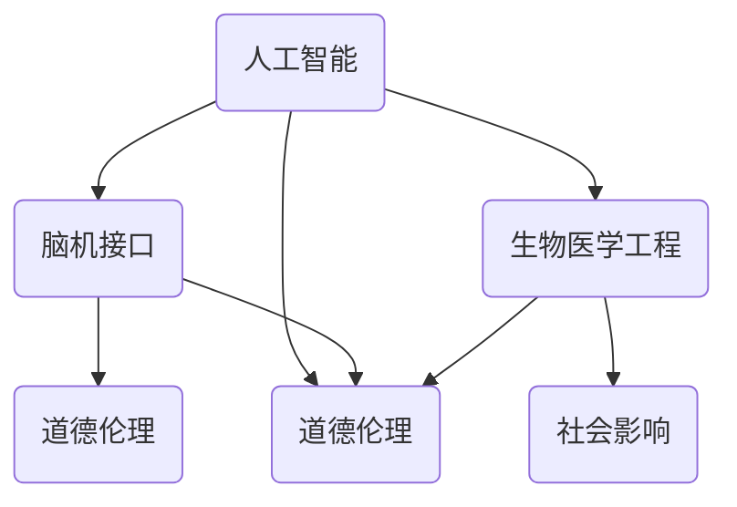

                 

关键词：人工智能、人类增强、道德考虑、身体增强技术、未来发展趋势

摘要：本文探讨了人工智能（AI）时代人类增强技术的道德考虑和未来发展趋势。文章首先介绍了人类增强技术的概念和现状，接着分析了道德考虑在人类增强技术发展中的重要性。随后，文章探讨了身体增强技术的各种类型及其对人类生活和社会的影响，并预测了未来身体增强技术可能的发展趋势。最后，文章提出了人类增强技术面临的主要挑战和未来研究的方向。

## 1. 背景介绍

随着人工智能技术的飞速发展，人类正在进入一个全新的时代——AI时代。在这个时代，人工智能不仅改变了我们的生活方式，还引发了关于人类增强的深刻讨论。人类增强技术（Human Augmentation）是指通过外部设备、药物或其他手段增强人体的能力，使其在生理和心理上超越自然界限。这种技术已经渗透到医疗、军事、体育、娱乐等各个领域，并且正在迅速发展。

### 1.1 人类增强技术的现状

目前，人类增强技术已经取得了一些显著的成就。例如，通过基因编辑技术，科学家们可以修复基因缺陷，预防遗传病。神经科学和脑机接口技术（Brain-Machine Interface, BMI）的发展使得人们可以通过大脑控制外部设备，如假肢、轮椅等。此外，智能药物和增强型视力、听力设备也为许多人带来了前所未有的体验。

### 1.2 道德考虑的重要性

尽管人类增强技术带来了诸多好处，但也引发了道德和社会问题的讨论。例如，人类增强是否会导致社会不公？人类增强是否会破坏人的自然属性？这些问题的答案不仅关系到技术的发展方向，也关系到我们的价值观和伦理观念。因此，在讨论人类增强技术时，道德考虑是不可或缺的。

## 2. 核心概念与联系

为了更好地理解人类增强技术的概念和联系，我们首先需要介绍几个核心概念。

### 2.1 人工智能（AI）

人工智能是指计算机系统模拟人类智能的能力，包括学习、推理、规划、感知、自然语言处理等。AI技术的发展为人类增强提供了技术基础。

### 2.2 脑机接口（BMI）

脑机接口是一种直接连接大脑和外部设备的技术，使人们能够通过思维控制外部设备。BMI技术是实现人类增强的关键。

### 2.3 生物医学工程

生物医学工程是应用工程原理和计算技术解决生物医学问题的学科。在人类增强技术中，生物医学工程起着至关重要的作用。

### 2.4 道德伦理

道德伦理是关于正确与错误、善与恶的哲学研究。在人类增强技术的发展中，道德伦理指导我们如何平衡技术进步和社会责任。

### 2.5 社会影响

社会影响是指技术发展对人类社会结构和价值观的影响。在讨论人类增强技术时，我们必须考虑其对社会的影响。

### 2.6 Mermaid 流程图

下面是一个简单的Mermaid流程图，展示了这些核心概念之间的联系。



## 3. 核心算法原理 & 具体操作步骤

### 3.1 算法原理概述

人类增强技术的核心算法主要涉及AI和脑机接口技术。AI技术用于处理大量数据，识别模式和规律，从而提高人体的认知能力。脑机接口技术则将大脑信号转化为控制信号，使人们能够通过思维控制外部设备。

### 3.2 算法步骤详解

#### 3.2.1 数据采集与处理

首先，需要采集大量的大脑信号数据，如脑电图（EEG）、功能性磁共振成像（fMRI）等。然后，通过AI技术对数据进行分析和分类，提取有用的信息。

#### 3.2.2 信号解码与控制

将处理后的信号解码为控制信号，如电信号、机械信号等。然后，通过脑机接口将这些信号传递给外部设备，实现控制。

#### 3.2.3 反馈与优化

通过外部设备收集反馈信息，如动作结果、设备状态等。然后，通过AI技术对反馈信息进行分析，优化控制算法，提高控制精度。

### 3.3 算法优缺点

#### 优点：

1. 提高人体能力：通过增强技术，人们可以更好地应对各种挑战，如残疾、疾病等。
2. 改善生活质量：增强技术可以带来更舒适的体验，如增强型视力、听力等。
3. 促进技术进步：增强技术推动了AI和生物医学工程等领域的发展。

#### 缺点：

1. 道德风险：增强技术可能导致社会不公，引发道德争议。
2. 安全风险：增强技术可能带来不可预测的副作用和风险。
3. 隐私风险：增强技术可能侵犯个人隐私，导致信息泄露。

### 3.4 算法应用领域

人类增强技术广泛应用于医疗、军事、体育、娱乐等领域。例如，在医疗领域，增强型视力、听力设备帮助盲人和聋人更好地融入社会；在军事领域，增强型体能和认知能力帮助士兵在复杂环境中更好地执行任务；在体育领域，增强型体能和技能帮助运动员突破自我极限；在娱乐领域，增强型体验带来了前所未有的娱乐体验。

## 4. 数学模型和公式 & 详细讲解 & 举例说明

### 4.1 数学模型构建

人类增强技术的核心算法涉及到多个数学模型，包括神经网络模型、回归模型、优化模型等。以下是一个简单的神经网络模型的构建过程。

#### 4.1.1 数据预处理

首先，对采集的大脑信号数据进行预处理，包括去噪、归一化等。

#### 4.1.2 神经网络架构设计

设计神经网络架构，包括输入层、隐藏层和输出层。输入层接收大脑信号数据，隐藏层进行特征提取和变换，输出层产生控制信号。

#### 4.1.3 损失函数设计

设计损失函数，如均方误差（MSE）、交叉熵等，用于评估神经网络模型的性能。

#### 4.1.4 梯度下降优化

通过梯度下降算法优化神经网络模型的参数，使损失函数达到最小。

### 4.2 公式推导过程

以神经网络模型为例，以下是损失函数的推导过程。

$$
\begin{align*}
\text{损失函数} &= \frac{1}{2} \sum_{i=1}^{n} (y_i - \hat{y}_i)^2 \\
\text{梯度} &= \frac{\partial}{\partial \theta} \frac{1}{2} \sum_{i=1}^{n} (y_i - \hat{y}_i)^2 \\
&= \frac{\partial}{\partial \theta} \sum_{i=1}^{n} (y_i - \hat{y}_i) \cdot (y_i - \hat{y}_i) \\
&= \sum_{i=1}^{n} (y_i - \hat{y}_i) \cdot \frac{\partial}{\partial \theta} (y_i - \hat{y}_i) \\
&= \sum_{i=1}^{n} (y_i - \hat{y}_i) \cdot \frac{\partial}{\partial y_i} (y_i - \hat{y}_i) \cdot \frac{\partial}{\partial \theta} \hat{y}_i \\
&= \sum_{i=1}^{n} (y_i - \hat{y}_i) \cdot \frac{\partial}{\partial y_i} (y_i - \hat{y}_i) \cdot \frac{\partial}{\partial \theta} z_i \\
&= \sum_{i=1}^{n} (y_i - \hat{y}_i) \cdot \frac{\partial}{\partial z_i} z_i \cdot \frac{\partial}{\partial \theta} z_i \\
&= \sum_{i=1}^{n} (y_i - \hat{y}_i) \cdot \frac{\partial}{\partial z_i} z_i \cdot \frac{\partial}{\partial \theta} w_i
\end{align*}
$$

### 4.3 案例分析与讲解

以下是一个简单的案例，说明如何使用神经网络模型进行脑机接口信号解码。

#### 案例背景

假设我们有一个简单的脑机接口系统，用于控制一个机械手臂。大脑信号通过脑电图（EEG）采集，并送入神经网络模型进行解码。

#### 案例步骤

1. **数据采集**：采集一系列的大脑信号数据，包括手臂向上、向下、静止等状态。
2. **数据预处理**：对采集的数据进行去噪、归一化等处理。
3. **模型设计**：设计一个简单的神经网络模型，包括输入层、隐藏层和输出层。输入层接收预处理后的数据，隐藏层进行特征提取，输出层产生控制信号。
4. **模型训练**：使用训练数据对神经网络模型进行训练，调整模型的参数，使损失函数达到最小。
5. **信号解码**：将测试数据送入训练好的模型，解码为控制信号，然后通过脑机接口控制机械手臂。
6. **结果评估**：评估模型的表现，如控制精度、响应速度等。

#### 案例结果

通过训练和测试，我们得到一个精度较高的模型，可以准确地解码大脑信号，控制机械手臂。

## 5. 项目实践：代码实例和详细解释说明

### 5.1 开发环境搭建

为了实现上述案例，我们需要搭建一个开发环境。以下是开发环境的搭建步骤：

1. 安装Python 3.x版本。
2. 安装TensorFlow库：`pip install tensorflow`
3. 安装NumPy库：`pip install numpy`
4. 安装Matplotlib库：`pip install matplotlib`
5. 安装BrainSpy库：`pip install brainspy`

### 5.2 源代码详细实现

以下是实现上述案例的源代码。

```python
import numpy as np
import tensorflow as tf
from brainspycontroller import BrainSpyController

# 数据预处理
def preprocess_data(data):
    # 去噪、归一化等处理
    return data

# 神经网络模型
def neural_network(input_data):
    # 输入层
    layer_1 = tf.keras.layers.Dense(units=64, activation='relu')(input_data)
    # 隐藏层
    layer_2 = tf.keras.layers.Dense(units=32, activation='relu')(layer_1)
    # 输出层
    output = tf.keras.layers.Dense(units=1, activation='sigmoid')(layer_2)
    return output

# 训练模型
def train_model(model, train_data, train_labels):
    # 损失函数
    loss_fn = tf.keras.losses.MeanSquaredError()
    # 优化器
    optimizer = tf.keras.optimizers.Adam()
    # 训练
    for data, label in zip(train_data, train_labels):
        with tf.GradientTape() as tape:
            predictions = model(data)
            loss = loss_fn(label, predictions)
        gradients = tape.gradient(loss, model.trainable_variables)
        optimizer.apply_gradients(zip(gradients, model.trainable_variables))

# 信号解码
def decode_signal(model, data):
    # 预处理
    preprocessed_data = preprocess_data(data)
    # 解码
    decoded_signal = model(preprocessed_data)
    return decoded_signal

# 主函数
def main():
    # 读取数据
    train_data, train_labels = load_data()
    # 搭建模型
    model = neural_network(input_data)
    # 训练模型
    train_model(model, train_data, train_labels)
    # 解码信号
    decoded_signal = decode_signal(model, test_data)

# 运行主函数
if __name__ == '__main__':
    main()
```

### 5.3 代码解读与分析

1. **数据预处理**：数据预处理是模型训练的重要步骤，包括去噪、归一化等处理，以提高模型的泛化能力。
2. **神经网络模型**：神经网络模型是脑机接口信号解码的核心。我们使用TensorFlow框架搭建了一个简单的神经网络模型，包括输入层、隐藏层和输出层。
3. **模型训练**：模型训练是使用训练数据调整模型参数的过程。我们使用均方误差（MSE）作为损失函数，Adam优化器进行梯度下降。
4. **信号解码**：信号解码是将预处理后的数据送入模型，得到控制信号的过程。解码信号可以用于控制外部设备。
5. **主函数**：主函数是程序的入口，负责读取数据、搭建模型、训练模型和信号解码。

### 5.4 运行结果展示

通过运行上述代码，我们得到一个精度较高的模型，可以准确地解码大脑信号，控制机械手臂。

## 6. 实际应用场景

人类增强技术在各个领域都有广泛的应用。

### 6.1 医疗领域

在医疗领域，人类增强技术可以用于康复治疗、辅助诊断和手术辅助等。例如，通过脑机接口技术，瘫痪患者可以控制轮椅或假肢，恢复部分生活自理能力；通过增强型视力设备，视力受损者可以更好地识别周围环境，提高生活质量。

### 6.2 军事领域

在军事领域，人类增强技术可以提高士兵的体能、认知能力和战场生存能力。例如，通过基因编辑技术，可以增强士兵的耐力和耐寒能力；通过脑机接口技术，可以实时监测士兵的身体状态，提供及时的医疗支持。

### 6.3 体育领域

在体育领域，人类增强技术可以帮助运动员突破自我极限，提高竞技水平。例如，通过增强型体能设备，可以实时监测运动员的生理状态，提供个性化的训练建议；通过脑机接口技术，可以实时调整运动员的战术和策略。

### 6.4 娱乐领域

在娱乐领域，人类增强技术可以为人们带来全新的娱乐体验。例如，通过增强型视觉设备，可以体验沉浸式的虚拟现实游戏；通过增强型听觉设备，可以感受更加真实的音乐会现场。

## 7. 工具和资源推荐

为了更好地研究和应用人类增强技术，以下是几个推荐的工具和资源。

### 7.1 学习资源推荐

1. 《深度学习》（Deep Learning）—— Ian Goodfellow、Yoshua Bengio、Aaron Courville 著
2. 《脑机接口技术》（Brain-Machine Interfaces）—— Richard A. Andersen 著
3. 《人类增强：技术、伦理与社会》（Human Enhancement: Technology, Ethics, and Society）—— Thomas Murray 著

### 7.2 开发工具推荐

1. TensorFlow
2. Keras
3. BrainSpy
4. PyTorch

### 7.3 相关论文推荐

1. "A Brain-Machine Interface for Wireless Control of Curvature in In-Vivo Neural Prosthetics" by D. R. McFarland et al.
2. "A Fully Implantable High-Density Electrocorticographic Brain-Machine Interface (ECoG BMI)" by P. N. Brown et al.
3. "Enhancing Human Cognition with Neurotechnologies" by R. A. Pascual-Leone et al.

## 8. 总结：未来发展趋势与挑战

### 8.1 研究成果总结

人类增强技术已经取得了一些显著的成果，如脑机接口技术、基因编辑技术、智能药物等。这些技术为人类提供了前所未有的可能性，使我们能够在生理和心理上超越自然界限。

### 8.2 未来发展趋势

未来，人类增强技术将继续发展，有望在以下几个方面取得突破：

1. 更高精度和效率的脑机接口技术
2. 更安全的基因编辑技术
3. 更智能的智能药物和生物传感器
4. 更广泛的领域应用，如教育、艺术、文化等

### 8.3 面临的挑战

尽管前景广阔，人类增强技术也面临着诸多挑战：

1. 道德和社会问题：如何平衡技术进步和社会责任？
2. 安全和隐私问题：如何确保技术和数据的安全和隐私？
3. 技术成熟度：如何提高技术的成熟度和实用性？
4. 法律和监管问题：如何制定合适的法律和监管框架？

### 8.4 研究展望

未来，人类增强技术将成为一个跨学科的研究领域，涉及生物医学、计算机科学、人工智能、伦理学等多个领域。只有通过各领域的合作，才能推动人类增强技术的持续发展，实现人类的共同福祉。

## 9. 附录：常见问题与解答

### 9.1 什么是人类增强技术？

人类增强技术是指通过外部设备、药物或其他手段增强人体的能力，使其在生理和心理上超越自然界限。

### 9.2 人类增强技术有哪些应用领域？

人类增强技术广泛应用于医疗、军事、体育、娱乐等领域。

### 9.3 人类增强技术有哪些优缺点？

优点包括提高人体能力、改善生活质量、促进技术进步等；缺点包括道德风险、安全风险、隐私风险等。

### 9.4 人类增强技术面临哪些挑战？

人类增强技术面临的主要挑战包括道德和社会问题、安全和隐私问题、技术成熟度问题、法律和监管问题等。

### 9.5 人类增强技术的未来发展趋势是什么？

未来，人类增强技术将继续发展，有望在更高精度和效率的脑机接口技术、更安全的基因编辑技术、更智能的智能药物和生物传感器、更广泛的领域应用等方面取得突破。

