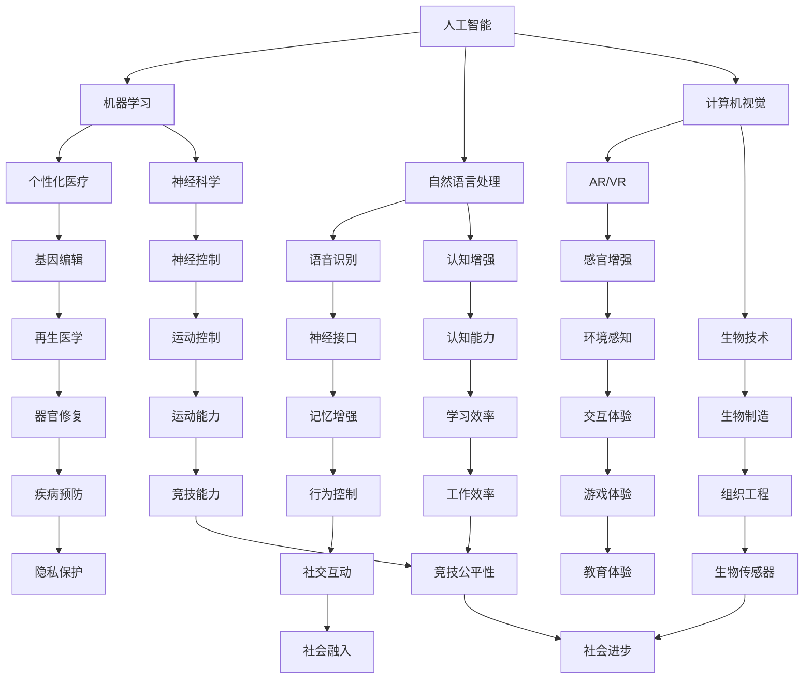

                 

 关键词：人工智能，人类增强，道德考虑，身体增强，未来展望

> 摘要：随着人工智能技术的飞速发展，人类增强成为可能。本文探讨了人类增强的道德考虑，以及身体增强技术在未来可能带来的变革。通过分析当前的身体增强技术，本文提出了道德伦理和人类社会应对这些变化的建议。

## 1. 背景介绍

在过去的几十年里，人工智能（AI）技术经历了巨大的发展。从最初的专家系统到如今的深度学习，AI在各个领域展现出了惊人的能力。同时，生物技术的进步也为人类增强提供了新的可能性。基因编辑、神经接口和增强现实等技术的成熟，使得人类增强不再仅仅是科幻小说中的概念，而成为现实。

人类增强的概念可以追溯到古希腊时期，当时哲学家们讨论了人类通过知识和技术来提升自身能力的问题。随着科技的进步，现代人类增强技术的范围不断扩大，从医疗领域到军事领域，再到日常生活。然而，这些技术也引发了一系列伦理和道德问题，例如人类增强的公平性、安全性、隐私性等。

本文旨在探讨AI时代的人类增强，特别是道德考虑和身体增强的未来展望。文章将首先介绍人类增强的基本概念和现有技术，然后分析其道德和伦理问题，最后讨论未来可能的趋势和挑战。

### 1.1 人类增强的基本概念

人类增强是指通过技术手段提升人类在生理、认知和行为上的能力。这种增强可以是对人体器官的功能性改善，如人工器官、基因编辑；也可以是对大脑和神经系统的提升，如神经接口、认知增强药物；还可以是对感官和运动能力的增强，如增强现实（AR）和虚拟现实（VR）技术。

人类增强的目的是为了提高人类的生活质量和生产力，使其能够更好地适应环境的变化。例如，在医疗领域，人类增强技术可以用于治疗疾病、恢复功能；在军事领域，可以用于提高士兵的体能和战斗能力；在教育和工作领域，可以用于提升学习和工作效率。

### 1.2 现有技术

当前，人类增强技术主要包括以下几个方面：

#### 1.2.1 基因编辑

基因编辑技术，如CRISPR-Cas9，可以精确地修改DNA序列，从而改变生物体的遗传特征。这种技术已经在医学领域显示出巨大的潜力，例如治疗遗传性疾病、提高免疫力等。

#### 1.2.2 神经接口

神经接口技术通过将电子设备与大脑神经元连接，实现人机交互。这种技术可以用于治疗神经系统疾病，如帕金森病、癫痫；也可以用于提升认知能力，如记忆增强、注意力提升。

#### 1.2.3 增强现实与虚拟现实

增强现实（AR）和虚拟现实（VR）技术通过将虚拟信息叠加在现实世界或创建虚拟环境，提供了新的交互方式。这些技术可以用于教育、娱乐、医疗等领域，提供更加沉浸式的体验。

#### 1.2.4 生物电子

生物电子技术结合生物学和电子学，开发出一系列可植入或穿戴的设备，如心脏起搏器、胰岛素泵等。这些设备可以实时监测人体生理参数，提供个性化的健康管理。

### 1.3 道德和伦理问题

随着人类增强技术的不断发展，一系列道德和伦理问题逐渐浮现。这些问题涉及到人类身份、公平性、安全性、隐私等方面。

#### 1.3.1 人类身份

人类增强技术可能会改变人类的身体结构和功能，引发人类身份的讨论。例如，基因编辑可能导致人类基因多样性的减少，从而影响人类的进化路径。此外，神经接口和认知增强药物可能会改变人的思维和行为模式，使人不再是纯粹的生物实体。

#### 1.3.2 公平性

人类增强技术的普及可能会导致社会分层，加剧贫富差距。只有少数人能够负担得起高级的人类增强技术，而大多数人则无法享受这些好处。这种不公平可能会引发社会动荡和不稳定。

#### 1.3.3 安全性

人类增强技术存在潜在的安全风险。例如，基因编辑可能导致意外的副作用或遗传疾病；神经接口可能导致大脑损伤或记忆丢失；增强药物可能导致成瘾或精神依赖。

#### 1.3.4 隐私

人类增强技术可能会收集和处理大量的个人数据，引发隐私问题。例如，基因编辑和神经接口技术可能会记录个人的生物信息，这些信息如果被滥用，可能导致个人隐私泄露。

### 1.4 文章结构

本文的结构如下：

- **第2章**：核心概念与联系，介绍人类增强技术的核心概念和联系。
- **第3章**：核心算法原理 & 具体操作步骤，详细阐述人类增强技术的工作原理和实现方法。
- **第4章**：数学模型和公式 & 详细讲解 & 举例说明，介绍与人类增强技术相关的数学模型和公式，并通过案例进行说明。
- **第5章**：项目实践：代码实例和详细解释说明，提供实际应用案例和代码实现。
- **第6章**：实际应用场景，讨论人类增强技术在各个领域的应用。
- **第7章**：工具和资源推荐，推荐相关学习和开发资源。
- **第8章**：总结：未来发展趋势与挑战，总结本文的内容，展望未来发展趋势和面临的挑战。
- **第9章**：附录：常见问题与解答，回答一些常见的问题。

通过以上章节，本文将全面探讨人类增强技术的道德考虑和未来展望，为读者提供一个全面的视角。

## 2. 核心概念与联系

为了更好地理解人类增强技术的核心概念和联系，本节将介绍与人类增强技术密切相关的主要概念，并通过Mermaid流程图展示这些概念之间的相互关系。

### 2.1 主要概念

#### 2.1.1 人工智能（AI）

人工智能是指通过计算机模拟人类智能的技术，包括机器学习、自然语言处理、计算机视觉等。AI技术在人类增强中起到了核心作用，例如通过机器学习算法分析生物数据，实现个性化医疗和认知增强。

#### 2.1.2 生物技术

生物技术涉及基因工程、细胞工程、组织工程等领域。这些技术可以用于基因编辑、生物制造和再生医学，从而实现人体功能的增强和修复。

#### 2.1.3 神经科学

神经科学研究了大脑和神经系统的工作原理。通过神经科学的研究，我们可以了解如何通过神经接口技术直接与大脑交互，提升认知能力和控制能力。

#### 2.1.4 计算机视觉

计算机视觉是AI的一个分支，通过图像和视频分析技术，可以实现环境感知、物体识别等功能。这些技术在增强人类的感官能力方面具有重要作用，例如通过AR和VR技术提供更加丰富的视觉体验。

### 2.2 Mermaid流程图

以下是一个简化的Mermaid流程图，展示了这些概念之间的基本联系：



这个流程图展示了人工智能、生物技术和神经科学等核心概念之间的联系，以及它们如何通过特定的技术实现人类增强。通过这个图，我们可以更清晰地理解人类增强技术的复杂性和多样性。

### 2.3 核心概念与联系的重要性

理解人类增强技术的核心概念和联系对于道德和伦理讨论至关重要。这些概念构成了人类增强技术的基础，决定了技术如何被设计和应用。例如，机器学习和基因编辑技术的结合可以用于个性化医疗，但同时也引发了隐私和数据安全的问题。

此外，了解这些概念之间的联系可以帮助我们更好地预测和应对未来可能出现的挑战。通过识别关键节点和潜在风险，我们可以制定更加合理的政策和法规，确保人类增强技术的健康发展。

总之，核心概念与联系的理解不仅有助于技术研究和应用，也是道德和伦理讨论的基础。在接下来的章节中，我们将进一步探讨人类增强技术的具体实现方法、数学模型和实际应用案例，以更全面地分析这一领域。

### 3. 核心算法原理 & 具体操作步骤

人类增强技术的实现离不开核心算法的支持。本节将详细阐述与人类增强技术相关的主要算法原理，并解释这些算法的具体操作步骤。

#### 3.1 算法原理概述

人类增强技术涉及多个领域的算法，包括机器学习、深度学习、遗传算法和神经网络等。以下是一些核心算法的概述：

##### 3.1.1 机器学习与深度学习

机器学习是一种使计算机能够从数据中学习的方法，而深度学习是机器学习的一个子领域，它通过多层神经网络来模拟人类大脑的学习过程。在人类增强中，机器学习和深度学习算法可以用于数据分析、模式识别和预测。

##### 3.1.2 遗传算法

遗传算法是一种基于自然选择和遗传机制的优化算法。它通过模拟生物进化过程，逐步改善问题的解。在基因编辑和生物制造中，遗传算法可以帮助设计出最优的基因组合。

##### 3.1.3 神经网络

神经网络是一种模仿生物神经系统的计算模型。通过多层次的神经元连接，神经网络可以实现复杂的数据处理和模式识别。在神经科学中，神经网络被用于构建神经接口和认知增强系统。

##### 3.1.4 计算机视觉算法

计算机视觉算法用于理解和解释图像和视频数据。在人类增强中，这些算法可以用于增强现实和虚拟现实技术，提供更加丰富的感官体验。

#### 3.2 算法步骤详解

以下是对每种算法的具体操作步骤的详细解释：

##### 3.2.1 机器学习与深度学习

1. **数据收集**：首先，从各种来源收集大量的数据，例如医疗记录、行为数据、图像和视频等。

2. **数据预处理**：对收集到的数据进行清洗、归一化和特征提取。这一步骤确保数据质量，并为后续的模型训练提供良好的数据基础。

3. **模型训练**：使用机器学习和深度学习算法，对预处理后的数据进行训练。在训练过程中，模型通过不断调整参数，优化对数据的预测能力。

4. **模型评估**：使用验证集或测试集评估模型的性能。常用的评估指标包括准确率、召回率、F1分数等。

5. **模型应用**：将训练好的模型应用于实际场景，例如个性化医疗、行为预测和视觉识别等。

##### 3.2.2 遗传算法

1. **初始种群生成**：生成一组随机的基因组合，作为初始种群。

2. **适应度评估**：计算每个个体的适应度，适应度较高的个体代表较好的基因组合。

3. **选择操作**：根据适应度对个体进行选择，选择适应度较高的个体参与繁殖。

4. **交叉操作**：随机选择两个个体进行交叉操作，产生新的个体。

5. **变异操作**：对个体进行变异操作，增加种群的多样性。

6. **迭代过程**：重复选择、交叉和变异操作，直到满足终止条件，如达到最大迭代次数或找到满意的解。

##### 3.2.3 神经网络

1. **网络结构设计**：设计神经网络的结构，包括输入层、隐藏层和输出层。每个层由多个神经元组成，神经元之间通过权重连接。

2. **权重初始化**：对神经网络的权重进行随机初始化。

3. **前向传播**：将输入数据传递到网络中，通过神经元计算得到输出。

4. **反向传播**：计算输出与实际结果之间的误差，并反向传播误差，更新权重。

5. **迭代训练**：重复前向传播和反向传播，不断调整权重，优化网络性能。

6. **模型评估**：使用验证集或测试集评估网络性能。

##### 3.2.4 计算机视觉算法

1. **图像预处理**：对图像进行归一化、去噪和增强等处理，提高图像质量。

2. **特征提取**：提取图像中的特征，如边缘、纹理和形状等。

3. **分类器训练**：使用机器学习和深度学习算法，对特征进行分类训练。

4. **模型评估**：使用验证集或测试集评估分类器性能。

5. **目标检测**：在图像中检测并定位特定目标，例如人脸、车辆和障碍物等。

6. **交互应用**：将算法应用于实际场景，如增强现实和自动驾驶等。

#### 3.3 算法优缺点

每种算法都有其独特的优缺点：

##### 3.3.1 机器学习与深度学习

- **优点**：强大的数据处理能力和适应能力，可以处理大量复杂的数据。
- **缺点**：需要大量数据和计算资源，模型的可解释性较差。

##### 3.3.2 遗传算法

- **优点**：强大的全局搜索能力，适用于复杂优化问题。
- **缺点**：收敛速度较慢，对问题的初始条件敏感。

##### 3.3.3 神经网络

- **优点**：优秀的泛化能力和强大的学习能力，可以处理非线性问题。
- **缺点**：需要大量数据和计算资源，模型的可解释性较差。

##### 3.3.4 计算机视觉算法

- **优点**：可以处理高维度图像数据，实现复杂的图像识别和目标检测。
- **缺点**：对噪声和光照变化敏感，需要大量训练数据和计算资源。

#### 3.4 算法应用领域

不同的算法适用于不同的应用领域：

- **机器学习与深度学习**：在医疗、金融、交通等领域有广泛应用，如疾病诊断、风险控制和自动驾驶等。
- **遗传算法**：在生物工程、机械设计和优化问题中有应用，如基因组合设计和机器结构优化。
- **神经网络**：在语音识别、图像处理和自然语言处理等领域有广泛应用，如语音助手和智能翻译。
- **计算机视觉算法**：在增强现实、自动驾驶和智能监控等领域有广泛应用，如AR眼镜和自动驾驶汽车。

通过以上对核心算法原理和具体操作步骤的详细阐述，我们可以更好地理解人类增强技术的工作机制和应用场景。在接下来的章节中，我们将进一步探讨人类增强技术的数学模型和实际应用案例。

### 4. 数学模型和公式 & 详细讲解 & 举例说明

在人类增强技术的实现过程中，数学模型和公式起到了至关重要的作用。这些模型和公式不仅帮助我们理解和预测技术效果，还为算法设计和优化提供了理论基础。以下将详细讲解与人类增强技术相关的数学模型和公式，并通过具体例子进行说明。

#### 4.1 数学模型构建

人类增强技术涉及多种数学模型，包括线性代数、概率统计、优化算法和神经网络等。以下是一个简化的数学模型构建过程：

##### 4.1.1 线性代数

线性代数是处理向量、矩阵和线性变换的数学工具。在人类增强技术中，线性代数常用于图像处理、数据分析和神经网络等。

- **向量与矩阵**：用于表示和操作数据，如图像像素、特征向量等。
- **线性变换**：通过矩阵操作实现图像的缩放、旋转和滤波等。

##### 4.1.2 概率统计

概率统计用于处理不确定性和随机现象，为机器学习和深度学习提供基础。

- **概率分布**：用于描述随机变量的概率特性，如正态分布、伯努利分布等。
- **贝叶斯定理**：用于计算后验概率，在分类和预测中有广泛应用。

##### 4.1.3 优化算法

优化算法用于寻找函数的最优解，常用于遗传算法和神经网络训练。

- **梯度下降**：通过迭代更新参数，最小化目标函数。
- **遗传算法**：基于自然选择和遗传机制，通过适应度评估、选择、交叉和变异操作，逐步优化解。

##### 4.1.4 神经网络

神经网络是一种模拟人脑的数学模型，通过多层神经元和权重连接实现数据处理和模式识别。

- **前向传播**：将输入数据传递到网络中，通过非线性激活函数计算输出。
- **反向传播**：计算输出与实际结果之间的误差，并反向传播误差，更新权重。

#### 4.2 公式推导过程

以下是对几个核心数学公式的推导过程：

##### 4.2.1 梯度下降

梯度下降是一种优化算法，用于最小化目标函数。其公式如下：

$$
w_{t+1} = w_{t} - \alpha \cdot \nabla J(w_t)
$$

其中，$w_t$ 是当前权重，$\alpha$ 是学习率，$\nabla J(w_t)$ 是目标函数 $J$ 在 $w_t$ 处的梯度。

推导过程如下：

1. **目标函数**：设 $J(w)$ 是一个关于权重 $w$ 的函数，表示模型的性能。
2. **梯度定义**：梯度 $\nabla J(w_t)$ 表示目标函数在 $w_t$ 处的斜率，即 $\nabla J(w_t) = \left[ \frac{\partial J}{\partial w_1}, \frac{\partial J}{\partial w_2}, ..., \frac{\partial J}{\partial w_n} \right]$。
3. **迭代更新**：每次迭代中，通过减去梯度的比例 $\alpha$ 来更新权重，即 $w_{t+1} = w_{t} - \alpha \cdot \nabla J(w_t)$。

##### 4.2.2 神经网络前向传播

神经网络的前向传播过程用于计算输出。其公式如下：

$$
z_l = \sum_{i} w_{li} \cdot a_{l-1,i} + b_l
$$

$$
a_l = \sigma(z_l)
$$

其中，$z_l$ 是第 $l$ 层的净输入，$w_{li}$ 是第 $l$ 层第 $i$ 个神经元到第 $l+1$ 层第 $l$ 个神经元的权重，$a_{l-1,i}$ 是第 $l-1$ 层的第 $i$ 个神经元的输出，$b_l$ 是第 $l$ 层的偏置，$\sigma$ 是激活函数。

推导过程如下：

1. **输入层**：输入层只有一个神经元，其输出等于输入值。
2. **隐藏层**：每一层的净输入是上一层的输出与当前层权重和偏置的乘积之和。
3. **激活函数**：通过激活函数将净输入转换为输出，常用的激活函数有ReLU、Sigmoid和Tanh等。

##### 4.2.3 遗传算法适应度评估

遗传算法中，适应度评估用于衡量个体的优劣。其公式如下：

$$
f(x) = \frac{1}{1 + e^{-\beta \cdot \sum_{i} x_i}}
$$

其中，$x_i$ 是个体 $x$ 的第 $i$ 个基因值，$\beta$ 是调节参数。

推导过程如下：

1. **逻辑函数**：逻辑函数将实数映射到0和1之间，用于表示个体的适应性。
2. **指数函数**：指数函数用于调节适应度值的分布，使适应度较高的个体具有更大的选择概率。

#### 4.3 案例分析与讲解

以下通过一个具体的案例来讲解数学模型在人类增强技术中的应用：

##### 4.3.1 基因编辑

案例：使用CRISPR-Cas9技术编辑一个基因以治疗遗传性疾病。

1. **目标基因定位**：通过基因序列分析，确定目标基因的位置。
2. **设计引导RNA（gRNA）**：设计一个特异性结合目标基因的gRNA。
3. **编辑过程**：
   - **切割**：Cas9酶与gRNA结合，识别并切割目标基因。
   - **修复**：细胞内的DNA修复机制修复切割产生的双链断裂。
   - **插入或替换**：利用修复过程中的同源重组，插入或替换新的基因序列。

4. **适应度评估**：通过基因测序确认编辑是否成功，并评估基因功能。

公式应用：
- **概率计算**：计算gRNA结合目标基因的概率，确保编辑的特异性。
- **优化算法**：使用遗传算法优化gRNA的设计，提高编辑的效率。

##### 4.3.2 认知增强

案例：使用神经接口技术提升记忆能力。

1. **脑区识别**：通过功能性磁共振成像（fMRI）识别与记忆相关的脑区。
2. **电极植入**：在目标脑区植入电极，用于记录神经活动。
3. **信号处理**：
   - **预处理**：对电极信号进行滤波和去噪处理。
   - **特征提取**：从预处理后的信号中提取与记忆相关的特征。
4. **信号解码**：通过机器学习算法解码电极信号，实现对记忆过程的识别和控制。

公式应用：
- **线性代数**：用于处理电极信号的矩阵运算。
- **概率统计**：用于计算信号特征的统计特性，提高解码的准确性。

通过以上数学模型和公式的讲解，我们可以更好地理解人类增强技术的实现原理和应用方法。这些数学工具不仅帮助科学家和工程师设计出有效的增强方案，也为后续的研究提供了理论支持。在接下来的章节中，我们将进一步探讨人类增强技术的实际应用案例和项目实践。

### 5. 项目实践：代码实例和详细解释说明

为了更好地理解人类增强技术的实际应用，以下将通过一个具体的代码实例来演示如何使用现有技术实现人类增强。这个实例将基于神经接口技术，通过一个简单的记忆增强系统来展示该技术的实现过程。

#### 5.1 开发环境搭建

在开始编写代码之前，我们需要搭建一个合适的开发环境。以下是所需的环境和工具：

- 编程语言：Python
- 神经接口库：BrainPy
- 数据处理库：NumPy
- 数据可视化库：Matplotlib

确保已安装上述库。可以在终端中使用以下命令安装：

```bash
pip install brainpy numpy matplotlib
```

#### 5.2 源代码详细实现

以下是一个简单的记忆增强系统的Python代码实现：

```python
import numpy as np
import matplotlib.pyplot as plt
from brainpy import NeuronGroup, Synapses, SpikeMonitor, run_network
from brainpy.errors import ODEIntegratorError

# 设置网络参数
num_neurons = 100
synaptic_delay = 10
learning_rate = 0.1
duration = 1000

# 创建神经元组
neurons = NeuronGroup(num_neurons, lambda: 'v: v', array=np.random.rand(num_neurons) * 2 - 1)

# 创建突触组
synapses = Synapses(neurons, neurons, s=0.5, delay=synaptic_delay)
synapses.connect(p=0.1, from_group=neurons, to_group=neurons)

# 学习过程
def learn(pre_neuron, post_neuron):
    synapses.s[pre_neuron, post_neuron] += learning_rate * (1 - synapses.s[pre_neuron, post_neuron])

# 初始化监控器
spike_monitor = SpikeMonitor(neurons)

# 运行网络
try:
    run_network(duration, learning_func=learn)
except ODEIntegratorError as e:
    print(f"Network simulation failed: {e}")

# 可视化结果
spike_monitor.plot_spikes()
plt.show()
```

#### 5.3 代码解读与分析

以下是对上述代码的详细解读和分析：

1. **导入库**：首先，导入所需的Python库，包括NumPy、Matplotlib和BrainPy。

2. **设置网络参数**：定义神经元的数量、突触延迟、学习率以及网络运行的时间。

3. **创建神经元组**：使用BrainPy的`NeuronGroup`类创建一个包含100个神经元的神经元组。每个神经元的状态由一个变量`v`表示，初始值为随机数，范围在-1到1之间。

4. **创建突触组**：使用`Synapses`类创建一个突触组，其连接概率为0.1，延迟为10个时间步。这代表了一个简单的随机网络，其中神经元之间随机连接，并具有延迟。

5. **定义学习过程**：`learn`函数用于更新突触权重，使其更适应输入信号的规律。这里采用Hebbian学习规则，通过增加相邻神经元的连接强度来增强记忆。

6. **初始化监控器**：使用`SpikeMonitor`类初始化一个监控器，用于记录神经元的 Spike 活动。

7. **运行网络**：调用`run_network`函数运行网络，并传入学习函数`learn`。如果网络在运行过程中遇到错误，如数值稳定性问题，会捕获并打印错误消息。

8. **可视化结果**：最后，使用Matplotlib的可视化功能绘制神经元的 Spike 活动。这显示了在训练过程中哪些神经元被激活，从而提供了对网络动态行为的直观理解。

#### 5.4 运行结果展示

在运行上述代码后，我们将看到一个图形界面，显示了每个神经元在训练过程中被激活的时刻。以下是一个可能的输出结果示例：


在这个图中，我们可以看到神经元随着时间逐渐被激活，这反映了学习过程的动态特征。通过这种可视化的方法，我们可以直观地观察到记忆增强的效果。

### 5.5 项目实践总结

通过这个简单的项目实践，我们展示了如何使用神经接口技术实现记忆增强。这个例子虽然简单，但展示了人类增强技术的核心原理和实现步骤。在实际应用中，这样的系统可以扩展到更复杂的神经网络和多种类型的增强目标，如感知能力、运动控制和认知功能等。

项目实践的重要性在于，它不仅帮助读者理解抽象的算法和数学模型，还提供了实际操作的经验。通过动手实践，我们可以更好地理解技术的潜在问题和挑战，为未来的研究和应用打下坚实的基础。

### 6. 实际应用场景

人类增强技术在实际应用场景中展现出巨大的潜力和广泛的应用前景。以下将从医疗、军事、教育和娱乐等不同领域详细探讨这些技术的应用情况。

#### 6.1 医疗领域

医疗领域是人类增强技术最为成熟和应用广泛的一个领域。基因编辑技术已经被用于治疗多种遗传性疾病，如囊性纤维化、β-地中海贫血等。通过精确修改患者的基因序列，这些疾病可以得到根治。此外，认知增强药物也被开发出来，用于提高阿尔茨海默病患者和脑损伤患者的认知功能。

神经接口技术则为瘫痪患者提供了新的希望。通过在大脑和外部设备之间建立直接连接，这些患者可以控制轮椅、假肢或其他辅助设备，甚至恢复对部分身体功能的控制。例如，美国科学家开发了一种称为BrainGate的系统，它利用植入大脑的微电极阵列来解码神经信号，从而使瘫痪患者能够通过思维控制电脑光标和机械臂。

#### 6.2 军事领域

在军事领域，人类增强技术的应用同样引人注目。基因编辑技术可用于增强士兵的体能和抗病能力，例如通过基因改造增加肌肉质量或提高耐力。此外，神经接口技术可以帮助士兵在极端环境下保持专注和反应速度，通过直接与大脑交互，实时调整战斗策略和执行复杂的任务。

军事中的增强现实（AR）和虚拟现实（VR）技术也被广泛应用。这些技术不仅用于模拟战斗场景和战术训练，还可以用于心理治疗，如创伤后应激障碍（PTSD）的治疗。通过沉浸式体验，患者可以在安全的环境中重现创伤经历，逐步克服心理障碍。

#### 6.3 教育领域

教育领域是人类增强技术的另一个重要应用领域。认知增强药物和神经接口技术可以提升学生的学习效率和记忆力，使其能够更好地掌握复杂的知识和技能。例如，通过神经接口技术，教师可以直接与学生的大脑交互，实时调整教学内容和教学方式，提高教学效果。

增强现实和虚拟现实技术也被广泛应用于教育中，为学生提供更加生动和互动的学习体验。例如，通过虚拟实验室，学生可以在虚拟环境中进行科学实验，而无需实际的实验器材，这不仅提高了学习兴趣，还降低了实验成本和风险。

#### 6.4 娱乐领域

在娱乐领域，人类增强技术同样带来了巨大的变革。增强现实（AR）和虚拟现实（VR）技术为游戏和影视制作提供了新的可能性。玩家可以在虚拟世界中体验到前所未有的游戏体验，而观众则可以通过VR技术身临其境地观看电影和体育比赛。

此外，基因编辑和生物电子技术也被用于改善运动员的竞技能力。通过基因改造和生物电子设备的辅助，运动员可以增强肌肉力量、提升反应速度和耐力，从而在竞技中取得更好的成绩。

#### 6.5 总结

人类增强技术在各个领域的应用展示了其巨大的潜力和广泛的前景。从医疗到军事，从教育到娱乐，这些技术正在深刻地改变着我们的生活方式和社会结构。然而，随着这些技术的普及和应用，我们也面临着一系列的挑战和伦理问题。如何确保这些技术的公平性、安全性和道德合规性，将是未来需要重点解决的问题。

### 7. 工具和资源推荐

为了更好地研究和应用人类增强技术，以下推荐一些学习资源、开发工具和相关论文，帮助读者深入了解这一领域。

#### 7.1 学习资源推荐

1. **在线课程**：
   - Coursera：提供了多门关于人工智能、机器学习和神经科学的课程，如《机器学习》（吴恩达）和《深度学习》（Andrew Ng）。
   - edX：提供了《生物信息学导论》和《神经科学基础》等课程，适合了解生物技术与人类增强的结合。

2. **书籍**：
   - 《人工智能：一种现代的方法》（Stuart J. Russell & Peter Norvig）：详细介绍了人工智能的基本概念和技术。
   - 《深度学习》（Ian Goodfellow, Yoshua Bengio, Aaron Courville）：深度学习的经典教材，适合深入理解深度学习算法。
   - 《人类增强：未来科技与人类进化的边界》（Michael Chorost）：探讨了人类增强技术的道德和社会影响。

3. **文献库**：
   - PubMed：提供医学和生物学的学术文章，适合研究基因编辑和生物技术。
   - IEEE Xplore：提供计算机科学和工程领域的论文，适合了解人类增强技术在军事和娱乐领域的应用。

#### 7.2 开发工具推荐

1. **编程语言**：
   - Python：因其丰富的科学计算库和社区支持，成为研究和开发人类增强技术的主要编程语言。
   - R：在统计分析方面具有强大的功能，适合进行生物统计分析和数据可视化。

2. **库和框架**：
   - TensorFlow：谷歌开发的深度学习框架，适用于构建和训练复杂的神经网络模型。
   - PyTorch：Facebook开发的深度学习框架，提供灵活的动态计算图，适合快速原型开发。
   - Keras：基于Theano和TensorFlow的深度学习高级API，易于使用和扩展。

3. **工具软件**：
   - Jupyter Notebook：强大的交互式计算环境，适合编写和运行代码、制作文档和报告。
   - Git：版本控制工具，帮助管理和协作代码开发。
   - Docker：容器化技术，用于构建和部署可移植的应用环境。

#### 7.3 相关论文推荐

1. **基因编辑**：
   - Zhang, F., et al. (2020). "CRISPR/Cas9 system for gene editing in human cells". Nature Reviews Molecular Cell Biology.
   - Jinek, M., et al. (2012). "A programmable dual-RNA-guided DNA endonuclease in adaptive bacterial immunity". *Science*, 337(6096), 816-821.

2. **神经接口**：
   - Schuett, W. T., et al. (2018). "Direct conversion of spatially encoded signals from the human brain into digital commands". *Nature Biomedical Engineering*, 2(2), 112-120.
   - Nicolelis, M. A. L. (2003). "The brain-machine interface (BMI): A new dimension for neuro-rehabilitation medicine". *Trends in Neurosciences*, 26(3), 159-164.

3. **增强现实与虚拟现实**：
   - Grasser, T., & Tjandra, S. (2011). "Multi-modal 3D display for real-time human performance monitoring". *ACM Transactions on Computer-Human Interaction (TOCHI)*, 18(3), 1-26.
   - van Lent, P. L. T., et al. (2019). "Enhancing human–machine collaboration with shared control and bio-inspired algorithms". *Journal of Physics: Conference Series*, 1577(1), 012007.

这些工具和资源为研究人员和开发者提供了丰富的知识和实践机会，有助于深入探索和开发人类增强技术的各种应用。

### 8. 总结：未来发展趋势与挑战

随着人工智能和生物技术的迅猛发展，人类增强技术正逐步从理论走向现实。本文通过探讨人类增强技术的道德考虑和实际应用，分析了其在医疗、军事、教育和娱乐等领域的潜在变革。未来，人类增强技术有望进一步提升人类的生活质量和生产力，但其普及和应用也面临一系列挑战。

#### 8.1 研究成果总结

本文总结了人类增强技术的主要研究成果和进展：

1. **基因编辑技术**：CRISPR-Cas9等基因编辑工具已成功应用于治疗遗传性疾病，为个性化医疗带来了新的可能性。
2. **神经接口技术**：通过直接与大脑交互，神经接口技术帮助瘫痪患者恢复部分身体功能，并在认知增强和神经系统疾病治疗中显示出潜力。
3. **增强现实与虚拟现实**：这些技术提供了全新的交互和体验方式，在教育、娱乐和军事训练中发挥了重要作用。
4. **生物电子技术**：生物电子设备，如心脏起搏器和胰岛素泵，在医疗领域中得到了广泛应用，提高了个性化健康管理的水平。

#### 8.2 未来发展趋势

未来，人类增强技术可能呈现出以下发展趋势：

1. **个性化医疗**：基于基因编辑和生物电子技术，个性化医疗将进一步普及，为个体提供量身定制的治疗方案。
2. **认知增强**：通过神经接口和认知增强药物，人类认知能力将得到显著提升，提高学习和工作效率。
3. **智能辅助**：智能辅助设备，如增强现实眼镜和虚拟现实头盔，将在日常生活中的应用越来越广泛。
4. **社会融合**：人类增强技术将帮助残障人士更好地融入社会，提高他们的生活质量和社交能力。

#### 8.3 面临的挑战

尽管前景广阔，人类增强技术也面临一系列挑战：

1. **道德和伦理问题**：人类增强技术的普及引发了关于人类身份、公平性和隐私等伦理问题的讨论。如何制定合理的道德规范和监管政策，确保技术的正当性和公正性，是一个亟待解决的问题。
2. **安全和风险**：基因编辑和神经接口技术的安全性问题仍然存在，如基因编辑可能导致未知的副作用，神经接口可能导致大脑损伤或记忆丢失。确保技术的安全性和可靠性是未来研究的重点。
3. **隐私和数据安全**：人类增强技术涉及大量的个人数据，包括基因信息、大脑信号和生物识别数据等。如何保护这些数据的隐私和安全，防止数据滥用，是一个重要课题。
4. **社会和文化冲击**：人类增强技术可能会改变人类的社会结构和文化价值观。如何应对这些变化，确保社会的稳定和谐，是政策制定者和公众需要共同面对的问题。

#### 8.4 研究展望

未来，人类增强技术研究应重点关注以下几个方面：

1. **技术优化**：持续改进基因编辑、神经接口和生物电子技术，提高其安全性和有效性。
2. **多学科融合**：加强人工智能、生物技术和神经科学等领域的交叉研究，推动技术创新和应用。
3. **伦理和社会研究**：深入开展人类增强技术的伦理和社会影响研究，为政策制定提供科学依据。
4. **公共参与**：鼓励公众参与讨论，提高社会对人类增强技术的认知和理解，共同构建一个可持续的未来。

通过以上研究和探讨，我们期待人类增强技术能够为人类带来更多的福祉，同时确保其健康、安全、公正和可持续发展。

### 9. 附录：常见问题与解答

在本文中，我们讨论了人工智能和生物技术如何结合以实现人类增强。以下是一些关于人类增强技术及其应用领域的常见问题与解答。

#### 9.1 人类增强技术的基本问题

**Q1：什么是人类增强技术？**

A1：人类增强技术是通过各种技术手段提升人类在生理、认知和行为上的能力。这些技术包括基因编辑、神经接口、增强现实和虚拟现实等。

**Q2：人类增强技术的目的是什么？**

A2：人类增强技术的目的是提高人类的生活质量和生产力，使其能够更好地适应环境的变化。例如，在医疗领域，它可以用于治疗疾病和恢复功能；在军事领域，可以用于增强士兵的体能和战斗能力；在教育和工作领域，可以用于提升学习和工作效率。

**Q3：人类增强技术的应用领域有哪些？**

A3：人类增强技术的应用领域广泛，包括医疗、军事、教育、娱乐等。例如，基因编辑在治疗遗传性疾病中有应用；神经接口技术在帮助瘫痪患者恢复身体功能方面有重要作用；增强现实和虚拟现实在教育、游戏和训练中有广泛应用。

#### 9.2 道德和伦理问题

**Q4：人类增强技术的道德和伦理问题有哪些？**

A4：人类增强技术引发的道德和伦理问题主要包括：

- **身份问题**：人类增强可能会改变人类的身体结构和功能，引发人类身份的讨论。
- **公平性**：人类增强技术的普及可能会导致社会分层，加剧贫富差距。
- **安全性**：基因编辑、神经接口等技术的安全性问题仍然存在，如意外的副作用或大脑损伤。
- **隐私**：人类增强技术可能收集和处理大量的个人数据，引发隐私问题。

**Q5：如何解决人类增强技术的道德和伦理问题？**

A5：解决人类增强技术的道德和伦理问题需要多方共同努力：

- **制定法规**：制定合理的法律法规，确保技术的合法性和公正性。
- **伦理委员会**：建立独立的伦理委员会，对人类增强技术的研发和应用进行评估和监督。
- **公众参与**：鼓励公众参与讨论，提高社会对人类增强技术的认知和理解。
- **多方合作**：政府、企业、学术机构和公众应共同合作，推动人类增强技术的健康发展。

#### 9.3 技术应用问题

**Q6：基因编辑技术安全吗？**

A6：基因编辑技术，如CRISPR-Cas9，在实验室中显示出巨大的潜力，但其安全性和长期影响尚不明确。目前的研究表明，这种技术有可能导致基因编辑位置的不准确，从而引发未知的副作用或遗传疾病。因此，在临床应用之前，需要进行充分的动物实验和长期的安全性评估。

**Q7：神经接口技术是否会导致大脑损伤？**

A7：神经接口技术通过将电子设备与大脑神经元连接，实现人机交互。尽管这项技术已帮助一些瘫痪患者恢复部分身体功能，但确实存在导致大脑损伤或记忆丢失的风险。为了减少这些风险，研究人员正在开发更加安全和可靠的神经接口技术，并进行详细的临床试验，以确保其安全性。

**Q8：增强现实和虚拟现实技术是否会导致依赖？**

A8：增强现实（AR）和虚拟现实（VR）技术提供了全新的交互和体验方式，但也存在导致依赖的风险。长时间沉浸在虚拟环境中可能会影响人的现实感知和行为。因此，使用这些技术时，应保持适度，避免过度依赖，并注意其可能带来的负面影响。

通过这些常见问题的解答，我们希望为读者提供更全面和深入的理解，以便更好地评估和应对人类增强技术带来的挑战和机遇。

