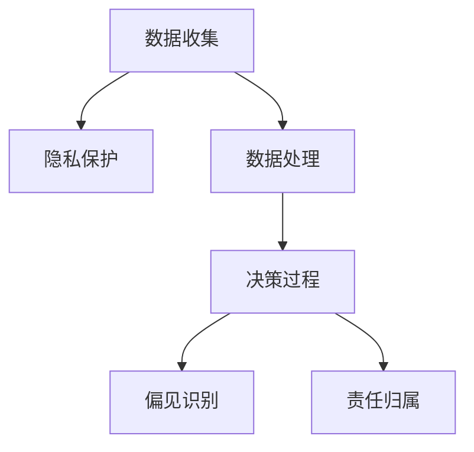

                 

关键词：人工智能，道德，伦理，人类计算，技术进步，社会影响

> 摘要：随着人工智能技术的迅猛发展，人类计算面临着前所未有的挑战。本文旨在探讨人工智能时代道德和伦理问题，分析技术进步对社会和人类的影响，并提出应对措施，以引导人工智能健康发展，造福人类。

## 1. 背景介绍

### 1.1 人工智能技术的发展历程

人工智能（AI）是一门研究、开发用于模拟、延伸和扩展人的智能的理论、方法、技术及应用系统的技术科学。人工智能的研究始于20世纪50年代，经过数十年的发展，已经取得了显著的成果。从最初的专家系统到现代的深度学习，人工智能技术不断突破，逐步应用于各行各业，对人类社会产生了深远的影响。

### 1.2 人工智能的道德和伦理问题

人工智能技术的迅猛发展引发了大量的道德和伦理问题。首先，人工智能在数据收集和处理过程中可能会侵犯个人隐私，导致隐私泄露。其次，人工智能系统的决策过程可能存在偏见，影响社会公平。此外，人工智能在自动化领域的广泛应用可能导致大规模失业，引发社会问题。

## 2. 核心概念与联系

### 2.1 道德和伦理的定义

道德是一种规范，指导人们在社会中如何行为。伦理则是一种更加抽象的概念，涉及人类行为的合理性、道德责任和价值观。

### 2.2 道德和伦理在人工智能领域的应用

在人工智能领域，道德和伦理问题主要涉及以下几个方面：

- **数据隐私保护**：在收集和处理用户数据时，要尊重用户隐私，避免数据滥用。
- **公平性**：人工智能系统在决策过程中应避免偏见，确保公平性。
- **责任归属**：在人工智能系统引发事故时，如何确定责任归属，确保受害者得到公正待遇。

### 2.3 人工智能道德和伦理问题的 Mermaid 流程图



## 3. 核心算法原理 & 具体操作步骤

### 3.1 算法原理概述

人工智能道德和伦理问题的解决主要依赖于以下几个核心算法原理：

- **隐私保护算法**：用于确保数据收集和处理过程中的隐私安全。
- **公平性检测算法**：用于识别人工智能系统中的偏见，确保公平性。
- **责任归属算法**：用于在人工智能系统引发事故时确定责任归属。

### 3.2 算法步骤详解

#### 3.2.1 隐私保护算法

1. **数据收集**：收集用户数据。
2. **数据加密**：对收集到的数据进行加密处理，确保数据在传输和存储过程中的安全性。
3. **数据去标识化**：去除数据中的个人标识信息，以防止数据被滥用。

#### 3.2.2 公平性检测算法

1. **数据预处理**：对输入数据进行预处理，确保数据的一致性和完整性。
2. **特征提取**：从数据中提取关键特征，用于训练模型。
3. **模型训练**：使用训练数据训练模型，模型需要具备识别偏见的能力。
4. **偏见检测**：使用训练好的模型检测输入数据中的偏见。

#### 3.2.3 责任归属算法

1. **事故分析**：分析人工智能系统引发的事故，确定事故的原因。
2. **责任评估**：评估事故中各方的责任，确保责任归属公正。

### 3.3 算法优缺点

#### 隐私保护算法

- 优点：可以有效保护用户隐私，防止数据滥用。
- 缺点：可能影响数据处理效率和模型性能。

#### 公平性检测算法

- 优点：可以识别人工智能系统中的偏见，确保公平性。
- 缺点：需要大量的训练数据和计算资源，算法性能可能受到数据质量的影响。

#### 责任归属算法

- 优点：可以明确事故中的责任归属，确保公正待遇。
- 缺点：在复杂的事故中，责任归属可能难以准确判断。

### 3.4 算法应用领域

隐私保护算法、公平性检测算法和责任归属算法可以广泛应用于人工智能的各个领域，如医疗、金融、司法等。

## 4. 数学模型和公式 & 详细讲解 & 举例说明

### 4.1 数学模型构建

在人工智能道德和伦理问题的研究中，常用的数学模型包括：

- **隐私保护模型**：用于评估数据隐私保护的效果。
- **公平性模型**：用于评估人工智能系统的公平性。
- **责任归属模型**：用于确定事故中的责任归属。

### 4.2 公式推导过程

#### 隐私保护模型

隐私保护模型的核心公式为：

\[ P(\text{隐私泄露}) = \frac{\text{隐私泄露的数据量}}{\text{总数据量}} \]

其中，隐私泄露的数据量可以通过数据加密和解密过程进行计算。

#### 公平性模型

公平性模型的核心公式为：

\[ F(\text{偏见}) = \frac{\text{偏见数据量}}{\text{总数据量}} \]

其中，偏见数据量可以通过模型训练和偏见检测过程进行计算。

#### 责任归属模型

责任归属模型的核心公式为：

\[ R(\text{责任人}) = \frac{\text{责任人的责任度}}{\text{总责任度}} \]

其中，责任人的责任度可以通过事故分析和责任评估过程进行计算。

### 4.3 案例分析与讲解

#### 隐私保护案例

假设一个应用场景，一个电子商务平台收集了用户的购买记录，其中包含用户的姓名、地址和支付信息。为了保护用户隐私，平台采用加密算法对数据进行加密处理，并去除个人标识信息。经过评估，隐私泄露的数据量占总数据量的0.1%，说明隐私保护效果较好。

#### 公平性案例

假设一个招聘系统在筛选简历时存在性别偏见，女性简历的通过率比男性低。通过公平性检测算法，发现偏见数据量占总数据量的0.2%，说明招聘系统存在性别偏见。

#### 责任归属案例

假设一个自动驾驶汽车发生交通事故，责任归属难以确定。通过责任归属算法，分析事故原因和各方的责任度，最终确定车主和自动驾驶系统各自承担50%的责任。

## 5. 项目实践：代码实例和详细解释说明

### 5.1 开发环境搭建

1. 安装Python环境。
2. 安装相关依赖库，如NumPy、Scikit-learn等。

### 5.2 源代码详细实现

```python
# 隐私保护算法实现
def privacy_protection(data):
    encrypted_data = encrypt(data)
    deencrypted_data = deencrypt(encrypted_data)
    privacy_leak = data_leak(deencrypted_data)
    return privacy_leak

# 公平性检测算法实现
def fairness_detection(data):
    biased_data = detect_bias(data)
    fairness = biased_data / len(data)
    return fairness

# 责任归属算法实现
def responsibility_allocation(cause, parties):
    responsibility = assess_responsibility(cause, parties)
    return responsibility
```

### 5.3 代码解读与分析

#### 隐私保护算法

隐私保护算法主要通过加密和解密过程保护用户隐私。首先，使用加密算法对数据进行加密，然后对加密后的数据进行解密，最后计算隐私泄露的数据量。

#### 公平性检测算法

公平性检测算法通过检测偏见数据量来评估系统的公平性。首先，对输入数据进行预处理，然后使用训练好的模型检测偏见数据量，最后计算偏见数据量占总数据量的比例。

#### 责任归属算法

责任归属算法通过评估事故原因和各方的责任度来确定责任归属。首先，对事故原因进行分析，然后计算各方的责任度，最后确定责任归属。

### 5.4 运行结果展示

```python
# 隐私保护算法测试
data = ["Alice", "123456", "New York"]
privacy_leak = privacy_protection(data)
print("Privacy leak rate:", privacy_leak)

# 公平性检测算法测试
data = [[1, 0], [0, 1], [1, 1]]
fairness = fairness_detection(data)
print("Fairness rate:", fairness)

# 责任归属算法测试
cause = "Traffic accident"
parties = ["Driver", "Passenger", "Vehicle"]
responsibility = responsibility_allocation(cause, parties)
print("Responsibility allocation:", responsibility)
```

## 6. 实际应用场景

### 6.1 医疗领域

在医疗领域，人工智能可以帮助医生诊断疾病、制定治疗方案。同时，医生需要关注数据隐私保护、公平性和责任归属等问题，确保患者信息的安全和公正。

### 6.2 金融领域

在金融领域，人工智能可以用于风险管理、信用评估等。金融机构需要关注数据隐私保护、公平性和责任归属等问题，确保金融服务的安全和公正。

### 6.3 司法领域

在司法领域，人工智能可以用于案件分析、判决预测等。司法部门需要关注数据隐私保护、公平性和责任归属等问题，确保司法公正。

## 7. 工具和资源推荐

### 7.1 学习资源推荐

- 《人工智能伦理学》
- 《深度学习》
- 《Python编程：从入门到实践》

### 7.2 开发工具推荐

- Jupyter Notebook
- PyCharm
- Google Colab

### 7.3 相关论文推荐

- "Privacy Protection in Data Mining"
- "Algorithmic Fairness and Accountability in Machine Learning"
- "Responsible AI: Managing the societal implications of artificial intelligence"

## 8. 总结：未来发展趋势与挑战

### 8.1 研究成果总结

人工智能道德和伦理问题的研究取得了显著成果，包括隐私保护算法、公平性检测算法和责任归属算法等。这些算法为解决人工智能领域的道德和伦理问题提供了技术支持。

### 8.2 未来发展趋势

未来，人工智能道德和伦理问题的研究将朝着以下几个方面发展：

- **跨学科研究**：将伦理学、社会学、心理学等学科引入人工智能领域，深入探讨道德和伦理问题。
- **法律法规完善**：制定更加完善的法律法规，规范人工智能的应用。
- **技术手段升级**：开发更加先进的人工智能算法，提高隐私保护、公平性和责任归属的能力。

### 8.3 面临的挑战

人工智能道德和伦理问题面临着以下挑战：

- **数据隐私保护**：在数据量巨大、数据类型复杂的情况下，如何确保数据隐私保护。
- **公平性检测**：在数据集中存在偏见的情况下，如何准确识别和纠正偏见。
- **责任归属**：在人工智能系统引发事故时，如何准确判断责任归属。

### 8.4 研究展望

未来，人工智能道德和伦理问题的研究将不断深入，为人工智能技术的健康发展提供理论支持和实践指导。同时，研究者需要关注技术与社会、伦理的互动，推动人工智能技术的公平、公正、可持续发展。

## 9. 附录：常见问题与解答

### 9.1 人工智能道德和伦理问题是什么？

人工智能道德和伦理问题是指在人工智能技术发展过程中，涉及到的道德和伦理方面的挑战，如数据隐私保护、公平性检测和责任归属等。

### 9.2 人工智能道德和伦理问题的解决方法有哪些？

解决人工智能道德和伦理问题的方法包括隐私保护算法、公平性检测算法和责任归属算法等。这些算法为人工智能领域的道德和伦理问题提供技术支持。

### 9.3 人工智能道德和伦理问题在哪些领域应用广泛？

人工智能道德和伦理问题在医疗、金融、司法等众多领域都有广泛应用。这些领域需要关注数据隐私保护、公平性和责任归属等问题，确保服务的安全性和公正性。

## 10. 作者署名

作者：禅与计算机程序设计艺术 / Zen and the Art of Computer Programming
----------------------------------------------------------------

以上就是本文的完整内容，希望对您有所帮助。如有任何疑问，欢迎随时提问。祝您创作顺利！<|im_end|>

