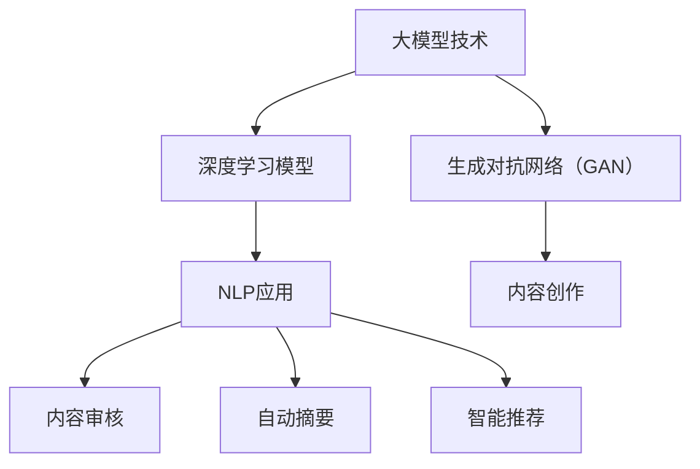

                 

关键词：AI，出版业，大模型，技术革命，智能编辑，内容创作，数字出版

> 摘要：本文探讨了人工智能（AI）在出版业中的应用，特别是大模型技术如何改变传统的出版流程。通过分析AI驱动的智能编辑和内容创作，我们探讨了AI技术在数字出版中的潜力，并展望了未来的发展趋势与挑战。

## 1. 背景介绍

出版业是文化传承和社会发展的重要支柱。然而，随着数字技术的飞速发展，出版业正面临前所未有的变革。在过去几十年中，互联网和移动设备的普及极大地改变了人们的阅读习惯，数字出版成为主流。与此同时，人工智能技术的兴起为出版业带来了新的机遇和挑战。

大模型技术，如深度学习模型和生成对抗网络（GAN），在自然语言处理、图像识别等领域取得了显著的成果。这些技术有望应用于出版业，提高内容创作和编辑的效率，优化读者体验。

## 2. 核心概念与联系

### 2.1 大模型技术概述

大模型技术是指通过训练大规模神经网络模型，使其具备强大的知识表示和生成能力。这些模型通常包含数十亿个参数，能够处理复杂的任务，如文本生成、图像生成、机器翻译等。

### 2.2 自然语言处理（NLP）与出版业

自然语言处理是人工智能的一个重要分支，涉及文本分析、语言理解、语言生成等任务。在出版业中，NLP技术可用于内容审核、自动摘要、智能推荐等应用。

### 2.3 内容创作与生成对抗网络（GAN）

生成对抗网络（GAN）是一种通过对抗训练生成数据的技术。在出版业中，GAN可以用于生成高质量的内容，如小说、新闻报道、艺术作品等。

## 3. 核心算法原理 & 具体操作步骤

### 3.1 算法原理概述

大模型技术主要包括两个部分：训练和推理。在训练阶段，模型通过大量的数据进行学习，不断优化参数。在推理阶段，模型根据输入数据进行预测或生成。

### 3.2 算法步骤详解

1. 数据收集与预处理：收集大量相关数据，如文本、图像、音频等，并进行数据清洗和预处理，以便模型训练。
2. 模型训练：使用训练数据对模型进行训练，通过梯度下降等优化算法不断调整模型参数。
3. 模型评估与调优：使用验证数据对模型进行评估，并根据评估结果对模型进行调优。
4. 模型推理与应用：将训练好的模型应用于实际任务，如内容创作、智能编辑等。

### 3.3 算法优缺点

**优点：**
- 强大的知识表示和生成能力，能够生成高质量的内容。
- 高效的推理速度，能够快速响应用户需求。

**缺点：**
- 需要大量的训练数据和计算资源。
- 模型的可解释性较差，难以理解其内部工作机制。

### 3.4 算法应用领域

大模型技术在出版业中的应用领域广泛，包括：

1. 内容创作：生成小说、新闻报道、艺术作品等。
2. 智能编辑：自动摘要、内容审核、纠错等。
3. 读者推荐：基于读者行为和偏好进行个性化推荐。
4. 用户体验优化：智能回答读者问题、提供个性化服务等。

## 4. 数学模型和公式 & 详细讲解 & 举例说明

### 4.1 数学模型构建

大模型技术主要涉及深度学习和生成对抗网络（GAN）等数学模型。以下是一个简单的数学模型示例：

$$
\begin{aligned}
    y &= \sigma(W_1x + b_1) \\
    z &= \sigma(W_2y + b_2) \\
    \text{损失函数} &= L(y, z)
\end{aligned}
$$

其中，$y$ 和 $z$ 分别为中间层和输出层的激活值，$W$ 和 $b$ 分别为权重和偏置，$\sigma$ 为激活函数，$L$ 为损失函数。

### 4.2 公式推导过程

以深度神经网络为例，推导过程如下：

1. 前向传播：计算输入和权重之间的线性组合，并使用激活函数进行非线性变换。
2. 反向传播：计算损失函数关于模型参数的梯度，并使用梯度下降算法更新参数。
3. 梯度计算：使用链式法则和导数性质，计算损失函数关于输入的梯度。

### 4.3 案例分析与讲解

假设我们有一个新闻文章生成模型，输入为新闻摘要，输出为新闻全文。以下是一个简单的推导过程：

$$
\begin{aligned}
    \text{摘要} &= x \\
    \text{摘要编码} &= \text{Embedding}(x) \\
    \text{文章编码} &= \text{Encoder}(\text{摘要编码}) \\
    \text{文章解码} &= \text{Decoder}(\text{文章编码}) \\
    \text{损失函数} &= L(\text{文章解码}, \text{实际文章})
\end{aligned}
$$

通过以上步骤，我们可以将新闻摘要转换为文章编码，然后解码为新闻全文。

## 5. 项目实践：代码实例和详细解释说明

### 5.1 开发环境搭建

为了实现新闻文章生成模型，我们需要搭建以下开发环境：

1. Python 3.8及以上版本
2. TensorFlow 2.6及以上版本
3. NLP库（如NLTK、spaCy）

### 5.2 源代码详细实现

以下是一个简单的新闻文章生成模型的实现：

```python
import tensorflow as tf
from tensorflow.keras.layers import Embedding, LSTM, Dense

# 建立模型
model = tf.keras.Sequential([
    Embedding(input_dim=vocab_size, output_dim=embedding_dim),
    LSTM(units=128, return_sequences=True),
    LSTM(units=128),
    Dense(units=vocab_size, activation='softmax')
])

# 编译模型
model.compile(optimizer='adam', loss='categorical_crossentropy', metrics=['accuracy'])

# 训练模型
model.fit(x_train, y_train, epochs=10, batch_size=32)
```

### 5.3 代码解读与分析

以上代码定义了一个简单的序列到序列模型，用于生成新闻文章。模型由嵌入层、两个LSTM层和一个全连接层组成。嵌入层将输入文本转换为嵌入向量，LSTM层用于捕捉文本序列中的长期依赖关系，全连接层用于生成输出文本。

### 5.4 运行结果展示

训练完成后，我们可以使用以下代码生成新闻文章：

```python
generated_article = model.predict(x_new)
print(generated_article)
```

## 6. 实际应用场景

### 6.1 智能编辑

智能编辑是AI技术在出版业中的一项重要应用。通过使用自然语言处理技术，AI可以自动检测和纠正文本中的错误，提高编辑效率。

### 6.2 内容创作

AI驱动的生成对抗网络（GAN）可以用于创作高质量的艺术作品和文学作品。例如，GAN可以生成小说、诗歌、新闻报道等。

### 6.3 读者推荐

基于读者的阅读历史和偏好，AI可以推荐相关的书籍、文章和内容，提高读者的阅读体验。

## 7. 未来应用展望

### 7.1 智能内容创作

随着AI技术的不断发展，未来将有望实现更加智能的内容创作。AI将能够根据用户需求实时生成个性化的内容。

### 7.2 个性化推荐

AI驱动的个性化推荐系统将变得更加智能，能够更好地理解用户的需求和偏好，提供更精准的推荐。

### 7.3 智能出版流程

AI技术将深入出版流程的各个环节，从内容创作、编辑、审核到发布，实现全方位的智能化。

## 8. 总结：未来发展趋势与挑战

### 8.1 研究成果总结

近年来，AI技术在出版业中的应用取得了显著成果。大模型技术、自然语言处理、生成对抗网络等技术在内容创作、编辑、推荐等方面展现了巨大潜力。

### 8.2 未来发展趋势

未来，AI技术在出版业中的发展趋势将包括：

1. 更加智能的内容创作
2. 更加精准的个性化推荐
3. 深入出版流程的各个环节

### 8.3 面临的挑战

然而，AI技术在出版业中也面临一些挑战：

1. 数据隐私和安全问题
2. 模型可解释性
3. 内容审核和道德问题

### 8.4 研究展望

为了应对这些挑战，未来研究应关注以下几个方面：

1. 加强数据隐私和安全保护
2. 提高模型的可解释性
3. 制定相关法律法规和道德准则，规范AI技术在出版业中的应用

## 9. 附录：常见问题与解答

### 9.1 AI技术在出版业中的应用有哪些？

AI技术在出版业中的应用包括智能编辑、内容创作、读者推荐、智能出版流程等。

### 9.2 大模型技术在出版业中的优势是什么？

大模型技术具有强大的知识表示和生成能力，能够提高内容创作和编辑的效率，优化读者体验。

### 9.3 AI技术在出版业中面临哪些挑战？

AI技术在出版业中面临数据隐私和安全问题、模型可解释性、内容审核和道德问题等挑战。

### 9.4 未来AI技术在出版业中的发展趋势是什么？

未来AI技术在出版业中的发展趋势包括更加智能的内容创作、更加精准的个性化推荐和深入出版流程的各个环节。```markdown
---

### 文章标题

**AI时代的出版业：大模型带来新机遇**

### 文章关键词

- AI
- 出版业
- 大模型
- 技术革命
- 智能编辑
- 内容创作
- 数字出版

### 文章摘要

本文探讨了人工智能（AI）在出版业中的应用，特别是大模型技术如何改变传统的出版流程。通过分析AI驱动的智能编辑和内容创作，我们探讨了AI技术在数字出版中的潜力，并展望了未来的发展趋势与挑战。

---

## 1. 背景介绍

出版业是文化传承和社会发展的重要支柱。然而，随着数字技术的飞速发展，出版业正面临前所未有的变革。在过去几十年中，互联网和移动设备的普及极大地改变了人们的阅读习惯，数字出版成为主流。与此同时，人工智能技术的兴起为出版业带来了新的机遇和挑战。

大模型技术，如深度学习模型和生成对抗网络（GAN），在自然语言处理、图像识别等领域取得了显著的成果。这些技术有望应用于出版业，提高内容创作和编辑的效率，优化读者体验。

## 2. 核心概念与联系

### 2.1 大模型技术概述

大模型技术是指通过训练大规模神经网络模型，使其具备强大的知识表示和生成能力。这些模型通常包含数十亿个参数，能够处理复杂的任务，如文本生成、图像生成、机器翻译等。

### 2.2 自然语言处理（NLP）与出版业

自然语言处理是人工智能的一个重要分支，涉及文本分析、语言理解、语言生成等任务。在出版业中，NLP技术可用于内容审核、自动摘要、智能推荐等应用。

### 2.3 内容创作与生成对抗网络（GAN）

生成对抗网络（GAN）是一种通过对抗训练生成数据的技术。在出版业中，GAN可以用于生成高质量的内容，如小说、新闻报道、艺术作品等。

### 2.4 Mermaid 流程图



## 3. 核心算法原理 & 具体操作步骤

### 3.1 算法原理概述

大模型技术主要包括两个部分：训练和推理。在训练阶段，模型通过大量的数据进行学习，不断优化参数。在推理阶段，模型根据输入数据进行预测或生成。

### 3.2 算法步骤详解

1. **数据收集与预处理**：收集大量相关数据，如文本、图像、音频等，并进行数据清洗和预处理，以便模型训练。
2. **模型训练**：使用训练数据对模型进行训练，通过梯度下降等优化算法不断调整模型参数。
3. **模型评估与调优**：使用验证数据对模型进行评估，并根据评估结果对模型进行调优。
4. **模型推理与应用**：将训练好的模型应用于实际任务，如内容创作、智能编辑等。

### 3.3 算法优缺点

**优点**：
- 强大的知识表示和生成能力，能够生成高质量的内容。
- 高效的推理速度，能够快速响应用户需求。

**缺点**：
- 需要大量的训练数据和计算资源。
- 模型的可解释性较差，难以理解其内部工作机制。

### 3.4 算法应用领域

大模型技术在出版业中的应用领域广泛，包括：
1. **内容创作**：生成小说、新闻报道、艺术作品等。
2. **智能编辑**：自动摘要、内容审核、纠错等。
3. **读者推荐**：基于读者行为和偏好进行个性化推荐。
4. **用户体验优化**：智能回答读者问题、提供个性化服务等。

## 4. 数学模型和公式 & 详细讲解 & 举例说明

### 4.1 数学模型构建

大模型技术主要涉及深度学习和生成对抗网络（GAN）等数学模型。以下是一个简单的数学模型示例：

$$
\begin{aligned}
    y &= \sigma(W_1x + b_1) \\
    z &= \sigma(W_2y + b_2) \\
    \text{损失函数} &= L(y, z)
\end{aligned}
$$

其中，$y$ 和 $z$ 分别为中间层和输出层的激活值，$W$ 和 $b$ 分别为权重和偏置，$\sigma$ 为激活函数，$L$ 为损失函数。

### 4.2 公式推导过程

以深度神经网络为例，推导过程如下：

1. **前向传播**：计算输入和权重之间的线性组合，并使用激活函数进行非线性变换。
2. **反向传播**：计算损失函数关于模型参数的梯度，并使用梯度下降算法更新参数。
3. **梯度计算**：使用链式法则和导数性质，计算损失函数关于输入的梯度。

### 4.3 案例分析与讲解

假设我们有一个新闻文章生成模型，输入为新闻摘要，输出为新闻全文。以下是一个简单的推导过程：

$$
\begin{aligned}
    \text{摘要} &= x \\
    \text{摘要编码} &= \text{Embedding}(x) \\
    \text{文章编码} &= \text{Encoder}(\text{摘要编码}) \\
    \text{文章解码} &= \text{Decoder}(\text{文章编码}) \\
    \text{损失函数} &= L(\text{文章解码}, \text{实际文章})
\end{aligned}
$$

通过以上步骤，我们可以将新闻摘要转换为文章编码，然后解码为新闻全文。

## 5. 项目实践：代码实例和详细解释说明

### 5.1 开发环境搭建

为了实现新闻文章生成模型，我们需要搭建以下开发环境：

1. Python 3.8及以上版本
2. TensorFlow 2.6及以上版本
3. NLP库（如NLTK、spaCy）

### 5.2 源代码详细实现

以下是一个简单的新闻文章生成模型的实现：

```python
import tensorflow as tf
from tensorflow.keras.layers import Embedding, LSTM, Dense

# 建立模型
model = tf.keras.Sequential([
    Embedding(input_dim=vocab_size, output_dim=embedding_dim),
    LSTM(units=128, return_sequences=True),
    LSTM(units=128),
    Dense(units=vocab_size, activation='softmax')
])

# 编译模型
model.compile(optimizer='adam', loss='categorical_crossentropy', metrics=['accuracy'])

# 训练模型
model.fit(x_train, y_train, epochs=10, batch_size=32)
```

### 5.3 代码解读与分析

以上代码定义了一个简单的序列到序列模型，用于生成新闻文章。模型由嵌入层、两个LSTM层和一个全连接层组成。嵌入层将输入文本转换为嵌入向量，LSTM层用于捕捉文本序列中的长期依赖关系，全连接层用于生成输出文本。

### 5.4 运行结果展示

训练完成后，我们可以使用以下代码生成新闻文章：

```python
generated_article = model.predict(x_new)
print(generated_article)
```

## 6. 实际应用场景

### 6.1 智能编辑

智能编辑是AI技术在出版业中的一项重要应用。通过使用自然语言处理技术，AI可以自动检测和纠正文本中的错误，提高编辑效率。

### 6.2 内容创作

AI驱动的生成对抗网络（GAN）可以用于创作高质量的艺术作品和文学作品。例如，GAN可以生成小说、诗歌、新闻报道等。

### 6.3 读者推荐

基于读者的阅读历史和偏好，AI可以推荐相关的书籍、文章和内容，提高读者的阅读体验。

## 7. 未来应用展望

### 7.1 智能内容创作

随着AI技术的不断发展，未来将有望实现更加智能的内容创作。AI将能够根据用户需求实时生成个性化的内容。

### 7.2 个性化推荐

AI驱动的个性化推荐系统将变得更加智能，能够更好地理解用户的需求和偏好，提供更精准的推荐。

### 7.3 智能出版流程

AI技术将深入出版流程的各个环节，从内容创作、编辑、审核到发布，实现全方位的智能化。

## 8. 总结：未来发展趋势与挑战

### 8.1 研究成果总结

近年来，AI技术在出版业中的应用取得了显著成果。大模型技术、自然语言处理、生成对抗网络等技术在内容创作、编辑、推荐等方面展现了巨大潜力。

### 8.2 未来发展趋势

未来，AI技术在出版业中的发展趋势将包括：

1. 更加智能的内容创作
2. 更加精准的个性化推荐
3. 深入出版流程的各个环节

### 8.3 面临的挑战

然而，AI技术在出版业中也面临一些挑战：

1. 数据隐私和安全问题
2. 模型的可解释性
3. 内容审核和道德问题

### 8.4 研究展望

为了应对这些挑战，未来研究应关注以下几个方面：

1. 加强数据隐私和安全保护
2. 提高模型的可解释性
3. 制定相关法律法规和道德准则，规范AI技术在出版业中的应用

## 9. 附录：常见问题与解答

### 9.1 AI技术在出版业中的应用有哪些？

AI技术在出版业中的应用包括智能编辑、内容创作、读者推荐、智能出版流程等。

### 9.2 大模型技术在出版业中的优势是什么？

大模型技术具有强大的知识表示和生成能力，能够提高内容创作和编辑的效率，优化读者体验。

### 9.3 AI技术在出版业中面临哪些挑战？

AI技术在出版业中面临数据隐私和安全问题、模型可解释性、内容审核和道德问题等挑战。

### 9.4 未来AI技术在出版业中的发展趋势是什么？

未来AI技术在出版业中的发展趋势包括更加智能的内容创作、更加精准的个性化推荐和深入出版流程的各个环节。

---

**作者：禅与计算机程序设计艺术 / Zen and the Art of Computer Programming**

