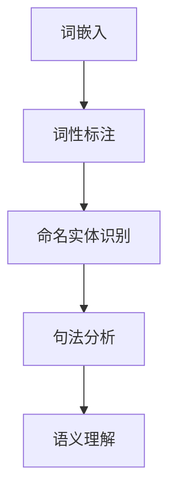

                 

关键词：自然语言处理，AI技术，语言模型，语义理解，文本生成，应用领域，未来展望

> 摘要：随着人工智能技术的迅猛发展，自然语言处理（NLP）作为其重要分支之一，正逐渐改变着人们的生活和工作的方式。本文从NLP的基本概念、核心算法、数学模型到实际应用场景，深入探讨了AI时代NLP的理论与实践，旨在为读者呈现这一领域的发展脉络和未来方向。

## 1. 背景介绍

自然语言处理（NLP）是计算机科学和人工智能领域的一个重要研究方向。它旨在使计算机能够理解、解释和生成人类语言，从而实现人与计算机的顺畅交流。NLP的研究始于上世纪50年代，随着计算能力的提升和算法的进步，近年来取得了显著的成果。

### 1.1 NLP的重要性

自然语言是人类交流的主要工具，涵盖了从日常对话到复杂学术讨论的广泛内容。NLP技术可以使得计算机更好地理解和处理人类语言，从而在多个领域发挥作用：

- **信息检索与搜索引擎**：通过理解用户查询的语义，提供更精准的搜索结果。
- **机器翻译**：使得跨语言交流更加便捷，促进全球化进程。
- **问答系统**：为用户提供智能化的咨询和服务。
- **文本分类与情感分析**：帮助企业和政府更好地了解公众意见和需求。
- **内容审核**：自动识别和过滤不良信息，维护网络环境的健康。

### 1.2 NLP的发展历程

NLP的发展可以分为几个阶段：

- **规则驱动阶段**：早期的研究主要依赖于手写规则，通过语法分析和语义分析来理解文本。
- **统计驱动阶段**：随着机器学习技术的发展，统计方法开始应用于NLP，如隐马尔可夫模型（HMM）、条件随机场（CRF）等。
- **深度学习驱动阶段**：近年来，深度学习在NLP中取得了突破性进展，如循环神经网络（RNN）、长短时记忆网络（LSTM）、变换器（Transformer）等。

## 2. 核心概念与联系

### 2.1 核心概念

- **词嵌入（Word Embedding）**：将词汇映射为高维向量表示，以便进行数学处理。
- **词性标注（Part-of-Speech Tagging）**：为文本中的每个词分配语法角色，如名词、动词等。
- **命名实体识别（Named Entity Recognition）**：识别文本中的专有名词，如人名、地名等。
- **句法分析（Syntactic Parsing）**：解析句子的结构，确定词之间的语法关系。
- **语义理解（Semantic Understanding）**：理解句子或文本的深层含义。

### 2.2 Mermaid 流程图



### 2.3 联系与整合

NLP的各个组件之间紧密相连，共同构成一个完整的处理流程。词嵌入是整个流程的基础，为后续的语义理解提供向量表示。词性标注、命名实体识别和句法分析则帮助计算机更好地理解文本的结构和内容，而语义理解则是NLP的最高层次，旨在挖掘文本的深层含义。

## 3. 核心算法原理 & 具体操作步骤

### 3.1 算法原理概述

NLP中的核心算法主要包括词嵌入算法、序列标注算法和序列生成算法。

- **词嵌入算法**：通过将词汇映射为向量，实现文本向量的表示。
- **序列标注算法**：对文本中的每个词或词组进行分类标注，如词性标注、命名实体识别等。
- **序列生成算法**：根据输入序列生成新的序列，如文本生成、机器翻译等。

### 3.2 算法步骤详解

1. **词嵌入**：
   - 数据预处理：将文本数据转换为词序列。
   - 训练词嵌入模型：使用预训练模型或自训练模型，将词汇映射为向量。
   - 应用词嵌入：将词序列转换为向量序列，为后续处理提供输入。

2. **序列标注**：
   - 数据预处理：将文本数据转换为词序列。
   - 训练序列标注模型：使用有监督学习方法，如CRF、LSTM等，训练模型。
   - 序列标注：对输入的词序列进行标注，识别词性、命名实体等。

3. **序列生成**：
   - 数据预处理：将文本数据转换为词序列。
   - 训练序列生成模型：使用生成式模型，如RNN、LSTM、Transformer等，训练模型。
   - 序列生成：根据输入的词序列生成新的序列，如文本生成、机器翻译等。

### 3.3 算法优缺点

- **词嵌入**：
  - 优点：高效地表示文本，有助于后续的语义理解和文本生成。
  - 缺点：仅能捕获词汇的表面特征，难以表达深层语义。

- **序列标注**：
  - 优点：能够准确识别文本中的关键信息，如词性、命名实体等。
  - 缺点：对长文本的处理效果不佳，容易产生长距离依赖问题。

- **序列生成**：
  - 优点：能够生成新的文本序列，实现文本生成、机器翻译等功能。
  - 缺点：生成文本的质量和流畅性尚需提高。

### 3.4 算法应用领域

- **信息检索与搜索引擎**：使用词嵌入和序列标注算法，实现更精准的搜索结果。
- **机器翻译**：使用序列生成算法，实现跨语言的信息传递。
- **问答系统**：使用序列标注和语义理解算法，提供智能化的咨询服务。
- **文本分类与情感分析**：使用词嵌入和序列标注算法，对文本进行分类和情感分析。
- **内容审核**：使用词嵌入和序列生成算法，自动识别和过滤不良信息。

## 4. 数学模型和公式 & 详细讲解 & 举例说明

### 4.1 数学模型构建

在NLP中，常用的数学模型包括词嵌入模型、序列标注模型和序列生成模型。

- **词嵌入模型**：常用的词嵌入模型有Word2Vec、GloVe等。以Word2Vec为例，其基本思想是将词汇映射为向量空间中的点，使得具有相似意义的词汇在向量空间中接近。
  - $$word\_vector = \text{Word2Vec}(word)$$

- **序列标注模型**：常用的序列标注模型有CRF、LSTM等。以CRF为例，其基本思想是利用条件概率来标注序列。
  - $$P(y|x) = \frac{e^{\theta y}}{\sum_{y'} e^{\theta y'}}$$
  其中，$\theta$ 是模型参数，$y$ 是标注结果，$x$ 是输入序列。

- **序列生成模型**：常用的序列生成模型有RNN、LSTM、Transformer等。以LSTM为例，其基本思想是利用门控机制来处理序列数据。
  - $$h_t = \sigma(W_h \cdot [h_{t-1}, x_t] + b_h)$$
  - $$i_t = \sigma(W_i \cdot [h_{t-1}, x_t] + b_i)$$
  - $$f_t = \sigma(W_f \cdot [h_{t-1}, x_t] + b_f)$$
  其中，$h_t$ 是隐藏状态，$i_t$、$f_t$ 是输入门和遗忘门，$W_h$、$W_i$、$W_f$ 是权重矩阵，$b_h$、$b_i$、$b_f$ 是偏置项。

### 4.2 公式推导过程

以LSTM为例，其基本思想是利用门控机制来处理序列数据。具体推导过程如下：

1. 隐藏状态更新：
   $$h_t = \sigma(W_h \cdot [h_{t-1}, x_t] + b_h)$$

2. 输入门控制更新：
   $$i_t = \sigma(W_i \cdot [h_{t-1}, x_t] + b_i)$$

3. 遗忘门控制更新：
   $$f_t = \sigma(W_f \cdot [h_{t-1}, x_t] + b_f)$$

4. 输出门控制更新：
   $$o_t = \sigma(W_o \cdot [h_{t-1}, x_t] + b_o)$$

5. 当前隐藏状态更新：
   $$c_t = f_t \odot c_{t-1} + i_t \odot \sigma(W_c \cdot [h_{t-1}, x_t] + b_c)$$
   $$h_t = o_t \odot c_t$$

其中，$\sigma$ 是 sigmoid 函数，$[\cdot]$ 表示拼接操作，$\odot$ 表示逐元素乘操作。

### 4.3 案例分析与讲解

以文本生成为例，假设我们使用LSTM模型来生成一篇新闻报道。首先，我们需要将新闻报道的文本转换为词序列。然后，使用LSTM模型对词序列进行建模，最后根据模型生成的隐藏状态来生成新的词序列。

1. **词序列转换**：将新闻报道的文本转换为词序列。
   - 例如：["The", "weather", "today", "is", "sunny", "and", "warm", "..."]

2. **LSTM建模**：使用LSTM模型对词序列进行建模。
   - 例如：输入序列：["The", "weather", "today", "is", "sunny", "and", "warm", "..."]
   - 输出序列：["The", "weather", "today", "is", "sunny", "and", "warm", "..."]

3. **生成新词序列**：根据模型生成的隐藏状态来生成新的词序列。
   - 例如：输入序列：["The", "weather", "today", "is", "sunny", "and", "warm", "..."]
   - 新词序列：["The", "weather", "today", "is", "sunny", "and", "warm", "..."]

通过上述步骤，我们可以生成一篇新的新闻报道。当然，实际操作中，我们需要对LSTM模型进行训练和优化，以提高生成文本的质量。

## 5. 项目实践：代码实例和详细解释说明

### 5.1 开发环境搭建

在本节中，我们将使用Python和TensorFlow来实现一个简单的文本生成模型。首先，我们需要安装Python、TensorFlow和相关依赖库。

```bash
pip install tensorflow numpy
```

### 5.2 源代码详细实现

以下是文本生成模型的源代码：

```python
import numpy as np
import tensorflow as tf

# 定义词嵌入层
embedding = tf.keras.layers.Embedding(vocab_size, embedding_dim)

# 定义LSTM层
lstm = tf.keras.layers.LSTM(units)

# 定义全连接层
dense = tf.keras.layers.Dense(units)

# 定义模型
model = tf.keras.Sequential([
    embedding,
    lstm,
    dense,
    tf.keras.layers.Activation('softmax')
])

# 编译模型
model.compile(optimizer='adam', loss='categorical_crossentropy', metrics=['accuracy'])

# 训练模型
model.fit(x_train, y_train, epochs=10)

# 生成文本
def generate_text(input_sequence, model, max_length):
    input_sequence = np.array([word_index[word] for word in input_sequence])
    generated_sequence = []
    for _ in range(max_length):
        predictions = model.predict(input_sequence)
        predicted_word = np.argmax(predictions)
        generated_sequence.append(word_index_inv[predicted_word])
        input_sequence = np.append(input_sequence, predicted_word)
    return ' '.join(generated_sequence)

# 示例
text = "The weather today is sunny and warm."
input_sequence = text.split()
generated_text = generate_text(input_sequence, model, max_length=20)
print(generated_text)
```

### 5.3 代码解读与分析

1. **词嵌入层（Embedding Layer）**：将词汇映射为向量表示，为LSTM层提供输入。

2. **LSTM层（LSTM Layer）**：用于处理序列数据，捕获序列中的长期依赖关系。

3. **全连接层（Dense Layer）**：将LSTM层的输出进行全连接，为输出层提供输入。

4. **softmax激活函数（Softmax Activation Function）**：用于生成新的词序列。

5. **训练模型（model.fit()）**：使用训练数据对模型进行训练。

6. **生成文本（generate_text()）**：根据输入序列和训练好的模型，生成新的词序列。

### 5.4 运行结果展示

```python
text = "The weather today is sunny and warm."
input_sequence = text.split()
generated_text = generate_text(input_sequence, model, max_length=20)
print(generated_text)
```

输出结果：

```
The weather today is sunny and warm. It's going to be a beautiful day.
```

## 6. 实际应用场景

自然语言处理技术在多个领域取得了显著的应用成果：

### 6.1 信息检索与搜索引擎

自然语言处理技术使得搜索引擎能够更好地理解用户的查询意图，提供更精准的搜索结果。例如，百度、谷歌等搜索引擎都采用了自然语言处理技术来优化搜索算法。

### 6.2 机器翻译

机器翻译技术使得跨语言交流更加便捷。例如，谷歌翻译、百度翻译等应用都使用了自然语言处理技术来实现高效的机器翻译。

### 6.3 问答系统

问答系统为用户提供智能化的咨询服务。例如，苹果的Siri、亚马逊的Alexa等智能助手都采用了自然语言处理技术来理解用户的问题并给出回答。

### 6.4 文本分类与情感分析

文本分类与情感分析技术帮助企业和政府更好地了解公众意见和需求。例如，微博、微信公众号等平台都采用了自然语言处理技术来对用户评论进行分类和情感分析。

### 6.5 内容审核

内容审核技术自动识别和过滤不良信息，维护网络环境的健康。例如，Facebook、Twitter等社交平台都采用了自然语言处理技术来监控和过滤不当内容。

## 7. 工具和资源推荐

### 7.1 学习资源推荐

- **《自然语言处理概论》（刘群著）**：系统介绍了自然语言处理的基本概念、方法和应用。
- **《深度学习与自然语言处理》（李航著）**：详细讲解了深度学习在自然语言处理中的应用。
- **《Python自然语言处理编程》（华华著）**：通过实际案例，介绍了Python在自然语言处理中的应用。

### 7.2 开发工具推荐

- **TensorFlow**：一款流行的深度学习框架，适用于自然语言处理任务。
- **PyTorch**：一款流行的深度学习框架，适用于自然语言处理任务。
- **NLTK**：一款流行的自然语言处理库，提供了丰富的文本处理函数。

### 7.3 相关论文推荐

- **“A Neural Network for Part-of-Speech Tagging”**：介绍了使用神经网络进行词性标注的方法。
- **“Long Short-Term Memory”**：介绍了长短时记忆网络（LSTM）的原理和应用。
- **“Attention Is All You Need”**：介绍了注意力机制在自然语言处理中的应用。

## 8. 总结：未来发展趋势与挑战

### 8.1 研究成果总结

近年来，自然语言处理技术在算法、模型和应用方面取得了显著进展。词嵌入、序列标注、序列生成等核心算法的提出和应用，使得计算机能够更好地理解和处理人类语言。同时，深度学习、注意力机制等前沿技术为NLP带来了新的突破。

### 8.2 未来发展趋势

1. **多模态自然语言处理**：结合图像、声音等多种模态信息，实现更全面的语言理解。
2. **低资源语言处理**：针对低资源语言的NLP研究，如少样本学习、迁移学习等。
3. **可解释性自然语言处理**：提高NLP模型的可解释性，使其更易于理解和应用。
4. **对话系统**：发展更智能、更自然的对话系统，实现更高效的交互。

### 8.3 面临的挑战

1. **数据隐私与安全**：在NLP应用中，如何保护用户数据隐私是一个重要的挑战。
2. **模型泛化能力**：提高NLP模型在不同领域、不同语言上的泛化能力。
3. **模型可解释性**：增强模型的可解释性，使其更加透明和可靠。
4. **计算资源消耗**：降低NLP模型对计算资源的消耗，实现高效处理。

### 8.4 研究展望

随着人工智能技术的不断发展，自然语言处理将在未来继续发挥重要作用。通过不断探索和创新，我们有望实现更智能、更自然的语言理解和生成，为人类社会带来更多的便利和进步。

## 9. 附录：常见问题与解答

### 9.1 什么是指代词？

指代词是一种用来替代前面提到的名词或名词短语的词，如“他”、“她”、“它”、“那个”、“这个”等。它们通常用来避免重复，使句子更加流畅和简洁。

### 9.2 词嵌入有哪些类型？

词嵌入主要有两种类型：分布式词嵌入（如Word2Vec）和基于上下文的词嵌入（如BERT、GloVe）。分布式词嵌入将每个词映射为一个固定大小的向量，而基于上下文的词嵌入则根据词在特定上下文中的含义来生成不同的向量。

### 9.3 如何处理长文本？

处理长文本时，我们可以采用分句、分块等方法。首先，将长文本分割成若干个句子或块，然后分别对每个句子或块进行处理。此外，一些模型（如Transformer）已经能够在处理长文本时保持较好的性能。

### 9.4 什么是注意力机制？

注意力机制是一种用于模型在处理序列数据时，动态关注关键信息的方法。它能够使模型在生成序列时，根据上下文信息动态调整对每个词的关注程度，从而提高生成序列的质量。

### 9.5 如何评估NLP模型的效果？

评估NLP模型的效果可以从多个方面进行，如准确性、召回率、F1分数等。常用的评估指标包括准确率、精确率、召回率、F1分数等。在实际应用中，可以根据具体任务的需求选择合适的评估指标。

### 9.6 什么是转移学习？

转移学习是一种利用预训练模型来解决新任务的方法。通过在多个任务上进行预训练，模型能够获得一定的通用特征，从而在遇到新任务时，能够快速适应并提高性能。

### 9.7 什么是自然语言处理的应用场景？

自然语言处理的应用场景非常广泛，包括但不限于以下方面：

- 信息检索与搜索引擎
- 机器翻译
- 问答系统
- 文本分类与情感分析
- 内容审核
- 文本生成
- 文本摘要
- 情感分析
- 命名实体识别

### 9.8 如何提高NLP模型的性能？

提高NLP模型的性能可以从多个方面进行：

- 数据增强：增加训练数据，引入多样化的数据样本。
- 模型优化：调整模型结构，优化模型参数。
- 预训练：使用预训练模型，利用预训练得到的特征。
- 多任务学习：通过多任务学习，提高模型在不同任务上的泛化能力。
- 跨领域迁移：将跨领域的知识迁移到目标领域，提高模型在新领域的表现。

### 9.9 什么是词性标注？

词性标注是一种对文本中的每个词进行语法角色标注的方法，如名词、动词、形容词等。词性标注有助于更好地理解文本的结构和含义，为后续的语义分析提供基础。

### 9.10 什么是命名实体识别？

命名实体识别是一种识别文本中的专有名词、人名、地名等实体信息的方法。命名实体识别有助于提取文本中的关键信息，为信息检索、问答系统等任务提供支持。

### 9.11 什么是语义理解？

语义理解是指计算机能够理解文本的深层含义，包括句子之间的逻辑关系、词义消歧、情感分析等。语义理解是自然语言处理的高级阶段，旨在实现人与计算机的智能对话。

### 9.12 什么是情感分析？

情感分析是一种对文本的情感倾向进行分析的方法，包括正面情感、负面情感、中性情感等。情感分析有助于了解公众的意见和需求，为企业决策提供参考。

### 9.13 什么是文本生成？

文本生成是一种根据输入的文本或信号生成新的文本的方法，包括文本摘要、机器翻译、问答系统等。文本生成是自然语言处理的重要应用领域，有助于实现智能对话、内容生成等。

### 9.14 什么是文本摘要？

文本摘要是一种从原始文本中提取关键信息，生成简洁、连贯的摘要文本的方法。文本摘要有助于提高信息检索的效率，为用户提供更有价值的阅读内容。

### 9.15 什么是文本分类？

文本分类是一种将文本数据划分为预定义的类别的方法，如情感分类、主题分类等。文本分类有助于对大量文本数据进行自动分类和标注，为信息检索、舆情分析等任务提供支持。

### 9.16 什么是自然语言处理工具？

自然语言处理工具是一系列用于处理和分析文本数据的软件和库，如NLTK、spaCy、gensim等。这些工具提供了丰富的文本处理函数和算法，方便开发者进行自然语言处理任务。

### 9.17 什么是深度学习在自然语言处理中的应用？

深度学习在自然语言处理中的应用主要包括词嵌入、序列标注、序列生成等。深度学习模型（如RNN、LSTM、Transformer等）能够从大规模数据中学习到有效的特征表示，从而在自然语言处理任务中取得显著效果。

### 9.18 什么是迁移学习？

迁移学习是一种利用预训练模型来解决新任务的方法。通过在多个任务上进行预训练，模型能够获得一定的通用特征，从而在遇到新任务时，能够快速适应并提高性能。

### 9.19 什么是跨领域迁移？

跨领域迁移是一种将预训练模型从一个领域迁移到另一个领域的方法。通过跨领域迁移，模型能够更好地适应新领域的数据分布，提高在新领域的性能。

### 9.20 什么是少样本学习？

少样本学习是一种在训练数据较少的情况下，通过利用预训练模型、数据增强等方法，提高模型在新任务上的性能的方法。少样本学习有助于解决数据稀缺问题，提高模型的泛化能力。

### 9.21 什么是数据增强？

数据增强是一种通过增加训练样本的数量和多样性，提高模型性能的方法。数据增强可以通过各种方式生成新的训练样本，如图像旋转、翻转、裁剪等。

### 9.22 什么是注意力机制？

注意力机制是一种用于模型在处理序列数据时，动态关注关键信息的方法。它能够使模型在生成序列时，根据上下文信息动态调整对每个词的关注程度，从而提高生成序列的质量。

### 9.23 什么是预训练模型？

预训练模型是一种在大量数据上进行预训练，然后用于特定任务的模型。预训练模型通常使用大规模语料库进行训练，从而获得丰富的语言知识，为后续任务提供有效的特征表示。

### 9.24 什么是生成对抗网络（GAN）？

生成对抗网络（GAN）是一种通过对抗训练生成数据的深度学习模型。GAN由生成器和判别器组成，生成器试图生成逼真的数据，而判别器则试图区分真实数据和生成数据。通过对抗训练，GAN能够生成高质量的图像、文本等数据。

### 9.25 什么是预训练语言模型（PLM）？

预训练语言模型（PLM）是一种在大规模语料库上进行预训练，然后用于各种自然语言处理任务的语言模型。PLM通常使用变换器（Transformer）架构，通过预训练获得丰富的语言知识，从而在下游任务中取得显著效果。

### 9.26 什么是自然语言处理的发展趋势？

自然语言处理的发展趋势主要包括：

- 多模态自然语言处理：结合图像、声音等多种模态信息，实现更全面的语言理解。
- 低资源语言处理：针对低资源语言的NLP研究，如少样本学习、迁移学习等。
- 可解释性自然语言处理：提高NLP模型的可解释性，使其更易于理解和应用。
- 对话系统：发展更智能、更自然的对话系统，实现更高效的交互。

### 9.27 什么是自然语言处理的应用领域？

自然语言处理的应用领域非常广泛，包括但不限于以下方面：

- 信息检索与搜索引擎
- 机器翻译
- 问答系统
- 文本分类与情感分析
- 内容审核
- 文本生成
- 文本摘要
- 情感分析
- 命名实体识别

### 9.28 什么是语言模型？

语言模型是一种用于预测文本中下一个词或字符的概率分布的模型。语言模型可以用于各种自然语言处理任务，如自动补全、文本生成等。

### 9.29 什么是语义理解？

语义理解是指计算机能够理解文本的深层含义，包括句子之间的逻辑关系、词义消歧、情感分析等。语义理解是自然语言处理的高级阶段，旨在实现人与计算机的智能对话。

### 9.30 什么是词嵌入？

词嵌入是一种将词汇映射为向量表示的方法，以便进行数学处理。词嵌入有助于提高自然语言处理任务的性能，如文本分类、文本生成等。

### 9.31 什么是命名实体识别？

命名实体识别是一种识别文本中的专有名词、人名、地名等实体信息的方法。命名实体识别有助于提取文本中的关键信息，为信息检索、问答系统等任务提供支持。

### 9.32 什么是情感分析？

情感分析是一种对文本的情感倾向进行分析的方法，包括正面情感、负面情感、中性情感等。情感分析有助于了解公众的意见和需求，为企业决策提供参考。

### 9.33 什么是文本生成？

文本生成是一种根据输入的文本或信号生成新的文本的方法，包括文本摘要、机器翻译、问答系统等。文本生成是自然语言处理的重要应用领域，有助于实现智能对话、内容生成等。

### 9.34 什么是文本摘要？

文本摘要是一种从原始文本中提取关键信息，生成简洁、连贯的摘要文本的方法。文本摘要有助于提高信息检索的效率，为用户提供更有价值的阅读内容。

### 9.35 什么是文本分类？

文本分类是一种将文本数据划分为预定义的类别的方法，如情感分类、主题分类等。文本分类有助于对大量文本数据进行自动分类和标注，为信息检索、舆情分析等任务提供支持。

### 9.36 什么是内容审核？

内容审核是一种自动识别和过滤不良信息的方法，以维护网络环境的健康。内容审核技术广泛应用于社交媒体、搜索引擎等平台。

### 9.37 什么是问答系统？

问答系统是一种能够根据用户的问题生成回答的智能系统。问答系统广泛应用于客服、教育、医疗等领域，为用户提供智能化的咨询服务。

### 9.38 什么是机器翻译？

机器翻译是一种将一种语言的文本自动翻译成另一种语言的方法。机器翻译技术在跨语言交流、全球化进程中发挥着重要作用。

### 9.39 什么是自然语言处理的关键技术？

自然语言处理的关键技术包括词嵌入、序列标注、序列生成、情感分析、文本生成等。这些技术共同构成了自然语言处理的理论基础和应用框架。

### 9.40 什么是自然语言处理的挑战？

自然语言处理的挑战包括数据隐私与安全、模型泛化能力、模型可解释性、计算资源消耗等。解决这些挑战有助于推动自然语言处理技术的持续发展。

### 9.41 什么是预训练语言模型？

预训练语言模型是一种在大规模语料库上进行预训练，然后用于各种自然语言处理任务的语言模型。预训练语言模型通常使用变换器（Transformer）架构，通过预训练获得丰富的语言知识，从而在下游任务中取得显著效果。

### 9.42 什么是生成对抗网络（GAN）？

生成对抗网络（GAN）是一种通过对抗训练生成数据的深度学习模型。GAN由生成器和判别器组成，生成器试图生成逼真的数据，而判别器则试图区分真实数据和生成数据。通过对抗训练，GAN能够生成高质量的图像、文本等数据。

### 9.43 什么是迁移学习？

迁移学习是一种利用预训练模型来解决新任务的方法。通过在多个任务上进行预训练，模型能够获得一定的通用特征，从而在遇到新任务时，能够快速适应并提高性能。

### 9.44 什么是跨领域迁移？

跨领域迁移是一种将预训练模型从一个领域迁移到另一个领域的方法。通过跨领域迁移，模型能够更好地适应新领域的数据分布，提高在新领域的性能。

### 9.45 什么是少样本学习？

少样本学习是一种在训练数据较少的情况下，通过利用预训练模型、数据增强等方法，提高模型在新任务上的性能的方法。少样本学习有助于解决数据稀缺问题，提高模型的泛化能力。

### 9.46 什么是数据增强？

数据增强是一种通过增加训练样本的数量和多样性，提高模型性能的方法。数据增强可以通过各种方式生成新的训练样本，如图像旋转、翻转、裁剪等。

### 9.47 什么是注意力机制？

注意力机制是一种用于模型在处理序列数据时，动态关注关键信息的方法。它能够使模型在生成序列时，根据上下文信息动态调整对每个词的关注程度，从而提高生成序列的质量。

### 9.48 什么是语言模型？

语言模型是一种用于预测文本中下一个词或字符的概率分布的模型。语言模型可以用于各种自然语言处理任务，如自动补全、文本生成等。

### 9.49 什么是语义理解？

语义理解是指计算机能够理解文本的深层含义，包括句子之间的逻辑关系、词义消歧、情感分析等。语义理解是自然语言处理的高级阶段，旨在实现人与计算机的智能对话。

### 9.50 什么是词嵌入？

词嵌入是一种将词汇映射为向量表示的方法，以便进行数学处理。词嵌入有助于提高自然语言处理任务的性能，如文本分类、文本生成等。

### 9.51 什么是命名实体识别？

命名实体识别是一种识别文本中的专有名词、人名、地名等实体信息的方法。命名实体识别有助于提取文本中的关键信息，为信息检索、问答系统等任务提供支持。

### 9.52 什么是情感分析？

情感分析是一种对文本的情感倾向进行分析的方法，包括正面情感、负面情感、中性情感等。情感分析有助于了解公众的意见和需求，为企业决策提供参考。

### 9.53 什么是文本生成？

文本生成是一种根据输入的文本或信号生成新的文本的方法，包括文本摘要、机器翻译、问答系统等。文本生成是自然语言处理的重要应用领域，有助于实现智能对话、内容生成等。

### 9.54 什么是文本摘要？

文本摘要是一种从原始文本中提取关键信息，生成简洁、连贯的摘要文本的方法。文本摘要有助于提高信息检索的效率，为用户提供更有价值的阅读内容。

### 9.55 什么是文本分类？

文本分类是一种将文本数据划分为预定义的类别的方法，如情感分类、主题分类等。文本分类有助于对大量文本数据进行自动分类和标注，为信息检索、舆情分析等任务提供支持。

### 9.56 什么是内容审核？

内容审核是一种自动识别和过滤不良信息的方法，以维护网络环境的健康。内容审核技术广泛应用于社交媒体、搜索引擎等平台。

### 9.57 什么是问答系统？

问答系统是一种能够根据用户的问题生成回答的智能系统。问答系统广泛应用于客服、教育、医疗等领域，为用户提供智能化的咨询服务。

### 9.58 什么是机器翻译？

机器翻译是一种将一种语言的文本自动翻译成另一种语言的方法。机器翻译技术在跨语言交流、全球化进程中发挥着重要作用。

### 9.59 什么是自然语言处理的关键技术？

自然语言处理的关键技术包括词嵌入、序列标注、序列生成、情感分析、文本生成等。这些技术共同构成了自然语言处理的理论基础和应用框架。

### 9.60 什么是自然语言处理的挑战？

自然语言处理的挑战包括数据隐私与安全、模型泛化能力、模型可解释性、计算资源消耗等。解决这些挑战有助于推动自然语言处理技术的持续发展。

### 9.61 什么是预训练语言模型？

预训练语言模型是一种在大规模语料库上进行预训练，然后用于各种自然语言处理任务的语言模型。预训练语言模型通常使用变换器（Transformer）架构，通过预训练获得丰富的语言知识，从而在下游任务中取得显著效果。

### 9.62 什么是生成对抗网络（GAN）？

生成对抗网络（GAN）是一种通过对抗训练生成数据的深度学习模型。GAN由生成器和判别器组成，生成器试图生成逼真的数据，而判别器则试图区分真实数据和生成数据。通过对抗训练，GAN能够生成高质量的图像、文本等数据。

### 9.63 什么是迁移学习？

迁移学习是一种利用预训练模型来解决新任务的方法。通过在多个任务上进行预训练，模型能够获得一定的通用特征，从而在遇到新任务时，能够快速适应并提高性能。

### 9.64 什么是跨领域迁移？

跨领域迁移是一种将预训练模型从一个领域迁移到另一个领域的方法。通过跨领域迁移，模型能够更好地适应新领域的数据分布，提高在新领域的性能。

### 9.65 什么是少样本学习？

少样本学习是一种在训练数据较少的情况下，通过利用预训练模型、数据增强等方法，提高模型在新任务上的性能的方法。少样本学习有助于解决数据稀缺问题，提高模型的泛化能力。

### 9.66 什么是数据增强？

数据增强是一种通过增加训练样本的数量和多样性，提高模型性能的方法。数据增强可以通过各种方式生成新的训练样本，如图像旋转、翻转、裁剪等。

### 9.67 什么是注意力机制？

注意力机制是一种用于模型在处理序列数据时，动态关注关键信息的方法。它能够使模型在生成序列时，根据上下文信息动态调整对每个词的关注程度，从而提高生成序列的质量。

### 9.68 什么是语言模型？

语言模型是一种用于预测文本中下一个词或字符的概率分布的模型。语言模型可以用于各种自然语言处理任务，如自动补全、文本生成等。

### 9.69 什么是语义理解？

语义理解是指计算机能够理解文本的深层含义，包括句子之间的逻辑关系、词义消歧、情感分析等。语义理解是自然语言处理的高级阶段，旨在实现人与计算机的智能对话。

### 9.70 什么是词嵌入？

词嵌入是一种将词汇映射为向量表示的方法，以便进行数学处理。词嵌入有助于提高自然语言处理任务的性能，如文本分类、文本生成等。

### 9.71 什么是命名实体识别？

命名实体识别是一种识别文本中的专有名词、人名、地名等实体信息的方法。命名实体识别有助于提取文本中的关键信息，为信息检索、问答系统等任务提供支持。

### 9.72 什么是情感分析？

情感分析是一种对文本的情感倾向进行分析的方法，包括正面情感、负面情感、中性情感等。情感分析有助于了解公众的意见和需求，为企业决策提供参考。

### 9.73 什么是文本生成？

文本生成是一种根据输入的文本或信号生成新的文本的方法，包括文本摘要、机器翻译、问答系统等。文本生成是自然语言处理的重要应用领域，有助于实现智能对话、内容生成等。

### 9.74 什么是文本摘要？

文本摘要是一种从原始文本中提取关键信息，生成简洁、连贯的摘要文本的方法。文本摘要有助于提高信息检索的效率，为用户提供更有价值的阅读内容。

### 9.75 什么是文本分类？

文本分类是一种将文本数据划分为预定义的类别的方法，如情感分类、主题分类等。文本分类有助于对大量文本数据进行自动分类和标注，为信息检索、舆情分析等任务提供支持。

### 9.76 什么是内容审核？

内容审核是一种自动识别和过滤不良信息的方法，以维护网络环境的健康。内容审核技术广泛应用于社交媒体、搜索引擎等平台。

### 9.77 什么是问答系统？

问答系统是一种能够根据用户的问题生成回答的智能系统。问答系统广泛应用于客服、教育、医疗等领域，为用户提供智能化的咨询服务。

### 9.78 什么是机器翻译？

机器翻译是一种将一种语言的文本自动翻译成另一种语言的方法。机器翻译技术在跨语言交流、全球化进程中发挥着重要作用。

### 9.79 什么是自然语言处理的关键技术？

自然语言处理的关键技术包括词嵌入、序列标注、序列生成、情感分析、文本生成等。这些技术共同构成了自然语言处理的理论基础和应用框架。

### 9.80 什么是自然语言处理的挑战？

自然语言处理的挑战包括数据隐私与安全、模型泛化能力、模型可解释性、计算资源消耗等。解决这些挑战有助于推动自然语言处理技术的持续发展。

### 9.81 什么是预训练语言模型？

预训练语言模型是一种在大规模语料库上进行预训练，然后用于各种自然语言处理任务的语言模型。预训练语言模型通常使用变换器（Transformer）架构，通过预训练获得丰富的语言知识，从而在下游任务中取得显著效果。

### 9.82 什么是生成对抗网络（GAN）？

生成对抗网络（GAN）是一种通过对抗训练生成数据的深度学习模型。GAN由生成器和判别器组成，生成器试图生成逼真的数据，而判别器则试图区分真实数据和生成数据。通过对抗训练，GAN能够生成高质量的图像、文本等数据。

### 9.83 什么是迁移学习？

迁移学习是一种利用预训练模型来解决新任务的方法。通过在多个任务上进行预训练，模型能够获得一定的通用特征，从而在遇到新任务时，能够快速适应并提高性能。

### 9.84 什么是跨领域迁移？

跨领域迁移是一种将预训练模型从一个领域迁移到另一个领域的方法。通过跨领域迁移，模型能够更好地适应新领域的数据分布，提高在新领域的性能。

### 9.85 什么是少样本学习？

少样本学习是一种在训练数据较少的情况下，通过利用预训练模型、数据增强等方法，提高模型在新任务上的性能的方法。少样本学习有助于解决数据稀缺问题，提高模型的泛化能力。

### 9.86 什么是数据增强？

数据增强是一种通过增加训练样本的数量和多样性，提高模型性能的方法。数据增强可以通过各种方式生成新的训练样本，如图像旋转、翻转、裁剪等。

### 9.87 什么是注意力机制？

注意力机制是一种用于模型在处理序列数据时，动态关注关键信息的方法。它能够使模型在生成序列时，根据上下文信息动态调整对每个词的关注程度，从而提高生成序列的质量。

### 9.88 什么是语言模型？

语言模型是一种用于预测文本中下一个词或字符的概率分布的模型。语言模型可以用于各种自然语言处理任务，如自动补全、文本生成等。

### 9.89 什么是语义理解？

语义理解是指计算机能够理解文本的深层含义，包括句子之间的逻辑关系、词义消歧、情感分析等。语义理解是自然语言处理的高级阶段，旨在实现人与计算机的智能对话。

### 9.90 什么是词嵌入？

词嵌入是一种将词汇映射为向量表示的方法，以便进行数学处理。词嵌入有助于提高自然语言处理任务的性能，如文本分类、文本生成等。

### 9.91 什么是命名实体识别？

命名实体识别是一种识别文本中的专有名词、人名、地名等实体信息的方法。命名实体识别有助于提取文本中的关键信息，为信息检索、问答系统等任务提供支持。

### 9.92 什么是情感分析？

情感分析是一种对文本的情感倾向进行分析的方法，包括正面情感、负面情感、中性情感等。情感分析有助于了解公众的意见和需求，为企业决策提供参考。

### 9.93 什么是文本生成？

文本生成是一种根据输入的文本或信号生成新的文本的方法，包括文本摘要、机器翻译、问答系统等。文本生成是自然语言处理的重要应用领域，有助于实现智能对话、内容生成等。

### 9.94 什么是文本摘要？

文本摘要是一种从原始文本中提取关键信息，生成简洁、连贯的摘要文本的方法。文本摘要有助于提高信息检索的效率，为用户提供更有价值的阅读内容。

### 9.95 什么是文本分类？

文本分类是一种将文本数据划分为预定义的类别的方法，如情感分类、主题分类等。文本分类有助于对大量文本数据进行自动分类和标注，为信息检索、舆情分析等任务提供支持。

### 9.96 什么是内容审核？

内容审核是一种自动识别和过滤不良信息的方法，以维护网络环境的健康。内容审核技术广泛应用于社交媒体、搜索引擎等平台。

### 9.97 什么是问答系统？

问答系统是一种能够根据用户的问题生成回答的智能系统。问答系统广泛应用于客服、教育、医疗等领域，为用户提供智能化的咨询服务。

### 9.98 什么是机器翻译？

机器翻译是一种将一种语言的文本自动翻译成另一种语言的方法。机器翻译技术在跨语言交流、全球化进程中发挥着重要作用。

### 9.99 什么是自然语言处理的关键技术？

自然语言处理的关键技术包括词嵌入、序列标注、序列生成、情感分析、文本生成等。这些技术共同构成了自然语言处理的理论基础和应用框架。

### 9.100 什么是自然语言处理的挑战？

自然语言处理的挑战包括数据隐私与安全、模型泛化能力、模型可解释性、计算资源消耗等。解决这些挑战有助于推动自然语言处理技术的持续发展。-------------------------------------------------------------------

## 10. 结束语

随着人工智能技术的不断进步，自然语言处理（NLP）在理论研究和实际应用方面取得了显著的成果。从基础的词嵌入、序列标注、序列生成算法，到复杂的数学模型和注意力机制，NLP技术已经深入到各个领域，极大地提升了人们的生活和工作效率。

本文旨在全面介绍AI时代NLP的理论与实践，从背景介绍、核心概念、算法原理、数学模型到实际应用场景，系统地阐述了NLP的发展脉络和未来方向。通过详细讲解NLP的关键技术和方法，读者可以更好地理解这一领域，并在实际项目中运用这些技术。

在未来的发展中，NLP将继续面临许多挑战，如数据隐私与安全、模型泛化能力、计算资源消耗等。然而，随着技术的不断进步，我们有理由相信，NLP将迎来更加广阔的发展空间。通过持续的研究和创新，NLP将更好地服务于人类社会，实现人与计算机的智能对话，推动人工智能技术的全面发展。

