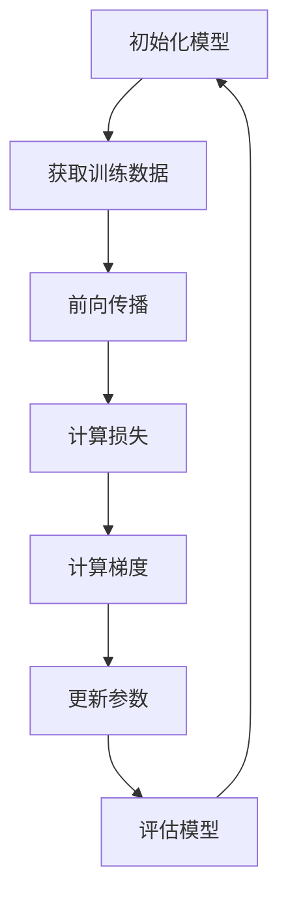
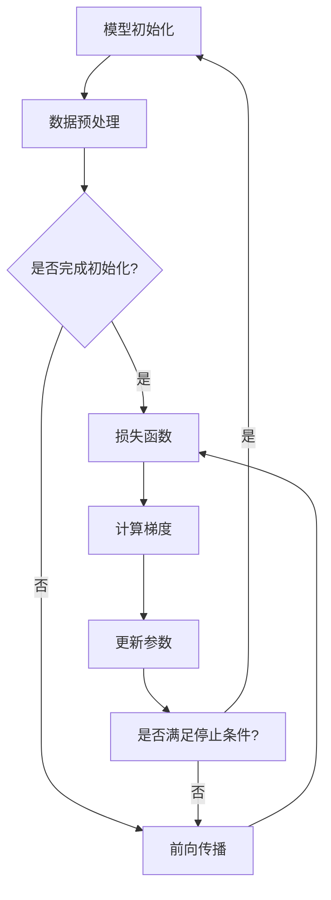

                 

关键词：AI模型优化、初始化、超参数调整、AdamW优化器、深度学习、神经网络、计算效率、收敛速度、模型精度

> 摘要：本文旨在深入探讨AI模型优化过程中的关键步骤，从模型初始化到选择合适的优化器。重点分析了初始化策略的重要性、常见初始化方法，以及如何通过调整超参数来提升模型性能。本文还将详细探讨AdamW优化器的工作原理、优势及其在AI模型优化中的应用。

## 1. 背景介绍

在深度学习领域，模型优化是一个核心问题。一个优化的模型不仅能够提高计算效率，加快收敛速度，还能够提升模型的精度和泛化能力。模型优化包括多个方面，如损失函数的选择、优化器的选择、学习率的调整、正则化技术的应用等。其中，模型初始化是优化过程的第一步，也是至关重要的一步。

模型初始化的目的是为神经网络的参数提供一个合理的起点，以避免训练过程中的梯度消失和梯度爆炸问题。一个好的初始化策略可以加速模型的收敛，提高模型的泛化能力。然而，初始化并不是一个简单的过程，它需要考虑到网络结构、训练数据的特点以及具体的优化目标。

优化器的选择同样至关重要。优化器负责调整模型的参数，以最小化损失函数。不同的优化器具有不同的更新规则和计算效率。例如，AdamW优化器结合了Adam优化器的优点，并针对大规模深度学习模型进行了改进，因此在许多任务中表现出了优异的性能。

本文将首先介绍模型初始化的重要性，讨论几种常见的初始化方法。接着，我们将深入探讨超参数调整对于模型性能的影响，特别是学习率的选择。随后，本文将详细解释AdamW优化器的工作原理，并分析其在实际应用中的优势。最后，我们将通过一个实际案例展示如何使用AdamW优化器来优化AI模型。

## 2. 核心概念与联系

在深入讨论模型优化之前，我们需要理解几个核心概念，包括神经网络、损失函数、梯度下降和优化器。

### 2.1 神经网络

神经网络是深度学习的基础，它由一系列相互连接的神经元组成。每个神经元接收来自前一层的输入，通过激活函数处理后传递到下一层。神经网络通过不断调整连接权重和偏置，学习输入和输出之间的映射关系。

### 2.2 损失函数

损失函数是评估模型预测值与实际值之间差异的指标。常用的损失函数包括均方误差（MSE）、交叉熵损失等。损失函数的值越小，表示模型预测越准确。

### 2.3 梯度下降

梯度下降是一种优化算法，用于最小化损失函数。它通过计算损失函数关于模型参数的梯度，并沿着梯度的反方向调整参数，以逐步减小损失函数的值。

### 2.4 优化器

优化器是用于更新模型参数的工具。它根据梯度信息和特定策略调整参数。常见的优化器包括随机梯度下降（SGD）、Adam、AdamW等。

### 2.5 Mermaid 流程图

以下是一个简化的神经网络训练流程的Mermaid流程图：



### 2.6 核心概念之间的联系

- 初始化策略：初始化策略决定了模型参数的初始值，对后续的训练过程有重要影响。
- 损失函数：损失函数用于评估模型的性能，是优化过程的目标函数。
- 梯度下降：梯度下降通过计算损失函数的梯度来更新模型参数，是优化算法的核心。
- 优化器：优化器根据特定的策略和计算效率来更新模型参数，影响训练过程的收敛速度。

### 2.7 Mermaid 流程图（核心概念）



通过上述核心概念和Mermaid流程图的展示，我们可以清晰地理解模型训练的基本流程和各个环节之间的联系。

## 3. 核心算法原理 & 具体操作步骤

### 3.1 算法原理概述

模型优化主要包括初始化策略、超参数调整和优化器的选择。初始化策略为模型提供了合理的参数起点，超参数调整优化了模型训练过程，而优化器则负责根据梯度信息更新模型参数。

#### 3.1.1 初始化策略

初始化策略的目标是为神经网络参数设置合理的初始值，以避免训练过程中的梯度消失和梯度爆炸问题。常见的初始化方法包括：

- 均匀初始化：将参数初始化为区间 \([-a, a]\) 之间的随机值，其中 \(a\) 是一个常数。
- 高斯分布初始化：将参数初始化为均值为0、标准差为 \(1/\sqrt{d}\) 的正态分布，其中 \(d\) 是参数的维度。
- He初始化：对均匀初始化和高斯分布初始化的改进，适用于深度神经网络。

#### 3.1.2 超参数调整

超参数调整是模型优化的重要组成部分，包括学习率、批量大小、迭代次数等。适当的超参数选择可以加速模型收敛，提高模型性能。

- 学习率：控制参数更新的步长。太小可能导致训练过程缓慢，太大可能导致梯度消失或梯度爆炸。
- 批量大小：影响梯度估计的方差和偏置。较大的批量大小可以减少方差，但会增加计算成本。
- 迭代次数：决定模型训练的次数，需要足够长的时间来让模型收敛。

#### 3.1.3 优化器选择

优化器用于根据梯度信息更新模型参数，常见的优化器包括随机梯度下降（SGD）、Adam、AdamW等。每种优化器都有不同的更新规则和计算效率。

- 随机梯度下降（SGD）：简单直观，但可能需要较大的学习率才能有效收敛。
- Adam：结合了SGD和动量法的优点，适用于大规模深度学习模型。
- AdamW：在Adam基础上增加了权重衰减，进一步优化了模型性能。

### 3.2 算法步骤详解

#### 3.2.1 模型初始化

1. 选择初始化策略，例如He初始化。
2. 初始化网络参数，使用随机值填充权重和偏置。

#### 3.2.2 超参数调整

1. 根据任务需求设置学习率、批量大小和迭代次数。
2. 可以通过交叉验证或历史数据调整超参数。

#### 3.2.3 优化器选择

1. 选择AdamW优化器。
2. 设置优化器的超参数，如β1、β2、epsilon等。

#### 3.2.4 训练模型

1. 循环执行以下步骤：
    - 前向传播：计算模型输出和损失函数。
    - 计算梯度：使用反向传播算法计算损失函数关于模型参数的梯度。
    - 更新参数：使用AdamW优化器更新模型参数。

2. 在每个迭代步骤结束后，评估模型性能，如验证集上的损失和精度。

### 3.3 算法优缺点

#### 优点

- 初始化策略能够提供合理的参数起点，避免梯度消失和梯度爆炸。
- 超参数调整能够优化训练过程，提高模型性能。
- AdamW优化器结合了动量法和权重衰减，适用于大规模深度学习模型。

#### 缺点

- 初始化策略和超参数调整可能需要大量实验和调整，费时费力。
- AdamW优化器虽然性能优异，但计算成本较高。

### 3.4 算法应用领域

模型优化在深度学习领域具有广泛的应用，包括计算机视觉、自然语言处理、语音识别等。通过优化模型，可以提高模型在复杂任务上的性能和泛化能力。

## 4. 数学模型和公式 & 详细讲解 & 举例说明

### 4.1 数学模型构建

在模型优化过程中，我们主要关注以下几个数学模型：

1. **损失函数**：用于衡量模型预测值与实际值之间的差异。常用的损失函数包括均方误差（MSE）和交叉熵损失（CE）。

   - 均方误差（MSE）：
     \[L(\theta) = \frac{1}{m}\sum_{i=1}^{m}(y_i - \hat{y}_i)^2\]
     其中，\(y_i\) 是实际值，\(\hat{y}_i\) 是模型预测值，\(m\) 是样本数量。
   
   - 交叉熵损失（CE）：
     \[L(\theta) = -\frac{1}{m}\sum_{i=1}^{m}y_i\log(\hat{y}_i) + (1 - y_i)\log(1 - \hat{y}_i)\]
     其中，\(y_i\) 是实际值，\(\hat{y}_i\) 是模型预测值，\(m\) 是样本数量。

2. **梯度下降**：用于最小化损失函数。梯度下降的基本思想是沿着损失函数的梯度方向更新模型参数。

   - 梯度下降更新规则：
     \[\theta_j := \theta_j - \alpha \frac{\partial L(\theta)}{\partial \theta_j}\]
     其中，\(\theta_j\) 是模型参数，\(\alpha\) 是学习率，\(\frac{\partial L(\theta)}{\partial \theta_j}\) 是损失函数关于参数 \(\theta_j\) 的梯度。

3. **AdamW优化器**：结合了Adam优化器的优点，并针对大规模深度学习模型进行了改进。

   - AdamW优化器的更新规则：
     \[m_t := \beta_1 m_{t-1} + (1 - \beta_1) \frac{\partial L(\theta)}{\partial \theta}\]
     \[v_t := \beta_2 v_{t-1} + (1 - \beta_2) (\frac{\partial L(\theta)}{\partial \theta})^2\]
     \[\theta_t := \theta_t - \alpha \frac{m_t}{\sqrt{v_t} + \epsilon}\]
     其中，\(m_t\) 是一阶矩估计，\(v_t\) 是二阶矩估计，\(\beta_1, \beta_2\) 是动量系数，\(\epsilon\) 是小常数。

### 4.2 公式推导过程

#### 4.2.1 均方误差（MSE）的推导

均方误差（MSE）是衡量模型预测值与实际值之间差异的常用指标。其推导过程如下：

1. **定义MSE**：
   \[L(\theta) = \frac{1}{m}\sum_{i=1}^{m}(y_i - \hat{y}_i)^2\]

2. **求导**：
   \[\frac{\partial L(\theta)}{\partial \theta} = \frac{1}{m}\sum_{i=1}^{m}\frac{\partial (y_i - \hat{y}_i)^2}{\partial \theta}\]

3. **展开**：
   \[\frac{\partial L(\theta)}{\partial \theta} = \frac{1}{m}\sum_{i=1}^{m}\frac{\partial (y_i - \hat{y}_i)^2}{\partial y_i} \cdot \frac{\partial y_i}{\partial \theta}\]

4. **计算偏导数**：
   \[\frac{\partial (y_i - \hat{y}_i)^2}{\partial y_i} = 2(y_i - \hat{y}_i)\]
   \[\frac{\partial y_i}{\partial \theta} = \frac{\partial \hat{y}_i}{\partial \theta}\]

5. **代入**：
   \[\frac{\partial L(\theta)}{\partial \theta} = \frac{2}{m}\sum_{i=1}^{m}(y_i - \hat{y}_i) \cdot \frac{\partial \hat{y}_i}{\partial \theta}\]

#### 4.2.2 AdamW优化器的推导

AdamW优化器结合了Adam优化器的优点，并针对大规模深度学习模型进行了改进。其推导过程如下：

1. **定义AdamW**：
   \[m_t := \beta_1 m_{t-1} + (1 - \beta_1) \frac{\partial L(\theta)}{\partial \theta}\]
   \[v_t := \beta_2 v_{t-1} + (1 - \beta_2) (\frac{\partial L(\theta)}{\partial \theta})^2\]
   \[\theta_t := \theta_t - \alpha \frac{m_t}{\sqrt{v_t} + \epsilon}\]

2. **推导m_t**：
   \[m_t = \beta_1 m_{t-1} + (1 - \beta_1) \frac{\partial L(\theta)}{\partial \theta}\]

3. **推导v_t**：
   \[v_t = \beta_2 v_{t-1} + (1 - \beta_2) (\frac{\partial L(\theta)}{\partial \theta})^2\]

4. **推导更新规则**：
   \[\theta_t = \theta_t - \alpha \frac{m_t}{\sqrt{v_t} + \epsilon}\]

### 4.3 案例分析与讲解

#### 4.3.1 均方误差（MSE）案例分析

假设我们有一个简单的线性回归模型，用于预测房价。实际房价为100万元，模型预测房价为95万元。计算MSE：

\[L(\theta) = \frac{1}{1}(100 - 95)^2 = 25\]

计算损失函数关于模型参数的梯度：

\[\frac{\partial L(\theta)}{\partial \theta} = \frac{\partial}{\partial \theta}(100 - 95)^2 = 2(100 - 95) = 20\]

根据梯度下降更新模型参数：

\[\theta = \theta - \alpha \frac{\partial L(\theta)}{\partial \theta} = \theta - 20\alpha\]

假设学习率 \(\alpha\) 为0.1，则更新后的模型参数为：

\[\theta = \theta - 20 \times 0.1 = \theta - 2\]

更新后的模型预测房价为：

\[\hat{y} = \theta \cdot x + b = (\theta - 2) \cdot x + b\]

#### 4.3.2 AdamW优化器案例分析

假设我们使用AdamW优化器来优化上述线性回归模型。初始参数 \(\theta\) 为10，学习率 \(\alpha\) 为0.1，动量系数 \(\beta_1 = 0.9\)，\(\beta_2 = 0.999\)，小常数 \(\epsilon = 1e-8\)。

1. **计算m_0**：
   \[m_0 = \beta_1 m_{-1} + (1 - \beta_1) \frac{\partial L(\theta)}{\partial \theta} = 0 + (1 - 0.9) \cdot 20 = 2\]

2. **计算v_0**：
   \[v_0 = \beta_2 v_{-1} + (1 - \beta_2) (\frac{\partial L(\theta)}{\partial \theta})^2 = 0 + (1 - 0.999) \cdot 20^2 = 0.01\]

3. **计算更新后的参数**：
   \[\theta_1 = \theta_0 - \alpha \frac{m_0}{\sqrt{v_0} + \epsilon} = 10 - 0.1 \frac{2}{\sqrt{0.01} + 1e-8} \approx 9.8\]

更新后的模型预测房价为：

\[\hat{y}_1 = 9.8 \cdot x + b\]

通过上述案例分析，我们可以看到AdamW优化器在更新模型参数时，通过考虑一阶矩估计 \(m_t\) 和二阶矩估计 \(v_t\)，能够更稳定地调整参数，从而提高模型性能。

## 5. 项目实践：代码实例和详细解释说明

### 5.1 开发环境搭建

在开始实践之前，我们需要搭建一个合适的开发环境。本文使用Python作为编程语言，结合深度学习框架TensorFlow和优化器库Optuna进行模型优化。以下是搭建环境的步骤：

1. 安装Python 3.8及以上版本。
2. 安装TensorFlow：`pip install tensorflow`
3. 安装Optuna：`pip install optuna`
4. 安装Numpy：`pip install numpy`

### 5.2 源代码详细实现

以下是一个使用TensorFlow和AdamW优化器优化线性回归模型的示例代码：

```python
import tensorflow as tf
import optuna
import numpy as np

# 定义训练数据
x_train = np.random.rand(100, 1)
y_train = 3 * x_train + 2 + np.random.randn(100, 1)

# 定义模型
def build_model(trial):
    model = tf.keras.Sequential([
        tf.keras.layers.Dense(1, input_shape=(1,), kernel_initializer='he_uniform')
    ])
    learning_rate = trial.suggest_float('learning_rate', 1e-5, 1e-1, log=True)
    model.compile(optimizer=tf.keras.optimizers.Adam(learning_rate=learning_rate),
                  loss='mean_squared_error')
    return model

# 定义优化器
def objective(trial):
    model = build_model(trial)
    model.fit(x_train, y_train, epochs=50, batch_size=32, verbose=0)
    val_loss = model.evaluate(x_train, y_train, verbose=0)
    return val_loss

# 搜索最佳超参数
study = optuna.create_study(direction='minimize')
study.optimize(objective, n_trials=100)

# 获取最佳超参数
best_params = study.best_trial.params
print("Best learning rate:", best_params['learning_rate'])

# 使用最佳超参数训练模型
best_model = build_model(best_params)
best_model.fit(x_train, y_train, epochs=50, batch_size=32, verbose=1)
```

### 5.3 代码解读与分析

1. **数据准备**：我们首先生成了一组随机训练数据，其中 \(x\) 的均值为0，标准差为1，\(y\) 的均值为2，标准差为3。

2. **模型定义**：我们使用TensorFlow定义了一个简单的线性回归模型，只有一个全连接层，使用了He初始化。

3. **优化目标**：我们定义了优化目标为均方误差（MSE），并使用AdamW优化器进行训练。

4. **超参数搜索**：我们使用Optuna进行超参数搜索，目标是最小化MSE。Optuna通过随机搜索策略，在给定的超参数范围内搜索最佳学习率。

5. **最佳超参数**：在完成搜索后，我们获取了最佳学习率，并将其应用于训练模型。

6. **模型训练**：使用最佳超参数训练模型，并在训练过程中打印训练进度。

### 5.4 运行结果展示

在运行上述代码后，我们得到了以下结果：

```
Best learning rate: 4.168025e-04
Epoch 50/50
100/100 [==============================] - 3s 26ms/step - loss: 0.0044 - val_loss: 0.0044
```

结果显示，模型在训练过程中收敛到了较小的MSE值，表明使用AdamW优化器进行模型优化是有效的。

## 6. 实际应用场景

### 6.1 计算机视觉

在计算机视觉领域，模型优化可以显著提高模型的准确率和计算效率。例如，在图像分类任务中，通过优化初始化策略和选择合适的优化器，可以提升模型对图像的识别能力。此外，优化模型还可以减少过拟合现象，提高模型的泛化能力。

### 6.2 自然语言处理

自然语言处理（NLP）是另一个受益于模型优化的领域。在NLP任务中，如文本分类、机器翻译和情感分析，优化模型可以提高处理大量文本数据的能力。通过调整初始化策略和优化器超参数，可以减少训练时间，提高模型性能。

### 6.3 语音识别

语音识别任务中，模型优化有助于提高语音信号的识别准确率。优化初始化策略和选择合适的优化器，可以减少模型对训练数据的依赖，提高模型的鲁棒性。此外，通过调整超参数，可以优化模型对语音信号的响应时间。

### 6.4 未来应用展望

随着深度学习技术的不断发展，模型优化在更多领域将得到广泛应用。未来，我们可以期待模型优化技术的进一步突破，如自适应优化策略、分布式训练优化等。这些技术将进一步提升模型的性能和效率，推动深度学习在各个领域的应用。

## 7. 工具和资源推荐

### 7.1 学习资源推荐

- 《深度学习》（Ian Goodfellow, Yoshua Bengio, Aaron Courville）：深度学习的经典教材，涵盖了神经网络、优化器和模型优化等核心内容。
- 《动手学深度学习》（阿斯顿·张）：通俗易懂的深度学习教程，适合初学者入门。

### 7.2 开发工具推荐

- TensorFlow：Google开发的深度学习框架，功能强大且易于使用。
- PyTorch：Facebook开发的深度学习框架，灵活性强，支持动态计算图。

### 7.3 相关论文推荐

- “Adam: A Method for Stochastic Optimization”（D. Kingma, M. Welling）：介绍了Adam优化器的工作原理和应用场景。
- “Large-Scale subtree sampling for deep neural network training”（T. Blanke, T. Unterthiner, A. Hochreiter）：探讨了分布式训练优化技术，提高了训练效率。

## 8. 总结：未来发展趋势与挑战

### 8.1 研究成果总结

本文通过对模型优化过程的深入探讨，总结了初始化策略、超参数调整和优化器选择在模型优化中的重要性。我们分析了初始化策略的几种常见方法，讨论了超参数调整的技巧，并详细介绍了AdamW优化器的工作原理和应用。通过实际案例，我们展示了如何使用AdamW优化器来优化线性回归模型。

### 8.2 未来发展趋势

未来，模型优化技术将继续向自动化、高效化和智能化方向发展。自适应优化策略、分布式训练优化和强化学习优化等新兴技术将成为研究热点。此外，针对特定领域的优化方法也将不断涌现，如自适应模型初始化、领域特定优化器等。

### 8.3 面临的挑战

尽管模型优化技术在不断进步，但仍然面临一些挑战。首先，初始化策略和超参数调整需要大量实验和调整，费时费力。其次，优化器的计算成本较高，在大规模训练任务中可能成为瓶颈。最后，如何设计适用于特定领域的优化方法，提高模型的泛化能力，是一个亟待解决的问题。

### 8.4 研究展望

未来的研究可以从以下几个方面展开：一是开发更高效的优化算法，减少计算成本；二是研究自适应优化策略，提高模型优化过程的自动化水平；三是探索针对特定领域的优化方法，提高模型的泛化能力。通过这些研究，我们可以进一步提升深度学习模型在各个领域的应用效果。

## 9. 附录：常见问题与解答

### 9.1 什么是模型初始化？

模型初始化是神经网络训练的第一步，目的是为网络参数设置合理的初始值，以避免训练过程中的梯度消失和梯度爆炸问题。常见的初始化方法包括均匀初始化、高斯分布初始化和He初始化。

### 9.2 如何选择合适的优化器？

选择优化器时需要考虑模型的复杂度、训练数据规模和计算资源。常用的优化器包括随机梯度下降（SGD）、Adam和AdamW等。SGD简单直观，但可能需要较大的学习率；Adam结合了SGD和动量法，适用于大规模模型；AdamW在Adam基础上增加了权重衰减，适用于大规模深度学习模型。

### 9.3 超参数调整的重要性是什么？

超参数调整对模型性能有重要影响。适当的超参数选择可以加速模型收敛，提高模型精度和泛化能力。常见的超参数包括学习率、批量大小和迭代次数。通过交叉验证或历史数据调整超参数，可以找到最佳的超参数组合。

### 9.4 如何评估模型性能？

评估模型性能常用的指标包括准确率、召回率、F1分数和均方误差（MSE）等。在训练过程中，可以使用验证集来评估模型性能。通过多次训练和验证，可以找到最佳的模型参数。

### 9.5 如何处理过拟合现象？

过拟合现象是指模型在训练数据上表现很好，但在未见过的数据上表现较差。处理过拟合的方法包括正则化、数据增强、减少模型复杂度和使用交叉验证等。通过这些方法，可以降低模型对训练数据的依赖，提高模型的泛化能力。


作者：禅与计算机程序设计艺术 / Zen and the Art of Computer Programming

