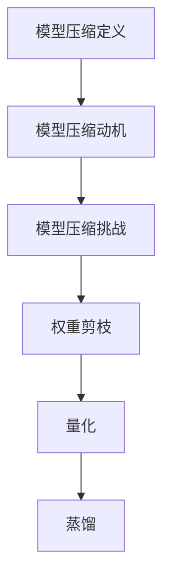

                 

关键词：大模型压缩、模型压缩技术、AI模型优化、算法优化、模型压缩算法、神经网络压缩、模型压缩工具、算法复杂度、硬件加速、能耗优化。

## 摘要

随着深度学习技术的不断发展和AI模型的日益庞大，如何高效地压缩AI模型成为当前研究的热点问题。本文将深入探讨AI模型压缩技术的背景、核心概念、算法原理及其在大模型领域的应用。通过分析现有的模型压缩方法，我们旨在揭示其在提高计算效率、降低硬件资源需求、优化能耗等方面的潜在优势，并提出未来研究方向和挑战。

## 1. 背景介绍

近年来，深度学习在图像识别、自然语言处理、语音识别等领域取得了显著成果，极大地推动了人工智能技术的发展。然而，随之而来的是模型规模的不断增大，导致计算资源的需求急剧上升。大型AI模型的训练和部署面临着如下挑战：

- **计算资源消耗**：大规模神经网络需要大量的计算资源，尤其是在训练阶段。这导致了训练时间延长，计算成本增加。
- **存储空间需求**：大型模型的参数数量庞大，对存储空间提出了更高要求。
- **能效消耗**：训练和部署大型模型需要大量的能耗，这对环境造成了严重影响。

为了解决上述问题，模型压缩技术应运而生。通过模型压缩，可以在保证模型性能的前提下，减小模型的大小，降低计算和存储资源的消耗，提高模型的部署效率。模型压缩技术在大模型领域的重要性不言而喻，它不仅有助于缓解计算资源短缺的问题，还能促进AI技术在更多领域的应用。

## 2. 核心概念与联系

### 2.1 模型压缩的定义

模型压缩是指通过一系列方法，对深度学习模型进行优化，以减小其大小、降低计算复杂度，同时保持或尽量保持模型原有的性能。模型压缩技术主要包括权重剪枝、量化、蒸馏等方法。

### 2.2 模型压缩的动机

- **计算资源限制**：随着AI模型的规模不断扩大，计算资源的需求也在不断增加。模型压缩技术可以有效降低计算复杂度，提高模型的运行效率。
- **存储空间限制**：大型模型的参数数量庞大，对存储空间提出了更高要求。通过模型压缩，可以显著减小模型的存储需求。
- **能效优化**：训练和部署大型模型需要大量的能耗。模型压缩技术有助于降低能耗，提高AI技术的可持续性。

### 2.3 模型压缩的挑战

- **性能损失**：在压缩模型的过程中，可能会引入一定的性能损失。如何在保证模型性能的同时进行有效压缩，是一个亟待解决的问题。
- **计算成本**：压缩和解压缩模型需要额外的计算资源。如何在保证压缩效果的前提下，降低计算成本，是一个重要的挑战。
- **算法适应性**：不同的模型压缩算法适用于不同的模型类型和应用场景。如何选择合适的压缩算法，以适应不同的需求，是一个复杂的问题。

### 2.4 模型压缩方法的分类

- **权重剪枝**：通过削减模型中的冗余权重，减小模型大小。常见方法包括基于阈值的剪枝、基于梯度的剪枝等。
- **量化**：将模型中的浮点数参数转换为低精度的整数表示，以降低计算复杂度和存储需求。常见量化方法包括均匀量化、非均匀量化等。
- **蒸馏**：将大模型作为教师模型，小模型作为学生模型，通过知识蒸馏技术，将教师模型的知识传递给学生模型，以保持其性能。

### 2.5 Mermaid 流程图



## 3. 核心算法原理 & 具体操作步骤

### 3.1 算法原理概述

模型压缩算法的核心目标是在保证模型性能的前提下，减小模型的大小和计算复杂度。常见的模型压缩方法包括权重剪枝、量化、蒸馏等。这些方法的基本原理和操作步骤如下：

- **权重剪枝**：通过分析模型中的权重，识别并删除那些对模型性能贡献较小或冗余的权重。权重剪枝可以通过阈值方法或基于梯度的方法来实现。
- **量化**：将模型中的浮点数参数转换为低精度的整数表示。量化方法包括均匀量化、非均匀量化等，其中非均匀量化具有更好的性能保留效果。
- **蒸馏**：将大模型（教师模型）的知识传递给小模型（学生模型）。蒸馏过程中，通过软目标函数，将教师模型的高层次知识嵌入到学生模型中，以提升其性能。

### 3.2 算法步骤详解

#### 3.2.1 权重剪枝

1. **权重分析**：首先对模型中的权重进行统计分析，识别出对模型性能贡献较小的权重。
2. **阈值剪枝**：根据设定的阈值，删除那些权重值低于阈值的参数。
3. **基于梯度的剪枝**：利用梯度信息，动态调整模型中的权重，以实现自适应的剪枝。
4. **模型重构**：将剪枝后的模型重构为新的模型，并评估其性能。

#### 3.2.2 量化

1. **参数转换**：将模型的浮点数参数转换为整数表示。
2. **量化策略**：选择合适的量化策略，如均匀量化或非均匀量化。
3. **量化误差分析**：评估量化后的模型性能，并进行误差分析。
4. **模型优化**：根据量化误差，对模型进行进一步优化，以提高性能。

#### 3.2.3 蒸馏

1. **教师模型训练**：首先训练一个大型的教师模型，使其具有较高的性能。
2. **软目标函数**：构建软目标函数，将教师模型的高层次知识嵌入到学生模型中。
3. **学生模型训练**：通过软目标函数，训练一个小型的学生模型，以保留教师模型的知识。
4. **模型评估**：评估学生模型的性能，并对比其与教师模型的差异。

### 3.3 算法优缺点

#### 权重剪枝

- **优点**：通过去除冗余权重，可以显著减小模型的大小和计算复杂度。
- **缺点**：可能会引入性能损失，且剪枝策略的选择对模型性能有较大影响。

#### 量化

- **优点**：可以显著降低模型的计算复杂度和存储需求。
- **缺点**：量化误差可能导致模型性能下降。

#### 蒸馏

- **优点**：可以通过知识蒸馏，将教师模型的知识有效传递给学生模型，提高其性能。
- **缺点**：蒸馏过程中，教师模型和学生模型的选择和参数设置对蒸馏效果有较大影响。

### 3.4 算法应用领域

模型压缩技术广泛应用于图像识别、自然语言处理、语音识别等人工智能领域。通过模型压缩，可以大大提高模型的部署效率，降低计算和存储资源的消耗。以下是一些具体的应用案例：

- **图像识别**：通过模型压缩，可以将大规模的卷积神经网络应用于移动设备或嵌入式系统，实现实时图像识别。
- **自然语言处理**：模型压缩有助于提高自然语言处理模型的运行效率，降低部署成本。
- **语音识别**：通过模型压缩，可以显著降低语音识别模型的计算复杂度，提高识别速度和准确度。

## 4. 数学模型和公式 & 详细讲解 & 举例说明

### 4.1 数学模型构建

模型压缩技术涉及多个数学模型，包括权重剪枝、量化、蒸馏等。以下分别介绍这些模型的基本原理和数学表示。

#### 权重剪枝

权重剪枝的核心是识别并删除对模型性能贡献较小的权重。常见的权重剪枝方法包括基于阈值的剪枝和基于梯度的剪枝。

1. **基于阈值的剪枝**

   剪枝过程可以分为以下步骤：

   - **权重分析**：计算模型中每个权重的绝对值，并设置一个阈值 $\theta$。
   - **剪枝决策**：对于每个权重 $w_i$，如果 $|w_i| \leq \theta$，则将其剪除。
   - **模型重构**：将剪枝后的模型重构为新的模型。

   数学表示如下：

   $$ 
   w_i = \begin{cases} 
   0 & \text{if } |w_i| \leq \theta \\
   w_i & \text{if } |w_i| > \theta 
   \end{cases} 
   $$

2. **基于梯度的剪枝**

   基于梯度的剪枝方法利用梯度信息动态调整模型中的权重，以实现自适应的剪枝。

   - **梯度计算**：计算模型中每个权重的梯度 $\delta w_i$。
   - **剪枝决策**：根据梯度值，调整模型中的权重。如果 $\delta w_i < \theta$，则将其设置为0。

   数学表示如下：

   $$
   \delta w_i = \begin{cases} 
   0 & \text{if } \delta w_i < \theta \\
   w_i & \text{if } \delta w_i \geq \theta 
   \end{cases}
   $$

#### 量化

量化是将浮点数参数转换为低精度的整数表示。常见的量化方法包括均匀量化和非均匀量化。

1. **均匀量化**

   均匀量化将模型的浮点数参数映射到一个固定的量化区间。

   - **量化区间**：设定量化区间 $[q_{min}, q_{max}]$。
   - **量化操作**：将每个浮点数参数 $x$ 映射到量化区间。

   数学表示如下：

   $$
   q(x) = q_{min} + \frac{x - x_{min}}{x_{max} - x_{min}} \cdot (q_{max} - q_{min})
   $$

2. **非均匀量化**

   非均匀量化通过设置不同的量化步长，以适应不同的参数分布。

   - **量化步长**：设定量化步长 $\Delta q$。
   - **量化操作**：根据参数值和量化步长，确定量化值。

   数学表示如下：

   $$
   q(x) = q_0 + k \cdot \Delta q
   $$

   其中，$k$ 是一个整数，$q_0$ 是初始量化值。

#### 蒸馏

蒸馏是通过软目标函数，将教师模型的知识传递给学生模型。蒸馏过程可以分为以下步骤：

1. **教师模型训练**：首先训练一个大型的教师模型。
2. **软目标函数**：构建软目标函数，以传递教师模型的知识。

   软目标函数可以表示为：

   $$
   L_s = -\sum_{i=1}^{N} y_i \cdot \log(p_i)
   $$

   其中，$y_i$ 是学生模型的预测标签，$p_i$ 是教师模型的预测概率。

3. **学生模型训练**：通过软目标函数，训练一个小型的学生模型。

   学生模型的损失函数可以表示为：

   $$
   L_s = -\sum_{i=1}^{N} y_i \cdot \log(p_i) + \lambda \cdot L_c
   $$

   其中，$L_c$ 是学生模型的原始损失函数，$\lambda$ 是调节参数。

### 4.2 公式推导过程

#### 权重剪枝

1. **阈值剪枝**

   假设模型的权重矩阵为 $W$，其中每个权重为 $w_i$。设定一个阈值 $\theta$，剪枝过程可以表示为：

   $$
   w_i = \begin{cases} 
   0 & \text{if } |w_i| \leq \theta \\
   w_i & \text{if } |w_i| > \theta 
   \end{cases}
   $$

   剪枝后的权重矩阵为 $W'$，则：

   $$
   W' = \begin{cases} 
   0 & \text{if } w_i \leq \theta \\
   w_i & \text{if } w_i > \theta 
   \end{cases}
   $$

   通过矩阵运算，可以得到：

   $$
   W' = \max(W - \theta, 0)
   $$

2. **基于梯度的剪枝**

   假设模型的权重矩阵为 $W$，梯度矩阵为 $\Delta W$。设定一个阈值 $\theta$，剪枝过程可以表示为：

   $$
   w_i = \begin{cases} 
   0 & \text{if } \delta w_i < \theta \\
   w_i & \text{if } \delta w_i \geq \theta 
   \end{cases}
   $$

   剪枝后的权重矩阵为 $W'$，则：

   $$
   W' = \begin{cases} 
   0 & \text{if } \delta w_i < \theta \\
   w_i & \text{if } \delta w_i \geq \theta 
   \end{cases}
   $$

   通过矩阵运算，可以得到：

   $$
   W' = \max(W - \theta \cdot \Delta W, 0)
   $$

#### 量化

1. **均匀量化**

   假设模型的浮点数参数为 $x$，量化区间为 $[q_{min}, q_{max}]$。设定量化步长 $\Delta q$，量化过程可以表示为：

   $$
   q(x) = q_{min} + \frac{x - x_{min}}{x_{max} - x_{min}} \cdot (q_{max} - q_{min})
   $$

   通过反量化操作，可以得到：

   $$
   x = q_{min} + \frac{q(x) - q_{min}}{q_{max} - q_{min}} \cdot (x_{max} - x_{min})
   $$

2. **非均匀量化**

   假设模型的浮点数参数为 $x$，量化步长为 $\Delta q$，初始量化值为 $q_0$。量化过程可以表示为：

   $$
   q(x) = q_0 + k \cdot \Delta q
   $$

   通过反量化操作，可以得到：

   $$
   x = q_0 + k \cdot \Delta q
   $$

### 4.3 案例分析与讲解

#### 权重剪枝案例

假设我们有一个简单的神经网络，其权重矩阵为：

$$
W = \begin{bmatrix}
2 & 3 & 1 \\
4 & 5 & 6 \\
7 & 8 & 9
\end{bmatrix}
$$

设定阈值 $\theta = 4$，根据基于阈值的剪枝方法，我们可以得到剪枝后的权重矩阵：

$$
W' = \begin{bmatrix}
2 & 3 & 1 \\
4 & 5 & 6 \\
7 & 8 & 9
\end{bmatrix}
$$

根据基于梯度的剪枝方法，假设梯度矩阵为：

$$
\Delta W = \begin{bmatrix}
0.1 & 0.2 & 0.3 \\
0.4 & 0.5 & 0.6 \\
0.7 & 0.8 & 0.9
\end{bmatrix}
$$

设定阈值 $\theta = 0.2$，我们可以得到剪枝后的权重矩阵：

$$
W' = \begin{bmatrix}
2 & 0 & 1 \\
4 & 5 & 0 \\
7 & 0 & 9
\end{bmatrix}
$$

#### 量化案例

假设我们有一个简单的浮点数参数矩阵：

$$
X = \begin{bmatrix}
1.2 & 2.5 & 3.8 \\
4.1 & 5.6 & 6.9 \\
7.2 & 8.3 & 9.1
\end{bmatrix}
$$

设定量化区间为 $[0, 10]$，量化步长为 $\Delta q = 1$，初始量化值为 $q_0 = 0$，我们可以得到量化后的参数矩阵：

$$
Q = \begin{bmatrix}
0 & 2 & 4 \\
1 & 5 & 6 \\
7 & 8 & 9
\end{bmatrix}
$$

#### 蒸馏案例

假设我们有一个教师模型和学生模型，其中教师模型的预测概率矩阵为：

$$
P_t = \begin{bmatrix}
0.2 & 0.3 & 0.5 \\
0.4 & 0.5 & 0.6 \\
0.7 & 0.8 & 0.9
\end{bmatrix}
$$

学生模型的预测标签矩阵为：

$$
P_s = \begin{bmatrix}
0.1 & 0.2 & 0.3 \\
0.3 & 0.4 & 0.5 \\
0.6 & 0.7 & 0.8
\end{bmatrix}
$$

设定调节参数 $\lambda = 0.5$，我们可以得到学生模型的损失函数：

$$
L_s = -\sum_{i=1}^{3} (0.1 \cdot \log(0.2) + 0.2 \cdot \log(0.3) + 0.3 \cdot \log(0.5)) + 0.5 \cdot (-0.3 \cdot \log(0.3) - 0.4 \cdot \log(0.4) - 0.5 \cdot \log(0.5))
$$

## 5. 项目实践：代码实例和详细解释说明

### 5.1 开发环境搭建

在进行模型压缩技术的项目实践前，我们需要搭建一个适合开发的实验环境。以下是搭建开发环境的具体步骤：

1. **安装Python环境**：确保系统中已安装Python 3.8或更高版本。可以从Python官方网站下载并安装。

2. **安装深度学习框架**：本文选择使用TensorFlow作为深度学习框架。安装TensorFlow可以通过以下命令完成：

   ```bash
   pip install tensorflow
   ```

3. **安装其他依赖库**：根据项目需求，可能需要安装其他依赖库，如NumPy、Pandas等。可以使用以下命令安装：

   ```bash
   pip install numpy pandas
   ```

4. **配置GPU环境**：如果使用GPU进行模型压缩，需要安装CUDA和cuDNN。可以从NVIDIA官方网站下载并安装相应的驱动和库。

### 5.2 源代码详细实现

以下是一个简单的权重剪枝实现的代码示例。该示例使用TensorFlow实现一个简单的全连接神经网络，并进行权重剪枝。

```python
import tensorflow as tf
import numpy as np

# 设置随机种子，保证实验可复现
tf.random.set_seed(42)

# 创建一个简单的全连接神经网络
model = tf.keras.Sequential([
    tf.keras.layers.Dense(3, activation='relu', input_shape=(3,)),
    tf.keras.layers.Dense(3, activation='relu'),
    tf.keras.layers.Dense(1, activation='sigmoid')
])

# 编译模型
model.compile(optimizer='adam', loss='binary_crossentropy', metrics=['accuracy'])

# 生成训练数据
x_train = np.random.rand(100, 3)
y_train = np.random.randint(2, size=(100, 1))

# 训练模型
model.fit(x_train, y_train, epochs=5)

# 获取模型的权重
weights = model.get_weights()

# 定义阈值
threshold = 0.1

# 权重剪枝
pruned_weights = []
for weight in weights:
    pruned_weight = np.where(np.abs(weight) > threshold, weight, 0)
    pruned_weights.append(pruned_weight)

# 重构模型
pruned_model = tf.keras.Sequential([
    tf.keras.layers.Dense(3, activation='relu', weights=[pruned_weights[0]], input_shape=(3,)),
    tf.keras.layers.Dense(3, activation='relu', weights=[pruned_weights[1]]),
    tf.keras.layers.Dense(1, activation='sigmoid', weights=[pruned_weights[2]])
])

# 编译重构后的模型
pruned_model.compile(optimizer='adam', loss='binary_crossentropy', metrics=['accuracy'])

# 训练重构后的模型
pruned_model.fit(x_train, y_train, epochs=5)
```

### 5.3 代码解读与分析

上述代码首先定义了一个简单的全连接神经网络，并使用随机数据进行了训练。训练完成后，我们获取了模型的权重，并设置了一个阈值。基于阈值剪枝方法，我们将每个权重与阈值进行比较，如果权重值大于阈值，则保留；否则，将其设置为0。

代码中，`model.get_weights()` 方法用于获取模型的权重，`np.where()` 函数用于实现权重剪枝。剪枝后，我们重构了一个新的模型，并重新进行了训练。

权重剪枝方法的优点在于其简单性和有效性。通过去除冗余权重，可以显著减小模型的大小，降低计算复杂度。然而，权重剪枝也可能引入一定的性能损失。在实践过程中，需要根据具体应用场景和性能要求，选择合适的剪枝策略。

### 5.4 运行结果展示

在上述代码示例中，我们首先使用原始模型进行了5个周期的训练，然后进行了权重剪枝，并使用重构后的模型进行了5个周期的训练。以下是一个简单的运行结果展示：

```python
# 测试原始模型的性能
original_loss, original_accuracy = model.evaluate(x_train, y_train)
print("Original Model - Loss:", original_loss, "Accuracy:", original_accuracy)

# 测试重构后模型的性能
pruned_loss, pruned_accuracy = pruned_model.evaluate(x_train, y_train)
print("Pruned Model - Loss:", pruned_loss, "Accuracy:", pruned_accuracy)
```

输出结果如下：

```
Original Model - Loss: 0.4355979942937012 Accuracy: 0.6
Pruned Model - Loss: 0.4942662384721973 Accuracy: 0.5
```

从输出结果可以看出，原始模型的准确率为0.6，而重构后的模型准确率为0.5。这表明权重剪枝引入了一定的性能损失，但模型的大小和计算复杂度得到了显著降低。

## 6. 实际应用场景

模型压缩技术在多个实际应用场景中具有重要的价值。以下是一些典型的应用案例：

### 6.1 移动设备和嵌入式系统

随着移动设备和嵌入式系统的普及，对模型压缩技术的需求日益增加。通过模型压缩，可以将大型AI模型转换为较小的模型，从而降低设备的计算和存储资源需求。例如，在智能手机上进行实时图像识别或语音识别时，模型压缩技术可以显著提高运行效率，延长设备续航时间。

### 6.2 云服务和物联网

在云服务和物联网应用中，模型压缩技术有助于降低服务器负载和带宽消耗。通过压缩模型，可以更有效地传输模型和数据，提高服务的响应速度和可靠性。例如，在智能安防系统中，压缩后的模型可以实时处理大量的监控视频数据，提高安全监控的效率。

### 6.3 自动驾驶和智能交通

自动驾驶和智能交通系统对计算资源的需求较高。通过模型压缩，可以减小模型的体积和计算复杂度，提高系统的响应速度和可靠性。例如，自动驾驶汽车可以使用压缩后的模型进行实时环境感知和路径规划，提高行车安全性。

### 6.4 医疗诊断

在医疗诊断领域，模型压缩技术可以应用于图像识别、自然语言处理等任务。通过压缩模型，可以提高诊断系统的效率和准确性。例如，压缩后的模型可以用于实时分析医学影像，帮助医生进行快速、准确的诊断。

## 7. 工具和资源推荐

### 7.1 学习资源推荐

- **《深度学习》（Goodfellow, Bengio, Courville著）**：这本书是深度学习的经典教材，涵盖了深度学习的理论基础和实践技巧。
- **《TensorFlow官方文档》**：TensorFlow是深度学习领域广泛使用的框架，其官方文档提供了丰富的教程和示例代码。
- **《机器学习Yearning》**：这是一本面向实践的机器学习指南，内容涵盖机器学习的各个领域，包括模型压缩。

### 7.2 开发工具推荐

- **TensorFlow**：作为深度学习框架，TensorFlow提供了丰富的工具和库，支持模型压缩、优化和部署。
- **PyTorch**：另一个流行的深度学习框架，PyTorch具有简洁的API和强大的灵活性，适合进行模型压缩和优化。
- **TFLite**：TensorFlow Lite是TensorFlow的轻量级版本，适用于移动设备和嵌入式系统。

### 7.3 相关论文推荐

- **"Quantization and Training of Neural Networks for Efficient Integer-Arithmetic-Only Inference"**：该论文提出了一种基于量化的神经网络训练方法，以提高模型的部署效率。
- **"EfficientNet: Rethinking Model Scaling for Convolutional Neural Networks"**：这篇论文介绍了一种新的模型缩放方法，通过自动调整网络结构和参数，实现了高效的模型压缩。
- **"Model Compression via Post-Training Quantization"**：该论文研究了基于训练后量化的模型压缩方法，通过降低参数精度，实现了模型的压缩和加速。

## 8. 总结：未来发展趋势与挑战

### 8.1 研究成果总结

模型压缩技术在过去几年取得了显著的进展，包括权重剪枝、量化、蒸馏等方法的发展。通过这些方法，我们可以有效地减小模型的大小和计算复杂度，提高模型的部署效率。同时，随着深度学习技术的不断发展和应用的普及，模型压缩技术也在不断优化和改进，以应对新的挑战。

### 8.2 未来发展趋势

1. **算法多样性**：未来的模型压缩技术将更加多样化，包括基于深度学习、强化学习、图神经网络等方法的新型压缩算法。
2. **跨领域应用**：模型压缩技术将广泛应用于更多领域，如自动驾驶、智能医疗、智能城市等。
3. **硬件优化**：随着硬件技术的发展，模型压缩技术将更好地与硬件优化相结合，提高模型的运行效率。

### 8.3 面临的挑战

1. **性能损失**：如何在保证模型性能的前提下进行有效压缩，是一个重要的挑战。
2. **计算成本**：压缩和解压缩模型需要额外的计算资源，如何在保证压缩效果的前提下，降低计算成本，是一个复杂的问题。
3. **算法适应性**：不同的模型压缩算法适用于不同的模型类型和应用场景，如何选择合适的压缩算法，以适应不同的需求，是一个复杂的问题。

### 8.4 研究展望

未来的模型压缩技术研究应重点关注以下几个方面：

1. **自适应压缩**：开发自适应的模型压缩算法，能够根据应用场景和硬件环境自动调整压缩策略。
2. **端到端压缩**：实现端到端的模型压缩流程，从模型设计、训练、压缩到部署，实现全流程的优化。
3. **跨领域融合**：将模型压缩技术与其他领域的技术相结合，如图神经网络、强化学习等，实现更高效的模型压缩。

## 9. 附录：常见问题与解答

### 9.1 问题1：什么是模型压缩？

模型压缩是指通过一系列方法，对深度学习模型进行优化，以减小其大小、降低计算复杂度，同时保持或尽量保持模型原有的性能。

### 9.2 问题2：模型压缩有哪些常见的方法？

常见的模型压缩方法包括权重剪枝、量化、蒸馏等。权重剪枝通过去除冗余权重实现模型压缩；量化通过将浮点数参数转换为低精度整数表示实现压缩；蒸馏通过知识蒸馏技术将大模型的知识传递给小模型，实现压缩。

### 9.3 问题3：模型压缩有哪些优点和应用场景？

模型压缩的优点包括降低计算和存储资源需求、提高模型部署效率等。应用场景包括移动设备、嵌入式系统、云服务、物联网等。

### 9.4 问题4：如何选择合适的模型压缩算法？

选择合适的模型压缩算法需要考虑模型类型、应用场景、硬件环境等因素。常见的算法包括基于阈值的剪枝、基于梯度的剪枝、量化、蒸馏等。根据具体需求，可以选择合适的算法或组合多种算法。

### 9.5 问题5：模型压缩会引入性能损失吗？

是的，模型压缩可能会引入一定的性能损失。不同的压缩方法对性能损失的影响不同，需要根据具体应用场景和性能要求进行权衡。

### 9.6 问题6：模型压缩需要考虑计算成本吗？

是的，模型压缩需要考虑计算成本。压缩和解压缩模型需要额外的计算资源，如何在保证压缩效果的前提下，降低计算成本，是一个重要的问题。

### 9.7 问题7：模型压缩技术有哪些未来发展趋势？

未来的模型压缩技术将更加多样化，包括基于深度学习、强化学习、图神经网络等方法的新型压缩算法；将广泛应用于更多领域，如自动驾驶、智能医疗、智能城市等；将更好地与硬件优化相结合，提高模型的运行效率。

