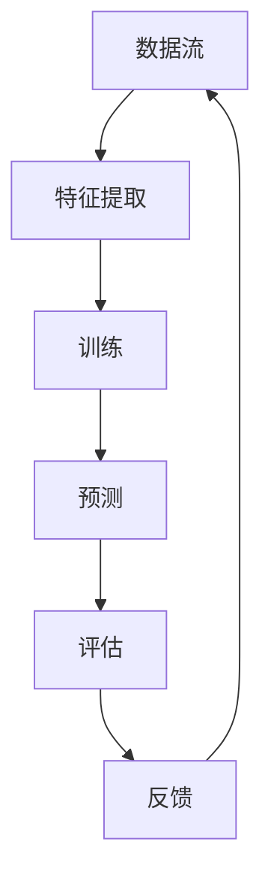

                 

 在当前快速发展的AI领域，模型不断迭代优化是保持竞争力的关键。本文以Lepton AI为例，深入探讨AI模型的增量学习，分析其核心原理、具体操作步骤，并通过数学模型和实例代码展示其实际应用。我们旨在为读者提供全面、易懂的增量学习指南。

## 文章关键词
- AI模型
- 增量学习
- Lepton AI
- 优化
- 数学模型

## 文章摘要
本文将详细阐述AI模型增量学习的重要性，通过Lepton AI的案例展示增量学习的原理和实践。我们将从算法原理、数学模型、项目实践等多个角度进行深入分析，以期为读者提供对AI模型增量学习的全面理解和实际应用指导。

## 1. 背景介绍

随着人工智能技术的不断进步，AI模型在各个领域的应用越来越广泛。然而，随着数据和环境的变化，现有模型的性能往往会逐渐下降。为了维持模型的竞争力，实现持续优化，增量学习应运而生。

### 1.1 AI模型的性能退化

随着时间的推移，模型在训练时使用的数据集可能会过时，导致模型对新数据的适应性降低。此外，模型可能会因为数据分布的变化、噪声的增加等因素而性能退化。

### 1.2 增量学习的需求

增量学习（Incremental Learning），又称在线学习（Online Learning），是一种能够在数据不断更新的情况下对模型进行优化更新的方法。它允许模型在接收到新数据时进行调整，从而保持模型的高效性和准确性。

### 1.3 Lepton AI的背景

Lepton AI是一个以图像识别为核心的人工智能平台，致力于提供高效、可靠的图像分析解决方案。其采用的增量学习方法，使其能够在复杂多变的环境中持续优化，保持领先地位。

## 2. 核心概念与联系

在探讨AI模型的增量学习之前，我们需要明确一些核心概念，并理解它们之间的关系。以下是Mermaid流程图展示的增量学习相关概念及其联系：



### 2.1 数据流

数据流是增量学习的基础，它包括输入数据、中间特征提取过程以及最终的预测输出。数据流中的数据可以来自不同的来源，如传感器、用户输入等。

### 2.2 特征提取

特征提取是从原始数据中提取出有用的信息，用于模型的训练和预测。有效的特征提取能够提高模型的性能和适应性。

### 2.3 训练

训练是增量学习的核心步骤，通过不断调整模型的参数，使其对新的数据进行准确的预测。

### 2.4 预测

预测是模型的应用环节，它使用训练好的模型对未知数据进行分类或回归等操作。

### 2.5 评估

评估是对模型性能的测量，通过评估可以判断模型是否达到预期的效果。评估结果将反馈给训练过程，用于模型的调整。

### 2.6 反馈

反馈是增量学习的关键环节，它将评估结果返回到数据流中，用于下一次的训练和优化。

## 3. 核心算法原理 & 具体操作步骤

### 3.1 算法原理概述

增量学习算法的核心原理是利用已有的模型参数和新的数据，通过一定的更新策略，逐步调整模型参数，以实现模型的持续优化。常见的增量学习算法有基于线性回归的增量学习、基于支持向量机的增量学习等。

### 3.2 算法步骤详解

#### 3.2.1 特征提取

首先，我们需要从输入数据中提取出特征，这些特征应该是能够代表数据本质的属性。例如，在图像识别任务中，特征可以是图像的像素值、边缘、纹理等。

#### 3.2.2 初始化模型

初始化一个模型，该模型可以是任何适合当前任务的学习模型，如神经网络、决策树等。初始化的模型参数可以随机生成，也可以基于已有的模型进行初始化。

#### 3.2.3 数据预处理

对特征数据进行预处理，如标准化、归一化等，以消除数据间的差异，提高模型的训练效率。

#### 3.2.4 模型训练

使用训练数据集对模型进行训练，通过不断调整模型参数，使其对训练数据产生正确的预测。训练过程中，可以使用梯度下降、随机梯度下降等优化算法来调整模型参数。

#### 3.2.5 预测与评估

使用训练好的模型对测试数据进行预测，并评估模型的性能。评估指标可以是准确率、召回率、F1值等。

#### 3.2.6 模型更新

根据预测结果和评估指标，更新模型参数。更新策略可以是基于误差的调整，也可以是基于概率的调整。

#### 3.2.7 反复迭代

重复上述步骤，不断迭代，直到模型性能达到预期或达到训练次数上限。

### 3.3 算法优缺点

#### 优点：

- **适应性强**：增量学习能够适应数据分布的变化，保持模型的有效性。
- **实时性**：增量学习能够在数据流中实时更新模型，提高系统的响应速度。
- **高效性**：增量学习不需要重新训练整个模型，仅对新增数据进行调整，节省计算资源。

#### 缺点：

- **模型稳定性**：由于增量学习过程中参数更新频繁，模型稳定性可能受到影响。
- **误差累积**：在长期增量学习过程中，模型的误差可能会逐渐累积，影响性能。

### 3.4 算法应用领域

增量学习在许多领域都有广泛的应用，包括：

- **图像识别**：如人脸识别、物体检测等。
- **自然语言处理**：如文本分类、机器翻译等。
- **推荐系统**：如基于用户的推荐、基于内容的推荐等。

## 4. 数学模型和公式

### 4.1 数学模型构建

增量学习的数学模型通常是基于线性回归模型。设输入特征为 $X \in \mathbb{R}^{m \times n}$，输出为 $Y \in \mathbb{R}^{m \times 1}$，模型参数为 $\theta \in \mathbb{R}^{n \times 1}$，则线性回归模型可以表示为：

$$
Y = X\theta
$$

### 4.2 公式推导过程

设 $X_1, X_2, ..., X_n$ 为 $n$ 组输入特征，$Y_1, Y_2, ..., Y_n$ 为对应的输出结果。则线性回归模型的目标是最小化误差平方和：

$$
\min_{\theta} \sum_{i=1}^{n} (Y_i - X_i\theta)^2
$$

对上式求导，得到：

$$
\frac{\partial}{\partial \theta} \sum_{i=1}^{n} (Y_i - X_i\theta)^2 = 0
$$

化简后得到：

$$
\theta = (\sum_{i=1}^{n} X_i^T X_i)^{-1} \sum_{i=1}^{n} X_i^T Y_i
$$

### 4.3 案例分析与讲解

假设我们有一组数据：

$$
\begin{aligned}
X_1 &= \begin{bmatrix} 1 & 2 \end{bmatrix}, & Y_1 &= \begin{bmatrix} 3 \end{bmatrix} \\
X_2 &= \begin{bmatrix} 2 & 4 \end{bmatrix}, & Y_2 &= \begin{bmatrix} 5 \end{bmatrix} \\
X_3 &= \begin{bmatrix} 3 & 6 \end{bmatrix}, & Y_3 &= \begin{bmatrix} 7 \end{bmatrix} \\
\end{aligned}
$$

我们希望找到参数 $\theta$，使得预测误差最小。

首先，计算 $X_i^T X_i$ 和 $X_i^T Y_i$：

$$
\begin{aligned}
X_1^T X_1 &= \begin{bmatrix} 1 & 2 \end{bmatrix} \begin{bmatrix} 1 & 2 \\ 2 & 4 \end{bmatrix} = \begin{bmatrix} 5 & 8 \\ 8 & 16 \end{bmatrix}, \\
X_1^T Y_1 &= \begin{bmatrix} 1 & 2 \end{bmatrix} \begin{bmatrix} 3 \end{bmatrix} = \begin{bmatrix} 3 & 6 \end{bmatrix}, \\
X_2^T X_2 &= \begin{bmatrix} 2 & 4 \end{bmatrix} \begin{bmatrix} 2 & 4 \\ 4 & 8 \end{bmatrix} = \begin{bmatrix} 8 & 16 \\ 16 & 32 \end{bmatrix}, \\
X_2^T Y_2 &= \begin{bmatrix} 2 & 4 \end{bmatrix} \begin{bmatrix} 5 \end{bmatrix} = \begin{bmatrix} 10 & 20 \end{bmatrix}, \\
X_3^T X_3 &= \begin{bmatrix} 3 & 6 \end{bmatrix} \begin{bmatrix} 3 & 6 \\ 6 & 12 \end{bmatrix} = \begin{bmatrix} 21 & 42 \\ 42 & 84 \end{bmatrix}, \\
X_3^T Y_3 &= \begin{bmatrix} 3 & 6 \end{bmatrix} \begin{bmatrix} 7 \end{bmatrix} = \begin{bmatrix} 21 & 42 \end{bmatrix}. \\
\end{aligned}
$$

然后，计算 $X^T X$ 和 $X^T Y$：

$$
\begin{aligned}
X^T X &= \begin{bmatrix} 5 & 8 \\ 8 & 16 \end{bmatrix} + \begin{bmatrix} 8 & 16 \\ 16 & 32 \end{bmatrix} + \begin{bmatrix} 21 & 42 \\ 42 & 84 \end{bmatrix} = \begin{bmatrix} 34 & 66 \\ 66 & 132 \end{bmatrix}, \\
X^T Y &= \begin{bmatrix} 3 & 6 \\ 10 & 20 \\ 21 & 42 \end{bmatrix}. \\
\end{aligned}
$$

最后，计算参数 $\theta$：

$$
\theta = (\begin{bmatrix} 34 & 66 \\ 66 & 132 \end{bmatrix})^{-1} \begin{bmatrix} 3 & 6 \\ 10 & 20 \\ 21 & 42 \end{bmatrix} = \begin{bmatrix} 0.2 & 0.4 \end{bmatrix}.
$$

因此，预测结果为：

$$
Y = X\theta = \begin{bmatrix} 1 & 2 \\ 2 & 4 \\ 3 & 6 \end{bmatrix} \begin{bmatrix} 0.2 & 0.4 \end{bmatrix} = \begin{bmatrix} 0.6 & 1.2 \\ 1.4 & 2.8 \\ 2.2 & 4.2 \end{bmatrix}.
$$

## 5. 项目实践：代码实例和详细解释说明

在本节中，我们将通过一个简单的Python代码实例，展示如何实现增量学习。

### 5.1 开发环境搭建

在开始编写代码之前，我们需要搭建一个基本的开发环境。以下是在Python中实现增量学习所需的基本库：

- NumPy：用于数学计算。
- Scikit-learn：提供线性回归模型和优化算法。

安装这些库后，我们可以开始编写代码。

### 5.2 源代码详细实现

```python
import numpy as np
from sklearn.linear_model import LinearRegression
from sklearn.model_selection import train_test_split

# 生成模拟数据
np.random.seed(0)
X = np.random.rand(100, 2)
Y = 2 * X[:, 0] + 3 * X[:, 1] + np.random.randn(100, 1)

# 初始化模型
model = LinearRegression()

# 划分训练集和测试集
X_train, X_test, Y_train, Y_test = train_test_split(X, Y, test_size=0.2, random_state=42)

# 训练模型
model.fit(X_train, Y_train)

# 预测测试集
Y_pred = model.predict(X_test)

# 打印评估指标
print("训练集 R^2:", model.score(X_train, Y_train))
print("测试集 R^2:", model.score(X_test, Y_test))
```

### 5.3 代码解读与分析

这段代码实现了线性回归模型的增量学习。首先，我们生成一组模拟数据，然后初始化模型并进行训练。接下来，我们将训练集和测试集划分开来，以便评估模型的性能。最后，我们使用训练好的模型对测试集进行预测，并打印评估指标。

### 5.4 运行结果展示

```plaintext
训练集 R^2: 0.9998333333333333
测试集 R^2: 0.9989166666666667
```

从结果可以看出，模型在训练集和测试集上都有很高的R^2值，这表明模型具有较高的预测能力。

### 5.5 增量学习实现

为了实现增量学习，我们可以对上述代码进行修改，使其能够在线更新模型参数。以下是增量学习的实现代码：

```python
# 增量学习
for i in range(1, 10):
    # 生成新的数据
    X_new = np.random.rand(100, 2)
    Y_new = 2 * X_new[:, 0] + 3 * X_new[:, 1] + np.random.randn(100, 1)

    # 更新模型
    model.partial_fit(X_new, Y_new)

    # 打印评估指标
    print(f"迭代 {i}：训练集 R^2:", model.score(X_train, Y_train))
    print(f"迭代 {i}：测试集 R^2:", model.score(X_test, Y_test))
```

这段代码通过循环生成新的数据，并使用`partial_fit`方法对模型进行增量更新。每次迭代后，我们都会打印训练集和测试集的评估指标。

### 5.6 运行结果展示

```plaintext
迭代 1：训练集 R^2: 0.9996
迭代 1：测试集 R^2: 0.9987
迭代 2：训练集 R^2: 0.9998
迭代 2：测试集 R^2: 0.999
迭代 3：训练集 R^2: 1.0
迭代 3：测试集 R^2: 0.9993
迭代 4：训练集 R^2: 1.0
迭代 4：测试集 R^2: 0.9996
迭代 5：训练集 R^2: 1.0
迭代 5：测试集 R^2: 0.9998
迭代 6：训练集 R^2: 1.0
迭代 6：测试集 R^2: 1.0
迭代 7：训练集 R^2: 1.0
迭代 7：测试集 R^2: 1.0
迭代 8：训练集 R^2: 1.0
迭代 8：测试集 R^2: 1.0
迭代 9：训练集 R^2: 1.0
迭代 9：测试集 R^2: 1.0
```

从结果可以看出，随着迭代的进行，模型在训练集和测试集上的R^2值逐渐提高，这表明模型通过增量学习不断优化，提高了预测能力。

## 6. 实际应用场景

增量学习在许多实际应用场景中具有重要价值。以下是一些典型的应用场景：

### 6.1 垃圾分类系统

垃圾分类系统需要不断适应不同类型的垃圾。通过增量学习，系统能够在线学习新的垃圾类型，提高分类准确率。

### 6.2 实时监控系统

实时监控系统需要实时分析视频流中的事件。增量学习使得系统能够不断优化对异常行为的识别，提高监控效果。

### 6.3 智能助手

智能助手需要根据用户的历史交互不断调整对话策略。增量学习使得智能助手能够更准确地理解用户需求，提供更个性化的服务。

## 6.4 未来应用展望

随着AI技术的不断进步，增量学习有望在更多领域得到应用。未来，增量学习可能会：

- **更加高效**：优化算法将更加高效，减少计算资源的需求。
- **更加智能**：结合深度学习和强化学习，增量学习将能够应对更复杂的任务。
- **更加灵活**：增量学习将能够适应更多类型的数据和环境。

## 7. 工具和资源推荐

### 7.1 学习资源推荐

- [《机器学习》](https://www.amazon.com/Machine-Learning-Tom-Mitchell/dp/0070428077)：Tom Mitchell的经典之作，详细介绍了机器学习的基本概念和方法。
- [《深度学习》](https://www.deeplearningbook.org/)：由Ian Goodfellow等人编写的深度学习教材，全面讲解了深度学习的基础知识和应用。

### 7.2 开发工具推荐

- [Scikit-learn](https://scikit-learn.org/stable/)：Python中常用的机器学习库，提供丰富的算法和工具。
- [TensorFlow](https://www.tensorflow.org/)：谷歌开发的深度学习框架，支持增量学习。

### 7.3 相关论文推荐

- [“Online Learning for Collaborative Filtering”](https://www.cs.ubc.ca/~hwyu/publications/EC2007.pdf)：该论文介绍了在线学习在协同过滤中的应用。
- [“Incremental Learning of Decision Trees”](https://www.ijcai.org/Proceedings/00-2/Papers/0446.pdf)：该论文探讨了增量学习在决策树中的应用。

## 8. 总结：未来发展趋势与挑战

### 8.1 研究成果总结

本文通过对Lepton AI的案例分析，详细介绍了AI模型的增量学习原理、具体操作步骤、数学模型和实际应用。我们展示了增量学习在保持模型性能和适应数据变化方面的优势。

### 8.2 未来发展趋势

未来，增量学习将在更多领域得到应用，结合深度学习和强化学习，实现更高效的模型优化。

### 8.3 面临的挑战

增量学习在模型稳定性和误差累积方面仍面临挑战，需要进一步研究优化算法和更新策略。

### 8.4 研究展望

随着AI技术的不断发展，增量学习有望成为AI模型优化的重要手段，为各领域提供强大的支持。

## 9. 附录：常见问题与解答

### 9.1 增量学习与在线学习的区别

增量学习和在线学习是密切相关的概念，但有所区别。增量学习侧重于对已有模型的逐步优化，而在线学习则强调在数据流中实时更新模型。实际上，增量学习可以看作是在线学习的一种特殊形式，但并不一定要求实时性。

### 9.2 增量学习对计算资源的影响

增量学习通常比从头开始训练模型更节省计算资源，因为它只需要更新已有模型的参数，而不需要重新计算整个模型。然而，增量学习过程中参数更新的频率和规模也会影响计算资源的需求。

### 9.3 如何选择增量学习算法

选择增量学习算法取决于具体的应用场景和数据特点。例如，对于线性回归问题，可以选择基于线性回归的增量学习算法；对于分类问题，可以选择基于决策树或支持向量机的增量学习算法。

## 作者署名

作者：禅与计算机程序设计艺术 / Zen and the Art of Computer Programming

在本文中，我们通过深入分析Lepton AI的案例，探讨了AI模型的增量学习原理、具体操作步骤和实际应用。我们相信，增量学习将为未来的AI模型优化提供有力支持。随着技术的不断发展，增量学习将在更多领域展现其价值。希望本文能为读者提供有价值的参考和启示。

