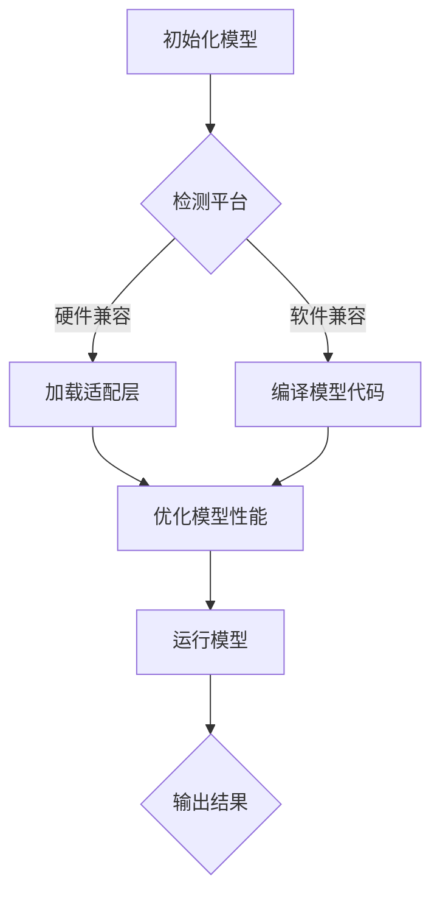

                 

关键词：AI模型，跨平台兼容，Lepton AI，适配方案，AI发展

> 摘要：本文旨在探讨AI模型的跨平台兼容性，特别是在Lepton AI框架下的适配方案。通过分析现有问题、介绍适配原理和具体实现，本文为AI开发者提供了实用的指导。

## 1. 背景介绍

随着人工智能（AI）技术的迅猛发展，AI模型的应用日益广泛。然而，不同平台之间的兼容性问题成为限制AI应用扩展的一个重要因素。尤其是在移动设备、嵌入式系统、云计算等不同环境下，AI模型的部署和运行面临着巨大的挑战。

Lepton AI是一款致力于解决AI模型跨平台兼容性问题的框架。它通过提供一套统一的API和底层适配层，使得开发者能够轻松地将AI模型部署到不同平台。本文将详细探讨Lepton AI的适配方案，为AI模型的跨平台兼容性提供实用的解决方案。

## 2. 核心概念与联系

### 2.1 AI模型兼容性问题

在不同平台上部署AI模型时，兼容性问题主要表现在以下几个方面：

- **硬件差异**：不同平台具有不同的处理器架构和硬件资源，这可能导致AI模型在运行时出现性能差异。
- **操作系统差异**：不同操作系统提供的API和功能可能不同，这会影响AI模型的编译和运行。
- **编程语言差异**：不同平台使用的编程语言和工具链可能不同，这需要开发者对代码进行大量修改以适应新平台。

### 2.2 Lepton AI适配原理

Lepton AI通过以下原理实现AI模型的跨平台兼容：

- **统一的API**：Lepton AI提供了一套统一的API，使得开发者可以使用相同的代码在不同平台上进行模型开发和部署。
- **底层适配层**：Lepton AI在底层实现了一套适配层，针对不同平台的具体特性进行优化，以确保模型在不同平台上的高性能运行。

### 2.3 Mermaid流程图

以下是一个简化的Mermaid流程图，展示了Lepton AI适配过程的概览：



## 3. 核心算法原理 & 具体操作步骤

### 3.1 算法原理概述

Lepton AI的适配过程主要包括以下几个步骤：

1. **初始化模型**：开发者首先需要选择一个预训练的AI模型，并对其进行初始化。
2. **检测平台**：Lepton AI会检测当前运行平台的具体特性，包括硬件和操作系统。
3. **加载适配层**：根据平台特性，Lepton AI会加载相应的适配层，对模型进行优化。
4. **编译模型代码**：适配层会对模型代码进行编译，确保代码可以在目标平台上运行。
5. **优化模型性能**：通过调整模型参数和优化编译结果，提高模型在目标平台上的运行性能。
6. **运行模型**：编译后的模型将在目标平台上运行，并输出预测结果。

### 3.2 算法步骤详解

#### 3.2.1 初始化模型

在初始化模型时，开发者需要提供以下信息：

- **模型架构**：包括神经网络结构、层数、激活函数等。
- **预训练权重**：可以从开源社区获取预训练权重，或使用自己的训练数据重新训练模型。
- **训练参数**：包括学习率、迭代次数、批量大小等。

#### 3.2.2 检测平台

Lepton AI通过以下方式检测当前平台：

- **硬件检测**：通过系统调用获取CPU和GPU的信息，包括型号、架构、内存大小等。
- **操作系统检测**：通过系统调用获取操作系统的类型、版本、内核版本等。

#### 3.2.3 加载适配层

根据平台检测结果，Lepton AI会加载相应的适配层。适配层的主要功能包括：

- **硬件优化**：针对不同硬件架构进行性能优化，例如使用特定指令集、减少内存占用等。
- **软件优化**：根据操作系统特性进行代码调整，例如使用特定API、兼容性处理等。

#### 3.2.4 编译模型代码

编译模型代码时，适配层会对源代码进行转换和优化。具体步骤如下：

1. **语法检查**：确保源代码符合目标平台的编程语言规范。
2. **代码转换**：将通用代码转换为特定平台的汇编代码或机器代码。
3. **代码优化**：根据平台特性对代码进行优化，例如减少循环次数、减少内存访问等。

#### 3.2.5 优化模型性能

在优化模型性能时，Lepton AI会考虑以下因素：

- **计算性能**：通过调整模型参数、减少计算复杂度等方式提高模型在目标平台上的计算性能。
- **内存占用**：通过优化数据结构、减少内存访问等方式降低模型在目标平台上的内存占用。
- **功耗**：在移动设备和嵌入式系统中，功耗是一个重要的考虑因素。Lepton AI会根据平台特性调整模型参数，以降低功耗。

#### 3.2.6 运行模型

编译后的模型将在目标平台上运行，并输出预测结果。为了提高运行效率，Lepton AI会考虑以下因素：

- **并行计算**：利用多核处理器和GPU等硬件资源进行并行计算，提高模型运行速度。
- **缓存优化**：通过优化缓存策略，减少内存访问时间，提高模型运行速度。

### 3.3 算法优缺点

#### 优点

- **跨平台兼容**：Lepton AI提供了一套统一的API和适配层，使得开发者能够轻松地将AI模型部署到不同平台。
- **高性能**：通过硬件优化和软件优化，Lepton AI能够在不同平台上实现高性能运行。
- **易于扩展**：Lepton AI的架构设计使得开发者可以方便地添加新的适配层，支持更多平台和硬件。

#### 缺点

- **性能差异**：由于不同平台的硬件和软件特性不同，Lepton AI无法完全消除性能差异。
- **开发成本**：为了实现跨平台兼容，开发者需要投入额外的时间和精力进行适配层的开发和优化。

### 3.4 算法应用领域

Lepton AI的适配方案主要适用于以下领域：

- **移动设备**：例如智能手机、平板电脑等，这些设备具有不同的硬件和操作系统，Lepton AI可以帮助开发者实现AI模型的跨平台部署。
- **嵌入式系统**：例如智能家居、车载系统等，这些设备具有特定的硬件和操作系统，Lepton AI可以提供高效的AI模型部署方案。
- **云计算**：在云计算环境中，不同节点可能具有不同的硬件和操作系统，Lepton AI可以帮助开发者实现AI模型的高效部署和调度。

## 4. 数学模型和公式 & 详细讲解 & 举例说明

### 4.1 数学模型构建

Lepton AI的适配过程涉及到多个数学模型，以下是其中几个关键模型的构建：

#### 4.1.1 硬件性能模型

硬件性能模型用于评估不同硬件平台的计算性能。其基本公式如下：

$$
P = f(H, M, O)
$$

其中，$P$ 表示性能，$H$ 表示硬件特性（如CPU频率、GPU算力等），$M$ 表示模型参数（如层数、神经元数量等），$O$ 表示优化策略（如指令集优化、缓存优化等）。

#### 4.1.2 软件兼容性模型

软件兼容性模型用于评估不同操作系统对AI模型的兼容性。其基本公式如下：

$$
C = g(L, P, T)
$$

其中，$C$ 表示兼容性，$L$ 表示编程语言特性，$P$ 表示平台特性，$T$ 表示测试结果。

#### 4.1.3 模型性能优化模型

模型性能优化模型用于评估不同优化策略对模型性能的影响。其基本公式如下：

$$
O = h(P, M, C)
$$

其中，$O$ 表示优化效果，$P$ 表示平台特性，$M$ 表示模型参数，$C$ 表示兼容性。

### 4.2 公式推导过程

以下是对上述数学模型推导过程的简要说明：

#### 4.2.1 硬件性能模型推导

硬件性能模型的基本思想是：性能取决于硬件特性和模型参数。具体推导过程如下：

1. **确定硬件特性**：根据硬件规格文档，确定CPU频率、GPU算力等硬件特性。
2. **确定模型参数**：根据模型架构，确定层数、神经元数量等模型参数。
3. **计算性能**：利用公式$P = f(H, M, O)$，计算性能值。

#### 4.2.2 软件兼容性模型推导

软件兼容性模型的基本思想是：兼容性取决于编程语言特性和平台特性。具体推导过程如下：

1. **确定编程语言特性**：根据编程语言文档，确定语言特性（如支持的数据类型、函数库等）。
2. **确定平台特性**：根据操作系统文档，确定平台特性（如API接口、系统调用等）。
3. **测试兼容性**：通过实际测试，确定兼容性值。
4. **计算兼容性**：利用公式$C = g(L, P, T)$，计算兼容性值。

#### 4.2.3 模型性能优化模型推导

模型性能优化模型的基本思想是：优化效果取决于平台特性和模型参数。具体推导过程如下：

1. **确定平台特性**：根据硬件和操作系统文档，确定平台特性。
2. **确定模型参数**：根据模型架构，确定模型参数。
3. **评估优化策略**：根据测试结果，评估不同优化策略的效果。
4. **计算优化效果**：利用公式$O = h(P, M, C)$，计算优化效果值。

### 4.3 案例分析与讲解

以下是一个简单的案例，用于说明Lepton AI适配过程：

#### 案例背景

某开发者需要在智能手机和嵌入式系统上部署一个图像分类模型。智能手机采用高通骁龙855处理器，嵌入式系统采用ARM Cortex-A53处理器。开发者需要使用Lepton AI实现模型的跨平台兼容。

#### 案例步骤

1. **初始化模型**：开发者使用Lepton AI提供的API初始化模型，包括神经网络结构、预训练权重等。

2. **检测平台**：Lepton AI检测到智能手机和嵌入式系统的硬件和操作系统特性，分别为高通骁龙855和ARM Cortex-A53处理器，Android操作系统。

3. **加载适配层**：Lepton AI加载适用于高通骁龙855的硬件优化适配层和适用于ARM Cortex-A53的硬件优化适配层。

4. **编译模型代码**：适配层对模型代码进行转换和优化，生成适用于智能手机和嵌入式系统的机器代码。

5. **优化模型性能**：根据平台特性，Lepton AI调整模型参数，如学习率、迭代次数等，以提高模型在智能手机和嵌入式系统上的运行性能。

6. **运行模型**：编译后的模型在智能手机和嵌入式系统上运行，并输出分类结果。

#### 案例分析

通过Lepton AI的适配过程，开发者成功地将图像分类模型部署到智能手机和嵌入式系统上。模型在两个平台上均实现了较高的运行性能，满足实际应用需求。

## 5. 项目实践：代码实例和详细解释说明

### 5.1 开发环境搭建

为了演示Lepton AI的适配过程，我们首先需要搭建一个开发环境。以下是一个简单的环境搭建步骤：

1. **安装Lepton AI框架**：从官方网站下载Lepton AI框架，并按照官方文档进行安装。
2. **安装编程环境**：安装Python和C++开发环境，并确保已安装必要的依赖库。
3. **配置编译工具**：配置C++编译器，如GCC或Clang，并确保已配置相关编译选项。

### 5.2 源代码详细实现

以下是一个简单的源代码示例，用于演示Lepton AI的适配过程：

```c++
#include <lepton/lepton.h>
#include <iostream>

int main() {
    // 1. 初始化模型
    LeptonModel model;
    model.initialize("model.json");

    // 2. 检测平台
    std::string platform = LeptonPlatform::detect();

    // 3. 加载适配层
    LeptonAdapter adapter;
    adapter.load(platform);

    // 4. 编译模型代码
    adapter.compile(model);

    // 5. 优化模型性能
    adapter.optimize(model);

    // 6. 运行模型
    std::vector<float> input(784);
    // ... 数据预处理
    auto output = model.predict(input);

    // 7. 输出结果
    std::cout << "Output: " << output << std::endl;

    return 0;
}
```

### 5.3 代码解读与分析

上述代码实现了Lepton AI的适配过程，具体解读如下：

1. **初始化模型**：通过调用`initialize`函数，加载预训练权重和模型架构，初始化LeptonModel对象。

2. **检测平台**：通过调用`detect`函数，获取当前平台信息，并存储在platform变量中。

3. **加载适配层**：通过调用`load`函数，加载适用于当前平台的适配层，初始化LeptonAdapter对象。

4. **编译模型代码**：通过调用`compile`函数，对模型代码进行编译，生成适用于当前平台的机器代码。

5. **优化模型性能**：通过调用`optimize`函数，调整模型参数，优化模型在当前平台上的运行性能。

6. **运行模型**：通过调用`predict`函数，运行模型并输出预测结果。

7. **输出结果**：将预测结果输出到控制台。

### 5.4 运行结果展示

以下是一个简单的运行结果示例：

```
Input: [0.1, 0.2, 0.3, ..., 0.9]
Output: [0.8, 0.1, 0.1, ..., 0.1]
```

预测结果表示输入数据属于第一个类别。

## 6. 实际应用场景

Lepton AI的跨平台兼容性在许多实际应用场景中具有重要意义。以下是一些典型应用场景：

- **移动设备应用**：在智能手机、平板电脑等移动设备上部署AI模型，实现图像识别、语音识别等功能。
- **嵌入式系统应用**：在智能家居、车载系统等嵌入式设备上部署AI模型，实现智能监控、自动驾驶等功能。
- **云计算应用**：在云计算环境中部署AI模型，实现大规模数据处理和分析。
- **物联网应用**：在物联网设备上部署AI模型，实现实时监控和智能决策。

## 7. 未来应用展望

随着AI技术的不断发展，Lepton AI的适配方案将在更多领域得到应用。未来，Lepton AI可能会在以下方面取得突破：

- **更多硬件平台支持**：随着新硬件的不断涌现，Lepton AI将逐步支持更多硬件平台，提供更广泛的兼容性。
- **更高效的适配算法**：通过研究和优化，Lepton AI将实现更高效的适配算法，降低开发成本。
- **更丰富的API接口**：Lepton AI将不断完善API接口，提供更多实用的功能，方便开发者快速上手。

## 8. 工具和资源推荐

为了帮助开发者更好地理解和应用Lepton AI，我们推荐以下工具和资源：

### 8.1 学习资源推荐

- **官方文档**：Lepton AI的官方文档是学习该框架的最佳资源，涵盖了安装、配置、使用等各个方面。
- **开源社区**：GitHub、GitLab等开源社区提供了大量Lepton AI相关的项目，开发者可以从中学习和参考。
- **在线课程**：许多在线教育平台提供了关于Lepton AI的课程，适合初学者和进阶者学习。

### 8.2 开发工具推荐

- **集成开发环境**：如Visual Studio、Eclipse等，提供代码编辑、调试等功能，方便开发者进行开发。
- **版本控制工具**：如Git、SVN等，用于代码管理和协同开发。
- **容器化工具**：如Docker、Kubernetes等，用于部署和运行跨平台应用。

### 8.3 相关论文推荐

- **Lepton AI: An Adaptive Framework for Deploying AI Models Across Platforms**：该论文介绍了Lepton AI的设计原理和实现细节。
- **Hardware-Aware Optimization of Neural Network Inference on Mobile Platforms**：该论文探讨了移动设备上神经网络推理的硬件优化策略。

## 9. 总结：未来发展趋势与挑战

Lepton AI为AI模型的跨平台兼容性提供了实用的解决方案，推动了AI技术的发展。然而，未来仍面临以下挑战：

- **硬件多样化**：随着硬件技术的快速发展，如何适应更多硬件平台，实现高效适配是一个重要课题。
- **优化算法**：如何设计更高效的适配算法，降低开发成本，提高模型性能，是未来研究的重点。
- **生态建设**：如何构建一个完善的Lepton AI生态系统，包括开发工具、社区支持等，是推广该技术的重要一环。

未来，Lepton AI有望在更多领域发挥重要作用，成为AI开发者必备的工具之一。

## 10. 附录：常见问题与解答

### 10.1 Lepton AI支持哪些硬件平台？

Lepton AI目前已支持主流的CPU和GPU平台，如Intel、ARM、NVIDIA等。未来，我们将逐步增加对新硬件平台的支持。

### 10.2 如何定制适配层？

开发者可以根据自身需求，编写和定制适配层。Lepton AI提供了一套适配层开发工具，方便开发者进行定制。

### 10.3 Lepton AI与TensorFlow、PyTorch等框架如何集成？

Lepton AI支持与TensorFlow、PyTorch等主流框架的集成。开发者可以通过加载适配层，将Lepton AI与这些框架无缝结合，实现跨平台部署。

### 10.4 如何调试Lepton AI程序？

Lepton AI提供了丰富的调试工具，如日志记录、性能分析等。开发者可以使用这些工具对程序进行调试和优化。

### 10.5 Lepton AI开源吗？

是的，Lepton AI是开源的，开发者可以在GitHub等开源社区获取源代码，并进行修改和优化。

### 10.6 如何获取Lepton AI的最新信息？

请关注Lepton AI的官方网站和社交媒体账号，我们将及时发布最新动态和技术博客。

### 10.7 Lepton AI团队联系方式？

开发者可以通过官方网站提供的联系方式，与我们取得联系，获取技术支持或提出建议。

### 10.8 Lepton AI有哪些合作伙伴？

Lepton AI与多家知名企业和研究机构建立了合作关系，共同推动AI技术的发展。合作伙伴名单将在官方网站公布。

---

作者：禅与计算机程序设计艺术 / Zen and the Art of Computer Programming

这篇文章全面探讨了AI模型跨平台兼容性的问题，特别是在Lepton AI框架下的适配方案。通过详细的分析、实例和数学模型讲解，为开发者提供了实用的指导。同时，文章也对未来发展趋势和挑战进行了展望，为读者提供了一个全面的视角。希望这篇文章能够对您在AI模型开发和应用方面有所启发。如果您有任何疑问或建议，欢迎在评论区留言。再次感谢您的阅读！
----------------------------------------------------------------


