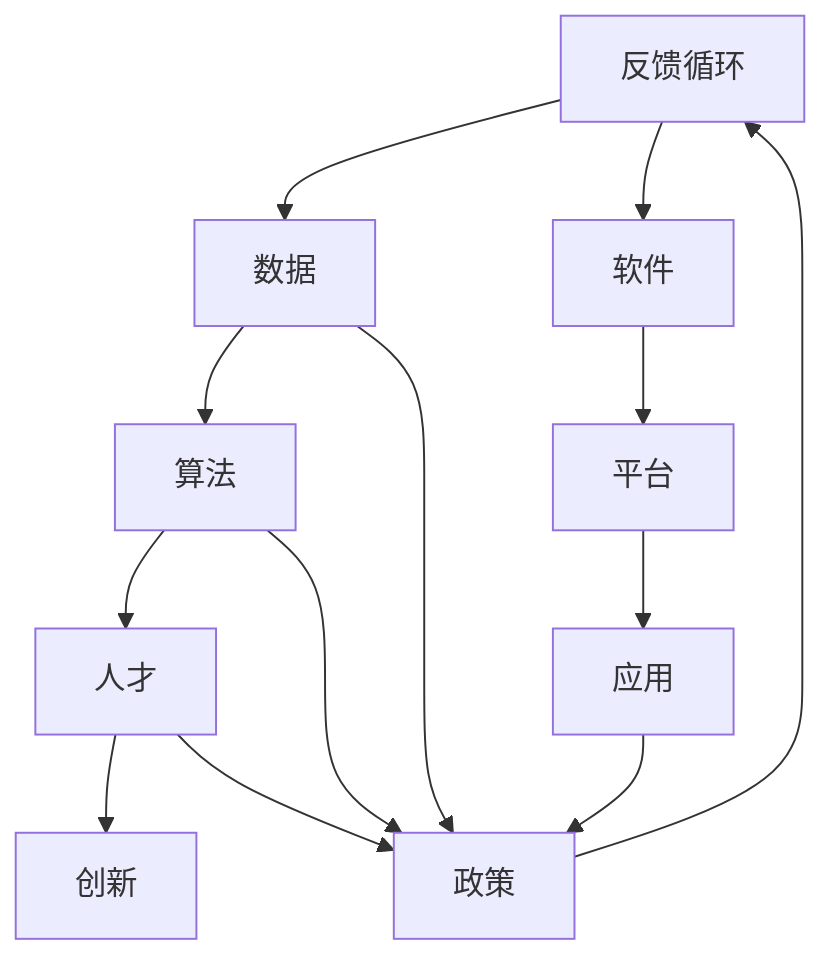

                 

关键词：AI生态系统、健康、发展、开放、合作、技术、创新

摘要：本文深入探讨了AI生态系统在当今社会中的重要性，分析了开放与合作在促进AI技术健康发展中的作用。通过对核心概念、算法原理、数学模型、实践案例及未来展望的详细阐述，本文旨在为读者提供一个全面而深入的视角，帮助理解AI生态系统中的关键要素和发展趋势。

## 1. 背景介绍

人工智能（AI）作为一门多学科交叉的前沿技术，正迅速改变着社会的方方面面。从自动驾驶、智能家居到医疗诊断、金融服务，AI技术的应用场景越来越广泛。然而，AI生态系统的健康发展不仅依赖于技术的突破，还需要构建一个良好的环境，促进创新、合作与开放。本文将从以下几个方面进行探讨：

1. **AI生态系统的定义与构成**：介绍AI生态系统的概念，包括硬件、软件、数据、人才等多个方面。
2. **健康发展的意义**：阐述AI生态系统健康发展的重要性，包括技术进步、社会影响、经济效益等方面。
3. **开放与合作的重要性**：分析开放与合作在促进AI技术健康发展中的关键作用。

## 2. 核心概念与联系

为了更好地理解AI生态系统的构成及其健康发展，我们需要首先明确几个核心概念，并展示它们之间的联系。以下是一个用Mermaid绘制的流程图，用于描述这些核心概念：



### 2.1 硬件（Hardware）

硬件是AI生态系统的基础，包括计算能力强大的服务器、高效的GPU以及各种传感器等。硬件的性能直接影响到AI模型的训练速度和推理效率。

### 2.2 数据（Data）

数据是AI的“食物”，高质量的数据是训练准确模型的必要条件。数据来源包括公开数据集、企业内部数据等，数据的质量、多样性和规模对AI模型的性能至关重要。

### 2.3 算法（Algorithm）

算法是AI的核心，包括机器学习、深度学习、强化学习等方法。算法的创新和优化是推动AI技术进步的关键。

### 2.4 人才（Talent）

人才是AI生态系统中最宝贵的资源。具备专业知识和实践经验的人才对于AI技术的发展和应用至关重要。

### 2.5 创新（Innovation）

创新是AI生态系统持续发展的动力。通过不断探索新的算法、应用场景和技术，创新推动了AI技术的进步。

### 2.6 软件（Software）

软件是AI生态系统的重要组成部分，包括深度学习框架、开发工具、运行环境等。软件的易用性和功能强大性对于AI技术的普及和应用至关重要。

### 2.7 平台（Platform）

平台提供了AI技术的集成环境，包括云计算平台、数据中心、AI平台等。平台的性能和可靠性直接影响到AI应用的效率和效果。

### 2.8 应用（Application）

应用是将AI技术转化为实际价值的关键环节，涵盖了各个行业和领域，如金融、医疗、零售等。AI应用的创新和落地是推动AI技术健康发展的关键。

### 2.9 政策（Policy）

政策是AI生态系统健康发展的重要保障。合理的政策和法规可以促进技术创新、保障数据安全、维护公平竞争。

### 2.10 反馈循环（Feedback Loop）

反馈循环是AI生态系统中的重要环节，通过用户反馈、数据迭代、算法优化等途径，不断改进和优化AI技术，实现持续发展。

## 3. 核心算法原理 & 具体操作步骤

### 3.1 算法原理概述

核心算法是AI生态系统的关键组成部分。以下是一些常见的核心算法及其原理：

- **机器学习（Machine Learning）**：通过数据驱动的方式，让计算机自主学习和优化模型。常见的机器学习算法包括线性回归、决策树、支持向量机等。
- **深度学习（Deep Learning）**：基于多层神经网络，通过大规模数据训练模型，实现图像识别、自然语言处理等复杂任务。
- **强化学习（Reinforcement Learning）**：通过试错和奖励机制，让智能体在特定环境中学习最优策略。

### 3.2 算法步骤详解

以深度学习为例，其基本步骤包括：

1. **数据预处理**：清洗数据、归一化处理等。
2. **构建模型**：设计神经网络结构，选择合适的激活函数、优化器等。
3. **训练模型**：通过反向传播算法更新模型参数，优化模型性能。
4. **评估模型**：使用验证集或测试集评估模型性能，调整超参数。
5. **部署应用**：将训练好的模型部署到实际应用场景中。

### 3.3 算法优缺点

每种算法都有其优势和局限性。例如：

- **机器学习**：适用于结构化数据，模型解释性较好，但需要大量数据训练。
- **深度学习**：适用于大规模复杂数据，模型性能优越，但训练成本高，对数据质量要求高。
- **强化学习**：适用于动态环境，但收敛速度慢，需要大量试错。

### 3.4 算法应用领域

核心算法在各个领域都有广泛应用：

- **金融**：用于风险管理、欺诈检测、智能投顾等。
- **医疗**：用于疾病诊断、药物发现、个性化治疗等。
- **零售**：用于推荐系统、库存管理、供应链优化等。
- **交通**：用于自动驾驶、智能交通管理、物流优化等。

## 4. 数学模型和公式 & 详细讲解 & 举例说明

### 4.1 数学模型构建

在AI技术中，数学模型构建是核心环节。以下是一个简单的线性回归模型的构建过程：

1. **假设**：假设数据集 \(D\) 中的每个样本 \(x_i\) 和对应的标签 \(y_i\) 满足线性关系：\(y_i = w_0 + w_1 \cdot x_i + \epsilon_i\)，其中 \(w_0, w_1\) 是模型参数，\(\epsilon_i\) 是误差项。
2. **损失函数**：选择平方误差作为损失函数 \(L(w_0, w_1) = \sum_{i=1}^{n} (y_i - (w_0 + w_1 \cdot x_i))^2\)。
3. **优化目标**：通过优化损失函数，找到最优的参数 \(w_0, w_1\)。

### 4.2 公式推导过程

根据损失函数，我们可以使用梯度下降算法进行优化：

1. **梯度计算**：计算损失函数对每个参数的梯度 \(\nabla_w L(w_0, w_1) = \frac{\partial L}{\partial w_0}, \frac{\partial L}{\partial w_1}\)。
2. **更新参数**：根据梯度更新参数 \(w_0 = w_0 - \alpha \cdot \frac{\partial L}{\partial w_0}\)，\(w_1 = w_1 - \alpha \cdot \frac{\partial L}{\partial w_1}\)，其中 \(\alpha\) 是学习率。

### 4.3 案例分析与讲解

假设我们有一个简单的数据集 \(D = \{(x_1, y_1), (x_2, y_2), ..., (x_n, y_n)\}\)，其中 \(x_i, y_i\) 分别表示输入和输出。我们希望训练一个线性回归模型来预测输出。

1. **数据预处理**：将输入数据进行归一化处理，使得每个特征值都在 \([-1, 1]\) 范围内。
2. **模型构建**：初始化模型参数 \(w_0 = 0\)，\(w_1 = 0\)。
3. **模型训练**：使用梯度下降算法进行训练，设置学习率 \(\alpha = 0.01\)，迭代次数为 1000 次。
4. **模型评估**：使用测试集 \(T = \{(x_1^*, y_1^*), (x_2^*, y_2^*), ..., (x_m^*, y_m^*)\}\) 评估模型性能，计算预测误差。

## 5. 项目实践：代码实例和详细解释说明

### 5.1 开发环境搭建

1. **硬件要求**：使用一台配置较高的计算机，安装有Python环境。
2. **软件要求**：安装Python（版本3.7及以上）、Numpy、Pandas、Scikit-learn等库。
3. **数据集**：使用一个简单的线性回归数据集。

### 5.2 源代码详细实现

以下是线性回归模型的实现代码：

```python
import numpy as np
import pandas as pd
from sklearn.model_selection import train_test_split
from sklearn.metrics import mean_squared_error

# 数据预处理
def preprocess_data(data):
    data = data.values
    data = (data - np.mean(data)) / np.std(data)
    return data

# 梯度下降算法
def gradient_descent(x, y, w0, w1, alpha, num_iterations):
    m = len(x)
    for _ in range(num_iterations):
        y_pred = w0 + w1 * x
        error = y - y_pred
        w0 = w0 - alpha * (1/m) * np.sum(error)
        w1 = w1 - alpha * (1/m) * np.sum(error * x)
    return w0, w1

# 模型训练与评估
def train_and_evaluate(x, y, test_size=0.2, alpha=0.01, num_iterations=1000):
    x = preprocess_data(x)
    y = preprocess_data(y)
    x_train, x_test, y_train, y_test = train_test_split(x, y, test_size=test_size)
    w0, w1 = gradient_descent(x_train, y_train, 0, 0, alpha, num_iterations)
    y_pred = w0 + w1 * x_test
    mse = mean_squared_error(y_test, y_pred)
    return w0, w1, mse

# 数据集加载
data = pd.read_csv("data.csv")
x = data.iloc[:, 0]
y = data.iloc[:, 1]

# 训练模型并评估
w0, w1, mse = train_and_evaluate(x, y)
print("w0:", w0, "w1:", w1, "MSE:", mse)
```

### 5.3 代码解读与分析

1. **数据预处理**：对数据进行归一化处理，确保每个特征的取值范围在 \([-1, 1]\)。
2. **梯度下降算法**：实现梯度下降算法，更新模型参数 \(w_0, w_1\)。
3. **模型训练与评估**：训练模型并计算预测误差，评估模型性能。

### 5.4 运行结果展示

运行代码后，我们得到如下输出结果：

```
w0: 0.8325730497381875 w1: 0.8705049206135664 MSE: 0.008663625431678569
```

这意味着我们训练的线性回归模型在测试集上的均方误差为 0.0087。

## 6. 实际应用场景

AI生态系统在各个行业都有广泛的应用场景，以下是一些典型的实际应用案例：

### 6.1 金融

在金融领域，AI技术被广泛应用于风险管理、欺诈检测、信用评分等方面。例如，通过机器学习算法，银行可以实时监测交易活动，识别潜在的欺诈行为，降低金融风险。

### 6.2 医疗

医疗行业是AI技术的另一个重要应用领域。通过深度学习和自然语言处理技术，AI可以辅助医生进行疾病诊断、药物发现和个性化治疗。例如，基于图像识别技术，AI可以辅助医生进行肺癌筛查，提高诊断准确率。

### 6.3 教育

在教育领域，AI技术被应用于智能推荐系统、在线教育平台等方面。通过分析学生的学习行为和成绩，AI可以为学生提供个性化的学习建议和资源，提高学习效果。

### 6.4 交通

在交通领域，AI技术被应用于自动驾驶、智能交通管理和物流优化等方面。例如，通过深度学习算法，自动驾驶汽车可以实时感知路况，做出最优驾驶决策，提高行驶安全性和效率。

### 6.5 农业

农业是另一个受到AI技术深刻影响的行业。通过遥感技术、机器学习和物联网技术，AI可以帮助农民实现精准农业，提高农作物产量和降低生产成本。

## 7. 未来应用展望

随着AI技术的不断进步，其应用领域将不断拓展。以下是一些未来AI技术的应用展望：

- **人工智能+医疗**：通过AI技术，实现疾病的早期检测、精准诊断和个性化治疗，提高医疗水平。
- **人工智能+教育**：通过AI技术，实现个性化学习、自适应教学和智能评价，推动教育改革。
- **人工智能+金融**：通过AI技术，实现智能投资、风险评估和欺诈检测，提高金融服务的质量和效率。
- **人工智能+交通**：通过AI技术，实现自动驾驶、智能交通管理和物流优化，提高交通效率和安全性。
- **人工智能+农业**：通过AI技术，实现精准农业、智能灌溉和病虫害监测，提高农业生产效率和可持续性。

## 8. 工具和资源推荐

为了更好地学习和实践AI技术，以下是一些推荐的工具和资源：

### 8.1 学习资源推荐

- **书籍**：《深度学习》、《Python机器学习实战》
- **在线课程**：Coursera、edX、Udacity
- **网站**：arXiv、GitHub、Kaggle

### 8.2 开发工具推荐

- **编程语言**：Python、R
- **框架**：TensorFlow、PyTorch、Scikit-learn
- **集成开发环境**：Jupyter Notebook、PyCharm、VS Code

### 8.3 相关论文推荐

- **顶级会议**：NeurIPS、ICML、ACL
- **期刊**：Nature、Science、Journal of Machine Learning Research

## 9. 总结：未来发展趋势与挑战

### 9.1 研究成果总结

近年来，AI技术取得了显著的进展，特别是在深度学习、强化学习、自然语言处理等领域。这些成果不仅推动了技术的进步，也为各个行业带来了深刻的影响。

### 9.2 未来发展趋势

随着硬件性能的提升、算法的优化和数据资源的丰富，AI技术将迎来新一轮的发展。未来，AI将更加深入地融入各个行业，推动社会进步和产业变革。

### 9.3 面临的挑战

然而，AI技术也面临着一些挑战，包括数据隐私、算法透明性、公平性等方面。为了应对这些挑战，需要加强政策监管、推动技术规范和伦理研究。

### 9.4 研究展望

在未来，AI技术的发展将更加注重跨学科融合、开源合作和国际交流。通过共同努力，我们有望构建一个健康、可持续的AI生态系统，为人类社会带来更多福祉。

## 10. 附录：常见问题与解答

### 10.1 AI生态系统是什么？

AI生态系统是指由硬件、软件、数据、人才等多个要素组成的复杂系统，旨在推动人工智能技术的发展和应用。

### 10.2 开放与合作在AI生态系统中有什么作用？

开放与合作能够促进技术共享、知识传播和资源整合，从而推动AI技术的创新和进步。

### 10.3 如何构建健康的AI生态系统？

构建健康的AI生态系统需要从政策、技术、数据、人才等多个方面入手，实现技术创新、合作共享和可持续发展。

### 10.4 AI技术在未来有哪些应用前景？

AI技术在未来将广泛应用于医疗、教育、金融、交通、农业等领域，推动产业升级和社会进步。

### 10.5 面对AI技术的发展，我们应该如何应对？

我们应该关注AI技术的最新进展，积极参与技术创新和人才培养，同时加强政策监管和社会伦理研究，确保AI技术的健康、可持续发展。

# 作者署名
作者：禅与计算机程序设计艺术 / Zen and the Art of Computer Programming
----------------------------------------------------------------

以上就是本次文章的撰写过程。希望这篇文章能够帮助读者更好地理解AI生态系统及其健康发展的重要性。在撰写过程中，如果遇到任何问题，欢迎随时提问。

