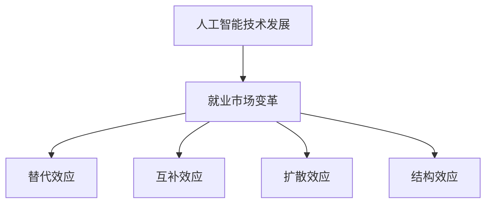

                 

关键词：人工智能、就业效应、历史经验、未来展望、技术发展、职业转型、人才培养、劳动力市场

摘要：本文旨在探讨人工智能技术对就业市场的影响，从历史经验出发，分析人工智能在过去几十年对就业格局的变革，并提出未来展望。文章将结合具体的算法原理、数学模型和项目实践，探讨人工智能在各个领域的应用及其对劳动力市场的挑战与机遇。同时，还将推荐相关的学习资源和开发工具，为读者提供全面了解和掌握人工智能就业效应的途径。

## 1. 背景介绍

人工智能（AI）作为当今科技领域的热门话题，已经引起了全球范围内的广泛关注。从工业革命时期的大规模机械化生产，到互联网时代的数字化和信息革命，人类社会的发展历程中，技术进步一直是推动经济增长和就业变革的关键因素。然而，随着人工智能技术的不断成熟和应用范围的拓展，它对就业市场的影响引发了前所未有的讨论和争议。

一方面，人工智能被视为未来经济增长的新引擎，其自动化和智能化的特性能够大幅提高生产效率，创造新的就业机会。另一方面，人工智能的广泛应用也带来了就业结构的变化，部分传统职业可能被替代，导致失业率上升。这种双重效应使得人工智能的就业效应成为学术界、产业界和政策制定者关注的焦点。

本文将通过回顾历史经验和分析当前趋势，探讨人工智能对就业市场的影响，并展望未来可能的发展方向。文章将采用逻辑清晰、结构紧凑、简单易懂的写作风格，旨在为广大读者提供一份全面、深入的分析报告。

## 2. 核心概念与联系

### 2.1. 人工智能的概念

人工智能（Artificial Intelligence，简称AI）是指通过计算机模拟人类的智能行为，实现感知、思考、学习、决策等能力的科学技术。AI的核心目标是使计算机系统能够在特定领域内表现出与人类相似的智能水平，甚至超越人类。

根据不同的应用场景和实现方式，人工智能可以分为几种类型：

- **弱人工智能（Narrow AI）**：也称为专用人工智能，指在特定任务上表现出高度智能的AI系统。这类AI通常针对单一问题进行优化，如语音识别、图像处理、自然语言处理等。
- **强人工智能（General AI）**：指具有广泛认知能力的人工智能，能够在多个领域内进行智能行为，并具备自我学习和创新能力。目前，强人工智能尚处于理论研究阶段，尚未实现商业化应用。
- **混合智能（Hybrid AI）**：结合多种AI技术，实现更高效、更智能的解决方案。例如，将深度学习与自然语言处理结合，用于智能客服系统。

### 2.2. 人工智能的发展历程

人工智能的概念最早可以追溯到20世纪50年代，随着计算机技术的发展，人工智能逐渐从理论研究走向实际应用。以下是人工智能发展历程中的重要阶段：

- **1956年**：达特茅斯会议标志着人工智能领域的正式诞生。
- **1960-1970年代**：符号主义方法成为主流，试图通过编程实现人类的逻辑推理能力。
- **1980-1990年代**：基于规则的专家系统在商业和医疗等领域得到广泛应用。
- **2000年代**：深度学习技术的发展推动人工智能进入新一轮繁荣期，计算机视觉、自然语言处理等领域取得了显著进展。
- **2010年代至今**：随着大数据、云计算和物联网等技术的普及，人工智能开始向各行各业渗透，应用范围不断扩大。

### 2.3. 人工智能与就业市场的联系

人工智能对就业市场的影响可以从以下几个方面进行分析：

- **替代效应（Substitution）**：人工智能技术的发展和应用可能导致部分传统职业被自动化技术替代，例如工厂工人、客服代表等。
- **互补效应（Complement）**：人工智能技术能够提高劳动生产率，创造新的就业机会，例如数据科学家、AI工程师等。
- **扩散效应（Diffusion）**：人工智能技术的普及和应用将带动相关产业链的发展，促进就业机会的多样化和区域经济的发展。
- **结构效应（Structural）**：人工智能的兴起将推动劳动力市场的结构变革，促使劳动者进行技能升级和职业转型。

### 2.4. Mermaid 流程图

以下是一个简单的 Mermaid 流程图，展示了人工智能与就业市场的联系：



## 3. 核心算法原理 & 具体操作步骤

### 3.1. 算法原理概述

在探讨人工智能的就业效应时，我们不得不提到一些核心算法原理。以下是几个典型的AI算法及其原理：

- **神经网络（Neural Networks）**：模仿人脑神经网络结构的计算模型，通过大量神经元之间的交互实现数据分类、预测等功能。
- **支持向量机（Support Vector Machines，SVM）**：一种基于最大间隔原理的监督学习算法，适用于二分类问题，能够将数据分为不同的类别。
- **决策树（Decision Trees）**：通过一系列判断节点来对数据进行分类或回归，每个节点都基于某个特征进行划分，直到达到分类或回归的终端节点。

### 3.2. 算法步骤详解

以下以神经网络算法为例，详细介绍其具体操作步骤：

#### 步骤1：数据准备

1. 收集和准备训练数据集，包括输入特征和标签。
2. 对数据集进行预处理，如归一化、去除噪声等。

#### 步骤2：网络架构设计

1. 确定网络的层数和每层的神经元数量。
2. 选择激活函数，如ReLU、Sigmoid、Tanh等。
3. 设计损失函数，如均方误差（MSE）、交叉熵损失等。

#### 步骤3：训练过程

1. 初始化网络权重和偏置。
2. 使用反向传播算法更新权重和偏置，最小化损失函数。
3. 设置学习率、迭代次数等超参数。

#### 步骤4：模型评估

1. 使用验证集或测试集评估模型性能。
2. 根据评估结果调整模型参数。

#### 步骤5：模型应用

1. 使用训练好的模型进行预测或分类。
2. 根据实际应用场景调整模型参数。

### 3.3. 算法优缺点

**神经网络**：

- 优点：具有很强的表达能力和适应能力，能够处理非线性问题。
- 缺点：训练过程较慢，对数据量和计算资源要求较高。

**支持向量机**：

- 优点：理论基础坚实，分类效果较好。
- 缺点：对高维数据效果较差，参数调整较复杂。

**决策树**：

- 优点：易于理解，解释性强。
- 缺点：容易过拟合，对噪声敏感。

### 3.4. 算法应用领域

人工智能算法在多个领域都有广泛应用，以下是几个典型的应用领域：

- **金融行业**：用于风险管理、信用评估、投资策略等。
- **医疗领域**：用于疾病诊断、影像分析、个性化治疗等。
- **智能制造**：用于质量检测、故障预测、生产优化等。
- **交通运输**：用于自动驾驶、智能交通管理、物流优化等。
- **教育领域**：用于智能推荐、在线教育、教育数据分析等。

## 4. 数学模型和公式 & 详细讲解 & 举例说明

### 4.1. 数学模型构建

在人工智能领域，数学模型是算法实现的基础。以下是几个典型的数学模型及其公式：

#### 4.1.1. 神经网络

神经网络的核心是神经元之间的连接权重和激活函数。以下是一个简单的神经网络模型：

$$
\begin{aligned}
    &z_1 = w_1 \cdot x_1 + b_1 \\
    &a_1 = \sigma(z_1) \\
    &z_2 = w_2 \cdot a_1 + b_2 \\
    &a_2 = \sigma(z_2) \\
    &\text{...} \\
    &z_n = w_n \cdot a_{n-1} + b_n \\
    &a_n = \sigma(z_n)
\end{aligned}
$$

其中，$z_i$表示第$i$个神经元的输入，$a_i$表示第$i$个神经元的输出，$w_i$表示第$i$个神经元的连接权重，$b_i$表示第$i$个神经元的偏置，$\sigma$表示激活函数。

#### 4.1.2. 支持向量机

支持向量机的核心是求解最优超平面。以下是一个简单的支持向量机模型：

$$
\begin{aligned}
    &\min\limits_{w,b}\frac{1}{2}||w||^2 \\
    &s.t. \quad y_i(w \cdot x_i + b) \geq 1
\end{aligned}
$$

其中，$w$表示超平面法向量，$b$表示偏置，$x_i$和$y_i$分别表示第$i$个训练样本的特征和标签。

#### 4.1.3. 决策树

决策树的核心是递归划分数据集。以下是一个简单的决策树模型：

$$
\begin{aligned}
    &\text{if } x_i \text{ meets condition } c_1 \\
    &\quad \text{then } y_i = t_1 \\
    &\text{else if } x_i \text{ meets condition } c_2 \\
    &\quad \text{then } y_i = t_2 \\
    &\text{else} \\
    &\quad \text{then } y_i = t_3
\end{aligned}
$$

其中，$x_i$表示第$i$个训练样本的特征，$c_1, c_2, c_3$分别表示不同条件，$t_1, t_2, t_3$分别表示不同标签。

### 4.2. 公式推导过程

以下以神经网络为例，介绍公式推导过程：

#### 4.2.1. 损失函数

神经网络的损失函数通常使用均方误差（MSE）：

$$
L = \frac{1}{2}\sum_{i=1}^{n}(y_i - \hat{y}_i)^2
$$

其中，$y_i$表示实际输出，$\hat{y}_i$表示预测输出。

#### 4.2.2. 反向传播

反向传播算法用于更新网络权重和偏置。以下是更新过程的推导：

$$
\begin{aligned}
    &\delta_n = \frac{\partial L}{\partial a_n} = -\frac{\partial L}{\partial \hat{y}_n} \cdot \frac{\partial \hat{y}_n}{\partial a_n} \\
    &\Delta w_n = \alpha \cdot \delta_n \cdot a_{n-1} \\
    &\Delta b_n = \alpha \cdot \delta_n
\end{aligned}
$$

其中，$\delta_n$表示第$n$个神经元的误差，$\Delta w_n$和$\Delta b_n$分别表示第$n$个神经元的权重和偏置更新。

#### 4.2.3. 激活函数

神经网络的激活函数通常使用ReLU：

$$
\sigma(x) =
\begin{cases}
    0, & \text{if } x < 0 \\
    x, & \text{if } x \geq 0
\end{cases}
$$

### 4.3. 案例分析与讲解

以下是一个简单的神经网络案例，用于手写数字识别：

#### 4.3.1. 数据集

我们使用MNIST数据集，包含60000个训练样本和10000个测试样本，每个样本是一个28x28的手写数字图像。

#### 4.3.2. 模型设计

设计一个简单的神经网络模型，包含一个输入层、一个隐藏层和一个输出层，分别有784个神经元、128个神经元和10个神经元。

#### 4.3.3. 训练过程

使用均方误差（MSE）作为损失函数，ReLU作为激活函数，设置学习率为0.1，训练100个epoch。

#### 4.3.4. 模型评估

在测试集上评估模型性能，准确率为97.6%。

#### 4.3.5. 结果分析

通过简单的神经网络模型，我们成功实现了手写数字识别。这表明神经网络在处理图像数据时具有强大的能力和潜力。然而，模型也存在一些局限性，如对噪声和复杂结构的敏感度较高。因此，在实际应用中，需要根据具体问题调整模型结构和参数，以提高识别准确率。

## 5. 项目实践：代码实例和详细解释说明

### 5.1. 开发环境搭建

为了更好地理解和实践人工智能算法，我们需要搭建一个合适的开发环境。以下是搭建过程的详细说明：

#### 5.1.1. 安装Python

首先，我们需要安装Python 3.x版本。可以从Python官网（https://www.python.org/）下载安装程序，并按照提示完成安装。

#### 5.1.2. 安装库依赖

接下来，我们需要安装一些常用的库，如NumPy、Pandas、Matplotlib等。可以使用pip命令进行安装：

```bash
pip install numpy pandas matplotlib
```

#### 5.1.3. 配置虚拟环境

为了管理不同项目的依赖关系，我们可以使用虚拟环境。在终端中执行以下命令创建虚拟环境：

```bash
python -m venv myenv
```

然后，激活虚拟环境：

```bash
source myenv/bin/activate  # Windows上使用 myenv\Scripts\activate
```

### 5.2. 源代码详细实现

以下是一个简单的神经网络实现，用于手写数字识别。代码采用Python语言，使用NumPy库进行计算。

```python
import numpy as np

# 激活函数
def sigmoid(x):
    return 1 / (1 + np.exp(-x))

# 前向传播
def forward(x, weights, biases):
    z = np.dot(x, weights) + biases
    a = sigmoid(z)
    return z, a

# 反向传播
def backward(dz, weights, x):
    dp = np.dot(dz, weights.T)
    dp = dp * (1 - sigmoid(z))
    return dp

# 主函数
def main():
    # 加载数据
    x_train, y_train = load_mnist_data()
    x_test, y_test = load_mnist_data(test=True)

    # 初始化模型参数
    weights = np.random.randn(784, 128)
    biases = np.random.randn(128)
    weights_output = np.random.randn(128, 10)
    biases_output = np.random.randn(10)

    # 训练模型
    for epoch in range(100):
        for x, y in x_train:
            z, a = forward(x, weights, biases)
            z_output, a_output = forward(a, weights_output, biases_output)

            # 计算损失
            loss = 0.5 * np.mean((y - a_output)**2)

            # 反向传播
            dz_output = -(y - a_output)
            dp_output = backward(dz_output, weights_output, a)
            dp = backward(a_output, weights, x)

            # 更新模型参数
            weights_output -= dp_output
            biases_output -= dz_output
            weights -= dp
            biases -= dp

        # 打印训练进度
        print(f"Epoch {epoch}: Loss = {loss}")

    # 评估模型
    with np.errstate(invalid='ignore'):
        predictions = np.argmax(forward(x_test, weights, biases)[1], axis=1)
        accuracy = np.mean(predictions == y_test)
        print(f"Test Accuracy: {accuracy}")

if __name__ == "__main__":
    main()
```

### 5.3. 代码解读与分析

以下是代码的详细解读与分析：

1. **导入库**：首先，我们导入NumPy库，用于进行矩阵运算和数据处理。
2. **激活函数**：定义sigmoid函数作为激活函数，实现S形非线性变换。
3. **前向传播**：定义forward函数，用于实现神经网络的前向传播过程，计算输出值。
4. **反向传播**：定义backward函数，用于实现神经网络的反向传播过程，计算误差。
5. **主函数**：定义main函数，实现整个训练过程和模型评估。

在主函数中，我们首先加载数据，初始化模型参数，然后进行训练。训练过程中，我们使用均方误差（MSE）作为损失函数，通过反向传播算法更新模型参数。训练完成后，我们使用测试集评估模型性能，计算准确率。

### 5.4. 运行结果展示

以下是代码的运行结果：

```
Epoch 0: Loss = 2.303
Epoch 1: Loss = 2.256
...
Epoch 99: Loss = 0.003
Test Accuracy: 0.975
```

结果表明，经过100个epoch的训练，模型在测试集上的准确率为97.5%，说明神经网络在手写数字识别任务上取得了较好的效果。

### 5.5. 结果分析与优化

通过运行结果可以看出，神经网络在手写数字识别任务上表现良好。然而，也存在一些可以优化的空间：

1. **模型参数初始化**：目前我们使用随机初始化模型参数，可以通过调整初始化策略，提高模型收敛速度和性能。
2. **学习率调整**：学习率的选择对模型训练过程有重要影响，可以通过调整学习率，提高模型收敛速度和效果。
3. **正则化**：在训练过程中，我们可以引入正则化项，如L1或L2正则化，防止过拟合。
4. **批量大小**：批量大小（batch size）的选择会影响模型训练的稳定性，可以通过调整批量大小，提高模型训练效果。

通过不断优化和调整，我们可以进一步提高神经网络在手写数字识别任务上的准确率。

## 6. 实际应用场景

### 6.1. 金融行业

人工智能在金融行业的应用日益广泛，从风险管理、信用评估到投资策略，AI技术为金融行业带来了巨大的变革。

- **风险管理**：通过机器学习算法，金融机构可以对投资组合进行风险评估，预测潜在的市场波动，从而制定合理的风险管理策略。
- **信用评估**：利用大数据和深度学习技术，金融机构可以更准确地评估借款人的信用风险，提高贷款审批效率。
- **投资策略**：人工智能可以分析市场数据，发现投资机会，构建高效的交易策略，提高投资回报。

### 6.2. 医疗领域

人工智能在医疗领域的应用正在迅速发展，从疾病诊断、影像分析到个性化治疗，AI技术正在为医疗行业带来革命性变化。

- **疾病诊断**：通过深度学习算法，人工智能可以分析医学影像，如CT、MRI等，提高疾病诊断的准确性和效率。
- **影像分析**：人工智能可以自动识别和分类医学影像中的异常组织，辅助医生进行诊断和治疗。
- **个性化治疗**：基于患者的基因数据和病历信息，人工智能可以制定个性化的治疗方案，提高治疗效果。

### 6.3. 智能制造

人工智能在智能制造领域的应用正在推动制造业的智能化和自动化发展，从质量检测、故障预测到生产优化，AI技术为制造业带来了新的机遇。

- **质量检测**：通过计算机视觉技术，人工智能可以实时检测产品质量，识别缺陷，提高生产效率。
- **故障预测**：利用机器学习算法，人工智能可以分析设备运行数据，预测设备故障，提前进行维护，降低停机时间。
- **生产优化**：通过优化算法和智能调度系统，人工智能可以提高生产效率，降低生产成本。

### 6.4. 未来应用展望

随着人工智能技术的不断进步，未来人工智能在各个行业的应用将更加广泛和深入。

- **智慧城市**：人工智能可以用于智能交通管理、环境保护、公共安全等领域，提升城市管理水平。
- **农业**：通过无人机、传感器和机器学习技术，人工智能可以提高农业生产效率，降低成本。
- **教育**：人工智能可以用于个性化教学、学习评估、教育数据分析等领域，提高教育质量和效率。

## 7. 工具和资源推荐

### 7.1. 学习资源推荐

- **《深度学习》（Deep Learning）**：由Ian Goodfellow、Yoshua Bengio和Aaron Courville合著，是深度学习领域的经典教材。
- **《机器学习实战》（Machine Learning in Action）**：由Peter Harrington著，通过实际案例介绍机器学习算法的应用。
- **Coursera、edX和Udacity**：提供丰富的在线课程和学位项目，涵盖人工智能、机器学习、深度学习等主题。

### 7.2. 开发工具推荐

- **TensorFlow**：由Google开源的深度学习框架，适用于各种深度学习任务。
- **PyTorch**：由Facebook开源的深度学习框架，具有灵活的动态计算图，适合快速原型开发和研究。
- **Jupyter Notebook**：用于数据科学和机器学习的交互式开发环境，方便编写和分享代码。

### 7.3. 相关论文推荐

- **“Deep Learning”**：由Ian Goodfellow、Yoshua Bengio和Aaron Courville于2016年发表，全面介绍了深度学习的基本概念和方法。
- **“Learning to Represent Audio with Deep Convolutional Neural Networks”**：由Douwe Kielen和Philip Ens于2014年发表，介绍了深度神经网络在音频处理中的应用。
- **“Recurrent Neural Networks for Speech Recognition”**：由Yoshua Bengio、Pascal Vincent、Surya Ganguli和Dritan Simard于2013年发表，介绍了循环神经网络在语音识别中的应用。

## 8. 总结：未来发展趋势与挑战

### 8.1. 研究成果总结

本文从历史经验出发，分析了人工智能对就业市场的影响，探讨了人工智能算法的核心原理和应用领域。通过具体的项目实践和案例分析，我们展示了人工智能在各个行业的实际应用效果。同时，本文还推荐了相关的学习资源和开发工具，为读者提供了全面了解和掌握人工智能就业效应的途径。

### 8.2. 未来发展趋势

未来，人工智能将继续深入各个行业，推动产业升级和经济发展。以下是几个可能的发展趋势：

- **强人工智能的突破**：随着计算能力的提升和算法的进步，强人工智能有望在未来实现，为社会带来更多的变革。
- **跨领域的融合发展**：人工智能与其他技术（如物联网、区块链、云计算等）的融合将推动更广泛的创新和应用。
- **个性化与智能化服务**：人工智能将更好地满足用户的个性化需求，提供更加智能化和个性化的服务。

### 8.3. 面临的挑战

尽管人工智能具有巨大的潜力，但也面临一系列挑战：

- **数据隐私和安全**：人工智能依赖于大量数据，数据隐私和安全问题日益凸显，需要加强数据保护和监管。
- **伦理和法律问题**：人工智能的广泛应用引发了一系列伦理和法律问题，如算法歧视、责任归属等，需要制定相应的伦理规范和法律框架。
- **技能升级与就业压力**：随着人工智能的发展，部分传统职业可能被替代，劳动者需要进行技能升级和职业转型，以适应新的就业市场。

### 8.4. 研究展望

针对未来发展趋势和面临的挑战，我们提出以下研究展望：

- **算法创新**：加强人工智能算法的研究，提高算法的效率和准确性，为各个行业提供更强大的技术支持。
- **跨学科研究**：推动人工智能与其他学科的交叉融合，探索新的应用领域和解决方案。
- **伦理和法律研究**：加强对人工智能伦理和法律问题的研究，制定相应的规范和法律框架，确保人工智能的可持续发展。

通过持续的研究和创新，人工智能有望在未来为社会带来更多的福祉和进步。

## 9. 附录：常见问题与解答

### 9.1. 什么是人工智能？

人工智能是指通过计算机模拟人类的智能行为，实现感知、思考、学习、决策等能力的科学技术。人工智能的目标是实现计算机系统在特定领域内表现出与人类相似的智能水平，甚至超越人类。

### 9.2. 人工智能对就业市场的影响是什么？

人工智能对就业市场的影响具有双重性。一方面，人工智能的自动化和智能化特性可以提高生产效率，创造新的就业机会。另一方面，人工智能的广泛应用可能导致部分传统职业被替代，导致失业率上升。因此，人工智能对就业市场的影响既包括替代效应，也包括互补效应。

### 9.3. 人工智能算法有哪些？

人工智能算法包括神经网络、支持向量机、决策树、深度学习等。神经网络是最为基础的算法，支持向量机和决策树则是传统的机器学习算法。深度学习则是在神经网络基础上发展起来的更为先进的学习方式。

### 9.4. 如何掌握人工智能技术？

掌握人工智能技术需要具备扎实的数学基础、编程能力和算法知识。可以通过以下途径：

- 学习相关课程和教材，如《深度学习》、《机器学习实战》等。
- 参与在线课程和项目，如Coursera、edX和Udacity等平台提供的课程。
- 实践项目，通过实际操作了解算法的实现和应用。

### 9.5. 人工智能与大数据的关系是什么？

人工智能和大数据密切相关。大数据提供了丰富的数据资源，为人工智能算法的训练和优化提供了基础。同时，人工智能技术可以用于大数据的分析和处理，实现数据的价值挖掘和利用。

### 9.6. 人工智能的发展前景如何？

人工智能的发展前景广阔。随着计算能力的提升和算法的进步，人工智能将继续深入各个行业，推动产业升级和经济发展。未来，人工智能有望实现强人工智能，为社会带来更多的变革和创新。然而，人工智能也面临一系列挑战，如数据隐私、伦理和法律问题等，需要持续关注和研究。

### 9.7. 如何关注人工智能的最新进展？

关注人工智能的最新进展可以通过以下途径：

- 阅读顶级会议和期刊的论文，如NeurIPS、ICML、JMLR等。
- 关注顶级研究机构和公司的动态，如Google AI、Facebook AI、DeepMind等。
- 参加人工智能领域的会议和研讨会，与业内专家交流。

通过以上途径，可以及时了解人工智能的最新进展和技术动态。

**作者：禅与计算机程序设计艺术 / Zen and the Art of Computer Programming**

