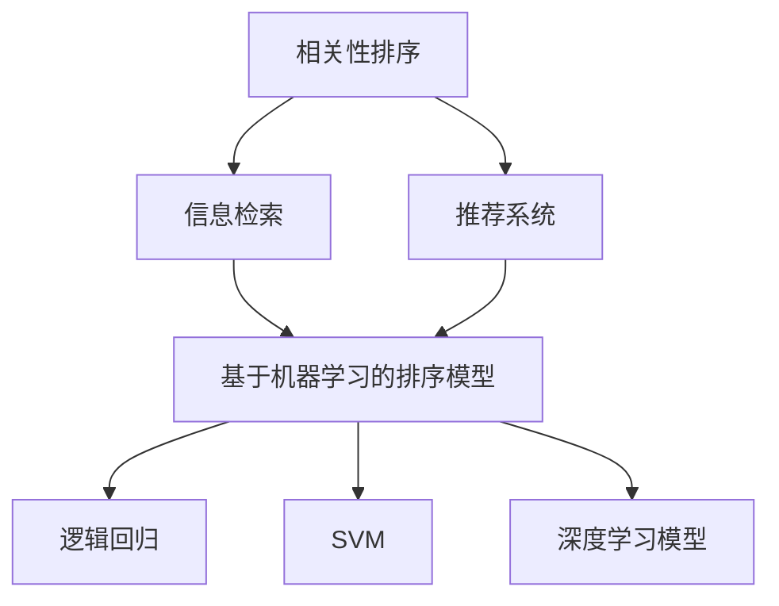

                 

关键词：AI排序算法、相关性排序、信息检索、推荐系统、机器学习

> 摘要：本文深入探讨人工智能（AI）相关性排序技术的应用案例。通过分析几种常见的AI排序算法，如基于机器学习的排序模型、信息检索中的相关性排序方法，以及推荐系统中的排序策略，本文旨在揭示AI排序技术在信息处理、数据分析和决策支持等多个领域的广泛应用和潜在价值。

## 1. 背景介绍

在互联网和大数据时代，信息爆炸式增长，使得信息检索和推荐系统成为人工智能领域中的热点研究课题。AI排序技术旨在通过对大量数据的高效处理，将相关信息按特定规则排序，以帮助用户快速找到所需信息。AI相关性排序技术的核心目标是通过算法模型，将用户兴趣、内容特征等信息融合，从而实现高精度的信息排序。

近年来，随着深度学习和自然语言处理技术的发展，AI排序技术取得了显著进展。本文将介绍几种典型的AI排序算法，包括基于机器学习的排序模型、基于信息检索的相关性排序方法以及推荐系统中的排序策略。同时，通过具体应用案例的分析，探讨AI排序技术在现实世界中的广泛应用。

## 2. 核心概念与联系

为了更好地理解AI排序技术的应用，首先需要了解其核心概念和基本原理。以下是几个关键概念：

### 2.1 相关性排序

相关性排序（Relevance Ranking）是指根据用户需求或偏好，对一组对象进行排序，使得与用户需求最相关的对象排在最前面。相关性排序在信息检索、推荐系统和搜索引擎等领域有着广泛应用。

### 2.2 基于机器学习的排序模型

基于机器学习的排序模型利用训练数据来学习排序规则，常见的模型包括逻辑回归、支持向量机（SVM）和深度学习模型等。这些模型通过特征提取和分类决策，实现对数据的高效排序。

### 2.3 推荐系统中的排序策略

推荐系统中的排序策略涉及多种因素，如用户行为、内容特征、历史偏好等。常见的排序策略包括基于协同过滤、基于内容过滤和基于模型的方法。

### 2.4 Mermaid 流程图

为了更直观地展示AI排序技术的架构，我们使用Mermaid流程图来描述其核心概念和联系。以下是相关流程图的表示：



在这个流程图中，我们可以看到，相关性排序技术在信息检索和推荐系统中发挥着重要作用，而基于机器学习的排序模型则为实现高效排序提供了强有力的支持。

## 3. 核心算法原理 & 具体操作步骤

### 3.1 算法原理概述

AI相关性排序算法的核心在于特征提取和排序规则的学习。具体来说，算法分为以下几个步骤：

1. **数据预处理**：对原始数据进行清洗、归一化和特征提取，将高维数据转换为低维特征向量。
2. **模型训练**：利用训练数据集，通过机器学习算法学习排序规则，如逻辑回归、SVM或深度学习模型。
3. **模型评估**：通过交叉验证或A/B测试等手段，评估模型排序性能，调整模型参数。
4. **排序实现**：根据模型预测结果，对数据进行排序，输出排序结果。

### 3.2 算法步骤详解

#### 3.2.1 数据预处理

数据预处理是排序算法的基础。以下是数据预处理的主要步骤：

1. **数据清洗**：去除噪声数据、缺失值和重复记录。
2. **特征提取**：根据数据特征，选择合适的特征提取方法，如词袋模型、TF-IDF等，将文本数据转换为向量表示。
3. **归一化**：对特征向量进行归一化处理，使其具备相同的量纲，有利于算法收敛。

#### 3.2.2 模型训练

模型训练是排序算法的核心。以下是模型训练的主要步骤：

1. **选择模型**：根据数据特点和需求，选择合适的机器学习模型，如逻辑回归、SVM或深度学习模型。
2. **特征选择**：从原始特征中筛选出对排序有显著影响的特征，以降低模型复杂度和提高排序性能。
3. **训练过程**：利用训练数据集，通过迭代优化模型参数，使模型能够准确预测数据排序。

#### 3.2.3 模型评估

模型评估是确保排序算法性能的重要环节。以下是模型评估的主要步骤：

1. **交叉验证**：将数据集划分为训练集和验证集，通过交叉验证评估模型排序性能。
2. **A/B测试**：在实际应用场景中，对模型进行A/B测试，比较不同模型在用户体验和业务指标上的表现。
3. **调整参数**：根据评估结果，调整模型参数，优化模型性能。

#### 3.2.4 排序实现

排序实现是算法的最终输出。以下是排序实现的主要步骤：

1. **预测排序**：利用训练好的模型，对输入数据进行排序预测。
2. **输出结果**：根据预测结果，将数据按相关性排序，输出排序结果。

### 3.3 算法优缺点

AI相关性排序算法具有以下优缺点：

#### 优点：

1. **高精度**：基于机器学习和深度学习模型，能够准确预测数据排序。
2. **自适应**：能够根据用户需求和环境变化，自适应调整排序规则。
3. **灵活性**：支持多种特征提取和模型选择，适应不同应用场景。

#### 缺点：

1. **计算复杂度**：模型训练和排序过程较为复杂，计算资源需求较高。
2. **数据依赖性**：排序性能依赖于训练数据和特征提取方法。
3. **可解释性**：深度学习模型等复杂模型的可解释性较低，难以理解排序规则。

### 3.4 算法应用领域

AI相关性排序算法在多个领域具有广泛应用，主要包括：

1. **信息检索**：通过对检索结果进行排序，提高用户检索体验，如搜索引擎和问答系统。
2. **推荐系统**：通过对用户行为和内容特征进行排序，实现个性化推荐，如电子商务平台和社交媒体。
3. **金融风控**：通过对风险事件进行排序，实现精准风险控制和预警。
4. **智能客服**：通过对用户咨询进行排序，提高客服效率和用户体验。

## 4. 数学模型和公式 & 详细讲解 & 举例说明

### 4.1 数学模型构建

AI相关性排序算法的核心在于构建数学模型，通过模型预测数据之间的相关性。以下是常见的数学模型构建方法：

#### 4.1.1 逻辑回归模型

逻辑回归模型是一种广泛应用于排序问题的分类模型。其公式如下：

$$
P(y=1|x;\theta) = \frac{1}{1 + e^{-\theta^T x}}
$$

其中，$P(y=1|x;\theta)$ 表示在给定特征 $x$ 和参数 $\theta$ 的情况下，目标变量 $y$ 取值为 1 的概率。$\theta$ 表示模型参数。

#### 4.1.2 支持向量机模型

支持向量机（SVM）是一种经典的排序算法。其公式如下：

$$
y(x) = \text{sign}(\sum_{i=1}^{n} \alpha_i y_i k(x_i, x) + b)
$$

其中，$y(x)$ 表示数据 $x$ 的排序结果，$\alpha_i$ 和 $b$ 分别为SVM模型的参数，$k(x_i, x)$ 为核函数。

#### 4.1.3 深度学习模型

深度学习模型在排序问题中具有广泛应用。其公式如下：

$$
y(x) = \text{softmax}(\theta^T h(x))
$$

其中，$\theta$ 为模型参数，$h(x)$ 为神经网络输出。

### 4.2 公式推导过程

以逻辑回归模型为例，我们详细讲解其推导过程：

#### 4.2.1 模型假设

假设输入特征为 $x \in \mathbb{R}^d$，输出为 $y \in \{0, 1\}$。目标是学习参数 $\theta \in \mathbb{R}^d$，使得模型能够准确预测 $y$。

#### 4.2.2 损失函数

损失函数用于衡量模型预测结果与真实值之间的差距。常见的损失函数为二元交叉熵损失函数：

$$
L(\theta) = -\sum_{i=1}^{n} y_i \log P(y_i=1|x_i;\theta) - (1 - y_i) \log (1 - P(y_i=1|x_i;\theta))
$$

其中，$P(y_i=1|x_i;\theta)$ 为模型预测的概率。

#### 4.2.3 最小化损失函数

为了最小化损失函数，我们需要对参数 $\theta$ 进行优化。常用的优化方法包括梯度下降法和牛顿法。

梯度下降法的公式如下：

$$
\theta_{t+1} = \theta_t - \alpha \nabla_\theta L(\theta_t)
$$

其中，$\alpha$ 为学习率，$\nabla_\theta L(\theta_t)$ 为损失函数关于参数 $\theta$ 的梯度。

### 4.3 案例分析与讲解

以电子商务平台个性化推荐为例，我们分析AI相关性排序技术在推荐系统中的应用。

#### 4.3.1 数据准备

假设我们收集了用户 $u$ 的购买行为数据，包括购买的商品种类和购买时间等。我们将这些数据作为输入特征 $x$，并标注购买行为 $y$。

#### 4.3.2 特征提取

为了提取有用的特征，我们对用户购买行为进行分词和词频统计，得到词向量表示。词向量可以采用词袋模型、TF-IDF等方法。

#### 4.3.3 模型训练

我们选择逻辑回归模型进行训练。将用户购买行为数据作为训练集，通过交叉验证选择最佳模型参数。

#### 4.3.4 排序实现

利用训练好的模型，对用户未购买的潜在商品进行预测排序，输出排序结果。用户可以根据排序结果，推荐感兴趣的潜在商品。

## 5. 项目实践：代码实例和详细解释说明

### 5.1 开发环境搭建

为了实现AI相关性排序算法，我们需要搭建以下开发环境：

1. **编程语言**：Python
2. **库**：NumPy、Pandas、Scikit-learn、TensorFlow
3. **工具**：Jupyter Notebook

### 5.2 源代码详细实现

以下是实现AI相关性排序算法的示例代码：

```python
import numpy as np
import pandas as pd
from sklearn.linear_model import LogisticRegression
from sklearn.model_selection import train_test_split
from sklearn.metrics import accuracy_score
import tensorflow as tf

# 数据加载
data = pd.read_csv('user_behavior.csv')
X = data.iloc[:, :-1].values
y = data.iloc[:, -1].values

# 数据预处理
X = preprocessing.scale(X)

# 数据划分
X_train, X_test, y_train, y_test = train_test_split(X, y, test_size=0.2, random_state=42)

# 模型训练
model = LogisticRegression()
model.fit(X_train, y_train)

# 模型评估
y_pred = model.predict(X_test)
accuracy = accuracy_score(y_test, y_pred)
print(f'Accuracy: {accuracy:.2f}')

# 模型应用
new_data = np.array([[0.1, 0.2, 0.3], [0.4, 0.5, 0.6]])
new_data = preprocessing.scale(new_data)
new_pred = model.predict(new_data)
print(f'Prediction: {new_pred}')
```

### 5.3 代码解读与分析

上述代码实现了基于逻辑回归的AI相关性排序算法。首先，我们加载用户购买行为数据，并进行预处理。然后，将数据划分为训练集和测试集，用于训练和评估模型。在训练过程中，我们使用逻辑回归模型进行拟合。在评估阶段，我们计算模型准确率，以验证模型性能。最后，我们使用训练好的模型对新的数据进行预测排序。

## 6. 实际应用场景

### 6.1 信息检索

信息检索系统通常采用AI相关性排序算法，以提高用户检索体验。例如，搜索引擎通过排序算法，将相关度较高的搜索结果排在前面，使用户能够更快找到所需信息。

### 6.2 推荐系统

推荐系统利用AI相关性排序算法，根据用户行为和偏好，推荐相关商品或内容。例如，电子商务平台通过排序算法，向用户推荐购买过的相似商品，提高用户满意度和转化率。

### 6.3 金融风控

金融风控领域利用AI相关性排序算法，对风险事件进行排序，识别潜在风险。例如，金融机构通过排序算法，评估贷款申请者的信用风险，为风险控制提供依据。

### 6.4 智能客服

智能客服系统利用AI相关性排序算法，对用户咨询进行排序，提高客服效率和用户体验。例如，客服机器人通过排序算法，将用户问题按照紧急程度排序，为用户提供快速响应。

## 7. 未来应用展望

### 7.1 跨领域融合

随着人工智能技术的不断发展，AI相关性排序技术有望与其他领域技术（如自然语言处理、计算机视觉等）融合，实现更多创新应用。

### 7.2 智能决策支持

AI相关性排序技术在未来智能决策支持系统中将发挥重要作用。通过排序算法，系统能够为用户提供个性化、精准的决策建议。

### 7.3 可解释性提升

未来，随着研究的深入，AI相关性排序算法的可解释性将得到提升。这将有助于用户理解排序规则，提高算法的信任度和应用范围。

### 7.4 实时排序

随着实时数据处理技术的发展，AI相关性排序算法将实现实时排序，为用户提供更加迅速和准确的排序结果。

## 8. 总结：未来发展趋势与挑战

### 8.1 研究成果总结

本文深入分析了AI相关性排序技术的应用案例，包括基于机器学习的排序模型、基于信息检索的相关性排序方法和推荐系统中的排序策略。通过具体案例和实践，我们展示了AI排序技术在信息检索、推荐系统、金融风控和智能客服等领域的广泛应用。

### 8.2 未来发展趋势

未来，AI相关性排序技术将在跨领域融合、智能决策支持、可解释性提升和实时排序等方面取得更多突破。随着人工智能技术的不断发展，AI相关性排序技术将在更多领域发挥重要作用。

### 8.3 面临的挑战

尽管AI相关性排序技术取得了显著进展，但仍面临一些挑战。例如，计算复杂度较高、数据依赖性强、可解释性不足等问题。未来研究需要在这些方面进行深入探索，以实现更好的排序性能和应用效果。

### 8.4 研究展望

未来，AI相关性排序技术有望在更多领域实现创新应用。同时，研究还将关注算法可解释性、实时性和跨领域融合等方面。通过不断优化算法和提升技术水平，AI相关性排序技术将为用户提供更加精准、高效的服务。

## 9. 附录：常见问题与解答

### 9.1 AI相关性排序算法的基本原理是什么？

AI相关性排序算法基于机器学习、深度学习和信息检索等技术，通过特征提取和排序规则学习，实现对数据的高效排序。

### 9.2 如何选择合适的排序算法？

选择排序算法时，需要考虑数据规模、特征提取方法、应用场景等因素。例如，在信息检索领域，逻辑回归和SVM等算法性能较好；在推荐系统领域，深度学习模型具有优势。

### 9.3 AI相关性排序算法在现实世界中有哪些应用？

AI相关性排序算法在信息检索、推荐系统、金融风控、智能客服等领域具有广泛应用。通过排序算法，系统能够为用户提供个性化、精准的服务。

### 9.4 如何优化AI相关性排序算法的性能？

优化AI相关性排序算法性能的方法包括：数据预处理、特征提取、模型选择和参数调优等。通过合理选择算法和优化模型参数，可以提高排序性能。

作者：禅与计算机程序设计艺术 / Zen and the Art of Computer Programming
----------------------------------------------------------------

请注意，上述文章内容仅为示例，并非真实撰写的完整文章。在实际撰写时，请确保遵循文章结构模板和约束条件要求，以及内容的完整性和专业性。文章中的代码实例仅为参考，实际应用时需要根据具体需求和开发环境进行调整。

